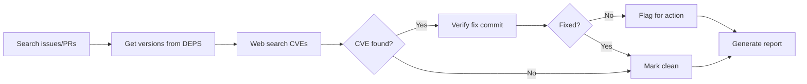

# Security Audit Skill

Investigate security status of SkiaSharp's native dependencies. Produces a report with actionable recommendations.

> ℹ️ This skill is **read-only**. To create PRs and fix issues, use the `native-dependency-update` skill.

## Key References

- **[documentation/dependencies.md](../../../documentation/dependencies.md)** — Which dependencies to audit, cgmanifest format, known false positives
- **[references/report-template.md](references/report-template.md)** — Report format templates

## Workflow



### Step 1: Search Issues & PRs

Search mono/SkiaSharp open issues for:
- CVE numbers (e.g., "CVE-2024")
- Keywords: "security", "vulnerability"
- Dependency names: libpng, expat, zlib, webp, harfbuzz, freetype

Search PRs in both mono/SkiaSharp and mono/skia for dependency updates.

### Step 2: Get Dependency Versions

```bash
cd externals/skia/third_party/externals/{dep}
git describe --tags --always
```

Only audit **security-relevant** dependencies (see [dependencies.md](../../../documentation/dependencies.md#security-relevant-process-untrusted-input)).

### Step 3: Web Search for CVEs

```
"{dependency} CVE {current year}"
"{dependency} security vulnerability"
```

### Step 4: Verify Fix Commits (CRITICAL)

> ⚠️ **CVE databases often have WRONG version ranges.** Always verify.

```bash
cd externals/skia/third_party/externals/{dependency}

# Check if fix commit is ancestor of current HEAD
git merge-base --is-ancestor {fix_commit} HEAD && echo "FIXED" || echo "VULNERABLE"
```

**Example:** CVE-2025-27363 claimed FreeType ≤2.13.3 was affected, fix in 2.13.4. Verification showed the fix commit was in 2.13.1 — SkiaSharp's 2.13.3 was already patched.

### Step 5: Check False Positives

Before flagging, verify the CVE actually affects SkiaSharp:
- **MiniZip** (in zlib) — Not compiled, not vulnerable
- **FreeType's bundled zlib** — Separate from Skia's zlib

See [dependencies.md](../../../documentation/dependencies.md#known-false-positives) for details.

### Step 6: Generate Report

Use [references/report-template.md](references/report-template.md).

**Priority order:**
1. 🔴 User-reported + no PR
2. ✅ User-reported + PR ready  
3. 🟡 User-reported + PR needs work
4. 🆕 Undiscovered CVEs
5. ⚪ False positives

## Handoff

After audit, use `native-dependency-update` skill:
- "Merge PR #3458"
- "Update libwebp to 1.6.0"
- "Bump libpng to fix CVE-2024-XXXXX"
