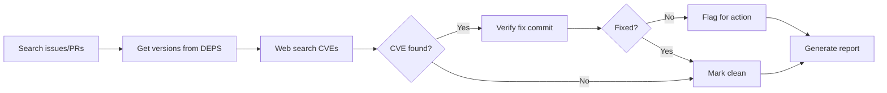

# Security Audit Skill

Investigate security status of SkiaSharp's native dependencies. Produces a report with actionable recommendations.

> ℹ️ This skill is **read-only**. To create PRs and fix issues, use the `native-dependency-update` skill.

## Key References

- **[documentation/dependencies.md](../../../documentation/dependencies.md)** — Which dependencies to audit, cgmanifest format, known false positives
- **[references/report-template.md](references/report-template.md)** — Report format templates
- **[references/best-practices-checklist.md](references/best-practices-checklist.md)** — Step-by-step checklist to avoid common mistakes

## Workflow



### Step 1: Search Issues & PRs

Search mono/SkiaSharp for CVEs, security keywords, and dependency names. Check BOTH open AND recently closed items (last 30 days).

> See [best-practices-checklist.md](references/best-practices-checklist.md) Step 1 for detailed execution steps and examples.

### Step 2: Get Dependency Versions

```bash
cd externals/skia/third_party/externals/{dep}
git describe --tags --always
```

Only audit **security-relevant** dependencies (see [dependencies.md](../../../documentation/dependencies.md#security-relevant-process-untrusted-input)).

### Step 3: Web Search for CVEs

**Source Hierarchy (ALWAYS follow this order):**

1. **Primary Sources (Most Reliable):** NVD, Red Hat Security Advisory, OpenCVE
2. **Secondary Sources (Use with caution):** Security blogs, news sites

**Critical Rule:** If sources conflict, trust NVD/Red Hat.

> See [best-practices-checklist.md](references/best-practices-checklist.md) Step 2 for search queries and examples.

### Step 4: Verify Fix Commits

> ⚠️ **CRITICAL:** Always verify version ranges from authoritative sources (NVD, Red Hat, OpenCVE). Secondary sources often have incorrect information.

**Process:** Check NVD/Red Hat FIRST for affected version range, then verify fix commit if mentioned.

> See [best-practices-checklist.md](references/best-practices-checklist.md) Step 3 for verification process, example tables, and the CVE-2025-27363 case study.

### Step 5: Check False Positives

Before flagging, verify the CVE actually affects SkiaSharp:
- **MiniZip** (in zlib) — Not compiled, not vulnerable
- **FreeType's bundled zlib** — Separate from Skia's zlib

See [dependencies.md](../../../documentation/dependencies.md#known-false-positives) for details.

### Step 6: Generate Report

Use [references/report-template.md](references/report-template.md).

**Priority order:**
1. 🔴 User-reported + no PR
2. ✅ User-reported + PR ready  
3. 🟡 User-reported + PR needs work
4. 🆕 Undiscovered CVEs
5. ⚪ False positives

## Handoff

After audit, use `native-dependency-update` skill:
- "Merge PR #3458"
- "Update libwebp to 1.6.0"
- "Bump libpng to fix CVE-2024-XXXXX"

---

## Lessons Learned from Past Audits

### January 2026 Audit - Key Mistakes

1. **Trusted secondary sources** → NVD showed only ≤2.13.0 vulnerable, blogs claimed ≤2.13.3
2. **Missed recent activity** → libwebp PR merged during audit but not detected
3. **Premature classification** → Reported CRITICAL before NVD verification

> For detailed examples and prevention steps, see [best-practices-checklist.md](references/best-practices-checklist.md) "Common Mistakes" section.

### Best Practices Summary

**Critical Rules:**
- ✅ **NVD/Red Hat first** - Always verify with authoritative sources before classification
- ✅ **Check recent activity** - Search closed PRs/issues from last 30 days
- ✅ **Document corrections** - If initial findings change, explain why

> For detailed execution checklist, see [best-practices-checklist.md](references/best-practices-checklist.md)
