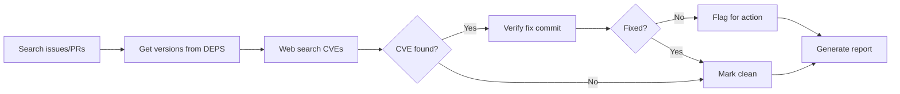

# Security Audit Skill

Investigate security status of SkiaSharp's native dependencies. Produces a report with actionable recommendations.

> ℹ️ This skill is **read-only**. To create PRs and fix issues, use the `native-dependency-update` skill.

## Key References

- **[documentation/dependencies.md](../../../documentation/dependencies.md)** — Which dependencies to audit, cgmanifest format, known false positives
- **[references/report-template.md](references/report-template.md)** — Report format templates
- **[references/best-practices-checklist.md](references/best-practices-checklist.md)** — Step-by-step checklist to avoid common mistakes

## Workflow



### Step 1: Search Issues & PRs

**Search BOTH open AND recently closed issues/PRs** to avoid missing completed work:

Search mono/SkiaSharp for:
- CVE numbers (e.g., "CVE-2024", "CVE-2025")
- Keywords: "security", "vulnerability"
- Dependency names: libpng, expat, zlib, webp, harfbuzz, freetype

**IMPORTANT:** Check PR status and merge dates:
```bash
# Use GitHub API to check recent PRs (last 30 days)
# Look for merged PRs that may have resolved issues during audit
```

Search PRs in both mono/SkiaSharp and mono/skia for dependency updates.

**Example:** During Jan 2026 audit, libwebp PR #3478 was merged on 2026-01-30 but initial search only found open issues. Always check closed items from the last 7-30 days.

### Step 2: Get Dependency Versions

```bash
cd externals/skia/third_party/externals/{dep}
git describe --tags --always
```

Only audit **security-relevant** dependencies (see [dependencies.md](../../../documentation/dependencies.md#security-relevant-process-untrusted-input)).

### Step 3: Web Search for CVEs

**IMPORTANT: Always prioritize authoritative sources in this order:**

1. **Primary Sources (MOST RELIABLE):**
   - NVD (nvd.nist.gov) - National Vulnerability Database
   - Red Hat Security Advisory (access.redhat.com/security)
   - OpenCVE (app.opencve.io)
   - Vendor security pages (e.g., freetype.org, github.com/advisories)

2. **Secondary Sources (USE WITH CAUTION):**
   - Security blogs (markaicode.com, vulert.com, etc.)
   - General security news sites
   - Stack Overflow or forum posts

**Search queries:**
```
site:nvd.nist.gov "{dependency}" CVE-{year}
site:access.redhat.com/security "{dependency}" CVE-{year}
"{dependency} CVE {current year}" site:nvd.nist.gov
```

**Verification Rule:** If secondary sources conflict with NVD/Red Hat, **always trust NVD/Red Hat**.

### Step 4: Verify Fix Commits (CRITICAL)

> ⚠️ **ALWAYS verify version ranges from authoritative sources (NVD, Red Hat, OpenCVE).** Secondary sources often have incorrect information.

**Process:**
1. **Check NVD/Red Hat FIRST** for affected version range
2. **Verify fix commit exists** (if mentioned in CVE)
3. **Cross-check with vendor release notes**

```bash
cd externals/skia/third_party/externals/{dependency}

# Check if fix commit is ancestor of current HEAD
git merge-base --is-ancestor {fix_commit} HEAD && echo "FIXED" || echo "VULNERABLE"
```

**Example (CVE-2025-27363):** 
- **Secondary sources claimed:** FreeType ≤2.13.3 affected
- **NVD/Red Hat confirmed:** Only ≤2.13.0 affected, fix in 2.13.4
- **Result:** SkiaSharp's 2.13.3 was NOT vulnerable despite blog posts claiming otherwise
- **Lesson:** Always verify with NVD/Red Hat before reporting CRITICAL status

### Step 5: Check False Positives

Before flagging, verify the CVE actually affects SkiaSharp:
- **MiniZip** (in zlib) — Not compiled, not vulnerable
- **FreeType's bundled zlib** — Separate from Skia's zlib

See [dependencies.md](../../../documentation/dependencies.md#known-false-positives) for details.

### Step 6: Generate Report

Use [references/report-template.md](references/report-template.md).

**Priority order:**
1. 🔴 User-reported + no PR
2. ✅ User-reported + PR ready  
3. 🟡 User-reported + PR needs work
4. 🆕 Undiscovered CVEs
5. ⚪ False positives

## Handoff

After audit, use `native-dependency-update` skill:
- "Merge PR #3458"
- "Update libwebp to 1.6.0"
- "Bump libpng to fix CVE-2024-XXXXX"

---

## Lessons Learned from Past Audits

### January 2026 Audit - Key Mistakes and Corrections

**Mistake 1: Trusted Secondary Sources**
- **What happened:** Initially reported freetype CVE-2025-27363 as CRITICAL affecting 2.13.3 based on blog posts
- **Reality:** NVD and Red Hat confirmed only ≤2.13.0 vulnerable
- **Fix:** Always check NVD/Red Hat FIRST before trusting security blogs

**Mistake 2: Missed Recently Completed Work**
- **What happened:** Reported libwebp as "in progress" when PR was actually merged
- **Reality:** PR #3478 merged during audit, issue #3465 closed
- **Fix:** Check recently closed PRs (last 7-30 days) and issue status via API

**Mistake 3: Conservative Reporting Without Verification**
- **What happened:** Reported CRITICAL status based on incomplete information
- **Reality:** Could have verified with git commit checks or NVD first
- **Fix:** Complete verification BEFORE classification, not after

### Best Practices Summary

**Critical Rules:**
- ✅ **NVD/Red Hat first** - Always verify with authoritative sources before classification
- ✅ **Check recent activity** - Search closed PRs/issues from last 30 days
- ✅ **Document corrections** - If initial findings change, explain why

> For detailed execution checklist, see [best-practices-checklist.md](references/best-practices-checklist.md)
