# Security Audit Skill

Investigate security status of SkiaSharp's native dependencies. Produces a report with actionable recommendations.

> ℹ️ This skill is **read-only**. To create PRs and fix issues, use the `native-dependency-update` skill.

## Workflow Overview

```mermaid
flowchart TD
    subgraph "1. Gather Data"
        A[Search SkiaSharp issues<br/>CVE, security, vulnerability] --> B[Search PRs<br/>mono/SkiaSharp + mono/skia]
        B --> C[Parse DEPS<br/>Get all dependency versions]
    end

    subgraph "2. Proactive Scan"
        C --> D[For each dependency:<br/>web search CVEs]
        D --> E{Current version<br/>in affected range?}
        E -->|Yes| V[⚠️ VERIFY fix commit<br/>against codebase]
        E -->|No| G[Mark as clean]
        V --> E2{Fix commit is<br/>ancestor of HEAD?}
        E2 -->|Yes| G2[Mark as clean<br/>CVE db was wrong]
        E2 -->|No| F[Note: CVE, severity, min fix version]
    end

    subgraph "3. Cross-Reference"
        F --> H[Match: Issues ↔ PRs ↔ CVEs]
        H --> I{Has issue?}
        I -->|Yes| J{Has PR?}
        I -->|No| K[🆕 Undiscovered]
        J -->|Yes| L{PR sufficient?}
        J -->|No| M[🔴 Needs attention]
        L -->|Yes| N[✅ Ready to merge]
        L -->|No| O[🟡 In progress]
    end

    subgraph "4. Validate"
        K & M & N & O --> P{Affects SkiaSharp?}
        P -->|No| Q[⚪ False positive]
        P -->|Yes| R[Keep status]
    end

    subgraph "5. Report"
        Q & R & G & G2 --> S[Generate report<br/>Priority: User-reported → Severity → Proactive]
    end
```



### Priority Order

1. **🔴 User-reported + no PR** → Users are waiting (highest visibility)
2. **✅ User-reported + PR ready** → Quick wins
3. **🟡 User-reported + PR needs work** → Unblock these
4. **🆕 Undiscovered CVEs** → Proactive fixes
5. **⚪ False positives** → Close with explanation

## Detailed Steps

### Step 1: User-Reported Issues (Highest Priority)

Search mono/SkiaSharp open issues for security-related content:
- CVE mentions and CVE numbers
- Keywords: "security", "vulnerability", "advisory"
- Dependency names: libpng, expat, zlib, webp, harfbuzz, freetype, libjpeg-turbo

For each issue found, extract:
- Issue number and title
- CVE number(s) if mentioned
- Affected dependency
- Minimum version required to fix (from CVE advisory)

**Why first?** Users are waiting on these. They have the highest visibility and urgency.

### Step 2: PR Coverage

Search for open PRs in both repos that may address security issues:

**mono/SkiaSharp PRs:**
- Search for dependency names, CVE numbers, "security", "bump", "update"

**mono/skia PRs:**
- Same search — these contain the actual DEPS changes

Note PRs that:
- Address reported issues
- Fix CVEs without a corresponding issue (silent fixes)

### Step 3: Dependency Inventory

Parse `externals/skia/DEPS` to build a complete dependency list with current versions:

```bash
# Check version for each dependency
cd externals/skia/third_party/externals/{dep}
git describe --tags --abbrev=0 2>/dev/null || git log -1 --format='%H (no tag)'
```

**Security-relevant dependencies:**

| Dependency | DEPS Key | Typical CVE Types |
|------------|----------|-------------------|
| libpng | `third_party/externals/libpng` | Buffer overflows, DoS |
| libexpat | `third_party/externals/expat` | XXE, memory corruption |
| zlib | `third_party/externals/zlib` | Buffer overflows |
| libwebp | `third_party/externals/libwebp` | Heap buffer overflow |
| harfbuzz | `third_party/externals/harfbuzz` | Rare; shaping bugs |
| freetype | `third_party/externals/freetype` | Font parsing vulnerabilities |
| libjpeg-turbo | `third_party/externals/libjpeg-turbo` | Decoding vulnerabilities |
| brotli | `third_party/externals/brotli` | Compression bugs |

### Step 4: Proactive CVE Scan

For **each** dependency (not just those with issues), search for CVEs:

```
web_search: "{dependency} CVE security vulnerabilities {current year}"
web_search: "{dependency} {version} CVE"
```

Check:
- Is the current version affected?
- What's the minimum fixed version?
- What's the severity (CVSS score)?
- Is it exploited in the wild?

### Step 4b: Verify Fix Against Codebase (CRITICAL)

> ⚠️ **Do NOT trust CVE database version ranges!** They are often inaccurate.
> Always verify fix commits against the actual codebase before flagging a dependency.

CVE databases (NVD, security news) frequently have **wrong version ranges**. For example:
- NVD may claim "affects ≤2.13.3, fixed in 2.13.4"
- But the fix commit was actually merged before 2.13.1

**For each CVE that appears to affect a dependency:**

1. **Find the fix commit** (from CVE advisory, security tracker, or upstream changelog)
2. **Check if fix is in current version:**
   ```bash
   cd externals/skia/third_party/externals/{dependency}
   
   # Check if fix commit is ancestor of current HEAD
   git merge-base --is-ancestor {fix_commit} HEAD && echo "FIXED" || echo "VULNERABLE"
   
   # Or check if fix is in a tag that's ancestor of HEAD
   git merge-base --is-ancestor {fixed_version_tag} HEAD && echo "FIXED" || echo "VULNERABLE"
   ```

3. **Only flag if verification confirms vulnerability:**
   - If fix commit IS ancestor of HEAD → Mark as ✅ Clean (already fixed)
   - If fix commit is NOT ancestor → Mark as 🔴 Needs attention

**Example verification:**
```bash
# CVE-2025-27363 claims FreeType ≤2.13.3 affected, fix in 2.13.4
# But let's verify the actual fix commit:
cd externals/skia/third_party/externals/freetype
git merge-base --is-ancestor ef636696524b081f1b8819eb0c6a0b932d35757d HEAD
# Returns 0 (success) = fix IS present, CVE database was WRONG
```

**Why this matters:** In January 2026, CVE-2025-27363 was incorrectly flagged for FreeType 2.13.3 
because web sources claimed "fix in 2.13.4". Verification showed the fix commit was actually 
included in 2.13.1, and SkiaSharp's 2.13.3 was already patched.

### Step 5: Cross-Reference

Build a matrix matching issues ↔ PRs ↔ CVEs:

| CVE | Issue | PR (SkiaSharp) | PR (skia) | Status |
|-----|-------|----------------|-----------|--------|
| CVE-2024-XXXXX | #1234 | #1235 | #99 | ✅ Covered |
| CVE-2024-YYYYY | #1236 | — | — | 🔴 Needs PR |
| CVE-2024-ZZZZZ | — | #1240 | #101 | 🟢 Silent fix |
| CVE-2024-AAAAA | — | — | — | 🆕 Undiscovered |

### Step 6: False Positive Check

For each CVE, verify it actually affects SkiaSharp:

1. Check [references/known-exceptions.md](references/known-exceptions.md)
2. Verify the affected component is compiled/linked by Skia
3. Check if SkiaSharp's usage patterns expose the vulnerability

**Quick reference for known false positives:**
- **MiniZip** (in zlib) — NOT compiled, NOT linked
- **FreeType's bundled zlib** — Separate from Skia's zlib

## Report Format

### Summary Section

```markdown
## Security Audit Report

**Date:** {date}
**Audited:** mono/SkiaSharp native dependencies

### Summary

| Status | Count |
|--------|-------|
| ✅ Ready to merge | N |
| 🟡 In progress | N |
| 🔴 Needs attention | N |
| 🆕 Undiscovered | N |
| ⚪ False positive | N |
```

### Detailed Findings

Use **separate tables per item** to avoid terminal wrapping issues:

```markdown
### 1. ✅ libexpat — Ready to merge

| Field | Value |
|-------|-------|
| Issues | #3389, #3425 |
| CVEs | CVE-2025-59375 (HIGH 7.5), CVE-2024-50602 (Medium 5.9) |
| Current | 2.7.3 |
| Latest | 2.7.3 |
| PR | #3458 (CI passing) |

**Action:** Merge when CI passes

---

### 2. 🔴 libpng — Needs attention

| Field | Value |
|-------|-------|
| Issues | #1234 |
| CVEs | CVE-2024-XXXXX (HIGH 8.1) |
| Current | 1.6.40 |
| Min fix | 1.6.42 |
| Latest | 1.6.44 |
| PR | None |

**Action:** Create PR to update to 1.6.44

---

### 3. 🆕 brotli — Undiscovered CVE

| Field | Value |
|-------|-------|
| Issues | None |
| CVEs | CVE-2024-YYYYY (Medium 5.5) |
| Current | 1.0.9 |
| Min fix | 1.1.0 |
| Latest | 1.1.0 |
| PR | None |

**Action:** Create issue, then create PR

---

### 4. ⚪ zlib (MiniZip) — False positive

| Field | Value |
|-------|-------|
| Issue | #3285 |
| CVE | CVE-2023-45853 |
| Status | Not vulnerable |

**Reason:** CVE affects MiniZip only. Skia does not compile or link MiniZip.

**Action:** Close issue with explanation
```

### Status Legend

| Status | Meaning | Action |
|--------|---------|--------|
| ✅ Ready to merge | PR exists, fixes CVE, CI passing | Merge |
| 🟡 In progress | PR exists but needs work (outdated, CI failing) | Update PR |
| 🔴 Needs attention | User-reported issue, no PR | Create PR |
| 🆕 Undiscovered | CVE found proactively, no issue/PR | Create issue + PR |
| ⚪ False positive | CVE doesn't affect SkiaSharp | Close with explanation |

### Priority Order

Report findings in this order:

1. **🔴 User-reported + no PR** → Users are waiting
2. **✅ User-reported + PR ready** → Quick wins
3. **🟡 User-reported + PR needs work** → Unblock these
4. **🆕 Undiscovered CVEs** → Proactive fixes
5. **⚪ False positives** → Close with explanation

## Recommendations Section

End the report with specific next steps:

```markdown
### Next Steps

1. **Merge PR #3458** — libexpat update is ready
2. **Update libwebp PR** — Current targets 1.4.0, latest is 1.6.0
3. **Create PR for libpng** — Run: `bump libpng to 1.6.44`
4. **Close #3285** — zlib/MiniZip CVE is false positive
```

## Known Exceptions

Some components bundled in dependencies are **NOT used** by SkiaSharp. CVEs in these components are false positives.

👉 See [references/known-exceptions.md](references/known-exceptions.md) for the full list with evidence.

**Quick reference:**
- **MiniZip** (in zlib) — NOT compiled, NOT linked
- **FreeType's bundled zlib** — Separate from Skia's zlib; check FreeType version independently

## Notes

- **⚠️ ALWAYS verify fix commits** — CVE databases have inaccurate version ranges; verify against actual codebase
- **Severity**: Focus on High/Critical CVEs first (CVSS ≥ 7.0)
- **Exploitability**: Prioritize CVEs exploited in the wild
- **User visibility**: User-reported issues get priority over proactive finds

## Handoff to Fixes

After completing the audit, the user can:

1. **Merge ready PRs** — Direct action if they have permissions
2. **Update outdated PRs** — Use `native-dependency-update` skill
3. **Create missing PRs** — Use `native-dependency-update` skill

Example handoffs:
- "Merge PR #3458"
- "Update libwebp to 1.6.0"
- "Bump libpng to fix CVE-2024-XXXXX"
