# Security Audit Skill

Investigate security status of SkiaSharp's native dependencies. Produces a report with actionable recommendations.

> ℹ️ This skill is **read-only**. To create PRs and fix issues, use the `native-dependency-update` skill.

## Key References

- **[documentation/dependencies.md](../../../documentation/dependencies.md)** — Complete list of dependencies, security relevance, CVE database names, known false positives, and verification procedures
- **[references/report-template.md](references/report-template.md)** — Report format templates

## Workflow Overview

```mermaid
flowchart TD
    subgraph "1. Gather Data"
        A[Search SkiaSharp issues<br/>CVE, security, vulnerability] --> B[Search PRs<br/>mono/SkiaSharp + mono/skia]
        B --> C[Parse DEPS<br/>Get all dependency versions]
    end

    subgraph "2. Proactive Scan"
        C --> D[For each dependency:<br/>web search CVEs]
        D --> E{Current version<br/>in affected range?}
        E -->|Yes| V[⚠️ VERIFY fix commit<br/>against codebase]
        E -->|No| G[Mark as clean]
        V --> E2{Fix commit is<br/>ancestor of HEAD?}
        E2 -->|Yes| G2[Mark as clean<br/>CVE db was wrong]
        E2 -->|No| F[Note: CVE, severity, min fix version]
    end

    subgraph "3. Cross-Reference"
        F --> H[Match: Issues ↔ PRs ↔ CVEs]
        H --> I{Has issue?}
        I -->|Yes| J{Has PR?}
        I -->|No| K[🆕 Undiscovered]
        J -->|Yes| L{PR sufficient?}
        J -->|No| M[🔴 Needs attention]
        L -->|Yes| N[✅ Ready to merge]
        L -->|No| O[🟡 In progress]
    end

    subgraph "4. Validate"
        K & M & N & O --> P{Affects SkiaSharp?}
        P -->|No| Q[⚪ False positive]
        P -->|Yes| R[Keep status]
    end

    subgraph "5. Report"
        Q & R & G & G2 --> S[Generate report<br/>Priority: User-reported → Severity → Proactive]
    end
```



## Steps

### Step 1: Search User-Reported Issues

Search mono/SkiaSharp open issues for CVE mentions, "security", "vulnerability", and dependency names.

**Why first?** Users are waiting on these. Highest visibility and urgency.

### Step 2: Search PR Coverage

Search for open PRs in both repos (mono/SkiaSharp and mono/skia) that may address security issues.

### Step 3: Build Dependency Inventory

Parse `externals/skia/DEPS` to get current versions. Check which dependencies are security-relevant.

👉 See [documentation/dependencies.md](../../../documentation/dependencies.md#security-relevant-dependencies) for the list of dependencies to audit.

### Step 4: Proactive CVE Scan

For each security-relevant dependency, web search for CVEs:
```
"{dependency} CVE security vulnerabilities {current year}"
```

### Step 5: Verify Fix Against Codebase (CRITICAL)

> ⚠️ **Do NOT trust CVE database version ranges!** Always verify fix commits.

👉 See [documentation/dependencies.md](../../../documentation/dependencies.md#cve-verification-process) for the verification procedure.

```bash
cd externals/skia/third_party/externals/{dependency}
git merge-base --is-ancestor {fix_commit} HEAD && echo "FIXED" || echo "VULNERABLE"
```

### Step 6: Cross-Reference

Build a matrix matching issues ↔ PRs ↔ CVEs.

### Step 7: Check False Positives

Verify each CVE actually affects SkiaSharp.

👉 See [documentation/dependencies.md](../../../documentation/dependencies.md#known-false-positives) for known false positives (MiniZip, FreeType bundled zlib).

### Step 8: Generate Report

Use the template from [references/report-template.md](references/report-template.md).

**Priority order for findings:**
1. 🔴 User-reported + no PR
2. ✅ User-reported + PR ready
3. 🟡 User-reported + PR needs work
4. 🆕 Undiscovered CVEs
5. ⚪ False positives

## Handoff to Fixes

After completing the audit, the user can use the `native-dependency-update` skill to:
- Merge ready PRs
- Update outdated PRs
- Create missing PRs

Example handoffs:
- "Merge PR #3458"
- "Update libwebp to 1.6.0"
- "Bump libpng to fix CVE-2024-XXXXX"
