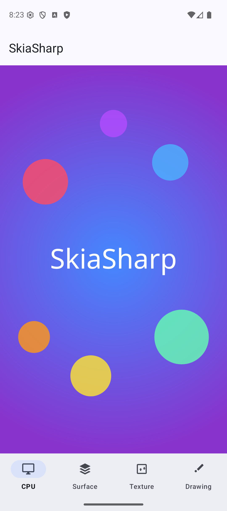
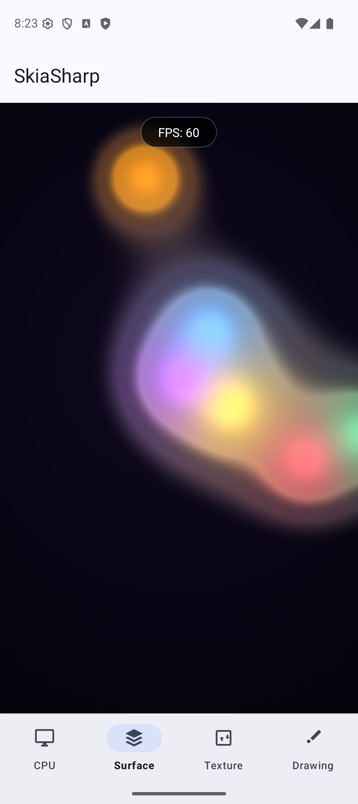
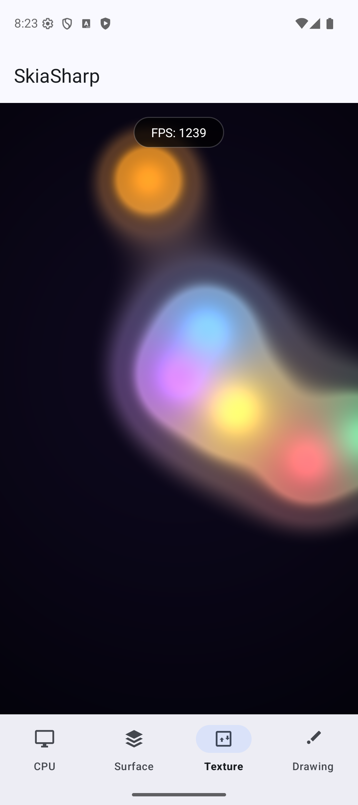
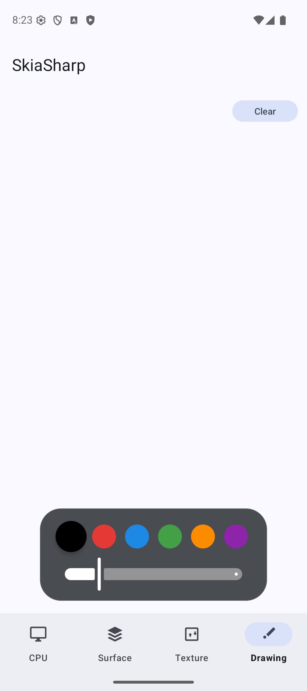
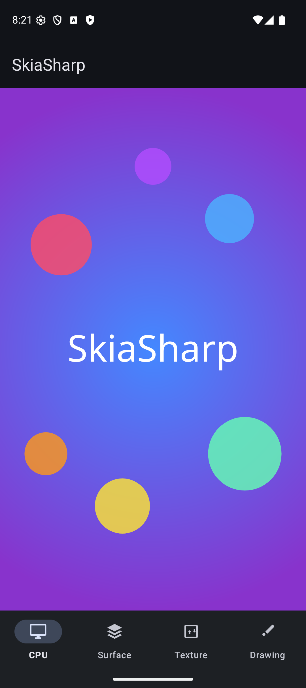
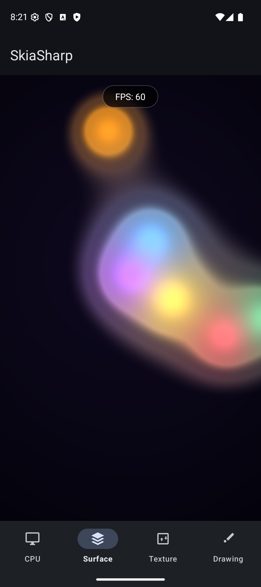
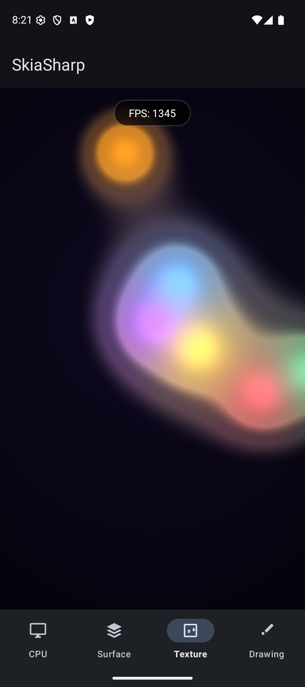
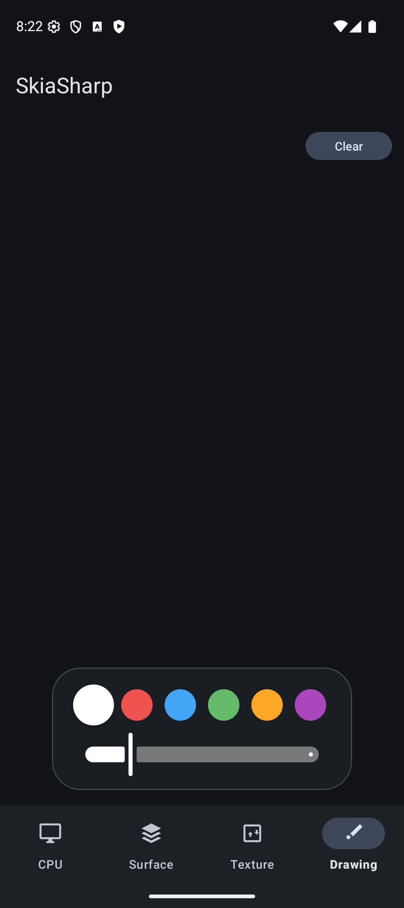

# SkiaSharp Android Sample

Demonstrates all SkiaSharp Android view types with Material 3 bottom navigation, dark/light theming, and touch interaction.

## Sample Pages

This sample shows how to integrate SkiaSharp views into an Android app using native XML layouts, AndroidX fragments, and Material 3 theming. Each view type can be placed in a layout file and configured in the Android designer, just like any other Android view.

### CPU

A static scene rendered entirely on the CPU — a radial gradient background overlaid with semi-transparent colored circles and centered "SkiaSharp" text.

**Features:**

- **`SKCanvasView`** — Software-rendered canvas that draws each frame on the CPU, ideal for static or infrequently updated content.
- **`SKShader`** — Radial gradient background created with `SKShader.CreateRadialGradient`.
- **`SKCanvas.DrawCircle`** — Semi-transparent colored circles composited over the gradient.
- **`SKCanvas.DrawText`** — Centered "SkiaSharp" text rendered with measured alignment.
- **`SKTypeface`** — Custom Noto Sans font loaded from an embedded asset via `SKTypeface.FromStream`.

### GPU (Surface)

A real-time animated shader running at full frame rate on the GPU, with touch interaction that adds a white-hot blob to the metaball field.

**Features:**

- **`SKGLSurfaceView`** — Hardware-accelerated OpenGL ES canvas backed by Android's `SurfaceView`, suitable for full-screen GPU content.
- **`SKRuntimeEffect`** — SkSL metaball "lava lamp" shader compiled at runtime with `SKRuntimeEffect.BuildShader`.
- **Render loop** — Continuous animation driven by `Rendermode.Continuously` with an FPS counter overlay.
- **Touch interaction** — Touch position is passed as a shader uniform, adding a white-hot blob to the metaball field.

### GPU (Texture)

A real-time animated shader running at full frame rate on the GPU, rendered into a `TextureView` that supports transparency, transforms, and compositing within the view hierarchy.

**Features:**

- **`SKGLTextureView`** — Hardware-accelerated OpenGL ES canvas backed by Android's `TextureView`, which supports transparency, transforms, and compositing within the view hierarchy.
- **`SKRuntimeEffect`** — SkSL metaball "lava lamp" shader compiled at runtime with `SKRuntimeEffect.BuildShader`.
- **Render loop** — Continuous animation with an FPS counter overlay.
- **Touch interaction** — Touch position is passed as a shader uniform, adding a white-hot blob to the metaball field.

### Drawing

A freehand drawing canvas with a floating toolbox for choosing colors and brush sizes. Strokes persist across color and size changes.

**Features:**

- **`SKCanvasView`** — Software-rendered canvas used for on-demand drawing, invalidated after each stroke or clear.
- **`SKPath`** — Freehand strokes captured as paths with `MoveTo` and `LineTo` from touch events.
- **`SKTouchEventArgs`** — Pointer tracking for press, move, and release across the canvas.
- **Color palette** — Six selectable colors with dark/light mode variants.
- **Brush size** — Adjustable stroke width (1–50px) via a Material 3 slider.

## Requirements

- [.NET 8 SDK](https://dotnet.microsoft.com/download) or later
- Android workload: `dotnet workload install android`

## Running the Sample

Build and deploy to a connected device or emulator:

```bash
dotnet build -t:Install -f net8.0-android
```

To start on a different page, change `DefaultPage` in `MainActivity.cs`:

```csharp
public static SamplePage DefaultPage { get; set; } = SamplePage.GpuSurface;
```

Available pages: `Cpu` (default), `GpuSurface`, `GpuTexture`, `Drawing`

## Screenshots

| CPU | GPU (Surface) | GPU (Texture) | Drawing |
|---|---|---|---|
|  |  |  |  |
|  |  |  |  |
