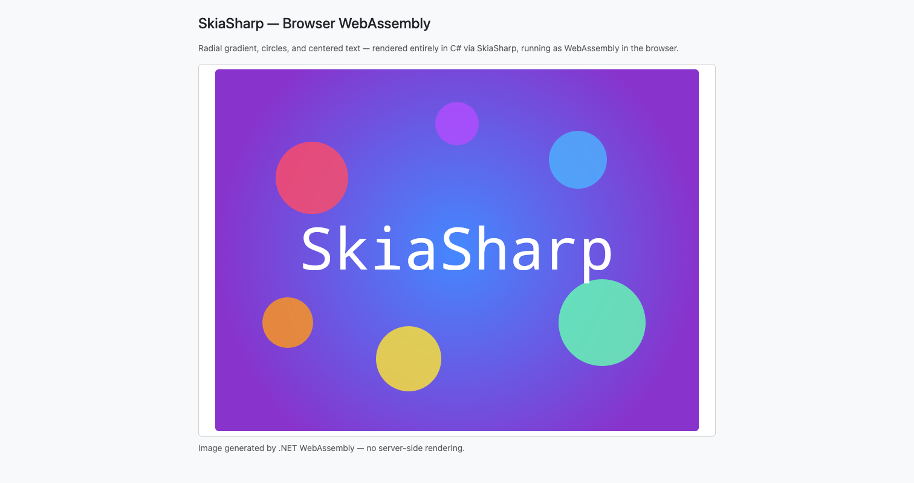

# SkiaSharp Browser WebAssembly Sample

Demonstrates SkiaSharp rendering in the browser via raw .NET WebAssembly (no Blazor). C# renders a scene to a PNG using `[JSExport]`, and JavaScript displays it in an `` element with a Bootstrap layout.



**Features:**

- **`SKSurface`** — Creates a CPU-rendered surface entirely in C# running as WebAssembly.
- **`SKShader`** — Radial gradient background created with `SKShader.CreateRadialGradient`.
- **`SKCanvas.DrawCircle`** — Semi-transparent colored circles composited over the gradient.
- **`SKCanvas.DrawText`** — Centered "SkiaSharp" text rendered with measured alignment.
- **`[JSExport]`** — C# method exported to JavaScript; returns the rendered image as a base64-encoded PNG.
- **Bootstrap 5** — Minimal page styling via CDN.

## Requirements

- [.NET 10 SDK](https://dotnet.microsoft.com/download) or later
- WebAssembly tools workload: `dotnet workload install wasm-tools`

## Running the Sample

Build and run:

```bash
dotnet run --project SkiaSharpSample/SkiaSharpSample.csproj
```

Then open the URL shown in the console (typically `https://localhost:7184`) in a browser.
