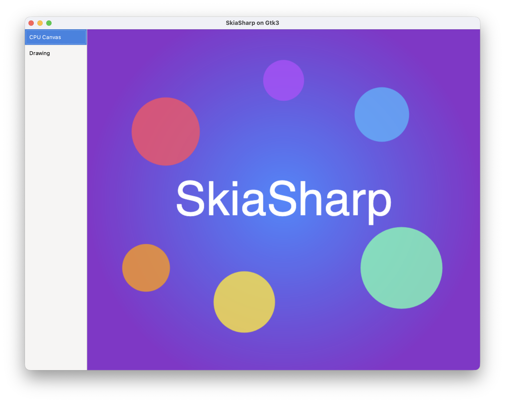
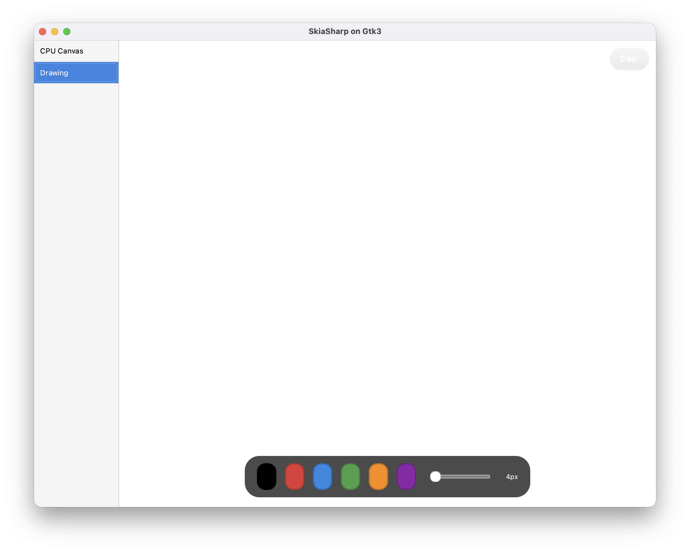

# SkiaSharp GTK 3 Sample

Demonstrates SkiaSharp running in a GTK 3 desktop app with tab-based navigation, Glade layout support, and dark theme detection.

## Sample Pages

This sample shows how to integrate SkiaSharp views into a GTK 3 app. The UI structure is defined in a Glade `.glade` file (editable in the Glade UI designer), with `SKDrawingArea` widgets injected into the layout containers. GTK 3 does not provide a GPU-accelerated SkiaSharp view, so both pages use CPU rendering.

### CPU

A static scene rendered on the CPU — a radial gradient background overlaid with semi-transparent colored circles and centered "SkiaSharp" text.

**Features:**

- **`SKDrawingArea`** — Software-rendered canvas backed by a `Gtk.DrawingArea`, the standard GTK drawing surface.
- **`SKShader`** — Radial gradient background created with `SKShader.CreateRadialGradient`.
- **`SKCanvas.DrawCircle`** — Semi-transparent colored circles composited over the gradient.
- **`SKCanvas.DrawText`** — Centered "SkiaSharp" text rendered with measured alignment.
- **`SKTypeface`** — Custom font loaded via `SKTypeface.FromStream`.

### Drawing

A freehand drawing canvas with a color palette, brush size label, and clear button. Strokes persist across color and size changes.

**Features:**

- **`SKDrawingArea`** — Software-rendered canvas invalidated on demand after each stroke or clear.
- **`SKPath`** — Freehand strokes captured as paths with `MoveTo` and `LineTo` from GTK gesture events.
- **`GestureDrag`** — GTK 3 drag gesture for tracking press, move, and release.
- **`EventControllerScroll`** — Scroll wheel to adjust brush size.
- **Color palette** — Six selectable colors with dark/light mode variants.

## Requirements

- [.NET 8 SDK](https://dotnet.microsoft.com/download) or later
- GTK 3 development libraries:
  - **macOS:** `brew install gtk+3`
  - **Ubuntu/Debian:** `sudo apt-get install libgtk-3-dev`
  - **Fedora:** `sudo dnf install gtk3-devel`

## Running the Sample

Build and run (Linux):

```bash
dotnet run --project SkiaSharpSample/SkiaSharpSample.csproj
```

To start on a different page, change `DefaultPage` in `MainWindow.cs`:

```csharp
public static SamplePage DefaultPage { get; set; } = SamplePage.Drawing;
```

Available pages: `Cpu` (default), `Drawing`

## Screenshots

| CPU | Drawing |
|---|---|
|  |  |
