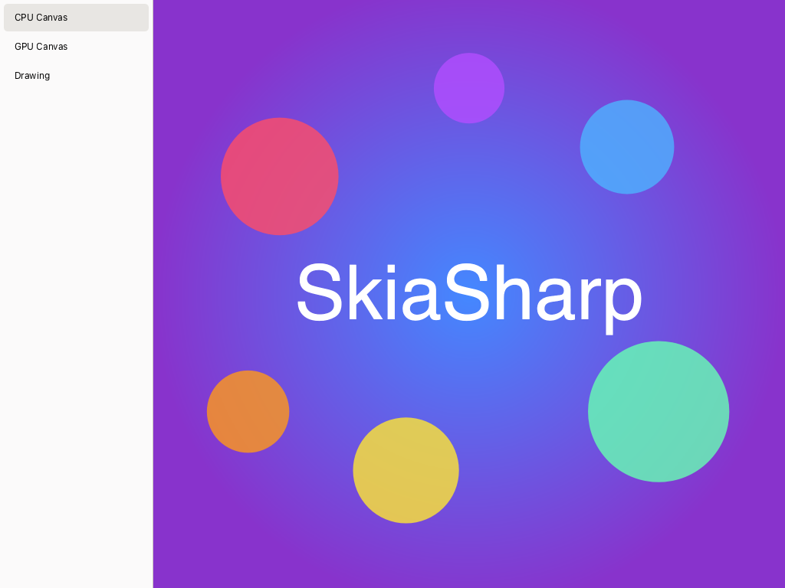
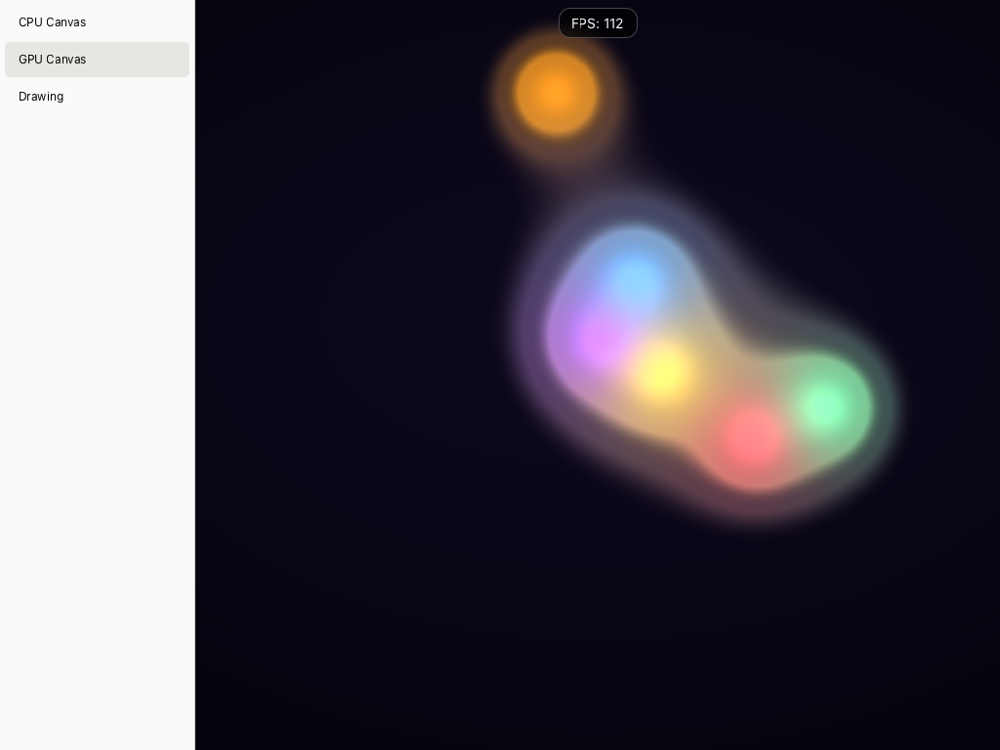

# SkiaSharp GTK 4 Sample

Demonstrates SkiaSharp views in a GTK 4 desktop app with sidebar navigation, UI Builder layout support, and mouse interaction.

## Sample Pages

This sample shows how to integrate SkiaSharp views into a GTK 4 app. The UI structure is defined in `.ui` files (editable in GNOME Builder or Cambalache), with `SKDrawingArea` and `SKGLArea` widgets injected into the layout containers.

### CPU

A static scene rendered on the CPU — a radial gradient background overlaid with semi-transparent colored circles and centered "SkiaSharp" text.

**Features:**

- **`SKDrawingArea`** — Software-rendered canvas backed by a `Gtk.DrawingArea`, the standard GTK 4 drawing surface.
- **`SKShader`** — Radial gradient background created with `SKShader.CreateRadialGradient`.
- **`SKCanvas.DrawCircle`** — Semi-transparent colored circles composited over the gradient.
- **`SKCanvas.DrawText`** — Centered "SkiaSharp" text rendered with measured alignment.
- **`SKFont`** — Text size scaled to the canvas width, using the default typeface.

### GPU

A real-time animated shader running on the GPU via OpenGL or OpenGL ES, with mouse interaction that adds a white-hot blob to the metaball field.

**Features:**

- **`SKGLArea`** — Hardware-accelerated canvas backed by `Gtk.GLArea`, using GTK's available OpenGL or OpenGL ES context.
- **`SKRuntimeEffect`** — SkSL metaball "lava lamp" shader compiled at runtime with `SKRuntimeEffect.BuildShader`.
- **Render loop** — Continuous animation driven by `EnableRenderLoop` with a native GTK FPS counter pill overlay.
- **Mouse interaction** — Press and drag to pass the mouse position as a shader uniform.
- **Lifecycle management** — Render loop starts/stops on GTK map/unmap events to avoid background GPU work when the page is not visible.

### Drawing

A freehand drawing canvas with a floating toolbox for choosing colors and brush sizes, and a clear button. Strokes persist across color and size changes.

**Features:**

- **`SKDrawingArea`** — Software-rendered canvas invalidated on demand after each stroke or clear.
- **`SKPath`** — Freehand strokes captured as paths with `MoveTo` and `LineTo` from GTK gesture events.
- **`GestureDrag`** — GTK 4 drag gesture for tracking press, move, and release.
- **`EventControllerScroll`** — Scroll wheel to adjust brush size.
- **Color palette** — Six selectable colors with a blue ring around the selected swatch, on a fixed white canvas.
- **Brush size** — Adjustable stroke width (1–50px) via a native GTK scale or scroll wheel.
- **Brush cursor** — Semi-transparent circle indicator showing brush size at the cursor position.
- **Adaptive layout** — Native GTK toolbox reflows for narrow windows.
- **DPI scaling** — Physical display pixels by default; `IgnorePixelScaling` selects logical paint coordinates.

## Requirements

- [.NET 10 SDK](https://dotnet.microsoft.com/download) or later
- GTK 4 development libraries:
  - **macOS:** `brew install gtk4`
  - **Ubuntu/Debian:** `sudo apt-get install libgtk-4-dev`
  - **Fedora:** `sudo dnf install gtk4-devel`
  - **Windows:** Install a GTK4 runtime using [MSYS2 or gvsbuild](https://www.gtk.org/docs/installations/windows/) and put its `bin` directory on `PATH`. For MSYS2 UCRT64, install `mingw-w64-ucrt-x86_64-gtk4` and use `C:\msys64\ucrt64\bin`.
- A working GTK display and OpenGL/OpenGL ES driver for the GPU page.
- GTK's libepoxy dispatcher, installed automatically by the GTK packages above. Manually bundled GTK runtimes must include it.

## Running the Sample

Build and run (Linux):

```bash
dotnet run --project SkiaSharpSample/SkiaSharpSample.csproj
```

On macOS, include Homebrew's native library directory so GirCore can load GTK and Graphene:

```bash
DYLD_LIBRARY_PATH="$(brew --prefix)/lib" dotnet run --project SkiaSharpSample/SkiaSharpSample.csproj
```

To start on a different page, change `DefaultPage` in `MainWindow.cs`:

```csharp
public static SamplePage DefaultPage { get; set; } = SamplePage.Drawing;
```

Available pages: `Cpu` (default), `Gpu`, `Drawing`

## Screenshots

| CPU | GPU | Drawing |
|---|---|---|
|  |  |  |
