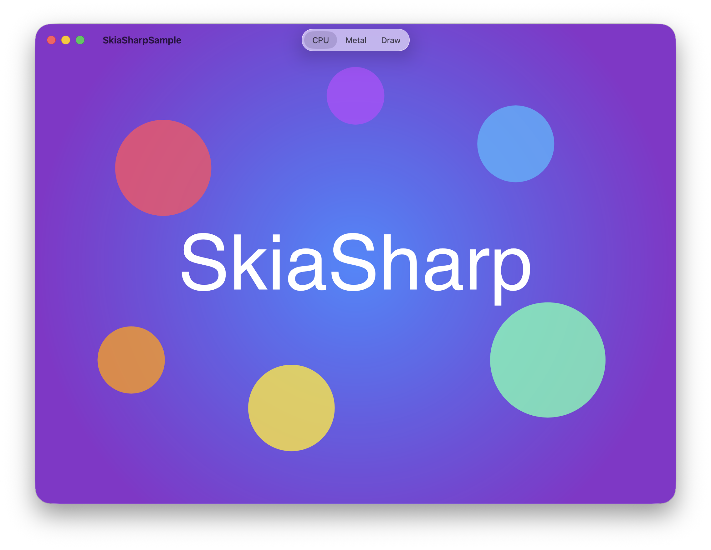
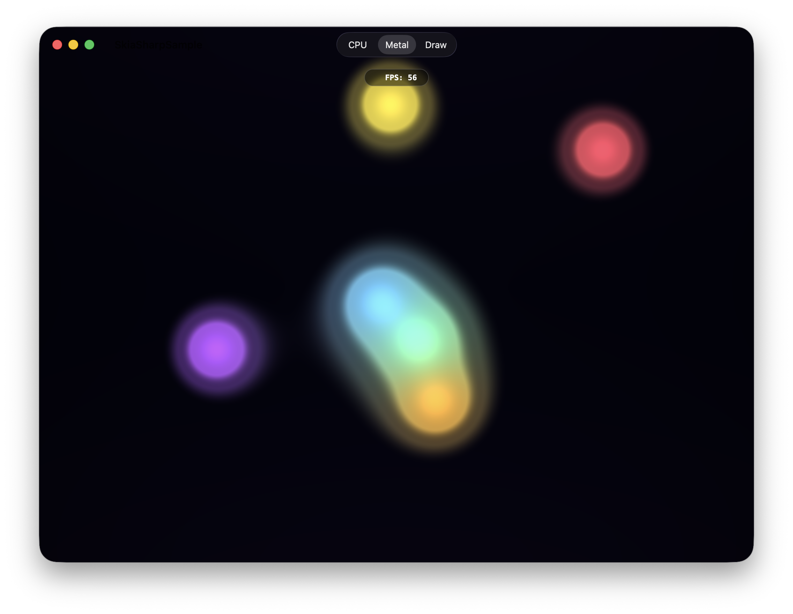
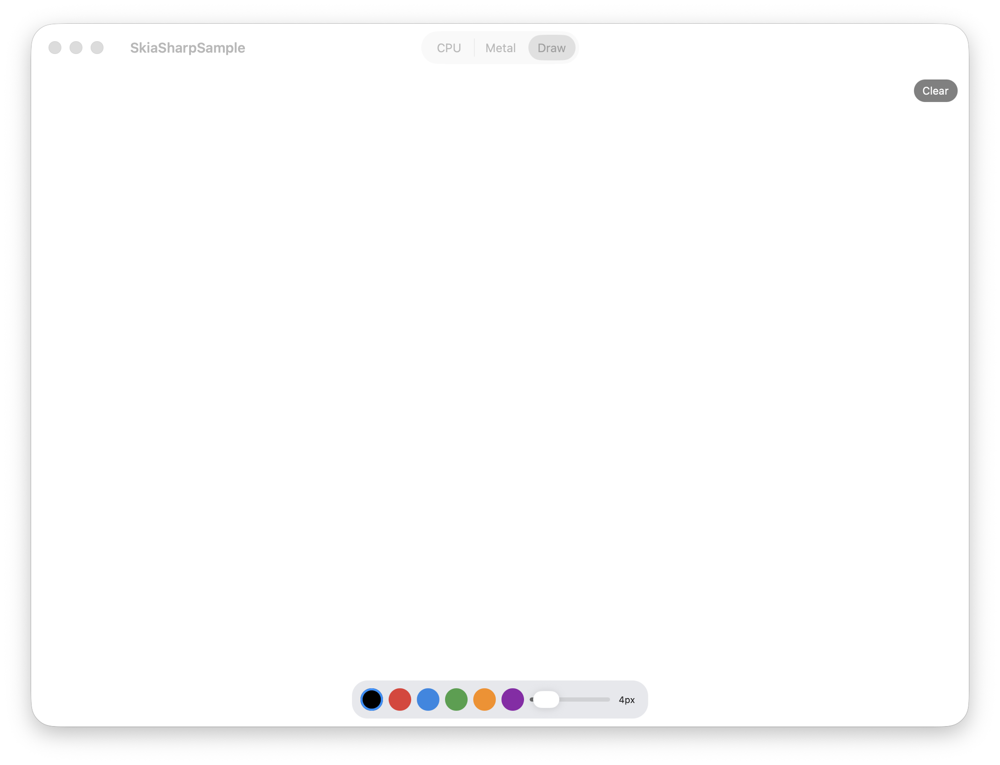
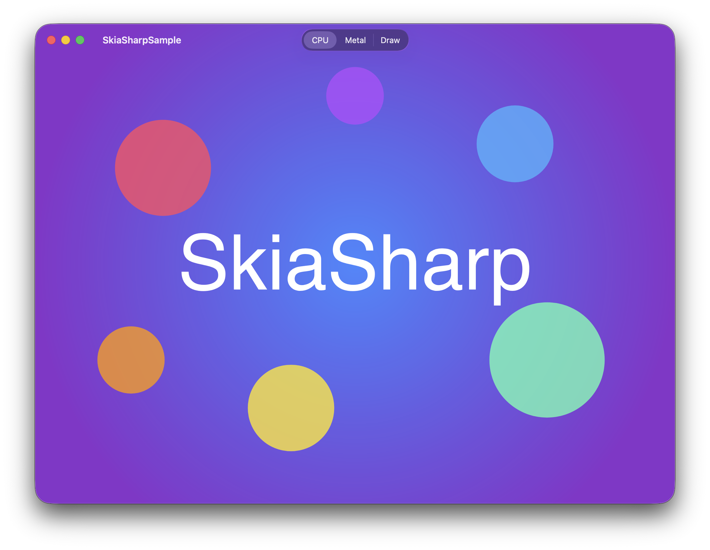
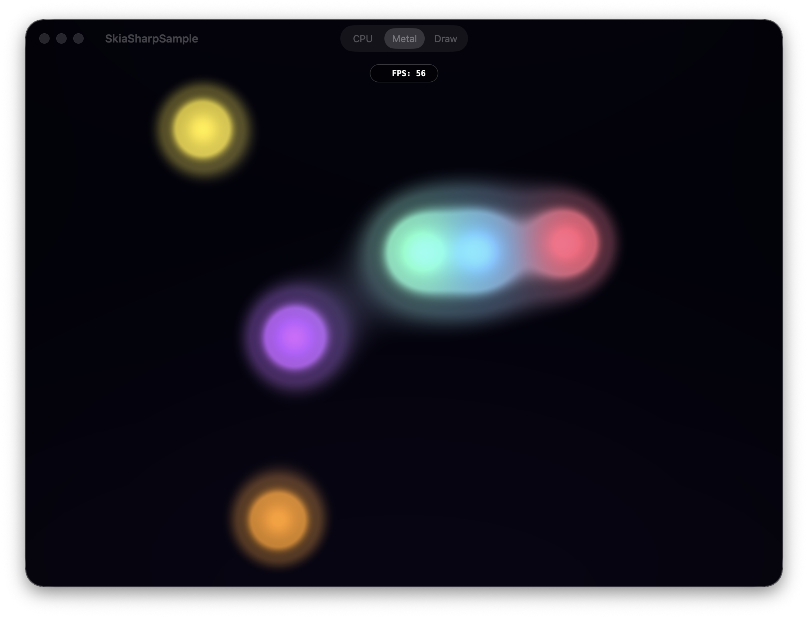
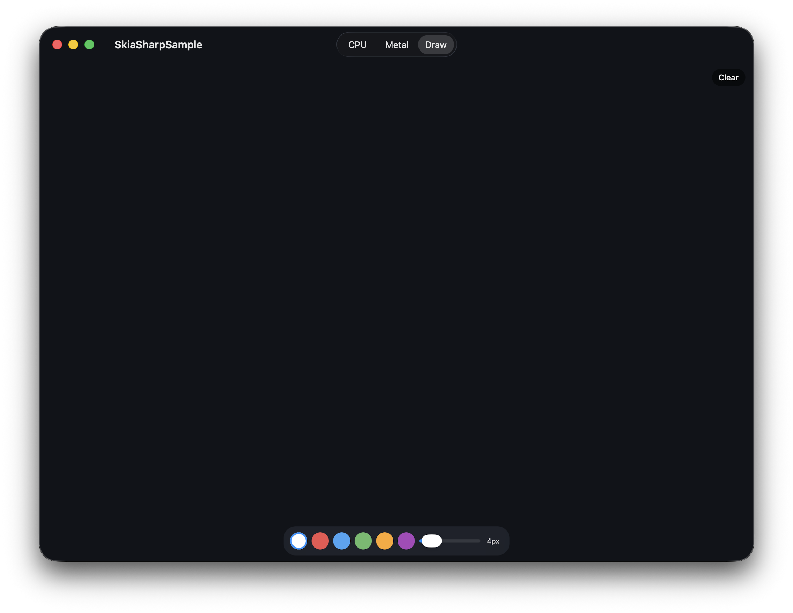

# SkiaSharp Mac Catalyst Sample

Demonstrates all SkiaSharp Mac Catalyst view types with a `UITabBarController`, storyboard-driven views, system dark/light mode support, and touch/trackpad interaction.

## Sample Pages

This sample shows how to integrate SkiaSharp views into a Mac Catalyst app using storyboards and `UIViewController` subclasses. Each view type is placed in a storyboard scene and configured in Interface Builder — view controllers only contain event wiring and paint logic. Navigation uses a `UITabBarController` which renders as a native macOS segmented control in the title bar.

### CPU

A static scene rendered on the CPU — a radial gradient background overlaid with semi-transparent colored circles and centered "SkiaSharp" text.

**Features:**

- **`SKCanvasView`** — Software-rendered canvas backed by a `UIView`, ideal for static or infrequently updated content.
- **`SKShader`** — Radial gradient background created with `SKShader.CreateRadialGradient`.
- **`SKCanvas.DrawCircle`** — Semi-transparent colored circles composited over the gradient.
- **`SKCanvas.DrawText`** — Centered "SkiaSharp" text rendered with measured alignment.

### GPU (Metal)

A real-time animated shader running at full frame rate on the GPU via Apple's Metal framework, with touch/trackpad interaction that adds a white-hot blob to the metaball field.

**Features:**

- **`SKMetalView`** — Hardware-accelerated canvas backed by Metal, Apple's modern low-level GPU API.
- **`SKRuntimeEffect`** — SkSL metaball "lava lamp" shader compiled at runtime with `SKRuntimeEffect.BuildShader`.
- **Render loop** — Continuous animation with `MTKView` pause/resume lifecycle and an FPS counter overlay.
- **Touch interaction** — Touch/trackpad position is passed as a shader uniform via `UITouch` events.

### Drawing

A freehand drawing canvas with a color palette, brush size slider, and a floating clear button.

**Features:**

- **`SKCanvasView`** — Software-rendered canvas invalidated on demand after each stroke or clear.
- **`SKPath`** — Freehand strokes captured as paths with `MoveTo` and `LineTo` via `UIPanGestureRecognizer`.
- **Color palette** — Six selectable colors with dark/light mode variants.
- **Floating toolbox** — Centered blur-effect toolbar (max 420pt width) with swatch row, brush size slider, and label.
- **Floating clear button** — Top-right pill overlay to clear the canvas.

## Requirements

- [.NET 8 SDK](https://dotnet.microsoft.com/download) or later
- macOS with [Xcode](https://developer.apple.com/xcode/) installed
- Mac Catalyst workload: `dotnet workload install maccatalyst`

## Running the Sample

Build and run:

```bash
dotnet build -t:Run
```

To start on a different page, change `DefaultPage` in `AppDelegate.cs`:

```csharp
public static SamplePage DefaultPage { get; set; } = SamplePage.GpuMetal;
```

Available pages: `Cpu` (default), `GpuMetal`, `Drawing`

## Screenshots

### Light Mode

| CPU | GPU (Metal) | Drawing |
|---|---|---|
|  |  |  |

### Dark Mode

| CPU | GPU (Metal) | Drawing |
|---|---|---|
|  |  |  |
