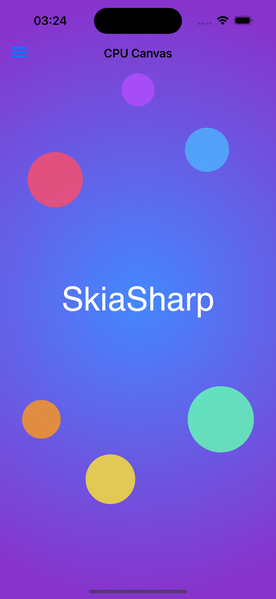
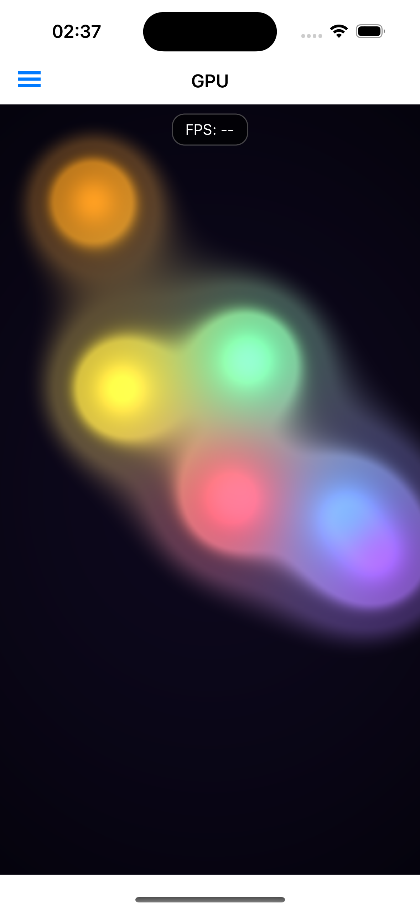
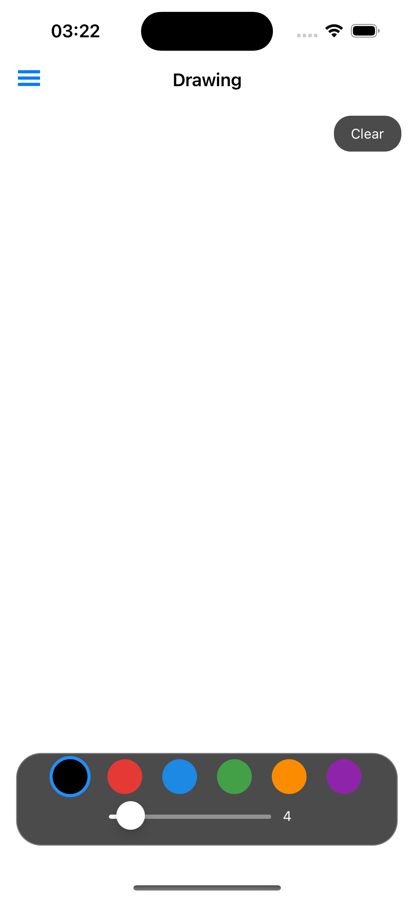
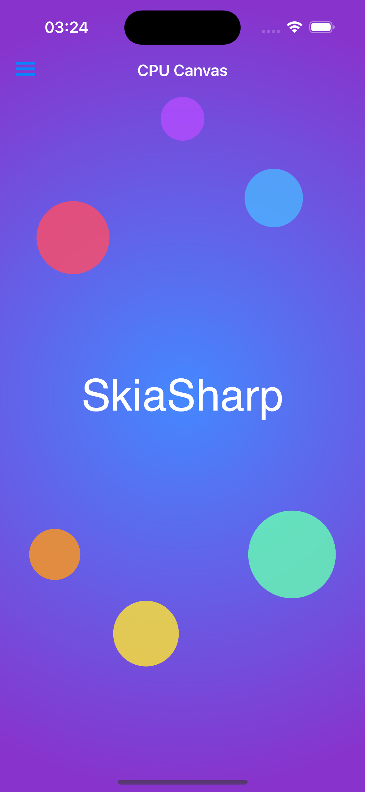
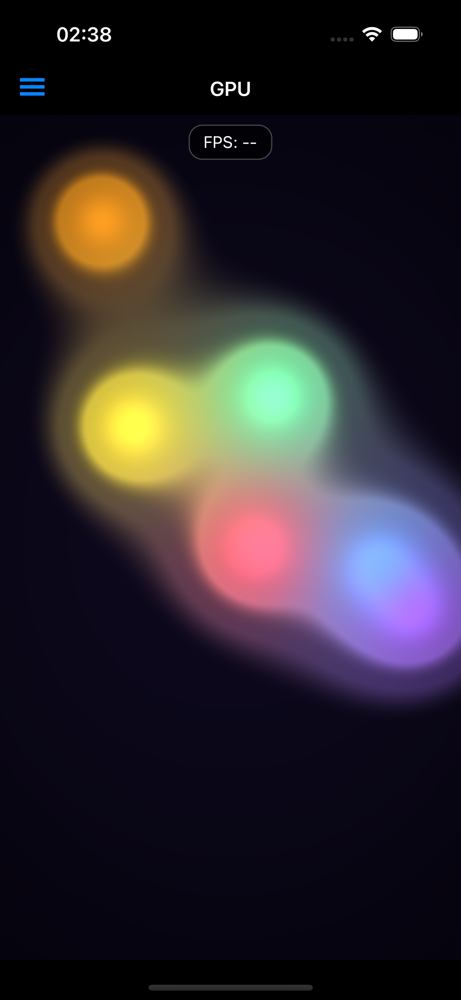
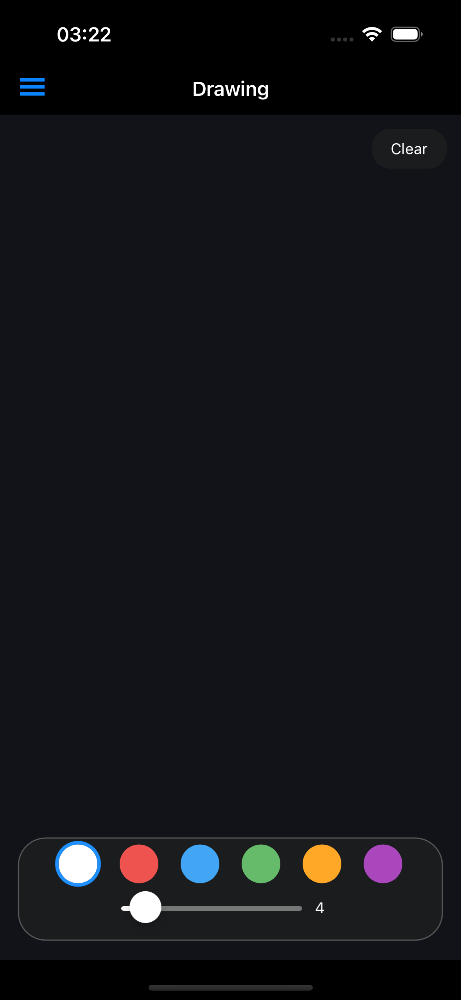

# SkiaSharp MAUI Sample

Demonstrates SkiaSharp views in a .NET MAUI app with Shell navigation, cross-platform dark/light theming, and touch interaction.

## Sample Pages

This sample shows how to integrate SkiaSharp views into a .NET MAUI app using XAML pages. The `SKCanvasView` and `SKGLView` are placed declaratively in `.xaml` files alongside standard MAUI controls, with Shell flyout navigation for page switching.

### CPU

A static scene rendered on the CPU — a radial gradient background overlaid with semi-transparent colored circles and centered "SkiaSharp" text.

**Features:**

- **`SKCanvasView`** — Software-rendered canvas that maps to the platform-native SkiaSharp view on each target (Android, iOS, Mac Catalyst, Windows).
- **`SKShader`** — Radial gradient background created with `SKShader.CreateRadialGradient`.
- **`SKCanvas.DrawCircle`** — Semi-transparent colored circles composited over the gradient.
- **`SKCanvas.DrawText`** — Centered "SkiaSharp" text rendered with measured alignment.
- **`SKTypeface`** — Custom font loaded from an embedded resource via `SKTypeface.FromStream`.

### GPU

A real-time animated shader running at full frame rate on the GPU, with touch interaction that adds a white-hot blob to the metaball field.

**Features:**

- **`SKGLView`** — Hardware-accelerated canvas that maps per-platform: `SKGLTextureView` on Android, `SKGLView` on iOS, `SKMetalView` on Mac Catalyst, `SKSwapChainPanel` on Windows.
- **`SKRuntimeEffect`** — SkSL metaball "lava lamp" shader compiled at runtime with `SKRuntimeEffect.BuildShader`.
- **`EnableRenderLoop`** — Continuous animation driven by the platform's render loop.
- **Touch interaction** — Touch position is passed as a shader uniform via MAUI's `Touch` event.

### Drawing

A freehand drawing canvas with a color palette, brush size slider, and clear button.

**Features:**

- **`SKCanvasView`** — Software-rendered canvas invalidated on demand after each stroke or clear.
- **`SKPath`** — Freehand strokes captured as paths with `MoveTo` and `LineTo` from touch events.
- **`SKTouchEventArgs`** — Cross-platform touch tracking for press, move, and release.
- **Color palette** — Six selectable colors with dark/light mode variants.
- **Brush size** — Adjustable stroke width via a MAUI `Slider` control.

## Requirements

- [.NET 8 SDK](https://dotnet.microsoft.com/download) or later
- MAUI workload: `dotnet workload install maui`

## Running the Sample

Build and run for a specific platform:

```bash
dotnet build -f net8.0-maccatalyst
dotnet build -f net8.0-android
dotnet build -f net8.0-ios
```

To start on a different page, change `DefaultPage` in `App.xaml.cs`:

```csharp
public static SamplePage DefaultPage { get; set; } = SamplePage.Gpu;
```

Available pages: `Cpu` (default), `Gpu`, `Drawing`

## Screenshots

### Light Mode

| CPU | GPU | Drawing |
|---|---|---|
|  |  |  |

### Dark Mode

| CPU | GPU | Drawing |
|---|---|---|
|  |  |  |
