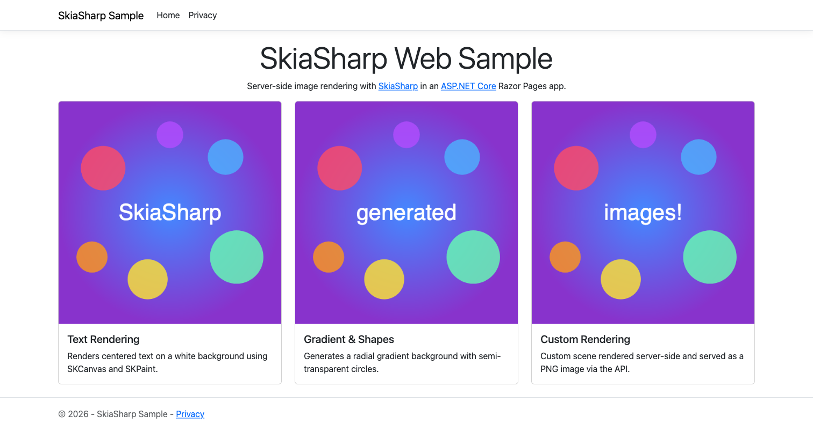

# SkiaSharp Web Sample

Demonstrates server-side image rendering with SkiaSharp in an ASP.NET Core Razor Pages application. An API controller generates PNG images on the fly, and the home page displays them in Bootstrap cards.



**Features:**

- **`SKSurface`** — Creates CPU-rendered surfaces server-side for each API request.
- **`SKCanvas.DrawText`** — Renders dynamic text into PNG images via a REST endpoint.
- **API Controller** — `GET /api/images/{text}` returns a SkiaSharp-rendered PNG with the given text.
- **Razor Pages** — Bootstrap-styled home page displays the generated images in cards.
- **`MapStaticAssets`** — Uses the latest ASP.NET Core static asset serving pipeline.

## Requirements

- [.NET 10 SDK](https://dotnet.microsoft.com/download) or later

## Running the Sample

Build and run:

```bash
dotnet run --project SkiaSharpSample/SkiaSharpSample.csproj
```

Then open the URL shown in the console (typically `https://localhost:7184`) in a browser.
