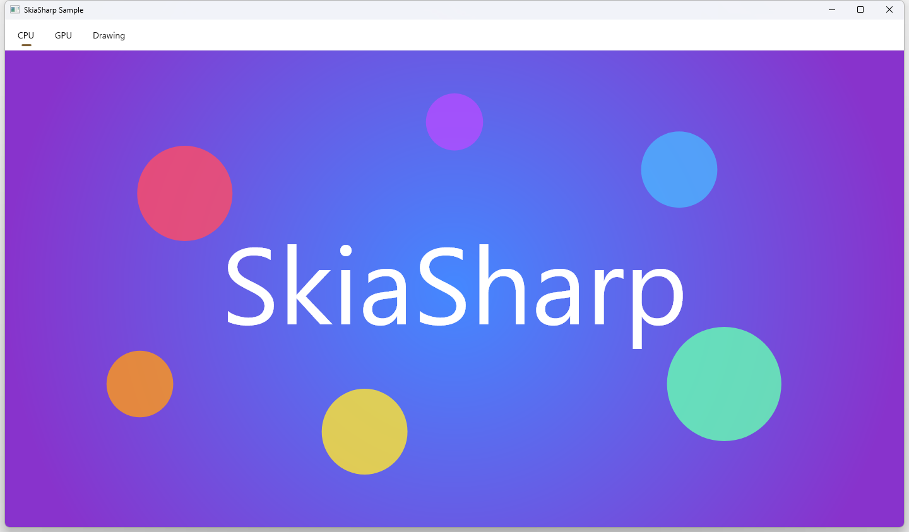
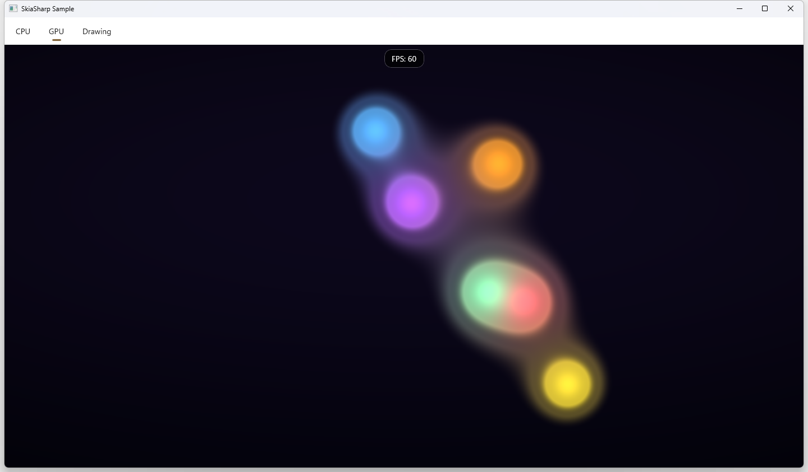
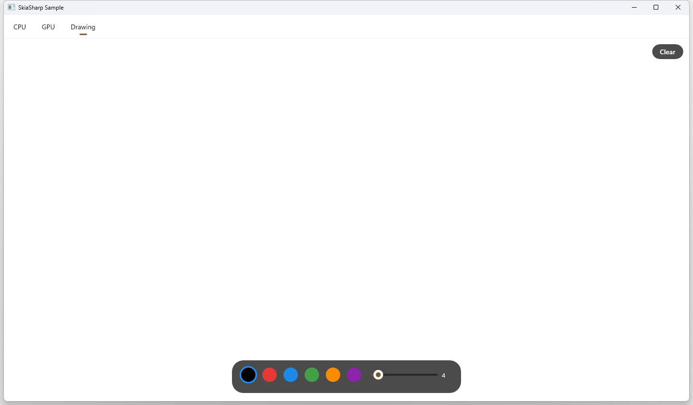
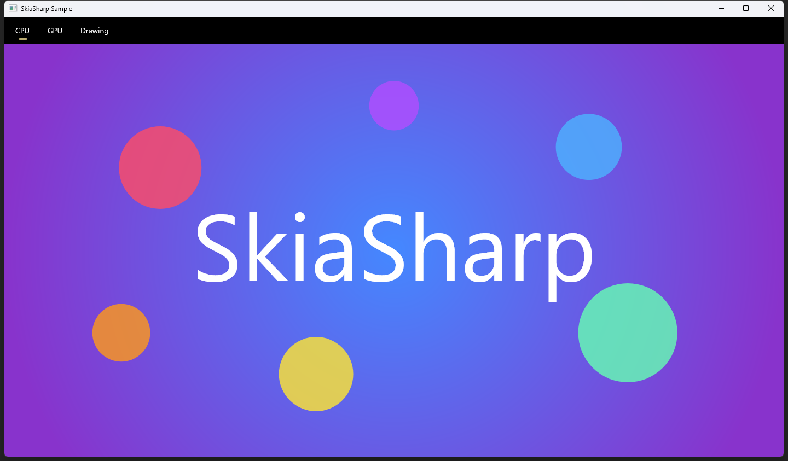
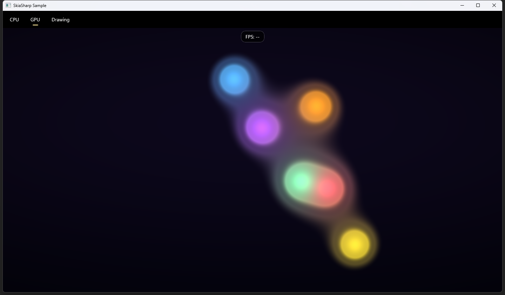
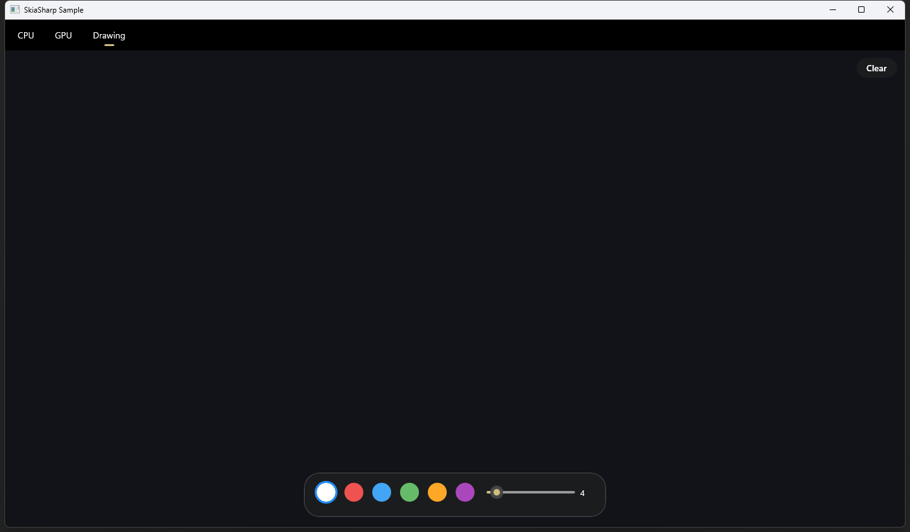

# SkiaSharp WinUI 3 Sample

Demonstrates all SkiaSharp WinUI 3 view types with top tab navigation, dark/light theming, and pointer interaction.

## Sample Pages

This sample shows how to integrate SkiaSharp views into a WinUI 3 desktop app using XAML. The `SKXamlCanvas` and `SKSwapChainPanel` controls are placed declaratively in `.xaml` files alongside standard WinUI controls, and can be configured in the Visual Studio XAML designer.

### CPU

A static scene rendered entirely on the CPU — a radial gradient background overlaid with semi-transparent colored circles and centered "SkiaSharp" text.

**Features:**

- **`SKXamlCanvas`** — Software-rendered canvas backed by a WinUI `FrameworkElement`, integrated into the XAML visual tree and layout system.
- **`SKShader`** — Radial gradient background created with `SKShader.CreateRadialGradient`.
- **`SKCanvas.DrawCircle`** — Semi-transparent colored circles composited over the gradient.
- **`SKCanvas.DrawText`** — Centered "SkiaSharp" text rendered with measured alignment.
- **`SKTypeface`** — Custom font loaded from an embedded resource via `SKTypeface.FromStream`.

### GPU

A real-time animated shader running at full frame rate on the GPU via ANGLE (OpenGL ES over DirectX), with pointer interaction that adds a white-hot blob to the metaball field.

**Features:**

- **`SKSwapChainPanel`** — Hardware-accelerated canvas backed by ANGLE, translating OpenGL ES calls to DirectX for efficient GPU rendering.
- **`SKRuntimeEffect`** — SkSL metaball "lava lamp" shader compiled at runtime with `SKRuntimeEffect.BuildShader`.
- **Render loop** — Continuous animation driven by `EnableRenderLoop` with an FPS counter overlay.
- **Pointer interaction** — Pointer position is passed as a shader uniform, adding a white-hot blob to the metaball field.
- **Lifecycle management** — Render loop starts/stops on `Loaded`/`Unloaded` to avoid background GPU work when the page is not visible.

### Drawing

A freehand drawing canvas with a floating toolbox for choosing colors and brush sizes. Strokes persist across color and size changes.

**Features:**

- **`SKXamlCanvas`** — Software-rendered canvas invalidated on demand after each stroke or clear.
- **`SKPath`** — Freehand strokes captured as paths with `MoveTo` and `LineTo` from pointer events.
- **WinUI pointer events** — `PointerPressed`, `PointerMoved`, `PointerReleased` for cross-device input.
- **`PointerWheelChanged`** — Scroll wheel to adjust brush size.
- **Color palette** — Six selectable colors with dark/light mode variants that update on theme change.
- **Brush size** — Adjustable stroke width (1–50px) via slider or scroll wheel.
- **Brush cursor** — Semi-transparent circle indicator showing brush size at the cursor position.
- **Adaptive layout** — Toolbox reflows for narrow windows using `VisualStateManager` with `AdaptiveTrigger`.
- **DPI scaling** — Canvas coordinates are scaled to handle high-DPI displays correctly.

## Requirements

- [.NET 10 SDK](https://dotnet.microsoft.com/download) or later
- Windows 10 (build 19041 or later)
- [Windows App SDK 1.8](https://learn.microsoft.com/windows/apps/windows-app-sdk/) runtime

## Running the Sample

Build and run with MSBuild (Windows only):

```bash
msbuild SkiaSharpSample/SkiaSharpSample.csproj /p:Platform=x64 /restore
```

To start on a different page, change `DefaultPage` in `MainWindow.xaml.cs`:

```csharp
public static SamplePage DefaultPage { get; set; } = SamplePage.Gpu;
```

Available pages: `Cpu` (default), `Gpu`, `Drawing`

## Screenshots

| CPU | GPU | Drawing |
|---|---|---|
|  |  |  |
|  |  |  |
