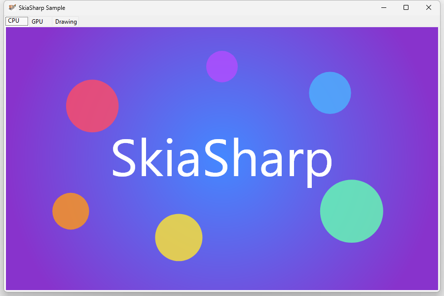
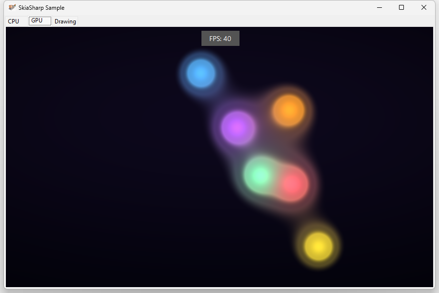
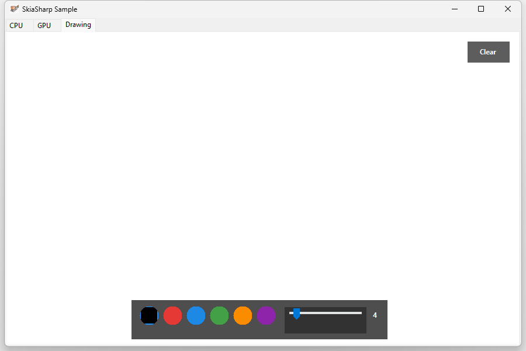
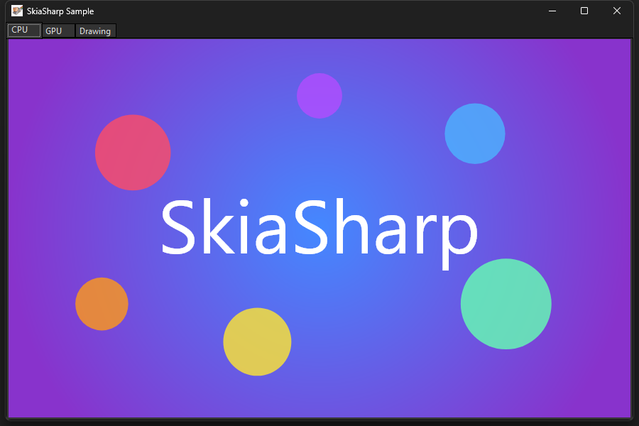
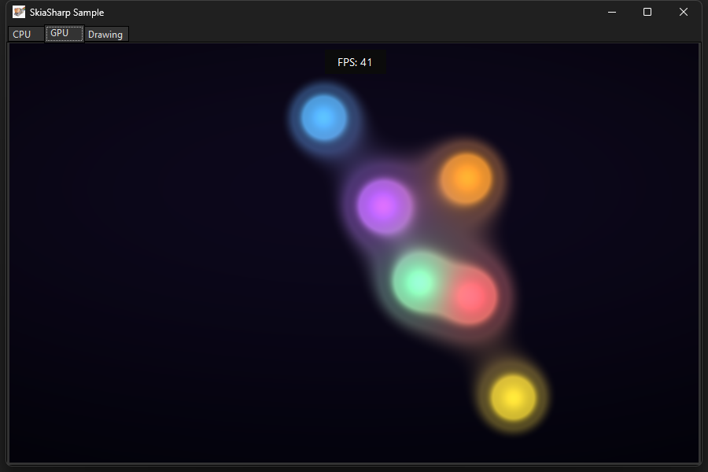
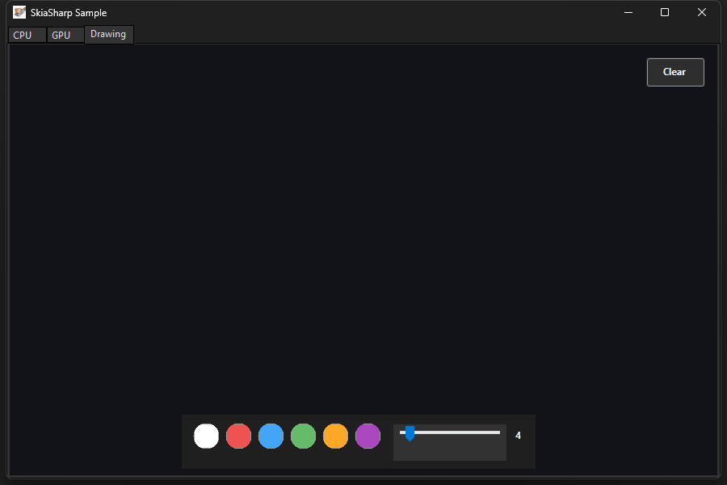

# SkiaSharp Windows Forms Sample

Demonstrates all SkiaSharp Windows Forms view types with top tab navigation, dark/light theming, and mouse interaction.

## Sample Pages

This sample shows how to integrate SkiaSharp views into a Windows Forms app using the Visual Studio designer. The `SKControl` and `SKGLControl` are placed on forms via drag-and-drop in the designer, with layout defined in `.Designer.cs` files and `InitializeComponent()`.

### CPU

A static scene rendered entirely on the CPU — a radial gradient background overlaid with semi-transparent colored circles and centered "SkiaSharp" text.

**Features:**

- **`SKControl`** — Software-rendered canvas backed by a Windows Forms `Control`, supporting drag-and-drop placement in the Visual Studio designer.
- **`SKShader`** — Radial gradient background created with `SKShader.CreateRadialGradient`.
- **`SKCanvas.DrawCircle`** — Semi-transparent colored circles composited over the gradient.
- **`SKCanvas.DrawText`** — Centered "SkiaSharp" text rendered with measured alignment.
- **`SKTypeface`** — Custom font loaded from an embedded resource via `SKTypeface.FromStream`.

### GPU

A real-time animated shader running at full frame rate on the GPU via OpenGL (OpenTK), with mouse interaction that adds a white-hot blob to the metaball field.

**Features:**

- **`SKGLControl`** — Hardware-accelerated canvas backed by OpenGL via OpenTK, supporting drag-and-drop placement in the Visual Studio designer.
- **`SKRuntimeEffect`** — SkSL metaball "lava lamp" shader compiled at runtime with `SKRuntimeEffect.BuildShader`.
- **Render loop** — Continuous animation driven by `Timer` with an FPS counter overlay.
- **Mouse interaction** — Mouse position is passed as a shader uniform, adding a white-hot blob to the metaball field.

### Drawing

A freehand drawing canvas with a floating toolbox for choosing colors and brush sizes. Strokes persist across color and size changes.

**Features:**

- **`SKControl`** — Software-rendered canvas invalidated on demand after each stroke or clear.
- **`SKPath`** — Freehand strokes captured as paths with `MoveTo` and `LineTo` from mouse events.
- **Windows Forms mouse events** — `MouseDown`, `MouseMove`, `MouseUp` for pointer tracking.
- **`MouseWheel`** — Scroll wheel to adjust brush size.
- **Color palette** — Six selectable colors with dark/light mode variants.
- **Brush size** — Adjustable stroke width (1–50px) via slider or scroll wheel.
- **Brush cursor** — Semi-transparent circle indicator showing brush size at the cursor position.
- **FlowLayoutPanel** — Designer-friendly toolbox layout with `Anchor = Bottom` for auto-centering.
- **Dark mode** — `Application.SetColorMode(SystemColorMode.System)` for native WinForms dark theme support.

## Requirements

- [.NET 10 SDK](https://dotnet.microsoft.com/download) or later
- Windows 10 (build 19041 or later)

## Running the Sample

Build and run (Windows only):

```bash
dotnet run --project SkiaSharpSample/SkiaSharpSample.csproj
```

To start on a different page, change `DefaultPage` in `Form1.cs`:

```csharp
public static SamplePage DefaultPage { get; set; } = SamplePage.Gpu;
```

Available pages: `Cpu` (default), `Gpu`, `Drawing`

## Screenshots

| CPU | GPU | Drawing |
|---|---|---|
|  |  |  |
|  |  |  |
