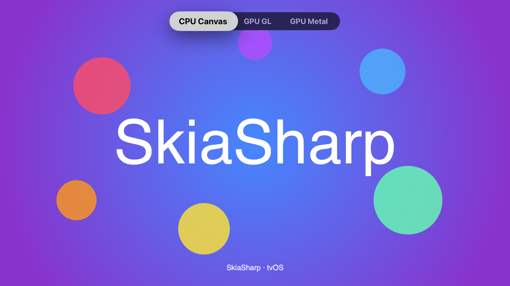
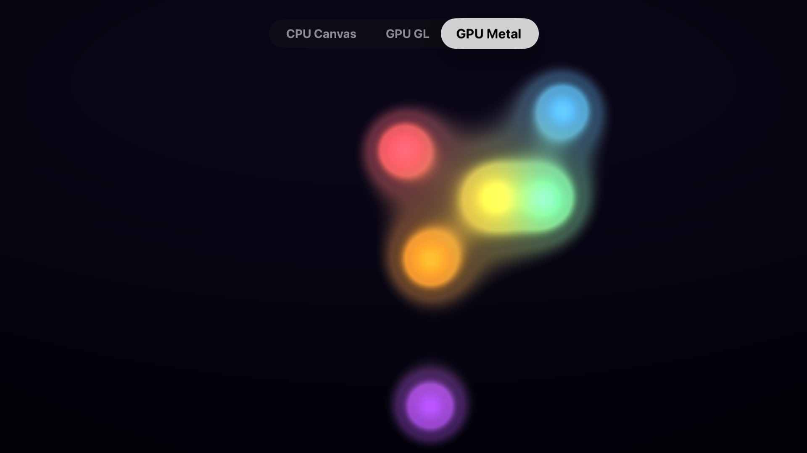

# SkiaSharp tvOS Sample

Demonstrates SkiaSharp views on tvOS with a `UITabBarController` for navigation and support for both OpenGL and Metal GPU backends.

## Sample Pages

This sample shows how to integrate SkiaSharp views into a tvOS app using storyboards and `UIViewController` subclasses. Navigation uses a tab bar pattern suited for the Apple TV remote. There is no drawing page since the Siri Remote does not support direct touch on the screen.

### CPU

A static scene rendered on the CPU — a radial gradient background overlaid with semi-transparent colored circles and centered "SkiaSharp" text.

**Features:**

- **`SKCanvasView`** — Software-rendered canvas backed by a `UIView`, ideal for static or infrequently updated content.
- **`SKShader`** — Radial gradient background created with `SKShader.CreateRadialGradient`.
- **`SKCanvas.DrawCircle`** — Semi-transparent colored circles composited over the gradient.
- **`SKCanvas.DrawText`** — Centered "SkiaSharp" text rendered with measured alignment.

### GPU (OpenGL)

A real-time animated shader running at full frame rate on the GPU via OpenGL ES.

**Features:**

- **`SKGLView`** — Hardware-accelerated canvas backed by GLKit's `GLKView`, using OpenGL ES for rendering.
- **`SKRuntimeEffect`** — SkSL metaball "lava lamp" shader compiled at runtime with `SKRuntimeEffect.BuildShader`.
- **Render loop** — Continuous animation driven by `CADisplayLink` at 60 FPS.

### GPU (Metal)

A real-time animated shader running at full frame rate on the GPU via Apple's Metal framework.

**Features:**

- **`SKMetalView`** — Hardware-accelerated canvas backed by Metal, Apple's modern low-level GPU API.
- **`SKRuntimeEffect`** — SkSL metaball "lava lamp" shader compiled at runtime with `SKRuntimeEffect.BuildShader`.
- **Render loop** — Continuous animation with `MTKView` pause/resume lifecycle at 60 FPS.

## Requirements

- [.NET 8 SDK](https://dotnet.microsoft.com/download) or later
- macOS with [Xcode](https://developer.apple.com/xcode/) installed (tvOS platform required)
- tvOS workload: `dotnet workload install tvos`

## Running the Sample

Build and deploy to a simulator or device:

```bash
dotnet build -f net8.0-tvos
```

To start on a different tab, change `DefaultPage` in `AppDelegate.cs`:

```csharp
public static SamplePage DefaultPage { get; set; } = SamplePage.GpuMetal;
```

Available pages: `Cpu` (default), `GpuGL`, `GpuMetal`

## Screenshots

| CPU | GPU (Metal) |
|---|---|
|  |  |
