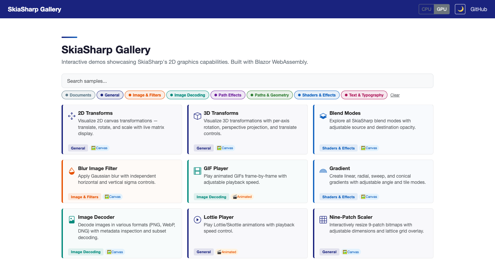
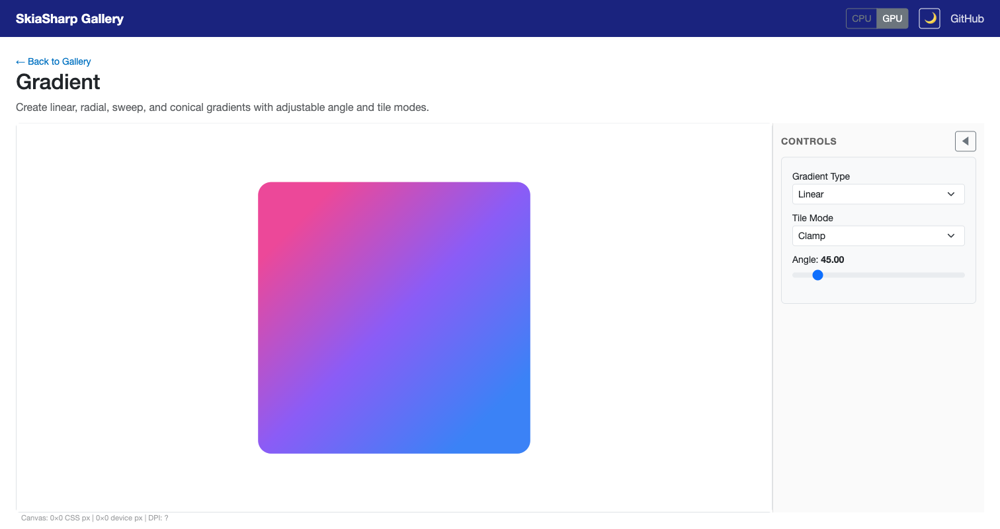
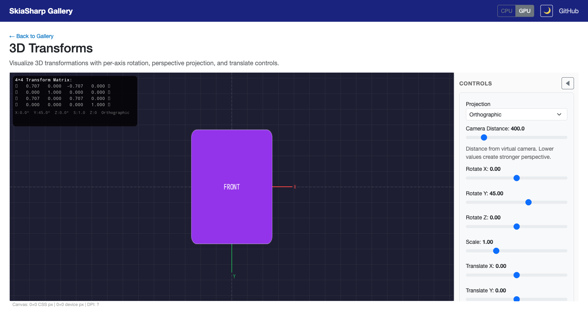
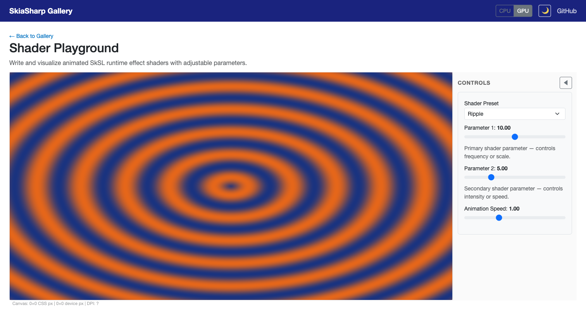
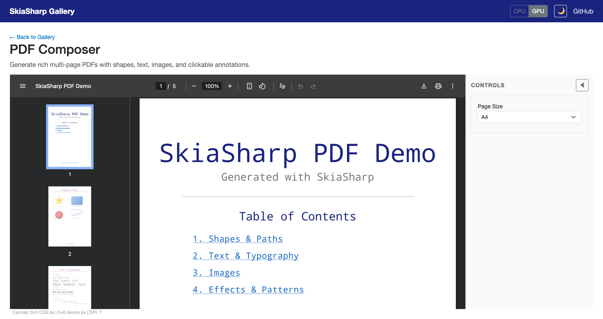

# SkiaSharp Gallery

An interactive sample gallery showcasing SkiaSharp's 2D graphics capabilities.
The **Blazor WebAssembly**, **Uno Platform**, and **.NET MAUI** apps all use the
same drawing code and sample catalog in [`Shared`](Shared).

| Host | Platforms | Instructions |
|---|---|---|
| Blazor | Browser (WebAssembly) | See below |
| Uno Platform | Browser, desktop, Android, iOS, Windows | [Uno README](Uno/README.md) |
| .NET MAUI | Android, iOS, Mac Catalyst, Windows | [MAUI README](Maui/README.md) |



## Running

For in-tree builds, prepare the native binaries from the repository root first:

```bash
dotnet cake --target=externals-download
```

This download is only for managed/sample-only work. If you changed native code
or the Skia submodule, build the corresponding natives from source instead;
see [`AGENTS.md`](../../AGENTS.md).

### Blazor

```bash
cd samples/Gallery/Blazor
dotnet run
```

Then open http://localhost:5002.

### .NET MAUI

With the .NET MAUI workload installed, run the desktop app on macOS:

```bash
dotnet build samples/Gallery/Maui/SkiaSharpSample.Maui.csproj \
  -f net10.0-maccatalyst -t:Run
```

The [MAUI README](Maui/README.md) covers the other platforms, native document
export, and Debug-only MAUI DevFlow inspection. The main, Mac, and Windows
gallery solutions include this host; the Linux solution continues to use
Blazor and Uno without requiring MAUI workloads.

## Features

- **Shared interactive demos** covering gradients, transforms, shaders, text, paths, image filters, and more
- **Live controls** — sliders, pickers, toggles, and composable effect groups
- **CPU & GPU rendering** in Blazor and MAUI (native GPU backends in MAUI)
- **Dark mode** with full theme support
- **Alphabetical category/API facets and search** — Blazor and MAUI hide choices
  with no current matches while retaining active filters for removal; Uno offers
  alphabetical, live-counted category choices and an explicit reset escape
- **PDF generation** with an embedded browser viewer or native open/share actions
- **SkSL shader playground** with 5 animated presets and live parameters
- **3D transforms** using native `SKMatrix44` 4×4 pipeline

## Testing

The console test solution includes `SkiaSharp.Gallery.Tests.Console`. It checks
catalog discovery, search/filter combinations, control metadata, and two
initialize/render/destroy cycles for every sample supported on the current host,
including generated documents.

```bash
dotnet test tests/SkiaSharp.Tests.Console.slnx \
  -p:TargetFramework=net10.0 -p:TargetFrameworks=net10.0
```

These raster tests complement, rather than replace, running each host's UI.
The MAUI host also includes Debug-only DevFlow support for checking navigation,
live controls, themes, and native GPU rendering.

Animated samples must keep delays outside `SyncRoot`, then check their captured
cancellation token and update native state under that gate. Drawing, control
changes, and destruction use the same gate so a GPU paint cannot race animation
updates or disposal. Hosts that need independent page/window lifetimes use
`SampleService.CreateSample`; animation errors are available through
`CanvasSampleBase.AnimationFailed`.

## Screenshots

| Gradient Sample | 3D Transforms |
|---|---|
|  |  |

| Shader Playground | PDF Composer |
|---|---|
|  |  |

## Samples

### Canvas

| Sample | Category | Description |
|--------|----------|-------------|
| 2D Transforms | General | Translate, rotate, and scale with live matrix display |
| 3D Transforms | General | Per-axis rotation, perspective projection, 4×4 matrix overlay |
| Animated WebP Encoder | Image Decoding | Encode and export animated WebP images |
| Blend Modes | Shaders & Effects | All SkiaSharp blend modes with adjustable opacity |
| Blur Image Filter | Image & Filters | Gaussian blur with independent sigma controls |
| Color Fonts | Text & Typography | Render color glyphs |
| Crop Image Filter | Image & Filters | Explore image filter crop regions |
| Fill Path | Paths & Geometry | Convert strokes and effects to filled paths |
| GIF Player | Image Decoding | Animated GIF playback with speed control |
| Gradient | Shaders & Effects | Linear, radial, sweep, and conical gradients |
| Hero Image | General | Compose images with shapes and typography |
| Image Decoder | Image Decoding | PNG, WebP, GIF decoding with metadata inspection |
| Lottie Player | General | Skottie animation playback |
| Nine-Patch Scaler | General | Interactive 9-patch bitmap resizing |
| Overdraw Visualization | Image & Filters | Visualize how often pixels are painted |
| Paint Fast Bounds | Image & Filters | Inspect paint bounds with effects |
| Path Builder | Paths & Geometry | Star, Bézier, and spiral paths with bounds |
| Path Effects Sampler | Paths & Geometry | Dash, discrete, corner, and composed effects |
| Perlin Noise Textures | Shaders & Effects | Procedural Perlin noise textures |
| Photo Lab | Image & Filters | Composable effect stack (color, blur, morphology, magnifier) |
| Shader Cross-Fade | Shaders & Effects | Interpolate between shader outputs |
| Shader Playground | Shaders & Effects | Animated SkSL runtime effects with 5 presets |
| Smart Underline | Text & Typography | Draw underlines around glyphs |
| Text Lab | Text & Typography | Font selection, alignment, size, and metric visualization |
| Text on Path | Text & Typography | Text along circle, wave, and heart paths |
| Text to Path | Text & Typography | Convert text outlines to paths |
| Variable Fonts | Text & Typography | Explore variable font axes |
| Vector Art | Paths & Geometry | Complex Bézier artwork with color themes |
| Vertex Mesh | General | Triangle meshes with wireframe overlay |
| Wide-Gamut P3 | Shaders & Effects | Compare color spaces |
| World Text | Text & Typography | Multi-script rendering with HarfBuzz shaping |

### Document

| Sample | Description |
|--------|-------------|
| PDF Composer | Multi-page PDF with shapes, text, images, and clickable annotations |
| Create XPS | XPS document generation (Windows only) |
