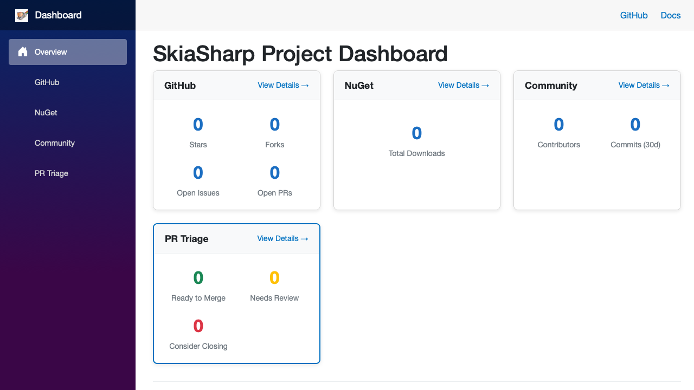

# SkiaSharp Project Dashboard

A Blazor WebAssembly dashboard for monitoring SkiaSharp project health, community metrics, and PR triage.



## Features

- **Overview**: Quick glance at project health
- **GitHub Stats**: Issues, PRs, stars, forks, activity
- **NuGet Downloads**: Package download statistics
- **Community**: Contributors and commit activity
- **PR Triage**: AI-powered PR analysis and prioritization

## Development

### Prerequisites

- .NET 10 SDK

### Run Locally

```bash
cd src/Dashboard
dotnet run
```

### Build for Production

```bash
cd src/Dashboard
dotnet publish -c Release -o ../../publish
```

## Data Files

The dashboard loads data from JSON files in `wwwroot/data/`:

- `github-stats.json` - Repository and issue/PR statistics
- `nuget-stats.json` - NuGet download counts
- `community-stats.json` - Contributor information
- `pr-triage.json` - AI-analyzed PR recommendations

These files are updated by scheduled GitHub Actions workflows.

## Deployment

The dashboard is deployed to GitHub Pages at:
https://mono.github.io/SkiaSharp/dashboard/

Two workflows handle deployment:

1. **build-dashboard.yml** - Builds and deploys the app on push to `dashboard` branch
2. **update-dashboard-data.yml** - Updates data JSON files every 6 hours

## Architecture

```
dashboard branch (orphan)
    ↓ build
docs-live/dashboard/  (deployed via peaceiris/actions-gh-pages)
```

The dashboard coexists with the main documentation at `/docs/`.
