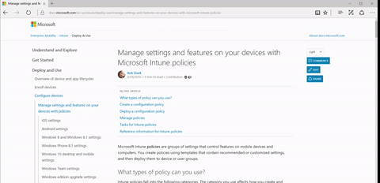
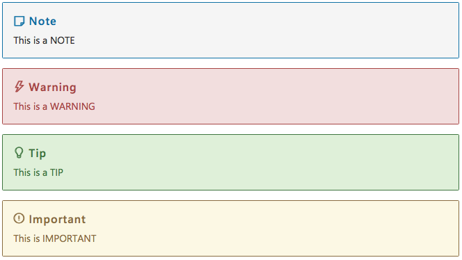

# Metadata and Markdown Template

This template contains examples of Markdown syntax, as well as guidance on setting the metadata. To get the most of it, you must view both the **raw Markdown** and the **rendered view** (for instance, the raw Markdown shows the metadata block, while the rendered view does not).

When creating a Markdown file, you should copy this template to a new file, fill out the metadata as specified below, set the H1 heading above to the title of the article, and delete the content.

## Metadata

The full metadata block, with a bunch of annotations, is shown below:

```yaml
---
title: This Article's Title
description: A good, solid description of this article. The content kept here is what Microsoft Learn returns with search results, so this had better be a complete description of the purpose and content for this document file
keywords: a, comma, separated, list, of keywords, to, use, for, this, doc, however, this, might, not, be, used, for, anything, much, anymore, but, still, good, to, have, if, you, want
author: conceptdev (your Github user name)
ms.author: crdun (your Microsoft Alias)
ms.date: 02/26/2018 (creation date, in US format: mm/dd/yyyy)
ms.topic: conceptual (one only of the following: conceptual, quickstart, tutorial, overview)
ms.assetid: b39854a6-c523-4a66-bef6-9b5da03bafff (a unique number representing the asset - just use a GUID, you can generate one at https://www.guidgenerator.com/)
ms.service: dotnet-maui (service identifier for SkiaSharp/.NET MAUI docs)
ms.custom: Analytics data, a field that gets imported into SkyEye so you can use it in custom reports
---
```

Some key notes:

- You **must** have a space between the colon (:) and the value for a metadata element.
- If an optional metadata element does not have a value, delete it (do not leave it blank or use "na").
- Colons in a value (for example, a title) break the metadata parser. In this case, surround the title with double quotes (for example, `title: "Writing .NET Core console apps: An advanced step-by-step guide"`).
- **title**: This title will appear in search engine results. The title doesn't need be identical to the title in your H1 heading and it should contain 60 characters or less.
- **author**, **manager**, **ms.reviewer**: The author field should contain the **GitHub username** of the author, not their alias.  The "manager" and "ms.reviewer" fields, on the other hand, should contain Microsoft aliases. ms.reviewer specifies the name of the PM/dev associated with the article or feature.
- **ms.assetid**: This is the GUID of the article that is used for internal tracking purposes such as Business Intelligence (BI). When creating a new Markdown file, get a GUID from [https://www.guidgenerator.com](https://www.guidgenerator.com).

## Basic Markdown, GFM, and special characters

All basic and GitHub Flavored Markdown (GFM) is supported. For more information on these, see:

- [Baseline Markdown syntax](https://daringfireball.net/projects/markdown/syntax)
- [DocFX Flavored Markdown](https://dotnet.github.io/docfx/spec/docfx_flavored_markdown.html)
- [GFM documentation](https://guides.github.com/features/mastering-markdown)

Markdown uses special characters such as \*, \`, and \# for formatting. If you wish to include one of these characters in your content, you must do one of two things:

- Put a backslash before the special character to "escape" it (for example, `\*` for a \*)
- Use the [HTML entity code](http://www.ascii.cl/htmlcodes.htm) for the character (for example, `&#42;` for a &#42;).

## File name

File names use the following rules:

- Contain only lowercase letters, numbers, and hyphens.
- No spaces or punctuation characters. Use the hyphens to separate words and numbers in the file name.
- Use action verbs that are specific, such as develop, buy, build, troubleshoot. No -ing words.
- No small words - don't include a, and, the, in, or, etc.
- Must be in Markdown and use the .md file extension.
- Keep file names reasonably short. They are part of the URL for your articles.

## Headings

Use sentence-style capitalization. Always capitalize:

- The first word of a heading.
- The word following a colon in a title or heading (for example, "How to: Sort an array").

Headings should be done using atx-style, that is, use 1-6 hash characters (#) at the start of the line to indicate a heading, corresponding to HTML headings levels H1 through H6. Examples of first- and second-level headers are used above.

There **must** be only one first-level heading (H1) in your topic, which will be displayed as the on-page title.

If your heading finishes with a `#` character, you need to add an extra `#` character in the end in order for the title to render correctly. For example, `# Async Programming in F# #`.

Second-level headings will generate the on-page TOC that appears in the "In this article" section underneath the on-page title.

### Third-level heading
#### Fourth-level heading
##### Fifth level heading
###### Sixth-level heading

## Text styling

_Italics_
 Use for files, folders, paths (for long items, split onto their own line) - new terms - URLs (unless rendered as links, which is the default).

**Bold**
Use for UI elements.

## Links

### Internal Links

To link to a header in the same Markdown file (also known as anchor links), you'll need to find out the id of the header you're trying to link to. To confirm the ID, view the source of the rendered article, find the id of the header (for example, `id="blockquote"`), and link using # + id (for example, `#blockquote`).
The id is auto-generated based on the header text. So, for example, given a unique section named `## Step 2`, the id would look like this `id="step-2"`.

- Example: `[Chapter 1](#chapter-1)`

To link to a Markdown file in the same repo, use [relative links](https://www.w3.org/TR/WD-html40-970917/htmlweb.html#h-5.1.2), including the ".md" at the end of the filename.

- Example: `[Readme file](../readme.md)`
- Example: `[Welcome to .NET](../docs/welcome.md)`

To link to a header in a Markdown file in the same repo, use relative linking + hashtag linking.

- Example: `[.NET Community](../docs/welcome.md#community)`

### External Links

To link to an external file, use the full URL as the link.

- Example: `[GitHub](http://www.github.com)`

If a URL appears in a Markdown file, it will be transformed into a clickable link.

- Example: `http://www.github.com`

### Links to APIs

The build system has some extensions that allow us to link to .NET APIs without having to use external links.
When linking to an API, you can use its unique identifier (UID) that is auto-generated from the source code.

You can use one of the following syntax:

1. Markdown link: `[link_text](xref:UID)`
2. Auto link: `<xref:UID>`
3. Shorthand form: `@UID`

- Example: `@System.String`
- Example: `[String class](xref:System.String)`

For more information about using this notation, see [Using cross reference](https://dotnet.github.io/docfx/tutorial/links_and_cross_references.html#using-cross-reference).

> Right now, there is no easy way to find the UIDs. The best way to find the UID for an API is to search for it in this repo: [docascode/coreapi](https://github.com/docascode/coreapi). We're working on having a better system in the future.

When the UID contains the special characters \` or \#, the UID value needs to be HTML encoded as %60 and %23 respectively as in the following examples:

- Example: @System.Threading.Tasks.Task\`1 becomes `@System.Threading.Tasks.Task%601`
- Example: @System.Exception.\#ctor becomes `@System.Exception.%23ctor`

## Lists

### Ordered lists

1. This
1. Is
1. An
1. Ordered
1. List

#### Ordered list with an embedded list

1. Here
1. comes
1. an
1. embedded
    1. Miss Scarlett
    1. Professor Plum
1. ordered
1. list

### Unordered Lists

- This
- is
- a
- bulleted
- list

#### Unordered list with an embedded list

- This
- bulleted
- list
  - Mrs. Peacock
  - Mr. Green
- contains
- other
    1. Colonel Mustard
    1. Mrs. White
- lists

## Horizontal rule

---

## Tables

| Tables        | Are           | Cool  |
| ------------- |:-------------:| -----:|
| col 3 is      | right-aligned | $1600 |
| col 2 is      | centered      |   $12 |
| col 1 is default | left-aligned     |    $1 |

You can use a [Markdown table generator tool](http://www.tablesgenerator.com/markdown_tables) to help creating them more easily.

### Inline code blocks with language identifier

Use three backticks (\`\`\`) + a language ID to apply language-specific color coding to a code block. Here is the entire list of [GFM language IDs](https://github.com/jmm/gfm-lang-ids/wiki/GitHub-Flavored-Markdown-(GFM)-language-IDs).

#### C&#9839;

```c#
using System;
namespace HelloWorld
{
    class Hello
    {
        static void Main()
        {
            Console.WriteLine("Hello World!");

            // Keep the console window open in debug mode.
            Console.WriteLine("Press any key to exit.");
            Console.ReadKey();
        }
    }
}
```

#### xml

```xml
<dict>
    <key>CFBundleURLSchemes</key>
    <array>
        <string>evolveCountdown</string>
    </array>
```

#### XAML

```xaml
<Label Text="Hello, XAML!"
        FontSize="Large"
        FontAttributes="Bold"
        TextColor="Blue" />
```

#### PowerShell

```powershell
Clear-Host
$Directory = "C:\Windows\"
$Files = Get-Childitem $Directory -recurse -Include *.log `
-ErrorAction SilentlyContinue
```

### Generic code block

Use three backticks (&#96;&#96;&#96;) for generic code block coding.

> The recommended approach is to use code blocks with language identifiers as explained in the previous section to ensure the proper syntax highlighting in the documentation site. Use generic code blocks only when necessary.

```
function fancyAlert(arg) {
    if(arg) {
        $.docs({div:'#foo'})
    }
}
```

### Inline code

Use backticks (&#96;) for `inline code`. Use inline code for command-line commands, database table and column names, and language keywords.

## Blockquotes

> The drought had lasted now for ten million years, and the reign of the terrible lizards had long since ended. Here on the Equator, in the continent which would one day be known as Africa, the battle for existence had reached a new climax of ferocity, and the victor was not yet in sight. In this barren and desiccated land, only the small or the swift or the fierce could flourish, or even hope to survive.

## Images

### Static Image or Animated gif

```

```



### Linked Image

```
[](https://dot.net)
```

## Videos

### Channel 9

Use this special blockquote syntax:

```
> [!Video https://channel9.msdn.com/Shows/On-NET/Shipping-NET-Core-RC2--Tools-Preview-1/player]
```

The Channel 9 video URL should start with `https` and end with `/player`, otherwise it will embed the whole page instead of the video only.

### YouTube

Use this special blockquote syntax:

```
> [!Video https://youtube.com/embed/wXgnh2Q7Uv8]
```

The YouTube video should contain `/embed/` (ie. follow the format above), otherwise it will attempt to render the whole page and may not work.

## Microsoft Learn extensions

Microsoft Learn provides a few additional extensions to GitHub Flavored Markdown.

### Alerts

It's important to use the following alert styles so they render with the proper style in the documentation site. However, the rendering engine on GitHub doesn't differentiate them.

#### Note

```
> [!NOTE]
> This is a NOTE
```

#### Warning

```
> [!WARNING]
> This is a WARNING
```

#### Tip

```
> [!TIP]
> This is a TIP
```

#### Important

```
> [!IMPORTANT]
> This is IMPORTANT
```

And they'll render like this:



### Buttons

```
> [!div class="button"]
[button links](../docs/core/index.md)
```

You can see an example of buttons in action in the [Intune documentation](/intune/get-started/choose-how-to-enroll-devices).

### Selectors

```
> [!div class="op_single_selector"]
- [macOS](../docs/core/tutorials/using-on-macos.md)
- [Windows](../docs/core/tutorials/using-on-windows.md)
```

You can see an example of selectors in action in the [Intune documentation](/intune/deploy-use/what-to-tell-your-end-users-about-using-microsoft-intune#how-your-end-users-get-their-apps).

### Step-By-Steps

```
> [!div class="step-by-step"]
[Pre](../docs/csharp/expression-trees-interpreting.md)
[Next](../docs/csharp/expression-trees-translating.md)
```

You can see an example of step-by-steps in action in the [Advanced Threat Analytics documentation](/advanced-threat-analytics/deploy-use/install-ata-step2).
