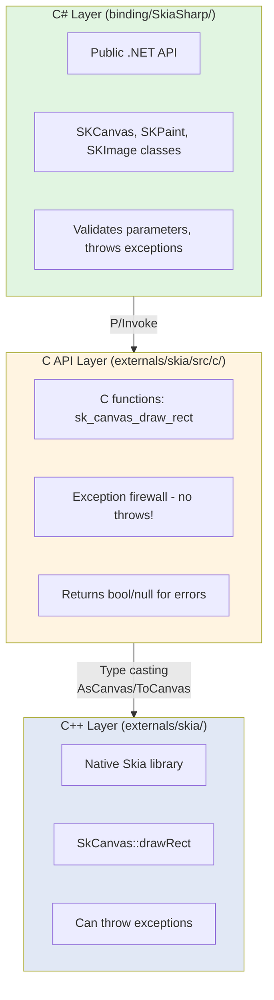
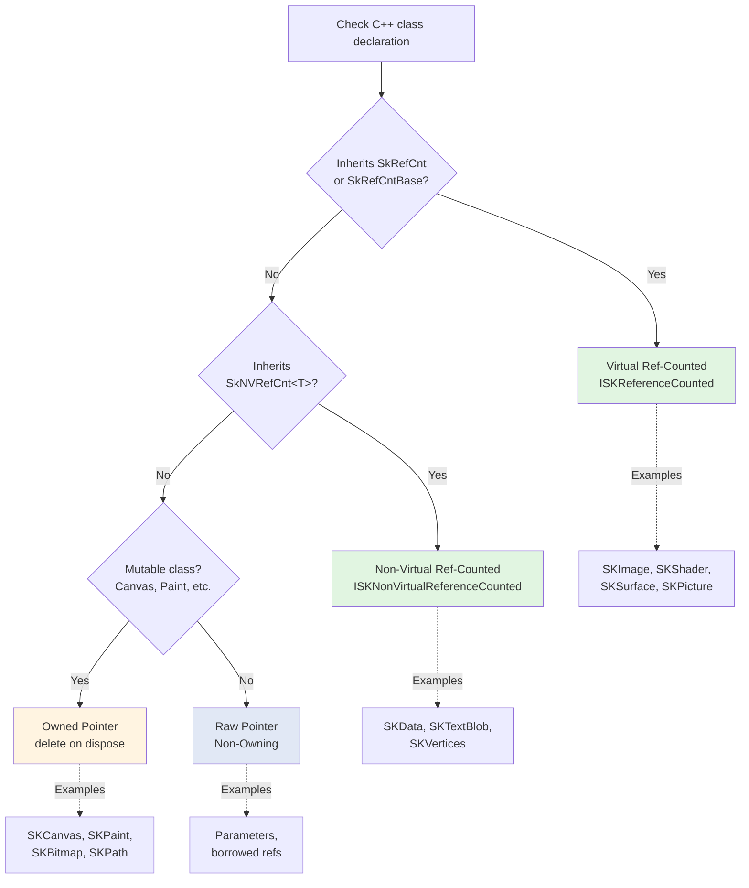

# SkiaSharp Quick Start Guide

**Goal:** Get you productive with SkiaSharp development in 10 minutes.

This guide shows you **how to add a new API** from start to finish. For comprehensive reference, see the detailed documentation in this folder.

## Table of Contents

1. [Understanding the Three Layers](#understanding-the-three-layers)
2. [Identifying Pointer Types](#identifying-pointer-types)
3. [Adding a Simple API](#adding-a-simple-api-walkthrough)
4. [Error Handling Patterns](#error-handling-patterns)
5. [Common Mistakes](#top-10-common-mistakes)
6. [Next Steps](#next-steps)

---

## Understanding the Three Layers

SkiaSharp uses a three-layer architecture:

> **📚 Deep Dive:** See [architecture-overview.md](architecture-overview.md) for complete architecture details.



**Key principle:** C++ exceptions **cannot cross** the C API boundary. The C API layer catches all exceptions.

---

## Identifying Pointer Types

**Most important decision:** What pointer type does the API use?

### Decision Flowchart

> **💡 Tip:** See [memory-management.md](memory-management.md) for comprehensive pointer type details.



### Quick Reference

| Pointer Type | C++ | C API | C# | Cleanup |
|--------------|-----|-------|-----|---------|
| **Raw (Non-Owning)** | `const SkType&` parameter | Pass through | `owns: false` | None |
| **Owned** | `new SkType()` | `sk_type_new/delete()` | `DisposeNative() → delete` | Call delete |
| **Ref-Counted (Virtual)** | `: SkRefCnt` | `sk_type_ref/unref()` | `ISKReferenceCounted` | Call unref |
| **Ref-Counted (NV)** | `: SkNVRefCnt<T>` | `sk_data_ref/unref()` | `ISKNonVirtualReferenceCounted` | Call type-specific unref |

---

## Adding a Simple API: Walkthrough

Let's add `SkCanvas::drawCircle()` to SkiaSharp.

### Step 1: Find the C++ API

**Location:** `externals/skia/include/core/SkCanvas.h`

```cpp
class SkCanvas {
public:
    void drawCircle(SkScalar cx, SkScalar cy, SkScalar radius, const SkPaint& paint);
};
```

**Analysis:**
- Method on `SkCanvas` (owned pointer type)
- Parameters: `cx`, `cy`, `radius` are simple values, `paint` is const reference (borrowed)
- Returns: `void` (no error signaling)
- Cannot fail (simple drawing operation)

### Step 2: Add C API Function

**Location:** `externals/skia/src/c/sk_canvas.cpp`

```cpp
void sk_canvas_draw_circle(
    sk_canvas_t* canvas,
    float cx,
    float cy, 
    float radius,
    const sk_paint_t* paint)
{
    // Defensive null checks
    if (!canvas || !paint)
        return;
    
    // Call C++ method
    AsCanvas(canvas)->drawCircle(cx, cy, radius, *AsPaint(paint));
}
```

**Key points:**
- Function name: `sk_<type>_<action>` pattern
- Defensive null checks (C API must be safe)
- `AsCanvas()` and `AsPaint()` convert opaque pointers to C++ types
- Dereference with `*` to convert pointer to reference

### Step 3: Add C API Header

**Location:** `externals/skia/include/c/sk_canvas.h`

```cpp
SK_C_API void sk_canvas_draw_circle(
    sk_canvas_t* canvas,
    float cx,
    float cy,
    float radius,
    const sk_paint_t* paint);
```

### Step 4: Add P/Invoke Declaration

**Location:** `binding/SkiaSharp/SkiaApi.cs`

```csharp
[DllImport("libSkiaSharp", CallingConvention = CallingConvention.Cdecl)]
public static extern void sk_canvas_draw_circle(
    sk_canvas_t canvas,
    float cx,
    float cy,
    float radius,
    sk_paint_t paint);
```

**Key points:**
- Use `sk_canvas_t` and `sk_paint_t` type aliases (defined as `IntPtr`)
- Match C API signature exactly
- Use `CallingConvention.Cdecl`

### Step 5: Add C# Wrapper

**Location:** `binding/SkiaSharp/SKCanvas.cs`

```csharp
public void DrawCircle(float cx, float cy, float radius, SKPaint paint)
{
    // Validate parameters
    if (paint == null)
        throw new ArgumentNullException(nameof(paint));
    
    // Call P/Invoke
    SkiaApi.sk_canvas_draw_circle(Handle, cx, cy, radius, paint.Handle);
}
```

**Key points:**
- Use .NET naming conventions (PascalCase)
- Validate parameters before P/Invoke
- Use `Handle` property to get native pointer
- No need to check return value (void function)

### Done! ✅

You've added a complete binding across all three layers.

---

## Error Handling Patterns

> **📚 Deep Dive:** See [error-handling.md](error-handling.md) for comprehensive error handling patterns.

### Pattern 1: Boolean Return (Try Methods)

**C++ (can throw):**
```cpp
bool SkBitmap::tryAllocPixels(const SkImageInfo& info);
```

**C API (catch exceptions):**
```cpp
bool sk_bitmap_try_alloc_pixels(sk_bitmap_t* bitmap, const sk_imageinfo_t* info) {
    if (!bitmap || !info)
        return false;
    try {
        return AsBitmap(bitmap)->tryAllocPixels(AsImageInfo(info));
    } catch (...) {
        return false;  // Exception caught, return failure
    }
}
```

**C# (throw on false):**
```csharp
public bool TryAllocPixels(SKImageInfo info)
{
    var nInfo = SKImageInfoNative.FromManaged(ref info);
    return SkiaApi.sk_bitmap_try_alloc_pixels(Handle, &nInfo);
}

public void AllocPixels(SKImageInfo info)
{
    if (!TryAllocPixels(info))
        throw new InvalidOperationException("Failed to allocate pixels");
}
```

### Pattern 2: Null Return (Factory Methods)

**C++ (returns nullptr on failure):**
```cpp
sk_sp<SkImage> SkImages::DeferredFromEncodedData(sk_sp<SkData> data);
```

**C API (catch exceptions, return null):**
```cpp
sk_image_t* sk_image_new_from_encoded(const sk_data_t* data) {
    if (!data)
        return nullptr;
    try {
        auto image = SkImages::DeferredFromEncodedData(sk_ref_sp(AsData(data)));
        return ToImage(image.release());
    } catch (...) {
        return nullptr;
    }
}
```

**C# (throw on null):**
```csharp
public static SKImage FromEncodedData(SKData data)
{
    if (data == null)
        throw new ArgumentNullException(nameof(data));
    
    var handle = SkiaApi.sk_image_new_from_encoded(data.Handle);
    if (handle == IntPtr.Zero)
        throw new InvalidOperationException("Failed to decode image");
    
    return GetObject(handle);
}
```

### Pattern 3: Void Methods (Defensive Checks)

**C API:**
```cpp
void sk_canvas_draw_rect(sk_canvas_t* canvas, const sk_rect_t* rect, const sk_paint_t* paint) {
    if (!canvas || !rect || !paint)
        return;  // Defensive: fail silently
    AsCanvas(canvas)->drawRect(*AsRect(rect), *AsPaint(paint));
}
```

**C#:**
```csharp
public void DrawRect(SKRect rect, SKPaint paint)
{
    if (paint == null)
        throw new ArgumentNullException(nameof(paint));
    SkiaApi.sk_canvas_draw_rect(Handle, &rect, paint.Handle);
}
```

---

## Top 10 Common Mistakes

### 1. ❌ Wrong Pointer Type
```csharp
// WRONG: SKImage is ref-counted, not owned
protected override void DisposeNative()
{
    SkiaApi.sk_image_delete(Handle);  // No such function!
}

// CORRECT: Use unref for ref-counted types
// SKImage implements ISKReferenceCounted, which handles this automatically
```

### 2. ❌ Throwing Exceptions in C API
```cpp
// WRONG: Exception crosses C boundary
SK_C_API void sk_function() {
    throw std::exception();  // CRASH!
}

// CORRECT: Catch and return error
SK_C_API bool sk_function() {
    try {
        // ... operation
        return true;
    } catch (...) {
        return false;
    }
}
```

### 3. ❌ Missing Parameter Validation
```csharp
// WRONG: No validation
public void DrawRect(SKRect rect, SKPaint paint)
{
    SkiaApi.sk_canvas_draw_rect(Handle, &rect, paint.Handle);  // paint could be null!
}

// CORRECT: Validate first
public void DrawRect(SKRect rect, SKPaint paint)
{
    if (paint == null)
        throw new ArgumentNullException(nameof(paint));
    SkiaApi.sk_canvas_draw_rect(Handle, &rect, paint.Handle);
}
```

### 4. ❌ Ignoring Return Values
```csharp
// WRONG: Ignoring potential failure
var image = SkiaApi.sk_image_new_from_encoded(data.Handle);
return new SKImage(image);  // image could be IntPtr.Zero!

// CORRECT: Check return value
var image = SkiaApi.sk_image_new_from_encoded(data.Handle);
if (image == IntPtr.Zero)
    throw new InvalidOperationException("Failed to decode");
return GetObject(image);
```

### 5. ❌ Missing sk_ref_sp for Ref-Counted Parameters
```cpp
// WRONG: C++ expects sk_sp<SkData>, this doesn't increment ref count
sk_image_t* sk_image_new(const sk_data_t* data) {
    return ToImage(SkImages::Make(AsData(data)).release());  // LEAK or CRASH!
}

// CORRECT: Use sk_ref_sp to create sk_sp and increment ref
sk_image_t* sk_image_new(const sk_data_t* data) {
    return ToImage(SkImages::Make(sk_ref_sp(AsData(data))).release());
}
```

### 6. ❌ Using C++ Types in C API
```cpp
// WRONG: std::string is C++
SK_C_API void sk_function(std::string name);

// CORRECT: Use C types
SK_C_API void sk_function(const char* name);
```

### 7. ❌ Not Disposing IDisposable Objects
```csharp
// WRONG: Memory leak
var paint = new SKPaint();
paint.Color = SKColors.Red;
// paint never disposed!

// CORRECT: Use using statement
using (var paint = new SKPaint())
{
    paint.Color = SKColors.Red;
} // Automatically disposed
```

### 8. ❌ Exposing IntPtr in Public API
```csharp
// WRONG: IntPtr is implementation detail
public IntPtr NativeHandle { get; }

// CORRECT: Keep internal
internal IntPtr Handle { get; }
```

### 9. ❌ Missing Defensive Null Checks in C API
```cpp
// WRONG: No null check
SK_C_API void sk_canvas_clear(sk_canvas_t* canvas, sk_color_t color) {
    AsCanvas(canvas)->clear(color);  // canvas could be null!
}

// CORRECT: Check parameters
SK_C_API void sk_canvas_clear(sk_canvas_t* canvas, sk_color_t color) {
    if (!canvas)
        return;
    AsCanvas(canvas)->clear(color);
}
```

### 10. ❌ Forgetting .release() on sk_sp
```cpp
// WRONG: sk_sp will unref when destroyed, ref count goes to 0
SK_C_API sk_image_t* sk_image_new() {
    sk_sp<SkImage> image = SkImages::Make(...);
    return ToImage(image);  // Converted to raw pointer, then sk_sp destructs → CRASH!
}

// CORRECT: .release() transfers ownership
SK_C_API sk_image_t* sk_image_new() {
    sk_sp<SkImage> image = SkImages::Make(...);
    return ToImage(image.release());  // Releases sk_sp ownership, ref count stays 1
}
```

---

## Next Steps

### For Quick Reference
- **[AGENTS.md](../AGENTS.md)** - Ultra-quick lookup (2 minutes)

### For Deep Dives
- **[architecture-overview.md](architecture-overview.md)** - Complete architecture details
- **[memory-management.md](memory-management.md)** - Everything about pointer types
- **[error-handling.md](error-handling.md)** - Complete error patterns
- **[layer-mapping.md](layer-mapping.md)** - Type mapping reference
- **[adding-new-apis.md](adding-new-apis.md)** - Comprehensive API guide

### For Path-Specific Rules
- **[.github/instructions/](../.github/instructions/)** - Auto-loading instructions per file type

### Testing Your Changes
```bash
# Build managed code
dotnet cake --target=libs

# Run tests
dotnet cake --target=tests
```

---

## Summary

**Remember:**
1. **Three layers:** C# → C API → C++
2. **Exception firewall:** C API catches all exceptions
3. **Three pointer types:** Raw, Owned, Ref-counted
4. **Always validate:** Check parameters in C# and C API
5. **Check returns:** Handle null and false returns

**When in doubt:**
- Check similar existing APIs
- Follow the patterns in this guide
- See comprehensive docs for details

Good luck! 🎨
