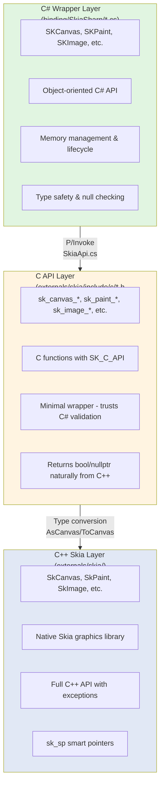
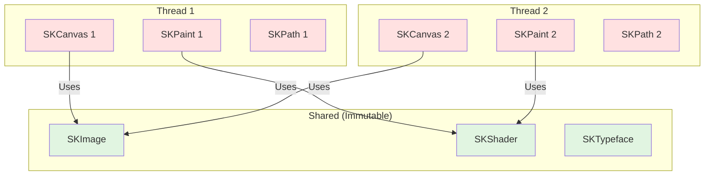

# SkiaSharp Architecture Overview

> **Quick Start:** For a practical tutorial, see [QUICKSTART.md](QUICKSTART.md)  
> **Quick Reference:** For a 2-minute overview, see [AGENTS.md](../AGENTS.md)

## TL;DR

**Three-layer architecture bridges C++ to C#:**

1. **C# Wrapper Layer** (`binding/SkiaSharp/`)
   - Public .NET API (SKCanvas, SKPaint, etc.)
   - Validates parameters, throws exceptions
   - Manages object lifecycles with IDisposable

2. **C API Layer** (`externals/skia/src/c/`)
   - C functions as P/Invoke targets
   - **Minimal wrapper** - trusts C# validation
   - Returns bool/null from C++ naturally, never throws

3. **C++ Skia Layer** (`externals/skia/`)
   - Native graphics library
   - Can throw exceptions (C++ code)

**Call flow:** `SKCanvas.DrawRect()` → (P/Invoke) → `sk_canvas_draw_rect()` → (type cast) → `SkCanvas::drawRect()`

**Key design principles:**
- Exceptions don't cross C boundary
- Each layer has distinct responsibilities
- Type conversions happen at layer boundaries

See sections below for details on each layer, threading, and code generation.

---

## Introduction

SkiaSharp is a cross-platform 2D graphics API for .NET platforms based on Google's Skia Graphics Library. It provides a three-layer architecture that wraps the native C++ Skia library in a safe, idiomatic C# API.

## Three-Layer Architecture

SkiaSharp's architecture consists of three distinct layers that work together to provide C# access to native Skia functionality:



### Layer 1: C++ Skia Library (Native)

**Location:** `externals/skia/include/core/` and `externals/skia/src/`

The bottom layer is Google's Skia Graphics Library written in C++. This is the actual graphics engine that performs all rendering operations.

**Key characteristics:**
- Object-oriented C++ API
- Uses C++ features: classes, inheritance, templates, smart pointers
- Memory management via destructors, RAII, and reference counting
- Exception handling via C++ exceptions
- Cannot be directly called from C# (different ABIs)

**Example types:**
- `SkCanvas` - Drawing surface
- `SkPaint` - Drawing attributes (owned resource)
- `SkImage` - Immutable image (reference counted via `sk_sp<SkImage>`)

### Layer 2: C API Layer (Bridge)

**Location:** `externals/skia/include/c/*.h` and `externals/skia/src/c/*.cpp`

The middle layer is a hand-written C API that wraps the C++ API. This layer is essential because:
- C has a stable ABI that can be P/Invoked from C#
- C functions can cross the managed/unmanaged boundary
- C++ exceptions cannot cross this boundary safely

**Key characteristics:**
- Pure C functions (no classes or exceptions)
- Opaque pointer types (`sk_canvas_t*`, `sk_paint_t*`, `sk_image_t*`)
- Manual resource management (create/destroy functions)
- Type conversion macros to cast between C and C++ types
- Exception boundaries protected

**Naming convention:**
- C API headers: `sk_<type>.h` (e.g., `sk_canvas.h`)
- C API implementations: `sk_<type>.cpp` (e.g., `sk_canvas.cpp`)
- C API functions: `sk_<type>_<action>` (e.g., `sk_canvas_draw_rect`)
- C API types: `sk_<type>_t` (e.g., `sk_canvas_t*`)

**Type conversion macros:**
```cpp
// In sk_types_priv.h
DEF_CLASS_MAP(SkCanvas, sk_canvas_t, Canvas)
// Generates:
//   AsCanvas(sk_canvas_t*) -> SkCanvas*
//   ToCanvas(SkCanvas*) -> sk_canvas_t*
```

**Example:**
```cpp
// C API in sk_canvas.h
SK_C_API void sk_canvas_draw_rect(sk_canvas_t* ccanvas, const sk_rect_t* crect, const sk_paint_t* cpaint);

// Implementation in sk_canvas.cpp
void sk_canvas_draw_rect(sk_canvas_t* ccanvas, const sk_rect_t* crect, const sk_paint_t* cpaint) {
    AsCanvas(ccanvas)->drawRect(*AsRect(crect), *AsPaint(cpaint));
}
```

### Layer 3: C# Wrapper Layer (Managed)

**Location:** `binding/SkiaSharp/*.cs`

The top layer is a C# object-oriented wrapper that provides:
- Idiomatic C# API matching Skia's C++ API style
- Automatic memory management via `IDisposable`
- Type safety and null checking
- Properties instead of get/set methods
- .NET naming conventions

**Key characteristics:**
- Object-oriented classes (SKCanvas, SKPaint, SKImage)
- P/Invoke declarations in `SkiaApi.cs` and `SkiaApi.generated.cs`
- Base class `SKObject` handles lifecycle and disposal
- Handle-based tracking via `IntPtr` to native resources
- Global handle dictionary for object identity

**Base class hierarchy:**
```
SKNativeObject (IDisposable)
  └─ SKObject (adds handle dictionary & ref counting)
       ├─ SKCanvas (owned resource, destroy on dispose)
       ├─ SKPaint (owned resource, delete on dispose)
       ├─ SKImage (reference counted, unref on dispose)
       └─ ...
```

**Example:**
```csharp
// C# API in SKCanvas.cs
public class SKCanvas : SKObject
{
    public void DrawRect(SKRect rect, SKPaint paint)
    {
        if (paint == null)
            throw new ArgumentNullException(nameof(paint));
        SkiaApi.sk_canvas_draw_rect(Handle, &rect, paint.Handle);
    }
}
```

## Call Flow Example: DrawRect

Here's how a single method call flows through all three layers:

```csharp
// 1. C# Application Code
var canvas = surface.Canvas;
var paint = new SKPaint { Color = SKColors.Red };
canvas.DrawRect(new SKRect(10, 10, 100, 100), paint);

// 2. C# Wrapper (SKCanvas.cs)
public void DrawRect(SKRect rect, SKPaint paint)
{
    if (paint == null)
        throw new ArgumentNullException(nameof(paint));
    SkiaApi.sk_canvas_draw_rect(Handle, &rect, paint.Handle);
}

// 3. P/Invoke Declaration (SkiaApi.cs)
[DllImport("libSkiaSharp")]
public static extern void sk_canvas_draw_rect(
    sk_canvas_t canvas, 
    sk_rect_t* rect, 
    sk_paint_t paint);

// 4. C API Implementation (sk_canvas.cpp)
void sk_canvas_draw_rect(sk_canvas_t* ccanvas, const sk_rect_t* crect, const sk_paint_t* cpaint) {
    AsCanvas(ccanvas)->drawRect(*AsRect(crect), *AsPaint(cpaint));
}

// 5. C++ Skia (SkCanvas.h/cpp)
void SkCanvas::drawRect(const SkRect& rect, const SkPaint& paint) {
    // Native implementation performs actual rendering
}
```

## File Organization

### C++ Layer (Skia Native)
```
externals/skia/
├── include/core/         # C++ public headers
│   ├── SkCanvas.h
│   ├── SkPaint.h
│   ├── SkImage.h
│   └── ...
└── src/                  # C++ implementation (internal)
```

### C API Layer (Bridge)
```
externals/skia/
├── include/c/            # C API headers (public)
│   ├── sk_canvas.h
│   ├── sk_paint.h
│   ├── sk_image.h
│   ├── sk_types.h        # Common type definitions
│   └── ...
└── src/c/                # C API implementation
    ├── sk_canvas.cpp
    ├── sk_paint.cpp
    ├── sk_image.cpp
    ├── sk_types_priv.h   # Type conversion macros
    └── ...
```

### C# Wrapper Layer
```
binding/SkiaSharp/
├── SKCanvas.cs           # C# wrapper for sk_canvas_t
├── SKPaint.cs            # C# wrapper for sk_paint_t
├── SKImage.cs            # C# wrapper for sk_image_t
├── SKObject.cs           # Base class for all wrappers
├── SkiaApi.cs            # Manual P/Invoke declarations
├── SkiaApi.generated.cs  # Generated P/Invoke declarations
└── ...
```

## Naming Conventions

### Mapping Between Layers

The naming follows consistent patterns across layers:

| C++ Class | C API Header | C API Type | C API Functions | C# Class |
|-----------|--------------|------------|-----------------|----------|
| `SkCanvas` | `sk_canvas.h` | `sk_canvas_t*` | `sk_canvas_*` | `SKCanvas` |
| `SkPaint` | `sk_paint.h` | `sk_paint_t*` | `sk_paint_*` | `SKPaint` |
| `SkImage` | `sk_image.h` | `sk_image_t*` | `sk_image_*` | `SKImage` |

### Function Naming Patterns

**C API functions follow the pattern:** `sk_<type>_<action>[_<details>]`

Examples:
- `sk_canvas_draw_rect` - Draw a rectangle on canvas
- `sk_paint_set_color` - Set paint color
- `sk_image_new_from_bitmap` - Create image from bitmap
- `sk_canvas_save_layer` - Save canvas layer

## Code Generation

SkiaSharp uses a combination of hand-written and generated code:

### Hand-Written Code
- **C API layer**: All C wrapper functions in `externals/skia/src/c/*.cpp`
- **C# wrapper logic**: Core classes and complex logic in `binding/SkiaSharp/*.cs`
- **P/Invoke declarations**: Some manual declarations in `SkiaApi.cs`

### Generated Code
- **P/Invoke declarations**: `SkiaApi.generated.cs` contains generated P/Invoke signatures
- **Generation tool**: `utils/SkiaSharpGenerator/` contains the code generator
- **Configuration**: Type mappings and function mappings in `utils/SkiaSharpGenerator/ConfigJson/`

The generator parses C header files and creates:
1. P/Invoke declarations with correct signatures
2. Type aliases and constants
3. Enum definitions

**To regenerate code:**
```bash
dotnet run --project utils/SkiaSharpGenerator/SkiaSharpGenerator.csproj -- generate --config <config-path>
```

## Key Design Principles

### 1. Handle-Based Pattern
- Native objects are represented as `IntPtr` handles in C#
- Handles are opaque pointers to native memory
- C# objects wrap handles and manage their lifecycle

### 2. Object Identity
- Global `HandleDictionary` ensures only one C# wrapper per native handle
- Prevents duplicate wrappers and ensures reference equality
- Critical for reference-counted objects

### 3. Memory Safety
- C# wrappers implement `IDisposable` for deterministic cleanup
- Finalizers provide backup cleanup if `Dispose()` not called
- `OwnsHandle` flag determines disposal responsibility

### 4. Exception Boundaries
- C++ exceptions cannot cross C API boundary
- C API functions never throw; use return values for errors
- C# layer performs validation and throws appropriate exceptions

### 5. Minimal P/Invoke Overhead
- Direct handle passing (no marshaling when possible)
- Struct parameters passed by pointer
- Bulk operations to minimize transitions

## Threading Model and Concurrency

### TL;DR - Thread Safety Rules

**⚠️ Skia is NOT thread-safe by default**

| Object Type | Thread Safety | Can Share? | Notes |
|-------------|---------------|------------|-------|
| **Canvas** | ❌ Not thread-safe | No | Single-threaded drawing only |
| **Paint** | ❌ Not thread-safe | No | Each thread needs own instance |
| **Path** | ❌ Not thread-safe | No | Build paths on one thread |
| **Bitmap (mutable)** | ❌ Not thread-safe | No | Modifications single-threaded |
| **Image (immutable)** | ✅ Read-only safe | Yes | Once created, can share |
| **Shader** | ✅ Read-only safe | Yes | Immutable, can share |
| **Typeface** | ✅ Read-only safe | Yes | Immutable, can share |
| **Data** | ✅ Read-only safe | Yes | Immutable, can share |
| **Creation** | ✅ Usually safe | N/A | Creating objects on different threads OK |

**Golden Rule:** Don't use the same SKCanvas/SKPaint/SKPath from multiple threads simultaneously.

### Detailed Threading Behavior

#### Mutable Objects (Not Thread-Safe)

**Examples:** SKCanvas, SKPaint, SKPath, SKBitmap (when being modified)

**Behavior:**
- Single-threaded use only
- No internal locking
- Race conditions if accessed from multiple threads
- Undefined behavior if concurrent access

**Correct Pattern:**
```csharp
// ✅ GOOD: Each thread has its own canvas
void DrawOnThread1()
{
    using var surface1 = SKSurface.Create(info);
    using var canvas1 = surface1.Canvas;
    canvas1.DrawRect(...);  // Thread 1 only
}

void DrawOnThread2()
{
    using var surface2 = SKSurface.Create(info);
    using var canvas2 = surface2.Canvas;
    canvas2.DrawRect(...);  // Thread 2 only
}
```

**Wrong Pattern:**
```csharp
// ❌ BAD: Sharing canvas between threads
SKCanvas sharedCanvas;

void DrawOnThread1()
{
    sharedCanvas.DrawRect(...);  // RACE CONDITION!
}

void DrawOnThread2()
{
    sharedCanvas.DrawCircle(...);  // RACE CONDITION!
}
```

#### Immutable Objects (Thread-Safe for Reading)

**Examples:** SKImage, SKShader, SKTypeface, SKData, SKPicture

**Behavior:**
- Read-only after creation
- Safe to share across threads
- Reference counting is thread-safe (atomic operations)
- Multiple threads can use the same instance concurrently

**Pattern:**
```csharp
// ✅ GOOD: Share immutable image across threads
SKImage sharedImage = SKImage.FromEncodedData(data);

void DrawOnThread1()
{
    using var surface = SKSurface.Create(info);
    surface.Canvas.DrawImage(sharedImage, 0, 0);  // Safe
}

void DrawOnThread2()
{
    using var surface = SKSurface.Create(info);
    surface.Canvas.DrawImage(sharedImage, 0, 0);  // Safe (same image)
}
```

#### Object Creation (Usually Thread-Safe)

Creating different objects on different threads is generally safe:

```csharp
// ✅ GOOD: Create different objects on different threads
var task1 = Task.Run(() => 
{
    using var paint1 = new SKPaint { Color = SKColors.Red };
    using var surface1 = SKSurface.Create(info);
    // ... draw with paint1 and surface1
});

var task2 = Task.Run(() => 
{
    using var paint2 = new SKPaint { Color = SKColors.Blue };
    using var surface2 = SKSurface.Create(info);
    // ... draw with paint2 and surface2
});

await Task.WhenAll(task1, task2);  // Safe - different objects
```

### Threading Visualization



**Legend:**
- 🔴 Red (mutable) = Thread-local only
- 🟢 Green (immutable) = Can be shared

### C# Wrapper Thread Safety

**HandleDictionary:**
- Uses `ConcurrentDictionary` for thread-safe lookups
- Multiple threads can register/lookup handles safely
- Prevents duplicate wrappers for the same native handle

**Reference Counting:**
- `ref()` and `unref()` operations are thread-safe
- Uses atomic operations in native Skia
- Safe to dispose from different thread than creation

**Disposal:**
- `Dispose()` can be called from any thread
- But object must not be in use on another thread
- Finalizer may run on GC thread

### Common Threading Scenarios

#### Scenario 1: Background Rendering

```csharp
// ✅ GOOD: Render on background thread
var image = await Task.Run(() =>
{
    var info = new SKImageInfo(width, height);
    using var surface = SKSurface.Create(info);
    using var canvas = surface.Canvas;
    using var paint = new SKPaint();
    
    // All objects local to this thread
    canvas.Clear(SKColors.White);
    canvas.DrawCircle(100, 100, 50, paint);
    
    return surface.Snapshot();  // Returns immutable SKImage
});

// Use image on UI thread
imageView.Image = image;
```

#### Scenario 2: Parallel Tile Rendering

```csharp
// ✅ GOOD: Render tiles in parallel
var tiles = Enumerable.Range(0, tileCount).Select(i => 
    Task.Run(() => RenderTile(i))
).ToArray();

await Task.WhenAll(tiles);

SKImage RenderTile(int index)
{
    // Each task has its own objects
    using var surface = SKSurface.Create(tileInfo);
    using var canvas = surface.Canvas;
    using var paint = new SKPaint();
    // ... render tile
    return surface.Snapshot();
}
```

#### Scenario 3: Shared Resources

```csharp
// ✅ GOOD: Load shared resources once
class GraphicsCache
{
    private static readonly SKTypeface _font = SKTypeface.FromFile("font.ttf");
    private static readonly SKImage _logo = SKImage.FromEncodedData("logo.png");
    
    // Multiple threads can use these immutable objects
    public static void DrawWithSharedResources(SKCanvas canvas)
    {
        using var paint = new SKPaint { Typeface = _font };
        canvas.DrawText("Hello", 0, 0, paint);
        canvas.DrawImage(_logo, 100, 100);
    }
}
```

### Platform-Specific Threading Considerations

#### UI Thread Affinity

Some platforms require graphics operations on specific threads:

**❌ Android/iOS:** Some surface operations may require UI thread
**✅ Offscreen rendering:** Usually safe on any thread
**✅ Image decoding:** Safe on background threads

```csharp
// Example: Decode on background, display on UI
var bitmap = await Task.Run(() => 
{
    // Decode on background thread
    return SKBitmap.Decode("large-image.jpg");
});

// Use on UI thread
await MainThread.InvokeOnMainThreadAsync(() => 
{
    imageView.Bitmap = bitmap;
});
```

### Debugging Threading Issues

**Symptoms of threading bugs:**
- Crashes with no clear cause
- Corrupted rendering
- Access violations
- Intermittent failures

**Tools to help:**
```csharp
// Add thread ID assertions in debug builds
#if DEBUG
private readonly int _creationThread = Thread.CurrentThread.ManagedThreadId;

private void AssertCorrectThread()
{
    if (Thread.CurrentThread.ManagedThreadId != _creationThread)
        throw new InvalidOperationException("Cross-thread access detected!");
}
#endif
```

### Best Practices Summary

1. **✅ DO:** Keep mutable objects (Canvas, Paint, Path) thread-local
2. **✅ DO:** Share immutable objects (Image, Shader, Typeface) freely
3. **✅ DO:** Create objects on background threads for offscreen rendering
4. **✅ DO:** Use thread-local storage or task-based parallelism
5. **❌ DON'T:** Share SKCanvas across threads
6. **❌ DON'T:** Modify SKPaint while another thread uses it
7. **❌ DON'T:** Assume automatic synchronization
8. **❌ DON'T:** Dispose objects still in use on other threads

### SkiaSharp Threading Architecture

**No automatic locking:**
- SkiaSharp wrappers don't add locks
- Performance-critical design
- Developer responsibility to ensure thread safety

**Thread-safe components:**
- `HandleDictionary` uses `ConcurrentDictionary`
- Reference counting uses atomic operations
- Disposal is thread-safe (but must not be in use)

**Not thread-safe:**
- Individual wrapper objects (SKCanvas, SKPaint, etc.)
- Mutable operations
- State changes

## Next Steps

For more detailed information, see:
- [Memory Management](memory-management.md) - Pointer types, ownership, and lifecycle
- [Error Handling](error-handling.md) - How errors propagate through layers
- [Adding New APIs](adding-new-apis.md) - Step-by-step guide for contributors
- [Layer Mapping](layer-mapping.md) - Detailed layer-to-layer mappings
