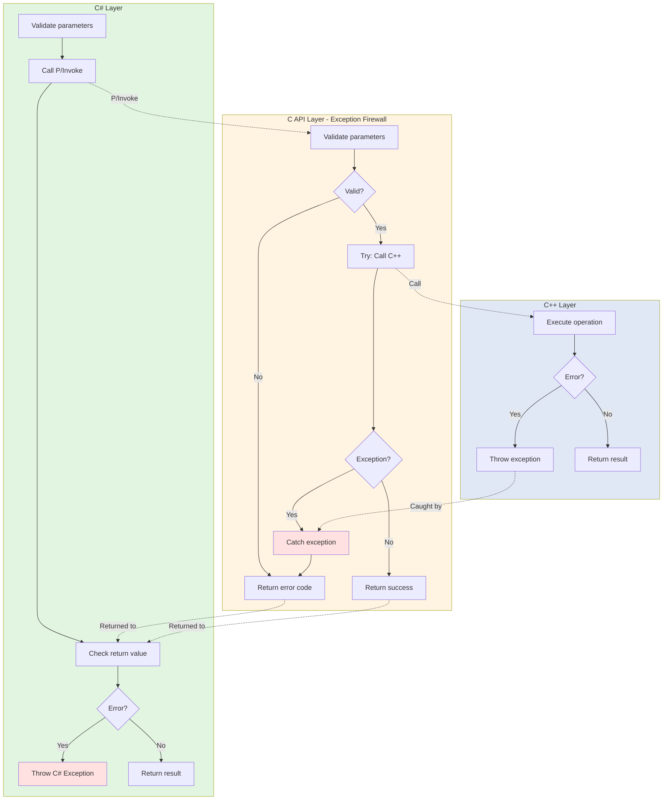

# Error Handling in SkiaSharp

> **Quick Start:** For a practical tutorial, see [QUICKSTART.md](QUICKSTART.md)  
> **Quick Reference:** For a 2-minute overview, see [AGENTS.md](../AGENTS.md)

## TL;DR

**Exception firewall at C API layer:**

- **C++ Layer:** Can throw exceptions normally
- **C API Layer:** **NEVER throws exceptions** - catches all and returns error codes
- **C# Layer:** Throws typed C# exceptions

**Three error patterns:**
1. **Boolean returns** - `TryXxx()` methods return `true`/`false`
2. **Null returns** - Factory methods return `nullptr` on failure
3. **Void methods** - Defensive null checks, fail silently

**Key principle:** C++ exceptions cannot cross the C API boundary (would crash).

**C API template:**
```cpp
SK_C_API result_type sk_function(...) {
    if (!param) return error_value;  // Defensive check
    try {
        return CallCppFunction();
    } catch (...) {
        return error_value;  // Catch ALL exceptions
    }
}
```

---

## Introduction

Error handling in SkiaSharp must navigate the complexities of crossing managed/unmanaged boundaries while maintaining safety and usability. This document explains how errors propagate through the three-layer architecture and the patterns used at each layer.

## Core Challenge: The C API Boundary

The fundamental challenge in SkiaSharp error handling is that **C++ exceptions cannot cross the C API boundary safely**. This constraint shapes all error handling strategies.

### Why C++ Exceptions Can't Cross C Boundaries

```cpp
// UNSAFE - Exception would crash across C boundary
SK_C_API void unsafe_function() {
    throw std::runtime_error("Error!");  // ❌ CRASH!
}

// SAFE - C functions never throw
SK_C_API bool safe_function() {
    try {
        // C++ code that might throw
    } catch (...) {
        return false;  // Convert to error code
    }
    return true;
}
```

**Reasons:**
1. C has no exception mechanism
2. Different ABIs handle stack unwinding differently
3. P/Invoke boundary doesn't support exceptions
4. Would corrupt managed/unmanaged stacks

## Error Handling Strategy by Layer



**Layer characteristics:**

```
┌─────────────────────────────────────────────────┐
│ C# Layer                                        │
│ ✓ Throws C# exceptions                          │
│ ✓ Validates parameters before P/Invoke          │
│ ✓ Checks return values from C API               │
└─────────────────┬───────────────────────────────┘
                  │
┌─────────────────▼───────────────────────────────┐
│ C API Layer (Exception Boundary)                │
│ ✓ Catches all C++ exceptions                    │
│ ✓ Returns error codes/bools                     │
│ ✓ Uses sentinel values (null, false)            │
│ ✗ Never throws exceptions                       │
└─────────────────┬───────────────────────────────┘
                  │
┌─────────────────▼───────────────────────────────┐
│ C++ Skia Layer                                  │
│ ✓ May throw C++ exceptions                      │
│ ✓ Uses assertions for invalid states            │
│ ✓ Relies on RAII for cleanup                    │
└─────────────────────────────────────────────────┘
```

## Layer 1: C# Error Handling

The C# layer is responsible for:
1. **Proactive validation** before calling native code
2. **Interpreting error signals** from C API
3. **Throwing appropriate C# exceptions**

### Pattern 1: Parameter Validation

Validate parameters **before** P/Invoking to avoid undefined behavior in native code.

```csharp
public class SKCanvas : SKObject
{
    public void DrawRect(SKRect rect, SKPaint paint)
    {
        // Validate parameters before calling native code
        if (paint == null)
            throw new ArgumentNullException(nameof(paint));
        
        // Check object state
        if (Handle == IntPtr.Zero)
            throw new ObjectDisposedException("SKCanvas");
        
        // Call native - at this point parameters are valid
        SkiaApi.sk_canvas_draw_rect(Handle, &rect, paint.Handle);
    }
}
```

**Common validations:**
- Null checks for reference parameters
- Range checks for numeric values
- State checks (disposed objects)
- Array bounds checks

### Pattern 2: Return Value Checking

Check return values from C API and throw exceptions for errors.

```csharp
public class SKImage : SKObject, ISKReferenceCounted
{
    public static SKImage FromEncodedData(SKData data)
    {
        if (data == null)
            throw new ArgumentNullException(nameof(data));
        
        var handle = SkiaApi.sk_image_new_from_encoded(data.Handle);
        
        // Check for null handle = failure
        if (handle == IntPtr.Zero)
            throw new InvalidOperationException("Failed to create image from encoded data");
        
        return GetObject(handle);
    }
    
    public bool ReadPixels(SKImageInfo dstInfo, IntPtr dstPixels, int dstRowBytes, int srcX, int srcY)
    {
        // Boolean return indicates success/failure
        var success = SkiaApi.sk_image_read_pixels(
            Handle, &dstInfo, dstPixels, dstRowBytes, srcX, srcY, 
            SKImageCachingHint.Allow);
        
        if (!success)
        {
            // Option 1: Return false (let caller handle)
            return false;
            
            // Option 2: Throw exception (for critical failures)
            // throw new InvalidOperationException("Failed to read pixels");
        }
        
        return true;
    }
}
```

### Pattern 3: Constructor Failures

Constructors must ensure valid object creation or throw.

```csharp
public class SKBitmap : SKObject
{
    public SKBitmap(SKImageInfo info)
        : base(IntPtr.Zero, true)
    {
        var nInfo = SKImageInfoNative.FromManaged(ref info);
        Handle = SkiaApi.sk_bitmap_new();
        
        if (Handle == IntPtr.Zero)
            throw new InvalidOperationException("Failed to create bitmap");
        
        // Try to allocate pixels
        if (!SkiaApi.sk_bitmap_try_alloc_pixels(Handle, &nInfo))
        {
            // Clean up partial object
            SkiaApi.sk_bitmap_destructor(Handle);
            Handle = IntPtr.Zero;
            throw new InvalidOperationException("Failed to allocate bitmap pixels");
        }
    }
}
```

### Pattern 4: Disposal Safety

Ensure disposal methods never throw.

```csharp
protected override void DisposeNative()
{
    try
    {
        if (this is ISKReferenceCounted refcnt)
            refcnt.SafeUnRef();
        // Never throw from dispose
    }
    catch
    {
        // Swallow exceptions in dispose
        // Logging could happen here if available
    }
}
```

### Common C# Exception Types

| Exception | When to Use |
|-----------|-------------|
| `ArgumentNullException` | Null parameter passed |
| `ArgumentOutOfRangeException` | Numeric value out of valid range |
| `ArgumentException` | Invalid argument value |
| `ObjectDisposedException` | Operation on disposed object |
| `InvalidOperationException` | Object in wrong state or operation failed |
| `NotSupportedException` | Operation not supported on this platform |

## Layer 2: C API Error Handling

The C API layer acts as the **exception firewall**. It must:
1. **Catch all C++ exceptions**
2. **Convert to C-compatible error signals**
3. **Never let exceptions escape**

### Pattern 1: Try-Catch Wrapper

Every C API function that calls C++ code should be wrapped in try-catch.

```cpp
// Unsafe - exceptions could escape
SK_C_API void sk_canvas_draw_rect_UNSAFE(sk_canvas_t* canvas, const sk_rect_t* rect, const sk_paint_t* paint) {
    AsCanvas(canvas)->drawRect(*AsRect(rect), *AsPaint(paint));  // Could throw!
}

// Safe - exceptions caught
SK_C_API void sk_canvas_draw_rect(sk_canvas_t* canvas, const sk_rect_t* rect, const sk_paint_t* paint) {
    try {
        AsCanvas(canvas)->drawRect(*AsRect(rect), *AsPaint(paint));
    } catch (...) {
        // Log or ignore - cannot throw across C boundary
    }
}
```

**Note:** In practice, most Skia functions don't throw, so try-catch is often omitted for performance. Critical functions or those calling user code should have protection.

### Pattern 2: Boolean Return for Success/Failure

```cpp
SK_C_API bool sk_bitmap_try_alloc_pixels(sk_bitmap_t* cbitmap, const sk_imageinfo_t* cinfo) {
    try {
        return AsBitmap(cbitmap)->tryAllocPixels(AsImageInfo(cinfo));
    } catch (...) {
        return false;
    }
}

SK_C_API bool sk_image_read_pixels(
    const sk_image_t* image,
    const sk_imageinfo_t* dstInfo,
    void* dstPixels,
    size_t dstRowBytes,
    int srcX, int srcY,
    sk_image_caching_hint_t cachingHint)
{
    try {
        return AsImage(image)->readPixels(
            AsImageInfo(dstInfo), dstPixels, dstRowBytes, srcX, srcY,
            (SkImage::CachingHint)cachingHint);
    } catch (...) {
        return false;
    }
}
```

### Pattern 3: Null Return for Failure

Factory functions return null pointer on failure.

```cpp
SK_C_API sk_image_t* sk_image_new_from_encoded(const sk_data_t* data) {
    try {
        auto image = SkImages::DeferredFromEncodedData(sk_ref_sp(AsData(data)));
        return ToImage(image.release());  // Returns nullptr if creation failed
    } catch (...) {
        return nullptr;
    }
}

SK_C_API sk_surface_t* sk_surface_new_raster(const sk_imageinfo_t* cinfo) {
    try {
        auto surface = SkSurfaces::Raster(AsImageInfo(cinfo));
        return ToSurface(surface.release());
    } catch (...) {
        return nullptr;
    }
}
```

### Pattern 4: Out Parameters for Error Details

Some functions use out parameters to provide error information.

```cpp
SK_C_API sk_codec_t* sk_codec_new_from_data(sk_data_t* data, sk_codec_result_t* result) {
    try {
        SkCodec::Result res;
        auto codec = SkCodec::MakeFromData(sk_ref_sp(AsData(data)), &res);
        if (result)
            *result = (sk_codec_result_t)res;
        return ToCodec(codec.release());
    } catch (...) {
        if (result)
            *result = SK_CODEC_ERROR_INTERNAL_ERROR;
        return nullptr;
    }
}
```

### Pattern 5: Defensive Null Checks

Always check pointers before dereferencing.

```cpp
SK_C_API void sk_canvas_draw_paint(sk_canvas_t* canvas, const sk_paint_t* paint) {
    if (!canvas || !paint)
        return;  // Silently ignore null pointers
    
    AsCanvas(canvas)->drawPaint(*AsPaint(paint));
}

// Or with more information:
SK_C_API int sk_canvas_get_save_count(sk_canvas_t* canvas) {
    if (!canvas)
        return 0;  // Return safe default
    
    return AsCanvas(canvas)->getSaveCount();
}
```

### What C API Does NOT Do

❌ **Never throws exceptions**
```cpp
// WRONG
SK_C_API void sk_function() {
    throw std::exception();  // ❌ Never do this
}
```

❌ **Doesn't use output error codes for simple operations**
```cpp
// Overkill for simple operations
SK_C_API void sk_paint_set_color(sk_paint_t* paint, sk_color_t color, int* error);

// Better - void return, parameter validation in C#
SK_C_API void sk_paint_set_color(sk_paint_t* paint, sk_color_t color);
```

❌ **Doesn't crash on invalid input** (when possible)
```cpp
// WRONG - crashes on null
SK_C_API void sk_canvas_draw_rect(sk_canvas_t* canvas, const sk_rect_t* rect, const sk_paint_t* paint) {
    AsCanvas(canvas)->drawRect(*AsRect(rect), *AsPaint(paint));  // Crashes if null
}

// BETTER - defensive
SK_C_API void sk_canvas_draw_rect(sk_canvas_t* canvas, const sk_rect_t* rect, const sk_paint_t* paint) {
    if (!canvas || !rect || !paint)
        return;
    AsCanvas(canvas)->drawRect(*AsRect(rect), *AsPaint(paint));
}
```

## Layer 3: C++ Skia Error Handling

The C++ layer can use normal C++ error handling:
- Exceptions for exceptional cases
- Return values for expected failures
- Assertions for programming errors

**Skia's approach:**
- Minimal exception usage (mostly for allocation failures)
- Return nullptr or false for failures
- Assertions (SK_ASSERT) for debug builds
- Graceful degradation when possible

```cpp
// Skia C++ patterns
sk_sp<SkImage> SkImages::DeferredFromEncodedData(sk_sp<SkData> data) {
    if (!data) {
        return nullptr;  // Return null, don't throw
    }
    // ... create image or return nullptr on failure
}

bool SkBitmap::tryAllocPixels(const SkImageInfo& info) {
    // Returns false if allocation fails
    return this->tryAllocPixelsInfo(info);
}
```

## Complete Error Flow Examples

### Example 1: Drawing with Invalid Paint (Null Check)

```csharp
// C# Layer - Validation
public void DrawRect(SKRect rect, SKPaint paint)
{
    if (paint == null)
        throw new ArgumentNullException(nameof(paint));  // ✓ Caught here
    
    SkiaApi.sk_canvas_draw_rect(Handle, &rect, paint.Handle);
}

// If validation was missing:
// P/Invoke would pass IntPtr.Zero
// ↓
// C API Layer - Defensive Check
SK_C_API void sk_canvas_draw_rect(sk_canvas_t* canvas, const sk_rect_t* rect, const sk_paint_t* paint) {
    if (!canvas || !rect || !paint)
        return;  // ✓ Silently ignore - prevent crash
    
    AsCanvas(canvas)->drawRect(*AsRect(rect), *AsPaint(paint));
}
```

### Example 2: Image Creation Failure

```csharp
// C# Layer
public static SKImage FromEncodedData(SKData data)
{
    if (data == null)
        throw new ArgumentNullException(nameof(data));  // ✓ Validate input
    
    var handle = SkiaApi.sk_image_new_from_encoded(data.Handle);
    
    if (handle == IntPtr.Zero)
        throw new InvalidOperationException("Failed to decode image");  // ✓ Check result
    
    return GetObject(handle);
}

// C API Layer
SK_C_API sk_image_t* sk_image_new_from_encoded(const sk_data_t* data) {
    try {
        auto image = SkImages::DeferredFromEncodedData(sk_ref_sp(AsData(data)));
        return ToImage(image.release());  // Returns nullptr if failed
    } catch (...) {
        return nullptr;  // ✓ Catch exceptions, return null
    }
}

// C++ Layer
sk_sp<SkImage> SkImages::DeferredFromEncodedData(sk_sp<SkData> data) {
    if (!data) {
        return nullptr;  // ✓ Return null on invalid input
    }
    
    auto codec = SkCodec::MakeFromData(data);
    if (!codec) {
        return nullptr;  // ✓ Decoding failed, return null
    }
    
    return SkImages::DeferredFromCodec(std::move(codec));
}
```

### Example 3: Operation on Disposed Object

```csharp
// C# Layer
public void DrawRect(SKRect rect, SKPaint paint)
{
    if (Handle == IntPtr.Zero)
        throw new ObjectDisposedException("SKCanvas");  // ✓ Check state
    
    if (paint == null)
        throw new ArgumentNullException(nameof(paint));
    
    if (paint.Handle == IntPtr.Zero)
        throw new ObjectDisposedException("SKPaint");  // ✓ Check parameter state
    
    SkiaApi.sk_canvas_draw_rect(Handle, &rect, paint.Handle);
}
```

### Example 4: Pixel Allocation Failure

```csharp
// C# Layer
public class SKBitmap : SKObject
{
    public SKBitmap(SKImageInfo info)
        : base(IntPtr.Zero, true)
    {
        var nInfo = SKImageInfoNative.FromManaged(ref info);
        Handle = SkiaApi.sk_bitmap_new();
        
        if (Handle == IntPtr.Zero)
            throw new InvalidOperationException("Failed to create bitmap");  // ✓ Check creation
        
        if (!SkiaApi.sk_bitmap_try_alloc_pixels(Handle, &nInfo))
        {
            // ✓ Allocation failed - clean up and throw
            SkiaApi.sk_bitmap_destructor(Handle);
            Handle = IntPtr.Zero;
            throw new InvalidOperationException(
                $"Failed to allocate pixels for {info.Width}x{info.Height} bitmap");
        }
    }
}

// C API Layer
SK_C_API bool sk_bitmap_try_alloc_pixels(sk_bitmap_t* cbitmap, const sk_imageinfo_t* cinfo) {
    if (!cbitmap || !cinfo)
        return false;  // ✓ Defensive null check
    
    try {
        return AsBitmap(cbitmap)->tryAllocPixels(AsImageInfo(cinfo));
    } catch (...) {
        return false;  // ✓ Catch allocation exception
    }
}

// C++ Layer
bool SkBitmap::tryAllocPixels(const SkImageInfo& info) {
    // Returns false if allocation fails (out of memory, invalid size, etc.)
    if (!this->setInfo(info)) {
        return false;
    }
    
    auto allocator = SkBitmapAllocator::Make(info);
    if (!allocator) {
        return false;  // ✓ Allocation failed
    }
    
    fPixelRef = std::move(allocator);
    return true;
}
```

## Error Handling Best Practices

### For C# Layer

✅ **DO:**
- Validate all parameters before P/Invoke
- Check object state (disposed, valid handle)
- Check return values from C API
- Throw appropriate exception types
- Use meaningful error messages

❌ **DON'T:**
- Assume C API will validate
- Ignore return values
- Throw from Dispose/finalizer
- Use generic exceptions without context

### For C API Layer

✅ **DO:**
- Catch all C++ exceptions
- Return error codes (bool, null, enum)
- Check pointers before dereferencing
- Return safe defaults on error
- Use try-catch for risky operations

❌ **DON'T:**
- Let exceptions escape to C#
- Crash on invalid input
- Use complex error reporting
- Throw exceptions

### For Both Layers

✅ **DO:**
- Fail fast with clear errors
- Provide useful error messages
- Clean up resources on failure
- Document error conditions

❌ **DON'T:**
- Silently ignore errors (unless documented)
- Leave objects in invalid state
- Leak resources on error paths

## Debugging Failed Operations

### When a C# call fails:

1. **Check C# validation** - Did parameter validation catch it?
2. **Check return value** - Is C API returning error?
3. **Check C API implementation** - Is it catching exceptions?
4. **Check C++ behavior** - What does Skia return?
5. **Check documentation** - Is the operation supported?

### Common Failure Scenarios

| Symptom | Likely Cause | Solution |
|---------|--------------|----------|
| `ArgumentNullException` | Null parameter | Check calling code |
| `ObjectDisposedException` | Using disposed object | Check lifecycle |
| `InvalidOperationException` | C API returned error | Check C API return value |
| Crash in native code | Null pointer in C API | Add C API null checks |
| Silent failure | Error not propagated | Add return value checks |

## Platform-Specific Error Handling

Some operations may fail on specific platforms:

```csharp
public static GRContext CreateGl()
{
    var handle = SkiaApi.gr_direct_context_make_gl(IntPtr.Zero);
    
    if (handle == IntPtr.Zero)
    {
        #if __IOS__ || __TVOS__
        throw new PlatformNotSupportedException("OpenGL not supported on iOS/tvOS");
        #else
        throw new InvalidOperationException("Failed to create OpenGL context");
        #endif
    }
    
    return GetObject(handle);
}
```

## Summary

Error handling in SkiaSharp follows a defense-in-depth approach:

1. **C# Layer**: Proactive validation and exception throwing
2. **C API Layer**: Exception firewall, error code returns
3. **C++ Layer**: Normal C++ error handling

Key principles:
- Never let C++ exceptions cross C API boundary
- Validate early in C# layer
- Check all return values
- Provide clear error messages
- Clean up on all error paths
- Never throw from dispose methods

## Next Steps

- See [Memory Management](memory-management.md) for cleanup on error paths
- See [Adding New APIs](adding-new-apis.md) for implementing error handling in new bindings
