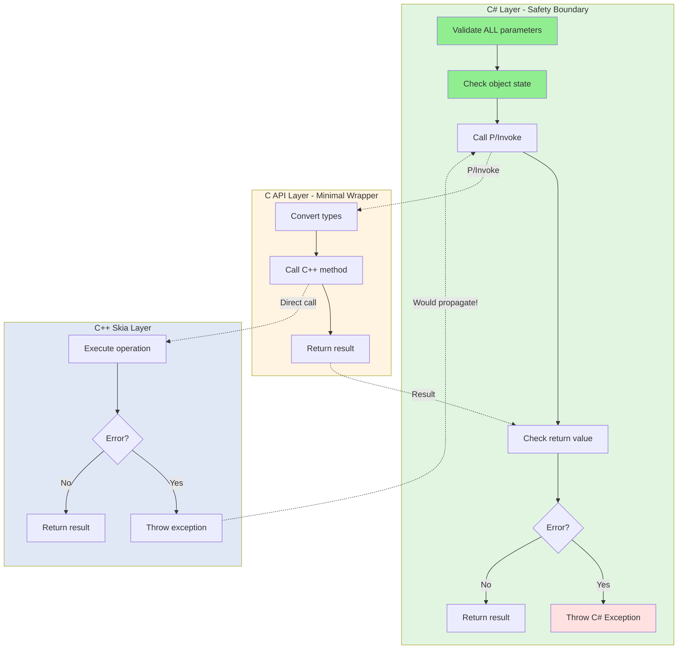

# Error Handling in SkiaSharp

> **Quick Start:** For a practical tutorial, see [QUICKSTART.md](QUICKSTART.md)  
> **Quick Reference:** For a 2-minute overview, see [AGENTS.md](../AGENTS.md)

## TL;DR

**Safety enforced at C# layer:**

- **C++ Layer:** Can throw exceptions normally
- **C API Layer:** **Thin wrapper** - Does NOT catch exceptions or validate parameters
- **C# Layer:** Validates all parameters, checks all returns, throws typed C# exceptions

**C# error patterns:**
1. **Parameter validation** - Throw `ArgumentNullException`, `ArgumentException`, etc.
2. **Return value checking** - Null handles → throw `InvalidOperationException`
3. **State checking** - Disposed objects → throw `ObjectDisposedException`

**Key principle:** C# layer is the safety boundary - it prevents invalid calls from reaching C API.

**Actual implementation:**
```csharp
// C# MUST validate before P/Invoke
public void DrawRect(SKRect rect, SKPaint paint)
{
    if (paint == null)
        throw new ArgumentNullException(nameof(paint));
    if (Handle == IntPtr.Zero)
        throw new ObjectDisposedException(nameof(SKCanvas));
    
    SkiaApi.sk_canvas_draw_rect(Handle, &rect, paint.Handle);
}
```

```cpp
// C API trusts C# validation - minimal wrapper
SK_C_API void sk_canvas_draw_rect(sk_canvas_t* canvas, const sk_rect_t* rect, const sk_paint_t* paint) {
    AsCanvas(canvas)->drawRect(*AsRect(rect), *AsPaint(paint));
}
```

---

## Introduction

Error handling in SkiaSharp must navigate the complexities of crossing managed/unmanaged boundaries while maintaining safety and usability. This document explains how errors propagate through the three-layer architecture and the patterns used at each layer.

## Core Challenge: Managed/Unmanaged Boundary

The fundamental challenge in SkiaSharp error handling is preventing invalid operations from reaching native code, where they would cause crashes.

### Safety Strategy: Validate in C#

**SkiaSharp's approach:**
- **C# layer validates ALL parameters** before calling P/Invoke
- **C API is a minimal wrapper** - no exception handling, no null checks
- **Performance optimization** - single validation point instead of double-checking

```csharp
// ✅ CORRECT - C# validates everything
public void DrawRect(SKRect rect, SKPaint paint)
{
    // Validation happens here
    if (paint == null)
        throw new ArgumentNullException(nameof(paint));
    if (Handle == IntPtr.Zero)
        throw new ObjectDisposedException(nameof(SKCanvas));
    
    // At this point, all parameters are valid
    SkiaApi.sk_canvas_draw_rect(Handle, &rect, paint.Handle);
}
```

```cpp
// C API trusts C# - no validation needed
SK_C_API void sk_canvas_draw_rect(sk_canvas_t* canvas, const sk_rect_t* rect, const sk_paint_t* paint) {
    AsCanvas(canvas)->drawRect(*AsRect(rect), *AsPaint(paint));
}
```

**Why this works:**
1. C# wrapper is the only caller of C API (users never call C API directly)
2. Single validation point is more efficient than validating in both C# and C
3. C# exceptions provide better error messages than C error codes
4. Simplifies C API implementation

## Error Handling Strategy by Layer



**Layer characteristics:**

```
┌─────────────────────────────────────────────────┐
│ C# Layer - SAFETY BOUNDARY                      │
│ ✓ Validates ALL parameters before P/Invoke      │
│ ✓ Checks ALL return values from C API           │
│ ✓ Checks object state (disposed, etc.)          │
│ ✓ Throws typed C# exceptions                    │
│ → Ensures only valid calls reach C API          │
└─────────────────┬───────────────────────────────┘
                  │
┌─────────────────▼───────────────────────────────┐
│ C API Layer - MINIMAL WRAPPER                   │
│ ✓ Converts opaque pointers to C++ types         │
│ ✓ Calls C++ methods directly                    │
│ ✓ Returns results to C#                         │
│ ✗ Does NOT validate parameters                  │
│ ✗ Does NOT catch exceptions                     │
│ → Trusts C# has validated everything            │
└─────────────────┬───────────────────────────────┘
                  │
┌─────────────────▼───────────────────────────────┐
│ C++ Skia Layer                                  │
│ ✓ May throw C++ exceptions                      │
│ ✓ Uses assertions for invalid states            │
│ ✓ Relies on RAII for cleanup                    │
│ → Only receives valid inputs from C# via C API  │
└─────────────────────────────────────────────────┘
```

## Layer 1: C# Error Handling

The C# layer is responsible for:
1. **Proactive validation** before calling native code
2. **Interpreting error signals** from C API
3. **Throwing appropriate C# exceptions**

### Pattern 1: Parameter Validation

Validate parameters **before** P/Invoking to avoid undefined behavior in native code.

```csharp
public class SKCanvas : SKObject
{
    public void DrawRect(SKRect rect, SKPaint paint)
    {
        // Validate parameters before calling native code
        if (paint == null)
            throw new ArgumentNullException(nameof(paint));
        
        // Check object state
        if (Handle == IntPtr.Zero)
            throw new ObjectDisposedException("SKCanvas");
        
        // Call native - at this point parameters are valid
        SkiaApi.sk_canvas_draw_rect(Handle, &rect, paint.Handle);
    }
}
```

**Common validations:**
- Null checks for reference parameters
- Range checks for numeric values
- State checks (disposed objects)
- Array bounds checks

### Pattern 2: Return Value Checking

Check return values from C API and throw exceptions for errors.

```csharp
public class SKImage : SKObject, ISKReferenceCounted
{
    public static SKImage FromEncodedData(SKData data)
    {
        if (data == null)
            throw new ArgumentNullException(nameof(data));
        
        var handle = SkiaApi.sk_image_new_from_encoded(data.Handle);
        
        // Check for null handle = failure
        if (handle == IntPtr.Zero)
            throw new InvalidOperationException("Failed to create image from encoded data");
        
        return GetObject(handle);
    }
    
    public bool ReadPixels(SKImageInfo dstInfo, IntPtr dstPixels, int dstRowBytes, int srcX, int srcY)
    {
        // Boolean return indicates success/failure
        var success = SkiaApi.sk_image_read_pixels(
            Handle, &dstInfo, dstPixels, dstRowBytes, srcX, srcY, 
            SKImageCachingHint.Allow);
        
        if (!success)
        {
            // Option 1: Return false (let caller handle)
            return false;
            
            // Option 2: Throw exception (for critical failures)
            // throw new InvalidOperationException("Failed to read pixels");
        }
        
        return true;
    }
}
```

### Pattern 3: Constructor Failures

Constructors must ensure valid object creation or throw.

```csharp
public class SKBitmap : SKObject
{
    public SKBitmap(SKImageInfo info)
        : base(IntPtr.Zero, true)
    {
        var nInfo = SKImageInfoNative.FromManaged(ref info);
        Handle = SkiaApi.sk_bitmap_new();
        
        if (Handle == IntPtr.Zero)
            throw new InvalidOperationException("Failed to create bitmap");
        
        // Try to allocate pixels
        if (!SkiaApi.sk_bitmap_try_alloc_pixels(Handle, &nInfo))
        {
            // Clean up partial object
            SkiaApi.sk_bitmap_destructor(Handle);
            Handle = IntPtr.Zero;
            throw new InvalidOperationException("Failed to allocate bitmap pixels");
        }
    }
}
```

### Pattern 4: Disposal Safety

Ensure disposal methods never throw.

```csharp
protected override void DisposeNative()
{
    try
    {
        if (this is ISKReferenceCounted refcnt)
            refcnt.SafeUnRef();
        // Never throw from dispose
    }
    catch
    {
        // Swallow exceptions in dispose
        // Logging could happen here if available
    }
}
```

### Common C# Exception Types

| Exception | When to Use |
|-----------|-------------|
| `ArgumentNullException` | Null parameter passed |
| `ArgumentOutOfRangeException` | Numeric value out of valid range |
| `ArgumentException` | Invalid argument value |
| `ObjectDisposedException` | Operation on disposed object |
| `InvalidOperationException` | Object in wrong state or operation failed |
| `NotSupportedException` | Operation not supported on this platform |

## Layer 2: C API Implementation (Actual)

The C API layer is a **minimal wrapper** that:
1. **Converts types** - Opaque pointers to C++ types
2. **Calls C++ methods** - Direct pass-through
3. **Returns results** - Back to C#

**It does NOT:**
- ❌ Validate parameters (C# does this)
- ❌ Catch exceptions (Skia rarely throws; C# prevents invalid inputs)
- ❌ Check for null pointers (C# ensures valid pointers)

### Actual Pattern: Direct Pass-Through

Most C API functions are simple wrappers with no error handling:

```cpp
// Void methods - direct call
SK_C_API void sk_canvas_draw_rect(sk_canvas_t* canvas, const sk_rect_t* rect, const sk_paint_t* paint) {
    AsCanvas(canvas)->drawRect(*AsRect(rect), *AsPaint(paint));
}

SK_C_API void sk_canvas_clear(sk_canvas_t* canvas, sk_color_t color) {
    AsCanvas(canvas)->clear(color);
}

SK_C_API void sk_paint_set_color(sk_paint_t* paint, sk_color_t color) {
    AsPaint(paint)->setColor(color);
}
```

### Pattern: Boolean Return (Native Result)

Some C++ methods naturally return bool - C API passes it through:

```cpp
// C++ method returns bool, C API passes it through
SK_C_API bool sk_bitmap_try_alloc_pixels(sk_bitmap_t* bitmap, const sk_imageinfo_t* info) {
    return AsBitmap(bitmap)->tryAllocPixels(AsImageInfo(info));
}

SK_C_API bool sk_image_read_pixels(const sk_image_t* image, const sk_imageinfo_t* dstInfo,
                                    void* dstPixels, size_t dstRowBytes, int srcX, int srcY) {
    return AsImage(image)->readPixels(AsImageInfo(dstInfo), dstPixels, dstRowBytes, srcX, srcY);
}
```

**Note:** C# checks the returned `bool` and throws exceptions if needed.

### Pattern: Null Return (Factory Methods)

Factory methods return `nullptr` naturally if creation fails:

```cpp
// Returns nullptr if Skia factory fails
SK_C_API sk_image_t* sk_image_new_from_encoded(const sk_data_t* data) {
    return ToImage(SkImages::DeferredFromEncodedData(sk_ref_sp(AsData(data))).release());
}

SK_C_API sk_surface_t* sk_surface_new_raster(const sk_imageinfo_t* info) {
    return ToSurface(SkSurfaces::Raster(AsImageInfo(info)).release());
}

SK_C_API sk_shader_t* sk_shader_new_linear_gradient(/*...*/) {
    return ToShader(SkGradientShader::MakeLinear(/*...*/).release());
}
```

**Note:** C# checks for `IntPtr.Zero` and throws `InvalidOperationException` if null.

### Why No Exception Handling?

**Design decision reasons:**
1. **Performance** - No overhead from try-catch blocks
2. **Simplicity** - Minimal code in C API layer
3. **Single responsibility** - C# owns all validation
4. **Skia rarely throws** - Most Skia functions don't throw exceptions
5. **Trust boundary** - C API trusts its only caller (C# wrapper)

## Layer 3: C++ Skia Error Handling

The C++ layer can use normal C++ error handling:
- Exceptions for exceptional cases
- Return values for expected failures
- Assertions for programming errors

**Skia's approach:**
- Minimal exception usage (mostly for allocation failures)
- Return nullptr or false for failures
- Assertions (SK_ASSERT) for debug builds
- Graceful degradation when possible

```cpp
// Skia C++ patterns
sk_sp<SkImage> SkImages::DeferredFromEncodedData(sk_sp<SkData> data) {
    if (!data) {
        return nullptr;  // Return null, don't throw
    }
    // ... create image or return nullptr on failure
}

bool SkBitmap::tryAllocPixels(const SkImageInfo& info) {
    // Returns false if allocation fails
    return this->tryAllocPixelsInfo(info);
}
```

## Complete Error Flow Examples

### Example 1: Drawing with Invalid Paint (Null Check)

```csharp
// C# Layer - Validation
public void DrawRect(SKRect rect, SKPaint paint)
{
    if (paint == null)
        throw new ArgumentNullException(nameof(paint));  // ✓ Caught here
    
    SkiaApi.sk_canvas_draw_rect(Handle, &rect, paint.Handle);
}

// If validation was missing:
// P/Invoke would pass IntPtr.Zero
// ↓
// C API Layer - Defensive Check
SK_C_API void sk_canvas_draw_rect(sk_canvas_t* canvas, const sk_rect_t* rect, const sk_paint_t* paint) {
    if (!canvas || !rect || !paint)
        return;  // ✓ Silently ignore - prevent crash
    
    AsCanvas(canvas)->drawRect(*AsRect(rect), *AsPaint(paint));
}
```

### Example 2: Image Creation Failure

```csharp
// C# Layer
public static SKImage FromEncodedData(SKData data)
{
    if (data == null)
        throw new ArgumentNullException(nameof(data));  // ✓ Validate input
    
    var handle = SkiaApi.sk_image_new_from_encoded(data.Handle);
    
    if (handle == IntPtr.Zero)
        throw new InvalidOperationException("Failed to decode image");  // ✓ Check result
    
    return GetObject(handle);
}

// C API Layer
SK_C_API sk_image_t* sk_image_new_from_encoded(const sk_data_t* data) {
    try {
        auto image = SkImages::DeferredFromEncodedData(sk_ref_sp(AsData(data)));
        return ToImage(image.release());  // Returns nullptr if failed
    } catch (...) {
        return nullptr;  // ✓ Catch exceptions, return null
    }
}

// C++ Layer
sk_sp<SkImage> SkImages::DeferredFromEncodedData(sk_sp<SkData> data) {
    if (!data) {
        return nullptr;  // ✓ Return null on invalid input
    }
    
    auto codec = SkCodec::MakeFromData(data);
    if (!codec) {
        return nullptr;  // ✓ Decoding failed, return null
    }
    
    return SkImages::DeferredFromCodec(std::move(codec));
}
```

### Example 3: Operation on Disposed Object

```csharp
// C# Layer
public void DrawRect(SKRect rect, SKPaint paint)
{
    if (Handle == IntPtr.Zero)
        throw new ObjectDisposedException("SKCanvas");  // ✓ Check state
    
    if (paint == null)
        throw new ArgumentNullException(nameof(paint));
    
    if (paint.Handle == IntPtr.Zero)
        throw new ObjectDisposedException("SKPaint");  // ✓ Check parameter state
    
    SkiaApi.sk_canvas_draw_rect(Handle, &rect, paint.Handle);
}
```

### Example 4: Pixel Allocation Failure

```csharp
// C# Layer
public class SKBitmap : SKObject
{
    public SKBitmap(SKImageInfo info)
        : base(IntPtr.Zero, true)
    {
        var nInfo = SKImageInfoNative.FromManaged(ref info);
        Handle = SkiaApi.sk_bitmap_new();
        
        if (Handle == IntPtr.Zero)
            throw new InvalidOperationException("Failed to create bitmap");  // ✓ Check creation
        
        if (!SkiaApi.sk_bitmap_try_alloc_pixels(Handle, &nInfo))
        {
            // ✓ Allocation failed - clean up and throw
            SkiaApi.sk_bitmap_destructor(Handle);
            Handle = IntPtr.Zero;
            throw new InvalidOperationException(
                $"Failed to allocate pixels for {info.Width}x{info.Height} bitmap");
        }
    }
}

// C API Layer - Pass through the bool from C++
SK_C_API bool sk_bitmap_try_alloc_pixels(sk_bitmap_t* bitmap, const sk_imageinfo_t* info) {
    return AsBitmap(bitmap)->tryAllocPixels(AsImageInfo(info));
}

// C++ Layer
bool SkBitmap::tryAllocPixels(const SkImageInfo& info) {
    // Returns false if allocation fails (out of memory, invalid size, etc.)
    if (!this->setInfo(info)) {
        return false;
    }
    
    auto allocator = SkBitmapAllocator::Make(info);
    if (!allocator) {
        return false;  // ✓ Allocation failed
    }
    
    fPixelRef = std::move(allocator);
    return true;
}
```

**Note:** C++ method returns bool naturally, C API passes it through, C# checks it.

## Error Handling Best Practices

### For C# Layer

✅ **DO:**
- Validate ALL parameters before P/Invoke
- Check object state (disposed, valid handle)
- Check ALL return values from C API
- Throw appropriate exception types
- Use meaningful error messages
- Provide context in exception messages

❌ **DON'T:**
- Skip parameter validation (C API won't check)
- Ignore return values
- Throw from Dispose/finalizer
- Use generic exceptions without context
- Assume C API will handle errors

**Example of good C# error handling:**
```csharp
public void DrawRect(SKRect rect, SKPaint paint)
{
    // Validate ALL parameters
    if (paint == null)
        throw new ArgumentNullException(nameof(paint));
    
    // Check object state
    if (Handle == IntPtr.Zero)
        throw new ObjectDisposedException(nameof(SKCanvas));
    
    if (paint.Handle == IntPtr.Zero)
        throw new ObjectDisposedException(nameof(paint), "Paint has been disposed");
    
    // Safe to call C API
    SkiaApi.sk_canvas_draw_rect(Handle, &rect, paint.Handle);
}
```

### For C API Layer

✅ **DO:**
- Keep implementations simple and direct
- Pass through natural return values (bool, null)
- Trust that C# has validated everything
- Use `sk_ref_sp()` when passing ref-counted objects to C++
- Call `.release()` on `sk_sp<T>` when returning

❌ **DON'T:**
- Add unnecessary validation (C# already did it)
- Add try-catch blocks unless truly needed
- Modify Skia return values
- Throw exceptions

**Current implementation pattern:**
```cpp
// Simple, direct wrapper - trusts C# validation
SK_C_API void sk_canvas_draw_rect(sk_canvas_t* canvas, const sk_rect_t* rect, const sk_paint_t* paint) {
    AsCanvas(canvas)->drawRect(*AsRect(rect), *AsPaint(paint));
}

// Pass through natural bool return
SK_C_API bool sk_bitmap_try_alloc_pixels(sk_bitmap_t* bitmap, const sk_imageinfo_t* info) {
    return AsBitmap(bitmap)->tryAllocPixels(AsImageInfo(info));
}

// Factory returns nullptr naturally on failure
SK_C_API sk_image_t* sk_image_new_from_encoded(const sk_data_t* data) {
    return ToImage(SkImages::DeferredFromEncodedData(sk_ref_sp(AsData(data))).release());
}
```

### For Both Layers

✅ **DO:**
- Fail fast with clear errors
- Provide useful error messages
- Clean up resources on failure
- Document error conditions
- Test error paths

❌ **DON'T:**
- Silently ignore errors (unless documented)
- Leave objects in invalid state
- Leak resources on error paths

## Debugging Failed Operations

### When a C# call fails:

1. **Check C# validation** - Did parameter validation catch it?
2. **Check return value** - Is C API returning error?
3. **Check C API implementation** - Is it catching exceptions?
4. **Check C++ behavior** - What does Skia return?
5. **Check documentation** - Is the operation supported?

### Common Failure Scenarios

| Symptom | Likely Cause | Solution |
|---------|--------------|----------|
| `ArgumentNullException` | Null parameter | Check calling code |
| `ObjectDisposedException` | Using disposed object | Check lifecycle |
| `InvalidOperationException` | C API returned error | Check C API return value |
| Crash in native code | Invalid parameter from C# | Add/fix C# validation |
| Silent failure | Error not propagated | Add return value checks |

**Note:** If crashes occur in native code, it usually means C# validation is missing or incomplete.

## Platform-Specific Error Handling

Some operations may fail on specific platforms:

```csharp
public static GRContext CreateGl()
{
    var handle = SkiaApi.gr_direct_context_make_gl(IntPtr.Zero);
    
    if (handle == IntPtr.Zero)
    {
        #if __IOS__ || __TVOS__
        throw new PlatformNotSupportedException("OpenGL not supported on iOS/tvOS");
        #else
        throw new InvalidOperationException("Failed to create OpenGL context");
        #endif
    }
    
    return GetObject(handle);
}
```

## Summary

Error handling in SkiaSharp uses a **single safety boundary** approach:

1. **C# Layer (Safety Boundary)**: 
   - Validates ALL parameters
   - Checks ALL return values
   - Throws typed exceptions
   - Only layer that performs validation

2. **C API Layer (Minimal Wrapper)**: 
   - Direct pass-through to C++
   - No validation (trusts C#)
   - No exception handling (usually not needed)
   - Simple type conversion

3. **C++ Skia Layer**: 
   - Normal C++ error handling
   - Only receives valid inputs (via C#)
   - May return null/false on failures

Key principles:
- **C# is the safety boundary** - all validation happens here
- **C API trusts C#** - no duplicate validation
- **Fail fast** - validate before P/Invoke, not after
- **Check all returns** - null/false indicates failure
- **Clear error messages** - include context in exceptions
- **Never throw from Dispose** - swallow exceptions in cleanup

## Next Steps

- See [Memory Management](memory-management.md) for cleanup on error paths
- See [Adding New APIs](adding-new-apis.md) for implementing error handling in new bindings
