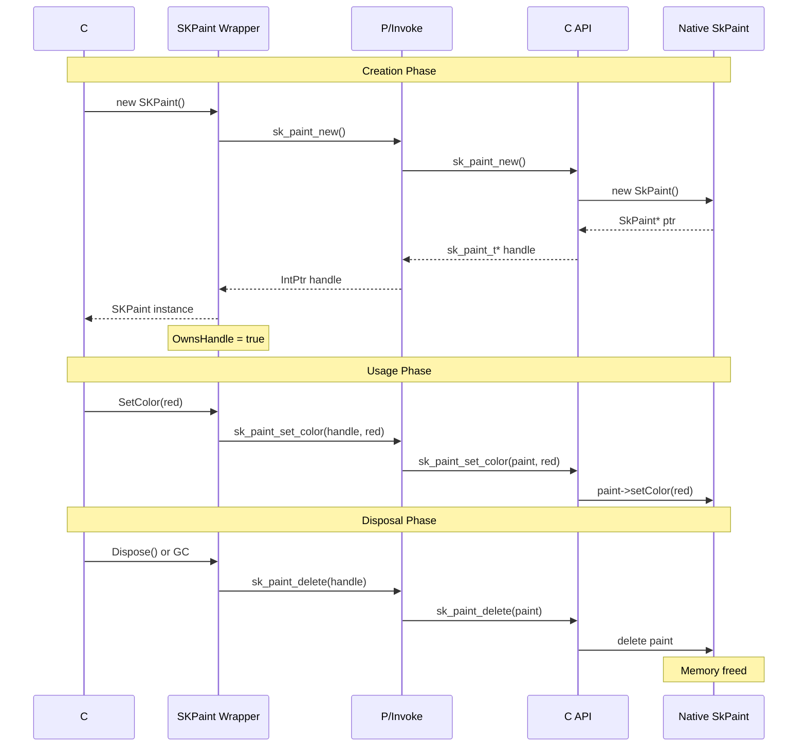
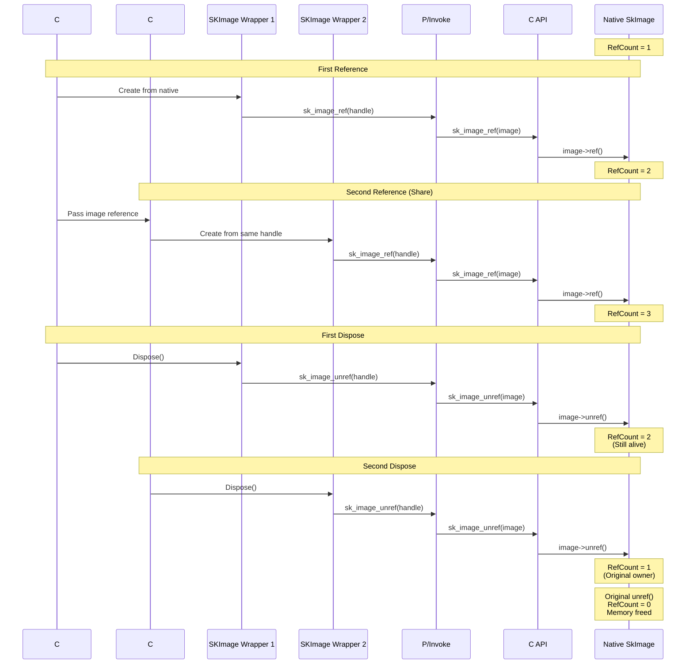
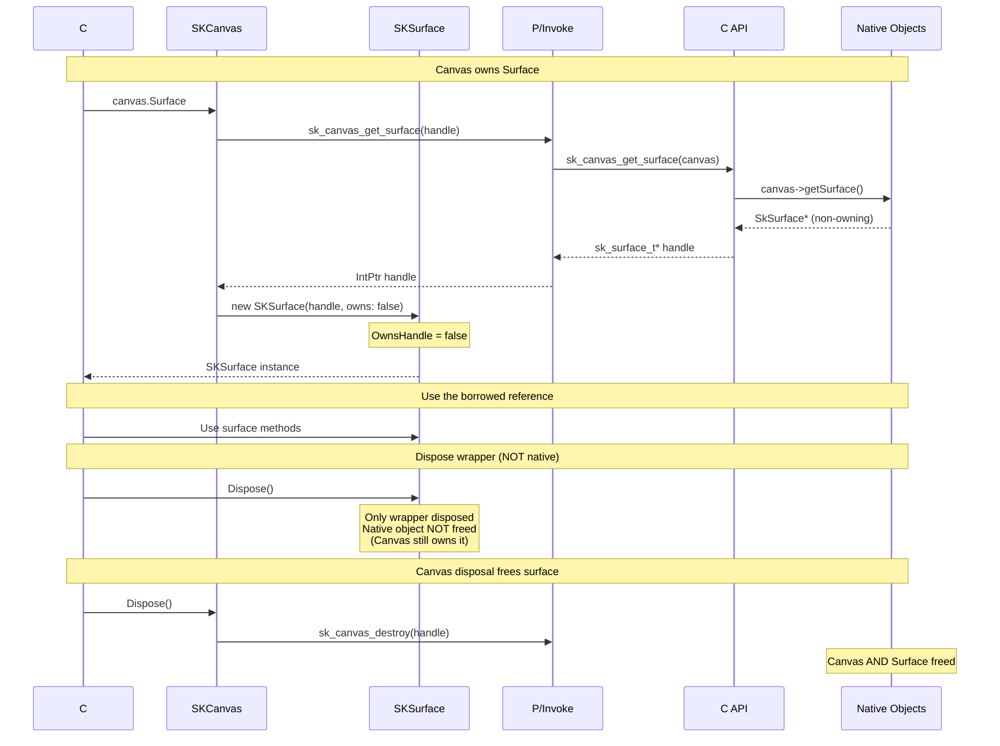

# Memory Management in SkiaSharp

> **Quick Start:** For a practical tutorial, see [QUICKSTART.md](QUICKSTART.md)  
> **Quick Reference:** For a 2-minute overview, see [AGENTS.md](../AGENTS.md)

## TL;DR

**Three pointer types determine memory management:**

1. **Raw Pointers (Non-Owning)** - Borrowed references, no cleanup
   - C++: `const SkType&` parameters, getter returns
   - C#: `owns: false` in constructor
   - Example: Paint parameter in `DrawRect(rect, paint)`

2. **Owned Pointers (Unique)** - One owner, explicit delete
   - C++: Mutable objects like Canvas, Paint, Bitmap
   - C API: `sk_type_new()` / `sk_type_delete()` pairs
   - C#: `DisposeNative()` calls delete/destroy

3. **Reference-Counted Pointers (Shared)** - Two variants:
   - **Virtual** (`SkRefCnt`): Image, Shader, Surface → 8-16 byte overhead
   - **Non-Virtual** (`SkNVRefCnt<T>`): Data, TextBlob → 4 byte overhead
   - Both use `sk_sp<T>` and ref/unref pattern
   - C#: `ISKReferenceCounted` or `ISKNonVirtualReferenceCounted`

**How to identify:** Check C++ class inheritance (`SkRefCnt`, `SkNVRefCnt<T>`, or mutable type)

**Critical:** Getting pointer type wrong → memory leaks or crashes

---

## Introduction

Understanding memory management is critical when working with SkiaSharp because it bridges managed C# code with unmanaged native code. This document explains the different pointer types used in Skia, how they map through the three layers, and how to properly manage object lifecycles.

## Overview: Three Pointer Type Categories

Skia uses three fundamental categories of pointer types for memory management:

1. **Raw Pointers** - Non-owning references, caller manages lifetime
2. **Owned Pointers** - Unique ownership, owner responsible for deletion
3. **Reference-Counted Pointers** - Shared ownership via reference counting

Understanding which category an API uses is essential for creating correct bindings.

## Memory Lifecycle Visualizations

### Lifecycle: Owned Pointer (Unique Ownership)



**Key Points:**
- Single owner (C# wrapper)
- Explicit disposal required
- No reference counting
- Deterministic cleanup with `using` statement

### Lifecycle: Reference-Counted Pointer (Shared Ownership)



**Key Points:**
- Multiple owners allowed
- Thread-safe reference counting
- Automatic cleanup when last reference dropped
- Each C# wrapper increments ref count

### Lifecycle: Raw Pointer (Borrowed Reference)



**Key Points:**
- No ownership transfer
- Parent object owns the native resource
- C# wrapper is just a view
- Disposing wrapper doesn't free native memory

## Pointer Type 1: Raw Pointers (Non-Owning)

### Native C++ Layer

**Identifier:** `SkType*` (raw pointer)

**Characteristics:**
- Non-owning reference to an object
- Temporary access only
- Caller or another object owns the lifetime
- Never deleted by the receiver
- Common for parameters and temporary references

**Example C++ APIs:**
```cpp
void SkCanvas::drawPaint(const SkPaint& paint);  // Reference (equivalent to const SkPaint*)
SkSurface* SkCanvas::getSurface() const;         // Raw pointer (canvas owns surface)
```

### C API Layer

**C Type:** `sk_type_t*` (opaque pointer)

**Characteristics:**
- Passed as-is without ownership transfer
- No ref/unref calls needed
- No destroy/delete function called on borrowed pointers

**Example C API:**
```cpp
// Canvas doesn't own the paint, just uses it temporarily
SK_C_API void sk_canvas_draw_paint(sk_canvas_t* canvas, const sk_paint_t* paint);

// Canvas owns the surface, returns non-owning pointer
SK_C_API sk_surface_t* sk_get_surface(sk_canvas_t* canvas);
```

### C# Wrapper Layer

**C# Pattern:** `IntPtr` handle, `OwnsHandle = false`

**Characteristics:**
- Wrapper created with `owns: false` parameter
- No disposal of native resource
- Wrapper lifecycle independent of native object
- Often registered in parent object's `OwnedObjects` collection

**Example C# API:**
```csharp
public class SKCanvas : SKObject
{
    // Paint is borrowed, not owned by this method
    public void DrawPaint(SKPaint paint)
    {
        if (paint == null)
            throw new ArgumentNullException(nameof(paint));
        SkiaApi.sk_canvas_draw_paint(Handle, paint.Handle);
        // Note: paint is NOT disposed here
    }
    
    // Surface is owned by canvas, return non-owning wrapper
    public SKSurface Surface
    {
        get {
            var handle = SkiaApi.sk_get_surface(Handle);
            // Create wrapper that doesn't own the handle
            return SKObject.GetOrAddObject(handle, owns: false, 
                (h, o) => new SKSurface(h, o));
        }
    }
}
```

**When to use:**
- Parameters that are only used during the function call
- Return values where the caller doesn't gain ownership
- Child objects owned by parent objects

## Pointer Type 2: Owned Pointers (Unique Ownership)

### Native C++ Layer

**Identifiers:**
- `new SkType()` - Raw allocation, caller must delete
- `std::unique_ptr<SkType>` - Unique ownership (rare in Skia)
- Most mutable Skia objects (SkCanvas, SkPaint, SkPath)

**Characteristics:**
- One owner at a time
- Owner responsible for calling destructor
- RAII: destructor called automatically in C++
- Ownership can transfer but not shared
- No reference counting overhead

**Example C++ APIs:**
```cpp
SkCanvas* canvas = new SkCanvas(bitmap);  // Caller owns, must delete
delete canvas;  // Explicit cleanup

SkPaint paint;  // Stack allocation, auto-destroyed
```

### C API Layer

**C Type:** `sk_type_t*` with `create`/`new` and `destroy`/`delete` functions

**Characteristics:**
- Constructor functions: `sk_type_new_*` or `sk_type_create_*`
- Destructor functions: `sk_type_destroy` or `sk_type_delete`
- Caller must explicitly destroy what they create
- No ref/unref functions

**Example C API:**
```cpp
// Owned pointer - create and destroy functions
SK_C_API sk_paint_t* sk_paint_new(void);
SK_C_API void sk_paint_delete(sk_paint_t* paint);

SK_C_API sk_canvas_t* sk_canvas_new_from_bitmap(const sk_bitmap_t* bitmap);
SK_C_API void sk_canvas_destroy(sk_canvas_t* canvas);
```

**Implementation pattern:**
```cpp
// Creation allocates with new
sk_paint_t* sk_paint_new(void) {
    return ToPaint(new SkPaint());
}

// Destruction uses delete
void sk_paint_delete(sk_paint_t* paint) {
    delete AsPaint(paint);
}
```

### C# Wrapper Layer

**C# Pattern:** `SKObject` with `OwnsHandle = true` and `DisposeNative()` override

**Characteristics:**
- Created with `owns: true` parameter (default)
- Calls destroy/delete function in `DisposeNative()`
- NOT reference counted
- Implements `IDisposable` for deterministic cleanup

**Example C# API:**
```csharp
public class SKPaint : SKObject, ISKSkipObjectRegistration
{
    public SKPaint()
        : base(IntPtr.Zero, true)
    {
        Handle = SkiaApi.sk_paint_new();
    }
    
    protected override void DisposeNative()
    {
        SkiaApi.sk_paint_delete(Handle);
    }
}

public class SKCanvas : SKObject
{
    public SKCanvas(SKBitmap bitmap)
        : base(IntPtr.Zero, true)
    {
        if (bitmap == null)
            throw new ArgumentNullException(nameof(bitmap));
        Handle = SkiaApi.sk_canvas_new_from_bitmap(bitmap.Handle);
    }
    
    protected override void DisposeNative()
    {
        SkiaApi.sk_canvas_destroy(Handle);
    }
}
```

**Ownership transfer example:**
```csharp
// When canvas takes ownership of a drawable
public void DrawDrawable(SKDrawable drawable)
{
    // Canvas takes ownership, C# wrapper releases it
    drawable.RevokeOwnership(this);
    SkiaApi.sk_canvas_draw_drawable(Handle, drawable.Handle, ...);
}
```

**When to use:**
- Objects that are uniquely owned
- Mutable objects like SKCanvas, SKPaint, SKPath, SKBitmap
- Objects allocated by user with deterministic lifetime

**Common types using owned pointers:**
- `SKCanvas` - Drawing surface
- `SKPaint` - Drawing attributes
- `SKPath` - Vector paths
- `SKBitmap` - Mutable bitmaps
- `SKRegion` - Clipping regions

## Pointer Type 3: Reference-Counted Pointers (Shared Ownership)

Reference-counted objects in Skia come in **two variants**: virtual (`SkRefCnt`) and non-virtual (`SkNVRefCnt`). Both use the same ref/unref pattern, but differ in size and virtual table overhead.

### Variant A: Virtual Reference Counting (`SkRefCnt`)

**Identifiers:**
- Inherits from `SkRefCnt` or `SkRefCntBase`
- Has virtual destructor (8-16 bytes overhead on most platforms)
- Used for polymorphic types that need virtual functions

**Characteristics:**
- Shared ownership via reference counting
- Thread-safe reference counting (atomic operations)
- Object deleted when ref count reaches zero
- Used with `sk_sp<T>` smart pointer
- Supports inheritance and virtual functions

**Example C++ APIs:**
```cpp
// Virtual ref-counted base class
class SkImage : public SkRefCnt { 
    virtual ~SkImage() { }
    // Virtual functions allowed
};

// Factory returns sk_sp<SkImage> (smart pointer)
sk_sp<SkImage> SkImages::DeferredFromEncodedData(sk_sp<SkData> data);

// Manual reference counting (rare, use sk_sp instead)
void ref() const;    // Increment reference count
void unref() const;  // Decrement, delete if zero
```

**Common types using SkRefCnt:**
- `SKImage` - Immutable images
- `SKShader` - Shader effects
- `SKColorFilter` - Color transformations
- `SKImageFilter` - Image effects
- `SKTypeface` - Font faces
- `SKSurface` - Drawing surfaces
- `SKPicture` - Recorded drawing commands

### Variant B: Non-Virtual Reference Counting (`SkNVRefCnt`)

**Identifiers:**
- Inherits from `SkNVRefCnt<T>` (template)
- No virtual destructor (4 bytes overhead instead of 8-16)
- Used for final types that don't need virtual functions

**Characteristics:**
- Same ref/unref semantics as `SkRefCnt`
- Thread-safe atomic reference counting
- Lighter weight (no vtable)
- Cannot be inherited from
- Used with `sk_sp<T>` smart pointer (same as SkRefCnt)

**Example C++ APIs:**
```cpp
// Non-virtual ref-counted (lighter weight)
class SK_API SkData final : public SkNVRefCnt<SkData> {
    // No virtual destructor needed
    // Cannot be inherited from (final)
};

class SK_API SkTextBlob final : public SkNVRefCnt<SkTextBlob> { ... };
class SK_API SkVertices : public SkNVRefCnt<SkVertices> { ... };
class SkColorSpace : public SkNVRefCnt<SkColorSpace> { ... };
```

**Common types using SkNVRefCnt:**
- `SKData` - Immutable byte arrays
- `SKTextBlob` - Positioned text
- `SKVertices` - Vertex data for meshes
- `SKColorSpace` - Color space definitions

**Why two variants exist:**
- `SkRefCnt`: Use when inheritance or virtual functions needed (most types)
- `SkNVRefCnt`: Use when performance matters and no virtuals needed (saves 4-12 bytes per object)

### Smart Pointer Behavior (Both Variants)

Both `SkRefCnt` and `SkNVRefCnt` work identically with `sk_sp<T>`:

```cpp
sk_sp<SkImage> image1 = SkImages::RasterFromBitmap(bitmap);  // ref count = 1
sk_sp<SkImage> image2 = image1;  // ref() called, ref count = 2
image1.reset();  // unref() called, ref count = 1
image2.reset();  // unref() called, ref count = 0, object deleted
```

### C API Layer

**C Type:** `sk_type_t*` with `ref` and `unref` functions

**Characteristics:**
- Explicit ref/unref functions exposed
- Factory functions return objects with ref count = 1
- Caller responsible for calling unref when done
- `sk_ref_sp()` helper increments ref count when passing to C++

**Example C API:**
```cpp
// Reference counting functions
SK_C_API void sk_image_ref(const sk_image_t* image);
SK_C_API void sk_image_unref(const sk_image_t* image);

// Factory returns ref count = 1 (caller owns reference)
SK_C_API sk_image_t* sk_image_new_raster_copy(
    const sk_imageinfo_t* info, 
    const void* pixels, 
    size_t rowBytes);
```

**Implementation pattern:**
```cpp
void sk_image_ref(const sk_image_t* cimage) {
    AsImage(cimage)->ref();
}

void sk_image_unref(const sk_image_t* cimage) {
    SkSafeUnref(AsImage(cimage));  // unref, handles null
}

sk_image_t* sk_image_new_raster_copy(...) {
    // SkImages::RasterFromPixmapCopy returns sk_sp<SkImage>
    // .release() transfers ownership (doesn't unref)
    return ToImage(SkImages::RasterFromPixmapCopy(...).release());
}
```

**Important:** When passing ref-counted objects FROM C# TO C API:
```cpp
// If C++ expects sk_sp<SkData>, must increment ref count
sk_image_t* sk_image_new_raster_data(..., sk_data_t* pixels, ...) {
    // sk_ref_sp creates sk_sp and increments ref count
    return ToImage(SkImages::RasterFromData(..., sk_ref_sp(AsData(pixels)), ...).release());
}
```

### C# Wrapper Layer

**C# Pattern:** Two interfaces for two ref-counting variants

SkiaSharp distinguishes between the two C++ ref-counting variants:

1. **`ISKReferenceCounted`** - For types inheriting from `SkRefCnt` (virtual)
2. **`ISKNonVirtualReferenceCounted`** - For types inheriting from `SkNVRefCnt` (non-virtual)

**Characteristics:**
- Both interfaces trigger ref-counting disposal instead of delete
- `DisposeNative()` calls appropriate `unref` function
- Reference counting managed automatically
- Global handle dictionary ensures single wrapper per object
- Can be safely shared across multiple C# references

**Virtual Ref-Counted Example (ISKReferenceCounted):**
```csharp
// For types inheriting from SkRefCnt (has vtable)
public class SKImage : SKObject, ISKReferenceCounted
{
    internal SKImage(IntPtr handle, bool owns)
        : base(handle, owns)
    {
    }
    
    // Factory method returns owned image (ref count = 1)
    public static SKImage FromPixelCopy(SKImageInfo info, IntPtr pixels, int rowBytes)
    {
        var nInfo = SKImageInfoNative.FromManaged(ref info);
        // C API returns ref count = 1, we own it
        return GetObject(SkiaApi.sk_image_new_raster_copy(&nInfo, (void*)pixels, rowBytes));
    }
    
    // No explicit DisposeNative override needed
    // Base SKObject.DisposeNative calls SafeUnRef for ISKReferenceCounted
}
```

**Non-Virtual Ref-Counted Example (ISKNonVirtualReferenceCounted):**
```csharp
// For types inheriting from SkNVRefCnt (no vtable, lighter weight)
public class SKData : SKObject, ISKNonVirtualReferenceCounted
{
    internal SKData(IntPtr handle, bool owns)
        : base(handle, owns)
    {
    }
    
    // ReferenceNative/UnreferenceNative use type-specific functions
    void ISKNonVirtualReferenceCounted.ReferenceNative() => SkiaApi.sk_data_ref(Handle);
    void ISKNonVirtualReferenceCounted.UnreferenceNative() => SkiaApi.sk_data_unref(Handle);
}
```

**Disposal Logic:**
```csharp
// In SKObject.cs
protected override void DisposeNative()
{
    if (this is ISKReferenceCounted refcnt)
        refcnt.SafeUnRef();  // Calls unref (decrements ref count)
}

// Reference counting extensions
internal static class SKObjectExtensions
{
    public static void SafeRef(this ISKReferenceCounted obj)
    {
        if (obj is ISKNonVirtualReferenceCounted nvrefcnt)
            nvrefcnt.ReferenceNative();  // Type-specific ref
        else
            SkiaApi.sk_refcnt_safe_ref(obj.Handle);  // Virtual ref
    }
    
    public static void SafeUnRef(this ISKReferenceCounted obj)
    {
        if (obj is ISKNonVirtualReferenceCounted nvrefcnt)
            nvrefcnt.UnreferenceNative();  // Type-specific unref
        else
            SkiaApi.sk_refcnt_safe_unref(obj.Handle);  // Virtual unref
    }
}
```

**Why two interfaces:**
- `SkRefCnt` types use virtual `ref()`/`unref()` - can call through base pointer
- `SkNVRefCnt` types use non-virtual ref/unref - need type-specific function names
- C API exposes `sk_data_ref()`, `sk_textblob_ref()`, etc. for non-virtual types
- C API exposes `sk_refcnt_safe_ref()` for all virtual ref-counted types

**Handle dictionary behavior:**
```csharp
// GetOrAddObject ensures only one C# wrapper per native handle
internal static TSkiaObject GetOrAddObject<TSkiaObject>(IntPtr handle, bool owns, ...)
{
    if (HandleDictionary has existing wrapper for handle)
    {
        if (owns && existing is ISKReferenceCounted)
            existing.SafeUnRef();  // New reference not needed, unref it
        return existing;
    }
    else
    {
        var newObject = objectFactory(handle, owns);
        RegisterHandle(handle, newObject);
        return newObject;
    }
}
```

**When to use:**
- Immutable objects that can be shared
- Objects with expensive creation/copying
- Objects that may outlive their creator

**Common types using SkRefCnt (virtual ref-counting):**
- `SKImage` - Immutable images
- `SKShader` - Immutable shaders
- `SKColorFilter` - Immutable color filters
- `SKImageFilter` - Immutable image filters
- `SKTypeface` - Font faces
- `SKPicture` - Recorded drawing commands
- `SKPathEffect` - Path effects
- `SKMaskFilter` - Mask filters
- `SKBlender` - Blend modes
- `SKSurface` - Drawing surfaces

**Common types using SkNVRefCnt (non-virtual ref-counting):**
- `SKData` - Immutable data blobs (most frequently used ref-counted type)
- `SKTextBlob` - Positioned text runs
- `SKVertices` - Vertex data for custom meshes
- `SKColorSpace` - Color space definitions

**Difference in usage:**
- Both use ref/unref semantics identically
- C# wrappers use different interfaces but behave the same
- Non-virtual types are lighter weight (4 bytes vs 8-16 bytes overhead)
- Virtual types support polymorphism and inheritance

## Identifying Pointer Types from C++ Signatures

### How to Determine Pointer Type

When adding new API bindings, examine the C++ signature:

#### Raw Pointer (Non-Owning)
```cpp
// Const reference parameter - borrowed
void draw(const SkPaint& paint);

// Raw pointer return - caller doesn't own
SkCanvas* getSurface();

// Pointer parameter marked as borrowed in docs
void setShader(SkShader* shader);  // usually means "borrowed"
```

#### Owned Pointer
```cpp
// Mutable classes: Canvas, Paint, Path, Bitmap
SkCanvas* canvas = new SkCanvas(...);

// Stack allocation
SkPaint paint;

// Usually indicated by create/new functions
static SkCanvas* Make(...);
```

#### Reference-Counted Pointer (Virtual - SkRefCnt)
```cpp
// Inherits from SkRefCnt (has virtual destructor)
class SkImage : public SkRefCnt { 
    virtual ~SkImage() { }
};

// Uses sk_sp<T> smart pointer
sk_sp<SkImage> makeImage();

// Returns sk_sp in documentation
static sk_sp<SkImage> MakeFromBitmap(...);

// Most immutable types (Image, Shader, ColorFilter, etc.)
```

#### Reference-Counted Pointer (Non-Virtual - SkNVRefCnt)
```cpp
// Inherits from SkNVRefCnt<T> (no virtual destructor)
class SK_API SkData final : public SkNVRefCnt<SkData> { };

// Uses sk_sp<T> smart pointer (same as SkRefCnt)
sk_sp<SkData> makeData();

// Usually marked as 'final' (cannot inherit)
static sk_sp<SkData> MakeFromMalloc(...);

// Lightweight immutable types: Data, TextBlob, Vertices, ColorSpace
```

**Rule of thumb:**
- If it inherits `SkRefCnt` or `SkRefCntBase` → Virtual reference counted
- If it inherits `SkNVRefCnt<T>` → Non-virtual reference counted
- If it's mutable (Canvas, Paint, Path) → Owned pointer
- If it's a parameter or returned from getter → Raw pointer (non-owning)

**How to tell SkRefCnt vs SkNVRefCnt:**
- Check class declaration in C++ header
- `SkNVRefCnt` types are usually marked `final`
- `SkNVRefCnt` types don't have virtual functions (lighter weight)
- Both use same `sk_sp<T>` and ref/unref pattern
- In C# layer: `ISKReferenceCounted` vs `ISKNonVirtualReferenceCounted`

## Common Mistakes and How to Avoid Them

### Mistake 1: Treating Reference-Counted as Owned

**Wrong:**
```cpp
SK_C_API void sk_image_destroy(sk_image_t* image) {
    delete AsImage(image);  // WRONG! Images are ref-counted
}
```

**Correct:**
```cpp
SK_C_API void sk_image_unref(const sk_image_t* image) {
    SkSafeUnref(AsImage(image));  // Correct: decrement ref count
}
```

### Mistake 2: Not Incrementing Ref Count When Storing

**Wrong:**
```cpp
// C++ expects sk_sp<SkData>, which would increment ref
SK_C_API sk_image_t* sk_image_new_raster_data(..., sk_data_t* pixels, ...) {
    return ToImage(SkImages::RasterFromData(..., AsData(pixels), ...).release());
    // WRONG: AsData(pixels) creates raw pointer, no ref increment
}
```

**Correct:**
```cpp
SK_C_API sk_image_t* sk_image_new_raster_data(..., sk_data_t* pixels, ...) {
    return ToImage(SkImages::RasterFromData(..., sk_ref_sp(AsData(pixels)), ...).release());
    // Correct: sk_ref_sp increments ref count
}
```

### Mistake 3: Double-Freeing with Wrong Ownership

**Wrong:**
```csharp
public class SKImage : SKObject
{
    // Created owned wrapper but image is ref-counted
    public static SKImage FromBitmap(SKBitmap bitmap)
    {
        var handle = SkiaApi.sk_image_new_from_bitmap(bitmap.Handle);
        return new SKImage(handle, true);  // Will call delete instead of unref
    }
}
```

**Correct:**
```csharp
public class SKImage : SKObject, ISKReferenceCounted  // Implement ISKReferenceCounted
{
    public static SKImage FromBitmap(SKBitmap bitmap)
    {
        var handle = SkiaApi.sk_image_new_from_bitmap(bitmap.Handle);
        return GetObject(handle);  // ISKReferenceCounted triggers unref on dispose
    }
}
```

### Mistake 4: Disposing Borrowed Objects

**Wrong:**
```csharp
public SKSurface Surface
{
    get {
        var handle = SkiaApi.sk_get_surface(Handle);
        return new SKSurface(handle, true);  // WRONG: will destroy surface owned by canvas
    }
}
```

**Correct:**
```csharp
public SKSurface Surface
{
    get {
        var handle = SkiaApi.sk_get_surface(Handle);
        return SKObject.GetOrAddObject(handle, owns: false,  // Correct: non-owning wrapper
            (h, o) => new SKSurface(h, o));
    }
}
```

## Memory Lifecycle Patterns

### Pattern 1: Create and Dispose (Owned)

```csharp
using (var paint = new SKPaint())  // Creates owned object
{
    paint.Color = SKColors.Red;
    canvas.DrawRect(rect, paint);
}  // Dispose calls sk_paint_delete
```

### Pattern 2: Factory and Ref Counting (Reference-Counted)

```csharp
SKImage image = SKImage.FromBitmap(bitmap);  // ref count = 1
SKImage image2 = image;  // Both variables reference same native object
// No ref count increment in C# (handle dictionary ensures single wrapper)

image.Dispose();   // ref count still >= 1 (wrapper disposed but object alive)
image2.Dispose();  // Now ref count decremented, possibly deleted
```

### Pattern 3: Ownership Transfer

```csharp
var drawable = new SKDrawable();
canvas.DrawDrawable(drawable);  // Canvas takes ownership
// drawable.RevokeOwnership() called internally
// drawable wrapper still exists but won't dispose native object
```

### Pattern 4: Parent-Child Relationships

```csharp
var surface = SKSurface.Create(info);  // Parent owns surface
var canvas = surface.Canvas;  // Child owned by parent (non-owning wrapper)

canvas.DrawRect(...);  // Safe to use
surface.Dispose();     // Destroys surface AND canvas
// canvas wrapper still exists but native object is gone - don't use!
```

## Thread Safety Considerations

### Reference Counting
- Reference count increments/decrements are atomic (thread-safe)
- Creating/destroying objects from multiple threads is safe
- Using the same object from multiple threads is NOT safe

### Handle Dictionary
- Uses `ConcurrentDictionary` for thread-safe lookups
- Multiple threads can safely create wrappers
- Don't access disposed objects from any thread

### Best Practices
1. Create objects on one thread, use on same thread
2. Don't share mutable objects (SKCanvas, SKPaint) across threads
3. Immutable objects (SKImage) can be shared after creation
4. Always dispose on the same thread that uses the object

## Summary Table

| Pointer Type | C++ | C API | C# | Cleanup | Example Types |
|--------------|-----|-------|-----|---------|---------------|
| **Raw (Non-Owning)** | `SkType*` | `sk_type_t*` | `OwnsHandle=false` | None (owned elsewhere) | Parameters, getters |
| **Owned** | `new SkType()` | `sk_type_new/delete` | `OwnsHandle=true`, no ref counting | `delete` or `destroy` | SKCanvas, SKPaint, SKPath |
| **Reference-Counted** | `sk_sp<SkType>`, `SkRefCnt` | `sk_type_ref/unref` | `ISKReferenceCounted` | `unref()` | SKImage, SKShader, SKData |

## Next Steps

- See [Error Handling](error-handling.md) for how errors are managed across pointer types
- See [Adding New APIs](adding-new-apis.md) for step-by-step guide using correct pointer types
