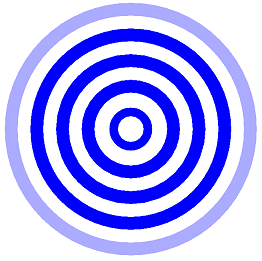
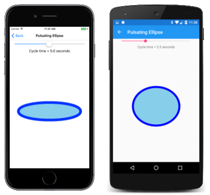

# Basic Animation in SkiaSharp

_Discover how to animate your SkiaSharp graphics_

You can animate SkiaSharp graphics in .NET MAUI by causing the `PaintSurface` method to be called periodically, each time drawing the graphics a little differently. Here's an animation shown later in this article with concentric circles that seemingly expand from the center:



The **Pulsating Ellipse** page in the sample program animates the two axes of an ellipse so that it appears to be pulsating, and you can even control the rate of this pulsation. The [**PulsatingEllipsePage.xaml**](https://github.com/mono/SkiaSharp/blob/docs/samples/Demos/Demos/SkiaSharpFormsDemos/Basics/PulsatingEllipsePage.xaml) file instantiates a .NET MAUI `Slider` and a `Label` to display the current value of the slider. This is a common way to integrate an `SKCanvasView` with other .NET MAUI views:

```xaml
<ContentPage xmlns="http://schemas.microsoft.com/dotnet/2021/maui"
             xmlns:x="http://schemas.microsoft.com/winfx/2009/xaml"
             xmlns:skia="clr-namespace:SkiaSharp.Views.Maui.Controls;assembly=SkiaSharp.Views.Maui.Controls"
             x:Class="SkiaSharpFormsDemos.PulsatingEllipsePage"
             Title="Pulsating Ellipse">
    <Grid>
        <Grid.RowDefinitions>
            <RowDefinition Height="Auto" />
            <RowDefinition Height="Auto" />
            <RowDefinition Height="*" />
        </Grid.RowDefinitions>

        <Slider x:Name="slider"
                Grid.Row="0"
                Maximum="10"
                Minimum="0.1"
                Value="5"
                Margin="20, 0" />

        <Label Grid.Row="1"
               Text="{Binding Source={x:Reference slider},
                              Path=Value,
                              StringFormat='Cycle time = {0:F1} seconds'}"
               HorizontalTextAlignment="Center" />

        <skia:SKCanvasView x:Name="canvasView"
                           Grid.Row="2"
                           PaintSurface="OnCanvasViewPaintSurface" />
    </Grid>
</ContentPage>
```

The code-behind file instantiates a `Stopwatch` object to serve as a high-precision clock. The `OnAppearing` override sets the `pageIsActive` field to `true` and calls a method named `AnimationLoop`. The `OnDisappearing` override sets that `pageIsActive` field to `false`:

```csharp
Stopwatch stopwatch = new Stopwatch();
bool pageIsActive;
float scale;            // ranges from 0 to 1 to 0

public PulsatingEllipsePage()
{
    InitializeComponent();
}

protected override void OnAppearing()
{
    base.OnAppearing();
    pageIsActive = true;
    AnimationLoop();
}

protected override void OnDisappearing()
{
    base.OnDisappearing();
    pageIsActive = false;
}
```

The `AnimationLoop` method starts the `Stopwatch` and then loops while `pageIsActive` is `true`. This is essentially an "infinite loop" while the page is active, but it doesn't cause the program to hang because the loop concludes with a call to `Task.Delay` with the `await` operator, which lets other parts of the program function. The argument to `Task.Delay` causes it to complete after 1/30th second. This defines the frame rate of the animation.

```csharp
async Task AnimationLoop()
{
    stopwatch.Start();

    while (pageIsActive)
    {
        double cycleTime = slider.Value;
        double t = stopwatch.Elapsed.TotalSeconds % cycleTime / cycleTime;
        scale = (1 + (float)Math.Sin(2 * Math.PI * t)) / 2;
        canvasView.InvalidateSurface();
        await Task.Delay(TimeSpan.FromSeconds(1.0 / 30));
    }

    stopwatch.Stop();
}

```

The `while` loop begins by obtaining a cycle time from the `Slider`. This is a time in seconds, for example, 5. The second statement calculates a value of `t` for *time*. For a `cycleTime` of 5, `t` increases from 0 to 1 every 5 seconds. The argument to the `Math.Sin` function in the second statement ranges from 0 to 2π every 5 seconds. The `Math.Sin` function returns a value ranging from 0 to 1 back to 0 and then to &ndash;1 and 0 every 5 seconds, but with values that change more slowly when the value is near 1 or –1. The value 1 is added so the values are always positive, and then it's divided by 2, so the values range from ½ to 1 to ½ to 0 to ½, but slower when the value is around 1 and 0. This is stored in the `scale` field, and the `SKCanvasView` is invalidated.

The `PaintSurface` method uses this `scale` value to calculate the two axes of the ellipse:

```csharp
void OnCanvasViewPaintSurface(object? sender, SKPaintSurfaceEventArgs args)
{
    SKImageInfo info = args.Info;
    SKSurface surface = args.Surface;
    SKCanvas canvas = surface.Canvas;

    canvas.Clear();

    float maxRadius = 0.75f * Math.Min(info.Width, info.Height) / 2;
    float minRadius = 0.25f * maxRadius;

    float xRadius = minRadius * scale + maxRadius * (1 - scale);
    float yRadius = maxRadius * scale + minRadius * (1 - scale);

    using (SKPaint paint = new SKPaint())
    {
        paint.Style = SKPaintStyle.Stroke;
        paint.Color = SKColors.Blue;
        paint.StrokeWidth = 50;
        canvas.DrawOval(info.Width / 2, info.Height / 2, xRadius, yRadius, paint);

        paint.Style = SKPaintStyle.Fill;
        paint.Color = SKColors.SkyBlue;
        canvas.DrawOval(info.Width / 2, info.Height / 2, xRadius, yRadius, paint);
    }
}
```

The method calculates a maximum radius based on the size of the display area, and a minimum radius based on the maximum radius. The `scale` value is animated between 0 and 1 and back to 0, so the method uses that to compute an `xRadius` and `yRadius` that ranges between `minRadius` and `maxRadius`. These values are used to draw and fill an ellipse:

[](animation-images/pulsatingellipse-large.png#lightbox "Triple screenshot of the Pulsating Ellipse page")

Notice that the `SKPaint` object is created in a `using` block. Like many SkiaSharp classes `SKPaint` derives from `SKObject`, which derives from `SKNativeObject`, which implements the [`IDisposable`](xref:System.IDisposable) interface. `SKPaint` overrides the `Dispose` method to release unmanaged resources.

 Putting `SKPaint` in a `using` block ensures that `Dispose` is called at the end of the block to free these unmanaged resources. This happens anyway when memory used by the `SKPaint` object is freed by the .NET garbage collector, but in animation code, it's best to be proactive in freeing memory in a more orderly way.

 A better solution in this particular case would be to create two `SKPaint` objects once and save them as fields.

That's what the **Expanding Circles** animation does. The [`ExpandingCirclesPage`](https://github.com/mono/SkiaSharp/blob/docs/samples/Demos/Demos/SkiaSharpFormsDemos/Basics/ExpandingCirclesPage.cs) class begins by defining several fields, including an `SKPaint` object:

```csharp
public class ExpandingCirclesPage : ContentPage
{
    const double cycleTime = 1000;       // in milliseconds

    SKCanvasView canvasView;
    Stopwatch stopwatch = new Stopwatch();
    bool pageIsActive;
    float t;
    SKPaint paint = new SKPaint
    {
        Style = SKPaintStyle.Stroke
    };

    public ExpandingCirclesPage()
    {
        Title = "Expanding Circles";

        canvasView = new SKCanvasView();
        canvasView.PaintSurface += OnCanvasViewPaintSurface;
        Content = canvasView;
    }
    ...
}
```

This program uses a different approach to animation based on the .NET MAUI `Device.StartTimer` method. The `t` field is animated from 0 to 1 every `cycleTime` milliseconds:

```csharp
public class ExpandingCirclesPage : ContentPage
{
    ...
    protected override void OnAppearing()
    {
        base.OnAppearing();
        pageIsActive = true;
        stopwatch.Start();

        Device.StartTimer(TimeSpan.FromMilliseconds(33), () =>
        {
            t = (float)(stopwatch.Elapsed.TotalMilliseconds % cycleTime / cycleTime);
            canvasView.InvalidateSurface();

            if (!pageIsActive)
            {
                stopwatch.Stop();
            }
            return pageIsActive;
        });
    }

    protected override void OnDisappearing()
    {
        base.OnDisappearing();
        pageIsActive = false;
    }
    ...
}
```

The `PaintSurface` handler draws five concentric circles with animated radii. If the `baseRadius` variable is calculated as 100, then as `t` is animated from 0 to 1, the radii of the five circles increase from 0 to 100, 100 to 200, 200 to 300, 300 to 400, and 400 to 500. For most of the circles the `strokeWidth` is 50 but for the first circle, the `strokeWidth` animates from 0 to 50. For most of the circles, the color is blue, but for the last circle, the color is animated from blue to transparent. Notice the fourth argument to the `SKColor` constructor that specifies the opacity:

```csharp
public class ExpandingCirclesPage : ContentPage
{
    ...
    void OnCanvasViewPaintSurface(object? sender, SKPaintSurfaceEventArgs args)
    {
        SKImageInfo info = args.Info;
        SKSurface surface = args.Surface;
        SKCanvas canvas = surface.Canvas;

        canvas.Clear();

        SKPoint center = new SKPoint(info.Width / 2, info.Height / 2);
        float baseRadius = Math.Min(info.Width, info.Height) / 12;

        for (int circle = 0; circle < 5; circle++)
        {
            float radius = baseRadius * (circle + t);

            paint.StrokeWidth = baseRadius / 2 * (circle == 0 ? t : 1);
            paint.Color = new SKColor(0, 0, 255,
                (byte)(255 * (circle == 4 ? (1 - t) : 1)));

            canvas.DrawCircle(center.X, center.Y, radius, paint);
        }
    }
}
```

The result is that the image looks the same when `t` equals 0 as when `t` equals 1, and the circles seem to continue expanding forever:

[](animation-images/expandingcircles-large.png#lightbox "Triple screenshot of the Expanding Circles page")

## Related Links

- [SkiaSharp APIs](/dotnet/api/skiasharp)
