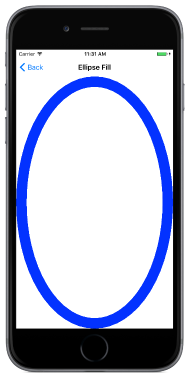
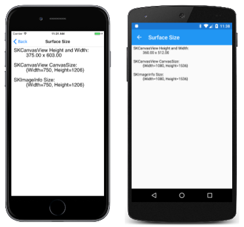

# Pixels and Device-Independent Units

_Explore the differences between SkiaSharp coordinates and .NET MAUI coordinates_

This article explores the differences in the coordinate system used in SkiaSharp and .NET MAUI. You can obtain information to convert between the two coordinate systems and also draw graphics that fill a particular area:



If you've been programming in .NET MAUI for a while, you might have a feel for .NET MAUI coordinates and sizes. The circles drawn in the two previous articles might seem a little small to you.

Those circles *are* small in comparison with .NET MAUI sizes. By default, SkiaSharp draws in units of pixels while .NET MAUI bases coordinates and sizes on a device-independent unit established by the underlying platform.

The page in the sample program entitled **Surface Size** uses SkiaSharp text output to show the size of the display surface from three different sources:

- The normal .NET MAUI [`Width`](xref:Microsoft.Maui.Controls.VisualElement.Width) and [`Height`](xref:Microsoft.Maui.Controls.VisualElement.Height) properties of the `SKCanvasView` object.
- The [`CanvasSize`](xref:SkiaSharp.Views.Maui.Controls.SKCanvasView.CanvasSize) property of the `SKCanvasView` object.
- The [`Size`](xref:SkiaSharp.SKImageInfo.Size) property of the `SKImageInfo` value, which is consistent with the `Width` and `Height` properties used in the two previous pages.

The [`SurfaceSizePage`](https://github.com/mono/SkiaSharp/blob/docs/samples/DocsSamplesApp/DocsSamplesApp/Basics/SurfaceSizePage.cs) class shows how to display these values. The constructor saves the `SKCanvasView` object as a field, so it can be accessed in the `PaintSurface` event handler:

```csharp
SKCanvasView canvasView;

public SurfaceSizePage()
{
    Title = "Surface Size";

    canvasView = new SKCanvasView();
    canvasView.PaintSurface += OnCanvasViewPaintSurface;
    Content = canvasView;
}
```

`SKCanvas` includes several `DrawText` methods. The main method for drawing text uses both `SKFont` for text metrics and `SKPaint` for styling:

```csharp
public void DrawText (String text, Single x, Single y, SKTextAlign textAlign, SKFont font, SKPaint paint)
```

You specify the text string, the X and Y coordinates where the text is to begin, the text alignment, an `SKFont` object for font attributes, and an `SKPaint` object for color and styling. The X coordinate specifies where the text is positioned based on the alignment, and the Y coordinate specifies the position of the *baseline* of the text. If you've ever written by hand on lined paper, the baseline is the line on which characters sit, and below which descenders (such as those on the letters g, p, q, and y) descend.

The `SKPaint` class allows you to specify the color of the text, while `SKFont` controls the font family and text size. By default, the [`Size`](xref:SkiaSharp.SKFont.Size) property has a value of 12, which results in tiny text on high-resolution devices such as phones. In anything but the simplest applications, you'll also need some information on the size of the text you're displaying. The `SKFont` class defines a [`Metrics`](xref:SkiaSharp.SKFont.Metrics) property and several [`MeasureText`](xref:SkiaSharp.SKFont.MeasureText(System.String,SkiaSharp.SKPaint)) methods, but for less fancy needs, the [`Spacing`](xref:SkiaSharp.SKFont.Spacing) property provides a recommended value for spacing successive lines of text.

The following `PaintSurface` handler creates an `SKFont` object with a `Size` of 40 pixels, which is the desired vertical height of the text from the top of ascenders to the bottom of descenders. The `Spacing` value that the `SKFont` object returns is a little larger than that, about 47 pixels.

```csharp
void OnCanvasViewPaintSurface(object? sender, SKPaintSurfaceEventArgs args)
{
    SKImageInfo info = args.Info;
    SKSurface surface = args.Surface;
    SKCanvas canvas = surface.Canvas;

    canvas.Clear();

    SKPaint paint = new SKPaint
    {
        Color = SKColors.Black
    };

    SKFont font = new SKFont
    {
        Size = 40
    };

    float fontSpacing = font.Spacing;
    float x = 20;               // left margin
    float y = fontSpacing;      // first baseline
    float indent = 100;

    canvas.DrawText("SKCanvasView Height and Width:", x, y, SKTextAlign.Left, font, paint);
    y += fontSpacing;
    canvas.DrawText(String.Format("{0:F2} x {1:F2}",
                                  canvasView.Width, canvasView.Height),
                    x + indent, y, SKTextAlign.Left, font, paint);
    y += fontSpacing * 2;
    canvas.DrawText("SKCanvasView CanvasSize:", x, y, SKTextAlign.Left, font, paint);
    y += fontSpacing;
    canvas.DrawText(canvasView.CanvasSize.ToString(), x + indent, y, SKTextAlign.Left, font, paint);
    y += fontSpacing * 2;
    canvas.DrawText("SKImageInfo Size:", x, y, SKTextAlign.Left, font, paint);
    y += fontSpacing;
    canvas.DrawText(info.Size.ToString(), x + indent, y, SKTextAlign.Left, font, paint);
}
```

The method begins the first line of text with an X coordinate of 20 (for a little margin at the left) and a Y coordinate of `fontSpacing`, which is a little more than what's necessary to display the full height of the first line of text at the top of the display surface. After each call to `DrawText`, the Y coordinate is increased by one or two increments of `fontSpacing`.

Here's the program running:

[](pixels-images/surfacesize-large.png#lightbox "Triple screenshot of the Surface Size  page")

As you can see, the `CanvasSize` property of the `SKCanvasView` and the `Size` property of the `SKImageInfo` value are consistent in reporting the pixel dimensions. The `Height` and `Width` properties of the `SKCanvasView` are .NET MAUI properties, and report the size of the view in the device-independent units defined by the platform.

The iOS seven simulator on the left has two pixels per device-independent unit, and the Android Nexus 5 in the center has three pixels per unit. That's why the simple circle shown earlier has different sizes on different platforms.

If you'd prefer to work entirely in device-independent units, you can do so by setting the `IgnorePixelScaling` property of the `SKCanvasView` to `true`. However, you might not like the results. SkiaSharp renders the graphics on a smaller device surface, with a pixel size equal to the size of the view in device-independent units. (For example, SkiaSharp would use a display surface of 360 x 512 pixels on the Nexus 5.) It then scales up that image in size, resulting in noticeable bitmap jaggies.

To maintain the same image resolution, a better solution is to write your own simple functions to convert between the two coordinate systems.

In addition to the `DrawCircle` method, `SKCanvas` also defines two `DrawOval` methods that draw an ellipse. An ellipse is defined by two radii rather than a single radius. These are known as the *major radius* and the *minor radius*. The `DrawOval` method draws an ellipse with the two radii parallel to the X and Y axes. (If you need to draw an ellipse with axes that are not parallel to the X and Y axes, you can use a rotation transform as discussed in the article [**The Rotate Transform**](../transforms/rotate.md) or a graphics path as discussed in the article [**Three Ways to Draw an Arc**](../curves/arcs.md)). This overload of the [`DrawOval`](xref:SkiaSharp.SKCanvas.DrawOval(System.Single,System.Single,System.Single,System.Single,SkiaSharp.SKPaint)) method names the two radii parameters `rx` and `ry` to indicate that they are parallel to the X and Y axes:

```csharp
public void DrawOval (Single cx, Single cy, Single rx, Single ry, SKPaint paint)
```

Is it possible to draw an ellipse that fills the display surface? The **Ellipse Fill** page demonstrates how. The `PaintSurface` event handler in the [**EllipseFillPage.xaml.cs**](https://github.com/mono/SkiaSharp/blob/docs/samples/DocsSamplesApp/DocsSamplesApp/Basics/EllipseFillPage.xaml.cs) class subtracts half the stroke width from the `xRadius` and `yRadius` values to fit the whole ellipse and its outline within the display surface:

```csharp
void OnCanvasViewPaintSurface(object? sender, SKPaintSurfaceEventArgs args)
{
    SKImageInfo info = args.Info;
    SKSurface surface = args.Surface;
    SKCanvas canvas = surface.Canvas;

    canvas.Clear();

    float strokeWidth = 50;
    float xRadius = (info.Width - strokeWidth) / 2;
    float yRadius = (info.Height - strokeWidth) / 2;

    SKPaint paint = new SKPaint
    {
        Style = SKPaintStyle.Stroke,
        Color = SKColors.Blue,
        StrokeWidth = strokeWidth
    };
    canvas.DrawOval(info.Width / 2, info.Height / 2, xRadius, yRadius, paint);
}
```

Here it is running:

[](pixels-images/ellipsefill-large.png#lightbox "Triple screenshot of the Surface Size  page")

The other [`DrawOval`](xref:SkiaSharp.SKCanvas.DrawOval(SkiaSharp.SKRect,SkiaSharp.SKPaint)) method has an [`SKRect`](xref:SkiaSharp.SKRect) argument, which is a rectangle defined in terms of the X and Y coordinates of its upper-left corner and lower-right corner. The oval fills that rectangle, which suggests that it might be possible to use it in the **Ellipse Fill** page like this:

```csharp
SKRect rect = new SKRect(0, 0, info.Width, info.Height);
canvas.DrawOval(rect, paint);
```

However, that truncates all the edges of the outline of the ellipse on the four sides. You need to adjust all the `SKRect` constructor arguments based on the `strokeWidth` to make this work right:

```csharp
SKRect rect = new SKRect(strokeWidth / 2,
                         strokeWidth / 2,
                         info.Width - strokeWidth / 2,
                         info.Height - strokeWidth / 2);
canvas.DrawOval(rect, paint);
```

## Related Links

- [SkiaSharp APIs](/dotnet/api/skiasharp)
