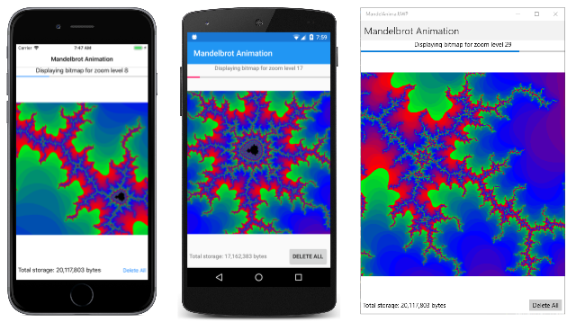
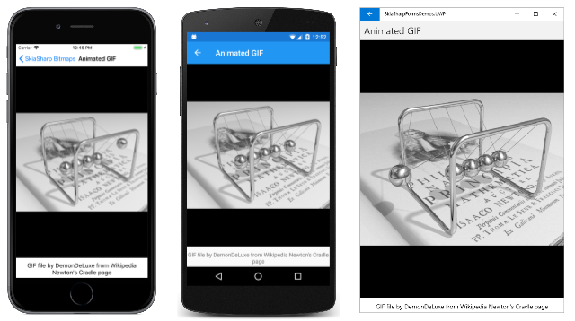

# Animating SkiaSharp bitmaps

Applications that animate SkiaSharp graphics generally call `InvalidateSurface` on the `SKCanvasView` at a fixed rate, often every 16 milliseconds. Invalidating the surface triggers a call to the `PaintSurface` handler to redraw the display. As the visuals are redrawn 60 times a second, they appear to be smoothly animated.

However, if the graphics are too complex to be rendered in 16 milliseconds, the animation can become jittery. The programmer might choose to reduce the refresh rate to 30 times or 15 times a second, but sometimes even that's not enough. Sometimes graphics are so complex that they simply can't be rendered in real time.

One solution is to prepare for the animation beforehand by rendering the individual frames of the animation on a series of bitmaps. To display the animation, it's only necessary to display these bitmaps sequentially 60 times a second.

Of course, that's potentially a lot of bitmaps, but that is how big-budget 3D animated movies are made. The 3D graphics are much too complex to be rendered in real time. A lot of processing time is required to render each frame. What you see when you watch the movie is essentially a series of bitmaps.

You can do something similar in SkiaSharp. This article demonstrates two types of bitmap animation. The first example is an animation of the Mandelbrot Set:


The second example shows how to use SkiaSharp to render an animated GIF file.

## Bitmap animation

The Mandelbrot Set is visually fascinating but computionally lengthy. (For a discussion of the Mandelbrot Set and the mathematics used here, see [Chapter 20 of _Creating Mobile Apps with Xamarin.Forms_](/xamarin/xamarin-forms/creating-mobile-apps-xamarin-forms/summaries/chapter20) starting on page 666. The following description assumes that background knowledge.)

The sample uses bitmap animation to simulate a continuous zoom of a fixed point in the Mandelbrot Set. Zooming in is followed by zooming out, and then the cycle repeats forever or until you end the program.

The program prepares for this animation by creating up to 50 bitmaps that it stores in application local storage. Each bitmap encompasses half the width and height of the complex plane as the previous bitmap. (In the program, these bitmaps are said to represent integral _zoom levels_.) The bitmaps are then displayed in sequence. The scaling of each bitmap is animated to provide a smooth progression from one bitmap to another.

Like the final program described in Chapter 20 of _Creating Mobile Apps with Xamarin.Forms_, the calculation of the Mandelbrot Set in **Mandelbrot Animation** is an asynchronous method with eight parameters. The parameters include a complex center point, and a width and height of the complex plane surrounding that center point. The next three parameters are the pixel width and height of the bitmap to be created, and a maximum number of iterations for the recursive calculation. The `progress` parameter is used to display the progress of this calculation. The `cancelToken` parameter is not used in this program:

```csharp
static class Mandelbrot
{
    public static Task<BitmapInfo> CalculateAsync(Complex center,
                                                  double width, double height,
                                                  int pixelWidth, int pixelHeight,
                                                  int iterations,
                                                  IProgress<double> progress,
                                                  CancellationToken cancelToken)
    {
        return Task.Run(() =>
        {
            int[] iterationCounts = new int[pixelWidth * pixelHeight];
            int index = 0;

            for (int row = 0; row < pixelHeight; row++)
            {
                progress.Report((double)row / pixelHeight);
                cancelToken.ThrowIfCancellationRequested();

                double y = center.Imaginary + height / 2 - row * height / pixelHeight;

                for (int col = 0; col < pixelWidth; col++)
                {
                    double x = center.Real - width / 2 + col * width / pixelWidth;
                    Complex c = new Complex(x, y);

                    if ((c - new Complex(-1, 0)).Magnitude < 1.0 / 4)
                    {
                        iterationCounts[index++] = -1;
                    }
                    // http://www.reenigne.org/blog/algorithm-for-mandelbrot-cardioid/
                    else if (c.Magnitude * c.Magnitude * (8 * c.Magnitude * c.Magnitude - 3) < 3.0 / 32 - c.Real)
                    {
                        iterationCounts[index++] = -1;
                    }
                    else
                    {
                        Complex z = 0;
                        int iteration = 0;

                        do
                        {
                            z = z * z + c;
                            iteration++;
                        }
                        while (iteration < iterations && z.Magnitude < 2);

                        if (iteration == iterations)
                        {
                            iterationCounts[index++] = -1;
                        }
                        else
                        {
                            iterationCounts[index++] = iteration;
                        }
                    }
                }
            }
            return new BitmapInfo(pixelWidth, pixelHeight, iterationCounts);
        }, cancelToken);
    }
}
```

The method returns an object of type `BitmapInfo` that provides information for creating a bitmap:

```csharp
class BitmapInfo
{
    public BitmapInfo(int pixelWidth, int pixelHeight, int[] iterationCounts)
    {
        PixelWidth = pixelWidth;
        PixelHeight = pixelHeight;
        IterationCounts = iterationCounts;
    }

    public int PixelWidth { private set; get; }

    public int PixelHeight { private set; get; }

    public int[] IterationCounts { private set; get; }
}
```

The **Mandelbrot Animation** XAML file includes two `Label` views, a `ProgressBar`, and a `Button` as well as the `SKCanvasView`:

```csharp
<ContentPage xmlns="http://xamarin.com/schemas/2014/forms"
             xmlns:x="http://schemas.microsoft.com/winfx/2009/xaml"
             xmlns:skia="clr-namespace:SkiaSharp.Views.Maui.Controls;assembly=SkiaSharp.Views.Maui.Controls"
             x:Class="MandelAnima.MainPage"
             Title="Mandelbrot Animation">

    <StackLayout>
        <Label x:Name="statusLabel"
               HorizontalTextAlignment="Center" />
        <ProgressBar x:Name="progressBar" />

        <skia:SKCanvasView x:Name="canvasView"
                           VerticalOptions="FillAndExpand"
                           PaintSurface="OnCanvasViewPaintSurface" />

        <StackLayout Orientation="Horizontal"
                     Padding="5">
            <Label x:Name="storageLabel"
                   VerticalOptions="Center" />

            <Button x:Name="deleteButton"
                    Text="Delete All"
                    HorizontalOptions="EndAndExpand"
                    Clicked="OnDeleteButtonClicked" />
        </StackLayout>
    </StackLayout>
</ContentPage>
```

The code-behind file begins by defining three crucial constants and an array of bitmaps:

```csharp
public partial class MainPage : ContentPage
{
    const int COUNT = 10;           // The number of bitmaps in the animation.
                                    // This can go up to 50!

    const int BITMAP_SIZE = 1000;   // Program uses square bitmaps exclusively

    // Uncomment just one of these, or define your own
    static readonly Complex center = new Complex(-1.17651152924355, 0.298520986549558);
    //   static readonly Complex center = new Complex(-0.774693089457127, 0.124226621261617);
    //   static readonly Complex center = new Complex(-0.556624880053304, 0.634696788141351);

    SKBitmap[] bitmaps = new SKBitmap[COUNT];   // array of bitmaps
    ···
}
```

At some point, you'll probably want to change the `COUNT` value to 50 to see the full range of the animation. Values above 50 are not useful. Around a zoom level of 48 or so, the resolution of double-precision floating-point numbers becomes insufficient for the Mandelbrot Set calculation. This problem is discussed on page 684 of _Creating Mobile Apps with Xamarin.Forms_.

The `center` value is very important. This is the focus of the animation zoom. The three values in the file are those used in the three final screenshots in Chapter 20 of _Creating Mobile Apps with Xamarin.Forms_ on page 684, but you can experiment with the program in that chapter to come up with one of your own values.

The **Mandelbrot Animation** sample stores these `COUNT` bitmaps in local application storage. Fifty bitmaps require over 20 megabytes of storage on your device, so you might want to know how much storage these bitmaps are occupying, and at some point you might want to delete them all. That's the purpose of these two methods at the bottom of the `MainPage` class:

```csharp
public partial class MainPage : ContentPage
{
    ···
    void TallyBitmapSizes()
    {
        long fileSize = 0;

        foreach (string filename in Directory.EnumerateFiles(FolderPath()))
        {
            fileSize += new FileInfo(filename).Length;
        }

        storageLabel.Text = $"Total storage: {fileSize:N0} bytes";
    }

    void OnDeleteButtonClicked(object sender, EventArgs args)
    {
        foreach (string filepath in Directory.EnumerateFiles(FolderPath()))
        {
            File.Delete(filepath);
        }

        TallyBitmapSizes();
    }
}
```

You can delete the bitmaps in local storage while the program is animating those same bitmaps because the program retains them in memory. But the next time you run the program, it will need to recreate the bitmaps.

The bitmaps stored in local application storage incorporate the `center` value in their filenames, so if you change the `center` setting, the existing bitmaps will not be replaced in storage, and will continue to occupy space.

Here are the methods that `MainPage` uses for constructing the filenames, as well as a `MakePixel` method for defining a pixel value based on color components:

```csharp
public partial class MainPage : ContentPage
{
    ···
    // File path for storing each bitmap in local storage
    string FolderPath() =>
        Environment.GetFolderPath(Environment.SpecialFolder.LocalApplicationData);

    string FilePath(int zoomLevel) =>
        Path.Combine(FolderPath(),
                     String.Format("R{0}I{1}Z{2:D2}.png", center.Real, center.Imaginary, zoomLevel));

    // Form bitmap pixel for Rgba8888 format
    uint MakePixel(byte alpha, byte red, byte green, byte blue) =>
        (uint)((alpha << 24) | (blue << 16) | (green << 8) | red);
    ···
}
```

The `zoomLevel` parameter to `FilePath` ranges from 0 to the `COUNT` constant minus 1.

The `MainPage` constructor calls the `LoadAndStartAnimation` method:

```csharp
public partial class MainPage : ContentPage
{
    ···
    public MainPage()
    {
        InitializeComponent();

        LoadAndStartAnimation();
    }
    ···
}
```

The `LoadAndStartAnimation` method is responsible for accessing application local storage to load any bitmaps that might have been created when the program was run previously. It loops through `zoomLevel` values from 0 to `COUNT`. If the file exists, it loads it into the `bitmaps` array. Otherwise, it needs to create a bitmap for the particular `center` and `zoomLevel` values by calling `Mandelbrot.CalculateAsync`. That method obtains the iteration counts for each pixel, which this method converts into colors:

```csharp
public partial class MainPage : ContentPage
{
    ···
    async void LoadAndStartAnimation()
    {
        // Show total bitmap storage
        TallyBitmapSizes();

        // Create progressReporter for async operation
        Progress<double> progressReporter =
            new Progress<double>((double progress) => progressBar.Progress = progress);

        // Create (unused) CancellationTokenSource for async operation
        CancellationTokenSource cancelTokenSource = new CancellationTokenSource();

        // Loop through all the zoom levels
        for (int zoomLevel = 0; zoomLevel < COUNT; zoomLevel++)
        {
            // If the file exists, load it
            if (File.Exists(FilePath(zoomLevel)))
            {
                statusLabel.Text = $"Loading bitmap for zoom level {zoomLevel}";

                using (Stream stream = File.OpenRead(FilePath(zoomLevel)))
                {
                    bitmaps[zoomLevel] = SKBitmap.Decode(stream);
                }
            }
            // Otherwise, create a new bitmap
            else
            {
                statusLabel.Text = $"Creating bitmap for zoom level {zoomLevel}";

                CancellationToken cancelToken = cancelTokenSource.Token;

                // Do the (generally lengthy) Mandelbrot calculation
                BitmapInfo bitmapInfo =
                    await Mandelbrot.CalculateAsync(center,
                                                    4 / Math.Pow(2, zoomLevel),
                                                    4 / Math.Pow(2, zoomLevel),
                                                    BITMAP_SIZE, BITMAP_SIZE,
                                                    (int)Math.Pow(2, 10), progressReporter, cancelToken);

                // Create bitmap & get pointer to the pixel bits
                SKBitmap bitmap = new SKBitmap(BITMAP_SIZE, BITMAP_SIZE, SKColorType.Rgba8888, SKAlphaType.Opaque);
                IntPtr basePtr = bitmap.GetPixels();

                // Set pixel bits to color based on iteration count
                for (int row = 0; row < bitmap.Width; row++)
                    for (int col = 0; col < bitmap.Height; col++)
                    {
                        int iterationCount = bitmapInfo.IterationCounts[row * bitmap.Width + col];
                        uint pixel = 0xFF000000;            // black

                        if (iterationCount != -1)
                        {
                            double proportion = (iterationCount / 32.0) % 1;
                            byte red = 0, green = 0, blue = 0;

                            if (proportion < 0.5)
                            {
                                red = (byte)(255 * (1 - 2 * proportion));
                                blue = (byte)(255 * 2 * proportion);
                            }
                            else
                            {
                                proportion = 2 * (proportion - 0.5);
                                green = (byte)(255 * proportion);
                                blue = (byte)(255 * (1 - proportion));
                            }

                            pixel = MakePixel(0xFF, red, green, blue);
                        }

                        // Calculate pointer to pixel
                        IntPtr pixelPtr = basePtr + 4 * (row * bitmap.Width + col);

                        unsafe     // requires compiling with unsafe flag
                        {
                            *(uint*)pixelPtr.ToPointer() = pixel;
                        }
                    }

                // Save as PNG file
                SKData data = SKImage.FromBitmap(bitmap).Encode();

                try
                {
                    File.WriteAllBytes(FilePath(zoomLevel), data.ToArray());
                }
                catch
                {
                    // Probably out of space, but just ignore
                }

                // Store in array
                bitmaps[zoomLevel] = bitmap;

                // Show new bitmap sizes
                TallyBitmapSizes();
            }

            // Display the bitmap
            bitmapIndex = zoomLevel;
            canvasView.InvalidateSurface();
        }

        // Now start the animation
        stopwatch.Start();
        Device.StartTimer(TimeSpan.FromMilliseconds(16), OnTimerTick);
    }
    ···
}
```

Notice that the program stores these bitmaps in local application storage rather than in the device's photo library. The .NET Standard 2.0 library allows using the familiar `File.OpenRead` and `File.WriteAllBytes` methods for this task.

After all the bitmaps have been created or loaded into memory, the method starts a `Stopwatch` object and calls `Device.StartTimer`. The `OnTimerTick` method is called every 16 milliseconds.

`OnTimerTick` calculates a `time` value in milliseconds that ranges from 0 to 6000 times `COUNT`, which apportions six seconds for the display of each bitmap. The `progress` value uses the `Math.Sin` value to create a sinusoidal animation that will be slower at the beginning of the cycle, and slower at the end as it reverses direction.

The `progress` value ranges from 0 to `COUNT`. This means that the integer part of `progress` is an index into the `bitmaps` array, while the fractional part of `progress` indicates a zoom level for that particular bitmap. These values are stored in the `bitmapIndex` and `bitmapProgress` fields, and are displayed by the `Label` and `Slider` in the XAML file. The `SKCanvasView` is invalidated to update the bitmap display:

```csharp
public partial class MainPage : ContentPage
{
    ···
    Stopwatch stopwatch = new Stopwatch();      // for the animation
    int bitmapIndex;
    double bitmapProgress = 0;
    ···
    bool OnTimerTick()
    {
        int cycle = 6000 * COUNT;       // total cycle length in milliseconds

        // Time in milliseconds from 0 to cycle
        int time = (int)(stopwatch.ElapsedMilliseconds % cycle);

        // Make it sinusoidal, including bitmap index and gradation between bitmaps
        double progress = COUNT * 0.5 * (1 + Math.Sin(2 * Math.PI * time / cycle - Math.PI / 2));

        // These are the field values that the PaintSurface handler uses
        bitmapIndex = (int)progress;
        bitmapProgress = progress - bitmapIndex;

        // It doesn't often happen that we get up to COUNT, but an exception would be raised
        if (bitmapIndex < COUNT)
        {
            // Show progress in UI
            statusLabel.Text = $"Displaying bitmap for zoom level {bitmapIndex}";
            progressBar.Progress = bitmapProgress;

            // Update the canvas
            canvasView.InvalidateSurface();
        }

        return true;
    }
    ···
}
```

Finally, the `PaintSurface` handler of the `SKCanvasView` calculates a destination rectangle to display the bitmap as large as possible while maintaining the aspect ratio. A source rectangle is based on the `bitmapProgress` value. The `fraction` value calculated here ranges from 0 when `bitmapProgress` is 0 to display the entire bitmap, to 0.25 when `bitmapProgress` is 1 to display half the width and height of the bitmap, effectively zooming in:

```csharp
public partial class MainPage : ContentPage
{
    ···
    void OnCanvasViewPaintSurface(object sender, SKPaintSurfaceEventArgs args)
    {
        SKImageInfo info = args.Info;
        SKSurface surface = args.Surface;
        SKCanvas canvas = surface.Canvas;

        canvas.Clear();

        if (bitmaps[bitmapIndex] != null)
        {
            // Determine destination rect as square in canvas
            int dimension = Math.Min(info.Width, info.Height);
            float x = (info.Width - dimension) / 2;
            float y = (info.Height - dimension) / 2;
            SKRect destRect = new SKRect(x, y, x + dimension, y + dimension);

            // Calculate source rectangle based on fraction:
            //  bitmapProgress == 0: full bitmap
            //  bitmapProgress == 1: half of length and width of bitmap
            float fraction = 0.5f * (1 - (float)Math.Pow(2, -bitmapProgress));
            SKBitmap bitmap = bitmaps[bitmapIndex];
            int width = bitmap.Width;
            int height = bitmap.Height;
            SKRect sourceRect = new SKRect(fraction * width, fraction * height,
                                           (1 - fraction) * width, (1 - fraction) * height);

            // Display the bitmap
            canvas.DrawBitmap(bitmap, sourceRect, destRect);
        }
    }
    ···
}
```

Here's the program running:

[](animating-images/MandelbrotAnimation-Large.png#lightbox)

## GIF animation

The Graphics Interchange Format (GIF) specification includes a feature that allows a single GIF file to contain multiple sequential frames of a scene that can be displayed in succession, often in a loop. These files are known as _animated GIFs_. Web browsers can play animated GIFs, and SkiaSharp allows an application to extract the frames from an animated GIF file and to display them sequentially.

The sample includes an animated GIF resource named **Newtons_cradle_animation_book_2.gif** created by DemonDeLuxe and downloaded from the [Newton's Cradle](https://en.wikipedia.org/wiki/Newton%27s_cradle) page in Wikipedia. The **Animated GIF** page includes a XAML file that provides that information and instantiates an `SKCanvasView`:

```xaml
<ContentPage xmlns="http://xamarin.com/schemas/2014/forms"
             xmlns:x="http://schemas.microsoft.com/winfx/2009/xaml"
             xmlns:skia="clr-namespace:SkiaSharp.Views.Maui.Controls;assembly=SkiaSharp.Views.Maui.Controls"
             x:Class="SkiaSharpFormsDemos.Bitmaps.AnimatedGifPage"
             Title="Animated GIF">

    <Grid>
        <Grid.RowDefinitions>
            <RowDefinition Height="*" />
            <RowDefinition Height="Auto" />
        </Grid.RowDefinitions>

        <skia:SKCanvasView x:Name="canvasView"
                           Grid.Row="0"
                           PaintSurface="OnCanvasViewPaintSurface" />

        <Label Text="GIF file by DemonDeLuxe from Wikipedia Newton's Cradle page"
               Grid.Row="1"
               Margin="0, 5"
               HorizontalTextAlignment="Center" />
    </Grid>
</ContentPage>
```

The code-behind file is not generalized to play any animated GIF file. It ignores some of the information that is available, in particular a repetition count, and simply plays the animated GIF in a loop.

The use of SkisSharp to extract the frames of an animated GIF file does not seem to be documented anywhere, so the description of the code that follows is more detailed than usual:

The decoding of the animated GIF file occurs in the page's constructor, and requires that the `Stream` object referencing the bitmap be used to create an `SKManagedStream` object and then an [`SKCodec`](xref:SkiaSharp.SKCodec) object. The [`FrameCount`](xref:SkiaSharp.SKCodec.FrameCount) property indicates the number of frames that make up the animation.

These frames are eventually saved as individual bitmaps, so the constructor uses `FrameCount` to allocate an array of type `SKBitmap` as well as two `int` arrays for the duration of each frame and (to ease the animation logic) the accumulated durations.

The [`FrameInfo`](xref:SkiaSharp.SKCodec.FrameInfo) property of `SKCodec` class is an array of [`SKCodecFrameInfo`](xref:SkiaSharp.SKCodecFrameInfo) values, one for each frame, but the only thing this program takes from that structure is the [`Duration`](xref:SkiaSharp.SKCodecFrameInfo.Duration) of the frame in milliseconds.

`SKCodec` defines a property named [`Info`](xref:SkiaSharp.SKCodec.Info) of type [`SKImageInfo`](xref:SkiaSharp.SKImageInfo), but that `SKImageInfo` value indicates (at least for this image) that the color type is `SKColorType.Index8`, which means that each pixel is an index into a color type. To avoid bothering with color tables, the program uses the [`Width`](xref:SkiaSharp.SKImageInfo.Width) and [`Height`](xref:SkiaSharp.SKImageInfo.Height) information from that structure to construct it's own full-color `ImageInfo` value. Each `SKBitmap` is created from that.

The `GetPixels` method of `SKBitmap` returns an `IntPtr` referencing the pixel bits of that bitmap. These pixel bits have not been set yet. That `IntPtr` is passed to one of the [`GetPixels`](xref:SkiaSharp.SKCodec.GetPixels(SkiaSharp.SKImageInfo,System.IntPtr,SkiaSharp.SKCodecOptions)) methods of `SKCodec`. That method copies the frame from the GIF file into the memory space referenced by the `IntPtr`. The [`SKCodecOptions`](xref:SkiaSharp.SKCodecOptions) constructor indicates the frame number:

```csharp
public partial class AnimatedGifPage : ContentPage
{
    SKBitmap[] bitmaps;
    int[] durations;
    int[] accumulatedDurations;
    int totalDuration;
    ···

    public AnimatedGifPage ()
    {
        InitializeComponent ();

        string resourceID = "SkiaSharpFormsDemos.Media.Newtons_cradle_animation_book_2.gif";
        Assembly assembly = GetType().GetTypeInfo().Assembly;

        using (Stream stream = assembly.GetManifestResourceStream(resourceID))
        using (SKManagedStream skStream = new SKManagedStream(stream))
        using (SKCodec codec = SKCodec.Create(skStream))
        {
            // Get frame count and allocate bitmaps
            int frameCount = codec.FrameCount;
            bitmaps = new SKBitmap[frameCount];
            durations = new int[frameCount];
            accumulatedDurations = new int[frameCount];

            // Note: There's also a RepetitionCount property of SKCodec not used here

            // Loop through the frames
            for (int frame = 0; frame < frameCount; frame++)
            {
                // From the FrameInfo collection, get the duration of each frame
                durations[frame] = codec.FrameInfo[frame].Duration;

                // Create a full-color bitmap for each frame
                SKImageInfo imageInfo = code.new SKImageInfo(codec.Info.Width, codec.Info.Height);
                bitmaps[frame] = new SKBitmap(imageInfo);

                // Get the address of the pixels in that bitmap
                IntPtr pointer = bitmaps[frame].GetPixels();

                // Create an SKCodecOptions value to specify the frame
                SKCodecOptions codecOptions = new SKCodecOptions(frame, false);

                // Copy pixels from the frame into the bitmap
                codec.GetPixels(imageInfo, pointer, codecOptions);
            }

            // Sum up the total duration
            for (int frame = 0; frame < durations.Length; frame++)
            {
                totalDuration += durations[frame];
            }

            // Calculate the accumulated durations
            for (int frame = 0; frame < durations.Length; frame++)
            {
                accumulatedDurations[frame] = durations[frame] +
                    (frame == 0 ? 0 : accumulatedDurations[frame - 1]);
            }
        }
    }
    ···
}
```

Despite the `IntPtr` value, no `unsafe` code is required because the `IntPtr` is never converted to a C# pointer value.

After each frame has been extracted, the constructor totals up the durations of all the frames, and then initializes another array with the accumulated durations.

The remainder of the code-behind file is dedicated to animation. The `Device.StartTimer` method is used to start a timer going, and the `OnTimerTick` callback uses a `Stopwatch` object to determine the elapsed time in milliseconds. Looping through the accumulated durations array is sufficient to find the current frame:

```csharp
public partial class AnimatedGifPage : ContentPage
{
    SKBitmap[] bitmaps;
    int[] durations;
    int[] accumulatedDurations;
    int totalDuration;

    Stopwatch stopwatch = new Stopwatch();
    bool isAnimating;

    int currentFrame;
    ···
    protected override void OnAppearing()
    {
        base.OnAppearing();

        isAnimating = true;
        stopwatch.Start();
        Device.StartTimer(TimeSpan.FromMilliseconds(16), OnTimerTick);
    }

    protected override void OnDisappearing()
    {
        base.OnDisappearing();

        stopwatch.Stop();
        isAnimating = false;
    }

    bool OnTimerTick()
    {
        int msec = (int)(stopwatch.ElapsedMilliseconds % totalDuration);
        int frame = 0;

        // Find the frame based on the elapsed time
        for (frame = 0; frame < accumulatedDurations.Length; frame++)
        {
            if (msec < accumulatedDurations[frame])
            {
                break;
            }
        }

        // Save in a field and invalidate the SKCanvasView.
        if (currentFrame != frame)
        {
            currentFrame = frame;
            canvasView.InvalidateSurface();
        }

        return isAnimating;
    }

    void OnCanvasViewPaintSurface(object sender, SKPaintSurfaceEventArgs args)
    {
        SKImageInfo info = args.Info;
        SKSurface surface = args.Surface;
        SKCanvas canvas = surface.Canvas;

        canvas.Clear(SKColors.Black);

        // Get the bitmap and center it
        SKBitmap bitmap = bitmaps[currentFrame];
        canvas.DrawBitmap(bitmap,info.Rect, BitmapStretch.Uniform);
    }
}
```

Each time the `currentframe` variable changes, the `SKCanvasView` is invalidated and the new frame is displayed:

[](animating-images/AnimatedGif-Large.png#lightbox)

Of course, you'll want to run the program yourself to see the animation.

## Related links

- [SkiaSharp APIs](/dotnet/api/skiasharp)
