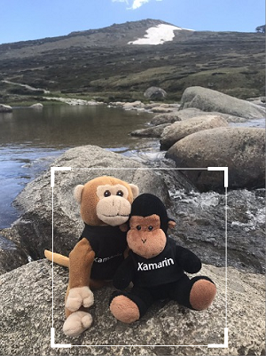
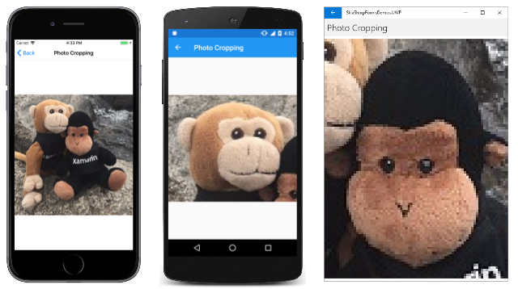

# Cropping SkiaSharp bitmaps

The [**Creating and Drawing SkiaSharp Bitmaps**](drawing.md) article described how an `SKBitmap` object can be passed to an `SKCanvas` constructor. Any drawing method called on that canvas causes graphics to be rendered on the bitmap. These drawing methods include `DrawBitmap`, which means that this technique allows transferring part or all of one bitmap to another bitmap, perhaps with transforms applied.

You can use that technique for cropping a bitmap by calling the [`DrawBitmap`](xref:SkiaSharp.SKCanvas.DrawBitmap(SkiaSharp.SKBitmap,SkiaSharp.SKRect,SkiaSharp.SKRect,SkiaSharp.SKPaint)) method with source and destination rectangles:

```csharp
canvas.DrawBitmap(bitmap, sourceRect, destRect);
```

However, applications that implement cropping often provide an interface for the user to interactively select the cropping rectangle:



This article focuses on that interface.

## Encapsulating the cropping rectangle

It's helpful to isolate some of the cropping logic in a class named `CroppingRectangle`. The constructor parameters include a maximum rectangle, which is generally the size of the bitmap being cropped, and an optional aspect ratio. The constructor first defines an initial cropping rectangle, which it makes public in the `Rect` property of type `SKRect`. This initial cropping rectangle is 80% of the width and height of the bitmap rectangle, but it is then adjusted if an aspect ratio is specified:

```csharp
class CroppingRectangle
{
    ···
    SKRect maxRect;             // generally the size of the bitmap
    float? aspectRatio;

    public CroppingRectangle(SKRect maxRect, float? aspectRatio = null)
    {
        this.maxRect = maxRect;
        this.aspectRatio = aspectRatio;

        // Set initial cropping rectangle
        Rect = new SKRect(0.9f * maxRect.Left + 0.1f * maxRect.Right,
                          0.9f * maxRect.Top + 0.1f * maxRect.Bottom,
                          0.1f * maxRect.Left + 0.9f * maxRect.Right,
                          0.1f * maxRect.Top + 0.9f * maxRect.Bottom);

        // Adjust for aspect ratio
        if (aspectRatio.HasValue)
        {
            SKRect rect = Rect;
            float aspect = aspectRatio.Value;

            if (rect.Width > aspect * rect.Height)
            {
                float width = aspect * rect.Height;
                rect.Left = (maxRect.Width - width) / 2;
                rect.Right = rect.Left + width;
            }
            else
            {
                float height = rect.Width / aspect;
                rect.Top = (maxRect.Height - height) / 2;
                rect.Bottom = rect.Top + height;
            }

            Rect = rect;
        }
    }

    public SKRect Rect { set; get; }
    ···
}
```

One useful piece of information that `CroppingRectangle` also makes available is an array of `SKPoint` values corresponding to the four corners of the cropping rectangle in the order upper-left, upper-right, lower-right, and lower-left:

```csharp
class CroppingRectangle
{
    ···
    public SKPoint[] Corners
    {
        get
        {
            return new SKPoint[]
            {
                new SKPoint(Rect.Left, Rect.Top),
                new SKPoint(Rect.Right, Rect.Top),
                new SKPoint(Rect.Right, Rect.Bottom),
                new SKPoint(Rect.Left, Rect.Bottom)
            };
        }
    }
    ···
}
```

This array is used in the following method, which is called `HitTest`. The `SKPoint` parameter is a point corresponding to a finger touch or a mouse click. The method returns an index (0, 1, 2, or 3) corresponding to the corner that the finger or mouse pointer touched, within a distance given by the `radius` parameter:

```csharp
class CroppingRectangle
{
    ···
    public int HitTest(SKPoint point, float radius)
    {
        SKPoint[] corners = Corners;

        for (int index = 0; index < corners.Length; index++)
        {
            SKPoint diff = point - corners[index];

            if ((float)Math.Sqrt(diff.X * diff.X + diff.Y * diff.Y) < radius)
            {
                return index;
            }
        }

        return -1;
    }
    ···
}
```

If the touch or mouse point was not within `radius` units of any corner, the method returns &ndash;1.

The final method in `CroppingRectangle` is called `MoveCorner`, which is called in response to touch or mouse movement. The two parameters indicate the index of the corner being moved, and the new location of that corner. The first half of the method adjusts the cropping rectangle based on the new location of the corner, but always within the bounds of `maxRect`, which is the size of the bitmap. This logic also takes account of the `MINIMUM` field to avoid collapsing the cropping rectangle into nothing:

```csharp
class CroppingRectangle
{
    const float MINIMUM = 10;   // pixels width or height
    ···
    public void MoveCorner(int index, SKPoint point)
    {
        SKRect rect = Rect;

        switch (index)
        {
            case 0: // upper-left
                rect.Left = Math.Min(Math.Max(point.X, maxRect.Left), rect.Right - MINIMUM);
                rect.Top = Math.Min(Math.Max(point.Y, maxRect.Top), rect.Bottom - MINIMUM);
                break;

            case 1: // upper-right
                rect.Right = Math.Max(Math.Min(point.X, maxRect.Right), rect.Left + MINIMUM);
                rect.Top = Math.Min(Math.Max(point.Y, maxRect.Top), rect.Bottom - MINIMUM);
                break;

            case 2: // lower-right
                rect.Right = Math.Max(Math.Min(point.X, maxRect.Right), rect.Left + MINIMUM);
                rect.Bottom = Math.Max(Math.Min(point.Y, maxRect.Bottom), rect.Top + MINIMUM);
                break;

            case 3: // lower-left
                rect.Left = Math.Min(Math.Max(point.X, maxRect.Left), rect.Right - MINIMUM);
                rect.Bottom = Math.Max(Math.Min(point.Y, maxRect.Bottom), rect.Top + MINIMUM);
                break;
        }

        // Adjust for aspect ratio
        if (aspectRatio.HasValue)
        {
            float aspect = aspectRatio.Value;

            if (rect.Width > aspect * rect.Height)
            {
                float width = aspect * rect.Height;

                switch (index)
                {
                    case 0:
                    case 3: rect.Left = rect.Right - width; break;
                    case 1:
                    case 2: rect.Right = rect.Left + width; break;
                }
            }
            else
            {
                float height = rect.Width / aspect;

                switch (index)
                {
                    case 0:
                    case 1: rect.Top = rect.Bottom - height; break;
                    case 2:
                    case 3: rect.Bottom = rect.Top + height; break;
                }
            }
        }

        Rect = rect;
    }
}
```

The second half of the method adjusts for the optional aspect ratio.

Keep in mind that everything in this class is in units of pixels.

## A canvas view just for cropping

The `CroppingRectangle` class you've just seen is used by the `PhotoCropperCanvasView` class, which derives from `SKCanvasView`. This class is responsible for displaying the bitmap and the cropping rectangle, as well as handling touch or mouse events for changing the cropping rectangle.

The `PhotoCropperCanvasView` constructor requires a bitmap. An aspect ratio is optional. The constructor instantiates an object of type `CroppingRectangle` based on this bitmap and aspect ratio and saves it as a field:

```csharp
class PhotoCropperCanvasView : SKCanvasView
{
    ···
    SKBitmap bitmap;
    CroppingRectangle croppingRect;
    ···
    public PhotoCropperCanvasView(SKBitmap bitmap, float? aspectRatio = null)
    {
        this.bitmap = bitmap;

        SKRect bitmapRect = new SKRect(0, 0, bitmap.Width, bitmap.Height);
        croppingRect = new CroppingRectangle(bitmapRect, aspectRatio);
        ···
    }
    ···
}
```

Because this class derives from `SKCanvasView`, it doesn't need to install a handler for the `PaintSurface` event. It can instead override its `OnPaintSurface` method. The method displays the bitmap and uses a couple of `SKPaint` objects saved as fields to draw the current cropping rectangle:

```csharp
class PhotoCropperCanvasView : SKCanvasView
{
    const int CORNER = 50;      // pixel length of cropper corner
    ···
    SKBitmap bitmap;
    CroppingRectangle croppingRect;
    SKMatrix inverseBitmapMatrix;
    ···
    // Drawing objects
    SKPaint cornerStroke = new SKPaint
    {
        Style = SKPaintStyle.Stroke,
        Color = SKColors.White,
        StrokeWidth = 10
    };

    SKPaint edgeStroke = new SKPaint
    {
        Style = SKPaintStyle.Stroke,
        Color = SKColors.White,
        StrokeWidth = 2
    };
    ···
    protected override void OnPaintSurface(SKPaintSurfaceEventArgs args)
    {
        base.OnPaintSurface(args);

        SKImageInfo info = args.Info;
        SKSurface surface = args.Surface;
        SKCanvas canvas = surface.Canvas;

        canvas.Clear(SKColors.Gray);

        // Calculate rectangle for displaying bitmap
        float scale = Math.Min((float)info.Width / bitmap.Width, (float)info.Height / bitmap.Height);
        float x = (info.Width - scale * bitmap.Width) / 2;
        float y = (info.Height - scale * bitmap.Height) / 2;
        SKRect bitmapRect = new SKRect(x, y, x + scale * bitmap.Width, y + scale * bitmap.Height);
        canvas.DrawBitmap(bitmap, bitmapRect);

        // Calculate a matrix transform for displaying the cropping rectangle
        SKMatrix bitmapScaleMatrix = SKMatrix.MakeIdentity();
        bitmapScaleMatrix.SetScaleTranslate(scale, scale, x, y);

        // Display rectangle
        SKRect scaledCropRect = bitmapScaleMatrix.MapRect(croppingRect.Rect);
        canvas.DrawRect(scaledCropRect, edgeStroke);

        // Display heavier corners
        using (SKPath path = new SKPath())
        {
            path.MoveTo(scaledCropRect.Left, scaledCropRect.Top + CORNER);
            path.LineTo(scaledCropRect.Left, scaledCropRect.Top);
            path.LineTo(scaledCropRect.Left + CORNER, scaledCropRect.Top);

            path.MoveTo(scaledCropRect.Right - CORNER, scaledCropRect.Top);
            path.LineTo(scaledCropRect.Right, scaledCropRect.Top);
            path.LineTo(scaledCropRect.Right, scaledCropRect.Top + CORNER);

            path.MoveTo(scaledCropRect.Right, scaledCropRect.Bottom - CORNER);
            path.LineTo(scaledCropRect.Right, scaledCropRect.Bottom);
            path.LineTo(scaledCropRect.Right - CORNER, scaledCropRect.Bottom);

            path.MoveTo(scaledCropRect.Left + CORNER, scaledCropRect.Bottom);
            path.LineTo(scaledCropRect.Left, scaledCropRect.Bottom);
            path.LineTo(scaledCropRect.Left, scaledCropRect.Bottom - CORNER);

            canvas.DrawPath(path, cornerStroke);
        }

        // Invert the transform for touch tracking
        bitmapScaleMatrix.TryInvert(out inverseBitmapMatrix);
    }
    ···
}
```

The code in the `CroppingRectangle` class bases the cropping rectangle on the pixel size of the bitmap. However, the display of the bitmap by the `PhotoCropperCanvasView` class is scaled based on the size of the display area. The `bitmapScaleMatrix` calculated in the `OnPaintSurface` override maps from the bitmap pixels to the size and position of the bitmap as it is displayed. This matrix is then used to transform the cropping rectangle so that it can be displayed relative to the bitmap.

The last line of the `OnPaintSurface` override takes the inverse of the `bitmapScaleMatrix` and saves it as the `inverseBitmapMatrix` field. This is used for touch processing.

A `TouchEffect` object is instantiated as a field, and the constructor attaches a handler to the `TouchAction` event, but the `TouchEffect` needs to be added to the `Effects` collection of the _parent_ of the `SKCanvasView` derivative, so that's done in the `OnParentSet` override:

```csharp
class PhotoCropperCanvasView : SKCanvasView
{
    ···
    const int RADIUS = 100;     // pixel radius of touch hit-test
    ···
    CroppingRectangle croppingRect;
    SKMatrix inverseBitmapMatrix;

    // Touch tracking
    TouchEffect touchEffect = new TouchEffect();
    struct TouchPoint
    {
        public int CornerIndex { set; get; }
        public SKPoint Offset { set; get; }
    }

    Dictionary<long, TouchPoint> touchPoints = new Dictionary<long, TouchPoint>();
    ···
    public PhotoCropperCanvasView(SKBitmap bitmap, float? aspectRatio = null)
    {
        ···
        touchEffect.TouchAction += OnTouchEffectTouchAction;
    }
    ···
    protected override void OnParentSet()
    {
        base.OnParentSet();

        // Attach TouchEffect to parent view
        Parent.Effects.Add(touchEffect);
    }
    ···
    void OnTouchEffectTouchAction(object sender, TouchActionEventArgs args)
    {
        SKPoint pixelLocation = ConvertToPixel(args.Location);
        SKPoint bitmapLocation = inverseBitmapMatrix.MapPoint(pixelLocation);

        switch (args.Type)
        {
            case TouchActionType.Pressed:
                // Convert radius to bitmap/cropping scale
                float radius = inverseBitmapMatrix.ScaleX * RADIUS;

                // Find corner that the finger is touching
                int cornerIndex = croppingRect.HitTest(bitmapLocation, radius);

                if (cornerIndex != -1 && !touchPoints.ContainsKey(args.Id))
                {
                    TouchPoint touchPoint = new TouchPoint
                    {
                        CornerIndex = cornerIndex,
                        Offset = bitmapLocation - croppingRect.Corners[cornerIndex]
                    };

                    touchPoints.Add(args.Id, touchPoint);
                }
                break;

            case TouchActionType.Moved:
                if (touchPoints.ContainsKey(args.Id))
                {
                    TouchPoint touchPoint = touchPoints[args.Id];
                    croppingRect.MoveCorner(touchPoint.CornerIndex,
                                            bitmapLocation - touchPoint.Offset);
                    InvalidateSurface();
                }
                break;

            case TouchActionType.Released:
            case TouchActionType.Cancelled:
                if (touchPoints.ContainsKey(args.Id))
                {
                    touchPoints.Remove(args.Id);
                }
                break;
        }
    }

    SKPoint ConvertToPixel(Microsoft.Maui.Graphics.Point pt)
    {
        return new SKPoint((float)(CanvasSize.Width * pt.X / Width),
                           (float)(CanvasSize.Height * pt.Y / Height));
    }
}
```

The touch events processed by the `TouchAction` handler are in device-independent units. These first need to be converted to pixels using the `ConvertToPixel` method at the bottom of the class, and then converted to `CroppingRectangle` units using `inverseBitmapMatrix`.

For `Pressed` events, the `TouchAction` handler calls the `HitTest` method of `CroppingRectangle`. If this returns an index other than &ndash;1, then one of the corners of the cropping rectangle is being manipulated. That index and an offset of the actual touch point from the corner is stored in a `TouchPoint` object and added to the `touchPoints` dictionary.

For the `Moved` event, the `MoveCorner` method of `CroppingRectangle` is called to move the corner, with possible adjustments for the aspect ratio.

At any time, a program using `PhotoCropperCanvasView` can access the `CroppedBitmap` property. This property uses the `Rect` property of the `CroppingRectangle` to create a new bitmap of the cropped size. The version of `DrawBitmap` with destination and source rectangles then extracts a subset of the original bitmap:

```csharp
class PhotoCropperCanvasView : SKCanvasView
{
    ···
    SKBitmap bitmap;
    CroppingRectangle croppingRect;
    ···
    public SKBitmap CroppedBitmap
    {
        get
        {
            SKRect cropRect = croppingRect.Rect;
            SKBitmap croppedBitmap = new SKBitmap((int)cropRect.Width,
                                                  (int)cropRect.Height);
            SKRect dest = new SKRect(0, 0, cropRect.Width, cropRect.Height);
            SKRect source = new SKRect(cropRect.Left, cropRect.Top,
                                       cropRect.Right, cropRect.Bottom);

            using (SKCanvas canvas = new SKCanvas(croppedBitmap))
            {
                canvas.DrawBitmap(bitmap, source, dest);
            }

            return croppedBitmap;
        }
    }
    ···
}
```

## Hosting the photo cropper canvas view

With those two classes handling the cropping logic, the **Photo Cropping** page in the sample application has very little work to do. The XAML file instantiates a `Grid` to host the `PhotoCropperCanvasView` and a **Done** button:

```xaml
<ContentPage xmlns="http://xamarin.com/schemas/2014/forms"
             xmlns:x="http://schemas.microsoft.com/winfx/2009/xaml"
             x:Class="SkiaSharpFormsDemos.Bitmaps.PhotoCroppingPage"
             Title="Photo Cropping">
    <Grid>
        <Grid.RowDefinitions>
            <RowDefinition Height="*" />
            <RowDefinition Height="Auto" />
        </Grid.RowDefinitions>

        <Grid x:Name="canvasViewHost"
              Grid.Row="0"
              BackgroundColor="Gray"
              Padding="5" />

        <Button Text="Done"
                Grid.Row="1"
                HorizontalOptions="Center"
                Margin="5"
                Clicked="OnDoneButtonClicked" />
    </Grid>
</ContentPage>
```

The `PhotoCropperCanvasView` cannot be instantiated in the XAML file because it requires a parameter of type `SKBitmap`.

Instead, the `PhotoCropperCanvasView` is instantiated in the constructor of the code-behind file using one of the resource bitmaps:

```csharp
public partial class PhotoCroppingPage : ContentPage
{
    PhotoCropperCanvasView photoCropper;
    SKBitmap croppedBitmap;

    public PhotoCroppingPage ()
    {
        InitializeComponent ();

        SKBitmap bitmap = BitmapExtensions.LoadBitmapResource(GetType(),
            "SkiaSharpFormsDemos.Media.MountainClimbers.jpg");

        photoCropper = new PhotoCropperCanvasView(bitmap);
        canvasViewHost.Children.Add(photoCropper);
    }

    void OnDoneButtonClicked(object sender, EventArgs args)
    {
        croppedBitmap = photoCropper.CroppedBitmap;

        SKCanvasView canvasView = new SKCanvasView();
        canvasView.PaintSurface += OnCanvasViewPaintSurface;
        Content = canvasView;
    }

    void OnCanvasViewPaintSurface(object sender, SKPaintSurfaceEventArgs args)
    {
        SKImageInfo info = args.Info;
        SKSurface surface = args.Surface;
        SKCanvas canvas = surface.Canvas;

        canvas.Clear();
        canvas.DrawBitmap(croppedBitmap, info.Rect, BitmapStretch.Uniform);
    }
}
```

The user can then manipulate the cropping rectangle:

[](cropping-images/PhotoCropping1-Large.png#lightbox)

When a good cropping rectangle has been defined, click the **Done** button. The `Clicked` handler obtains the cropped bitmap from the `CroppedBitmap` property of `PhotoCropperCanvasView`, and replaces all the content of the page with a new `SKCanvasView` object that displays this cropped bitmap:

[](cropping-images/PhotoCropping2-Large.png#lightbox)

Try setting the second argument of `PhotoCropperCanvasView` to 1.78f (for example):

```csharp
photoCropper = new PhotoCropperCanvasView(bitmap, 1.78f);
```

You'll see the cropping rectangle restricted to a 16-to-9 aspect ratio characteristic of high-definition television.

## Dividing a bitmap into tiles

A Xamarin.Forms version of the famous 14-15 puzzle appeared in Chapter 22 of the book [_Creating Mobile Apps with Xamarin.Forms_](~/xamarin-forms/creating-mobile-apps-xamarin-forms/index.md) and can be downloaded as [**XamagonXuzzle**](https://github.com/xamarin/xamarin-forms-book-samples/tree/master/Chapter22/XamagonXuzzle). However, the puzzle becomes more fun (and often more challenging) when it is based on an image from your own photo library.

This version of the 14-15 puzzle is part of the sample application, and consists of a series of pages titled **Photo Puzzle**.

The **PhotoPuzzlePage1.xaml** file consists of a `Button`:

```xaml
<ContentPage xmlns="http://xamarin.com/schemas/2014/forms"
             xmlns:x="http://schemas.microsoft.com/winfx/2009/xaml"
             x:Class="SkiaSharpFormsDemos.Bitmaps.PhotoPuzzlePage1"
             Title="Photo Puzzle">

    <Button Text="Pick a photo from your library"
            VerticalOptions="CenterAndExpand"
            HorizontalOptions="CenterAndExpand"
            Clicked="OnPickButtonClicked"/>

</ContentPage>
```

The code-behind file implements a `Clicked` handler that uses the `IPhotoLibrary` dependency service to let the user pick a photo from the photo library:

```csharp
public partial class PhotoPuzzlePage1 : ContentPage
{
    public PhotoPuzzlePage1 ()
    {
        InitializeComponent ();
    }

    async void OnPickButtonClicked(object sender, EventArgs args)
    {
        IPhotoLibrary photoLibrary = DependencyService.Get<IPhotoLibrary>();
        using (Stream stream = await photoLibrary.PickPhotoAsync())
        {
            if (stream != null)
            {
                SKBitmap bitmap = SKBitmap.Decode(stream);

                await Navigation.PushAsync(new PhotoPuzzlePage2(bitmap));
            }
        }
    }
}
```

The method then navigates to `PhotoPuzzlePage2`, passing to the constuctor the selected bitmap.

It's possible that the photo selected from the library is not oriented as it appeared in the photo library, but is rotated or upside-down. (This is particularly a problem with iOS devices.) For that reason, `PhotoPuzzlePage2` allows you to rotate the image to a desired orientation. The XAML file contains three buttons labeled **90&#x00B0; Right** (meaning clockwise), **90&#x00B0; Left** (counterclockwise), and **Done**.

The code-behind file implements the bitmap-rotation logic shown in the article **[Creating and Drawing on SkiaSharp Bitmaps](drawing.md#rotating-bitmaps)**. The user can rotate the image 90 degrees clockwise or counter-clockwise any number of times:

```csharp
public partial class PhotoPuzzlePage2 : ContentPage
{
    SKBitmap bitmap;

    public PhotoPuzzlePage2 (SKBitmap bitmap)
    {
        this.bitmap = bitmap;

        InitializeComponent ();
    }

    void OnCanvasViewPaintSurface(object sender, SKPaintSurfaceEventArgs args)
    {
        SKImageInfo info = args.Info;
        SKSurface surface = args.Surface;
        SKCanvas canvas = surface.Canvas;

        canvas.Clear();
        canvas.DrawBitmap(bitmap, info.Rect, BitmapStretch.Uniform);
    }

    void OnRotateRightButtonClicked(object sender, EventArgs args)
    {
        SKBitmap rotatedBitmap = new SKBitmap(bitmap.Height, bitmap.Width);

        using (SKCanvas canvas = new SKCanvas(rotatedBitmap))
        {
            canvas.Clear();
            canvas.Translate(bitmap.Height, 0);
            canvas.RotateDegrees(90);
            canvas.DrawBitmap(bitmap, new SKPoint());
        }

        bitmap = rotatedBitmap;
        canvasView.InvalidateSurface();
    }

    void OnRotateLeftButtonClicked(object sender, EventArgs args)
    {
        SKBitmap rotatedBitmap = new SKBitmap(bitmap.Height, bitmap.Width);

        using (SKCanvas canvas = new SKCanvas(rotatedBitmap))
        {
            canvas.Clear();
            canvas.Translate(0, bitmap.Width);
            canvas.RotateDegrees(-90);
            canvas.DrawBitmap(bitmap, new SKPoint());
        }

        bitmap = rotatedBitmap;
        canvasView.InvalidateSurface();
    }

    async void OnDoneButtonClicked(object sender, EventArgs args)
    {
        await Navigation.PushAsync(new PhotoPuzzlePage3(bitmap));
    }
}
```

When the user clicks the **Done** button, the `Clicked` handler navigates to `PhotoPuzzlePage3`, passing the final rotated bitmap in the page's constructor.

`PhotoPuzzlePage3` allows the photo to be cropped. The program requires a square bitmap to divide into a 4-by-4 grid of tiles.

The **PhotoPuzzlePage3.xaml** file contains a `Label`, a `Grid` to host the `PhotoCropperCanvasView`, and another **Done** button:

```xaml
<ContentPage xmlns="http://xamarin.com/schemas/2014/forms"
             xmlns:x="http://schemas.microsoft.com/winfx/2009/xaml"
             x:Class="SkiaSharpFormsDemos.Bitmaps.PhotoPuzzlePage3"
             Title="Photo Puzzle">
    <Grid>
        <Grid.RowDefinitions>
            <RowDefinition Height="Auto" />
            <RowDefinition Height="*" />
            <RowDefinition Height="Auto" />
        </Grid.RowDefinitions>

        <Label Text="Crop the photo to a square"
               Grid.Row="0"
               FontSize="Large"
               HorizontalTextAlignment="Center"
               Margin="5" />

        <Grid x:Name="canvasViewHost"
              Grid.Row="1"
              BackgroundColor="Gray"
              Padding="5" />

        <Button Text="Done"
                Grid.Row="2"
                HorizontalOptions="Center"
                Margin="5"
                Clicked="OnDoneButtonClicked" />
    </Grid>
</ContentPage>
```

The code-behind file instantiates the `PhotoCropperCanvasView` with the bitmap passed to its constructor. Notice that a 1 is passed as the second argument to `PhotoCropperCanvasView`. This aspect ratio of 1 forces the cropping rectangle to be a square:

```csharp
public partial class PhotoPuzzlePage3 : ContentPage
{
    PhotoCropperCanvasView photoCropper;

    public PhotoPuzzlePage3(SKBitmap bitmap)
    {
        InitializeComponent ();

        photoCropper = new PhotoCropperCanvasView(bitmap, 1f);
        canvasViewHost.Children.Add(photoCropper);
    }

    async void OnDoneButtonClicked(object sender, EventArgs args)
    {
        SKBitmap croppedBitmap = photoCropper.CroppedBitmap;
        int width = croppedBitmap.Width / 4;
        int height = croppedBitmap.Height / 4;

        ImageSource[] imgSources = new ImageSource[15];

        for (int row = 0; row < 4; row++)
        {
            for (int col = 0; col < 4; col++)
            {
                // Skip the last one!
                if (row == 3 && col == 3)
                    break;

                // Create a bitmap 1/4 the width and height of the original
                SKBitmap bitmap = new SKBitmap(width, height);
                SKRect dest = new SKRect(0, 0, width, height);
                SKRect source = new SKRect(col * width, row * height, (col + 1) * width, (row + 1) * height);

                // Copy 1/16 of the original into that bitmap
                using (SKCanvas canvas = new SKCanvas(bitmap))
                {
                    canvas.DrawBitmap(croppedBitmap, source, dest);
                }

                imgSources[4 * row + col] = (SKBitmapImageSource)bitmap;
            }
        }

        await Navigation.PushAsync(new PhotoPuzzlePage4(imgSources));
    }
}
```

The **Done** button handler obtains the width and height of the cropped bitmap (these two values should be the same) and then divides it into 15 separate bitmaps, each of which is 1/4 the width and height of the original. (The last of the possible 16 bitmaps is not created.) The `DrawBitmap` method with source and destination rectangle allows a bitmap to be created based on subset of a larger bitmap.

## Converting to .NET MAUI bitmaps

In the `OnDoneButtonClicked` method, the array created for the 15 bitmaps is of type [`ImageSource`](xref:Microsoft.Maui.Controls.ImageSource):

```csharp
ImageSource[] imgSources = new ImageSource[15];
```

`ImageSource` is the .NET MAUI base type that encapsulates a bitmap. Fortunately, SkiaSharp allows converting from SkiaSharp bitmaps to .NET MAUI bitmaps. The **SkiaSharp.Views.Maui.Controls** assembly defines an [`SKBitmapImageSource`](xref:SkiaSharp.Views.Maui.Controls.SKBitmapImageSource) class that derives from `ImageSource` but can be created based on a SkiaSharp `SKBitmap` object. `SKBitmapImageSource` even defines conversions between `SKBitmapImageSource` and `SKBitmap`, and that's how `SKBitmap` objects are stored in an array as .NET MAUI bitmaps:

```csharp
imgSources[4 * row + col] = (SKBitmapImageSource)bitmap;
```

This array of bitmaps is passed as a constructor to `PhotoPuzzlePage4`. That page is entirely .NET MAUI and doesn't use any SkiaSharp. It is very similar to [**XamagonXuzzle**](https://github.com/xamarin/xamarin-forms-book-samples/tree/master/Chapter22/XamagonXuzzle), so it won't be described here, but it displays your selected photo divided into 15 square tiles:

[](cropping-images/PhotoPuzzle1-Large.png#lightbox)

Pressing the **Randomize** button mixes up all the tiles:

[](cropping-images/PhotoPuzzle2-Large.png#lightbox)

Now you can put them back in the correct order. Any tiles in the same row or column as the blank square can be tapped to move them into the blank square.

## Related links

- [SkiaSharp APIs](/dotnet/api/skiasharp)
