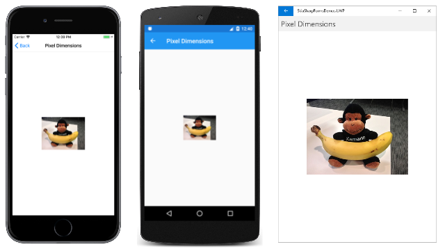
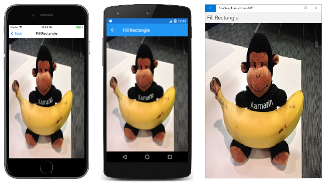
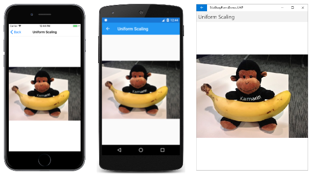
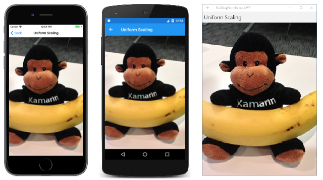
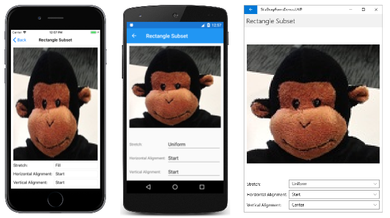

# Displaying SkiaSharp bitmaps

The subject of SkiaSharp bitmaps was introduced in the article **[Bitmap Basics in SkiaSharp](../basics/bitmaps.md)**. That article showed three ways to load bitmaps and three ways to display bitmaps. This article reviews the techniques to load bitmaps and goes deeper into the use of the `DrawBitmap` methods of `SKCanvas`.


The `DrawBitmapLattice` and `DrawBitmapNinePatch` methods are discussed in the article **[Segmented display of SkiaSharp bitmaps](segmented.md)**.

Samples on this page are from the sample application. From the home page of that application, choose **SkiaSharp Bitmaps**, and then go to the **Displaying Bitmaps** section.

## Loading a bitmap

A bitmap used by a SkiaSharp application generally comes from one of three different sources:

- From over the Internet
- From a resource embedded in the executable
- From the user's photo library

It is also possible for a SkiaSharp application to create a new bitmap, and then draw on it or set the bitmap bits algorithmically. Those techniques are discussed in the articles **[Creating and Drawing on SkiaSharp Bitmaps](drawing.md)** and **[Accessing SkiaSharp Bitmap Pixels](pixel-bits.md)**.

In the following three code examples of loading a bitmap, the class is assumed to contain a field of type `SKBitmap`:

```csharp
SKBitmap bitmap;
```

As the article **[Bitmap Basics in SkiaSharp](../basics/bitmaps.md)** stated, the best way to load a bitmap over the Internet is with the [`HttpClient`](xref:System.Net.Http.HttpClient) class. A single instance of the class can be defined as a field:

```csharp
HttpClient httpClient = new HttpClient();
```

When using `HttpClient` with iOS and Android applications, you'll want to set project properties as described in the documents on **[Transport Layer Security (TLS) 1.2](~/cross-platform/app-fundamentals/transport-layer-security.md)**.

Code that uses `HttpClient` often involves the `await` operator, so it must reside in an `async` method:

```csharp
try
{
    using (Stream stream = await httpClient.GetStreamAsync("https:// ··· "))
    using (MemoryStream memStream = new MemoryStream())
    {
        await stream.CopyToAsync(memStream);
        memStream.Seek(0, SeekOrigin.Begin);

        bitmap = SKBitmap.Decode(memStream);
        ···
    };
}
catch
{
    ···
}
```

Notice that the `Stream` object obtained from `GetStreamAsync` is copied into a `MemoryStream`. Android does not allow the `Stream` from `HttpClient` to be processed by the main thread except in asynchronous methods.

The [`SKBitmap.Decode`](xref:SkiaSharp.SKBitmap.Decode(System.IO.Stream)) does a lot of work: The `Stream` object passed to it references a block of memory containing an entire bitmap in one of the common bitmap file formats, generally JPEG, PNG, or GIF. The `Decode` method must determine the format, and then decode the bitmap file into SkiaSharp's own internal bitmap format.

After your code calls `SKBitmap.Decode`, it will probably invalidate the `CanvasView` so that the `PaintSurface` handler can display the newly loaded bitmap.

The second way to load a bitmap is by including the bitmap as an embedded resource in the .NET Standard library referenced by the individual platform projects. A resource ID is passed to the [`GetManifestResourceStream`](xref:System.Reflection.Assembly.GetManifestResourceStream(System.String)) method. This resource ID consists of the assembly name, folder name, and filename of the resource separated by periods:

```csharp
string resourceID = "assemblyName.folderName.fileName";
Assembly assembly = GetType().GetTypeInfo().Assembly;

using (Stream stream = assembly.GetManifestResourceStream(resourceID))
{
    bitmap = SKBitmap.Decode(stream);
    ···
}
```

Bitmap files can also be stored as resources in the individual platform project for iOS, Android, and the Universal Windows Platform (UWP). However, loading those bitmaps requires code that is located in the platform project.

A third approach to obtaining a bitmap is from the user's picture library. The following code uses a dependency service that is included in the sample application. The **SkiaSharpFormsDemo** .NET Standard Library includes the `IPhotoLibrary` interface, while each of the platform projects contains a `PhotoLibrary` class that implements that interface.

```csharp
IPhotoicturePicker picturePicker = DependencyService.Get<IPhotoLibrary>();

using (Stream stream = await picturePicker.GetImageStreamAsync())
{
    if (stream != null)
    {
        bitmap = SKBitmap.Decode(stream);
        ···
    }
}
```

Generally, such code also invalidates the `CanvasView` so that the `PaintSurface` handler can display the new bitmap.

The `SKBitmap` class defines several useful properties, including [`Width`](xref:SkiaSharp.SKBitmap.Width) and [`Height`](xref:SkiaSharp.SKBitmap.Height), that reveal the pixel dimensions of the bitmap, as well as many methods, including methods to create bitmaps, to copy them, and to expose the pixel bits.

## Displaying in pixel dimensions

The SkiaSharp [`Canvas`](xref:SkiaSharp.SKCanvas) class defines four `DrawBitmap` methods. These methods allow bitmaps to be displayed in two fundamentally different ways:

- Specifying an `SKPoint` value (or separate `x` and `y` values) displays the bitmap in its pixel dimensions. The pixels of the bitmap are mapped directly to pixels of the video display.
- Specifying a rectangle causes the bitmap to be stretched to the size and shape of the rectangle.

You display a bitmap in its pixel dimensions using [`DrawBitmap`](xref:SkiaSharp.SKCanvas.DrawBitmap(SkiaSharp.SKBitmap,SkiaSharp.SKPoint,SkiaSharp.SKPaint)) with an `SKPoint` parameter or [`DrawBitmap`](xref:SkiaSharp.SKCanvas.DrawBitmap(SkiaSharp.SKBitmap,System.Single,System.Single,SkiaSharp.SKPaint)) with separate `x` and `y` parameters:

```csharp
DrawBitmap(SKBitmap bitmap, SKPoint pt, SKPaint paint = null)

DrawBitmap(SKBitmap bitmap, float x, float y, SKPaint paint = null)
```

These two methods are functionally identical. The specified point indicates the location of the upper-left corner of the bitmap relative to the canvas. Because the pixel resolution of mobile devices is so high, smaller bitmaps usually appear quite tiny on these devices.

The optional `SKPaint` parameter allows you to display the bitmap using transparency. To do this, create an `SKPaint` object and set the `Color` property to any `SKColor` value with an alpha channel less than 1. For example:

```csharp
paint.Color = new SKColor(0, 0, 0, 0x80);
```

The 0x80 passed as the last argument indicates 50% transparency. You can also set an alpha channel on one of the pre-defined colors:

```csharp
paint.Color = SKColors.Red.WithAlpha(0x80);
```

However, the color itself is irrelevant. Only the alpha channel is examined when you use the `SKPaint` object in a `DrawBitmap` call.

The `SKPaint` object also plays a role when displaying bitmaps using blend modes or filter effects. These are demonstrated in the articles [SkiaSharp compositing and blend modes](../effects/blend-modes/index.md) and [SkiaSharp image filters](../effects/image-filters.md).

The **Pixel Dimensions** page in the sample program displays a bitmap resource that is 320 pixels wide by 240 pixels high:

```csharp
public class PixelDimensionsPage : ContentPage
{
    SKBitmap bitmap;

    public PixelDimensionsPage()
    {
        Title = "Pixel Dimensions";

        // Load the bitmap from a resource
        string resourceID = "SkiaSharpFormsDemos.Media.Banana.jpg";
        Assembly assembly = GetType().GetTypeInfo().Assembly;

        using (Stream stream = assembly.GetManifestResourceStream(resourceID))
        {
            bitmap = SKBitmap.Decode(stream);
        }

        // Create the SKCanvasView and set the PaintSurface handler
        SKCanvasView canvasView = new SKCanvasView();
        canvasView.PaintSurface += OnCanvasViewPaintSurface;
        Content = canvasView;
    }

    void OnCanvasViewPaintSurface(object sender, SKPaintSurfaceEventArgs args)
    {
        SKImageInfo info = args.Info;
        SKSurface surface = args.Surface;
        SKCanvas canvas = surface.Canvas;

        canvas.Clear();

        float x = (info.Width - bitmap.Width) / 2;
        float y = (info.Height - bitmap.Height) / 2;

        canvas.DrawBitmap(bitmap, x, y);
    }
}
```

The `PaintSurface` handler centers the bitmap by calculating `x` and `y` values based on the pixel dimensions of the display surface and the pixel dimensions of the bitmap:

[](displaying-images/PixelDimensions-Large.png#lightbox)

If the application wishes to display the bitmap in its upper-left corner, it would simply pass coordinates of (0, 0).

## A method for loading resource bitmaps

Many of the samples coming up will need to load bitmap resources. The static `BitmapExtensions` class in the sample solution contains a method to help out:

```csharp
static class BitmapExtensions
{
    public static SKBitmap LoadBitmapResource(Type type, string resourceID)
    {
        Assembly assembly = type.GetTypeInfo().Assembly;

        using (Stream stream = assembly.GetManifestResourceStream(resourceID))
        {
            return SKBitmap.Decode(stream);
        }
    }
    ···
}
```

Notice the `Type` parameter. This can be the `Type` object associated with any type in the assembly that stores the bitmap resource.

This `LoadBitmapResource` method will be used in all subsequent samples that require bitmap resources.

## Stretching to fill a rectangle

The `SKCanvas` class also defines a [`DrawBitmap`](xref:SkiaSharp.SKCanvas.DrawBitmap(SkiaSharp.SKBitmap,SkiaSharp.SKRect,SkiaSharp.SKPaint)) method that renders the bitmap to a rectangle, and another [`DrawBitmap`](xref:SkiaSharp.SKCanvas.DrawBitmap(SkiaSharp.SKBitmap,SkiaSharp.SKRect,SkiaSharp.SKRect,SkiaSharp.SKPaint)) method that renders a rectangular subset of the bitmap to a rectangle:

```
DrawBitmap(SKBitmap bitmap, SKRect dest, SKPaint paint = null)

DrawBitmap(SKBitmap bitmap, SKRect source, SKRect dest, SKPaint paint = null)
```

In both cases, the bitmap is stretched to fill the rectangle named `dest`. In the second method, the `source` rectangle allows you to select a subset of the bitmap. The `dest` rectangle is relative to the output device; the `source` rectangle is relative to the bitmap.

The **Fill Rectangle** page demonstrates the first of these two methods by displaying the same bitmap used in the earlier example in a rectangle the same size as the canvas:

```csharp
public class FillRectanglePage : ContentPage
{
    SKBitmap bitmap =
        BitmapExtensions.LoadBitmapResource(typeof(FillRectanglePage),
                                            "SkiaSharpFormsDemos.Media.Banana.jpg");
    public FillRectanglePage ()
    {
        Title = "Fill Rectangle";

        SKCanvasView canvasView = new SKCanvasView();
        canvasView.PaintSurface += OnCanvasViewPaintSurface;
        Content = canvasView;
    }

    void OnCanvasViewPaintSurface(object sender, SKPaintSurfaceEventArgs args)
    {
        SKImageInfo info = args.Info;
        SKSurface surface = args.Surface;
        SKCanvas canvas = surface.Canvas;

        canvas.Clear();

        canvas.DrawBitmap(bitmap, info.Rect);
    }
}
```

Notice the use of the new `BitmapExtensions.LoadBitmapResource` method to set the `SKBitmap` field. The destination rectangle is obtained from the [`Rect`](xref:SkiaSharp.SKImageInfo.Rect) property of `SKImageInfo`, which desribes the size of the display surface:

[](displaying-images/FillRectangle-Large.png#lightbox)

This is usually _not_ what you want. The image is distorted by being stretched differently in the horizontal and vertical directions. When displaying a bitmap in something other than its pixel size, usually you want to preserve the bitmap's original aspect ratio.

## Stretching while preserving the aspect ratio

Stretching a bitmap while preserving the aspect ratio is a process also known as _uniform scaling_. That term suggests an algorithmic approach. One possible solution is shown in the **Uniform Scaling** page:

```csharp
public class UniformScalingPage : ContentPage
{
    SKBitmap bitmap =
        BitmapExtensions.LoadBitmapResource(typeof(UniformScalingPage),
                                            "SkiaSharpFormsDemos.Media.Banana.jpg");
    public UniformScalingPage()
    {
        Title = "Uniform Scaling";

        SKCanvasView canvasView = new SKCanvasView();
        canvasView.PaintSurface += OnCanvasViewPaintSurface;
        Content = canvasView;
    }

    void OnCanvasViewPaintSurface(object sender, SKPaintSurfaceEventArgs args)
    {
        SKImageInfo info = args.Info;
        SKSurface surface = args.Surface;
        SKCanvas canvas = surface.Canvas;

        canvas.Clear();

        float scale = Math.Min((float)info.Width / bitmap.Width,
                               (float)info.Height / bitmap.Height);
        float x = (info.Width - scale * bitmap.Width) / 2;
        float y = (info.Height - scale * bitmap.Height) / 2;
        SKRect destRect = new SKRect(x, y, x + scale * bitmap.Width,
                                           y + scale * bitmap.Height);

        canvas.DrawBitmap(bitmap, destRect);
    }
}
```

The `PaintSurface` handler calculates a `scale` factor that is the minimum of the ratio of the display width and height to the bitmap width and height. The `x` and `y` values can then be calculated for centering the scaled bitmap within the display width and height. The destination rectangle has an upper-left corner of `x` and `y` and a lower-right corner of those values plus the scaled width and height of the bitmap:

[](displaying-images/UniformScaling-Large.png#lightbox)

Turn the phone sideways to see the bitmap stretched to that area:

[](displaying-images/UniformScaling-Landscape-Large.png#lightbox)

The advantage of using this `scale` factor becomes obvious when you want to implement a slightly different algorithm. Suppose you want to preserve the bitmap's aspect ratio but also fill the destination rectangle. The only way this is possible is by cropping part of the image, but you can implement that algorithm simply by changing `Math.Min` to `Math.Max` in the above code. Here's the result:

[](displaying-images/UniformScaling-Alternative-Large.png#lightbox)

The bitmap's aspect ratio is preserved but areas on the left and right of the bitmap are cropped.

## A versatile bitmap display function

XAML-based programming environments (such as UWP and .NET MAUI) have a facility to expand or shrink the size of bitmaps while preserving their aspect ratios. Although SkiaSharp does not include this feature, you can implement it yourself.

The `BitmapExtensions` class included in the sample application shows how. The class defines two new `DrawBitmap` methods that perform the aspect ratio calculation. These new methods are extension methods of `SKCanvas`.

The new `DrawBitmap` methods include a parameter of type `BitmapStretch`, an enumeration defined in the **BitmapExtensions.cs** file:

```csharp
public enum BitmapStretch
{
    None,
    Fill,
    Uniform,
    UniformToFill,
    AspectFit = Uniform,
    AspectFill = UniformToFill
}
```

The `None`, `Fill`, `Uniform`, and `UniformToFill` members are the same as those in the UWP [`Stretch`](/uwp/api/Windows.UI.Xaml.Media.Stretch) enumeration. The similar .NET MAUI [`Aspect`](xref:Microsoft.Maui.Controls.Aspect) enumeration defines members `Fill`, `AspectFit`, and `AspectFill`.

The **Uniform Scaling** page shown above centers the bitmap within the rectangle, but you might want other options, such as positioning the bitmap at the left or right side of the rectangle, or the top or bottom. That's the purpose of the `BitmapAlignment` enumeration:

```csharp
public enum BitmapAlignment
{
    Start,
    Center,
    End
}
```

Alignment settings have no effect when used with `BitmapStretch.Fill`.

The first `DrawBitmap` extension function contains a destination rectangle but no source rectangle. Defaults are defined so that if you want the bitmap centered, you need only specify a `BitmapStretch` member:

```csharp
static class BitmapExtensions
{
    ···
    public static void DrawBitmap(this SKCanvas canvas, SKBitmap bitmap, SKRect dest,
                                  BitmapStretch stretch,
                                  BitmapAlignment horizontal = BitmapAlignment.Center,
                                  BitmapAlignment vertical = BitmapAlignment.Center,
                                  SKPaint paint = null)
    {
        if (stretch == BitmapStretch.Fill)
        {
            canvas.DrawBitmap(bitmap, dest, paint);
        }
        else
        {
            float scale = 1;

            switch (stretch)
            {
                case BitmapStretch.None:
                    break;

                case BitmapStretch.Uniform:
                    scale = Math.Min(dest.Width / bitmap.Width, dest.Height / bitmap.Height);
                    break;

                case BitmapStretch.UniformToFill:
                    scale = Math.Max(dest.Width / bitmap.Width, dest.Height / bitmap.Height);
                    break;
            }

            SKRect display = CalculateDisplayRect(dest, scale * bitmap.Width, scale * bitmap.Height,
                                                  horizontal, vertical);

            canvas.DrawBitmap(bitmap, display, paint);
        }
    }
    ···
}
```

The primary purpose of this method is to calculate a scaling factor named `scale` that is then applied to the bitmap width and height when calling the `CalculateDisplayRect` method. This is the method that calculates a rectangle for displaying the bitmap based on the horizontal and vertical alignment:

```csharp
static class BitmapExtensions
{
    ···
    static SKRect CalculateDisplayRect(SKRect dest, float bmpWidth, float bmpHeight,
                                       BitmapAlignment horizontal, BitmapAlignment vertical)
    {
        float x = 0;
        float y = 0;

        switch (horizontal)
        {
            case BitmapAlignment.Center:
                x = (dest.Width - bmpWidth) / 2;
                break;

            case BitmapAlignment.Start:
                break;

            case BitmapAlignment.End:
                x = dest.Width - bmpWidth;
                break;
        }

        switch (vertical)
        {
            case BitmapAlignment.Center:
                y = (dest.Height - bmpHeight) / 2;
                break;

            case BitmapAlignment.Start:
                break;

            case BitmapAlignment.End:
                y = dest.Height - bmpHeight;
                break;
        }

        x += dest.Left;
        y += dest.Top;

        return new SKRect(x, y, x + bmpWidth, y + bmpHeight);
    }
}
```

The `BitmapExtensions` class contains an additional `DrawBitmap` method with a source rectangle for specifying a subset of the bitmap. This method is similar to the first one except that the scaling factor is calculated based on the `source` rectangle, and then applied to the `source` rectangle in the call to `CalculateDisplayRect`:

```csharp
static class BitmapExtensions
{
    ···
    public static void DrawBitmap(this SKCanvas canvas, SKBitmap bitmap, SKRect source, SKRect dest,
                                  BitmapStretch stretch,
                                  BitmapAlignment horizontal = BitmapAlignment.Center,
                                  BitmapAlignment vertical = BitmapAlignment.Center,
                                  SKPaint paint = null)
    {
        if (stretch == BitmapStretch.Fill)
        {
            canvas.DrawBitmap(bitmap, source, dest, paint);
        }
        else
        {
            float scale = 1;

            switch (stretch)
            {
                case BitmapStretch.None:
                    break;

                case BitmapStretch.Uniform:
                    scale = Math.Min(dest.Width / source.Width, dest.Height / source.Height);
                    break;

                case BitmapStretch.UniformToFill:
                    scale = Math.Max(dest.Width / source.Width, dest.Height / source.Height);
                    break;
            }

            SKRect display = CalculateDisplayRect(dest, scale * source.Width, scale * source.Height,
                                                  horizontal, vertical);

            canvas.DrawBitmap(bitmap, source, display, paint);
        }
    }
    ···
}
```

The first of these two new `DrawBitmap` methods is demonstrated in the **Scaling Modes** page. The XAML file contains three `Picker` elements that let you select members of the `BitmapStretch` and `BitmapAlignment` enumerations:

```xaml
<?xml version="1.0" encoding="utf-8" ?>
<ContentPage xmlns="http://schemas.microsoft.com/dotnet/2021/maui"
             xmlns:x="http://schemas.microsoft.com/winfx/2009/xaml"
             xmlns:local="clr-namespace:SkiaSharpFormsDemos"
             xmlns:skia="clr-namespace:SkiaSharp.Views.Maui.Controls;assembly=SkiaSharp.Views.Maui.Controls"
             x:Class="SkiaSharpFormsDemos.Bitmaps.ScalingModesPage"
             Title="Scaling Modes">

    <Grid Padding="10">
        <Grid.RowDefinitions>
            <RowDefinition Height="*" />
            <RowDefinition Height="Auto" />
            <RowDefinition Height="Auto" />
            <RowDefinition Height="Auto" />
        </Grid.RowDefinitions>

        <Grid.ColumnDefinitions>
            <ColumnDefinition Width="Auto" />
            <ColumnDefinition Width="*" />
        </Grid.ColumnDefinitions>

        <skia:SKCanvasView x:Name="canvasView"
                           Grid.Row="0" Grid.Column="0" Grid.ColumnSpan="2"
                           PaintSurface="OnCanvasViewPaintSurface" />

        <Label Text="Stretch:"
               Grid.Row="1" Grid.Column="0"
               VerticalOptions="Center" />

        <Picker x:Name="stretchPicker"
                Grid.Row="1" Grid.Column="1"
                SelectedIndexChanged="OnPickerSelectedIndexChanged">
            <Picker.ItemsSource>
                <x:Array Type="{x:Type local:BitmapStretch}">
                    <x:Static Member="local:BitmapStretch.None" />
                    <x:Static Member="local:BitmapStretch.Fill" />
                    <x:Static Member="local:BitmapStretch.Uniform" />
                    <x:Static Member="local:BitmapStretch.UniformToFill" />
                </x:Array>
            </Picker.ItemsSource>

            <Picker.SelectedIndex>
                0
            </Picker.SelectedIndex>
        </Picker>

        <Label Text="Horizontal Alignment:"
               Grid.Row="2" Grid.Column="0"
               VerticalOptions="Center" />

        <Picker x:Name="horizontalPicker"
                Grid.Row="2" Grid.Column="1"
                SelectedIndexChanged="OnPickerSelectedIndexChanged">
            <Picker.ItemsSource>
                <x:Array Type="{x:Type local:BitmapAlignment}">
                    <x:Static Member="local:BitmapAlignment.Start" />
                    <x:Static Member="local:BitmapAlignment.Center" />
                    <x:Static Member="local:BitmapAlignment.End" />
                </x:Array>
            </Picker.ItemsSource>

            <Picker.SelectedIndex>
                0
            </Picker.SelectedIndex>
        </Picker>

        <Label Text="Vertical Alignment:"
               Grid.Row="3" Grid.Column="0"
               VerticalOptions="Center" />

        <Picker x:Name="verticalPicker"
                Grid.Row="3" Grid.Column="1"
                SelectedIndexChanged="OnPickerSelectedIndexChanged">
            <Picker.ItemsSource>
                <x:Array Type="{x:Type local:BitmapAlignment}">
                    <x:Static Member="local:BitmapAlignment.Start" />
                    <x:Static Member="local:BitmapAlignment.Center" />
                    <x:Static Member="local:BitmapAlignment.End" />
                </x:Array>
            </Picker.ItemsSource>

            <Picker.SelectedIndex>
                0
            </Picker.SelectedIndex>
        </Picker>
    </Grid>
</ContentPage>
```

The code-behind file simply invalidates the `CanvasView` when any `Picker` item has changed. The `PaintSurface` handler accesses the three `Picker` views for calling the `DrawBitmap` extension method:

```csharp
public partial class ScalingModesPage : ContentPage
{
    SKBitmap bitmap =
        BitmapExtensions.LoadBitmapResource(typeof(ScalingModesPage),
                                            "SkiaSharpFormsDemos.Media.Banana.jpg");
    public ScalingModesPage()
    {
        InitializeComponent();
    }

    private void OnPickerSelectedIndexChanged(object sender, EventArgs args)
    {
        canvasView.InvalidateSurface();
    }

    void OnCanvasViewPaintSurface(object sender, SKPaintSurfaceEventArgs args)
    {
        SKImageInfo info = args.Info;
        SKSurface surface = args.Surface;
        SKCanvas canvas = surface.Canvas;

        canvas.Clear();

        SKRect dest = new SKRect(0, 0, info.Width, info.Height);

        BitmapStretch stretch = (BitmapStretch)stretchPicker.SelectedItem;
        BitmapAlignment horizontal = (BitmapAlignment)horizontalPicker.SelectedItem;
        BitmapAlignment vertical = (BitmapAlignment)verticalPicker.SelectedItem;

        canvas.DrawBitmap(bitmap, dest, stretch, horizontal, vertical);
    }
}
```

Here are some combinations of options:

[](displaying-images/ScalingModes-Large.png#lightbox)

The **Rectangle Subset** page has virtually the same XAML file as **Scaling Modes**, but the code-behind file defines a rectangular subset of the bitmap given by the `SOURCE` field:

```csharp
public partial class ScalingModesPage : ContentPage
{
    SKBitmap bitmap =
        BitmapExtensions.LoadBitmapResource(typeof(ScalingModesPage),
                                            "SkiaSharpFormsDemos.Media.Banana.jpg");

    static readonly SKRect SOURCE = new SKRect(94, 12, 212, 118);

    public RectangleSubsetPage()
    {
        InitializeComponent();
    }

    private void OnPickerSelectedIndexChanged(object sender, EventArgs args)
    {
        canvasView.InvalidateSurface();
    }

    void OnCanvasViewPaintSurface(object sender, SKPaintSurfaceEventArgs args)
    {
        SKImageInfo info = args.Info;
        SKSurface surface = args.Surface;
        SKCanvas canvas = surface.Canvas;

        canvas.Clear();

        SKRect dest = new SKRect(0, 0, info.Width, info.Height);

        BitmapStretch stretch = (BitmapStretch)stretchPicker.SelectedItem;
        BitmapAlignment horizontal = (BitmapAlignment)horizontalPicker.SelectedItem;
        BitmapAlignment vertical = (BitmapAlignment)verticalPicker.SelectedItem;

        canvas.DrawBitmap(bitmap, SOURCE, dest, stretch, horizontal, vertical);
    }
}
```

This rectangle source isolates the monkey's head, as shown in these screenshots:

[](displaying-images/RectangleSubset-Large.png#lightbox)

## Related links

- [SkiaSharp APIs](/dotnet/api/skiasharp)
