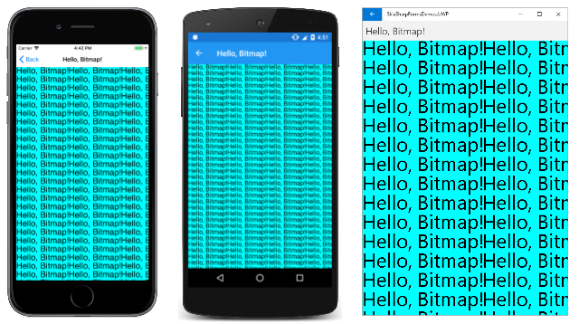
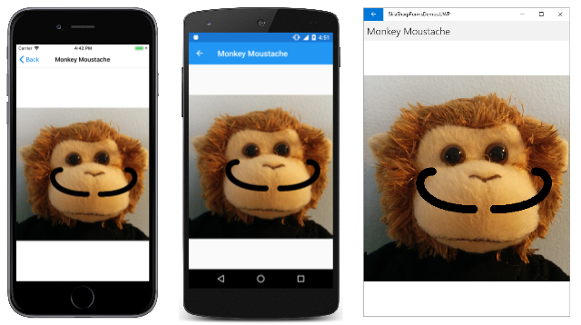
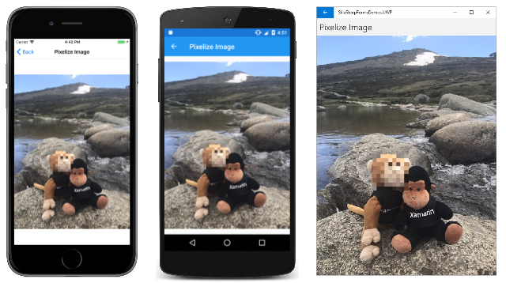

# Creating and drawing on SkiaSharp bitmaps

You've seen how an application can load bitmaps from the Web, from application resources, and from the user's photo library. It's also possible to create new bitmaps within your application. The simplest approach involves one of the constructors of [`SKBitmap`](xref:SkiaSharp.SKBitmap.%23ctor(System.Int32,System.Int32,System.Boolean)):

```csharp
SKBitmap bitmap = new SKBitmap(width, height);
```

The `width` and `height` parameters are integers and specify the pixel dimensions of the bitmap. This constructor creates a full-color bitmap with four bytes per pixel: one byte each for the red, green, blue, and alpha (opacity) components.

After you've created a new bitmap, you need to get something on the surface of the bitmap. You generally do this in one of two ways:

- Draw on the bitmap using standard `Canvas` drawing methods.
- Access the pixel bits directly.

This article demonstrates the first approach:


The second approach is discussed in the article [**Accessing SkiaSharp Bitmap Pixels**](pixel-bits.md).

## Drawing on the bitmap

Drawing on the surface of a bitmap is the same as drawing on a video display. To draw on a video display, you obtain an `SKCanvas` object from the `PaintSurface` event arguments. To draw on a bitmap, you create an `SKCanvas` object using the [`SKCanvas`](xref:SkiaSharp.SKCanvas.%23ctor(SkiaSharp.SKBitmap)) constructor:

```csharp
SKCanvas canvas = new SKCanvas(bitmap);
```

When you're finished drawing on the bitmap, you can dispose of the `SKCanvas` object. For this reason, the `SKCanvas` constructor is generally called in a `using` statement:

```csharp
using (SKCanvas canvas = new SKCanvas(bitmap))
{
    ··· // call drawing function
}
```

The bitmap can then be displayed. At a later time, the program can create a new `SKCanvas` object based on that same bitmap, and draw on it some more.

The **Hello Bitmap** page in the sample application writes the text "Hello, Bitmap!" on a bitmap and then displays that bitmap multiple times.

The constructor of the `HelloBitmapPage` begins by creating an `SKPaint` object for displaying text. It determines the dimensions of a text string and creates a bitmap with those dimensions. It then creates an `SKCanvas` object based on that bitmap, calls `Clear`, and then calls `DrawText`. It's always a good idea to call `Clear` with a new bitmap because a newly created bitmap might contain random data.

The constructor concludes by creating an `SKCanvasView` object to display the bitmap:

```csharp
public partial class HelloBitmapPage : ContentPage
{
    const string TEXT = "Hello, Bitmap!";
    SKBitmap helloBitmap;

    public HelloBitmapPage()
    {
        Title = TEXT;

        // Create bitmap and draw on it
        using (SKPaint textPaint = new SKPaint { TextSize = 48 })
        {
            SKRect bounds = new SKRect();
            textPaint.MeasureText(TEXT, ref bounds);

            helloBitmap = new SKBitmap((int)bounds.Right,
                                       (int)bounds.Height);

            using (SKCanvas bitmapCanvas = new SKCanvas(helloBitmap))
            {
                bitmapCanvas.Clear();
                bitmapCanvas.DrawText(TEXT, 0, -bounds.Top, textPaint);
            }
        }

        // Create SKCanvasView to view result
        SKCanvasView canvasView = new SKCanvasView();
        canvasView.PaintSurface += OnCanvasViewPaintSurface;
        Content = canvasView;
    }

    void OnCanvasViewPaintSurface(object sender, SKPaintSurfaceEventArgs args)
    {
        SKImageInfo info = args.Info;
        SKSurface surface = args.Surface;
        SKCanvas canvas = surface.Canvas;

        canvas.Clear(SKColors.Aqua);

        for (float y = 0; y < info.Height; y += helloBitmap.Height)
            for (float x = 0; x < info.Width; x += helloBitmap.Width)
            {
                canvas.DrawBitmap(helloBitmap, x, y);
            }
    }
}
```

The `PaintSurface` handler renders the bitmap multiple times in rows and columns of the display. Notice that the `Clear` method in the `PaintSurface` handler has an argument of `SKColors.Aqua`, which colors the background of the display surface:

[](drawing-images/HelloBitmap-Large.png#lightbox)

The appearance of the aqua background reveals that the bitmap is transparent except for the text.

## Clearing and transparency

The display of the **Hello Bitmap** page demonstrates that the bitmap the program created is transparent except for the black text. That's why the aqua color of the display surface shows through.

The documentation of the `Clear` methods of `SKCanvas` describes them with the statement: "Replaces all the pixels in the canvas' current clip." The use of the word "replaces" reveals an important characteristic of these methods: All the drawing methods of `SKCanvas` add something to the existing display surface. The `Clear` methods _replace_ what's already there.

`Clear` exists in two different versions:

- The [`Clear`](xref:SkiaSharp.SKCanvas.Clear(SkiaSharp.SKColor)) method with an `SKColor` parameter replaces the pixels of the display surface with pixels of that color.

- The [`Clear`](xref:SkiaSharp.SKCanvas.Clear) method with no parameters replaces the pixels with the [`SKColors.Empty`](xref:SkiaSharp.SKColors.Empty) color, which is a color in which all the components (red, green, blue, and alpha) are set to zero. This color is sometimes referred to as "transparent black."

Calling `Clear` with no arguments on a new bitmap initializes the entire bitmap to be entirely transparent. Anything subsequently drawn on the bitmap will usually be opaque or partially opaque.

Here's something to try: In the **Hello Bitmap** page, replace the `Clear` method applied to the `bitmapCanvas` with this one:

```csharp
bitmapCanvas.Clear(new SKColor(255, 0, 0, 128));
```

The order of the `SKColor` constructor parameters is red, green, blue, and alpha, where each value can range from 0 to 255. Keep in mind that an alpha value of 0 is transparent, while an alpha value of 255 is opaque.

The value (255, 0, 0, 128) clears the bitmap pixels to red pixels with a 50% opacity. This means that the bitmap background is semi-transparent. The semi-transparent red background of the bitmap combines with the aqua background of the display surface to create a gray background.

Try setting the color of the text to transparent black by putting the following assignment in the `SKPaint` initializer:

```csharp
Color = new SKColor(0, 0, 0, 0)
```

You might think that this transparent text would create fully transparent areas of the bitmap through which you'd see the aqua background of the display surface. But that is not so. The text is drawn on top of what's already on the bitmap. The transparent text will not be visible at all.

No `Draw` method ever makes a bitmap more transparent. Only `Clear` can do that.

## Bitmap color types

The simplest `SKBitmap` constructor allows you to specify an integer pixel width and height for the bitmap. Other `SKBitmap` constructors are more complex. These constructors require arguments of two enumeration types: [`SKColorType`](xref:SkiaSharp.SKColorType) and [`SKAlphaType`](xref:SkiaSharp.SKAlphaType). Other constructors use the [`SKImageInfo`](xref:SkiaSharp.SKImageInfo) structure, which consolidates this information.

The `SKColorType` enumeration has 9 members. Each of these members describes a particular way of storing the bitmap pixels:

- `Unknown`
- `Alpha8` &mdash; each pixel is 8 bits, representing an alpha value from fully transparent to fully opaque
- `Rgb565` &mdash; each pixel is 16 bits, 5 bits for red and blue, and 6 for green
- `Argb4444` &mdash; each pixel is 16 bits, 4 each for alpha, red, green, and blue
- `Rgba8888` &mdash; each pixel is 32 bits, 8 each for red, green, blue, and alpha
- `Bgra8888` &mdash; each pixel is 32 bits, 8 each for blue, green, red, and alpha
- `Index8` &mdash; each pixel is 8 bits and represents an index into an [`SKColorTable`](xref:SkiaSharp.SKColorTable)
- `Gray8` &mdash; each pixel is 8 bits representing a gray shade from black to white
- `RgbaF16` &mdash; each pixel is 64 bits, with red, green, blue, and alpha in a 16-bit floating-point format

The two formats where each pixel is 32 pixels (4 bytes) are often called _full-color_ formats. Many of the other formats date from a time when video displays themselves were not capable of full color. Bitmaps of limited color were adequate for these displays and allowed bitmaps to occupy less space in memory.

These days, programmers almost always use full-color bitmaps and don't bother with other formats. The exception is the `RgbaF16` format, which allows greater color resolution than even the full-color formats. However, this format is used for specialized purposes, such as medical imaging, and doesn't make much sense when used with standard full-color displays.

This series of articles will restrict itself to the `SKBitmap` color formats used by default when no `SKColorType` member is specified. This default format is based on the underlying platform. For the platforms supported by .NET MAUI, the default color type is:

- `Rgba8888` for iOS and Android
- `Bgra8888` for the UWP

The only difference is the order of the 4 bytes in memory, and this only becomes an issue when you directly access the pixel bits. This won't become important until you get to the article [**Accessing SkiaSharp Bitmap Pixels**](pixel-bits.md).

The `SKAlphaType` enumeration has four members:

- `Unknown`
- `Opaque` &mdash; the bitmap has no transparency
- `Premul` &mdash; color components are pre-multiplied by the alpha component
- `Unpremul` &mdash; color components are not pre-multiplied by the alpha component

Here's a 4-byte red bitmap pixel with 50% transparency, with the bytes shown in the order red, green, blue, alpha:

0xFF 0x00 0x00 0x80

When a bitmap containing semi-transparent pixels is rendered on a display surface, the color components of each bitmap pixel must be multiplied by that pixel's alpha value, and the color components of the corresponding pixel of the display surface must be multiplied by 255 minus the alpha value. The two pixels can then be combined. The bitmap can be rendered faster if the color components in the bitmap pixels have already been pre-mulitplied by the alpha value. That same red pixel would be stored like this in a pre-multiplied format:

0x80 0x00 0x00 0x80

This performance improvement is why `SkiaSharp` bitmaps by default are created with a `Premul` format. But again, it becomes necessary to know this only when you access and manipulate pixel bits.

## Drawing on existing bitmaps

It is not necessary to create a new bitmap to draw on it. You can also draw on an existing bitmap.

The **Monkey Moustache** page uses its constructor to load the **MonkeyFace.png** image. It then creates an `SKCanvas` object based on that bitmap, and uses `SKPaint` and `SKPath` objects to draw a moustache on it:

```csharp
public partial class MonkeyMoustachePage : ContentPage
{
    SKBitmap monkeyBitmap;

    public MonkeyMoustachePage()
    {
        Title = "Monkey Moustache";

        monkeyBitmap = BitmapExtensions.LoadBitmap("MonkeyFace.png");

        // Create canvas based on bitmap
        using (SKCanvas canvas = new SKCanvas(monkeyBitmap))
        {
            using (SKPaint paint = new SKPaint())
            {
                paint.Style = SKPaintStyle.Stroke;
                paint.Color = SKColors.Black;
                paint.StrokeWidth = 24;
                paint.StrokeCap = SKStrokeCap.Round;

                using (SKPath path = new SKPath())
                {
                    path.MoveTo(380, 390);
                    path.CubicTo(560, 390, 560, 280, 500, 280);

                    path.MoveTo(320, 390);
                    path.CubicTo(140, 390, 140, 280, 200, 280);

                    canvas.DrawPath(path, paint);
                }
            }
        }

        // Create SKCanvasView to view result
        SKCanvasView canvasView = new SKCanvasView();
        canvasView.PaintSurface += OnCanvasViewPaintSurface;
        Content = canvasView;
    }

    void OnCanvasViewPaintSurface(object sender, SKPaintSurfaceEventArgs args)
    {
        SKImageInfo info = args.Info;
        SKSurface surface = args.Surface;
        SKCanvas canvas = surface.Canvas;

        canvas.Clear();
        canvas.DrawBitmap(monkeyBitmap, info.Rect, BitmapStretch.Uniform);
    }
}
```

The constructor concludes by creating an `SKCanvasView` whose `PaintSurface` handler simply displays the result:

[](drawing-images/MonkeyMoustache-Large.png#lightbox)

## Copying and modifying bitmaps

The methods of `SKCanvas` that you can use to draw on a bitmap include `DrawBitmap`. This means that you can draw one bitmap on another, usually modifying it in some way.

The most versatile way to modify a bitmap is through accessing the actual pixel bits, a subject covered in the article **[Accessing SkiaSharp bitmap pixels](pixel-bits.md)**. But there are many other techniques to modify bitmaps that don't require accessing the pixel bits.

The following bitmap included with the sample application is 360 pixels wide and 480 pixels in height:


Suppose you haven't received permission from the monkey on the left to publish this photograph. One solution is to obscure the monkey's face using a technique called _pixelization_. The pixels of the face are replaced with blocks of color so you can't make out the features. The blocks of color are usually derived from the original image by averaging the colors of the pixels corresponding to these blocks. But you don't need to perform this averaging yourself. It happens automatically when you copy a bitmap into a smaller pixel dimension.

The left monkey's face occupies approximately a 72-pixel square area with an upper-left corner at the point (112, 238). Let's replace that 72-pixel square area with a 9-by-9 array of colored blocks, each of which is 8-by-8 pixels square.

The **Pixelize Image** page loads in that bitmap and first creates a tiny 9-pixel square bitmap called `faceBitmap`. This is a destination for copying just the monkey's face. The destination rectangle is just 9-pixels square but the source rectangle is 72-pixels square. Every 8-by-8 block of source pixels is consolidated down to just one pixel by averaging the colors.

The next step is to copy the original bitmap into a new bitmap of the same size called `pixelizedBitmap`. The tiny `faceBitmap` is then copied on top of that with a 72-pixel square destination rectangle so that each pixel of `faceBitmap` is expanded to 8 times its size:

```csharp
public class PixelizedImagePage : ContentPage
{
    SKBitmap pixelizedBitmap;

    public PixelizedImagePage ()
    {
        Title = "Pixelize Image";

        SKBitmap originalBitmap = BitmapExtensions.LoadBitmap("MountainClimbers.jpg");

        // Create tiny bitmap for pixelized face
        SKBitmap faceBitmap = new SKBitmap(9, 9);

        // Copy subset of original bitmap to that
        using (SKCanvas canvas = new SKCanvas(faceBitmap))
        {
            canvas.Clear();
            canvas.DrawBitmap(originalBitmap,
                              new SKRect(112, 238, 184, 310),   // source
                              new SKRect(0, 0, 9, 9));          // destination

        }

        // Create full-sized bitmap for copy
        pixelizedBitmap = new SKBitmap(originalBitmap.Width, originalBitmap.Height);

        using (SKCanvas canvas = new SKCanvas(pixelizedBitmap))
        {
            canvas.Clear();

            // Draw original in full size
            canvas.DrawBitmap(originalBitmap, new SKPoint());

            // Draw tiny bitmap to cover face
            canvas.DrawBitmap(faceBitmap,
                              new SKRect(112, 238, 184, 310));  // destination
        }

        // Create SKCanvasView to view result
        SKCanvasView canvasView = new SKCanvasView();
        canvasView.PaintSurface += OnCanvasViewPaintSurface;
        Content = canvasView;
    }

    void OnCanvasViewPaintSurface(object sender, SKPaintSurfaceEventArgs args)
    {
        SKImageInfo info = args.Info;
        SKSurface surface = args.Surface;
        SKCanvas canvas = surface.Canvas;

        canvas.Clear();
        canvas.DrawBitmap(pixelizedBitmap, info.Rect, BitmapStretch.Uniform);
    }
}
```

The constructor concludes by creating an `SKCanvasView` to display the result:

[](drawing-images/PixelizeImage-Large.png#lightbox)

## Rotating bitmaps

Another common task is rotating bitmaps. This is particularly useful when retrieving bitmaps from an iPhone or iPad photo library. Unless the device was held in a particular orientation when the photo was taken, the picture is likely to be upside-down or sideways.

Turning a bitmap upside-down requires creating another bitmap the same size as the first, and then setting a transform to rotate by 180 degrees while copying the first to the second. In all of the examples in this section, `bitmap` is the `SKBitmap` object that you need to rotate:

```csharp
SKBitmap rotatedBitmap = new SKBitmap(bitmap.Width, bitmap.Height);

using (SKCanvas canvas = new SKCanvas(rotatedBitmap))
{
    canvas.Clear();
    canvas.RotateDegrees(180, bitmap.Width / 2, bitmap.Height / 2);
    canvas.DrawBitmap(bitmap, new SKPoint());
}
```

When rotating by 90 degrees, you need to create a bitmap that is a different size than the original by swapping the height and width. For example, if the original bitmap is 1200 pixels wide and 800 pixels high, the rotated bitmap is 800 pixels wide and 1200 pixels wide. Set translation and rotation so that the bitmap is rotated around its upper-left corner and then shifted into view. (Keep in mind that the `Translate` and `RotateDegrees` methods are called in the opposite order of the way that they are applied.) Here's the code for rotating 90 degrees clockwise:

```csharp
SKBitmap rotatedBitmap = new SKBitmap(bitmap.Height, bitmap.Width);

using (SKCanvas canvas = new SKCanvas(rotatedBitmap))
{
    canvas.Clear();
    canvas.Translate(bitmap.Height, 0);
    canvas.RotateDegrees(90);
    canvas.DrawBitmap(bitmap, new SKPoint());
}
```

And here's a similar function for rotating 90 degrees counter-clockwise:

```csharp
SKBitmap rotatedBitmap = new SKBitmap(bitmap.Height, bitmap.Width);

using (SKCanvas canvas = new SKCanvas(rotatedBitmap))
{
    canvas.Clear();
    canvas.Translate(0, bitmap.Width);
    canvas.RotateDegrees(-90);
    canvas.DrawBitmap(bitmap, new SKPoint());
}
```

These two methods are used in the **Photo Puzzle** pages described in the article [**Cropping SkiaSharp Bitmaps**](cropping.md#cropping-skiasharp-bitmaps).

A program that allows the user to rotate a bitmap in 90-degree increments needs only implement one function for rotating by 90 degrees. The user can then rotate in any increment of 90 degrees by repeated execution of this one function.

A program can also rotate a bitmap by any amount. One simple approach is to modify the function that rotates by 180 degrees by replacing 180 with a generalized `angle` variable:

```csharp
SKBitmap rotatedBitmap = new SKBitmap(bitmap.Width, bitmap.Height);

using (SKCanvas canvas = new SKCanvas(rotatedBitmap))
{
    canvas.Clear();
    canvas.RotateDegrees(angle, bitmap.Width / 2, bitmap.Height / 2);
    canvas.DrawBitmap(bitmap, new SKPoint());
}
```

However, in the general case, this logic will crop off the corners of the rotated bitmap. A better approach is to calculate the size of the rotated bitmap using trigonometry to include those corners.

This trigonometry is shown in the **Bitmap Rotator** page. The XAML file instantiates an `SKCanvasView` and a `Slider` that can range from 0 through 360 degrees with a `Label` showing the current value:

```xaml
<ContentPage xmlns="http://schemas.microsoft.com/dotnet/2021/maui"
             xmlns:x="http://schemas.microsoft.com/winfx/2009/xaml"
             xmlns:skia="clr-namespace:SkiaSharp.Views.Maui.Controls;assembly=SkiaSharp.Views.Maui.Controls"
             x:Class="SkiaSharpFormsDemos.Bitmaps.BitmapRotatorPage"
             Title="Bitmap Rotator">
    <StackLayout>
        <skia:SKCanvasView x:Name="canvasView"
                           VerticalOptions="FillAndExpand"
                           PaintSurface="OnCanvasViewPaintSurface" />

        <Slider x:Name="slider"
                Maximum="360"
                Margin="10, 0"
                ValueChanged="OnSliderValueChanged" />

        <Label Text="{Binding Source={x:Reference slider},
                              Path=Value,
                              StringFormat='Rotate by {0:F0}&#x00B0;'}"
               HorizontalTextAlignment="Center" />

    </StackLayout>
</ContentPage>
```

The code-behind file loads a bitmap resource and saves it as a static read-only field named `originalBitmap`. The bitmap displayed in the `PaintSurface` handler is `rotatedBitmap`, which is initially set to `originalBitmap`:

```csharp
public partial class BitmapRotatorPage : ContentPage
{
    static readonly SKBitmap originalBitmap =
        BitmapExtensions.LoadBitmap("Banana.jpg");

    SKBitmap rotatedBitmap = originalBitmap;

    public BitmapRotatorPage ()
    {
        InitializeComponent ();
    }

    void OnCanvasViewPaintSurface(object sender, SKPaintSurfaceEventArgs args)
    {
        SKImageInfo info = args.Info;
        SKSurface surface = args.Surface;
        SKCanvas canvas = surface.Canvas;

        canvas.Clear();
        canvas.DrawBitmap(rotatedBitmap, info.Rect, BitmapStretch.Uniform);
    }

    void OnSliderValueChanged(object sender, ValueChangedEventArgs args)
    {
        double angle = args.NewValue;
        double radians = Math.PI * angle / 180;
        float sine = (float)Math.Abs(Math.Sin(radians));
        float cosine = (float)Math.Abs(Math.Cos(radians));
        int originalWidth = originalBitmap.Width;
        int originalHeight = originalBitmap.Height;
        int rotatedWidth = (int)(cosine * originalWidth + sine * originalHeight);
        int rotatedHeight = (int)(cosine * originalHeight + sine * originalWidth);

        rotatedBitmap = new SKBitmap(rotatedWidth, rotatedHeight);

        using (SKCanvas canvas = new SKCanvas(rotatedBitmap))
        {
            canvas.Clear(SKColors.LightPink);
            canvas.Translate(rotatedWidth / 2, rotatedHeight / 2);
            canvas.RotateDegrees((float)angle);
            canvas.Translate(-originalWidth / 2, -originalHeight / 2);
            canvas.DrawBitmap(originalBitmap, new SKPoint());
        }

        canvasView.InvalidateSurface();
    }
}
```

The `ValueChanged` handler of the `Slider` performs the operations that create a new `rotatedBitmap` based on the rotation angle. The new width and height are based on absolute values of sines and cosines of the original widths and heights. The transforms used to draw the original bitmap on the rotated bitmap move the original bitmap center to the origin, then rotate it by the specified number of degrees, and then translate that center to the center of the rotated bitmap. (The `Translate` and `RotateDegrees` methods are called in the opposite order than how they are applied.)

Notice the use of the `Clear` method to make the background of `rotatedBitmap` a light pink. This is solely to illustrate the size of `rotatedBitmap` on the display:

[](drawing-images/BitmapRotator-Large.png#lightbox)

The rotated bitmap is just large enough to include the entire original bitmap, but no larger.

## Flipping bitmaps

Another operation commonly performed on bitmaps is called _flipping_. Conceptually, the bitmap is rotated in three dimensions around a vertical axis or horizontal axis through the center of the bitmap. Vertical flipping creates a mirror image.

The **Bitmap Flipper** page in the sample application demonstrates these processes. The XAML file contains an `SKCanvasView` and two buttons for flipping vertically and horizontally:

```xaml
<ContentPage xmlns="http://schemas.microsoft.com/dotnet/2021/maui"
             xmlns:x="http://schemas.microsoft.com/winfx/2009/xaml"
             xmlns:skia="clr-namespace:SkiaSharp.Views.Maui.Controls;assembly=SkiaSharp.Views.Maui.Controls"
             x:Class="SkiaSharpFormsDemos.Bitmaps.BitmapFlipperPage"
             Title="Bitmap Flipper">
    <Grid>
        <Grid.RowDefinitions>
            <RowDefinition Height="*" />
            <RowDefinition Height="Auto" />
        </Grid.RowDefinitions>

        <Grid.ColumnDefinitions>
            <ColumnDefinition Width="*" />
            <ColumnDefinition Width="*" />
        </Grid.ColumnDefinitions>

        <skia:SKCanvasView x:Name="canvasView"
                           Grid.Row="0" Grid.Column="0" Grid.ColumnSpan="2"
                           PaintSurface="OnCanvasViewPaintSurface" />

        <Button Text="Flip Vertical"
                Grid.Row="1" Grid.Column="0"
                Margin="0, 10"
                Clicked="OnFlipVerticalClicked" />

        <Button Text="Flip Horizontal"
                Grid.Row="1" Grid.Column="1"
                Margin="0, 10"
                Clicked="OnFlipHorizontalClicked" />
    </Grid>
</ContentPage>
```

The code-behind file implements these two operations in the `Clicked` handlers for the buttons:

```csharp
public partial class BitmapFlipperPage : ContentPage
{
    SKBitmap bitmap =
        BitmapExtensions.LoadBitmap("SeatedMonkey.jpg");

    public BitmapFlipperPage()
    {
        InitializeComponent();
    }

    void OnCanvasViewPaintSurface(object sender, SKPaintSurfaceEventArgs args)
    {
        SKImageInfo info = args.Info;
        SKSurface surface = args.Surface;
        SKCanvas canvas = surface.Canvas;

        canvas.Clear();
        canvas.DrawBitmap(bitmap, info.Rect, BitmapStretch.Uniform);
    }

    void OnFlipVerticalClicked(object sender, ValueChangedEventArgs args)
    {
        SKBitmap flippedBitmap = new SKBitmap(bitmap.Width, bitmap.Height);

        using (SKCanvas canvas = new SKCanvas(flippedBitmap))
        {
            canvas.Clear();
            canvas.Scale(-1, 1, bitmap.Width / 2, 0);
            canvas.DrawBitmap(bitmap, new SKPoint());
        }

        bitmap = flippedBitmap;
        canvasView.InvalidateSurface();
    }

    void OnFlipHorizontalClicked(object sender, ValueChangedEventArgs args)
    {
        SKBitmap flippedBitmap = new SKBitmap(bitmap.Width, bitmap.Height);

        using (SKCanvas canvas = new SKCanvas(flippedBitmap))
        {
            canvas.Clear();
            canvas.Scale(1, -1, 0, bitmap.Height / 2);
            canvas.DrawBitmap(bitmap, new SKPoint());
        }

        bitmap = flippedBitmap;
        canvasView.InvalidateSurface();
    }
}
```

The vertical flip is accomplished by a scaling transform with a horizontal scaling factor of &ndash;1. The scaling center is the vertical center of the bitmap. The horizontal flip is a scaling transform with a vertical scaling factor of &ndash;1.

As you can see from the reversed lettering on the monkey's shirt, flipping is not the same as rotation. But as the UWP screenshot on the right demonstrates, flipping both horizontally and vertically is the same as rotating 180 degrees:

[](drawing-images/BitmapFlipper-Large.png#lightbox)

Another common task that can be handled using similar techniques is cropping a bitmap to a rectangular subset. This is described in the next article [**Cropping SkiaSharp Bitmaps**](cropping.md).

## Related links

- [SkiaSharp APIs](/dotnet/api/skiasharp)
