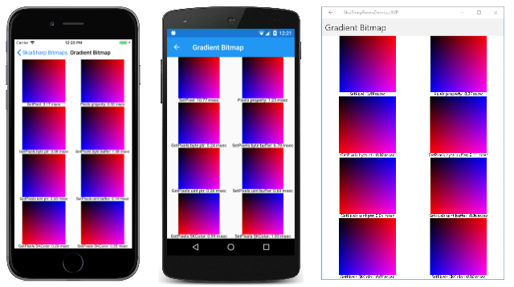

# Accessing SkiaSharp bitmap pixel bits

As you saw in the article [**Saving SkiaSharp bitmaps to files**](saving.md), bitmaps are generally stored in files in a compressed format, such as JPEG or PNG. In constrast, a SkiaSharp bitmap stored in memory is not compressed. It is stored as a sequential series of pixels. This uncompressed format facilitates the transfer of bitmaps to a display surface.

The memory block occupied by a SkiaSharp bitmap is organized in a very straightforward manner: It begins with the first row of pixels, from left to right, and then continues with the second row. For full-color bitmaps, each pixel consists of four bytes, which means that the total memory space required by the bitmap is four times the product of its width and height.

This article describes how an application can get access to those pixels, either directly by accessing the bitmap's pixel memory block, or indirectly. In some instances, a program might want to analyze the pixels of an image and construct a histogram of some sort. More commonly, applications can construct unique images by algorithmically creating the pixels that make up the bitmap:


## The techniques

SkiaSharp provides several techniques for accessing a bitmap's pixel bits. Which one you choose is usually a compromise between coding convenience (which is related to maintenance and ease of debugging) and performance. In most cases, you'll use one of the following methods and properties of `SKBitmap` for accessing the bitmap's pixels:

- The `GetPixel` and `SetPixel` methods allow you to obtain or set the color of a single pixel.
- The `Pixels` property obtains an array of pixel colors for the entire bitmap, or sets the array of colors.
- `GetPixels` returns the address of the pixel memory used by the bitmap.
- `SetPixels` replaces the address of the pixel memory used by the bitmap.

You can think of the first two techniques as "high level" and the second two as "low level." There are some other methods and properties that you can use, but these are the most valuable.

To allow you to see the performance differences between these techniques, the sample application contains a page named **Gradient Bitmap** that creates a bitmap with pixels that combine red and blue shades to create a gradient. The program creates eight different copies of this bitmap, all using different techniques for setting the bitmap pixels. Each of these eight bitmaps is created in a separate method that also sets a brief text description of the technique and calculates the time required to set all the pixels. Each method loops through the pixel-setting logic 100 times to get a better estimate of the performance.

### The SetPixel method

If you only need to set or get several individual pixels, the [`SetPixel`](xref:SkiaSharp.SKBitmap.SetPixel(System.Int32,System.Int32,SkiaSharp.SKColor)) and [`GetPixel`](xref:SkiaSharp.SKBitmap.GetPixel(System.Int32,System.Int32)) methods are ideal. For each of these two methods, you specify the integer column and row. Regardless of the pixel format, these two methods let you obtain or set the pixel as an `SKColor` value:

```csharp
bitmap.SetPixel(col, row, color);

SKColor color = bitmap.GetPixel(col, row);
```

The `col` argument must range from 0 to one less than the `Width` property of the bitmap, and `row` ranges from 0 to one less than the `Height` property.

Here's the method in **Gradient Bitmap** that sets the contents of a bitmap using the `SetPixel` method. The bitmap is 256 by 256 pixels, and the `for` loops are hard-coded with the range of values:

```csharp
public class GradientBitmapPage : ContentPage
{
    const int REPS = 100;

    Stopwatch stopwatch = new Stopwatch();
    ···
    SKBitmap FillBitmapSetPixel(out string description, out int milliseconds)
    {
        description = "SetPixel";
        SKBitmap bitmap = new SKBitmap(256, 256);

        stopwatch.Restart();

        for (int rep = 0; rep < REPS; rep++)
            for (int row = 0; row < 256; row++)
                for (int col = 0; col < 256; col++)
                {
                    bitmap.SetPixel(col, row, new SKColor((byte)col, 0, (byte)row));
                }

        milliseconds = (int)stopwatch.ElapsedMilliseconds;
        return bitmap;
    }
    ···
}
```

The color set for each pixel has a red component equal to the bitmap column, and a blue component equal to the row. The resultant bitmap is black at the upper-left, red at the upper-right, blue at the lower-left, and magenta at the lower-right, with gradients elsewhere.

The `SetPixel` method is called 65,536 times, and regardless how efficient this method might be, it's generally not a good idea to make that many API calls if an alternative is available. Fortunately, there are several alternatives.

### The Pixels property

`SKBitmap` defines a [`Pixels`](xref:SkiaSharp.SKBitmap.Pixels) property that returns an array of `SKColor` values for the entire bitmap. You can also use `Pixels` to set an array of color values for the bitmap:

```csharp
SKColor[] pixels = bitmap.Pixels;

bitmap.Pixels = pixels;
```

The pixels are arranged in the array starting with the first row, from left to right, then the second row, and so forth. The total number of colors in the array is equal to the product of the bitmap width and height.

Although this property appears to be efficient, keep in mind that the pixels are being copied from the bitmap into the array, and from the array back into the bitmap, and the pixels are converted from and to `SKColor` values.

Here's the method in the `GradientBitmapPage` class that sets the bitmap using the `Pixels` property. The method allocates an `SKColor` array of the required size, but it could have used the `Pixels` property to create that array:

```csharp
SKBitmap FillBitmapPixelsProp(out string description, out int milliseconds)
{
    description = "Pixels property";
    SKBitmap bitmap = new SKBitmap(256, 256);

    stopwatch.Restart();

    SKColor[] pixels = new SKColor[256 * 256];

    for (int rep = 0; rep < REPS; rep++)
        for (int row = 0; row < 256; row++)
            for (int col = 0; col < 256; col++)
            {
                pixels[256 * row + col] = new SKColor((byte)col, 0, (byte)row);
            }

    bitmap.Pixels = pixels;

    milliseconds = (int)stopwatch.ElapsedMilliseconds;
    return bitmap;
}
```

Notice that the index of the `pixels` array needs to be calculated from the `row` and `col` variables. The row is multiplied by the number of pixels in each row (256 in this case), and then the column is added.

`SKBitmap` also defines a similar `Bytes` property, which returns a byte array for the entire bitmap, but it is more cumbersome for full-color bitmaps.

### The GetPixels pointer

Potentially the most powerful technique to access the bitmap pixels is [`GetPixels`](xref:SkiaSharp.SKBitmap.GetPixels), not to be confused with the `GetPixel` method or the `Pixels` property. You'll immediately notice a difference with `GetPixels` in that it returns something not very common in C# programming:

```csharp
IntPtr pixelsAddr = bitmap.GetPixels();
```

The .NET [`IntPtr`](xref:System.IntPtr) type represents a pointer. It is called `IntPtr` because it is the length of an integer on the native processor of the machine on which the program is run, generally either 32 bits or 64 bits in length. The `IntPtr` that `GetPixels` returns is the address of the actual block of memory that the bitmap object is using to store its pixels.

You can convert the `IntPtr` into a C# pointer type using the [`ToPointer`](xref:System.IntPtr.ToPointer) method. The C# pointer syntax is the same as C and C++:

```csharp
byte* ptr = (byte*)pixelsAddr.ToPointer();
```

The `ptr` variable is of type _byte pointer_. This `ptr` variable allows you to access the individual bytes of memory that are used to store the bitmap's pixels. You use code like this to read a byte from this memory or write a byte to the memory:

```csharp
byte pixelComponent = *ptr;

*ptr = pixelComponent;
```

In this context, the asterisk is the C# _indirection operator_ and is used to reference the contents of the memory pointed to by `ptr`. Initially, `ptr` points to the first byte of the first pixel of the first row of the bitmap, but you can perform arithmetic on the `ptr` variable to move it to other locations within the bitmap.

One drawback is that you can use this `ptr` variable only in a code block marked with the `unsafe` keyword. In addition, the assembly must be flagged as allowing unsafe blocks. This is done in the project's properties.

Using pointers in C# is very powerful, but also very dangerous. You need to be careful that you don't access memory beyond what the pointer is supposed to reference. This is why pointer use is associated with the word "unsafe."

Here's the method in the `GradientBitmapPage` class that uses the `GetPixels` method. Notice the `unsafe` block that encompasses all the code using the byte pointer:

```csharp
SKBitmap FillBitmapBytePtr(out string description, out int milliseconds)
{
    description = "GetPixels byte ptr";
    SKBitmap bitmap = new SKBitmap(256, 256);

    stopwatch.Restart();

    IntPtr pixelsAddr = bitmap.GetPixels();

    unsafe
    {
        for (int rep = 0; rep < REPS; rep++)
        {
            byte* ptr = (byte*)pixelsAddr.ToPointer();

            for (int row = 0; row < 256; row++)
                for (int col = 0; col < 256; col++)
                {
                    *ptr++ = (byte)(col);   // red
                    *ptr++ = 0;             // green
                    *ptr++ = (byte)(row);   // blue
                    *ptr++ = 0xFF;          // alpha
                }
        }
    }

    milliseconds = (int)stopwatch.ElapsedMilliseconds;
    return bitmap;
}
```

When the `ptr` variable is first obtained from the `ToPointer` method, it points to the first byte of the leftmost pixel of the first row of the bitmap. The `for` loops for `row` and `col` are set up so that `ptr` can be incremented with the `++` operator after each byte of each pixel is set. For the other 99 loops through the pixels, the `ptr` must be set back to the beginning of the bitmap.

Each pixel is four bytes of memory, so each byte has to be set separately. The code here assumes that the bytes are in the order red, green, blue, and alpha, which is consistent with the `SKColorType.Rgba8888` color type. You might recall that this is the default color type for iOS and Android, but not for the Universal Windows Platform. By default, the UWP creates bitmaps with the `SKColorType.Bgra8888` color type. For this reason, expect to see some different results on that platform!

It's possible to cast the value returned from `ToPointer` to a `uint` pointer rather than a `byte` pointer. This allows an entire pixel to be accessed in one statement. Applying the `++` operator to that pointer increments it by four bytes to point to the next pixel:

```csharp
public class GradientBitmapPage : ContentPage
{
    ···
    SKBitmap FillBitmapUintPtr(out string description, out int milliseconds)
    {
        description = "GetPixels uint ptr";
        SKBitmap bitmap = new SKBitmap(256, 256);

        stopwatch.Restart();

        IntPtr pixelsAddr = bitmap.GetPixels();

        unsafe
        {
            for (int rep = 0; rep < REPS; rep++)
            {
                uint* ptr = (uint*)pixelsAddr.ToPointer();

                for (int row = 0; row < 256; row++)
                    for (int col = 0; col < 256; col++)
                    {
                        *ptr++ = MakePixel((byte)col, 0, (byte)row, 0xFF);
                    }
            }
        }

        milliseconds = (int)stopwatch.ElapsedMilliseconds;
        return bitmap;
    }
    ···
    [MethodImpl(MethodImplOptions.AggressiveInlining)]
    uint MakePixel(byte red, byte green, byte blue, byte alpha) =>
            (uint)((alpha << 24) | (blue << 16) | (green << 8) | red);
    ···
}
```

The pixel is set using the `MakePixel` method, which constructs an integer pixel from red, green, blue, and alpha components. Keep in mind that the `SKColorType.Rgba8888` format has a pixel byte ordering like this:

RR GG BB AA

But the integer corresponding to those bytes is:

AABBGGRR

The least significant byte of the integer is stored first in accordance with little-endian architecture. This `MakePixel` method will not work correctly for bitmaps with the `Bgra8888` color type.

The `MakePixel` method is flagged with the [`MethodImplOptions.AggressiveInlining`](xref:System.Runtime.CompilerServices.MethodImplOptions) option to encourage the compiler to avoid making this a separate method, but instead to compile the code where the method is called. This should improve performance.

Interestingly, the `SKColor` structure defines an explicit conversion from `SKColor` to an unsigned integer, which means that an `SKColor` value can be created, and a conversion to `uint` can be used instead of `MakePixel`:

```csharp
SKBitmap FillBitmapUintPtrColor(out string description, out int milliseconds)
{
    description = "GetPixels SKColor";
    SKBitmap bitmap = new SKBitmap(256, 256);

    stopwatch.Restart();

    IntPtr pixelsAddr = bitmap.GetPixels();

    unsafe
    {
        for (int rep = 0; rep < REPS; rep++)
        {
            uint* ptr = (uint*)pixelsAddr.ToPointer();

            for (int row = 0; row < 256; row++)
                for (int col = 0; col < 256; col++)
                {
                    *ptr++ = (uint)new SKColor((byte)col, 0, (byte)row);
                }
        }
    }

    milliseconds = (int)stopwatch.ElapsedMilliseconds;
    return bitmap;
}
```

The only question is this: Is the integer format of the `SKColor` value in the order of the `SKColorType.Rgba8888` color type, or the `SKColorType.Bgra8888` color type, or is it something else entirely? The answer to that question shall be revealed shortly.

### The SetPixels Method

`SKBitmap` also defines a method named [`SetPixels`](xref:SkiaSharp.SKBitmap.SetPixels(System.IntPtr)), which you call like this:

```csharp
bitmap.SetPixels(intPtr);
```

Recall that `GetPixels` obtains an `IntPtr` referencing the memory block used by the bitmap to store its pixels. The `SetPixels` call _replaces_ that memory block with the memory block referenced by the `IntPtr` specified as the `SetPixels` argument. The bitmap then frees up the memory block it was using previously. The next time `GetPixels` is called, it obtains the memory block set with `SetPixels`.

At first, it seems as if `SetPixels` gives you no more power and performance than `GetPixels` while being less convenient. With `GetPixels` you obtain the bitmap memory block and access it. With `SetPixels` you allocate and access some memory, and then set that as the bitmap memory block.

But using `SetPixels` offers a distinct syntactic advantage: It allows you to access the bitmap pixel bits using an array. Here's the method in `GradientBitmapPage` that demonstrates this technique. The method first defines a multi-dimensional byte array corresponding to the bytes of the bitmap's pixels. The first dimension is the row, the second dimension is the column, and the third dimension corresonds to the four components of each pixel:

```csharp
SKBitmap FillBitmapByteBuffer(out string description, out int milliseconds)
{
    description = "SetPixels byte buffer";
    SKBitmap bitmap = new SKBitmap(256, 256);

    stopwatch.Restart();

    byte[,,] buffer = new byte[256, 256, 4];

    for (int rep = 0; rep < REPS; rep++)
        for (int row = 0; row < 256; row++)
            for (int col = 0; col < 256; col++)
            {
                buffer[row, col, 0] = (byte)col;   // red
                buffer[row, col, 1] = 0;           // green
                buffer[row, col, 2] = (byte)row;   // blue
                buffer[row, col, 3] = 0xFF;        // alpha
            }

    unsafe
    {
        fixed (byte* ptr = buffer)
        {
            bitmap.SetPixels((IntPtr)ptr);
        }
    }

    milliseconds = (int)stopwatch.ElapsedMilliseconds;
    return bitmap;
}
```

Then, after the array has been filled with pixels, an `unsafe` block and a `fixed` statement is used to obtain a byte pointer that points to this array. That byte pointer can then be cast to an `IntPtr` to pass to `SetPixels`.

The array that you create doesn't have to be a byte array. It can be an integer array with only two dimensions for the row and column:

```csharp
SKBitmap FillBitmapUintBuffer(out string description, out int milliseconds)
{
    description = "SetPixels uint buffer";
    SKBitmap bitmap = new SKBitmap(256, 256);

    stopwatch.Restart();

    uint[,] buffer = new uint[256, 256];

    for (int rep = 0; rep < REPS; rep++)
        for (int row = 0; row < 256; row++)
            for (int col = 0; col < 256; col++)
            {
                buffer[row, col] = MakePixel((byte)col, 0, (byte)row, 0xFF);
            }

    unsafe
    {
        fixed (uint* ptr = buffer)
        {
            bitmap.SetPixels((IntPtr)ptr);
        }
    }

    milliseconds = (int)stopwatch.ElapsedMilliseconds;
    return bitmap;
}
```

The `MakePixel` method is again used to combine the color components into a 32-bit pixel.

Just for completeness, here's the same code but with an `SKColor` value cast to an unsigned integer:

```csharp
SKBitmap FillBitmapUintBufferColor(out string description, out int milliseconds)
{
    description = "SetPixels SKColor";
    SKBitmap bitmap = new SKBitmap(256, 256);

    stopwatch.Restart();

    uint[,] buffer = new uint[256, 256];

    for (int rep = 0; rep < REPS; rep++)
        for (int row = 0; row < 256; row++)
            for (int col = 0; col < 256; col++)
            {
                buffer[row, col] = (uint)new SKColor((byte)col, 0, (byte)row);
            }

    unsafe
    {
        fixed (uint* ptr = buffer)
        {
            bitmap.SetPixels((IntPtr)ptr);
        }
    }

    milliseconds = (int)stopwatch.ElapsedMilliseconds;
    return bitmap;
}
```

### Comparing the techniques

The constructor of the **Gradient Color** page calls all eight of the methods shown above, and saves the results:

```csharp
public class GradientBitmapPage : ContentPage
{
    ···
    string[] descriptions = new string[8];
    SKBitmap[] bitmaps = new SKBitmap[8];
    int[] elapsedTimes = new int[8];

    SKCanvasView canvasView;

    public GradientBitmapPage ()
    {
        Title = "Gradient Bitmap";

        bitmaps[0] = FillBitmapSetPixel(out descriptions[0], out elapsedTimes[0]);
        bitmaps[1] = FillBitmapPixelsProp(out descriptions[1], out elapsedTimes[1]);
        bitmaps[2] = FillBitmapBytePtr(out descriptions[2], out elapsedTimes[2]);
        bitmaps[4] = FillBitmapUintPtr(out descriptions[4], out elapsedTimes[4]);
        bitmaps[6] = FillBitmapUintPtrColor(out descriptions[6], out elapsedTimes[6]);
        bitmaps[3] = FillBitmapByteBuffer(out descriptions[3], out elapsedTimes[3]);
        bitmaps[5] = FillBitmapUintBuffer(out descriptions[5], out elapsedTimes[5]);
        bitmaps[7] = FillBitmapUintBufferColor(out descriptions[7], out elapsedTimes[7]);

        canvasView = new SKCanvasView();
        canvasView.PaintSurface += OnCanvasViewPaintSurface;
        Content = canvasView;
    }
    ···
}
```

The constructor concludes by creating an `SKCanvasView` to display the resultant bitmaps. The `PaintSurface` handler divides its surface into eight rectangles and calls `Display` to display each one:

```csharp
public class GradientBitmapPage : ContentPage
{
    ···
    void OnCanvasViewPaintSurface(object sender, SKPaintSurfaceEventArgs args)
    {
        SKImageInfo info = args.Info;
        SKSurface surface = args.Surface;
        SKCanvas canvas = surface.Canvas;

        int width = info.Width;
        int height = info.Height;

        canvas.Clear();

        Display(canvas, 0, new SKRect(0, 0, width / 2, height / 4));
        Display(canvas, 1, new SKRect(width / 2, 0, width, height / 4));
        Display(canvas, 2, new SKRect(0, height / 4, width / 2, 2 * height / 4));
        Display(canvas, 3, new SKRect(width / 2, height / 4, width, 2 * height / 4));
        Display(canvas, 4, new SKRect(0, 2 * height / 4, width / 2, 3 * height / 4));
        Display(canvas, 5, new SKRect(width / 2, 2 * height / 4, width, 3 * height / 4));
        Display(canvas, 6, new SKRect(0, 3 * height / 4, width / 2, height));
        Display(canvas, 7, new SKRect(width / 2, 3 * height / 4, width, height));
    }

    void Display(SKCanvas canvas, int index, SKRect rect)
    {
        string text = String.Format("{0}: {1:F1} msec", descriptions[index],
                                    (double)elapsedTimes[index] / REPS);

        SKRect bounds = new SKRect();

        using (SKPaint textPaint = new SKPaint())
        {
            textPaint.TextSize = (float)(12 * canvasView.CanvasSize.Width / canvasView.Width);
            textPaint.TextAlign = SKTextAlign.Center;
            textPaint.MeasureText("Tly", ref bounds);

            canvas.DrawText(text, new SKPoint(rect.MidX, rect.Bottom - bounds.Bottom), textPaint);
            rect.Bottom -= bounds.Height;
            canvas.DrawBitmap(bitmaps[index], rect, BitmapStretch.Uniform);
        }
    }
}
```

To allow the compiler to optimize the code, this page was run in **Release** mode. Here's that page running on an iPhone 8 simulator on a MacBook Pro, a Nexus 5 Android phone, and Surface Pro 3 running Windows 10. Because of the hardware differences, avoid comparing the performance times between the devices, but instead look at the relative times on each device:

[](pixel-bits-images/GradientBitmap-Large.png#lightbox)

Here is a table that consolidates the execution times in milliseconds:

| API       | Data type | iOS  | Android | UWP  |
| --------- | --------- | ----:| -------:| ----:|
| SetPixel  |           | 3.17 |   10.77 | 3.49 |
| Pixels    |           | 0.32 |    1.23 | 0.07 |
| GetPixels | byte      | 0.09 |    0.24 | 0.10 |
|           | uint      | 0.06 |    0.26 | 0.05 |
|           | SKColor   | 0.29 |    0.99 | 0.07 |
| SetPixels | byte      | 1.33 |    6.78 | 0.11 |
|           | uint      | 0.14 |    0.69 | 0.06 |
|           | SKColor   | 0.35 |    1.93 | 0.10 |

As expected, calling `SetPixel` 65,536 times is the least effeicient way to set a bitmap's pixels. Filling an `SKColor` array and setting the `Pixels` property is much better, and even compares favorably with some of the `GetPixels` and `SetPixels` techniques. Working with `uint` pixel values is generally faster than setting separate `byte` components, and converting the `SKColor` value to an unsigned integer adds some overhead to the process.

It's also interesting to compare the various gradients: The top rows of each platform are the same, and show the gradient as it was intended. This means that the `SetPixel` method and the `Pixels` property correctly create pixels from colors regardless of the underlying pixel format.

The next two rows of the iOS and Android screenshots are also the same, which confirms that the little `MakePixel` method is correctly defined for the default `Rgba8888` pixel format for these platforms.

The bottom row of the iOS and Android screenshots is backwards, which indicates that the unsigned integer obtained by casting an `SKColor` value is in the form:

AARRGGBB

The bytes are in the order:

BB GG RR AA

This is the `Bgra8888` ordering rather than the `Rgba8888` ordering. The `Brga8888` format is the default for the Universal Windows platform, which is why the gradients on the last row of that screenshot are the same as the first row. But the middle two rows are incorrect because the code creating those bitmaps assumed an `Rgba8888` ordering.

If you want to use the same code for accessing pixel bits on each platform, you can explicitly create an `SKBitmap` using either the `Rgba8888` or `Bgra8888` format. If you want to cast `SKColor` values to bitmap pixels, use `Bgra8888`.

## Random access of pixels

The `FillBitmapBytePtr` and `FillBitmapUintPtr` methods in the **Gradient Bitmap** page benefited from `for` loops designed to fill the bitmap sequentially, from top row to bottom row, and in each row from left to right. The pixel could be set with the same statement that incremented the pointer.

Sometimes it's necessary to access the pixels randomly rather than sequentially. If you're using the `GetPixels` approach, you'll need to calculate pointers based on the row and column. This is demonstrated in the **Rainbow Sine** page, which creates a bitmap showing a rainbow in the form of one cycle of a sine curve.

The colors of the rainbow are easiest to create using the HSL (hue, saturation, luminosity) color model. The `SKColor.FromHsl` method creates an `SKColor` value using hue values that range from 0 to 360 (like the angles of a circle but going from red, through green and blue, and back to red), and saturation and luminosity values ranging from 0 to 100. For the colors of a rainbow, the saturation should be set to a maximum of 100, and the luminosity to a midpoint of 50.

**Rainbow Sine** creates this image by looping through the rows of the bitmap, and then looping through 360 hue values. From each hue value, it calculates a bitmap column that is also based on a sine value:

```csharp
public class RainbowSinePage : ContentPage
{
    SKBitmap bitmap;

    public RainbowSinePage()
    {
        Title = "Rainbow Sine";

        bitmap = new SKBitmap(360 * 3, 1024, SKColorType.Bgra8888, SKAlphaType.Unpremul);

        unsafe
        {
            // Pointer to first pixel of bitmap
            uint* basePtr = (uint*)bitmap.GetPixels().ToPointer();

            // Loop through the rows
            for (int row = 0; row < bitmap.Height; row++)
            {
                // Calculate the sine curve angle and the sine value
                double angle = 2 * Math.PI * row / bitmap.Height;
                double sine = Math.Sin(angle);

                // Loop through the hues
                for (int hue = 0; hue < 360; hue++)
                {
                    // Calculate the column
                    int col = (int)(360 + 360 * sine + hue);

                    // Calculate the address
                    uint* ptr = basePtr + bitmap.Width * row + col;

                    // Store the color value
                    *ptr = (uint)SKColor.FromHsl(hue, 100, 50);
                }
            }
        }

        // Create the SKCanvasView
        SKCanvasView canvasView = new SKCanvasView();
        canvasView.PaintSurface += OnCanvasViewPaintSurface;
        Content = canvasView;
    }

    void OnCanvasViewPaintSurface(object sender, SKPaintSurfaceEventArgs args)
    {
        SKImageInfo info = args.Info;
        SKSurface surface = args.Surface;
        SKCanvas canvas = surface.Canvas;

        canvas.Clear();
        canvas.DrawBitmap(bitmap, info.Rect);
    }
}
```

Notice that the constructor creates the bitmap based on the `SKColorType.Bgra8888` format:

```csharp
bitmap = new SKBitmap(360 * 3, 1024, SKColorType.Bgra8888, SKAlphaType.Unpremul);
```

This allows the program to use the conversion of `SKColor` values into `uint` pixels without worry. Although it doesn't play a role in this particular program, whenever you use the `SKColor` conversion to set pixels, you should also specify `SKAlphaType.Unpremul` because `SKColor` doesn't premultiply its color components by the alpha value.

The constructor then uses the `GetPixels` method to obtain a pointer to the first pixel of the bitmap:

```csharp
uint* basePtr = (uint*)bitmap.GetPixels().ToPointer();
```

For any particular row and column, an offset value must be added to `basePtr`. This offset is the row times the bitmap width, plus the column:

```csharp
uint* ptr = basePtr + bitmap.Width * row + col;
```

The `SKColor` value is stored in memory using this pointer:

```csharp
*ptr = (uint)SKColor.FromHsl(hue, 100, 50);
```

In the `PaintSurface` handler of the `SKCanvasView`, the bitmap is stretched to fill the display area:

[](pixel-bits-images/RainbowSine-Large.png#lightbox)

## From one bitmap to another

Very many image-processing tasks involve modifying pixels as they are transferred from one bitmap to another. This technique is demonstrated in the **Color Adjustment** page. The page loads one of the bitmap resources and then allows you to modify the image using three `Slider` views:

[](pixel-bits-images/ColorAdjustment-Large.png#lightbox)

For each pixel color, the first `Slider` adds a value from 0 to 360 to the hue, but then uses the modulo operator to keep the result between 0 and 360, effectively shifting the colors along the spectrum (as the UWP screenshot demonstrates). The second `Slider` lets you select a multiplicative factor between 0.5 and 2 to apply to the saturation, and the third `Slider` does the same for the luminosity, as demonstrated in the Android screenshot.

The program maintains two bitmaps, the original source bitmap named `srcBitmap` and the adjusted destination bitmap named `dstBitmap`. Each time a `Slider` is moved, the program calculates all new pixels in `dstBitmap`. Of course, users will experiment by moving the `Slider` views very quickly, so you want the best performance you can manage. This involves the `GetPixels` method for both the source and destination bitmaps.

The **Color Adjustment** page doesn't control the color format of the source and destination bitmaps. Instead, it contains slightly different logic for `SKColorType.Rgba8888` and `SKColorType.Bgra8888` formats. The source and destination can be different formats, and the program will still work.

Here's the program except for the crucial `TransferPixels` method that transfers the pixels form the source to the destination. The constructor sets `dstBitmap` equal to `srcBitmap`. The `PaintSurface` handler displays `dstBitmap`:

```csharp
public partial class ColorAdjustmentPage : ContentPage
{
    SKBitmap srcBitmap =
        BitmapExtensions.LoadBitmapResource(typeof(FillRectanglePage),
                                            "SkiaSharpFormsDemos.Media.Banana.jpg");
    SKBitmap dstBitmap;

    public ColorAdjustmentPage()
    {
        InitializeComponent();

        dstBitmap = new SKBitmap(srcBitmap.Width, srcBitmap.Height);
        OnSliderValueChanged(null, null);
    }

    void OnSliderValueChanged(object sender, ValueChangedEventArgs args)
    {
        float hueAdjust = (float)hueSlider.Value;
        hueLabel.Text = $"Hue Adjustment: {hueAdjust:F0}";

        float saturationAdjust = (float)Math.Pow(2, saturationSlider.Value);
        saturationLabel.Text = $"Saturation Adjustment: {saturationAdjust:F2}";

        float luminosityAdjust = (float)Math.Pow(2, luminositySlider.Value);
        luminosityLabel.Text = $"Luminosity Adjustment: {luminosityAdjust:F2}";

        TransferPixels(hueAdjust, saturationAdjust, luminosityAdjust);
        canvasView.InvalidateSurface();
    }
    ···
    void OnCanvasViewPaintSurface(object sender, SKPaintSurfaceEventArgs args)
    {
        SKImageInfo info = args.Info;
        SKSurface surface = args.Surface;
        SKCanvas canvas = surface.Canvas;

        canvas.Clear();
        canvas.DrawBitmap(dstBitmap, info.Rect, BitmapStretch.Uniform);
    }
}
```

The `ValueChanged` handler for the `Slider` views calculates the adjustment values and calls `TransferPixels`.

The entire `TransferPixels` method is marked as `unsafe`. It begins by obtaining byte pointers to the pixel bits of both bitmaps, and then loops through all the rows and columns. From the source bitmap, the method obtains four bytes for each pixel. These could be in either the `Rgba8888` or `Bgra8888` order. Checking for the color type allows an `SKColor` value to be created. The HSL components are then extracted, adjusted, and used to recreate the `SKColor` value. Depending on whether the destination bitmap is `Rgba8888` or `Bgra8888`, the bytes are stored in the destination bitmp:

```csharp
public partial class ColorAdjustmentPage : ContentPage
{
    ···
    unsafe void TransferPixels(float hueAdjust, float saturationAdjust, float luminosityAdjust)
    {
        byte* srcPtr = (byte*)srcBitmap.GetPixels().ToPointer();
        byte* dstPtr = (byte*)dstBitmap.GetPixels().ToPointer();

        int width = srcBitmap.Width;       // same for both bitmaps
        int height = srcBitmap.Height;

        SKColorType typeOrg = srcBitmap.ColorType;
        SKColorType typeAdj = dstBitmap.ColorType;

        for (int row = 0; row < height; row++)
        {
            for (int col = 0; col < width; col++)
            {
                // Get color from original bitmap
                byte byte1 = *srcPtr++;         // red or blue
                byte byte2 = *srcPtr++;         // green
                byte byte3 = *srcPtr++;         // blue or red
                byte byte4 = *srcPtr++;         // alpha

                SKColor color = new SKColor();

                if (typeOrg == SKColorType.Rgba8888)
                {
                    color = new SKColor(byte1, byte2, byte3, byte4);
                }
                else if (typeOrg == SKColorType.Bgra8888)
                {
                    color = new SKColor(byte3, byte2, byte1, byte4);
                }

                // Get HSL components
                color.ToHsl(out float hue, out float saturation, out float luminosity);

                // Adjust HSL components based on adjustments
                hue = (hue + hueAdjust) % 360;
                saturation = Math.Max(0, Math.Min(100, saturationAdjust * saturation));
                luminosity = Math.Max(0, Math.Min(100, luminosityAdjust * luminosity));

                // Recreate color from HSL components
                color = SKColor.FromHsl(hue, saturation, luminosity);

                // Store the bytes in the adjusted bitmap
                if (typeAdj == SKColorType.Rgba8888)
                {
                    *dstPtr++ = color.Red;
                    *dstPtr++ = color.Green;
                    *dstPtr++ = color.Blue;
                    *dstPtr++ = color.Alpha;
                }
                else if (typeAdj == SKColorType.Bgra8888)
                {
                    *dstPtr++ = color.Blue;
                    *dstPtr++ = color.Green;
                    *dstPtr++ = color.Red;
                    *dstPtr++ = color.Alpha;
                }
            }
        }
    }
    ···
}
```

It's likely that the performance of this method could be improved even more by creating separate methods for the various combinations of color types of the source and destination bitmaps, and avoid checking the type for every pixel. Another option is to have multiple `for` loops for the `col` variable based on the color type.

## Posterization

Another common job that involves accessing pixel bits is _posterization_. The number if colors encoded in a bitmap's pixels is reduced so that the result resembles a hand-drawn poster using a limited color palette.

The **Posterize** page performs this process on one of the monkey images:

```csharp
public class PosterizePage : ContentPage
{
    SKBitmap bitmap =
        BitmapExtensions.LoadBitmapResource(typeof(FillRectanglePage),
                                            "SkiaSharpFormsDemos.Media.Banana.jpg");
    public PosterizePage()
    {
        Title = "Posterize";

        unsafe
        {
            uint* ptr = (uint*)bitmap.GetPixels().ToPointer();
            int pixelCount = bitmap.Width * bitmap.Height;

            for (int i = 0; i < pixelCount; i++)
            {
                *ptr++ &= 0xE0E0E0FF;
            }
        }

        SKCanvasView canvasView = new SKCanvasView();
        canvasView.PaintSurface += OnCanvasViewPaintSurface;
        Content = canvasView;
    }

    void OnCanvasViewPaintSurface(object sender, SKPaintSurfaceEventArgs args)
    {
        SKImageInfo info = args.Info;
        SKSurface surface = args.Surface;
        SKCanvas canvas = surface.Canvas;

        canvas.Clear();
        canvas.DrawBitmap(bitmap, info.Rect, BitmapStretch.Uniform;
    }
}
```

The code in the constructor accesses each pixel, performs a bitwise AND operation with the value 0xE0E0E0FF, and then stores the result back in the bitmap. The values 0xE0E0E0FF keeps the high 3 bits of each color component and sets the lower 5 bits to 0. Rather than 2<sup>24</sup> or 16,777,216 colors, the bitmap is reduced to 2<sup>9</sup> or 512 colors:

[](pixel-bits-images/Posterize-Large.png#lightbox)

## Related links

- [SkiaSharp APIs](/dotnet/api/skiasharp)
