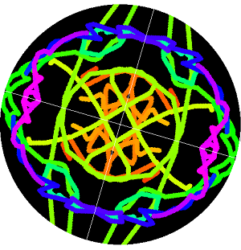
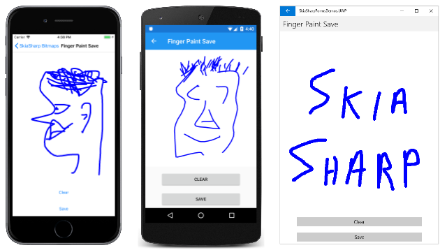
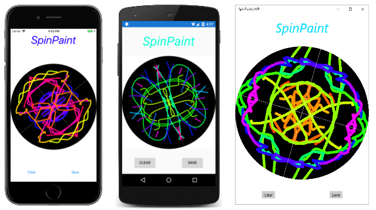

# Saving SkiaSharp bitmaps to files

After a SkiaSharp application has created or modified a bitmap, the application might want to save the bitmap to the user's photo library:



This task encompasses two steps:

- Converting the SkiaSharp bitmap to data in a particular file format, such as JPEG or PNG.
- Saving the result to the photo library using platform-specific code.

## File formats and codecs

Most of today's popular bitmap file formats use compression to reduce storage space. The two broad categories of compression techniques are called _lossy_ and _lossless_. These terms indicate whether or not the compression algorithm results in the loss of data.

The most popular lossy format was developed by the Joint Photographic Experts Group and is called JPEG. The JPEG compression algorithm analyzes the image using a mathematical tool called the _discrete cosine transform_, and attempts to remove data that is not crucial to preserving the image's visual fidelity. The degree of compression can be controlled with a setting generally referred to as _quality_. Higher quality settings result in larger files.

In contrast, a lossless compression algorithm analyzes the image for repetition and patterns of pixels that can be encoded in a way that reduces the data but does not result in the loss of any information. The original bitmap data can be restored entirely from the compressed file. The primary lossless compressed file format in use today is Portable Network Graphics (PNG).

Generally, JPEG is used for photographs, while PNG is used for images that have been manually or algorithmically generated. Any lossless compression algorithm that reduces the size of some files must necessarily increase the size of others. Fortunately, this increase in size generally only occurs for data that contains a lot of random (or seemingly random) information.

The compression algorithms are complex enough to warrant two terms that describe the compression and decompression processes:

- _decode_ &mdash; read a bitmap file format and decompress it
- _encode_ &mdash; compress the bitmap and write to a bitmap file format

The [`SKBitmap`](xref:SkiaSharp.SKBitmap) class contains several methods named `Decode` that create an `SKBitmap` from a compressed source. All that's required is to supply a filename, stream, or array of bytes. The decoder can determine the file format and hand it off to the proper internal decoding function.

In addition, the [`SKCodec`](xref:SkiaSharp.SKCodec) class has two methods named `Create` that can create an `SKCodec` object from a compressed source and allow an application to get more involved in the decoding process. (The `SKCodec` class is shown in the article [**Animating SkiaSharp Bitmaps**](animating.md#gif-animation) in connection with decoding an animated GIF file.)

When encoding a bitmap, more information is required: The encoder must know the particular file format the application wants to use (JPEG or PNG or something else). If a lossy format is desired, the encode must also know the desired level of quality.

The `SKBitmap` class defines one [`Encode`](xref:SkiaSharp.SKBitmap.Encode(SkiaSharp.SKWStream,SkiaSharp.SKEncodedImageFormat,System.Int32)) method with the following syntax:

```csharp
public Boolean Encode (SKWStream dst, SKEncodedImageFormat format, Int32 quality)
```

This method is described in more detail shortly. The encoded bitmap is written to a writable stream. (The 'W' in `SKWStream` stands for "writable".) The second and third arguments specify the file format and (for lossy formats) the desired quality ranging from 0 to 100.

In addition, the [`SKImage`](xref:SkiaSharp.SKImage) and [`SKPixmap`](xref:SkiaSharp.SKPixmap) classes also define `Encode` methods that are somewhat more versatile, and which you might prefer. You can easily create an `SKImage` object from an `SKBitmap` object using the static [`SKImage.FromBitmap`](xref:SkiaSharp.SKImage.FromBitmap(SkiaSharp.SKBitmap)) method. You can obtain an `SKPixmap` object from an `SKBitmap` object using the [`PeekPixels`](xref:SkiaSharp.SKBitmap.PeekPixels) method.

One of the [`Encode`](xref:SkiaSharp.SKImage.Encode) methods defined by `SKImage` has no parameters and automatically saves to a PNG format. That parameterless method is very easy to use.

## Saving bitmap files with Community Toolkit

When you encode an `SKBitmap` object into a particular file format, generally you'll be left with a stream object of some sort, or an array of data. Some of the `Encode` methods (including the one with no parameters defined by `SKImage`) return an [`SKData`](xref:SkiaSharp.SKData) object, which can be converted to an array of bytes using the [`ToArray`](xref:SkiaSharp.SKData.ToArray) method. This data must then be saved to a file.

Saving to a file in application local storage is quite easy because you can use standard `System.IO` classes and methods for this task. This technique is demonstrated in the article [**Animating SkiaSharp Bitmaps**](animating.md#bitmap-animation) in connection with animating a series of bitmaps of the Mandelbrot set.

If you want to let the user save a file to a location of their choice, .NET MAUI provides a cross-platform solution through the [Community Toolkit FileSaver](https://learn.microsoft.com/dotnet/communitytoolkit/maui/essentials/file-saver). This eliminates the need for platform-specific code.

### Setting up the Community Toolkit

First, add the Community Toolkit NuGet package to your project:

```xml
<PackageReference Include="CommunityToolkit.Maui" Version="13.0.0" />
```

Then register it in your `MauiProgram.cs`:

```csharp
using CommunityToolkit.Maui;

public static MauiApp CreateMauiApp()
{
    var builder = MauiApp.CreateBuilder();
    builder
        .UseMauiApp<App>()
        .UseMauiCommunityToolkit()
        // ... other configuration
    return builder.Build();
}
```

### Using FileSaver to save images

The `FileSaver` opens a native file picker dialog that lets the user choose where to save the file. Here's how to save an encoded bitmap:

```csharp
using CommunityToolkit.Maui.Storage;

// Encode the bitmap
using SKImage image = SKImage.FromBitmap(bitmap);
SKData data = image.Encode(SKEncodedImageFormat.Png, 100);

// Save using FileSaver (opens a file picker dialog)
using var stream = new MemoryStream(data.ToArray());
var result = await FileSaver.Default.SaveAsync("MyImage.png", stream, CancellationToken.None);

if (result.IsSuccessful)
{
    // File was saved to: result.FilePath
}
else
{
    // Handle the error: result.Exception
}
```

This approach offers several advantages over the old platform-specific approach:
- **Cross-platform**: Works on Android, iOS, macOS, and Windows with no platform-specific code
- **User control**: The user chooses where to save the file
- **Testable**: The `IFileSaver` interface can be mocked for unit testing

## Exploring the image formats

Here's the [`Encode`](xref:SkiaSharp.SKBitmap.Encode(SkiaSharp.SKWStream,SkiaSharp.SKEncodedImageFormat,System.Int32)) method of `SKImage` again:

```csharp
public Boolean Encode (SKWStream dst, SKEncodedImageFormat format, Int32 quality)
```

[`SKEncodedImageFormat`](xref:SkiaSharp.SKEncodedImageFormat) is an enumeration with members that refer to eleven bitmap file formats, some of which are rather obscure:

- `Astc` &mdash; Adaptive Scalable Texture Compression
- `Bmp` &mdash; Windows Bitmap
- `Dng` &mdash; Adobe Digital Negative
- `Gif` &mdash; Graphics Interchange Format
- `Ico` &mdash; Windows icon images
- `Jpeg` &mdash; Joint Photographic Experts Group
- `Ktx` &mdash; Khronos texture format for OpenGL
- `Pkm` &mdash; Custom format for GrafX2
- `Png` &mdash; Portable Network Graphics
- `Wbmp` &mdash; Wireless Application Protocol Bitmap Format (1 bit per pixel)
- `Webp` &mdash; Google WebP format

As you'll see shortly, only three of these file formats (`Jpeg`, `Png`, and `Webp`) are actually supported by SkiaSharp.

To save an `SKBitmap` object named `bitmap` to a user-selected location, you need a member of the `SKEncodedImageFormat` enumeration named `imageFormat` and (for lossy formats) an integer `quality` variable. You can use the following code to encode the bitmap and let the user choose where to save it:

```csharp
using CommunityToolkit.Maui.Storage;

using (MemoryStream memStream = new MemoryStream())
using (SKManagedWStream wstream = new SKManagedWStream(memStream))
{
    bitmap.Encode(wstream, imageFormat, quality);
    byte[] data = memStream.ToArray();

    // Check the data array for content!
    if (data != null && data.Length > 0)
    {
        using var stream = new MemoryStream(data);
        var result = await FileSaver.Default.SaveAsync(filename, stream, CancellationToken.None);
        
        if (!result.IsSuccessful)
        {
            // Handle the error
        }
    }
}
```

The `SKManagedWStream` class derives from `SKWStream` (which stands for "writable stream"). The `Encode` method writes the encoded bitmap file into that stream.

The **Save File Formats** page in the sample application uses similar code to allow you to experiment with saving a bitmap in the various formats.

The XAML file contains an `SKCanvasView` that displays a bitmap, while the rest of the page contains everything the application needs to call the `Encode` method of `SKBitmap`. It has a `Picker` for a member of the `SKEncodedImageFormat` enumeration, a `Slider` for the quality argument for lossy bitmap formats, an `Entry` view for a filename, and a `Button` for saving the file.

```xaml
<ContentPage xmlns="http://schemas.microsoft.com/dotnet/2021/maui"
             xmlns:x="http://schemas.microsoft.com/winfx/2009/xaml"
             xmlns:skia="clr-namespace:SkiaSharp;assembly=SkiaSharp"
             xmlns:skiaforms="clr-namespace:SkiaSharp.Views.Maui.Controls;assembly=SkiaSharp.Views.Maui.Controls"
             x:Class="DocsSamplesApp.Bitmaps.SaveFileFormatsPage"
             Title="Save File Formats">

    <Grid RowDefinitions="*,Auto,Auto,Auto,Auto,Auto,Auto" Margin="10">
        <skiaforms:SKCanvasView x:Name="canvasView"
                                PaintSurface="OnCanvasViewPaintSurface" />

        <Picker Grid.Row="1"
                x:Name="formatPicker"
                Title="image format"
                SelectedIndexChanged="OnFormatPickerChanged">
            <Picker.ItemsSource>
                <x:Array Type="{x:Type skia:SKEncodedImageFormat}">
                    <x:Static Member="skia:SKEncodedImageFormat.Astc" />
                    <x:Static Member="skia:SKEncodedImageFormat.Bmp" />
                    <x:Static Member="skia:SKEncodedImageFormat.Dng" />
                    <x:Static Member="skia:SKEncodedImageFormat.Gif" />
                    <x:Static Member="skia:SKEncodedImageFormat.Ico" />
                    <x:Static Member="skia:SKEncodedImageFormat.Jpeg" />
                    <x:Static Member="skia:SKEncodedImageFormat.Ktx" />
                    <x:Static Member="skia:SKEncodedImageFormat.Pkm" />
                    <x:Static Member="skia:SKEncodedImageFormat.Png" />
                    <x:Static Member="skia:SKEncodedImageFormat.Wbmp" />
                    <x:Static Member="skia:SKEncodedImageFormat.Webp" />
                </x:Array>
            </Picker.ItemsSource>
        </Picker>

        <Slider Grid.Row="2"
                x:Name="qualitySlider"
                Maximum="100"
                Value="50" />

        <Label Grid.Row="3"
               Text="{Binding Source={x:Reference qualitySlider},
                              Path=Value,
                              StringFormat='Quality = {0:F0}'}"
               HorizontalTextAlignment="Center" />

        <Grid Grid.Row="4" ColumnDefinitions="Auto,*">
            <Label Text="File Name: "
                   VerticalOptions="Center" />

            <Entry Grid.Column="1"
                   x:Name="fileNameEntry"
                   Text="Sample.xxx" />
        </Grid>

        <Button Grid.Row="5"
                Text="Save" 
                Clicked="OnButtonClicked">
            <Button.Triggers>
                <DataTrigger TargetType="Button"
                             Binding="{Binding Source={x:Reference formatPicker},
                                               Path=SelectedIndex}"
                             Value="-1">
                    <Setter Property="IsEnabled" Value="False" />
                </DataTrigger>

                <DataTrigger TargetType="Button"
                             Binding="{Binding Source={x:Reference fileNameEntry},
                                               Path=Text.Length}"
                             Value="0">
                    <Setter Property="IsEnabled" Value="False" />
                </DataTrigger>
            </Button.Triggers>
        </Button>

        <Label Grid.Row="6"
               x:Name="statusLabel"
               Text="OK"
               Margin="10, 0" />
    </Grid>
</ContentPage>
```

The code-behind file loads a bitmap resource and uses the `SKCanvasView` to display it. That bitmap never changes. The `SelectedIndexChanged` handler for the `Picker` modifies the filename with an extension that is the same as the enumeration member:

```csharp
using CommunityToolkit.Maui.Storage;

public partial class SaveFileFormatsPage : ContentPage
{
    SKBitmap? bitmap;

    public SaveFileFormatsPage ()
    {
        InitializeComponent ();
        _ = LoadBitmapAsync();
    }

    async Task LoadBitmapAsync()
    {
        using Stream stream = await FileSystem.OpenAppPackageFileAsync("MonkeyFace.png");
        bitmap = SKBitmap.Decode(stream);
        canvasView.InvalidateSurface();
    }

    void OnCanvasViewPaintSurface(object? sender, SKPaintSurfaceEventArgs args)
    {
        if (bitmap is null)
            return;
        args.Surface.Canvas.DrawBitmap(bitmap, args.Info.Rect, BitmapStretch.Uniform);
    }

    void OnFormatPickerChanged(object? sender, EventArgs args)
    {
        if (formatPicker.SelectedIndex != -1)
        {
            SKEncodedImageFormat imageFormat = (SKEncodedImageFormat)formatPicker.SelectedItem;
            fileNameEntry.Text = Path.ChangeExtension(fileNameEntry.Text, imageFormat.ToString());
            statusLabel.Text = "OK";
        }
    }

    async void OnButtonClicked(object? sender, EventArgs args)
    {
        if (bitmap is null)
            return;
        SKEncodedImageFormat imageFormat = (SKEncodedImageFormat)formatPicker.SelectedItem;
        int quality = (int)qualitySlider.Value;

        using (MemoryStream memStream = new MemoryStream())
        using (SKManagedWStream wstream = new SKManagedWStream(memStream))
        {
            bitmap.Encode(wstream, imageFormat, quality);
            byte[] data = memStream.ToArray();

            if (data == null)
            {
                statusLabel.Text = "Encode returned null";
            }
            else if (data.Length == 0)
            {
                statusLabel.Text = "Encode returned empty array";
            }
            else
            {
                using var stream = new MemoryStream(data);
                var result = await FileSaver.Default.SaveAsync(fileNameEntry.Text, stream, CancellationToken.None);

                if (!result.IsSuccessful)
                {
                    statusLabel.Text = "Save failed: " + result.Exception?.Message;
                }
                else
                {
                    statusLabel.Text = "Success! Saved to: " + result.FilePath;
                }
            }
        }
    }
}
```

The `Clicked` handler for the `Button` does all the real work. It obtains two arguments for `Encode` from the `Picker` and `Slider`, and then uses the code shown earlier to create an `SKManagedWStream` for the `Encode` method. The `FileSaver` from the Community Toolkit opens a native file picker dialog so the user can choose where to save the file.

Most of this method is devoted to handling problems or errors. If `Encode` creates an empty array, it means that the particular file format isn't supported. If the `FileSaverResult.IsSuccessful` property is `false`, then the file wasn't successfully saved.

Here is the program running:

[](saving-images/SaveFileFormats-Large.png#lightbox)

That screenshot shows the only three formats that are supported on these platforms:

- JPEG
- PNG
- WebP

For all the other formats, the `Encode` method writes nothing into the stream and the resultant byte array is empty.

The bitmap that the **Save File Formats** page saves is 600-pixels square. With 4 bytes per pixel, that's a total of 1,440,000 bytes in memory. The following table shows the file size for various combinations of file format and quality:

|Format|Quality|Size|
|------|------:|---:|
| PNG | N/A | 492K |
| JPEG | 0 | 2.95K |
|      | 50 | 22.1K |
|      | 100 | 206K |
| WebP | 0 | 2.71K |
|      | 50 | 11.9K |
|      | 100 | 101K |

You can experiment with various quality settings and examine the results.

## Saving finger-paint art

One common use of a bitmap is in drawing programs, where it functions as something called a _shadow bitmap_. All the drawing is retained on the bitmap, which is then displayed by the program. The bitmap also comes in handy for saving the drawing.

The [**Finger Painting in SkiaSharp**](../paths/finger-paint.md) article demonstrated how to use touch tracking to implement a primitive finger-painting program. The program supported only one color and only one stroke width, but it retained the entire drawing in a collection of `SKPath` objects.

The **Finger Paint with Save** page in the sample also retains the entire drawing in a collection of `SKPath` objects, but it also renders the drawing on a bitmap, which it can save to your photo library.

Much of this program is similar to the original **Finger Paint** program. One enhancement is that the XAML file now instantiates buttons labeled **Clear** and **Save**:

```xaml
<?xml version="1.0" encoding="utf-8" ?>
<ContentPage xmlns="http://schemas.microsoft.com/dotnet/2021/maui"
             xmlns:x="http://schemas.microsoft.com/winfx/2009/xaml"
             xmlns:skia="clr-namespace:SkiaSharp.Views.Maui.Controls;assembly=SkiaSharp.Views.Maui.Controls"
             x:Class="SkiaSharpFormsDemos.Bitmaps.FingerPaintSavePage"
             Title="Finger Paint Save">

    <StackLayout>
        <Grid BackgroundColor="White"
              VerticalOptions="FillAndExpand">
            <skia:SKCanvasView x:Name="canvasView"
                               PaintSurface="OnCanvasViewPaintSurface"
                               EnableTouchEvents="True"
                               Touch="OnTouch" />
        </Grid>

        <Grid>
            <Grid.ColumnDefinitions>
                <ColumnDefinition Width="*" />
                <ColumnDefinition Width="*" />
            </Grid.ColumnDefinitions>
        </Grid>

        <Button Text="Clear"
                Grid.Row="0"
                Margin="50, 5"
                Clicked="OnClearButtonClicked" />

        <Button Text="Save"
                Grid.Row="1"
                Margin="50, 5"
                Clicked="OnSaveButtonClicked" />

    </StackLayout>
</ContentPage>
```

The code-behind file maintains a field of type `SKBitmap` named `saveBitmap`. This bitmap is created or recreated in the `PaintSurface` handler whenever the size of the display surface changes. If the bitmap needs to be recreated, the contents of the existing bitmap are copied to the new bitmap so that everything is retained no matter how the display surface changes in size:

```csharp
public partial class FingerPaintSavePage : ContentPage
{
    ···
    SKBitmap saveBitmap;

    public FingerPaintSavePage ()
    {
        InitializeComponent ();
    }

    void OnCanvasViewPaintSurface(object? sender, SKPaintSurfaceEventArgs args)
    {
        SKImageInfo info = args.Info;
        SKSurface surface = args.Surface;
        SKCanvas canvas = surface.Canvas;

        // Create bitmap the size of the display surface
        if (saveBitmap == null)
        {
            saveBitmap = new SKBitmap(info.Width, info.Height);
        }
        // Or create new bitmap for a new size of display surface
        else if (saveBitmap.Width < info.Width || saveBitmap.Height < info.Height)
        {
            SKBitmap newBitmap = new SKBitmap(Math.Max(saveBitmap.Width, info.Width),
                                              Math.Max(saveBitmap.Height, info.Height));

            using (SKCanvas newCanvas = new SKCanvas(newBitmap))
            {
                newCanvas.Clear();
                newCanvas.DrawBitmap(saveBitmap, 0, 0);
            }

            saveBitmap = newBitmap;
        }

        // Render the bitmap
        canvas.Clear();
        canvas.DrawBitmap(saveBitmap, 0, 0);
    }
    ···
}
```

The drawing done by the `PaintSurface` handler occurs at the very end, and consists solely of rendering the bitmap.

The touch processing is similar to the earlier program. The program maintains two collections, `inProgressPaths` and `completedPaths`, that contain everything the user has drawn since the last time the display was cleared. For each touch event, the `OnTouch` handler calls `UpdateBitmap`:

```csharp
public partial class FingerPaintSavePage : ContentPage
{
    Dictionary<long, SKPath> inProgressPaths = new Dictionary<long, SKPath>();
    List<SKPath> completedPaths = new List<SKPath>();

    SKPaint paint = new SKPaint
    {
        Style = SKPaintStyle.Stroke,
        Color = SKColors.Blue,
        StrokeWidth = 10,
        StrokeCap = SKStrokeCap.Round,
        StrokeJoin = SKStrokeJoin.Round
    };
    ···
    void OnTouch(object? sender, SKTouchEventArgs e)
    {
        switch (e.ActionType)
        {
            case SKTouchAction.Pressed:
                if (!inProgressPaths.ContainsKey(e.Id))
                {
                    SKPath path = new SKPath();
                    path.MoveTo(e.Location);
                    inProgressPaths.Add(e.Id, path);
                    UpdateBitmap();
                }
                break;

            case SKTouchAction.Moved:
                if (inProgressPaths.ContainsKey(e.Id))
                {
                    SKPath path = inProgressPaths[e.Id];
                    path.LineTo(e.Location);
                    UpdateBitmap();
                }
                break;

            case SKTouchAction.Released:
                if (inProgressPaths.ContainsKey(e.Id))
                {
                    completedPaths.Add(inProgressPaths[e.Id]);
                    inProgressPaths.Remove(e.Id);
                    UpdateBitmap();
                }
                break;

            case SKTouchAction.Cancelled:
                if (inProgressPaths.ContainsKey(e.Id))
                {
                    inProgressPaths.Remove(e.Id);
                    UpdateBitmap();
                }
                break;
        }

        e.Handled = true;
    }

    void UpdateBitmap()
    {
        using (SKCanvas saveBitmapCanvas = new SKCanvas(saveBitmap))
        {
            saveBitmapCanvas.Clear();

            foreach (SKPath path in completedPaths)
            {
                saveBitmapCanvas.DrawPath(path, paint);
            }

            foreach (SKPath path in inProgressPaths.Values)
            {
                saveBitmapCanvas.DrawPath(path, paint);
            }
        }

        canvasView.InvalidateSurface();
    }
    ···
}
```

The `UpdateBitmap` method redraws `saveBitmap` by creating a new `SKCanvas`, clearing it, and then rendering all the paths on the bitmap. It concludes by invalidating `canvasView` so that the bitmap can be drawn on the display.

Here are the handlers for the two buttons. The **Clear** button clears both path collections, updates `saveBitmap` (which results in clearing the bitmap), and invalidates the `SKCanvasView`:

```csharp
public partial class FingerPaintSavePage : ContentPage
{
    ···
    void OnClearButtonClicked(object? sender, EventArgs args)
    {
        completedPaths.Clear();
        inProgressPaths.Clear();
        UpdateBitmap();
        canvasView.InvalidateSurface();
    }

    async void OnSaveButtonClicked(object? sender, EventArgs args)
    {
        using (SKImage image = SKImage.FromBitmap(saveBitmap))
        {
            SKData data = image.Encode();
            DateTime dt = DateTime.Now;
            string filename = String.Format("FingerPaint-{0:D4}{1:D2}{2:D2}-{3:D2}{4:D2}{5:D2}{6:D3}.png",
                                            dt.Year, dt.Month, dt.Day, dt.Hour, dt.Minute, dt.Second, dt.Millisecond);

            using var stream = new MemoryStream(data.ToArray());
            var result = await FileSaver.Default.SaveAsync(filename, stream, CancellationToken.None);

            if (!result.IsSuccessful)
            {
                await DisplayAlertAsync("FingerPaint", "Artwork could not be saved. Sorry!", "OK");
            }
        }
    }
}
```

The **Save** button handler uses the simplified [`Encode`](xref:SkiaSharp.SKImage.Encode) method from `SKImage`. This method encodes using the PNG format. The `SKImage` object is created based on `saveBitmap`, and the `SKData` object contains the encoded PNG file.

The `ToArray` method of `SKData` obtains an array of bytes. This data is passed to the `FileSaver` from the Community Toolkit, which opens a native file picker dialog so the user can choose where to save their artwork.

Here's the program in action:

[](saving-images/FingerPaintSave-Large.png#lightbox)

A very similar technique is used in the sample. This is also a finger-painting program except that the user paints on a spinning disk that then reproduces the designs on its other four quadrants. The color of the finger paint changes as the disk is spinning:

[](saving-images/SpinPaint-Large.png#lightbox)

The **Save** button of `SpinPaint` class is similar to **Finger Paint** in that it uses the Community Toolkit's `FileSaver` to let the user choose where to save their artwork.

## Related links

- [SkiaSharp APIs](/dotnet/api/skiasharp)
