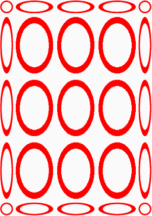
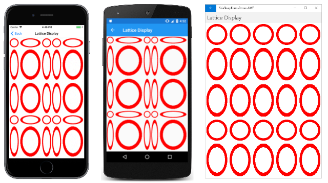

# Segmented display of SkiaSharp bitmaps

The SkiaSharp `SKCanvas` object defines a method named `DrawBitmapNinePatch` and two methods named `DrawBitmapLattice` that are very similar. Both these methods render a bitmap to the size of a destination rectangle, but instead of stretching the bitmap uniformly, they display portions of the bitmap in its pixel dimensions and stretch other parts of the bitmap so that it fits the rectangle:



These methods are generally used for rendering bitmaps that form part of user-interface objects such as buttons. When designing a button, generally you want the size of a button to be based on the content of the button, but you probably want the button's border to be the same width regardless of the button's content. That's an ideal application of `DrawBitmapNinePatch`.

`DrawBitmapNinePatch` is a special case of `DrawBitmapLattice` but it is the easier of the two methods to use and understand.

## The nine-patch display

Conceptually, [`DrawBitmapNinePatch`](xref:SkiaSharp.SKCanvas.DrawBitmapNinePatch(SkiaSharp.SKBitmap,SkiaSharp.SKRectI,SkiaSharp.SKRect,SkiaSharp.SKPaint)) divides a bitmap into nine rectangles:


The rectangles at the four corners are displayed in their pixel sizes. As the arrows indicate, the other areas on the edges of the bitmap are stretched horizontally or vertically to the area of the destination rectangle. The rectangle in the center is stretched both horizontally and vertically.

If there is not enough space in the destination rectangle to display even the four corners in their pixel dimensions, then they are scaled down to the available size and nothing but the four corners are displayed.

To divide a bitmap into these nine rectangles, it is only necessary to specify the rectangle in the center. This is the syntax of the `DrawBitmapNinePatch` method:

```csharp
canvas.DrawBitmapNinePatch(bitmap, centerRectangle, destRectangle, paint);
```

The center rectangle is relative to the bitmap. It is an `SKRectI` value (the integer version of `SKRect`) and all the coordinates and sizes are in units of pixels. The destination rectangle is relative to the display surface. The `paint` argument is optional.

The **Nine Patch Display** page in the sample first uses a static constructor to create a public static property of type `SKBitmap`:

```csharp
public partial class NinePatchDisplayPage : ContentPage
{
    static NinePatchDisplayPage()
    {
        using (SKCanvas canvas = new SKCanvas(FiveByFiveBitmap))
        using (SKPaint paint = new SKPaint
        {
            Style = SKPaintStyle.Stroke,
            Color = SKColors.Red,
            StrokeWidth = 10
        })
        {
            for (int x = 50; x < 500; x += 100)
                for (int y = 50; y < 500; y += 100)
                {
                    canvas.DrawCircle(x, y, 40, paint);
                }
        }
    }

    public static SKBitmap FiveByFiveBitmap { get; } = new SKBitmap(500, 500);
    ···
}
```

Two other pages in this article use that same bitmap. The bitmap is 500 pixels square, and consists of an array of 25 circles, all the same size, each occupying a 100-pixel square area:


The program's instance constructor creates an `SKCanvasView` with a `PaintSurface` handler that uses `DrawBitmapNinePatch` to display the bitmap stretched to its entire display surface:

```csharp
public class NinePatchDisplayPage : ContentPage
{
    ···
    public NinePatchDisplayPage()
    {
        Title = "Nine-Patch Display";

        SKCanvasView canvasView = new SKCanvasView();
        canvasView.PaintSurface += OnCanvasViewPaintSurface;
        Content = canvasView;
    }

    void OnCanvasViewPaintSurface(object sender, SKPaintSurfaceEventArgs args)
    {
        SKImageInfo info = args.Info;
        SKSurface surface = args.Surface;
        SKCanvas canvas = surface.Canvas;

        canvas.Clear();

        SKRectI centerRect = new SKRectI(100, 100, 400, 400);
        canvas.DrawBitmapNinePatch(FiveByFiveBitmap, centerRect, info.Rect);
    }
}
```

The `centerRect` rectangle encompasses the central array of 16 circles. The circles in the corners are displayed in their pixel dimensions, and everything else is stretched accordingly:

[](segmented-images/NinePatchDisplay-Large.png#lightbox)

The UWP page happens to be 500 pixels wide, and hence displays the top and bottom rows as a series of circles of the same size. Otherwise, all the circles that are not in the corners are stretched to form ellipses.

For a strange display of objects consisting of a combination of circles and ellipses, try defining the center rectangle so that it overlaps rows and columns of circles:

```csharp
SKRectI centerRect = new SKRectI(150, 150, 350, 350);
```

## The lattice display

The two `DrawBitmapLattice` methods are similar to `DrawBitmapNinePatch`, but they are generalized for any number of horizontal or vertical divisions. These divisions are defined by arrays of integers corresponding to pixels.

The [`DrawBitmapLattice`](xref:SkiaSharp.SKCanvas.DrawBitmapLattice(SkiaSharp.SKBitmap,System.Int32[],System.Int32[],SkiaSharp.SKRect,SkiaSharp.SKPaint)) method with parameters for these arrays of integers does not seem to work. The [`DrawBitmapLattice`](xref:SkiaSharp.SKCanvas.DrawBitmapLattice(SkiaSharp.SKBitmap,SkiaSharp.SKLattice,SkiaSharp.SKRect,SkiaSharp.SKPaint)) method with a parameter of type `SKLattice` does work, and that's the one used in the samples shown below.

The [`SKLattice`](xref:SkiaSharp.SKLattice) structure defines four properties:

- [`XDivs`](xref:SkiaSharp.SKLattice.XDivs), an array of integers
- [`YDivs`](xref:SkiaSharp.SKLattice.YDivs), an array of integers
- [`Flags`](xref:SkiaSharp.SKLattice.Flags), an array of `SKLatticeFlags`, an enumeration type
- [`Bounds`](xref:SkiaSharp.SKLattice.Bounds) of type `Nullable<SKRectI>` to specify an optional source rectangle within the bitmap

The `XDivs` array divides the width of the bitmap into vertical strips. The first strip extends from pixel 0 at the left to `XDivs[0]`. This strip is rendered in its pixel width. The second strip extends from `XDivs[0]` to `XDivs[1]`, and is stretched. The third strip extends from `XDivs[1]` to `XDivs[2]` and is rendered in its pixel width. The last strip extends from the last element of the array to the right edge of the bitmap. If the array has an even number of elements, then it's displayed in its pixel width. Otherwise, it's stretched. The total number of vertical strips is one more than the number of elements in the array.

The `YDivs` array is similar. It divides the height of the array into horizontal strips.

Together, the `XDivs` and `YDivs` array divide the bitmap into rectangles. The number of rectangles is equal to the product of the number of horizontal strips and the number of vertical strips.

According to Skia documentation, the `Flags` array contains one element for each rectangle, first the top row of rectangles, then the second row, and so forth. The `Flags` array is of type [`SKLatticeFlags`](xref:SkiaSharp.SKLatticeFlags), an enumeration with the following members:

- `Default` with value 0
- `Transparent` with value 1

However, these flags don't seem to work as they are supposed to, and it's best to ignore them. But don't set the `Flags` property to `null`. Set it to an array of `SKLatticeFlags` values large enough to encompass the total number of rectangles.

The **Lattice Nine Patch** page uses `DrawBitmapLattice` to mimic `DrawBitmapNinePatch`. It uses the same bitmap created in `NinePatchDisplayPage`:

```csharp
public class LatticeNinePatchPage : ContentPage
{
    SKBitmap bitmap = NinePatchDisplayPage.FiveByFiveBitmap;

    public LatticeNinePatchPage ()
    {
        Title = "Lattice Nine-Patch";

        SKCanvasView canvasView = new SKCanvasView();
        canvasView.PaintSurface += OnCanvasViewPaintSurface;
        Content = canvasView;
    }
    `
    void OnCanvasViewPaintSurface(object sender, SKPaintSurfaceEventArgs args)
    {
        SKImageInfo info = args.Info;
        SKSurface surface = args.Surface;
        SKCanvas canvas = surface.Canvas;

        SKLattice lattice = new SKLattice();
        lattice.XDivs = new int[] { 100, 400 };
        lattice.YDivs = new int[] { 100, 400 };
        lattice.Flags = new SKLatticeFlags[9];

        canvas.DrawBitmapLattice(bitmap, lattice, info.Rect);
    }
}
```

Both the `XDivs` and `YDivs` properties are set to arrays of just two integers, dividing the bitmap into three strips both horizontally and vertically: from pixel 0 to pixel 100 (rendered in the pixel size), from pixel 100 to pixel 400 (stretched), and from pixel 400 to pixel 500 (pixel size). Together, `XDivs` and `YDivs` define a total of 9 rectangles, which is the size of the `Flags` array. Simply creating the array is sufficient to create an array of `SKLatticeFlags.Default` values.

The display is identical to the previous program:

[](segmented-images/LatticeNinePatch-Large.png#lightbox)

The **Lattice Display** page divides the bitmap into 16 rectangles:

```csharp
public class LatticeDisplayPage : ContentPage
{
    SKBitmap bitmap = NinePatchDisplayPage.FiveByFiveBitmap;

    public LatticeDisplayPage()
    {
        Title = "Lattice Display";

        SKCanvasView canvasView = new SKCanvasView();
        canvasView.PaintSurface += OnCanvasViewPaintSurface;
        Content = canvasView;
    }

    void OnCanvasViewPaintSurface(object sender, SKPaintSurfaceEventArgs args)
    {
        SKImageInfo info = args.Info;
        SKSurface surface = args.Surface;
        SKCanvas canvas = surface.Canvas;

        canvas.Clear();

        SKLattice lattice = new SKLattice();
        lattice.XDivs = new int[] { 100, 200, 400 };
        lattice.YDivs = new int[] { 100, 300, 400 };

        int count = (lattice.XDivs.Length + 1) * (lattice.YDivs.Length + 1);
        lattice.Flags = new SKLatticeFlags[count];

        canvas.DrawBitmapLattice(bitmap, lattice, info.Rect);
    }
}
```

The `XDivs` and `YDivs` arrays are somewhat different, causing the display to be not quite as symmetrical as the previous examples:

[](segmented-images/LatticeDisplay-Large.png#lightbox)

In the iOS and Android images on the left, only the smaller circles are rendered in their pixel sizes. Everything else is stretched.

The **Lattice Display** page generalizes the creation of the `Flags` array, allowing you to experiment with `XDivs` and `YDivs` more easily. In particular, you'll want to see what happens when you set the first element of the `XDivs` or `YDivs` array to 0.

## Related links

- [SkiaSharp APIs](/dotnet/api/skiasharp)
