# Three Ways to Draw an Arc

_Learn how to use SkiaSharp to define arcs in three different ways_

An arc is a curve on the circumference of an ellipse, such as the rounded parts of this infinity sign:

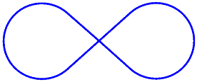

Despite the simplicity of that definition, there is no way to define an arc-drawing function that satisfies every need, and hence, no consensus among graphics systems of the best way to draw an arc. For this reason, the `SKPath` class does not restrict itself to just one approach.

`SKPath` defines an [`AddArc`](xref:SkiaSharp.SKPath.AddArc*) method, five different [`ArcTo`](xref:SkiaSharp.SKPath.ArcTo*) methods, and two relative [`RArcTo`](xref:SkiaSharp.SKPath.RArcTo*) methods. These methods fall into three categories, representing three very different approaches to specifying an arc. Which one you use depends on the information available to define the arc, and how this arc fits in with the other graphics that you're drawing.

## The Angle Arc

The angle arc approach to drawing arcs requires that you specify a rectangle that bounds an ellipse. The arc on the circumference of this ellipse is indicated by angles from the center of the ellipse that indicate the beginning of the arc and its length. Two different methods draw angle arcs. These are the [`AddArc`](xref:SkiaSharp.SKPath.AddArc(SkiaSharp.SKRect,System.Single,System.Single)) method and the [`ArcTo`](xref:SkiaSharp.SKPath.ArcTo(SkiaSharp.SKRect,System.Single,System.Single,System.Boolean)) method:

```csharp
public void AddArc (SKRect oval, Single startAngle, Single sweepAngle)

public void ArcTo (SKRect oval, Single startAngle, Single sweepAngle, Boolean forceMoveTo)
```

These methods are identical to the Android [`AddArc`](xref:Android.Graphics.Path.AddArc*) and [`ArcTo`]xref:Android.Graphics.Path.ArcTo*) methods. The iOS [`AddArc`](xref:CoreGraphics.CGPath.AddArc(System.nfloat,System.nfloat,System.nfloat,System.nfloat,System.nfloat,System.Boolean)) method is similar but is restricted to arcs on the circumference of a circle rather than generalized to an ellipse.

Both methods begin with an `SKRect` value that defines both the location and size of an ellipse:


The arc is a part of the circumference of this ellipse.

The `startAngle` argument is a clockwise angle in degrees relative to a horizontal line drawn from the center of the ellipse to the right. The `sweepAngle` argument is relative to the `startAngle`. Here are `startAngle` and `sweepAngle` values of 60 degrees and 100 degrees, respectively:

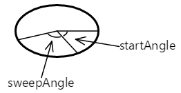

The arc begins at the start angle. Its length is governed by the sweep angle. The arc is shown here in red:


The curve added to the path with the `AddArc` or `ArcTo` method is simply that part of the ellipse's circumference:

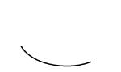

The `startAngle` or `sweepAngle` arguments can be negative: The arc is clockwise for positive values of `sweepAngle` and counter-clockwise for negative values.

However, `AddArc` does *not* define a closed contour. If you call `LineTo` after `AddArc`, a line is drawn from the end of the arc to the point in the `LineTo` method, and the same is true of `ArcTo`.

`AddArc` automatically starts a new contour and is functionally equivalent to a call to `ArcTo` with a final argument of `true`:

```csharp
path.ArcTo (oval, startAngle, sweepAngle, true);
```

That last argument is called `forceMoveTo`, and it effectively causes a `MoveTo` call at the beginning of the arc. That begins a new contour. That is not the case with a last argument of `false`:

```csharp
path.ArcTo (oval, startAngle, sweepAngle, false);
```

This version of `ArcTo` draws a line from the current position to the beginning of the arc. This means that the arc can be somewhere in the middle of a larger contour.

The **Angle Arc** page lets you use two sliders to specify the start and sweep angles. The XAML file instantiates two `Slider` elements and an `SKCanvasView`. The `PaintCanvas` handler in the [**AngleArcPage.xaml.cs**](https://github.com/xamarin/xamarin-forms-samples/blob/master/SkiaSharpForms/Demos/Demos/SkiaSharpFormsDemos/Curves/AngleArcPage.xaml.cs) file draws both the oval and the arc using two `SKPaint` objects defined as fields:

```csharp
void OnCanvasViewPaintSurface(object sender, SKPaintSurfaceEventArgs args)
{
    SKImageInfo info = args.Info;
    SKSurface surface = args.Surface;
    SKCanvas canvas = surface.Canvas;

    canvas.Clear();

    SKRect rect = new SKRect(100, 100, info.Width - 100, info.Height - 100);
    float startAngle = (float)startAngleSlider.Value;
    float sweepAngle = (float)sweepAngleSlider.Value;

    canvas.DrawOval(rect, outlinePaint);

    using (SKPath path = new SKPath())
    {
        path.AddArc(rect, startAngle, sweepAngle);
        canvas.DrawPath(path, arcPaint);
    }
}
```

As you can see, both the start angle and the sweep angle can take on negative values:

[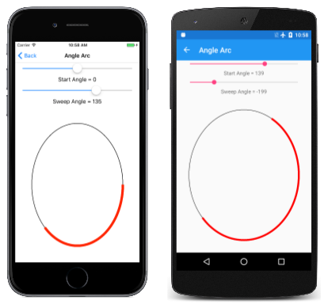](arcs-images/anglearc-large.png#lightbox)

This approach to generating an arc is algorithmically the simplest, and it's easy to derive the parametric equations that describe the arc. Knowing the size and location of the ellipse, and the start and sweep angles, the start and end points of the arc can be calculated using simple trigonometry:

`x = oval.MidX + (oval.Width / 2) * cos(angle)`

`y = oval.MidY + (oval.Height / 2) * sin(angle)`

The `angle` value is either `startAngle` or `startAngle + sweepAngle`.

The use of two angles to define an arc is best for cases where you know the angular length of the arc that you want to draw, for example, to make a pie chart. The **Exploded Pie Chart** page demonstrates this. The [`ExplodedPieChartPage`](https://github.com/xamarin/xamarin-forms-samples/blob/master/SkiaSharpForms/Demos/Demos/SkiaSharpFormsDemos/Curves/ExplodedPieChartPage.cs) class uses an internal class to define some fabricated data and colors:

```csharp
class ChartData
{
    public ChartData(int value, SKColor color)
    {
        Value = value;
        Color = color;
    }

    public int Value { private set; get; }

    public SKColor Color { private set; get; }
}

ChartData[] chartData =
{
    new ChartData(45, SKColors.Red),
    new ChartData(13, SKColors.Green),
    new ChartData(27, SKColors.Blue),
    new ChartData(19, SKColors.Magenta),
    new ChartData(40, SKColors.Cyan),
    new ChartData(22, SKColors.Brown),
    new ChartData(29, SKColors.Gray)
};

```

The `PaintSurface` handler first loops through the items to calculate a `totalValues` number. From that, it can determine each item's size as the fraction of the total, and convert that to an angle:

```csharp
void OnCanvasViewPaintSurface(object sender, SKPaintSurfaceEventArgs args)
{
    SKImageInfo info = args.Info;
    SKSurface surface = args.Surface;
    SKCanvas canvas = surface.Canvas;

    canvas.Clear();

    int totalValues = 0;

    foreach (ChartData item in chartData)
    {
        totalValues += item.Value;
    }

    SKPoint center = new SKPoint(info.Width / 2, info.Height / 2);
    float explodeOffset = 50;
    float radius = Math.Min(info.Width / 2, info.Height / 2) - 2 * explodeOffset;
    SKRect rect = new SKRect(center.X - radius, center.Y - radius,
                             center.X + radius, center.Y + radius);

    float startAngle = 0;

    foreach (ChartData item in chartData)
    {
        float sweepAngle = 360f * item.Value / totalValues;

        using (SKPath path = new SKPath())
        using (SKPaint fillPaint = new SKPaint())
        using (SKPaint outlinePaint = new SKPaint())
        {
            path.MoveTo(center);
            path.ArcTo(rect, startAngle, sweepAngle, false);
            path.Close();

            fillPaint.Style = SKPaintStyle.Fill;
            fillPaint.Color = item.Color;

            outlinePaint.Style = SKPaintStyle.Stroke;
            outlinePaint.StrokeWidth = 5;
            outlinePaint.Color = SKColors.Black;

            // Calculate "explode" transform
            float angle = startAngle + 0.5f * sweepAngle;
            float x = explodeOffset * (float)Math.Cos(Math.PI * angle / 180);
            float y = explodeOffset * (float)Math.Sin(Math.PI * angle / 180);

            canvas.Save();
            canvas.Translate(x, y);

            // Fill and stroke the path
            canvas.DrawPath(path, fillPaint);
            canvas.DrawPath(path, outlinePaint);
            canvas.Restore();
        }

        startAngle += sweepAngle;
    }
}
```

A new `SKPath` object is created for each pie slice. The path consists of a line from the center, then an `ArcTo` to draw the arc, and another line back to the center results from the `Close` call. This program displays "exploded" pie slices by moving them all out from the center by 50 pixels. That task requires a vector in the direction of the midpoint of the sweep angle for each slice:

[](arcs-images/explodedpiechart-large.png#lightbox)

To see what it looks like without the "explosion," simply comment out the `Translate` call:

[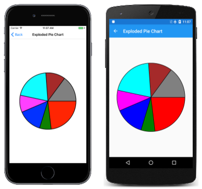](arcs-images/explodedpiechartunexploded-large.png#lightbox)

## The Tangent Arc

The second type of arc supported by `SKPath` is the *tangent arc*, so called because the arc is the circumference of a circle that is tangent to two connected lines.

A tangent arc is added to a path with a call to the  [`ArcTo`](xref:SkiaSharp.SKPath.ArcTo(SkiaSharp.SKPoint,SkiaSharp.SKPoint,System.Single)) method with two `SKPoint` parameters, or the [`ArcTo`](xref:SkiaSharp.SKPath.ArcTo(System.Single,System.Single,System.Single,System.Single,System.Single)) overload with separate `Single` parameters for the points:

```csharp
public void ArcTo (SKPoint point1, SKPoint point2, Single radius)

public void ArcTo (Single x1, Single y1, Single x2, Single y2, Single radius)
```

This `ArcTo` method is similar to the PostScript [`arct`](https://www.adobe.com/products/postscript/pdfs/PLRM.pdf) (page 532) function and the iOS [`AddArcToPoint`](xref:CoreGraphics.CGPath.AddArcToPoint(System.nfloat,System.nfloat,System.nfloat,System.nfloat,System.nfloat)) method.

The `ArcTo` method involves three points:

- The current point of the contour, or the point (0, 0) if `MoveTo` has not been called
- The first point argument to the `ArcTo` method, called the *corner point*
- The second point argument to `ArcTo`, called the *destination point*:


These three points define two connected lines:


If the three points are colinear &mdash; that is, if they lie on the same straight line &mdash; no arc will be drawn.

The `ArcTo` method also includes a `radius` parameter. This defines the radius of a circle:

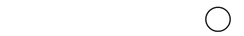

The tangent arc is not generalized for an ellipse.

If the two lines meet at any angle, that circle can be inserted between those lines so that it is tangent to both lines:


The curve that is added to the contour does not touch either of the points specified in the `ArcTo` method. It consists of a straight line from the current point to the first tangent point, and an arc that ends at the second tangent point, shown here in red:


Here's the final straight line and arc that is added to the contour:


The contour can be continued from the second tangent point.

The **Tangent Arc** page allows you to experiment with the tangent arc. This is the first of several pages that derive from [`InteractivePage`](https://github.com/xamarin/xamarin-forms-samples/blob/master/SkiaSharpForms/Demos/Demos/SkiaSharpFormsDemos/InteractivePage.cs), which defines a few handy `SKPaint` objects and performs `TouchPoint` processing:

```csharp
public class InteractivePage : ContentPage
{
    protected SKCanvasView baseCanvasView;
    protected TouchPoint[] touchPoints;

    protected SKPaint strokePaint = new SKPaint
    {
        Style = SKPaintStyle.Stroke,
        Color = SKColors.Black,
        StrokeWidth = 3
    };

    protected SKPaint redStrokePaint = new SKPaint
    {
        Style = SKPaintStyle.Stroke,
        Color = SKColors.Red,
        StrokeWidth = 15
    };

    protected SKPaint dottedStrokePaint = new SKPaint
    {
        Style = SKPaintStyle.Stroke,
        Color = SKColors.Black,
        StrokeWidth = 3,
        PathEffect = SKPathEffect.CreateDash(new float[] { 7, 7 }, 0)
    };

    protected void OnTouchEffectAction(object sender, TouchActionEventArgs args)
    {
        bool touchPointMoved = false;

        foreach (TouchPoint touchPoint in touchPoints)
        {
            float scale = baseCanvasView.CanvasSize.Width / (float)baseCanvasView.Width;
            SKPoint point = new SKPoint(scale * (float)args.Location.X,
                                        scale * (float)args.Location.Y);
            touchPointMoved |= touchPoint.ProcessTouchEvent(args.Id, args.Type, point);
        }

        if (touchPointMoved)
        {
            baseCanvasView.InvalidateSurface();
        }
    }
}
```

The `TangentArcPage` class derives from `InteractivePage`. The constructor in the [**TangentArcPage.xaml.cs**](https://github.com/xamarin/xamarin-forms-samples/blob/master/SkiaSharpForms/Demos/Demos/SkiaSharpFormsDemos/Curves/TangentArcPage.xaml.cs) file is responsible for instantiating and initializing the `touchPoints` array, and setting `baseCanvasView` (in `InteractivePage`) to the `SKCanvasView` object instantiated in the [**TangentArcPage.xaml**](https://github.com/xamarin/xamarin-forms-samples/blob/master/SkiaSharpForms/Demos/Demos/SkiaSharpFormsDemos/Curves/TangentArcPage.xaml) file:

```csharp
public partial class TangentArcPage : InteractivePage
{
    public TangentArcPage()
    {
        touchPoints = new TouchPoint[3];

        for (int i = 0; i < 3; i++)
        {
            TouchPoint touchPoint = new TouchPoint
            {
                Center = new SKPoint(i == 0 ? 100 : 500,
                                     i != 2 ? 100 : 500)
            };
            touchPoints[i] = touchPoint;
        }

        InitializeComponent();

        baseCanvasView = canvasView;
        radiusSlider.Value = 100;
    }

    void sliderValueChanged(object sender, ValueChangedEventArgs args)
    {
        if (canvasView != null)
        {
            canvasView.InvalidateSurface();
        }
    }
    ...
}
```

The `PaintSurface` handler uses the `ArcTo` method to draw the arc based on the touch points and a `Slider`, but also algorithmically calculates the circle that the angle is based on:

```csharp
public partial class TangentArcPage : InteractivePage
{
    ...
    void OnCanvasViewPaintSurface(object sender, SKPaintSurfaceEventArgs args)
    {
        SKImageInfo info = args.Info;
        SKSurface surface = args.Surface;
        SKCanvas canvas = surface.Canvas;

        canvas.Clear();

        // Draw the two lines that meet at an angle
        using (SKPath path = new SKPath())
        {
            path.MoveTo(touchPoints[0].Center);
            path.LineTo(touchPoints[1].Center);
            path.LineTo(touchPoints[2].Center);
            canvas.DrawPath(path, dottedStrokePaint);
        }

        // Draw the circle that the arc wraps around
        float radius = (float)radiusSlider.Value;

        SKPoint v1 = Normalize(touchPoints[0].Center - touchPoints[1].Center);
        SKPoint v2 = Normalize(touchPoints[2].Center - touchPoints[1].Center);

        double dotProduct = v1.X * v2.X + v1.Y * v2.Y;
        double angleBetween = Math.Acos(dotProduct);
        float hypotenuse = radius / (float)Math.Sin(angleBetween / 2);
        SKPoint vMid = Normalize(new SKPoint((v1.X + v2.X) / 2, (v1.Y + v2.Y) / 2));
        SKPoint center = new SKPoint(touchPoints[1].Center.X + vMid.X * hypotenuse,
                                     touchPoints[1].Center.Y + vMid.Y * hypotenuse);

        canvas.DrawCircle(center.X, center.Y, radius, this.strokePaint);

        // Draw the tangent arc
        using (SKPath path = new SKPath())
        {
            path.MoveTo(touchPoints[0].Center);
            path.ArcTo(touchPoints[1].Center, touchPoints[2].Center, radius);
            canvas.DrawPath(path, redStrokePaint);
        }

        foreach (TouchPoint touchPoint in touchPoints)
        {
            touchPoint.Paint(canvas);
        }
    }

    // Vector methods
    SKPoint Normalize(SKPoint v)
    {
        float magnitude = Magnitude(v);
        return new SKPoint(v.X / magnitude, v.Y / magnitude);
    }

    float Magnitude(SKPoint v)
    {
        return (float)Math.Sqrt(v.X * v.X + v.Y * v.Y);
    }
}
```

Here's the **Tangent Arc** page running:

[](arcs-images/tangentarc-large.png#lightbox)

The tangent arc is ideal for creating rounded corners, such as a rounded rectangle. Because `SKPath` already includes an `AddRoundedRect` method, the **Rounded Heptagon** page demonstrates how to use `ArcTo` for rounding the corners of a seven-sided polygon. (The code is generalized for any regular polygon.)

The `PaintSurface` handler of the [`RoundedHeptagonPage`](https://github.com/xamarin/xamarin-forms-samples/blob/master/SkiaSharpForms/Demos/Demos/SkiaSharpFormsDemos/Curves/RoundedHeptagonPage.cs) class contains one `for` loop to calculate the coordinates of the seven vertices of the heptagon, and a second to calculate the midpoints of the seven sides from these vertices. These midpoints are then used to construct the path:

```csharp
void OnCanvasViewPaintSurface(object sender, SKPaintSurfaceEventArgs args)
{
    SKImageInfo info = args.Info;
    SKSurface surface = args.Surface;
    SKCanvas canvas = surface.Canvas;

    canvas.Clear();

    float cornerRadius = 100;
    int numVertices = 7;
    float radius = 0.45f * Math.Min(info.Width, info.Height);

    SKPoint[] vertices = new SKPoint[numVertices];
    SKPoint[] midPoints = new SKPoint[numVertices];

    double vertexAngle = -0.5f * Math.PI;       // straight up

    // Coordinates of the vertices of the polygon
    for (int vertex = 0; vertex < numVertices; vertex++)
    {
        vertices[vertex] = new SKPoint(radius * (float)Math.Cos(vertexAngle),
                                       radius * (float)Math.Sin(vertexAngle));
        vertexAngle += 2 * Math.PI / numVertices;
    }

    // Coordinates of the midpoints of the sides connecting the vertices
    for (int vertex = 0; vertex < numVertices; vertex++)
    {
        int prevVertex = (vertex + numVertices - 1) % numVertices;
        midPoints[vertex] = new SKPoint((vertices[prevVertex].X + vertices[vertex].X) / 2,
                                        (vertices[prevVertex].Y + vertices[vertex].Y) / 2);
    }

    // Create the path
    using (SKPath path = new SKPath())
    {
        // Begin at the first midpoint
        path.MoveTo(midPoints[0]);

        for (int vertex = 0; vertex < numVertices; vertex++)
        {
            SKPoint nextMidPoint = midPoints[(vertex + 1) % numVertices];

            // Draws a line from the current point, and then the arc
            path.ArcTo(vertices[vertex], nextMidPoint, cornerRadius);

            // Connect the arc with the next midpoint
            path.LineTo(nextMidPoint);
        }
        path.Close();

        // Render the path in the center of the screen
        using (SKPaint paint = new SKPaint())
        {
            paint.Style = SKPaintStyle.Stroke;
            paint.Color = SKColors.Blue;
            paint.StrokeWidth = 10;

            canvas.Translate(info.Width / 2, info.Height / 2);
            canvas.DrawPath(path, paint);
        }
    }
}

```

Here's the program running:

[](arcs-images/roundedheptagon-large.png#lightbox)

## The Elliptical Arc

The elliptical arc is added to a path with a call to the [`ArcTo`](xref:SkiaSharp.SKPath.ArcTo(SkiaSharp.SKPoint,System.Single,SkiaSharp.SKPathArcSize,SkiaSharp.SKPathDirection,SkiaSharp.SKPoint)) method that has two `SKPoint` parameters, or the  [`ArcTo`](xref:SkiaSharp.SKPath.ArcTo(System.Single,System.Single,System.Single,SkiaSharp.SKPathArcSize,SkiaSharp.SKPathDirection,System.Single,System.Single)) overload with separate X and Y coordinates:

```csharp
public void ArcTo (SKPoint r, Single xAxisRotate, SKPathArcSize largeArc, SKPathDirection sweep, SKPoint xy)

public void ArcTo (Single rx, Single ry, Single xAxisRotate, SKPathArcSize largeArc, SKPathDirection sweep, Single x, Single y)
```

The elliptical arc is consistent with the [elliptical arc](https://www.w3.org/TR/SVG11/paths.html#PathDataEllipticalArcCommands) included in Scalable Vector Graphics (SVG) and the Universal Windows Platform [`ArcSegment`](/uwp/api/Windows.UI.Xaml.Media.ArcSegment/) class.

These `ArcTo` methods draw an arc between two points, which are the current point of the contour, and the last parameter to the `ArcTo` method (the `xy` parameter or the separate `x` and `y` parameters):


The first point parameter to the `ArcTo` method (`r`, or `rx` and `ry`) is not a point at all but instead specifies the horizontal and vertical radii of an ellipse;

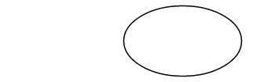

The `xAxisRotate` parameter is the number of clockwise degrees to rotate this ellipse:

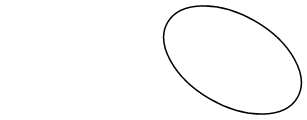

If this tilted ellipse is then positioned so that it touches the two points, the points are connected by two different arcs:


These two arcs can be distinguished in two ways: The top arc is larger than the bottom arc, and as the arc is drawn from left to right, the top arc is drawn in a clockwise direction while the bottom arc is drawn in a counter-clockwise direction.

It is also possible to fit the ellipse between the two points in another way:


Now there's a smaller arc on top that's drawn clockwise, and a larger arc on the bottom that's drawn counter-clockwise.

These two points can therefore be connected by an arc defined by the tilted ellipse in a total of four ways:

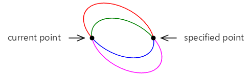

These four arcs are distinguished by the four combinations of the [`SKPathArcSize`](xref:SkiaSharp.SKPathArcSize) and [`SKPathDirection`](xref:SkiaSharp.SKPathDirection) enumeration type arguments to the `ArcTo` method:

- red: SKPathArcSize.Large and SKPathDirection.Clockwise
- green: SKPathArcSize.Small and SKPathDirection.Clockwise
- blue: SKPathArcSize.Small and SKPathDirection.CounterClockwise
- magenta: SKPathArcSize.Large and SKPathDirection.CounterClockwise

If the tilted ellipse is not large enough to fit between the two points, then it is uniformly scaled until it is large enough. Only two unique arcs connect the two points in that case. These can be distinguished with the `SKPathDirection` parameter.

Although this approach to defining an arc sounds complex on first encounter, it is the only approach that allows defining an arc with a rotated ellipse, and it is often the easiest approach when you need to integrate arcs with other parts of the contour.

The **Elliptical Arc** page allows you to interactively set the two points, and the size and rotation of the ellipse. The `EllipticalArcPage` class derives from `InteractivePage`, and the `PaintSurface` handler in the [**EllipticalArcPage.xaml.cs**](https://github.com/xamarin/xamarin-forms-samples/blob/master/SkiaSharpForms/Demos/Demos/SkiaSharpFormsDemos/Curves/EllipticalArcPage.xaml.cs) code-behind file draws the four arcs:

```csharp
void OnCanvasViewPaintSurface(object sender, SKPaintSurfaceEventArgs args)
{
    SKImageInfo info = args.Info;
    SKSurface surface = args.Surface;
    SKCanvas canvas = surface.Canvas;

    canvas.Clear();

    using (SKPath path = new SKPath())
    {
        int colorIndex = 0;
        SKPoint ellipseSize = new SKPoint((float)xRadiusSlider.Value,
                                          (float)yRadiusSlider.Value);
        float rotation = (float)rotationSlider.Value;

        foreach (SKPathArcSize arcSize in Enum.GetValues(typeof(SKPathArcSize)))
            foreach (SKPathDirection direction in Enum.GetValues(typeof(SKPathDirection)))
            {
                path.MoveTo(touchPoints[0].Center);
                path.ArcTo(ellipseSize, rotation,
                           arcSize, direction,
                           touchPoints[1].Center);

                strokePaint.Color = colors[colorIndex++];
                canvas.DrawPath(path, strokePaint);
                path.Reset();
            }
    }

    foreach (TouchPoint touchPoint in touchPoints)
    {
        touchPoint.Paint(canvas);
    }
}

```

Here it is running:

[](arcs-images/ellipticalarc-large.png#lightbox)

The **Arc Infinity** page uses the elliptical arc to draw an infinity sign. The infinity sign is based on two circles with radii of 100 units separated by 100 units:


Two lines crossing each other are tangent to both circles:

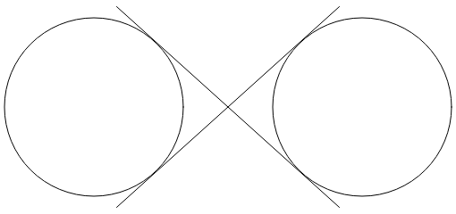

The infinity sign is a combination of parts of these circles and the two lines. To use the elliptical arc to draw the infinity sign, the coordinates where the two lines are tangent to the circles must be determined.

Construct a right rectangle in one of the circles:


The radius of the circle is 100 units, and the hypotenuse of the triangle is 150 units, so the angle α is the arcsine (inverse sine) of 100 divided by 150, or 41.8 degrees. The length of the other side of the triangle is 150 times the cosine of 41.8 degrees, or 112, which can also be calculated by the Pythagorean theorem.

The coordinates of the tangent point can then be calculated using this information:

`x = 112·cos(41.8) = 83`

`y = 112·sin(41.8) = 75`

The four tangent points are all that's necessary to draw an infinity sign centered on the point (0, 0) with circle radii of 100:


The `PaintSurface` handler in the [`ArcInfinityPage`](https://github.com/xamarin/xamarin-forms-samples/blob/master/SkiaSharpForms/Demos/Demos/SkiaSharpFormsDemos/Curves/ArcInfinityPage.cs) class positions the infinity sign so that the (0, 0) point is positioned in the center of the page, and scales the path to the screen size:

```csharp
void OnCanvasViewPaintSurface(object sender, SKPaintSurfaceEventArgs args)
{
    SKImageInfo info = args.Info;
    SKSurface surface = args.Surface;
    SKCanvas canvas = surface.Canvas;

    canvas.Clear();

    using (SKPath path = new SKPath())
    {
        path.LineTo(83, 75);
        path.ArcTo(100, 100, 0, SKPathArcSize.Large, SKPathDirection.CounterClockwise, 83, -75);
        path.LineTo(-83, 75);
        path.ArcTo(100, 100, 0, SKPathArcSize.Large, SKPathDirection.Clockwise, -83, -75);
        path.Close();

        // Use path.TightBounds for coordinates without control points
        SKRect pathBounds = path.Bounds;

        canvas.Translate(info.Width / 2, info.Height / 2);
        canvas.Scale(Math.Min(info.Width / pathBounds.Width,
                              info.Height / pathBounds.Height));

        using (SKPaint paint = new SKPaint())
        {
            paint.Style = SKPaintStyle.Stroke;
            paint.Color = SKColors.Blue;
            paint.StrokeWidth = 5;

            canvas.DrawPath(path, paint);
        }
    }
}
```

The code uses the `Bounds` property of `SKPath` to determine the dimensions of the infinity sine to scale it to the size of the canvas:

[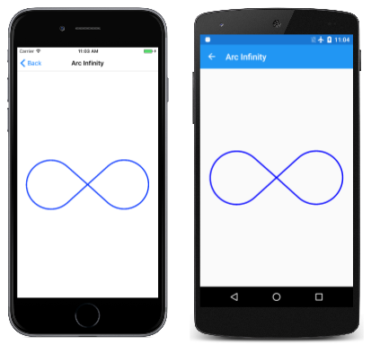](arcs-images/arcinfinity-large.png#lightbox)

The result seems a little small, which suggests that the `Bounds` property of `SKPath` is reporting a size larger than the path.

Internally, Skia approximates the arc using multiple quadratic Bézier curves. These curves (as you'll see in the next section) contain control points that govern how the curve is drawn but are not part of the rendered curve. The `Bounds` property includes those control points.

To get a tighter fit, use the `TightBounds` property, which excludes the control points. Here's the program running in landscape mode, and using the `TightBounds` property to obtain the path bounds:

[](arcs-images/arcinfinitytightbounds-large.png#lightbox)

Although the connections between the arcs and straight lines are mathematically smooth, the change from arc to straight line might seem a little abrupt. A better infinity sign is presented in the next article on [**Three Types of Bézier Curves**](beziers.md).

## Related Links

- [SkiaSharp APIs](/dotnet/api/skiasharp)
