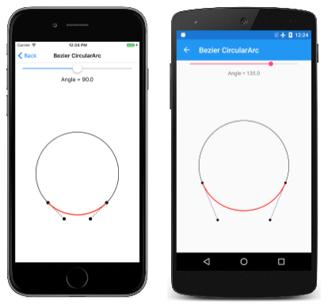
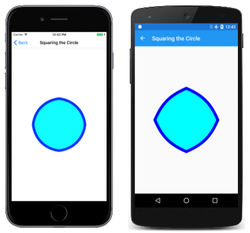
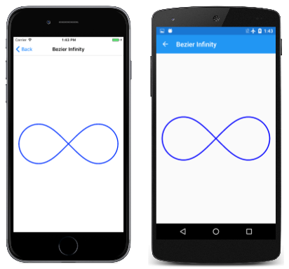
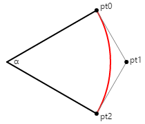
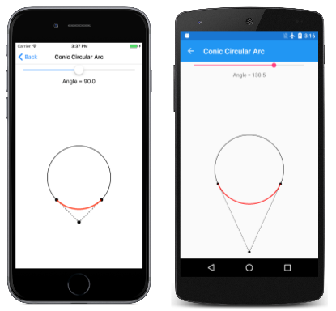

# Three Types of Bézier Curves

_Explore how to use SkiaSharp to render cubic, quadratic, and conic Bézier curves_

The Bézier curve is named after Pierre Bézier (1910 – 1999), a French engineer at the automotive company Renault, who used the curve for the computer-assisted design of car bodies.

Bézier curves are known for being well-suited to interactive design: They are well behaved &mdash; in other words, there aren't singularities that cause the curve to become infinite or unwieldy &mdash; and they are generally aesthetically pleasing:


Character outlines of computer-based fonts are usually defined with Bézier curves.

The Wikipedia article on [**Bézier curve**](https://en.wikipedia.org/wiki/B%C3%A9zier_curve) contains some useful background information. The term *Bézier curve* actually refers to a family of similar curves. SkiaSharp supports three types of Bézier curves, called the *cubic*, the *quadratic*, and the *conic*. The conic is also known as the *rational quadratic*.

## The Cubic Bézier Curve

The cubic is the type of Bézier curve that most developers think of when the subject of Bézier curves comes up.

You can add a cubic Bézier curve to an `SKPath` object using the [`CubicTo`](xref:SkiaSharp.SKPath.CubicTo(SkiaSharp.SKPoint,SkiaSharp.SKPoint,SkiaSharp.SKPoint)) method with three `SKPoint` parameters, or the [`CubicTo`](xref:SkiaSharp.SKPath.CubicTo(System.Single,System.Single,System.Single,System.Single,System.Single,System.Single)) overload with separate `x` and `y` parameters:

```csharp
public void CubicTo (SKPoint point1, SKPoint point2, SKPoint point3)

public void CubicTo (Single x1, Single y1, Single x2, Single y2, Single x3, Single y3)
```

The curve begins at the current point of the contour. The complete cubic Bezier curve is defined by four points:

- start point: current point in the contour, or (0, 0) if `MoveTo` has not been called
- first control point: `point1` in the `CubicTo` call
- second control point: `point2` in the `CubicTo` call
- end point: `point3` in the `CubicTo` call

The resultant curve begins at the start point and ends at the end point. The curve generally does not pass through the two control points; instead the control points function much like magnets to pull the curve towards them.

The best way to get a feel for the cubic Bézier curve is by experimentation. This is the purpose of the **Bezier Curve** page, which derives from `InteractivePage`. The [**BezierCurvePage.xaml**](https://github.com/xamarin/xamarin-forms-samples/blob/master/SkiaSharpForms/Demos/Demos/SkiaSharpFormsDemos/Curves/BezierCurvePage.xaml) file instantiates the `SKCanvasView` and a `TouchEffect`. The [**BezierCurvePage.xaml.cs**](https://github.com/xamarin/xamarin-forms-samples/blob/master/SkiaSharpForms/Demos/Demos/SkiaSharpFormsDemos/Curves/BezierCurvePage.xaml.cs) code-behind file creates four `TouchPoint` objects in its constructor. The `PaintSurface` event handler creates an `SKPath` to render a Bézier curve based on the four `TouchPoint` objects, and also draws dotted tangent lines from the control points to the end points:

```csharp
void OnCanvasViewPaintSurface(object sender, SKPaintSurfaceEventArgs args)
{
    SKImageInfo info = args.Info;
    SKSurface surface = args.Surface;
    SKCanvas canvas = surface.Canvas;

    canvas.Clear();

    // Draw path with cubic Bezier curve
    using (SKPath path = new SKPath())
    {
        path.MoveTo(touchPoints[0].Center);
        path.CubicTo(touchPoints[1].Center,
                     touchPoints[2].Center,
                     touchPoints[3].Center);

        canvas.DrawPath(path, strokePaint);
    }

    // Draw tangent lines
    canvas.DrawLine(touchPoints[0].Center.X,
                    touchPoints[0].Center.Y,
                    touchPoints[1].Center.X,
                    touchPoints[1].Center.Y, dottedStrokePaint);

    canvas.DrawLine(touchPoints[2].Center.X,
                    touchPoints[2].Center.Y,
                    touchPoints[3].Center.X,
                    touchPoints[3].Center.Y, dottedStrokePaint);

    foreach (TouchPoint touchPoint in touchPoints)
    {
       touchPoint.Paint(canvas);
    }
}
```

Here it is running:

[](beziers-images/beziercurve-large.png#lightbox)

Mathematically, the curve is a cubic polynomial. The curve intersects a straight line at three points at most. At the start point, the curve is always tangent to, and in the same direction as, a straight line from the start point to the first control point. At the end point, the curve is always tangent to, and in the same direction as, a straight line from the second control point to the end point.

The cubic Bézier curve is always bounded by a convex quadrilateral connecting the four points. This is called a *convex hull*. If the control points lie on the straight line between the start and end point, then the Bézier curve renders as a straight line. But the curve can also cross itself, as the third screenshot demonstrates.

A path contour can contain multiple connected cubic Bézier curves, but the connection between two cubic Bézier curves will be smooth only if the following three points are colinear (that is, lie on a straight line):

- the second control point of the first curve
- the end point of the first curve, which is also the start point of the second curve
- the first control point of the second curve

In the next article on [**SVG Path Data**](~/xamarin-forms/user-interface/graphics/skiasharp/curves/path-data.md), you'll discover a facility to ease the definition of smooth connected Bézier curves.

It is sometimes useful to know the underlying parametric equations that render a cubic Bézier curve. For *t* ranging from 0 to 1, the parametric equations are as follows:

x(t) = (1 – t)³x₀ + 3t(1 – t)²x₁ + 3t²(1 – t)x₂ + t³x₃

y(t) = (1 – t)³y₀ + 3t(1 – t)²y₁ + 3t²(1 – t)y₂ + t³y₃

The highest exponent of 3 confirms that these are cubic polynomials. It is easy to verify that when `t` equals 0, the point is (x₀, y₀), which is the start point, and when `t` equals 1, the point is (x₃, y₃), which is the end point. Near the start point (for low values of `t`), the first control point (x₁, y₁) has a strong effect, and near the end point (high values of 't') the second control point (x₂, y₂) has a strong effect.

## Bezier Curve Approximation to Circular Arcs

It is sometimes convenient to use a Bézier curve to render a circular arc. A cubic Bézier curve can approximate a circular arc very well up to a quarter circle, so four connected Bézier curves can define a whole circle. This approximation is discussed in two articles published over 25 years ago:

> Tor Dokken, et al, "Good Approximation of Circles by Curvature-Continuous Bézier curves," *Computer Aided Geometric Design 7* (1990), 33-41.

> Michael Goldapp, "Approximation of Circular Arcs by Cubic Polynomials," *Computer Aided Geometric Design 8* (1991), 227-238.

The following diagram shows four points labeled `pto`, `pt1`, `pt2`, and `pt3` defining a Bézier curve (shown in red) that approximates a circular arc:


The lines from the start and end points to the control points are tangent to the circle and to the Bézier curve, and they have a length of *L*. The first article cited above indicates that the Bézier curve best approximates a circular arc when that length *L* is calculated like this:

L = 4 × tan(α / 4) / 3

The illustration shows an angle of 45 degrees, so L equals 0.265. In code, that value would be multiplied by the desired radius of the circle.

The **Bezier Circular Arc** page allows you to experiment with defining a Bézier curve to approximate a circular arc for angles ranging up to 180 degrees. The [**BezierCircularArcPage.xaml**](https://github.com/xamarin/xamarin-forms-samples/blob/master/SkiaSharpForms/Demos/Demos/SkiaSharpFormsDemos/Curves/BezierCircularArcPage.xaml) file instantiates the `SKCanvasView` and a `Slider` for selecting the angle. The `PaintSurface` event handler in the [**BezierCircularArgPage.xaml.cs**](https://github.com/xamarin/xamarin-forms-samples/blob/master/SkiaSharpForms/Demos/Demos/SkiaSharpFormsDemos/Curves/BezierCircularArcPage.xaml.cs) code-behind file uses a transform to set the point (0, 0) to the center of the canvas. It draws a circle centered on that point for comparison, and then calculates the two control points for the Bézier curve:

```csharp
void OnCanvasViewPaintSurface(object sender, SKPaintSurfaceEventArgs args)
{
    SKImageInfo info = args.Info;
    SKSurface surface = args.Surface;
    SKCanvas canvas = surface.Canvas;

    canvas.Clear();

    // Translate to center
    canvas.Translate(info.Width / 2, info.Height / 2);

    // Draw the circle
    float radius = Math.Min(info.Width, info.Height) / 3;
    canvas.DrawCircle(0, 0, radius, blackStroke);

    // Get the value of the Slider
    float angle = (float)angleSlider.Value;

    // Calculate length of control point line
    float length = radius * 4 * (float)Math.Tan(Math.PI * angle / 180 / 4) / 3;

    // Calculate sin and cosine for half that angle
    float sin = (float)Math.Sin(Math.PI * angle / 180 / 2);
    float cos = (float)Math.Cos(Math.PI * angle / 180 / 2);

    // Find the end points
    SKPoint point0 = new SKPoint(-radius * sin, radius * cos);
    SKPoint point3 = new SKPoint(radius * sin, radius * cos);

    // Find the control points
    SKPoint point0Normalized = Normalize(point0);
    SKPoint point1 = point0 + new SKPoint(length * point0Normalized.Y,
                                          -length * point0Normalized.X);

    SKPoint point3Normalized = Normalize(point3);
    SKPoint point2 = point3 + new SKPoint(-length * point3Normalized.Y,
                                          length * point3Normalized.X);

    // Draw the points
    canvas.DrawCircle(point0.X, point0.Y, 10, blackFill);
    canvas.DrawCircle(point1.X, point1.Y, 10, blackFill);
    canvas.DrawCircle(point2.X, point2.Y, 10, blackFill);
    canvas.DrawCircle(point3.X, point3.Y, 10, blackFill);

    // Draw the tangent lines
    canvas.DrawLine(point0.X, point0.Y, point1.X, point1.Y, dottedStroke);
    canvas.DrawLine(point3.X, point3.Y, point2.X, point2.Y, dottedStroke);

    // Draw the Bezier curve
    using (SKPath path = new SKPath())
    {
        path.MoveTo(point0);
        path.CubicTo(point1, point2, point3);
        canvas.DrawPath(path, redStroke);
    }
}

// Vector methods
SKPoint Normalize(SKPoint v)
{
    float magnitude = Magnitude(v);
    return new SKPoint(v.X / magnitude, v.Y / magnitude);
}

float Magnitude(SKPoint v)
{
    return (float)Math.Sqrt(v.X * v.X + v.Y * v.Y);
}

```

The start and end points (`point0` and `point3`) are calculated based on the normal parametric equations for the circle. Because the circle is centered at (0, 0), these points can also be treated as radial vectors from the center of the circle to the circumference. The control points are on lines that are tangent to the circle, so they are at right angles to these radial vectors. A vector at a right angle to another is simply the original vector with the X and Y coordinates swapped and one of them made negative.

Here's the program running with different angles:

[](beziers-images/beziercirculararc-large.png#lightbox)

Look closely at the third screenshot, and you'll see that the Bézier curve notably deviates from a semicircle when the angle is 180 degrees, but the iOS screen shows that it seems to fit a quarter-circle just fine when the angle is 90 degrees.

Calculating the coordinates of the two control points is quite easy when the quarter circle is oriented like this:


If the radius of the circle is 100, then *L* is 55, and that's an easy number to remember.

The **Squaring the Circle** page animates a figure between a circle and a square. The circle is approximated by four Bézier curves whose coordinates are shown in the first column of this array definition in the [`SquaringTheCirclePage`](https://github.com/xamarin/xamarin-forms-samples/blob/master/SkiaSharpForms/Demos/Demos/SkiaSharpFormsDemos/Curves/SquaringTheCirclePage.cs) class:

```csharp
public class SquaringTheCirclePage : ContentPage
{
    SKPoint[,] points =
    {
        { new SKPoint(   0,  100), new SKPoint(     0,    125), new SKPoint() },
        { new SKPoint(  55,  100), new SKPoint( 62.5f,  62.5f), new SKPoint() },
        { new SKPoint( 100,   55), new SKPoint( 62.5f,  62.5f), new SKPoint() },
        { new SKPoint( 100,    0), new SKPoint(   125,      0), new SKPoint() },
        { new SKPoint( 100,  -55), new SKPoint( 62.5f, -62.5f), new SKPoint() },
        { new SKPoint(  55, -100), new SKPoint( 62.5f, -62.5f), new SKPoint() },
        { new SKPoint(   0, -100), new SKPoint(     0,   -125), new SKPoint() },
        { new SKPoint( -55, -100), new SKPoint(-62.5f, -62.5f), new SKPoint() },
        { new SKPoint(-100,  -55), new SKPoint(-62.5f, -62.5f), new SKPoint() },
        { new SKPoint(-100,    0), new SKPoint(  -125,      0), new SKPoint() },
        { new SKPoint(-100,   55), new SKPoint(-62.5f,  62.5f), new SKPoint() },
        { new SKPoint( -55,  100), new SKPoint(-62.5f,  62.5f), new SKPoint() },
        { new SKPoint(   0,  100), new SKPoint(     0,    125), new SKPoint() }
    };
    ...
}
```

The second column contains the coordinates of four Bézier curves that define a square whose area is approximately the same as the area of the circle. (Drawing a square with the *exact* area as a given circle is the classic unsolvable geometric problem of [squaring the circle](https://en.wikipedia.org/wiki/Squaring_the_circle).) For rendering a square with Bézier curves, the two control points for each curve are the same, and they are colinear with the start and end points, so the Bézier curve is rendered as a straight line.

The third column of the array is for interpolated values for an animation. The page sets a timer for 16 milliseconds, and the `PaintSurface` handler is called at that rate:

```csharp
void OnCanvasViewPaintSurface(object sender, SKPaintSurfaceEventArgs args)
{
    SKImageInfo info = args.Info;
    SKSurface surface = args.Surface;
    SKCanvas canvas = surface.Canvas;

    canvas.Clear();

    canvas.Translate(info.Width / 2, info.Height / 2);
    canvas.Scale(Math.Min(info.Width / 300, info.Height / 300));

    // Interpolate
    TimeSpan timeSpan = new TimeSpan(DateTime.Now.Ticks);
    float t = (float)(timeSpan.TotalSeconds % 3 / 3);   // 0 to 1 every 3 seconds
    t = (1 + (float)Math.Sin(2 * Math.PI * t)) / 2;     // 0 to 1 to 0 sinusoidally

    for (int i = 0; i < 13; i++)
    {
        points[i, 2] = new SKPoint(
            (1 - t) * points[i, 0].X + t * points[i, 1].X,
            (1 - t) * points[i, 0].Y + t * points[i, 1].Y);
    }

    // Create the path and draw it
    using (SKPath path = new SKPath())
    {
        path.MoveTo(points[0, 2]);

        for (int i = 1; i < 13; i += 3)
        {
            path.CubicTo(points[i, 2], points[i + 1, 2], points[i + 2, 2]);
        }
        path.Close();

        canvas.DrawPath(path, cyanFill);
        canvas.DrawPath(path, blueStroke);
    }
}
```

The points are interpolated based on a sinusoidally oscillating value of `t`. The interpolated points are then used to construct a series of four connected Bézier curves. Here's the animation running:

[](beziers-images/squaringthecircle-large.png#lightbox)

Such an animation would be impossible without curves that are algorithmically flexible enough to be rendered as both circular arcs and straight lines.

The **Bezier Infinity** page also takes advantage of the ability of a Bézier curve to approximate a circular arc. Here's the `PaintSurface` handler from the [`BezierInfinityPage`](https://github.com/xamarin/xamarin-forms-samples/blob/master/SkiaSharpForms/Demos/Demos/SkiaSharpFormsDemos/Curves/BezierInfinityPage.cs) class:

```csharp
void OnCanvasViewPaintSurface(object sender, SKPaintSurfaceEventArgs args)
{
    SKImageInfo info = args.Info;
    SKSurface surface = args.Surface;
    SKCanvas canvas = surface.Canvas;

    canvas.Clear();

    using (SKPath path = new SKPath())
    {
        path.MoveTo(0, 0);                                // Center
        path.CubicTo(  50,  -50,   95, -100,  150, -100); // To top of right loop
        path.CubicTo( 205, -100,  250,  -55,  250,    0); // To far right of right loop
        path.CubicTo( 250,   55,  205,  100,  150,  100); // To bottom of right loop
        path.CubicTo(  95,  100,   50,   50,    0,    0); // Back to center  
        path.CubicTo( -50,  -50,  -95, -100, -150, -100); // To top of left loop
        path.CubicTo(-205, -100, -250,  -55, -250,    0); // To far left of left loop
        path.CubicTo(-250,   55, -205,  100, -150,  100); // To bottom of left loop
        path.CubicTo( -95,  100,  -50,   50,    0,    0); // Back to center
        path.Close();

        SKRect pathBounds = path.Bounds;
        canvas.Translate(info.Width / 2, info.Height / 2);
        canvas.Scale(0.9f * Math.Min(info.Width / pathBounds.Width,
                                     info.Height / pathBounds.Height));

        using (SKPaint paint = new SKPaint())
        {
            paint.Style = SKPaintStyle.Stroke;
            paint.Color = SKColors.Blue;
            paint.StrokeWidth = 5;

            canvas.DrawPath(path, paint);
        }
    }
}
```

It might be a good exercise to plot these coordinates on graph paper to see how they are related. The infinity sign is centered around the point (0, 0), and the two loops have centers of (–150, 0) and (150, 0) and radii of 100. In the series of `CubicTo` commands, you can see X coordinates of control points taking on values of –95 and –205 (those values are –150 plus and minus 55), 205 and 95 (150 plus and minus 55), as well as 250 and –250 for the right and left sides. The only exception is when the infinity sign crosses itself in the center. In that case, control points have coordinates with a combination of 50 and –50 to straighten out the curve near the center.

Here's the infinity sign:

[](beziers-images/bezierinfinity-large.png#lightbox)

It is somewhat smoother towards the center than the infinity sign rendered by the **Arc Infinity** page from the [**Three Ways to Draw an Arc**](~/xamarin-forms/user-interface/graphics/skiasharp/curves/arcs.md) article.

## The Quadratic Bézier Curve

The quadratic Bézier curve has only one control point, and the curve is defined by just three points: the start point, the control point, and the end point. The parametric equations are very similar to the cubic Bézier curve, except that the highest exponent is 2, so the curve is a quadratic polynomial:

x(t) = (1 – t)²x₀ + 2t(1 – t)x₁ + t²x₂

y(t) = (1 – t)²y₀ + 2t(1 – t)y₁ + t²y₂

To add a quadratic Bézier curve to a path, use the [`QuadTo`](xref:SkiaSharp.SKPath.QuadTo(SkiaSharp.SKPoint,SkiaSharp.SKPoint)) method or the [`QuadTo`](xref:SkiaSharp.SKPath.QuadTo(System.Single,System.Single,System.Single,System.Single)) overload with separate `x` and `y` coordinates:

```csharp
public void QuadTo (SKPoint point1, SKPoint point2)

public void QuadTo (Single x1, Single y1, Single x2, Single y2)
```

The methods add a curve from the current position to `point2` with `point1` as the control point.

You can experiment with quadratic Bézier curves with the **Quadratic Curve** page, which is very similar to the **Bezier Curve** page except it has only three touch points. Here's the `PaintSurface` handler in the [**QuadraticCurve.xaml.cs**](https://github.com/xamarin/xamarin-forms-samples/blob/master/SkiaSharpForms/Demos/Demos/SkiaSharpFormsDemos/Curves/QuadraticCurvePage.xaml.cs) code-behind file:

```csharp
void OnCanvasViewPaintSurface(object sender, SKPaintSurfaceEventArgs args)
{
    SKImageInfo info = args.Info;
    SKSurface surface = args.Surface;
    SKCanvas canvas = surface.Canvas;

    canvas.Clear();

    // Draw path with quadratic Bezier
    using (SKPath path = new SKPath())
    {
        path.MoveTo(touchPoints[0].Center);
        path.QuadTo(touchPoints[1].Center,
                    touchPoints[2].Center);

        canvas.DrawPath(path, strokePaint);
    }

    // Draw tangent lines
    canvas.DrawLine(touchPoints[0].Center.X,
                    touchPoints[0].Center.Y,
                    touchPoints[1].Center.X,
                    touchPoints[1].Center.Y, dottedStrokePaint);

    canvas.DrawLine(touchPoints[1].Center.X,
                    touchPoints[1].Center.Y,
                    touchPoints[2].Center.X,
                    touchPoints[2].Center.Y, dottedStrokePaint);

    foreach (TouchPoint touchPoint in touchPoints)
    {
        touchPoint.Paint(canvas);
    }
}
```

And here it is running:

[](beziers-images/quadraticcurve-large.png#lightbox)

The dotted lines are tangent to the curve at the start point and end point, and meet at the control point.

The quadratic Bézier is good if you need a curve of a general shape, but you prefer the convenience of just one control point rather than two. The quadratic Bézier renders more efficiently than any other curve, which is why it's used internally in Skia to render elliptical arcs.

However, the shape of a quadratic Bézier curve is not elliptical, which is why multiple quadratic Béziers are required to approximate an elliptical arc. The quadratic Bézier is instead a segment of a parabola.

## The Conic Bézier Curve

The conic Bézier curve &mdash; also known as the rational quadratic Bézier curve &mdash; is a relatively recent addition to the family of Bézier curves. Like the quadratic Bézier curve, the rational quadratic Bézier curve involves a start point, an end point, and one control point. But the rational quadratic Bézier curve also requires a *weight* value. It's called a *rational* quadratic because the parametric formulas involve ratios.

The parametric equations for X and Y are ratios that share the same denominator. Here is the equation for the denominator for *t* ranging from 0 to 1 and a weight value of *w*:

d(t) = (1 – t)² + 2wt(1 – t) + t²

In theory, a rational quadratic can involve three separate weight values, one for each of the three terms, but these can be simplified to just one weight value on the middle term.

The parametric equations for the X and Y coordinates are similar to the parametric equations for the quadratic Bézier except that the middle term also includes the weight value, and the expression is divided by the denominator:

x(t) = ((1 – t)²x₀ + 2wt(1 – t)x₁ + t²x₂)) ÷ d(t)

y(t) = ((1 – t)²y₀ + 2wt(1 – t)y₁ + t²y₂)) ÷ d(t)

Rational quadratic Bézier curves are also called *conics* because they can exactly represent segments of any conic section &mdash; hyperbolas, parabolas, ellipses, and circles.

To add a rational quadratic Bézier curve to a path, use the [`ConicTo`](xref:SkiaSharp.SKPath.ConicTo(SkiaSharp.SKPoint,SkiaSharp.SKPoint,System.Single)) method or the [`ConicTo`](xref:SkiaSharp.SKPath.ConicTo(System.Single,System.Single,System.Single,System.Single,System.Single)) overload with separate `x` and `y` coordinates:

```csharp
public void ConicTo (SKPoint point1, SKPoint point2, Single weight)

public void ConicTo (Single x1, Single y1, Single x2, Single y2, Single weight)
```

Notice the final `weight` parameter.

The **Conic Curve** page allows you to experiment with these curves. The `ConicCurvePage` class derives from `InteractivePage`. The [**ConicCurvePage.xaml**](https://github.com/xamarin/xamarin-forms-samples/blob/master/SkiaSharpForms/Demos/Demos/SkiaSharpFormsDemos/Curves/ConicCurvePage.xaml) file instantiates a `Slider` to select a weight value between –2 and 2. The [**ConicCurvePage.xaml.cs**](https://github.com/xamarin/xamarin-forms-samples/blob/master/SkiaSharpForms/Demos/Demos/SkiaSharpFormsDemos/Curves/ConicCurvePage.xaml.cs) code-behind file creates three `TouchPoint` objects, and the `PaintSurface` handler simply renders the resultant curve with the tangent lines to the control points:

```csharp
void OnCanvasViewPaintSurface(object sender, SKPaintSurfaceEventArgs args)
{
    SKImageInfo info = args.Info;
    SKSurface surface = args.Surface;
    SKCanvas canvas = surface.Canvas;

    canvas.Clear();

    // Draw path with conic curve
    using (SKPath path = new SKPath())
    {
        path.MoveTo(touchPoints[0].Center);
        path.ConicTo(touchPoints[1].Center,
                     touchPoints[2].Center,
                     (float)weightSlider.Value);

        canvas.DrawPath(path, strokePaint);
    }

    // Draw tangent lines
    canvas.DrawLine(touchPoints[0].Center.X,
                    touchPoints[0].Center.Y,
                    touchPoints[1].Center.X,
                    touchPoints[1].Center.Y, dottedStrokePaint);

    canvas.DrawLine(touchPoints[1].Center.X,
                    touchPoints[1].Center.Y,
                    touchPoints[2].Center.X,
                    touchPoints[2].Center.Y, dottedStrokePaint);

    foreach (TouchPoint touchPoint in touchPoints)
    {
        touchPoint.Paint(canvas);
    }
}
```

Here it is running:

[](beziers-images/coniccurve-large.png#lightbox)

As you can see, the control point seems to pull the curve towards it more when the weight is higher. When the weight is zero, the curve becomes a straight line from the start point to the end point.

In theory, negative weights are allowed, and cause the curve to bend *away* from the control point. However, weights of –1 or below cause the denominator in the parametric equations to become negative for particular values of *t*. Probably for this reason, negative weights are ignored in the `ConicTo` methods. The **Conic Curve** program lets you set negative weights, but as you can see by experimenting, negative weights have the same effect as a weight of zero, and cause a straight line to be rendered.

It is very easy to derive the control point and weight to use the `ConicTo` method to draw a circular arc up to (but not including) a semicircle. In the following diagram, tangent lines from the start and end points meet at the control point.



You can use trigonometry to determine the distance of the control point from the circle's center: It is the radius of the circle divided by the cosine of half the angle α. To draw a circular arc between the start and end points, set the weight to that same cosine of half the angle. Notice that if the angle is 180 degrees, then the tangent lines never meet and the weight is zero. But for angles less than 180 degrees, the math works fine.

The **Conic Circular Arc** page demonstrates this. The [**ConicCircularArc.xaml**](https://github.com/xamarin/xamarin-forms-samples/blob/master/SkiaSharpForms/Demos/Demos/SkiaSharpFormsDemos/Curves/ConicCircularArcPage.xaml) file instantiates a `Slider` for selecting the angle. The `PaintSurface` handler in the  [**ConicCircularArc.xaml.cs**](https://github.com/xamarin/xamarin-forms-samples/blob/master/SkiaSharpForms/Demos/Demos/SkiaSharpFormsDemos/Curves/ConicCircularArcPage.xaml.cs) code-behind file calculates the control point and the weight:

```csharp
void OnCanvasViewPaintSurface(object sender, SKPaintSurfaceEventArgs args)
{
    SKImageInfo info = args.Info;
    SKSurface surface = args.Surface;
    SKCanvas canvas = surface.Canvas;

    canvas.Clear();

    // Translate to center
    canvas.Translate(info.Width / 2, info.Height / 2);

    // Draw the circle
    float radius = Math.Min(info.Width, info.Height) / 4;
    canvas.DrawCircle(0, 0, radius, blackStroke);

    // Get the value of the Slider
    float angle = (float)angleSlider.Value;

    // Calculate sin and cosine for half that angle
    float sin = (float)Math.Sin(Math.PI * angle / 180 / 2);
    float cos = (float)Math.Cos(Math.PI * angle / 180 / 2);

    // Find the points and weight
    SKPoint point0 = new SKPoint(-radius * sin, radius * cos);
    SKPoint point1 = new SKPoint(0, radius / cos);
    SKPoint point2 = new SKPoint(radius * sin, radius * cos);
    float weight = cos;

    // Draw the points
    canvas.DrawCircle(point0.X, point0.Y, 10, blackFill);
    canvas.DrawCircle(point1.X, point1.Y, 10, blackFill);
    canvas.DrawCircle(point2.X, point2.Y, 10, blackFill);

    // Draw the tangent lines
    canvas.DrawLine(point0.X, point0.Y, point1.X, point1.Y, dottedStroke);
    canvas.DrawLine(point2.X, point2.Y, point1.X, point1.Y, dottedStroke);

    // Draw the conic
    using (SKPath path = new SKPath())
    {
        path.MoveTo(point0);
        path.ConicTo(point1, point2, weight);
        canvas.DrawPath(path, redStroke);
    }
}
```

As you can see, there is no visual difference between the `ConicTo` path shown in red and the underlying circle displayed for reference:

[](beziers-images/coniccirculararc-large.png#lightbox)

But set the angle to 180 degrees, and the mathematics fail.

It is unfortunate in this case that `ConicTo` does not support negative weights, because in theory (based on the parametric equations), the circle can be completed with another call to `ConicTo` with the same points but a negative value of the weight. This would allow creating a whole circle with just two `ConicTo` curves based on any angle between (but not including) zero degrees and 180 degrees.

## Related Links

- [SkiaSharp APIs](/dotnet/api/skiasharp)
