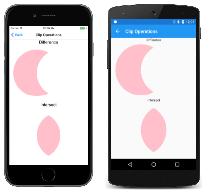
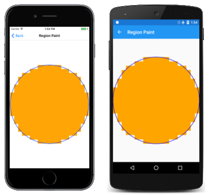

# Clipping with Paths and Regions

_Use paths to clip graphics to specific areas, and to create regions_

It's sometimes necessary to restrict the rendering of graphics to a particular area. This is known as *clipping*. You can use clipping for special effects, such as this image of a monkey seen through a keyhole:


The *clipping area* is the area of the screen in which graphics are rendered. Anything that is displayed outside of the clipping area is not rendered. The clipping area is usually defined by a rectangle or an [`SKPath`](xref:SkiaSharp.SKPath) object, but you can alternatively define a clipping area using an [`SKRegion`](xref:SkiaSharp.SKRegion) object. These two types of objects at first seem related because you can create a region from a path. However, you cannot create a path from a region, and they are very different internally: A path comprises a series of lines and curves, while a region is defined by a series of horizontal scan lines.

The image above was created by the **Monkey through Keyhole** page. The  [`MonkeyThroughKeyholePage`](https://github.com/xamarin/xamarin-forms-samples/blob/master/SkiaSharpForms/Demos/Demos/SkiaSharpFormsDemos/Curves/MonkeyThroughKeyholePage.cs) class defines a path using SVG data and uses the constructor to load a bitmap from program resources:

```csharp
public class MonkeyThroughKeyholePage : ContentPage
{
    SKBitmap bitmap;
    SKPath keyholePath = SKPath.ParseSvgPathData(
        "M 300 130 L 250 350 L 450 350 L 400 130 A 70 70 0 1 0 300 130 Z");

    public MonkeyThroughKeyholePage()
    {
        Title = "Monkey through Keyhole";

        SKCanvasView canvasView = new SKCanvasView();
        canvasView.PaintSurface += OnCanvasViewPaintSurface;
        Content = canvasView;

        string resourceID = "SkiaSharpFormsDemos.Media.SeatedMonkey.jpg";
        Assembly assembly = GetType().GetTypeInfo().Assembly;

        using (Stream stream = assembly.GetManifestResourceStream(resourceID))
        {
            bitmap = SKBitmap.Decode(stream);
        }
    }
    ...
}
```

Although the `keyholePath` object describes the outline of a keyhole, the coordinates are completely arbitrary and reflect what was convenient when the path data was devised. For this reason, the `PaintSurface` handler obtains the bounds of this path and calls `Translate` and `Scale` to move the path to the center of the screen and to make it nearly as tall as the screen:

```csharp
public class MonkeyThroughKeyholePage : ContentPage
{
    ...
    void OnCanvasViewPaintSurface(object sender, SKPaintSurfaceEventArgs args)
    {
        SKImageInfo info = args.Info;
        SKSurface surface = args.Surface;
        SKCanvas canvas = surface.Canvas;

        canvas.Clear();

        // Set transform to center and enlarge clip path to window height
        SKRect bounds;
        keyholePath.GetTightBounds(out bounds);

        canvas.Translate(info.Width / 2, info.Height / 2);
        canvas.Scale(0.98f * info.Height / bounds.Height);
        canvas.Translate(-bounds.MidX, -bounds.MidY);

        // Set the clip path
        canvas.ClipPath(keyholePath);

        // Reset transforms
        canvas.ResetMatrix();

        // Display monkey to fill height of window but maintain aspect ratio
        canvas.DrawBitmap(bitmap,
            new SKRect((info.Width - info.Height) / 2, 0,
                       (info.Width + info.Height) / 2, info.Height));
    }
}
```

But the path is not rendered. Instead, following the transforms, the path is used to set a clipping area with this statement:

```csharp
canvas.ClipPath(keyholePath);
```

The `PaintSurface` handler then resets the transforms with a call to `ResetMatrix` and draws the bitmap to extend to the full height of the screen. This code assumes that the bitmap is square, which this particular bitmap is. The bitmap is rendered only within the area defined by the clipping path:

[](clipping-images/monkeythroughkeyhole-large.png#lightbox)

The clipping path is subject to the transforms in effect when the `ClipPath` method is called, and not to the transforms in effect when a graphical object (such as a bitmap) is displayed. The clipping path is part of the canvas state that is saved with the `Save` method and restored with the `Restore` method.

## Combining Clipping Paths

Strictly speaking, the clipping area is not "set" by the `ClipPath` method. Instead, it is combined with the existing clipping path, which begins as a rectangle equal in size to the canvas. You can obtain the rectangular bounds of the clipping area using the [`LocalClipBounds`](/dotnet/api/SkiaSharp.SKCanvas.LocalClipBounds) property or the [`DeviceClipBounds`](/dotnet/api/SkiaSharp.SKCanvas.DeviceClipBounds) property. The `LocalClipBounds` property returns an `SKRect` value that reflects any transforms that might be in effect. The `DeviceClipBounds` property returns a `RectI` value. This is a rectangle with integer dimensions, and describes the clipping area in actual pixel dimensions.

Any call to `ClipPath` reduces the clipping area by combining the clipping area with a new area. The full syntax of the [`ClipPath`](/dotnet/api/skiasharp.skcanvas.clippath) method that combines the clipping area with a rectangle:

```csharp
public Void ClipRect(SKRect rect, SKClipOperation operation = SKClipOperation.Intersect, Boolean antialias = false);
```

By default, the resultant clipping area is an intersection of the existing clipping area and the `SKPath` or `SKRect` that is specified in the `ClipPath` or `ClipRect` method. This is demonstrated in the **Four Circles Intersect Clip** page. The `PaintSurface` handler in the  [`FourCircleInteresectClipPage`](https://github.com/xamarin/xamarin-forms-samples/blob/master/SkiaSharpForms/Demos/Demos/SkiaSharpFormsDemos/Curves/FourCircleIntersectClipPage.cs) class reuses the same `SKPath` object to create four overlapping circles, each of which reduces the clipping area through successive calls to `ClipPath`:

```csharp
void OnCanvasViewPaintSurface(object sender, SKPaintSurfaceEventArgs args)
{
    SKImageInfo info = args.Info;
    SKSurface surface = args.Surface;
    SKCanvas canvas = surface.Canvas;

    canvas.Clear();

    float size = Math.Min(info.Width, info.Height);
    float radius = 0.4f * size;
    float offset = size / 2 - radius;

    // Translate to center
    canvas.Translate(info.Width / 2, info.Height / 2);

    using (SKPath path = new SKPath())
    {
        path.AddCircle(-offset, -offset, radius);
        canvas.ClipPath(path, SKClipOperation.Intersect);

        path.Reset();
        path.AddCircle(-offset, offset, radius);
        canvas.ClipPath(path, SKClipOperation.Intersect);

        path.Reset();
        path.AddCircle(offset, -offset, radius);
        canvas.ClipPath(path, SKClipOperation.Intersect);

        path.Reset();
        path.AddCircle(offset, offset, radius);
        canvas.ClipPath(path, SKClipOperation.Intersect);

        using (SKPaint paint = new SKPaint())
        {
            paint.Style = SKPaintStyle.Fill;
            paint.Color = SKColors.Blue;
            canvas.DrawPaint(paint);
        }
    }
}
```

What's left is the intersection of these four circles:

[](clipping-images/fourcircleintersectclip-large.png#lightbox)

The [`SKClipOperation`](xref:SkiaSharp.SKClipOperation) enumeration has only two members:

- `Difference` removes the specified path or rectangle from the existing clipping area

- `Intersect` intersects the specified path or rectangle with the existing clipping area

If you replace the four `SKClipOperation.Intersect` arguments in the `FourCircleIntersectClipPage` class with `SKClipOperation.Difference`, you'll see the following:

[](clipping-images/fourcircledifferenceclip-large.png#lightbox)

Four overlapping circles have been removed from the clipping area.

The **Clip Operations** page illustrates the difference between these two operations with just a pair of circles. The first circle on the left is added to the clipping area with the default clip operation of `Intersect`, while the second circle on the right is added to the clipping area with the clip operation indicated by the text label:

[](clipping-images/clipoperations-large.png#lightbox)

The [`ClipOperationsPage`](https://github.com/xamarin/xamarin-forms-samples/blob/master/SkiaSharpForms/Demos/Demos/SkiaSharpFormsDemos/Curves/ClipOperationsPage.cs) class defines two `SKPaint` objects as fields, and then divides the screen up into two rectangular areas. These areas are different depending on whether the phone is in portrait or landscape mode. The `DisplayClipOp` class then displays the text and calls `ClipPath` with the two circle paths to illustrate each clip operation:

```csharp
void OnCanvasViewPaintSurface(object sender, SKPaintSurfaceEventArgs args)
{
    SKImageInfo info = args.Info;
    SKSurface surface = args.Surface;
    SKCanvas canvas = surface.Canvas;

    canvas.Clear();

    float x = 0;
    float y = 0;

    foreach (SKClipOperation clipOp in Enum.GetValues(typeof(SKClipOperation)))
    {
        // Portrait mode
        if (info.Height > info.Width)
        {
            DisplayClipOp(canvas, new SKRect(x, y, x + info.Width, y + info.Height / 2), clipOp);
            y += info.Height / 2;
        }
        // Landscape mode
        else
        {
            DisplayClipOp(canvas, new SKRect(x, y, x + info.Width / 2, y + info.Height), clipOp);
            x += info.Width / 2;
        }
    }
}

void DisplayClipOp(SKCanvas canvas, SKRect rect, SKClipOperation clipOp)
{
    float textSize = textPaint.TextSize;
    canvas.DrawText(clipOp.ToString(), rect.MidX, rect.Top + textSize, textPaint);
    rect.Top += textSize;

    float radius = 0.9f * Math.Min(rect.Width / 3, rect.Height / 2);
    float xCenter = rect.MidX;
    float yCenter = rect.MidY;

    canvas.Save();

    using (SKPath path1 = new SKPath())
    {
        path1.AddCircle(xCenter - radius / 2, yCenter, radius);
        canvas.ClipPath(path1);

        using (SKPath path2 = new SKPath())
        {
            path2.AddCircle(xCenter + radius / 2, yCenter, radius);
            canvas.ClipPath(path2, clipOp);

            canvas.DrawPaint(fillPaint);
        }
    }

    canvas.Restore();
}
```

Calling `DrawPaint` normally causes the entire canvas to be filled with that `SKPaint` object, but in this case, the method just paints within the clipping area.

## Exploring Regions

You can also define a clipping area in terms of an [`SKRegion`](xref:SkiaSharp.SKRegion) object.

A newly created `SKRegion` object describes an empty area. Usually the first call on the object is [`SetRect`](xref:SkiaSharp.SKRegion.SetRect(SkiaSharp.SKRectI)) so that the region describes a rectangular area. The parameter to `SetRect` is an `SKRectI` value &mdash; a rectangle with integer coordinates because it specifies the rectangle in terms of pixels. You can then call [`SetPath`](xref:SkiaSharp.SKRegion.SetPath(SkiaSharp.SKPath,SkiaSharp.SKRegion)) with an `SKPath` object. This creates a region that is the same as the interior of the path, but clipped to the initial rectangular region.

The region can also be modified by calling one of the [`Op`](xref:SkiaSharp.SKRegion.Op*) method overloads, such as this one:

```csharp
public Boolean Op(SKRegion region, SKRegionOperation op)
```

The [`SKRegionOperation`](xref:SkiaSharp.SKRegionOperation) enumeration is similar to `SKClipOperation` but it has more members:

- `Difference`

- `Intersect`

- `Union`

- `XOR`

- `ReverseDifference`

- `Replace`

The region that you're making the `Op` call on is combined with the region specified as a parameter based on the `SKRegionOperation` member. When you finally get a region suitable for clipping, you can set that as the clipping area of the canvas using the [`ClipRegion`](xref:SkiaSharp.SKCanvas.ClipRegion(SkiaSharp.SKRegion,SkiaSharp.SKClipOperation)) method of `SKCanvas`:

```csharp
public void ClipRegion(SKRegion region, SKClipOperation operation = SKClipOperation.Intersect)
```

The following screenshot shows clipping areas based on the six region operations. The left circle is the region that the `Op` method is called on, and the right circle is the region passed to the `Op` method:

[](clipping-images/regionoperations-large.png#lightbox)

Are these all the possibilities of combining these two circles? Consider the resultant image as a combination of three components, which by themselves are seen in the `Difference`, `Intersect`, and `ReverseDifference` operations. The total number of combinations is two to the third power, or eight. The two that are missing are the original region (which results from not calling `Op` at all) and an entirely empty region.

It's harder to use regions for clipping because you need to first create a path, and then a region from that path, and then combine multiple regions. The overall structure of the **Region Operations** page is very similar to **Clip Operations** but the [`RegionOperationsPage`](https://github.com/xamarin/xamarin-forms-samples/blob/master/SkiaSharpForms/Demos/Demos/SkiaSharpFormsDemos/Curves/RegionOperationsPage.cs) class divides the screen up into six areas and shows the extra work required to use regions for this job:

```csharp
void OnCanvasViewPaintSurface(object sender, SKPaintSurfaceEventArgs args)
{
    SKImageInfo info = args.Info;
    SKSurface surface = args.Surface;
    SKCanvas canvas = surface.Canvas;

    canvas.Clear();

    float x = 0;
    float y = 0;
    float width = info.Height > info.Width ? info.Width / 2 : info.Width / 3;
    float height = info.Height > info.Width ? info.Height / 3 : info.Height / 2;

    foreach (SKRegionOperation regionOp in Enum.GetValues(typeof(SKRegionOperation)))
    {
        DisplayClipOp(canvas, new SKRect(x, y, x + width, y + height), regionOp);

        if ((x += width) >= info.Width)
        {
            x = 0;
            y += height;
        }
    }
}

void DisplayClipOp(SKCanvas canvas, SKRect rect, SKRegionOperation regionOp)
{
    float textSize = textPaint.TextSize;
    canvas.DrawText(regionOp.ToString(), rect.MidX, rect.Top + textSize, textPaint);
    rect.Top += textSize;

    float radius = 0.9f * Math.Min(rect.Width / 3, rect.Height / 2);
    float xCenter = rect.MidX;
    float yCenter = rect.MidY;

    SKRectI recti = new SKRectI((int)rect.Left, (int)rect.Top,
                                (int)rect.Right, (int)rect.Bottom);

    using (SKRegion wholeRectRegion = new SKRegion())
    {
        wholeRectRegion.SetRect(recti);

        using (SKRegion region1 = new SKRegion(wholeRectRegion))
        using (SKRegion region2 = new SKRegion(wholeRectRegion))
        {
            using (SKPath path1 = new SKPath())
            {
                path1.AddCircle(xCenter - radius / 2, yCenter, radius);
                region1.SetPath(path1);
            }

            using (SKPath path2 = new SKPath())
            {
                path2.AddCircle(xCenter + radius / 2, yCenter, radius);
                region2.SetPath(path2);
            }

            region1.Op(region2, regionOp);

            canvas.Save();
            canvas.ClipRegion(region1);
            canvas.DrawPaint(fillPaint);
            canvas.Restore();
        }
    }
}
```

Here's a big difference between the `ClipPath` method and the `ClipRegion` method:

> [!IMPORTANT]
> Unlike the `ClipPath` method, the `ClipRegion` method is not affected by transforms.

To understand the rationale for this difference, it's helpful to understand what a region is. If you've thought about how the clip operations or region operations might be implemented internally, it probably seems very complicated. Several potentially very complex paths are being combined, and the outline of the resultant path is likely an algorithmic nightmare.

This job is simplified considerably if each path is reduced to a series of horizontal scan lines, such as those in old-fashioned vacuum tube TVs. Each scan line is simply a horizontal line with a start point and an end point. For example, a circle with a radius of 10 pixels can be decomposed into 20 horizontal scan lines, each of which starts at the left part of the circle and ends at the right part. Combining two circles with any region operation becomes very simple because it's simply a matter of examining the start and end coordinates of each pair of corresponding scan lines.

This is what a region is: A series of horizontal scan lines that define an area.

However, when an area is reduced to a series of scan lines, these scan lines are based on a particular pixel dimension. Strictly speaking, the region is not a vector graphics object. It is closer in nature to a compressed monochrome bitmap than to a path. Consequently, regions cannot be scaled or rotated without losing fidelity, and for this reason they are not transformed when used for clipping areas.

However, you can apply transforms to regions for painting purposes. The **Region Paint** program vividly demonstrates the inner nature of regions. The [`RegionPaintPage`](https://github.com/xamarin/xamarin-forms-samples/blob/master/SkiaSharpForms/Demos/Demos/SkiaSharpFormsDemos/Curves/RegionPaintPage.cs) class creates an `SKRegion` object based on an `SKPath` of a 10-unit radius circle. A transform then expands that circle to fill the page:

```csharp
void OnCanvasViewPaintSurface(object sender, SKPaintSurfaceEventArgs args)
{
    SKImageInfo info = args.Info;
    SKSurface surface = args.Surface;
    SKCanvas canvas = surface.Canvas;

    canvas.Clear();

    int radius = 10;

    // Create circular path
    using (SKPath circlePath = new SKPath())
    {
        circlePath.AddCircle(0, 0, radius);

        // Create circular region
        using (SKRegion circleRegion = new SKRegion())
        {
            circleRegion.SetRect(new SKRectI(-radius, -radius, radius, radius));
            circleRegion.SetPath(circlePath);

            // Set transform to move it to center and scale up
            canvas.Translate(info.Width / 2, info.Height / 2);
            canvas.Scale(Math.Min(info.Width / 2, info.Height / 2) / radius);

            // Fill region
            using (SKPaint fillPaint = new SKPaint())
            {
                fillPaint.Style = SKPaintStyle.Fill;
                fillPaint.Color = SKColors.Orange;

                canvas.DrawRegion(circleRegion, fillPaint);
            }

            // Stroke path for comparison
            using (SKPaint strokePaint = new SKPaint())
            {
                strokePaint.Style = SKPaintStyle.Stroke;
                strokePaint.Color = SKColors.Blue;
                strokePaint.StrokeWidth = 0.1f;

                canvas.DrawPath(circlePath, strokePaint);
            }
        }
    }
}
```

The `DrawRegion` call fills the region in orange, while the `DrawPath` call strokes the original path in blue for comparison:

[](clipping-images/regionpaint-large.png#lightbox)

The region is clearly a series of discrete coordinates.

If you don't need to use transforms in connection with your clipping areas, you can use regions for clipping, as the **Four-Leaf Clover** page demonstrates. The [`FourLeafCloverPage`](https://github.com/xamarin/xamarin-forms-samples/blob/master/SkiaSharpForms/Demos/Demos/SkiaSharpFormsDemos/Curves/FourLeafCloverPage.cs) class constructs a composite region from four circular regions, sets that composite region as the clipping area, and then draws a series of 360 straight lines emanating from the center of the page:

```csharp
void OnCanvasViewPaintSurface(object sender, SKPaintSurfaceEventArgs args)
{
    SKImageInfo info = args.Info;
    SKSurface surface = args.Surface;
    SKCanvas canvas = surface.Canvas;

    canvas.Clear();

    float xCenter = info.Width / 2;
    float yCenter = info.Height / 2;
    float radius = 0.24f * Math.Min(info.Width, info.Height);

    using (SKRegion wholeScreenRegion = new SKRegion())
    {
        wholeScreenRegion.SetRect(new SKRectI(0, 0, info.Width, info.Height));

        using (SKRegion leftRegion = new SKRegion(wholeScreenRegion))
        using (SKRegion rightRegion = new SKRegion(wholeScreenRegion))
        using (SKRegion topRegion = new SKRegion(wholeScreenRegion))
        using (SKRegion bottomRegion = new SKRegion(wholeScreenRegion))
        {
            using (SKPath circlePath = new SKPath())
            {
                // Make basic circle path
                circlePath.AddCircle(xCenter, yCenter, radius);

                // Left leaf
                circlePath.Transform(SKMatrix.MakeTranslation(-radius, 0));
                leftRegion.SetPath(circlePath);

                // Right leaf
                circlePath.Transform(SKMatrix.MakeTranslation(2 * radius, 0));
                rightRegion.SetPath(circlePath);

                // Make union of right with left
                leftRegion.Op(rightRegion, SKRegionOperation.Union);

                // Top leaf
                circlePath.Transform(SKMatrix.MakeTranslation(-radius, -radius));
                topRegion.SetPath(circlePath);

                // Combine with bottom leaf
                circlePath.Transform(SKMatrix.MakeTranslation(0, 2 * radius));
                bottomRegion.SetPath(circlePath);

                // Make union of top with bottom
                bottomRegion.Op(topRegion, SKRegionOperation.Union);

                // Exclusive-OR left and right with top and bottom
                leftRegion.Op(bottomRegion, SKRegionOperation.XOR);

                // Set that as clip region
                canvas.ClipRegion(leftRegion);

                // Set transform for drawing lines from center
                canvas.Translate(xCenter, yCenter);

                // Draw 360 lines
                for (double angle = 0; angle < 360; angle++)
                {
                    float x = 2 * radius * (float)Math.Cos(Math.PI * angle / 180);
                    float y = 2 * radius * (float)Math.Sin(Math.PI * angle / 180);

                    using (SKPaint strokePaint = new SKPaint())
                    {
                        strokePaint.Color = SKColors.Green;
                        strokePaint.StrokeWidth = 2;

                        canvas.DrawLine(0, 0, x, y, strokePaint);
                    }
                }
            }
        }
    }
}
```

It doesn't really look like a four-leaf clover, but it's an image that might otherwise be hard to render without clipping:

[](clipping-images/fourleafclover-large.png#lightbox)

## Related Links

- [SkiaSharp APIs](/dotnet/api/skiasharp)
