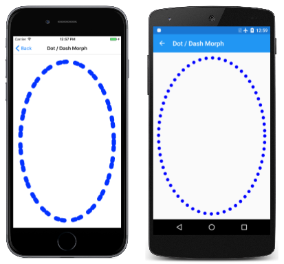
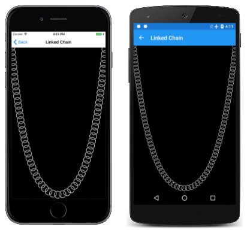
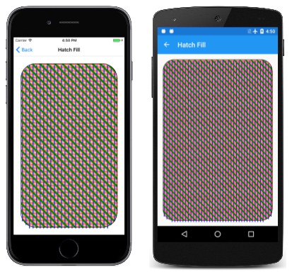
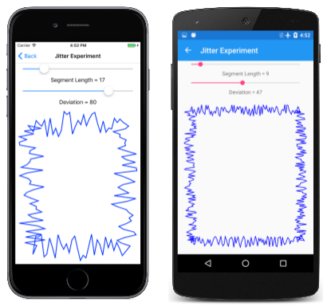
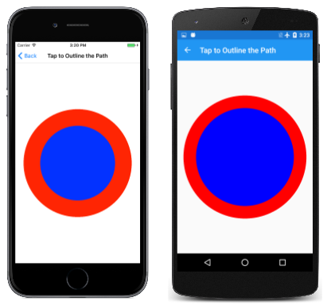
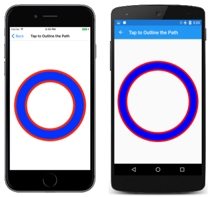

# Path Effects in SkiaSharp

_Discover the various path effects that allow paths to be used for stroking and filling_

A *path effect* is an instance of the [`SKPathEffect`](xref:SkiaSharp.SKPathEffect) class that is created with one of eight static creation methods defined by the class. The `SKPathEffect` object is then set to the [`PathEffect`](xref:SkiaSharp.SKPaint.PathEffect) property of an [`SKPaint`](xref:SkiaSharp.SKPaint) object for a variety of interesting effects, for example, stroking a line with a small replicated path:


Path effects allow you to:

- Stroke a line with dots and dashes
- Stroke a line with any filled path
- Fill an area with hatch lines
- Fill an area with a tiled path
- Make sharp corners rounded
- Add random "jitter" to lines and curves

In addition, you can combine two or more path effects.

This article also demonstrates how to use the [`GetFillPath`](xref:SkiaSharp.SKPaint.GetFillPath*) method of `SKPaint` to convert one path into another path by applying properties of `SKPaint`, including `StrokeWidth` and `PathEffect`. This results in some interesting techniques, such as obtaining a path that is an outline of another path. `GetFillPath` is also helpful in connection with path effects.

## Dots and Dashes

The use of the [`PathEffect.CreateDash`](xref:SkiaSharp.SKPathEffect.CreateDash(System.Single[],System.Single)) method was described in the article [**Dots and Dashes**](../paths/dots.md). The first argument of the method is an array containing an even number of two or more values, alternating between lengths of dashes and lengths of gaps between the dashes:

```csharp
public static SKPathEffect CreateDash (Single[] intervals, Single phase)
```

These values are *not* relative to the stroke width. For example, if the stroke width is 10, and you want a line composed of square dashes and square gaps, set the `intervals` array to { 10, 10 }. The `phase` argument indicates where within the dash pattern the line begins. In this example, if you want the line to begin with the square gap, set `phase` to 10.

The ends of the dashes are affected by the `StrokeCap` property of `SKPaint`. For wide stroke widths, it is very common to set this property to `SKStrokeCap.Round` to round the ends of the dashes. In this case, the values in the `intervals` array do *not* include the extra length resulting from the rounding. This fact means that a circular dot requires specifying a width of zero. For a stroke width of 10, to create a line with circular dots and gaps between the dots of the same diameter, use an `intervals` array of { 0, 20 }.

The **Animated Dotted Text** page is similar to the **Outlined Text** page described in the article [**Integrating Text and Graphics**](../basics/text.md) in that it displays outlined text characters by setting the `Style` property of the `SKPaint` object to `SKPaintStyle.Stroke`. In addition, **Animated Dotted Text** uses `SKPathEffect.CreateDash` to give this outline a dotted appearance, and the program also animates the `phase` argument of the `SKPathEffect.CreateDash` method to make the dots seem to travel around the text characters. Here's the page in landscape mode:

[](effects-images/animateddottedtext-large.png#lightbox)

The [`AnimatedDottedTextPage`](https://github.com/mono/SkiaSharp/blob/docs/samples/Demos/Demos/SkiaSharpFormsDemos/Curves/DotDashMorphPage.cs) class begins by defining some constants, and also overrides the `OnAppearing` and `OnDisappearing` methods for the animation:

```csharp
public class AnimatedDottedTextPage : ContentPage
{
    const string text = "DOTTED";
    const float strokeWidth = 10;
    static readonly float[] dashArray = { 0, 2 * strokeWidth };

    SKCanvasView canvasView;
    bool pageIsActive;

    public AnimatedDottedTextPage()
    {
        Title = "Animated Dotted Text";

        canvasView = new SKCanvasView();
        canvasView.PaintSurface += OnCanvasViewPaintSurface;
        Content = canvasView;
    }

    protected override void OnAppearing()
    {
        base.OnAppearing();
        pageIsActive = true;

        Dispatcher.StartTimer(TimeSpan.FromSeconds(1f / 60), () =>
        {
            canvasView.InvalidateSurface();
            return pageIsActive;
        });
    }

    protected override void OnDisappearing()
    {
        base.OnDisappearing();
        pageIsActive = false;
    }
    ...
}
```

The `PaintSurface` handler begins by creating an `SKPaint` object to display the text. The  `TextSize` property is adjusted based on the width of the screen:

```csharp
public class AnimatedDottedTextPage : ContentPage
{
    ...
    void OnCanvasViewPaintSurface(object? sender, SKPaintSurfaceEventArgs args)
    {
        SKImageInfo info = args.Info;
        SKSurface surface = args.Surface;
        SKCanvas canvas = surface.Canvas;

        canvas.Clear();

        // Create an SKPaint object for styling and an SKFont for text attributes
        using (SKPaint textPaint = new SKPaint
            {
                Style = SKPaintStyle.Stroke,
                StrokeWidth = strokeWidth,
                StrokeCap = SKStrokeCap.Round,
                Color = SKColors.Blue,
            })
        using (SKFont font = new SKFont())
        {
            // Adjust Size property so text is 95% of screen width
            float textWidth = font.MeasureText(text);
            font.Size *= 0.95f * info.Width / textWidth;

            // Find the text bounds
            SKRect textBounds = new SKRect();
            font.MeasureText(text, out textBounds);

            // Calculate offsets to center the text on the screen
            float xText = info.Width / 2 - textBounds.MidX;
            float yText = info.Height / 2 - textBounds.MidY;

            // Animate the phase; t is 0 to 1 every second
            TimeSpan timeSpan = new TimeSpan(DateTime.Now.Ticks);
            float t = (float)(timeSpan.TotalSeconds % 1 / 1);
            float phase = -t * 2 * strokeWidth;

            // Create dotted line effect based on dash array and phase
            using (SKPathEffect dashEffect = SKPathEffect.CreateDash(dashArray, phase))
            {
                // Set it to the paint object
                textPaint.PathEffect = dashEffect;

                // And draw the text
                canvas.DrawText(text, xText, yText, SKTextAlign.Left, font, textPaint);
            }
        }
    }
}
```

Towards the end of the method, the `SKPathEffect.CreateDash` method is called using the `dashArray` that is defined as a field, and the animated `phase` value. The `SKPathEffect` instance is set to the `PathEffect` property of the `SKPaint` object to display the text.

Alternatively, you can set the `SKPathEffect` object to the `SKPaint` object prior to measuring the text and centering it on the page. In that case, however, the animated dots and dashes cause some variation in the size of the rendered text, and the text tends to vibrate a little. (Try it!)

You'll also notice that as the animated dots circle around the text characters, there is a certain point in each closed curve where the dots seem to pop in and out of existence. This is where the path that defines the character outline begins and ends. If the path length is not an integral multiple of the length of the dash pattern (in this case 20 pixels), then only part of that pattern can fit at the end of the path.

It's possible to adjust the length of the dash pattern to fit the length of the path, but that requires determining the length of the path, a technique that is covered in the article [**Path Information and Enumeration**](information.md).

The **Dot / Dash Morph** program animates the dash pattern itself so that dashes seem to divide into dots, which combine to form dashes again:

[](effects-images/dotdashmorph-large.png#lightbox)

The [`DotDashMorphPage`](https://github.com/mono/SkiaSharp/blob/docs/samples/Demos/Demos/SkiaSharpFormsDemos/Curves/DotDashMorphPage.cs) class overrides the `OnAppearing` and `OnDisappearing` methods just as the previous program did, but the class defines the `SKPaint` object as a field:

```csharp
public class DotDashMorphPage : ContentPage
{
    const float strokeWidth = 30;
    static readonly float[] dashArray = new float[4];

    SKCanvasView canvasView;
    bool pageIsActive = false;

    SKPaint ellipsePaint = new SKPaint
    {
        Style = SKPaintStyle.Stroke,
        StrokeWidth = strokeWidth,
        StrokeCap = SKStrokeCap.Round,
        Color = SKColors.Blue
    };
    ...
    void OnCanvasViewPaintSurface(object? sender, SKPaintSurfaceEventArgs args)
    {
        SKImageInfo info = args.Info;
        SKSurface surface = args.Surface;
        SKCanvas canvas = surface.Canvas;

        canvas.Clear();

        // Create elliptical path
        using (SKPath ellipsePath = new SKPath())
        {
            ellipsePath.AddOval(new SKRect(50, 50, info.Width - 50, info.Height - 50));

            // Create animated path effect
            TimeSpan timeSpan = new TimeSpan(DateTime.Now.Ticks);
            float t = (float)(timeSpan.TotalSeconds % 3 / 3);
            float phase = 0;

            if (t < 0.25f)  // 1, 0, 1, 2 --> 0, 2, 0, 2
            {
                float tsub = 4 * t;
                dashArray[0] = strokeWidth * (1 - tsub);
                dashArray[1] = strokeWidth * 2 * tsub;
                dashArray[2] = strokeWidth * (1 - tsub);
                dashArray[3] = strokeWidth * 2;
            }
            else if (t < 0.5f)  // 0, 2, 0, 2 --> 1, 2, 1, 0
            {
                float tsub = 4 * (t - 0.25f);
                dashArray[0] = strokeWidth * tsub;
                dashArray[1] = strokeWidth * 2;
                dashArray[2] = strokeWidth * tsub;
                dashArray[3] = strokeWidth * 2 * (1 - tsub);
                phase = strokeWidth * tsub;
            }
            else if (t < 0.75f) // 1, 2, 1, 0 --> 0, 2, 0, 2
            {
                float tsub = 4 * (t - 0.5f);
                dashArray[0] = strokeWidth * (1 - tsub);
                dashArray[1] = strokeWidth * 2;
                dashArray[2] = strokeWidth * (1 - tsub);
                dashArray[3] = strokeWidth * 2 * tsub;
                phase = strokeWidth * (1 - tsub);
            }
            else               // 0, 2, 0, 2 --> 1, 0, 1, 2
            {
                float tsub = 4 * (t - 0.75f);
                dashArray[0] = strokeWidth * tsub;
                dashArray[1] = strokeWidth * 2 * (1 - tsub);
                dashArray[2] = strokeWidth * tsub;
                dashArray[3] = strokeWidth * 2;
            }

            using (SKPathEffect pathEffect = SKPathEffect.CreateDash(dashArray, phase))
            {
                ellipsePaint.PathEffect = pathEffect;
                canvas.DrawPath(ellipsePath, ellipsePaint);
            }
        }
    }
}
```

The `PaintSurface` handler creates an elliptical path based on the size of the page, and executes a long section of code that sets the `dashArray` and `phase` variables. As the animated variable `t` ranges from 0 to 1, the `if` blocks break up that time into four quarters, and in each of those quarters, `tsub` also ranges from 0 to 1. At the very end, the program creates the `SKPathEffect` and sets it to the `SKPaint` object for drawing.

## From Path to Path

The [`GetFillPath`](xref:SkiaSharp.SKPaint.GetFillPath(SkiaSharp.SKPath,SkiaSharp.SKPath,System.Single)) method of `SKPaint` turns one path into another based on settings in the `SKPaint` object. To see how this works, replace the `canvas.DrawPath` call in the previous program with the following code:

```csharp
SKPath newPath = new SKPath();
bool fill = ellipsePaint.GetFillPath(ellipsePath, newPath);
SKPaint newPaint = new SKPaint
{
    Style = fill ? SKPaintStyle.Fill : SKPaintStyle.Stroke
};
canvas.DrawPath(newPath, newPaint);

```

In this new code, the `GetFillPath` call converts the `ellipsePath` (which is just an oval) into `newPath`, which is then displayed with `newPaint`. The `newPaint` object is created with all default property settings except that the `Style` property is set based on the Boolean return value from `GetFillPath`.

The visuals are identical except for the color, which is set in `ellipsePaint` but not `newPaint`. Rather than the simple ellipse defined in `ellipsePath`, `newPath` contains numerous path contours that define the series of dots and dashes. This is the result of applying various properties of `ellipsePaint` (specifically, `StrokeWidth`, `StrokeCap`, and `PathEffect`) to `ellipsePath` and putting the resultant path in `newPath`. The `GetFillPath` method returns a Boolean value indicating whether or not the destination path is to be filled; in this example, the return value is `true` for filling the path.

Try changing the `Style` setting in `newPaint` to `SKPaintStyle.Stroke` and you'll see the individual path contours outlined with a one-pixel-width line.

## Stroking with a Path

The [`SKPathEffect.Create1DPath`](xref:SkiaSharp.SKPathEffect.Create1DPath(SkiaSharp.SKPath,System.Single,System.Single,SkiaSharp.SKPath1DPathEffectStyle)) method is conceptually similar to `SKPathEffect.CreateDash` except that you specify a path rather than a pattern of dashes and gaps. This path is replicated multiple times to stroke the line or curve.

The syntax is:

```csharp
public static SKPathEffect Create1DPath (SKPath path, Single advance,
                                         Single phase, SKPath1DPathEffectStyle style)
```

In general, the path that you pass to `Create1DPath` will be small and centered around the point (0, 0). The `advance` parameter indicates the distance between the centers of the path as the path is replicated on the line. You usually set this argument to the approximate width of the path. The `phase` argument plays the same role here as it does in the `CreateDash` method.

The [`SKPath1DPathEffectStyle`](xref:SkiaSharp.SKPath1DPathEffectStyle) has three members:

- `Translate`
- `Rotate`
- `Morph`

The `Translate` member causes the path to remain in the same orientation as it is replicated along a line or curve. For `Rotate`, the path is rotated based on a tangent to the curve. The path has its normal orientation for horizontal lines. `Morph` is similar to `Rotate` except that the path itself is also curved to match the curvature of the line being stroked.

The **1D Path Effect** page demonstrates these three options. The [**OneDimensionalPathEffectPage.xaml**](https://github.com/mono/SkiaSharp/blob/docs/samples/Demos/Demos/SkiaSharpFormsDemos/Curves/OneDimensionalPathEffectPage.xaml) file defines a picker containing three items corresponding to the three members of the enumeration:

```xaml
<?xml version="1.0" encoding="utf-8" ?>
<ContentPage xmlns="http://schemas.microsoft.com/dotnet/2021/maui"
             xmlns:x="http://schemas.microsoft.com/winfx/2009/xaml"
             xmlns:skia="clr-namespace:SkiaSharp.Views.Maui.Controls;assembly=SkiaSharp.Views.Maui.Controls"
             x:Class="SkiaSharpFormsDemos.Curves.OneDimensionalPathEffectPage"
             Title="1D Path Effect">
    <Grid>
        <Grid.RowDefinitions>
            <RowDefinition Height="Auto" />
            <RowDefinition Height="*" />
        </Grid.RowDefinitions>

        <Picker x:Name="effectStylePicker"
                Title="Effect Style"
                Grid.Row="0"
                SelectedIndexChanged="OnPickerSelectedIndexChanged">
            <Picker.ItemsSource>
                <x:Array Type="{x:Type x:String}">
                    <x:String>Translate</x:String>
                    <x:String>Rotate</x:String>
                    <x:String>Morph</x:String>
                </x:Array>
            </Picker.ItemsSource>
            <Picker.SelectedIndex>
                0
            </Picker.SelectedIndex>
        </Picker>

        <skia:SKCanvasView x:Name="canvasView"
                           PaintSurface="OnCanvasViewPaintSurface"
                           Grid.Row="1" />
    </Grid>
</ContentPage>
```

The [**OneDimensionalPathEffectPage.xaml.cs**](https://github.com/mono/SkiaSharp/blob/docs/samples/Demos/Demos/SkiaSharpFormsDemos/Curves/OneDimensionalPathEffectPage.xaml.cs) code-behind file defines three `SKPathEffect` objects as fields. These are all created using `SKPathEffect.Create1DPath` with `SKPath` objects created using `SKPath.ParseSvgPathData`. The first is a simple box, the second is a diamond shape, and the third is a rectangle. These are used to demonstrate the three effect styles:

```csharp
public partial class OneDimensionalPathEffectPage : ContentPage
{
    SKPathEffect translatePathEffect =
        SKPathEffect.Create1DPath(SKPath.ParseSvgPathData("M -10 -10 L 10 -10, 10 10, -10 10 Z"),
                                  24, 0, SKPath1DPathEffectStyle.Translate);

    SKPathEffect rotatePathEffect =
        SKPathEffect.Create1DPath(SKPath.ParseSvgPathData("M -10 0 L 0 -10, 10 0, 0 10 Z"),
                                  20, 0, SKPath1DPathEffectStyle.Rotate);

    SKPathEffect morphPathEffect =
        SKPathEffect.Create1DPath(SKPath.ParseSvgPathData("M -25 -10 L 25 -10, 25 10, -25 10 Z"),
                                  55, 0, SKPath1DPathEffectStyle.Morph);

    SKPaint pathPaint = new SKPaint
    {
        Color = SKColors.Blue
    };

    public OneDimensionalPathEffectPage()
    {
        InitializeComponent();
    }

    void OnPickerSelectedIndexChanged(object? sender, EventArgs args)
    {
        if (canvasView != null)
        {
            canvasView.InvalidateSurface();
        }
    }

    void OnCanvasViewPaintSurface(object? sender, SKPaintSurfaceEventArgs args)
    {
        SKImageInfo info = args.Info;
        SKSurface surface = args.Surface;
        SKCanvas canvas = surface.Canvas;

        canvas.Clear();

        using (SKPath path = new SKPath())
        {
            path.MoveTo(new SKPoint(0, 0));
            path.CubicTo(new SKPoint(2 * info.Width, info.Height),
                         new SKPoint(-info.Width, info.Height),
                         new SKPoint(info.Width, 0));

            switch ((string)effectStylePicker.SelectedItem))
            {
                case "Translate":
                    pathPaint.PathEffect = translatePathEffect;
                    break;

                case "Rotate":
                    pathPaint.PathEffect = rotatePathEffect;
                    break;

                case "Morph":
                    pathPaint.PathEffect = morphPathEffect;
                    break;
            }

            canvas.DrawPath(path, pathPaint);
        }
    }
}
```

The `PaintSurface` handler creates a Bézier curve that loops around itself, and accesses the picker to determine which `PathEffect` should be used to stroke it. The three options — `Translate`, `Rotate`, and `Morph` — are shown from left to right:

[](effects-images/1dpatheffect-large.png#lightbox)

The path specified in the `SKPathEffect.Create1DPath` method is always filled. The path specified in the `DrawPath` method is always stroked if the `SKPaint` object has its `PathEffect` property set to a 1D path effect. Notice that the `pathPaint` object has no `Style` setting, which normally defaults to `Fill`, but the path is stroked regardless.

The box used in the `Translate` example is 20 pixels square, and the `advance` argument is set to 24. This difference causes a gap between the boxes when the line is roughly horizontal or vertical, but the boxes overlap a little when the line is diagonal because the diagonal of the box is 28.3 pixels.

The diamond shape in the `Rotate` example is also 20 pixels wide. The `advance` is set to 20 so that the points continue to touch as the diamond is rotated along with the curvature of the line.

The rectangle shape in the `Morph` example is 50 pixels wide with an `advance` setting of 55 to make a small gap between the rectangles as they are bent around the Bézier curve.

If the `advance` argument is less than the size of the path, then the replicated paths can overlap. This can result in some interesting effects. The **Linked Chain** page displays a series of overlapping circles that seem to resemble a linked chain, which hangs in the distinctive shape of a catenary:

[](effects-images/linkedchain-large.png#lightbox)

Look very close and you'll see that those aren't actually circles. Each link in the chain is two arcs, sized and positioned so they seem to connect with adjoining links.

A chain or cable of uniform weight distribution hangs in the form of a catenary. An arch built in the form of an inverted catenary benefits from an equal distribution of pressure from the weight of an arch. The catenary has a seemingly simple mathematical description:

`y = a · cosh(x / a)`

The *cosh* is the hyperbolic cosine function. For *x* equal to 0, *cosh* is zero and *y* equals *a*. That's the center of the catenary. Like the *cosine* function, *cosh* is said to be *even*, which means that *cosh(–x)* equals *cosh(x)*, and values increase for increasing positive or negative arguments. These values describe the curves that form the sides of the catenary.

Finding the proper value of *a* to fit the catenary to the dimensions of the phone's page is not a direct calculation. If *w* and *h* are the width and height of a rectangle, the optimum value of *a* satisfies the following equation:

`cosh(w / 2 / a) = 1 + h / a`

The following method in the [`LinkedChainPage`](https://github.com/mono/SkiaSharp/blob/docs/samples/Demos/Demos/SkiaSharpFormsDemos/Curves/LinkedChainPage.cs) class incorporates that equality by referring to the two expressions on the left and right of the equal sign as `left` and `right`. For small values of *a*, `left` is greater than `right`; for large values of *a*, `left` is less than `right`. The `while` loop narrows in on an optimum value of *a*:

```csharp
float FindOptimumA(float width, float height)
{
    Func<float, float> left = (float a) => (float)Math.Cosh(width / 2 / a);
    Func<float, float> right = (float a) => 1 + height / a;

    float gtA = 1;         // starting value for left > right
    float ltA = 10000;     // starting value for left < right

    while (Math.Abs(gtA - ltA) > 0.1f)
    {
        float avgA = (gtA + ltA) / 2;

        if (left(avgA) < right(avgA))
        {
            ltA = avgA;
        }
        else
        {
            gtA = avgA;
        }
    }

    return (gtA + ltA) / 2;
}
```

The `SKPath` object for the links is created in the class's constructor, and the resultant `SKPathEffect` object is then set to the `PathEffect` property of the `SKPaint` object that is stored as a field:

```csharp
public class LinkedChainPage : ContentPage
{
    const float linkRadius = 30;
    const float linkThickness = 5;

    Func<float, float, float> catenary = (float a, float x) => (float)(a * Math.Cosh(x / a));

    SKPaint linksPaint = new SKPaint
    {
        Color = SKColors.Silver
    };

    public LinkedChainPage()
    {
        Title = "Linked Chain";

        SKCanvasView canvasView = new SKCanvasView();
        canvasView.PaintSurface += OnCanvasViewPaintSurface;
        Content = canvasView;

        // Create the path for the individual links
        SKRect outer = new SKRect(-linkRadius, -linkRadius, linkRadius, linkRadius);
        SKRect inner = outer;
        inner.Inflate(-linkThickness, -linkThickness);

        using (SKPath linkPath = new SKPath())
        {
            linkPath.AddArc(outer, 55, 160);
            linkPath.ArcTo(inner, 215, -160, false);
            linkPath.Close();

            linkPath.AddArc(outer, 235, 160);
            linkPath.ArcTo(inner, 395, -160, false);
            linkPath.Close();

            // Set that path as the 1D path effect for linksPaint
            linksPaint.PathEffect =
                SKPathEffect.Create1DPath(linkPath, 1.3f * linkRadius, 0,
                                          SKPath1DPathEffectStyle.Rotate);
        }
    }
    ...
}
```

The main job  of the `PaintSurface` handler is to create a path for the catenary itself. After determining the optimum *a* and storing it in the `optA` variable, it also needs to calculate an offset from the top of the window. Then, it can accumulate a collection of `SKPoint` values for the catenary, turn that into a path, and draw the path with the previously created `SKPaint` object:

```csharp
public class LinkedChainPage : ContentPage
{
    ...
    void OnCanvasViewPaintSurface(object? sender, SKPaintSurfaceEventArgs args)
    {
        SKImageInfo info = args.Info;
        SKSurface surface = args.Surface;
        SKCanvas canvas = surface.Canvas;

        canvas.Clear(SKColors.Black);

        // Width and height of catenary
        int width = info.Width;
        float height = info.Height - linkRadius;

        // Find the optimum 'a' for this width and height
        float optA = FindOptimumA(width, height);

        // Calculate the vertical offset for that value of 'a'
        float yOffset = catenary(optA, -width / 2);

        // Create a path for the catenary
        SKPoint[] points = new SKPoint[width];

        for (int x = 0; x < width; x++)
        {
            points[x] = new SKPoint(x, yOffset - catenary(optA, x - width / 2));
        }

        using (SKPath path = new SKPath())
        {
            path.AddPoly(points, false);

            // And render that path with the linksPaint object
            canvas.DrawPath(path, linksPaint);
        }
    }
    ...
}
```

This program defines the path used in `Create1DPath` to have its (0, 0) point in the center. This seems reasonable because the (0, 0) point of the path is aligned with the line or curve that it's adorning. However, you can use a non-centered (0, 0) point for some special effects.

The **Conveyor Belt** page creates a path resembling an oblong conveyor belt with a curved top and bottom that is sized to the dimensions of the window. That path is stroked with a simple `SKPaint` object 20 pixels wide and colored gray, and then stroked again with another `SKPaint` object with an `SKPathEffect` object referencing a path resembling a little bucket:

[](effects-images/conveyorbelt-large.png#lightbox)

The (0, 0) point of the bucket path is the handle, so when the `phase` argument is animated, the buckets seem to revolve around the conveyor belt, perhaps scooping up water at the bottom and dumping it out at the top.

The [`ConveyorBeltPage`](https://github.com/mono/SkiaSharp/blob/docs/samples/Demos/Demos/SkiaSharpFormsDemos/Curves/ConveyorBeltPage.cs) class implements animation with overrides of the `OnAppearing` and `OnDisappearing` methods. The path for the bucket is defined in the page's constructor:

```csharp
public class ConveyorBeltPage : ContentPage
{
    SKCanvasView canvasView;
    bool pageIsActive = false;

    SKPaint conveyerPaint = new SKPaint
    {
        Style = SKPaintStyle.Stroke,
        StrokeWidth = 20,
        Color = SKColors.DarkGray
    };

    SKPath bucketPath = new SKPath();

    SKPaint bucketsPaint = new SKPaint
    {
        Color = SKColors.BurlyWood,
    };

    public ConveyorBeltPage()
    {
        Title = "Conveyor Belt";

        canvasView = new SKCanvasView();
        canvasView.PaintSurface += OnCanvasViewPaintSurface;
        Content = canvasView;

        // Create the path for the bucket starting with the handle
        bucketPath.AddRect(new SKRect(-5, -3, 25, 3));

        // Sides
        bucketPath.AddRoundedRect(new SKRect(25, -19, 27, 18), 10, 10,
                                  SKPathDirection.CounterClockwise);
        bucketPath.AddRoundedRect(new SKRect(63, -19, 65, 18), 10, 10,
                                  SKPathDirection.CounterClockwise);

        // Five slats
        for (int i = 0; i < 5; i++)
        {
            bucketPath.MoveTo(25, -19 + 8 * i);
            bucketPath.LineTo(25, -13 + 8 * i);
            bucketPath.ArcTo(50, 50, 0, SKPathArcSize.Small,
                             SKPathDirection.CounterClockwise, 65, -13 + 8 * i);
            bucketPath.LineTo(65, -19 + 8 * i);
            bucketPath.ArcTo(50, 50, 0, SKPathArcSize.Small,
                             SKPathDirection.Clockwise, 25, -19 + 8 * i);
            bucketPath.Close();
        }

        // Arc to suggest the hidden side
        bucketPath.MoveTo(25, -17);
        bucketPath.ArcTo(50, 50, 0, SKPathArcSize.Small,
                         SKPathDirection.Clockwise, 65, -17);
        bucketPath.LineTo(65, -19);
        bucketPath.ArcTo(50, 50, 0, SKPathArcSize.Small,
                         SKPathDirection.CounterClockwise, 25, -19);
        bucketPath.Close();

        // Make it a little bigger and correct the orientation
        bucketPath.Transform(SKMatrix.MakeScale(-2, 2));
        bucketPath.Transform(SKMatrix.MakeRotationDegrees(90));
    }
    ...
```

The bucket creation code completes with two transforms that make the bucket a little bigger and turn it sideways. Applying these transforms was easier than adjusting all the coordinates in the previous code.

The `PaintSurface` handler begins by defining a path for the conveyor belt itself. This is simply a pair of lines and a pair of semi-circles that are drawn with a 20-pixel-wide dark-gray line:

```csharp
public class ConveyorBeltPage : ContentPage
{
    ...
    void OnCanvasViewPaintSurface(object? sender, SKPaintSurfaceEventArgs args)
    {
        SKImageInfo info = args.Info;
        SKSurface surface = args.Surface;
        SKCanvas canvas = surface.Canvas;

        canvas.Clear();

        float width = info.Width / 3;
        float verticalMargin = width / 2 + 150;

        using (SKPath conveyerPath = new SKPath())
        {
            // Straight verticals capped by semicircles on top and bottom
            conveyerPath.MoveTo(width, verticalMargin);
            conveyerPath.ArcTo(width / 2, width / 2, 0, SKPathArcSize.Large,
                               SKPathDirection.Clockwise, 2 * width, verticalMargin);
            conveyerPath.LineTo(2 * width, info.Height - verticalMargin);
            conveyerPath.ArcTo(width / 2, width / 2, 0, SKPathArcSize.Large,
                               SKPathDirection.Clockwise, width, info.Height - verticalMargin);
            conveyerPath.Close();

            // Draw the conveyor belt itself
            canvas.DrawPath(conveyerPath, conveyerPaint);

            // Calculate spacing based on length of conveyer path
            float length = 2 * (info.Height - 2 * verticalMargin) +
                           2 * ((float)Math.PI * width / 2);

            // Value will be somewhere around 200
            float spacing = length / (float)Math.Round(length / 200);

            // Now animate the phase; t is 0 to 1 every 2 seconds
            TimeSpan timeSpan = new TimeSpan(DateTime.Now.Ticks);
            float t = (float)(timeSpan.TotalSeconds % 2 / 2);
            float phase = -t * spacing;

            // Create the buckets PathEffect
            using (SKPathEffect bucketsPathEffect =
                        SKPathEffect.Create1DPath(bucketPath, spacing, phase,
                                                  SKPath1DPathEffectStyle.Rotate))
            {
                // Set it to the Paint object and draw the path again
                bucketsPaint.PathEffect = bucketsPathEffect;
                canvas.DrawPath(conveyerPath, bucketsPaint);
            }
        }
    }
}
```

The logic for drawing the conveyor belt does not work in landscape mode.

The buckets should be spaced about 200 pixels apart on the conveyor belt. However, the conveyor belt is probably not a multiple of 200 pixels long, which means that as the `phase` argument of `SKPathEffect.Create1DPath` is animated, buckets will pop into and out of existence.

For this reason, the program first calculates a value named `length` that is the length of the conveyor belt. Because the conveyor belt consists of straight lines and semi-circles, this is a simple calculation. Next, the number of buckets is calculated by dividing `length` by 200. This is rounded to the nearest integer, and that number is then divided into `length`. The result is a spacing for an integral number of buckets. The `phase` argument is simply a fraction of that.

## From Path to Path Again

At the bottom of the `DrawSurface` handler in **Conveyor Belt**, comment out the `canvas.DrawPath` call and replace it with the following code:

```csharp
SKPath newPath = new SKPath();
bool fill = bucketsPaint.GetFillPath(conveyerPath, newPath);
SKPaint newPaint = new SKPaint
{
    Style = fill ? SKPaintStyle.Fill : SKPaintStyle.Stroke
};
canvas.DrawPath(newPath, newPaint);
```

As with the previous example of `GetFillPath`, you'll see that the results are the same except for the color. After executing `GetFillPath`, the `newPath` object contains multiple copies of the bucket path, each positioned in the same spot that the animation positioned them at the time of the call.

## Hatching an Area

The [`SKPathEffect.Create2DLines`](xref:SkiaSharp.SKPathEffect.Create2DLine(System.Single,SkiaSharp.SKMatrix)) method fills an area with parallel lines, often called *hatch lines*. The method has the following syntax:

```csharp
public static SKPathEffect Create2DLine (Single width, SKMatrix matrix)
```

The `width` argument specifies the stroke width of the hatch lines. The `matrix` parameter is a combination of scaling and optional rotation. The scaling factor indicates the pixel increment that Skia uses to space the hatch lines. The separation between the lines is the scaling factor minus the `width` argument. If the scaling factor is less than or equal to the `width` value, there will be no space between the hatch lines, and the area will appear to be filled. Specify the same value for horizontal and vertical scaling.

By default, hatch lines are horizontal. If the `matrix` parameter contains rotation, the hatch lines are rotated clockwise.

The **Hatch Fill** page demonstrates this path effect. The [`HatchFillPage`](https://github.com/mono/SkiaSharp/blob/docs/samples/Demos/Demos/SkiaSharpFormsDemos/Curves/HatchFillPage.cs) class defines three path effects as fields, the first for horizontal hatch lines with a width of 3 pixels with a scaling factor indicating that they are spaced 6 pixels apart. The separation between the lines is therefore three pixels. The second path effect is for vertical hatch lines with a width of six pixels spaced 24 pixels apart (so the separation is 18 pixels), and the third is for diagonal hatch lines 12 pixels wide spaced 36 pixels apart.

```csharp
public class HatchFillPage : ContentPage
{
    SKPaint fillPaint = new SKPaint();

    SKPathEffect horzLinesPath = SKPathEffect.Create2DLine(3, SKMatrix.MakeScale(6, 6));

    SKPathEffect vertLinesPath = SKPathEffect.Create2DLine(6,
        Multiply(SKMatrix.MakeRotationDegrees(90), SKMatrix.MakeScale(24, 24)));

    SKPathEffect diagLinesPath = SKPathEffect.Create2DLine(12,
        Multiply(SKMatrix.MakeScale(36, 36), SKMatrix.MakeRotationDegrees(45)));

    SKPaint strokePaint = new SKPaint
    {
        Style = SKPaintStyle.Stroke,
        StrokeWidth = 3,
        Color = SKColors.Black
    };
    ...
    static SKMatrix Multiply(SKMatrix first, SKMatrix second)
    {
        SKMatrix target = SKMatrix.MakeIdentity();
        SKMatrix.Concat(ref target, first, second);
        return target;
    }
}
```

Notice the matrix `Multiply` method. Because the horizontal and vertical scaling factors are the same, the order in which the scaling and rotation matrices are multiplied doesn't matter.

The `PaintSurface` handler uses these three path effects with three different colors in combination with `fillPaint` to fill a rounded rectangle sized to fit the page. The `Style` property set on `fillPaint` is ignored; when the `SKPaint` object includes a path effect created from `SKPathEffect.Create2DLine`, the area is filled regardless:

```csharp
public class HatchFillPage : ContentPage
{
    ...
    void OnCanvasViewPaintSurface(object? sender, SKPaintSurfaceEventArgs args)
    {
        SKImageInfo info = args.Info;
        SKSurface surface = args.Surface;
        SKCanvas canvas = surface.Canvas;

        canvas.Clear();

        using (SKPath roundRectPath = new SKPath())
        {
            // Create a path
            roundRectPath.AddRoundedRect(
                new SKRect(50, 50, info.Width - 50, info.Height - 50), 100, 100);

            // Horizontal hatch marks
            fillPaint.PathEffect = horzLinesPath;
            fillPaint.Color = SKColors.Red;
            canvas.DrawPath(roundRectPath, fillPaint);

            // Vertical hatch marks
            fillPaint.PathEffect = vertLinesPath;
            fillPaint.Color = SKColors.Blue;
            canvas.DrawPath(roundRectPath, fillPaint);

            // Diagonal hatch marks -- use clipping
            fillPaint.PathEffect = diagLinesPath;
            fillPaint.Color = SKColors.Green;

            canvas.Save();
            canvas.ClipPath(roundRectPath);
            canvas.DrawRect(new SKRect(0, 0, info.Width, info.Height), fillPaint);
            canvas.Restore();

            // Outline the path
            canvas.DrawPath(roundRectPath, strokePaint);
        }
    }
    ...
}
```

If you look carefully at the results, you'll see that the red and blue hatch lines aren't confined precisely to the rounded rectangle. (This is apparently a characteristic of the underlying Skia code.) If this is unsatisfactory, an alternative approach is shown for the diagonal hatch lines in green: The rounded rectangle is used as a clipping path and the hatch lines are drawn on the entire page.

The `PaintSurface` handler concludes with a call to simply stroke the rounded rectangle, so you can see the discrepancy with the red and blue hatch lines:

[](effects-images/hatchfill-large.png#lightbox)

The Android screen doesn't really look like that: The scaling of the screenshot has caused the thin red lines and thin spaces to consolidate into seemingly wider red lines and wider spaces.

## Filling with a Path

The [`SKPathEffect.Create2DPath`](xref:SkiaSharp.SKPathEffect.Create2DPath(SkiaSharp.SKMatrix,SkiaSharp.SKPath)) allows you to fill an area with a path that is replicated horizontally and vertically, in effect tiling the area:

```csharp
public static SKPathEffect Create2DPath (SKMatrix matrix, SKPath path)
```

The `SKMatrix` scaling factors indicate the horizontal and vertical spacing of the replicated path. But you can't rotate the path using this `matrix` argument; if you want the path rotated, rotate the path itself using the `Transform` method defined by `SKPath`.

The replicated path is normally aligned with the left and top edges of the screen rather than the area being filled. You can override this behavior by providing translation factors between 0 and the scaling factors to specify horizontal and vertical offsets from the left and top sides.

The **Path Tile Fill** page demonstrates this path effect. The path used for tiling the area is defined as a field in the [`PathTileFillPage`](https://github.com/mono/SkiaSharp/blob/docs/samples/Demos/Demos/SkiaSharpFormsDemos/Curves/PathTileFillPage.cs) class. The horizontal and vertical coordinates range from –40 to 40, which means that this path is 80 pixels square:

```csharp
public class PathTileFillPage : ContentPage
{
    SKPath tilePath = SKPath.ParseSvgPathData(
        "M -20 -20 L 2 -20, 2 -40, 18 -40, 18 -20, 40 -20, " +
        "40 -12, 20 -12, 20 12, 40 12, 40 40, 22 40, 22 20, " +
        "-2 20, -2 40, -20 40, -20 8, -40 8, -40 -8, -20 -8 Z");
    ...
    void OnCanvasViewPaintSurface(object? sender, SKPaintSurfaceEventArgs args)
    {
        SKImageInfo info = args.Info;
        SKSurface surface = args.Surface;
        SKCanvas canvas = surface.Canvas;

        canvas.Clear();

        using (SKPaint paint = new SKPaint())
        {
            paint.Color = SKColors.Red;

            using (SKPathEffect pathEffect =
                   SKPathEffect.Create2DPath(SKMatrix.MakeScale(64, 64), tilePath))
            {
                paint.PathEffect = pathEffect;

                canvas.DrawRoundRect(
                    new SKRect(50, 50, info.Width - 50, info.Height - 50),
                    100, 100, paint);
            }
        }
    }
}
```

In the `PaintSurface` handler, the `SKPathEffect.Create2DPath` calls sets the horizontal and vertical spacing to 64 to cause the 80-pixel square tiles to overlap. Fortunately, the path resembles a puzzle piece, meshing nicely with adjoining tiles:

[](effects-images/pathtilefill-large.png#lightbox)

The scaling from the original screenshot causes some distortion, particularly on the Android screen.

Notice that these tiles always appear whole and are never truncated. On the first two screenshots, it's not even evident that the area being filled is a rounded rectangle. If you want to truncate these tiles to a particular area, use a clipping path.

Try setting the `Style` property of the `SKPaint` object to `Stroke`, and you'll see the individual tiles outlined rather than filled.

It's also possible to fill an area with a tiled bitmap, as shown in the article [**SkiaSharp bitmap tiling**](../effects/shaders/bitmap-tiling.md).

## Rounding Sharp Corners

The **Rounded Heptagon** program presented in the [**Three Ways to Draw an Arc**](arcs.md) article used a tangent arc to curve the points of a seven-sided figure. The **Another Rounded Heptagon** page shows a much easier approach that uses a path effect created from the [`SKPathEffect.CreateCorner`](xref:SkiaSharp.SKPathEffect.CreateCorner(System.Single)) method:

```csharp
public static SKPathEffect CreateCorner (Single radius)
```

Although the single argument is named `radius`, you must set it to half the desired corner radius. (This is a characteristic of the underlying Skia code.)

Here's the `PaintSurface` handler in the [`AnotherRoundedHeptagonPage`](https://github.com/mono/SkiaSharp/blob/docs/samples/Demos/Demos/SkiaSharpFormsDemos/Curves/AnotherRoundedHeptagonPage.cs) class:

```csharp
void OnCanvasViewPaintSurface(object? sender, SKPaintSurfaceEventArgs args)
{
    SKImageInfo info = args.Info;
    SKSurface surface = args.Surface;
    SKCanvas canvas = surface.Canvas;

    canvas.Clear();

    int numVertices = 7;
    float radius = 0.45f * Math.Min(info.Width, info.Height);
    SKPoint[] vertices = new SKPoint[numVertices];
    double vertexAngle = -0.5f * Math.PI;       // straight up

    // Coordinates of the vertices of the polygon
    for (int vertex = 0; vertex < numVertices; vertex++)
    {
        vertices[vertex] = new SKPoint(radius * (float)Math.Cos(vertexAngle),
                                       radius * (float)Math.Sin(vertexAngle));
        vertexAngle += 2 * Math.PI / numVertices;
    }

    float cornerRadius = 100;

    // Create the path
    using (SKPath path = new SKPath())
    {
        path.AddPoly(vertices, true);

        // Render the path in the center of the screen
        using (SKPaint paint = new SKPaint())
        {
            paint.Style = SKPaintStyle.Stroke;
            paint.Color = SKColors.Blue;
            paint.StrokeWidth = 10;

            // Set argument to half the desired corner radius!
            paint.PathEffect = SKPathEffect.CreateCorner(cornerRadius / 2);

            canvas.Translate(info.Width / 2, info.Height / 2);
            canvas.DrawPath(path, paint);

            // Uncomment DrawCircle call to verify corner radius
            float offset = cornerRadius / (float)Math.Sin(Math.PI * (numVertices - 2) / numVertices / 2);
            paint.Color = SKColors.Green;
            // canvas.DrawCircle(vertices[0].X, vertices[0].Y + offset, cornerRadius, paint);
        }
    }
}
```

You can use this effect with either stroking or filling based on the `Style` property of the `SKPaint` object. Here it is running:

[](effects-images/anotherroundedheptagon-large.png#lightbox)

You'll see that this rounded heptagon is identical to the earlier program. If you need more convincing that the corner radius is truly 100 rather than the 50 specified in the `SKPathEffect.CreateCorner` call, you can uncomment the final statement in the program and see a 100-radius circle superimposed on the corner.

## Random Jitter

Sometimes the flawless straight lines of computer graphics are not quite what you want, and a little randomness is desired. In that case, you'll want to try the [`SKPathEffect.CreateDiscrete`](xref:SkiaSharp.SKPathEffect.CreateDiscrete(System.Single,System.Single,System.UInt32)) method:

```csharp
public static SKPathEffect CreateDiscrete (Single segLength, Single deviation, UInt32 seedAssist)
```

You can use this path effect for either stroking or filling. Lines are separated into connected segments — the approximate length of which is specified by `segLength` — and extend in different directions. The extent of the deviation from the original line is specified by `deviation`.

The final argument is a seed used to generate the pseudo-random sequence used for the effect. The jitter effect will look a little different for different seeds. The argument has a default value of zero, which means that the effect is the same whenever you run the program. If you want different jitter whenever the screen is repainted, you can set the seed to the `Millisecond` property of a `DataTime.Now` value (for example).

The **Jitter Experiment** page allows you to experiment with different values in stroking a rectangle:

[](effects-images/jitterexperiment-large.png#lightbox)

The program is straightforward. The [**JitterExperimentPage.xaml**](https://github.com/mono/SkiaSharp/blob/docs/samples/Demos/Demos/SkiaSharpFormsDemos/Curves/JitterExperimentPage.xaml) file instantiates two `Slider` elements and an `SKCanvasView`:

```xaml
<ContentPage xmlns="http://schemas.microsoft.com/dotnet/2021/maui"
             xmlns:x="http://schemas.microsoft.com/winfx/2009/xaml"
             xmlns:skia="clr-namespace:SkiaSharp.Views.Maui.Controls;assembly=SkiaSharp.Views.Maui.Controls"
             x:Class="SkiaSharpFormsDemos.Curves.JitterExperimentPage"
             Title="Jitter Experiment">
    <Grid>
        <Grid.RowDefinitions>
            <RowDefinition Height="Auto" />
            <RowDefinition Height="Auto" />
            <RowDefinition Height="Auto" />
            <RowDefinition Height="Auto" />
            <RowDefinition Height="*" />
        </Grid.RowDefinitions>

        <Grid.Resources>
            <ResourceDictionary>
                <Style TargetType="Label">
                    <Setter Property="HorizontalTextAlignment" Value="Center" />
                </Style>

                <Style TargetType="Slider">
                    <Setter Property="Margin" Value="20, 0" />
                    <Setter Property="Minimum" Value="0" />
                    <Setter Property="Maximum" Value="100" />
                </Style>
            </ResourceDictionary>
        </Grid.Resources>

        <Slider x:Name="segLengthSlider"
                Grid.Row="0"
                ValueChanged="sliderValueChanged" />

        <Label Text="{Binding Source={x:Reference segLengthSlider},
                              Path=Value,
                              StringFormat='Segment Length = {0:F0}'}"
               Grid.Row="1" />

        <Slider x:Name="deviationSlider"
                Grid.Row="2"
                ValueChanged="sliderValueChanged" />

        <Label Text="{Binding Source={x:Reference deviationSlider},
                              Path=Value,
                              StringFormat='Deviation = {0:F0}'}"
               Grid.Row="3" />

        <skia:SKCanvasView x:Name="canvasView"
                           Grid.Row="4"
                           PaintSurface="OnCanvasViewPaintSurface" />
    </Grid>
</ContentPage>
```

The `PaintSurface` handler in the [**JitterExperimentPage.xaml.cs**](https://github.com/mono/SkiaSharp/blob/docs/samples/Demos/Demos/SkiaSharpFormsDemos/Curves/JitterExperimentPage.xaml.cs) code-behind file is called whenever a `Slider` value changes. It calls `SKPathEffect.CreateDiscrete` using the two `Slider` values and uses that to stroke a rectangle:

```csharp
void OnCanvasViewPaintSurface(object? sender, SKPaintSurfaceEventArgs args)
{
    SKImageInfo info = args.Info;
    SKSurface surface = args.Surface;
    SKCanvas canvas = surface.Canvas;

    canvas.Clear();

    float segLength = (float)segLengthSlider.Value;
    float deviation = (float)deviationSlider.Value;

    using (SKPaint paint = new SKPaint())
    {
        paint.Style = SKPaintStyle.Stroke;
        paint.StrokeWidth = 5;
        paint.Color = SKColors.Blue;

        using (SKPathEffect pathEffect = SKPathEffect.CreateDiscrete(segLength, deviation))
        {
            paint.PathEffect = pathEffect;

            SKRect rect = new SKRect(100, 100, info.Width - 100, info.Height - 100);
            canvas.DrawRect(rect, paint);
        }
    }
}
```

You can use this effect for filling as well, in which case the outline of the filled area is subject to these random deviations. The **Jitter Text** page demonstrates using this path effect to display text. Most of the code in the `PaintSurface` handler of the [`JitterTextPage`](https://github.com/mono/SkiaSharp/blob/docs/samples/Demos/Demos/SkiaSharpFormsDemos/Curves/JitterTextPage.cs) class is devoted to sizing and centering the text:

```csharp
void OnCanvasViewPaintSurface(object? sender, SKPaintSurfaceEventArgs args)
{
    SKImageInfo info = args.Info;
    SKSurface surface = args.Surface;
    SKCanvas canvas = surface.Canvas;

    canvas.Clear();

    string text = "FUZZY";

    using (SKPaint textPaint = new SKPaint())
    using (SKFont font = new SKFont())
    {
        textPaint.Color = SKColors.Purple;
        textPaint.PathEffect = SKPathEffect.CreateDiscrete(3f, 10f);

        // Adjust Size property so text is 95% of screen width
        float textWidth = font.MeasureText(text);
        font.Size *= 0.95f * info.Width / textWidth;

        // Find the text bounds
        SKRect textBounds = new SKRect();
        font.MeasureText(text, out textBounds);

        // Calculate offsets to center the text on the screen
        float xText = info.Width / 2 - textBounds.MidX;
        float yText = info.Height / 2 - textBounds.MidY;

        canvas.DrawText(text, xText, yText, SKTextAlign.Left, font, textPaint);
    }
}
```

Here it is running in landscape mode:

[](effects-images/jittertext-large.png#lightbox)

## Path Outlining

You've already seen two little examples of the [`GetFillPath`](xref:SkiaSharp.SKPaint.GetFillPath*) method of `SKPaint`, which exists two versions:

```csharp
public Boolean GetFillPath (SKPath src, SKPath dst, Single resScale = 1)

public Boolean GetFillPath (SKPath src, SKPath dst, SKRect cullRect, Single resScale = 1)
```

Only the first two arguments are required. The method accesses the path referenced by the `src` argument, modifies the path data based on the stroke properties in the `SKPaint` object (including the `PathEffect` property), and then writes the results into the `dst` path. The `resScale` parameter allows reducing the precision to create a smaller destination path, and the `cullRect` argument can eliminate contours outside a rectangle.

One basic use of this method does not involve path effects at all: If the `SKPaint` object has its `Style` property set to `SKPaintStyle.Stroke`, and does *not* have its `PathEffect` set, then `GetFillPath` creates a path that represents an *outline* of the source path as if it had been stroked by the paint properties.

For example, if the `src` path is a simple circle of radius 500, and the `SKPaint` object specifies a stroke width of 100, then the `dst` path becomes two concentric circles, one with a radius of 450 and the other with a radius of 550. The method is called `GetFillPath` because filling this `dst` path is the same as stroking the `src` path. But you can also stroke the `dst` path to see the path outlines.

The **Tap to Outline the Path** demonstrates this. The `SKCanvasView` and `TapGestureRecognizer` are instantiated in the [**TapToOutlineThePathPage.xaml**](https://github.com/mono/SkiaSharp/blob/docs/samples/Demos/Demos/SkiaSharpFormsDemos/Curves/TapToOutlineThePathPage.xaml) file. The [**TapToOutlineThePathPage.xaml.cs**](https://github.com/mono/SkiaSharp/blob/docs/samples/Demos/Demos/SkiaSharpFormsDemos/Curves/TapToOutlineThePathPage.xaml.cs) code-behind file defines three `SKPaint` objects as fields, two for stroking with stroke widths of 100 and 20, and the third for filling:

```csharp
public partial class TapToOutlineThePathPage : ContentPage
{
    bool outlineThePath = false;

    SKPaint redThickStroke = new SKPaint
    {
        Style = SKPaintStyle.Stroke,
        Color = SKColors.Red,
        StrokeWidth = 100
    };

    SKPaint redThinStroke = new SKPaint
    {
        Style = SKPaintStyle.Stroke,
        Color = SKColors.Red,
        StrokeWidth = 20
    };

    SKPaint blueFill = new SKPaint
    {
        Style = SKPaintStyle.Fill,
        Color = SKColors.Blue
    };

    public TapToOutlineThePathPage()
    {
        InitializeComponent();
    }

    void OnCanvasViewTapped(object? sender, EventArgs args)
    {
        outlineThePath ^= true;
        (sender as SKCanvasView).InvalidateSurface();
    }
    ...
}
```

If the screen has not been tapped, the `PaintSurface` handler uses the `blueFill` and `redThickStroke` paint objects to render a circular path:

```csharp
public partial class TapToOutlineThePathPage : ContentPage
{
    ...
    void OnCanvasViewPaintSurface(object? sender, SKPaintSurfaceEventArgs args)
    {
        SKImageInfo info = args.Info;
        SKSurface surface = args.Surface;
        SKCanvas canvas = surface.Canvas;

        canvas.Clear();

        using (SKPath circlePath = new SKPath())
        {
            circlePath.AddCircle(info.Width / 2, info.Height / 2,
                                 Math.Min(info.Width / 2, info.Height / 2) -
                                 redThickStroke.StrokeWidth);

            if (!outlineThePath)
            {
                canvas.DrawPath(circlePath, blueFill);
                canvas.DrawPath(circlePath, redThickStroke);
            }
            else
            {
                using (SKPath outlinePath = new SKPath())
                {
                    redThickStroke.GetFillPath(circlePath, outlinePath);

                    canvas.DrawPath(outlinePath, blueFill);
                    canvas.DrawPath(outlinePath, redThinStroke);
                }
            }
        }
    }
}
```

The circle is filled and stroked as you'd expect:

[](effects-images/taptooutlinethepathnormal-large.png#lightbox)

When you tap the screen, `outlineThePath` is set to `true`, and the `PaintSurface` handler creates a fresh `SKPath` object and uses that as the destination path in a call to `GetFillPath` on the `redThickStroke` paint object. That destination path is then filled and stroked with `redThinStroke`, resulting in the following:

[](effects-images/taptooutlinethepathoutlined-large.png#lightbox)

The two red circles clearly indicate that the original circular path has been converted into two circular contours.

This method can be very useful in developing paths to use for the `SKPathEffect.Create1DPath` method. The paths you specify in these methods are always filled when the paths are replicated. If you don't want the entire path to be filled, you must carefully define the outlines.

For example, in the **Linked Chain** sample, the links were defined with a series of four arcs, each pair of which were based on two radii to outline the area of the path to be filled. It's possible to replace the code in the `LinkedChainPage` class to do it a little differently.

First, you'll want to redefine the `linkRadius` constant:

```csharp
const float linkRadius = 27.5f;
const float linkThickness = 5;
```

The `linkPath` is now just two arcs based on that single radius, with the desired start angles and sweep angles:

```csharp
using (SKPath linkPath = new SKPath())
{
    SKRect rect = new SKRect(-linkRadius, -linkRadius, linkRadius, linkRadius);
    linkPath.AddArc(rect, 55, 160);
    linkPath.AddArc(rect, 235, 160);

    using (SKPaint strokePaint = new SKPaint())
    {
        strokePaint.Style = SKPaintStyle.Stroke;
        strokePaint.StrokeWidth = linkThickness;

        using (SKPath outlinePath = new SKPath())
        {
            strokePaint.GetFillPath(linkPath, outlinePath);

            // Set that path as the 1D path effect for linksPaint
            linksPaint.PathEffect =
                SKPathEffect.Create1DPath(outlinePath, 1.3f * linkRadius, 0,
                                          SKPath1DPathEffectStyle.Rotate);

        }

    }
}
```

The `outlinePath` object is then the recipient of the outline of `linkPath` when it is stroked with the properties specified in `strokePaint`.

Another example using this technique is coming up next for the path used in a  method.

## Combining Path Effects

The two final static creation methods of `SKPathEffect` are [`SKPathEffect.CreateSum`](xref:SkiaSharp.SKPathEffect.CreateSum(SkiaSharp.SKPathEffect,SkiaSharp.SKPathEffect)) and [`SKPathEffect.CreateCompose`](xref:SkiaSharp.SKPathEffect.CreateCompose(SkiaSharp.SKPathEffect,SkiaSharp.SKPathEffect)):

```csharp
public static SKPathEffect CreateSum (SKPathEffect first, SKPathEffect second)

public static SKPathEffect CreateCompose (SKPathEffect outer, SKPathEffect inner)
```

Both these methods combine two path effects to create a composite path effect. The `CreateSum` method creates a path effect that is similar to the two path effects applied separately, while `CreateCompose` applies one path effect (the `inner`) and then applies the `outer` to that.

You've already seen how the `GetFillPath` method of `SKPaint` can convert one path to another path based on `SKPaint` properties (including `PathEffect`) so it shouldn't be *too* mysterious how an `SKPaint` object can perform that operation twice with the two path effects specified in the `CreateSum` or `CreateCompose` methods.

One obvious use of `CreateSum` is to define an `SKPaint` object that fills a path with one path effect, and strokes the path with another path effect. This is demonstrated in the **Cats in Frame** sample, which displays an array of cats within a frame with scalloped edges:

[](effects-images/catsinframe-large.png#lightbox)

The [`CatsInFramePage`](https://github.com/mono/SkiaSharp/blob/docs/samples/Demos/Demos/SkiaSharpFormsDemos/Curves/CatsInFramePage.cs) class begins by defining several fields. You might recognize the first field from the [`PathDataCatPage`](https://github.com/mono/SkiaSharp/blob/docs/samples/Demos/Demos/SkiaSharpFormsDemos/Curves/PathDataCatPage.cs) class from the [**SVG Path Data**](path-data.md) article. The second path is based on a line and arc for the scallop pattern of the frame:

```csharp
public class CatsInFramePage : ContentPage
{
    // From PathDataCatPage.cs
    SKPath catPath = SKPath.ParseSvgPathData(
        "M 160 140 L 150 50 220 103" +              // Left ear
        "M 320 140 L 330 50 260 103" +              // Right ear
        "M 215 230 L 40 200" +                      // Left whiskers
        "M 215 240 L 40 240" +
        "M 215 250 L 40 280" +
        "M 265 230 L 440 200" +                     // Right whiskers
        "M 265 240 L 440 240" +
        "M 265 250 L 440 280" +
        "M 240 100" +                               // Head
        "A 100 100 0 0 1 240 300" +
        "A 100 100 0 0 1 240 100 Z" +
        "M 180 170" +                               // Left eye
        "A 40 40 0 0 1 220 170" +
        "A 40 40 0 0 1 180 170 Z" +
        "M 300 170" +                               // Right eye
        "A 40 40 0 0 1 260 170" +
        "A 40 40 0 0 1 300 170 Z");

    SKPaint catStroke = new SKPaint
    {
        Style = SKPaintStyle.Stroke,
        StrokeWidth = 5
    };

    SKPath scallopPath =
        SKPath.ParseSvgPathData("M 0 0 L 50 0 A 60 60 0 0 1 -50 0 Z");

    SKPaint framePaint = new SKPaint
    {
        Color = SKColors.Black
    };
    ...
}
```

The `catPath` could be used in the `SKPathEffect.Create2DPath` method if the `SKPaint` object `Style` property is set to `Stroke`. However, if the `catPath` is used directly in this program, then the entire head of the cat will be filled, and the whiskers won't even be visible. (Try it!) It's necessary to obtain the outline of that path and use that outline in the `SKPathEffect.Create2DPath` method.

The constructor does this job. It first applies two transforms to `catPath` to move the (0, 0) point to the center and scale it down in size. `GetFillPath` obtains all the outlines of the contours in `outlinedCatPath`, and that object is used in the `SKPathEffect.Create2DPath` call. The scaling factors in the `SKMatrix` value are slightly larger than the horizontal and vertical size of the cat to provide a little buffer between the tiles, while the translation factors were derived somewhat empirically so that a full cat is visible in the upper-left corner of the frame:

```csharp
public class CatsInFramePage : ContentPage
{
    ...
    public CatsInFramePage()
    {
        Title = "Cats in Frame";

        SKCanvasView canvasView = new SKCanvasView();
        canvasView.PaintSurface += OnCanvasViewPaintSurface;
        Content = canvasView;

        // Move (0, 0) point to center of cat path
        catPath.Transform(SKMatrix.MakeTranslation(-240, -175));

        // Now catPath is 400 by 250
        // Scale it down to 160 by 100
        catPath.Transform(SKMatrix.MakeScale(0.40f, 0.40f));

        // Get the outlines of the contours of the cat path
        SKPath outlinedCatPath = new SKPath();
        catStroke.GetFillPath(catPath, outlinedCatPath);

        // Create a 2D path effect from those outlines
        SKPathEffect fillEffect = SKPathEffect.Create2DPath(
            new SKMatrix { ScaleX = 170, ScaleY = 110,
                           TransX = 75, TransY = 80,
                           Persp2 = 1 },
            outlinedCatPath);

        // Create a 1D path effect from the scallop path
        SKPathEffect strokeEffect =
            SKPathEffect.Create1DPath(scallopPath, 75, 0, SKPath1DPathEffectStyle.Rotate);

        // Set the sum the effects to frame paint
        framePaint.PathEffect = SKPathEffect.CreateSum(fillEffect, strokeEffect);
    }
    ...
}
```

The constructor then calls `SKPathEffect.Create1DPath` for the scalloped frame. Notice that the width of the path is 100 pixels, but the advance is 75 pixels so that the replicated path is overlapped around the frame. The final statement of the constructor calls `SKPathEffect.CreateSum` to combine the two path effects and set the result to the `SKPaint` object.

All this work allows the `PaintSurface` handler to be quite simple. It only needs to define a rectangle and draw it using `framePaint`:

```csharp
public class CatsInFramePage : ContentPage
{
    ...
    void OnCanvasViewPaintSurface(object? sender, SKPaintSurfaceEventArgs args)
    {
        SKImageInfo info = args.Info;
        SKSurface surface = args.Surface;
        SKCanvas canvas = surface.Canvas;

        canvas.Clear();

        SKRect rect = new SKRect(50, 50, info.Width - 50, info.Height - 50);
        canvas.ClipRect(rect);
        canvas.DrawRect(rect, framePaint);
    }
}
```

The algorithms behind the path effects always cause the whole path used for stroking or filling to be displayed, which can cause some visuals to appear outside the rectangle. The `ClipRect` call prior to the `DrawRect` call allows the visuals to be considerably cleaner. (Try it without clipping!)

It is common to use `SKPathEffect.CreateCompose` to add some jitter to another path effect. You can certainly experiment on your own, but here's a somewhat different example:

The **Dashed Hatch Lines** fills an ellipse with hatch lines that are dashed. Most of the work in the [`DashedHatchLinesPage`](https://github.com/mono/SkiaSharp/blob/docs/samples/Demos/Demos/SkiaSharpFormsDemos/Curves/DashedHatchLinesPage.cs) class is performed right in the field definitions. These fields define a dash effect and a hatch effect. They are defined as `static` because they are then referenced in an `SKPathEffect.CreateCompose` call in the `SKPaint` definition:

```csharp
public class DashedHatchLinesPage : ContentPage
{
    static SKPathEffect dashEffect =
        SKPathEffect.CreateDash(new float[] { 30, 30 }, 0);

    static SKPathEffect hatchEffect = SKPathEffect.Create2DLine(20,
        Multiply(SKMatrix.MakeScale(60, 60),
                 SKMatrix.MakeRotationDegrees(45)));

    SKPaint paint = new SKPaint()
    {
        PathEffect = SKPathEffect.CreateCompose(dashEffect, hatchEffect),
        StrokeCap = SKStrokeCap.Round,
        Color = SKColors.Blue
    };
    ...
    static SKMatrix Multiply(SKMatrix first, SKMatrix second)
    {
        SKMatrix target = SKMatrix.MakeIdentity();
        SKMatrix.Concat(ref target, first, second);
        return target;
    }
}
```

The `PaintSurface` handler needs to contain only the standard overhead plus one call to `DrawOval`:

```csharp
public class DashedHatchLinesPage : ContentPage
{
    ...
    void OnCanvasViewPaintSurface(object? sender, SKPaintSurfaceEventArgs args)
    {
        SKImageInfo info = args.Info;
        SKSurface surface = args.Surface;
        SKCanvas canvas = surface.Canvas;

        canvas.Clear();

        canvas.DrawOval(info.Width / 2, info.Height / 2,
                        0.45f * info.Width, 0.45f * info.Height,
                        paint);
    }
    ...
}
```

As you've already discovered, the hatch lines aren't precisely restricted to the interior of the area, and in this example, they always begin at the left with a whole dash:

[](effects-images/dashedhatchlines-large.png#lightbox)

Now that you've seen path effects that range from simple dots and dashes to strange combinations, use your imagination and see what you can create.

## Related Links

- [SkiaSharp APIs](/dotnet/api/skiasharp)
