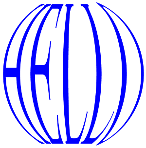
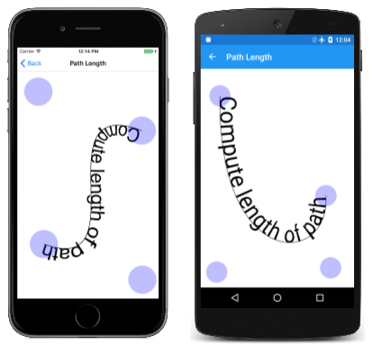
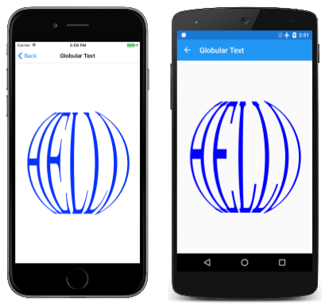

# Path Information and Enumeration

_Get information about paths and enumerate the contents_

The [`SKPath`](xref:SkiaSharp.SKPath) class defines several properties and methods that allow you to obtain information about the path. The [`Bounds`](xref:SkiaSharp.SKPath.Bounds) and [`TightBounds`](xref:SkiaSharp.SKPath.TightBounds) properties (and related methods) obtain the metrical dimensions of a path. The [`Contains`](xref:SkiaSharp.SKPath.Contains(System.Single,System.Single)) method lets you determine if a particular point is within a path.

It is sometimes useful to determine the total length of all the lines and curves that make up a path. Calculating this length is not an algorithmically simple task, so an entire class named [`PathMeasure`](xref:SkiaSharp.SKPathMeasure) is devoted to it.

It is also sometimes useful to obtain all the drawing operations and points that make up a path. At first, this facility might seem unnecessary: If your program has created the path, the program already knows the contents. However, you've seen that paths can also be created by [path effects](effects.md) and by converting [text strings into paths](text-paths.md). You can also obtain all the drawing operations and points that make up these paths. One possibility is to apply an algorithmic transform to all the points, for example, to wrap text around a hemisphere:



## Getting the Path Length

In the article [**Paths and Text**](text-paths.md) you saw how to use the [`DrawTextOnPath`](xref:SkiaSharp.SKCanvas.DrawTextOnPath(System.String,SkiaSharp.SKPath,System.Single,System.Single,SkiaSharp.SKPaint)) method to draw a text string whose baseline follows the course of a path. But what if you want to size the text so that it fits the path precisely? Drawing text around a circle is easy because the circumference of a circle is simple to calculate. But the circumference of an ellipse or the length of a Bézier curve is not so simple.

The [`SKPathMeasure`](xref:SkiaSharp.SKPathMeasure) class can help. The [constructor](xref:SkiaSharp.SKPathMeasure.%23ctor(SkiaSharp.SKPath,System.Boolean,System.Single)) accepts an `SKPath` argument, and the [`Length`](xref:SkiaSharp.SKPathMeasure.Length) property reveals its length.

This class is demonstrated in the **Path Length** sample, which is based on the **Bezier Curve** page. The [**PathLengthPage.xaml**](https://github.com/mono/SkiaSharp/blob/docs/samples/Demos/Demos/SkiaSharpFormsDemos/Curves/PathLengthPage.xaml) file derives from `InteractivePage` and includes a touch interface:

```xaml
<local:InteractivePage xmlns="http://schemas.microsoft.com/dotnet/2021/maui"
                       xmlns:x="http://schemas.microsoft.com/winfx/2009/xaml"
                       xmlns:local="clr-namespace:SkiaSharpFormsDemos"
                       xmlns:skia="clr-namespace:SkiaSharp.Views.Maui.Controls;assembly=SkiaSharp.Views.Maui.Controls"
                       x:Class="SkiaSharpFormsDemos.Curves.PathLengthPage"
                       Title="Path Length">
    <Grid BackgroundColor="White">
        <skia:SKCanvasView x:Name="canvasView"
                           PaintSurface="OnCanvasViewPaintSurface"
                           EnableTouchEvents="True"
                           Touch="OnTouch" />
    </Grid>
</local:InteractivePage>
```

The [**PathLengthPage.xaml.cs**](https://github.com/mono/SkiaSharp/blob/docs/samples/Demos/Demos/SkiaSharpFormsDemos/Curves/PathLengthPage.xaml.cs) code-behind file allows you to move four touch points to define the end points and control points of a cubic Bézier curve. Three fields define a text string, an `SKPaint` object, and a calculated width of the text:

```csharp
public partial class PathLengthPage : InteractivePage
{
    const string text = "Compute length of path";

    static SKPaint textPaint = new SKPaint
    {
        Style = SKPaintStyle.Fill,
        Color = SKColors.Black,
    };

    static SKFont textFont = new SKFont
    {
        Size = 10,
    };

    static readonly float baseTextWidth = textFont.MeasureText(text);
    ...
}
```

The `baseTextWidth` field is the width of the text based on a `Size` setting of 10.

The `PaintSurface` handler draws the Bézier curve and then sizes the text to fit along its full length:

```csharp
void OnCanvasViewPaintSurface(object? sender, SKPaintSurfaceEventArgs args)
{
    SKImageInfo info = args.Info;
    SKSurface surface = args.Surface;
    SKCanvas canvas = surface.Canvas;

    canvas.Clear();

    // Draw path with cubic Bezier curve
    using (SKPath path = new SKPath())
    {
        path.MoveTo(touchPoints[0].Center);
        path.CubicTo(touchPoints[1].Center,
                     touchPoints[2].Center,
                     touchPoints[3].Center);

        canvas.DrawPath(path, strokePaint);

        // Get path length
        SKPathMeasure pathMeasure = new SKPathMeasure(path, false, 1);

        // Find new text size
        textFont.Size = pathMeasure.Length / baseTextWidth * 10;

        // Draw text on path
        canvas.DrawTextOnPath(text, path, 0, 0, textFont, textPaint);
    }
    ...
}
```

The `Length` property of the newly created `SKPathMeasure` object obtains the length of the path. The path length is divided by the `baseTextWidth` value (which is the width of the text based on a font size of 10) and then multiplied by the base font size of 10. The result is a new font size for displaying the text along that path:

[](information-images/pathlength-large.png#lightbox "Triple screenshot of the Path Length page")

As the Bézier curve gets longer or shorter, you can see the text size change.

## Traversing the Path

`SKPathMeasure` can do more than just measure the length of the path. For any value between zero and the path length, an `SKPathMeasure` object can obtain the position on the path, and the tangent to the path curve at that point. The tangent is available as a vector in the form of an `SKPoint` object, or as a rotation encapsulated in an `SKMatrix` object. Here are the methods of `SKPathMeasure` that obtain this information in varied and flexible ways:

```csharp
Boolean GetPosition (Single distance, out SKPoint position)

Boolean GetTangent (Single distance, out SKPoint tangent)

Boolean GetPositionAndTangent (Single distance, out SKPoint position, out SKPoint tangent)

Boolean GetMatrix (Single distance, out SKMatrix matrix, SKPathMeasureMatrixFlags flag)
```

The members of the [`SKPathMeasureMatrixFlags`](xref:SkiaSharp.SKPathMeasureMatrixFlags) enumeration are:

- `GetPosition`
- `GetTangent`
- `GetPositionAndTangent`

The **Unicycle Half-Pipe** page animates a stick figure on a unicycle that seems to ride back and forth along a cubic Bézier curve:

[](information-images/unicyclehalfpipe-large.png#lightbox "Triple screenshot of the Unicycle Half-Pipe page")

The `SKPaint` object used for stroking both the half-pipe and the unicycle is defined as a field in the `UnicycleHalfPipePage` class. Also defined is the `SKPath` object for the unicycle:

```csharp
public class UnicycleHalfPipePage : ContentPage
{
    ...
    SKPaint strokePaint = new SKPaint
    {
        Style = SKPaintStyle.Stroke,
        StrokeWidth = 3,
        Color = SKColors.Black
    };

    SKPath unicyclePath = SKPath.ParseSvgPathData(
        "M 0 0" +
        "A 25 25 0 0 0 0 -50" +
        "A 25 25 0 0 0 0 0 Z" +
        "M 0 -25 L 0 -100" +
        "A 15 15 0 0 0 0 -130" +
        "A 15 15 0 0 0 0 -100 Z" +
        "M -25 -85 L 25 -85");
    ...
}
```

The class contains the standard overrides of the `OnAppearing` and `OnDisappearing` methods for animation. The `PaintSurface` handler creates the path for the half-pipe and then draws it. An `SKPathMeasure` object is then created based on this path:

```csharp
public class UnicycleHalfPipePage : ContentPage
{
    ...
    void OnCanvasViewPaintSurface(object? sender, SKPaintSurfaceEventArgs args)
    {
        SKImageInfo info = args.Info;
        SKSurface surface = args.Surface;
        SKCanvas canvas = surface.Canvas;

        canvas.Clear();

        using (SKPath pipePath = new SKPath())
        {
            pipePath.MoveTo(50, 50);
            pipePath.CubicTo(0, 1.25f * info.Height,
                             info.Width - 0, 1.25f * info.Height,
                             info.Width - 50, 50);

            canvas.DrawPath(pipePath, strokePaint);

            using (SKPathMeasure pathMeasure = new SKPathMeasure(pipePath))
            {
                float length = pathMeasure.Length;

                // Animate t from 0 to 1 every three seconds
                TimeSpan timeSpan = new TimeSpan(DateTime.Now.Ticks);
                float t = (float)(timeSpan.TotalSeconds % 5 / 5);

                // t from 0 to 1 to 0 but slower at beginning and end
                t = (float)((1 - Math.Cos(t * 2 * Math.PI)) / 2);

                SKMatrix matrix;
                pathMeasure.GetMatrix(t * length, out matrix,
                                      SKPathMeasureMatrixFlags.GetPositionAndTangent);

                canvas.SetMatrix(matrix);
                canvas.DrawPath(unicyclePath, strokePaint);
            }
        }
    }
}
```

The `PaintSurface` handler calculates a value of `t` that goes from 0 to 1 every five seconds. It then uses the `Math.Cos` function to convert that to a value of `t` that ranges from 0 to 1 and back to 0, where 0 corresponds to the unicycle at the beginning on the top left, while 1 corresponds to the unicycle at the top right. The cosine function causes the speed to be slowest at the top of the pipe and fastest at the bottom.

Notice that this value of `t` must be multiplied by the path length for the first argument to `GetMatrix`. The matrix is then applied to the `SKCanvas` object for drawing the unicycle path.

## Enumerating the Path

Two embedded classes of `SKPath` allow you to enumerate the contents of path. These classes are [`SKPath.Iterator`](xref:SkiaSharp.SKPath.Iterator) and [`SKPath.RawIterator`](xref:SkiaSharp.SKPath.RawIterator). The two classes are very similar, but `SKPath.Iterator` can eliminate elements in the path with a zero length, or close to a zero length. The `RawIterator` is used in the example below.

You can obtain an object of type `SKPath.RawIterator` by calling the [`CreateRawIterator`](xref:SkiaSharp.SKPath.CreateRawIterator) method of `SKPath`. Enumerating through the path is accomplished by repeatedly calling the [`Next`](xref:SkiaSharp.SKPath.RawIterator.Next*) method. Pass to it an array of four `SKPoint` values:

```csharp
SKPoint[] points = new SKPoint[4];
...
SKPathVerb pathVerb = rawIterator.Next(points);
```

The `Next` method returns a member of the [`SKPathVerb`](xref:SkiaSharp.SKPathVerb) enumeration type. These values indicate the particular drawing command in the path. The number of valid points inserted in the array depends on this verb:

- `Move` with a single point
- `Line` with two points
- `Cubic` with four points
- `Quad` with three points
- `Conic` with three points (and also call the [`ConicWeight`](xref:SkiaSharp.SKPath.RawIterator.ConicWeight*) method for the weight)
- `Close` with one point
- `Done`

The `Done` verb indicates that the path enumeration is complete.

Notice that there are no `Arc` verbs. This indicates that all arcs are converted into Bézier curves when added to the path.

Some of the information in the `SKPoint` array is redundant. For example, if a `Move` verb is followed by a `Line` verb, then the first of the two points that accompany the `Line` is the same as the `Move` point. In practice, this redundancy is very helpful. When you get a `Cubic` verb, it is accompanied by all four points that define the cubic Bézier curve. You don't need to retain the current position established by the previous verb.

The problematic verb, however, is `Close`. This command draws a straight line from the current position to the beginning of the contour established earlier by the `Move` command. Ideally, the `Close` verb should provide these two points rather than just one point. What's worse is that the point accompanying the `Close` verb is always (0, 0). When you enumerate through a path, you'll probably need to retain the `Move` point and the current position.

## Enumerating, Flattening, and Malforming

It is sometimes desirable to apply an algorithmic transform to a path to malform it in some way:


Most of these letters consist of straight lines, yet these straight lines have apparently been twisted into curves. How is this possible?

The key is that the original straight lines are broken into a series of smaller straight lines. These individual smaller straight lines can then be manipulated in different ways to form a curve.

To help with this process, the sample contains a static [`PathExtensions`](https://github.com/mono/SkiaSharp/blob/docs/samples/Demos/Demos/SkiaSharpFormsDemos/Curves/PathExtensions.cs) class with an `Interpolate` method that breaks down a straight line into numerous short lines that are only one unit in length. In addition, the class contains several methods that convert the three types of Bézier curves into a series of tiny straight lines that approximate the curve. (The parametric formulas were presented in the article [**Three Types of Bézier Curves**](beziers.md).) This process is called _flattening_ the curve:

```csharp
static class PathExtensions
{
    ...
    static SKPoint[] Interpolate(SKPoint pt0, SKPoint pt1)
    {
        int count = (int)Math.Max(1, Length(pt0, pt1));
        SKPoint[] points = new SKPoint[count];

        for (int i = 0; i < count; i++)
        {
            float t = (i + 1f) / count;
            float x = (1 - t) * pt0.X + t * pt1.X;
            float y = (1 - t) * pt0.Y + t * pt1.Y;
            points[i] = new SKPoint(x, y);
        }

        return points;
    }

    static SKPoint[] FlattenCubic(SKPoint pt0, SKPoint pt1, SKPoint pt2, SKPoint pt3)
    {
        int count = (int)Math.Max(1, Length(pt0, pt1) + Length(pt1, pt2) + Length(pt2, pt3));
        SKPoint[] points = new SKPoint[count];

        for (int i = 0; i < count; i++)
        {
            float t = (i + 1f) / count;
            float x = (1 - t) * (1 - t) * (1 - t) * pt0.X +
                        3 * t * (1 - t) * (1 - t) * pt1.X +
                        3 * t * t * (1 - t) * pt2.X +
                        t * t * t * pt3.X;
            float y = (1 - t) * (1 - t) * (1 - t) * pt0.Y +
                        3 * t * (1 - t) * (1 - t) * pt1.Y +
                        3 * t * t * (1 - t) * pt2.Y +
                        t * t * t * pt3.Y;
            points[i] = new SKPoint(x, y);
        }

        return points;
    }

    static SKPoint[] FlattenQuadratic(SKPoint pt0, SKPoint pt1, SKPoint pt2)
    {
        int count = (int)Math.Max(1, Length(pt0, pt1) + Length(pt1, pt2));
        SKPoint[] points = new SKPoint[count];

        for (int i = 0; i < count; i++)
        {
            float t = (i + 1f) / count;
            float x = (1 - t) * (1 - t) * pt0.X + 2 * t * (1 - t) * pt1.X + t * t * pt2.X;
            float y = (1 - t) * (1 - t) * pt0.Y + 2 * t * (1 - t) * pt1.Y + t * t * pt2.Y;
            points[i] = new SKPoint(x, y);
        }

        return points;
    }

    static SKPoint[] FlattenConic(SKPoint pt0, SKPoint pt1, SKPoint pt2, float weight)
    {
        int count = (int)Math.Max(1, Length(pt0, pt1) + Length(pt1, pt2));
        SKPoint[] points = new SKPoint[count];

        for (int i = 0; i < count; i++)
        {
            float t = (i + 1f) / count;
            float denominator = (1 - t) * (1 - t) + 2 * weight * t * (1 - t) + t * t;
            float x = (1 - t) * (1 - t) * pt0.X + 2 * weight * t * (1 - t) * pt1.X + t * t * pt2.X;
            float y = (1 - t) * (1 - t) * pt0.Y + 2 * weight * t * (1 - t) * pt1.Y + t * t * pt2.Y;
            x /= denominator;
            y /= denominator;
            points[i] = new SKPoint(x, y);
        }

        return points;
    }

    static double Length(SKPoint pt0, SKPoint pt1)
    {
        return Math.Sqrt(Math.Pow(pt1.X - pt0.X, 2) + Math.Pow(pt1.Y - pt0.Y, 2));
    }
}
```

All these methods are referenced from the extension method `CloneWithTransform` also included in this class and shown below. This method clones a path by enumerating the path commands and constructing a new path based on the data. However, the new path consists only of `MoveTo` and `LineTo` calls. All the curves and straight lines are reduced to a series of tiny lines.

When calling `CloneWithTransform`, you pass to the method a `Func<SKPoint, SKPoint>`, which is a function with an `SKPaint` parameter that returns an `SKPoint` value. This function is called for every point to apply a custom algorithmic transform:

```csharp
static class PathExtensions
{
    public static SKPath CloneWithTransform(this SKPath pathIn, Func<SKPoint, SKPoint> transform)
    {
        SKPath pathOut = new SKPath();

        using (SKPath.RawIterator iterator = pathIn.CreateRawIterator())
        {
            SKPoint[] points = new SKPoint[4];
            SKPathVerb pathVerb = SKPathVerb.Move;
            SKPoint firstPoint = new SKPoint();
            SKPoint lastPoint = new SKPoint();

            while ((pathVerb = iterator.Next(points)) != SKPathVerb.Done)
            {
                switch (pathVerb)
                {
                    case SKPathVerb.Move:
                        pathOut.MoveTo(transform(points[0]));
                        firstPoint = lastPoint = points[0];
                        break;

                    case SKPathVerb.Line:
                        SKPoint[] linePoints = Interpolate(points[0], points[1]);

                        foreach (SKPoint pt in linePoints)
                        {
                            pathOut.LineTo(transform(pt));
                        }

                        lastPoint = points[1];
                        break;

                    case SKPathVerb.Cubic:
                        SKPoint[] cubicPoints = FlattenCubic(points[0], points[1], points[2], points[3]);

                        foreach (SKPoint pt in cubicPoints)
                        {
                            pathOut.LineTo(transform(pt));
                        }

                        lastPoint = points[3];
                        break;

                    case SKPathVerb.Quad:
                        SKPoint[] quadPoints = FlattenQuadratic(points[0], points[1], points[2]);

                        foreach (SKPoint pt in quadPoints)
                        {
                            pathOut.LineTo(transform(pt));
                        }

                        lastPoint = points[2];
                        break;

                    case SKPathVerb.Conic:
                        SKPoint[] conicPoints = FlattenConic(points[0], points[1], points[2], iterator.ConicWeight());

                        foreach (SKPoint pt in conicPoints)
                        {
                            pathOut.LineTo(transform(pt));
                        }

                        lastPoint = points[2];
                        break;

                    case SKPathVerb.Close:
                        SKPoint[] closePoints = Interpolate(lastPoint, firstPoint);

                        foreach (SKPoint pt in closePoints)
                        {
                            pathOut.LineTo(transform(pt));
                        }

                        firstPoint = lastPoint = new SKPoint(0, 0);
                        pathOut.Close();
                        break;
                }
            }
        }
        return pathOut;
    }
    ...
}
```

Because the cloned path is reduced to tiny straight lines, the transform function has the capability of converting straight lines to curves.

Notice that the method retains the first point of each contour in the variable called `firstPoint` and the current position after each drawing command in the variable `lastPoint`. These variables are necessary to construct the final closing line when a `Close` verb is encountered.

The **GlobularText** sample uses this extension method to seemingly wrap text around a hemisphere in a 3D effect:

[](information-images/globulartext-large.png#lightbox "Triple screenshot of the Globular Text page")

The [`GlobularTextPage`](https://github.com/mono/SkiaSharp/blob/docs/samples/Demos/Demos/SkiaSharpFormsDemos/Curves/GlobularTextPage.cs) class constructor performs this transform. It creates an `SKFont` object for the text, and then obtains an `SKPath` object from the `GetTextPath` method. This is the path passed to the `CloneWithTransform` extension method along with a transform function:

```csharp
public class GlobularTextPage : ContentPage
{
    SKPath globePath;

    public GlobularTextPage()
    {
        Title = "Globular Text";

        SKCanvasView canvasView = new SKCanvasView();
        canvasView.PaintSurface += OnCanvasViewPaintSurface;
        Content = canvasView;

        using (SKFont textFont = new SKFont())
        {
            textFont.Typeface = SKTypeface.FromFamilyName("Times New Roman");
            textFont.Size = 100;

            using (SKPath textPath = textFont.GetTextPath("HELLO", new SKPoint(0, 0)))
            {
                SKRect textPathBounds;
                textPath.GetBounds(out textPathBounds);

                globePath = textPath.CloneWithTransform((SKPoint pt) =>
                {
                    double longitude = (Math.PI / textPathBounds.Width) *
                                            (pt.X - textPathBounds.Left) - Math.PI / 2;
                    double latitude = (Math.PI / textPathBounds.Height) *
                                            (pt.Y - textPathBounds.Top) - Math.PI / 2;

                    longitude *= 0.75;
                    latitude *= 0.75;

                    float x = (float)(Math.Cos(latitude) * Math.Sin(longitude));
                    float y = (float)Math.Sin(latitude);

                    return new SKPoint(x, y);
                });
            }
        }
    }
    ...
}
```

The transform function first calculates two values named `longitude` and `latitude` that range from –π/2 at the top and left of the text, to π/2 at the right and bottom of the text. The range of these values isn't visually satisfactory, so they are reduced by multiplying by 0.75. (Try the code without those adjustments. The text becomes too obscure at the north and south poles, and too thin at the sides.) These three-dimensional spherical coordinates are converted to two-dimensional `x` and `y` coordinates by standard formulas.

The new path is stored as a field. The `PaintSurface` handler then merely needs to center and scale the path to display it on the screen:

```csharp
public class GlobularTextPage : ContentPage
{
    SKPath globePath;
    ...
    void OnCanvasViewPaintSurface(object? sender, SKPaintSurfaceEventArgs args)
    {
        SKImageInfo info = args.Info;
        SKSurface surface = args.Surface;
        SKCanvas canvas = surface.Canvas;

        canvas.Clear();

        using (SKPaint pathPaint = new SKPaint())
        {
            pathPaint.Style = SKPaintStyle.Fill;
            pathPaint.Color = SKColors.Blue;
            pathPaint.StrokeWidth = 3;
            pathPaint.IsAntialias = true;

            canvas.Translate(info.Width / 2, info.Height / 2);
            canvas.Scale(0.45f * Math.Min(info.Width, info.Height));     // radius
            canvas.DrawPath(globePath, pathPaint);
        }
    }
}
```

This is a very versatile technique. If the array of path effects described in the [**Path Effects**](effects.md) article doesn't quite encompass something you felt should be included, this is a way to fill in the gaps.

## Related Links

- [SkiaSharp APIs](/dotnet/api/skiasharp)
