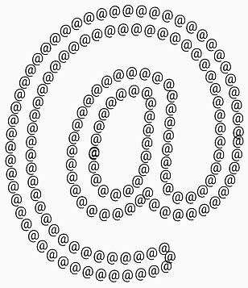
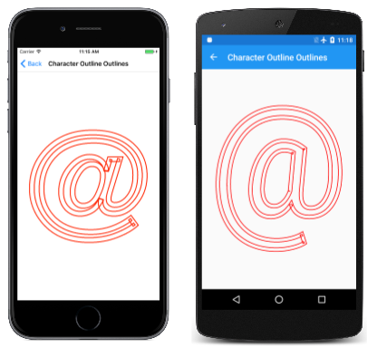

# Paths and Text in SkiaSharp

_Explore the intersection of paths and text_

In modern graphics systems, text fonts are collections of character outlines, usually defined by quadratic Bézier curves. Consequently, many modern graphics systems include a facility to convert text characters into a graphics path.

You've already seen that you can stroke the outlines of text characters as well as fill them. This allows you to display these character outlines with a particular stroke width and even a path effect as described in the [**Path Effects**](effects.md) article. But it is also possible to convert a character string into an `SKPath` object. This means that text outlines can be used for clipping with techniques that were described in the [**Clipping with Paths and Regions**](clipping.md) article.

Besides using a path effect to stroke a character outline, you can also create path effects that are based on a path that is derived from a character string, and you can even combine the two effects:



In the previous article on [**Path Effects**](effects.md), you saw how the [`GetFillPath`](xref:SkiaSharp.SKPaint.GetFillPath(SkiaSharp.SKPath,SkiaSharp.SKPath,SkiaSharp.SKRect,System.Single)) method of `SKPaint` can obtain an outline of a stroked path. You can also use this method with paths derived from character outlines.

Finally, this article demonstrates another intersection of paths and text: The [`DrawTextOnPath`](xref:SkiaSharp.SKCanvas.DrawTextOnPath(System.String,SkiaSharp.SKPath,System.Single,System.Single,SkiaSharp.SKPaint)) method of `SKCanvas` allows you to display a text string so that the baseline of the text follows a curved path.

## Text to Path Conversion

The [`GetTextPath`](xref:SkiaSharp.SKPaint.GetTextPath(System.String,System.Single,System.Single)) method of `SKPaint` converts a character string to an `SKPath` object:

```csharp
public SKPath GetTextPath (String text, Single x, Single y)
```

The `x` and `y` arguments indicate the starting point of the baseline of the left side of the text. They play the same role here as in the `DrawText` method of `SKCanvas`. Within the path, the baseline of the left side of the text will have the coordinates (x, y).

The `GetTextPath` method is overkill if you merely want to fill or stroke the resultant path. The normal `DrawText` method allows you to do that. The `GetTextPath` method is more useful for other tasks involving paths.

One of these tasks is clipping. The **Clipping Text** page creates a clipping path based on the character outlines of the word "CODE." This path is stretched to the size of the page to clip a bitmap that contains an image of the **Clipping Text** source code:

[](text-paths-images/clippingtext-large.png#lightbox "Triple screenshot of the Clipping Text page")

The [`ClippingTextPage`](https://github.com/mono/SkiaSharp/blob/docs/samples/Demos/Demos/SkiaSharpFormsDemos/Curves/ClippingTextPage.cs) class constructor loads the bitmap that is stored as an embedded resource in the **Media** folder of the solution:

```csharp
public class ClippingTextPage : ContentPage
{
    SKBitmap bitmap;

    public ClippingTextPage()
    {
        Title = "Clipping Text";

        SKCanvasView canvasView = new SKCanvasView();
        canvasView.PaintSurface += OnCanvasViewPaintSurface;
        Content = canvasView;

        string resourceID = "SkiaSharpFormsDemos.Media.PageOfCode.png";
        Assembly assembly = GetType().GetTypeInfo().Assembly;

        using (Stream stream = assembly.GetManifestResourceStream(resourceID))
        {
            bitmap = SKBitmap.Decode(stream);
        }
    }
    ...
}
```

The `PaintSurface` handler begins by creating an `SKPaint` object suitable for text. The `Typeface` property is set as well as the `TextSize`, although for this particular application the `TextSize` property is purely arbitrary. Also notice there is no `Style` setting.

The `TextSize` and `Style` property settings are not necessary because this `SKPaint` object is used solely for the `GetTextPath` call using the text string "CODE". The handler then measures the resultant `SKPath` object and applies three transforms to center it and scale it to the size of the page. The path can then be set as the clipping path:

```csharp
public class ClippingTextPage : ContentPage
{
    ...
    void OnCanvasViewPaintSurface(object sender, SKPaintSurfaceEventArgs args)
    {
        SKImageInfo info = args.Info;
        SKSurface surface = args.Surface;
        SKCanvas canvas = surface.Canvas;

        canvas.Clear(SKColors.Blue);

        using (SKPaint paint = new SKPaint())
        {
            paint.Typeface = SKTypeface.FromFamilyName(null, SKTypefaceStyle.Bold);
            paint.TextSize = 10;

            using (SKPath textPath = paint.GetTextPath("CODE", 0, 0))
            {
                // Set transform to center and enlarge clip path to window height
                SKRect bounds;
                textPath.GetTightBounds(out bounds);

                canvas.Translate(info.Width / 2, info.Height / 2);
                canvas.Scale(info.Width / bounds.Width, info.Height / bounds.Height);
                canvas.Translate(-bounds.MidX, -bounds.MidY);

                // Set the clip path
                canvas.ClipPath(textPath);
            }
        }

        // Reset transforms
        canvas.ResetMatrix();

        // Display bitmap to fill window but maintain aspect ratio
        SKRect rect = new SKRect(0, 0, info.Width, info.Height);
        canvas.DrawBitmap(bitmap,
            rect.AspectFill(new SKSize(bitmap.Width, bitmap.Height)));
    }
}
```

Once the clipping path is set, the bitmap can be displayed, and it will be clipped to the character outlines. Notice the use of the [`AspectFill`](xref:SkiaSharp.SKRect.AspectFill(SkiaSharp.SKSize)) method of `SKRect` that calculates a rectangle for filling the page while preserving the aspect ratio.

The **Text Path Effect** page converts a single ampersand character to a path to create a 1D path effect. A paint object with this path effect is then used to stroke the outline of a larger version of that same character:

[](text-paths-images/textpatheffect-large.png#lightbox "Triple screenshot of the Text Path Effect page")

Much of the work in the [`TextPathEffectPath`](https://github.com/mono/SkiaSharp/blob/docs/samples/Demos/Demos/SkiaSharpFormsDemos/Curves/TextPathEffectPage.cs) class occurs in the fields and constructor. The two `SKPaint` objects defined as fields are used for two different purposes: The first (named `textPathPaint`) is used to convert the ampersand with a `TextSize` of 50 to a path for the 1D path effect. The second (`textPaint`) is used to display the larger version of the ampersand with that path effect. For that reason, the `Style` of this second paint object is set to `Stroke`, but the `StrokeWidth` property is not set because that property isn't necessary when using a 1D path effect:

```csharp
public class TextPathEffectPage : ContentPage
{
    const string character = "@";
    const float littleSize = 50;

    SKPathEffect pathEffect;

    SKPaint textPathPaint = new SKPaint
    {
        TextSize = littleSize
    };

    SKPaint textPaint = new SKPaint
    {
        Style = SKPaintStyle.Stroke,
        Color = SKColors.Black
    };

    public TextPathEffectPage()
    {
        Title = "Text Path Effect";

        SKCanvasView canvasView = new SKCanvasView();
        canvasView.PaintSurface += OnCanvasViewPaintSurface;
        Content = canvasView;

        // Get the bounds of textPathPaint
        SKRect textPathPaintBounds = new SKRect();
        textPathPaint.MeasureText(character, ref textPathPaintBounds);

        // Create textPath centered around (0, 0)
        SKPath textPath = textPathPaint.GetTextPath(character,
                                                    -textPathPaintBounds.MidX,
                                                    -textPathPaintBounds.MidY);
        // Create the path effect
        pathEffect = SKPathEffect.Create1DPath(textPath, littleSize, 0,
                                               SKPath1DPathEffectStyle.Translate);
    }
    ...
}
```

The constructor first uses the `textPathPaint` object to measure the ampersand with a `TextSize` of 50. The negatives of the center coordinates of that rectangle are then passed to the `GetTextPath` method to convert the text to a path. The resultant path has the (0, 0) point in the center of the character, which is ideal for a 1D path effect.

You might think that the `SKPathEffect` object created at the end of the constructor could be set to the `PathEffect` property of `textPaint` rather than saved as a field. But this turned out not to work very well because it distorted the results of the `MeasureText` call in the `PaintSurface` handler:

```csharp
public class TextPathEffectPage : ContentPage
{
    ...
    void OnCanvasViewPaintSurface(object sender, SKPaintSurfaceEventArgs args)
    {
        SKImageInfo info = args.Info;
        SKSurface surface = args.Surface;
        SKCanvas canvas = surface.Canvas;

        canvas.Clear();

        // Set textPaint TextSize based on screen size
        textPaint.TextSize = Math.Min(info.Width, info.Height);

        // Do not measure the text with PathEffect set!
        SKRect textBounds = new SKRect();
        textPaint.MeasureText(character, ref textBounds);

        // Coordinates to center text on screen
        float xText = info.Width / 2 - textBounds.MidX;
        float yText = info.Height / 2 - textBounds.MidY;

        // Set the PathEffect property and display text
        textPaint.PathEffect = pathEffect;
        canvas.DrawText(character, xText, yText, textPaint);
    }
}
```

That `MeasureText` call is used to center the character on the page. To avoid problems, the `PathEffect` property is set to the paint object after the text has been measured but before it is displayed.

## Outlines of Character Outlines

Normally the [`GetFillPath`](xref:SkiaSharp.SKPaint.GetFillPath(SkiaSharp.SKPath,SkiaSharp.SKPath,SkiaSharp.SKRect,System.Single)) method of `SKPaint` converts one path to another by applying  paint properties, most notably the stroke width and path effect. When used without path effects, `GetFillPath` effectively creates a path that outlines another path. This was demonstrated in the **Tap to Outline the Path** page in the [**Path Effects**](effects.md) article.

You can also call `GetFillPath` on the path returned from `GetTextPath` but at first you might not be entirely sure what that would look like.

The **Character Outline Outlines** page demonstrates the technique. All the relevant code is in the `PaintSurface` handler of the [`CharacterOutlineOutlinesPage`](https://github.com/mono/SkiaSharp/blob/docs/samples/Demos/Demos/SkiaSharpFormsDemos/Curves/CharacterOutlineOutlinesPage.cs) class.

The constructor begins by creating an `SKPaint` object named `textPaint` with a `TextSize` property based on the size of the page. This is converted to a path using the `GetTextPath` method. The coordinate arguments to `GetTextPath` effectively center the path on the screen:

```csharp
void OnCanvasViewPaintSurface(object sender, SKPaintSurfaceEventArgs args)
{
    SKImageInfo info = args.Info;
    SKSurface surface = args.Surface;
    SKCanvas canvas = surface.Canvas;

    canvas.Clear();

    using (SKPaint textPaint = new SKPaint())
    {
        // Set Style for the character outlines
        textPaint.Style = SKPaintStyle.Stroke;

        // Set TextSize based on screen size
        textPaint.TextSize = Math.Min(info.Width, info.Height);

        // Measure the text
        SKRect textBounds = new SKRect();
        textPaint.MeasureText("@", ref textBounds);

        // Coordinates to center text on screen
        float xText = info.Width / 2 - textBounds.MidX;
        float yText = info.Height / 2 - textBounds.MidY;

        // Get the path for the character outlines
        using (SKPath textPath = textPaint.GetTextPath("@", xText, yText))
        {
            // Create a new path for the outlines of the path
            using (SKPath outlinePath = new SKPath())
            {
                // Convert the path to the outlines of the stroked path
                textPaint.StrokeWidth = 25;
                textPaint.GetFillPath(textPath, outlinePath);

                // Stroke that new path
                using (SKPaint outlinePaint = new SKPaint())
                {
                    outlinePaint.Style = SKPaintStyle.Stroke;
                    outlinePaint.StrokeWidth = 5;
                    outlinePaint.Color = SKColors.Red;

                    canvas.DrawPath(outlinePath, outlinePaint);
                }
            }
        }
    }
}
```

The `PaintSurface` handler then creates a new path named `outlinePath`. This becomes the destination path in the call to `GetFillPath`. The `StrokeWidth` property of 25 causes `outlinePath` to describe the outline of a 25-pixel-wide path stroking the text characters. This path is then displayed in red with a stroke width of 5:

[](text-paths-images/characteroutlineoutlines-large.png#lightbox "Triple screenshot of the Character Outline Outlines page")

Look closely and you'll see overlaps where the path outline makes a sharp corner. These are normal artifacts of this process.

## Text Along a Path

Text is normally displayed on a horizontal baseline. Text can be rotated to run vertically or diagonally, but the baseline is still a straight line.

There are times, however, when you want text to run along a curve. This is the purpose of the [`DrawTextOnPath`](xref:SkiaSharp.SKCanvas.DrawTextOnPath(System.String,SkiaSharp.SKPath,System.Single,System.Single,SkiaSharp.SKPaint)) method of `SKCanvas`:

```csharp
public Void DrawTextOnPath (String text, SKPath path, Single hOffset, Single vOffset, SKPaint paint)
```

The text specified in the first argument is made to run along the path specified as the second argument. You can begin the text at an offset from the beginning of the path with the `hOffset` argument. Normally the path forms the baseline of the text: Text ascenders are on one side of the path, and text descenders are on the other. But you can offset the text baseline from the path with the `vOffset` argument.

This method has no facility to provide guidance on setting the `TextSize` property of `SKPaint` to make the text sized perfectly to run from the beginning of the path to the end. Sometimes you can figure out that text size on your own. Other times you'll need to use path-measuring functions to be described in the next article on [**Path Information and Enumeration**](information.md).

The **Circular Text** program wraps text around a circle. It's easy to determine the circumference of a circle, so it's easy to size the text to fit exactly. The `PaintSurface` handler of the [`CircularTextPage`](https://github.com/mono/SkiaSharp/blob/docs/samples/Demos/Demos/SkiaSharpFormsDemos/Curves/CircularTextPage.cs) class calculates a radius of a circle based on the size of the page. That circle becomes `circularPath`:

```csharp
public class CircularTextPage : ContentPage
{
    const string text = "xt in a circle that shapes the te";
    ...
    void OnCanvasViewPaintSurface(object sender, SKPaintSurfaceEventArgs args)
    {
        SKImageInfo info = args.Info;
        SKSurface surface = args.Surface;
        SKCanvas canvas = surface.Canvas;

        canvas.Clear();

        using (SKPath circularPath = new SKPath())
        {
            float radius = 0.35f * Math.Min(info.Width, info.Height);
            circularPath.AddCircle(info.Width / 2, info.Height / 2, radius);

            using (SKPaint textPaint = new SKPaint())
            {
                textPaint.TextSize = 100;
                float textWidth = textPaint.MeasureText(text);
                textPaint.TextSize *= 2 * 3.14f * radius / textWidth;

                canvas.DrawTextOnPath(text, circularPath, 0, 0, textPaint);
            }
        }
    }
}
```

The `TextSize` property of `textPaint` is then adjusted so that the text width matches the circumference of the circle:

[](text-paths-images/circulartext-large.png#lightbox "Triple screenshot of the Circular Text page")

The text itself was chosen to be somewhat circular as well: The word "circle" is both the subject of the sentence and the object of a prepositional phrase.

## Related Links

- [SkiaSharp APIs](/dotnet/api/skiasharp)
