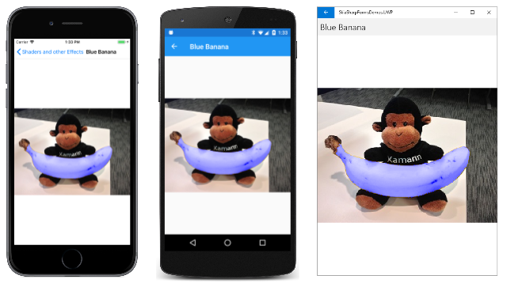

# The non-separable blend modes

As you saw in the article [**SkiaSharp separable blend modes**](separable.md), the separable blend modes perform operations on the red, green, and blue channels separately. The non-separable blend modes do not. By operating upon the Hue, Saturation, and Luminosity levels of color, the non-separable blend modes can alter colors in interesting ways:


## The Hue-Saturation-Luminosity model

To understand the non-separable blend modes, it is necessary to treat the destination and source pixels as colors in the Hue-Saturation-Luminosity model. (Luminosity is also referred to as Lightness.)

The HSL color model was discussed in the article [**Integrating with .NET MAUI**](../../basics/integration.md) and a sample program in that article allows experimentation with HSL colors. You can create an `SKColor` value using Hue, Saturation, and Luminosity values with the static [`SKColor.FromHsl`](xref:SkiaSharp.SKColor.FromHsl*) method.

The Hue represents the dominant wavelength of the color. Hue values range from 0 to 360 and cycle through the additive and subtractive primaries: Red is the value 0, yellow is 60, green is 120, cyan is 180, blue is 240, magenta is 300, and the cycle goes back to red at 360.

If there is no dominant color &mdash; for example, the color is white or black or a gray shade &mdash; then the Hue is undefined and usually set to 0.

The Saturation values can range from 0 to 100 and indicate the purity of the color. A Saturation value of 100 is the purest color while values lower than 100 cause the color to become more grayish. A Saturation value of 0 results in a shade of gray.

The Luminosity (or Lightness) value indicates how bright the color is. A Luminosity value of 0 is black regardless of the other settings. Similarly, a Luminosity value of 100 is white.

The HSL value (0, 100, 50) is the RGB value (FF, 00, 00), which is pure red. The HSL value (180, 100, 50) is the RGB value (00, FF, FF), pure cyan. As the Saturation is decreased, the dominant color component is decreased and the other components are increased. At a Saturation level of 0, all the components are the same and the color is a gray shade. Decrease the Luminosity to go to black; increase the Luminosity to go to white.

## The blend modes in detail

Like the other blend modes, the four non-separable blend modes involve a destination (which is often a bitmap image) and a source, which is often a single color or a gradient. The blend modes combine Hue, Saturation, and Luminosity values from the destination and the source:

| Blend Mode   | Components from source | Components from destination |
| ------------ | ---------------------- | --------------------------- |
| `Hue`        | Hue                    | Saturation and Luminosity   |
| `Saturation` | Saturation             | Hue and Luminosity          |
| `Color`      | Hue and Saturation     | Luminosity                  |
| `Luminosity` | Luminosity             | Hue and Saturation          |

See the W3C [**Compositing and Blending Level 1**](https://www.w3.org/TR/compositing-1/) specification for the algorithms.

The **Non-Separable Blend Modes** page contains a `Picker` to select one of these blend modes and three `Slider` views to select an HSL color:

```xaml
<ContentPage xmlns="http://xamarin.com/schemas/2014/forms"
             xmlns:x="http://schemas.microsoft.com/winfx/2009/xaml"
             xmlns:skia="clr-namespace:SkiaSharp;assembly=SkiaSharp"
             xmlns:skiaviews="clr-namespace:SkiaSharp.Views.Maui.Controls;assembly=SkiaSharp.Views.Maui.Controls"
             x:Class="SkiaSharpFormsDemos.Effects.NonSeparableBlendModesPage"
             Title="Non-Separable Blend Modes">

    <StackLayout>
        <skiaviews:SKCanvasView x:Name="canvasView"
                                VerticalOptions="FillAndExpand"
                                PaintSurface="OnCanvasViewPaintSurface" />

        <Picker x:Name="blendModePicker"
                Title="Blend Mode"
                Margin="10, 0"
                SelectedIndexChanged="OnPickerSelectedIndexChanged">
            <Picker.ItemsSource>
                <x:Array Type="{x:Type skia:SKBlendMode}">
                    <x:Static Member="skia:SKBlendMode.Hue" />
                    <x:Static Member="skia:SKBlendMode.Saturation" />
                    <x:Static Member="skia:SKBlendMode.Color" />
                    <x:Static Member="skia:SKBlendMode.Luminosity" />
                </x:Array>
            </Picker.ItemsSource>

            <Picker.SelectedIndex>
                0
            </Picker.SelectedIndex>
        </Picker>

        <Slider x:Name="hueSlider"
                Maximum="360"
                Margin="10, 0"
                ValueChanged="OnSliderValueChanged" />

        <Slider x:Name="satSlider"
                Maximum="100"
                Margin="10, 0"
                ValueChanged="OnSliderValueChanged" />

        <Slider x:Name="lumSlider"
                Maximum="100"
                Margin="10, 0"
                ValueChanged="OnSliderValueChanged" />

        <StackLayout Orientation="Horizontal">
            <Label x:Name="hslLabel"
                   HorizontalOptions="CenterAndExpand" />

            <Label x:Name="rgbLabel"
                   HorizontalOptions="CenterAndExpand" />

        </StackLayout>
    </StackLayout>
</ContentPage>
```

To save space, the three `Slider` views are not identified in the user interface of the program. You'll need to remember that the order is Hue, Saturation, and Luminosity. Two `Label` views at the bottom of the page show the HSL and RGB color values.

The code-behind file loads one of the bitmap resources, displays that as large as possible on the canvas, and then covers the canvas with a rectangle. The rectangle color is based on the three `Slider` views and the blend mode is the one selected in the `Picker`:

```csharp
public partial class NonSeparableBlendModesPage : ContentPage
{
    SKBitmap bitmap = BitmapExtensions.LoadBitmapResource(
                        typeof(NonSeparableBlendModesPage),
                        "SkiaSharpFormsDemos.Media.Banana.jpg");
    SKColor color;

    public NonSeparableBlendModesPage()
    {
        InitializeComponent();
    }

    void OnPickerSelectedIndexChanged(object sender, EventArgs args)
    {
        canvasView.InvalidateSurface();
    }

    void OnSliderValueChanged(object sender, ValueChangedEventArgs e)
    {
        // Calculate new color based on sliders
        color = SKColor.FromHsl((float)hueSlider.Value,
                                (float)satSlider.Value,
                                (float)lumSlider.Value);

        // Use labels to display HSL and RGB color values
        color.ToHsl(out float hue, out float sat, out float lum);

        hslLabel.Text = String.Format("HSL = {0:F0} {1:F0} {2:F0}",
                                      hue, sat, lum);

        rgbLabel.Text = String.Format("RGB = {0:X2} {1:X2} {2:X2}",
                                      color.Red, color.Green, color.Blue);

        canvasView.InvalidateSurface();
    }

    void OnCanvasViewPaintSurface(object sender, SKPaintSurfaceEventArgs args)
    {
        SKImageInfo info = args.Info;
        SKSurface surface = args.Surface;
        SKCanvas canvas = surface.Canvas;

        canvas.Clear();
        canvas.DrawBitmap(bitmap, info.Rect, BitmapStretch.Uniform);

        // Get blend mode from Picker
        SKBlendMode blendMode =
            (SKBlendMode)(blendModePicker.SelectedIndex == -1 ?
                                        0 : blendModePicker.SelectedItem);

        using (SKPaint paint = new SKPaint())
        {
            paint.Color = color;
            paint.BlendMode = blendMode;
            canvas.DrawRect(info.Rect, paint);
        }
    }
}
```

Notice that the program does not display the HSL color value as selected by the three sliders. Instead, it creates a color value from those sliders and then uses the [`ToHsl`](xref:SkiaSharp.SKColor.ToHsl*) method to obtain the Hue, Saturation, and Luminosity values. This is because the `FromHsl` method converts an HSL color to an RGB color, which is stored internally in the `SKColor` structure. The `ToHsl` method converts from RGB to HSL, but the result will not always be the original value.

For example, `FromHsl` converts the HSL value (180, 50, 0) to the RGB color (0, 0, 0) because the `Luminosity` is zero. The `ToHsl` method converts the RGB color (0, 0, 0) to the HSL color (0, 0, 0) because the Hue and Saturation values are irrelevant. When using this program, it is better that you see the representation of the HSL color that the program is using rather than the one you specified with the sliders.

The `SKBlendModes.Hue` blend mode uses the Hue level of the source while retaining the Saturation and Luminosity levels of the destination. When you test this blend mode, the saturation and luminosity sliders must be set to something other than 0 or 100 because in those cases, the Hue is not uniquely defined.

[](non-separable-images/NonSeparableBlendModes-Hue-Large.png#lightbox)

When you use set the slider to 0 (as with the iOS screenshot at the left), everything turns reddish. But this does not mean that the image is entirely absent of green and blue. Obviously there are still gray shades present in the result. For example, the RGB color (40, 40, C0) is equivalent to the HSL color (240, 50, 50). The Hue is blue, but the saturation value of 50 indicates that there are red and green components as well. If the Hue is set to 0 with `SKBlendModes.Hue`, the HSL color is (0, 50, 50), which is the RGB color (C0, 40, 40). There are still blue and green components but now the dominant component is red.

The `SKBlendModes.Saturation` blend mode combines the Saturation level of the source with the Hue and Luminosity of the destination. Like the Hue, the Saturation is not well defined if the Luminosity is 0 or 100. In theory, any Luminosity setting between those two extremes should work. However, the Luminosity setting seems to affect the result more than it should. Set the luminosity to 50, and you can see how you can set the Saturation level of the picture:

[](non-separable-images/NonSeparableBlendModes-Saturation-Large.png#lightbox)

You can use this blend mode to increase the color Saturation of a dull image, or you can decrease the Saturation down to zero (as in the iOS screenshot at the left) for a resultant image composed of only gray shades.

The `SKBlendModes.Color` blend mode retains the Luminosity of the destination but uses the Hue and Saturation of the source. Again, that implies that any setting of the Luminosity slider somewhere between the extremes should work.

[](non-separable-images/NonSeparableBlendModes-Color-Large.png#lightbox)

You'll see an application of this blend mode shortly.

Finally, the `SKBlendModes.Luminosity` blend mode is the opposite of `SKBlendModes.Color`. It retains the Hue and Saturation of the destination but uses the Luminosity of the source. The `Luminosity` blend mode is the most mysterious of the batch: The Hue and Saturation sliders affect the image, but even at medium Luminosity, the image is not distinct:

[](non-separable-images/NonSeparableBlendModes-Luminosity-Large.png#lightbox)

In theory, increasing or decreasing the Luminosity of an image should make it lighter or darker. This [Luminosity property example](https://jetbrains.github.io/skiko/skiko/org.jetbrains.skia/-blend-mode/-l-u-m-i-n-o-s-i-t-y/index.html) or this [SKBlendMode Enum define](/dotnet/api/SkiaSharp.SKBlendMode?view=skiasharp-2.80.2&preserve-view=true) may be of interest.

It is generally not the case that you'll want to use one of the non-separable blend modes with a source that consists of a single color applied to the entire destination image. The effect is just too great. You'll want to restrict the effect to one part of the image. In that case, the source will probably incorporate transparancy, or perhaps the source will be limited to a smaller graphic.

## A matte for a separable mode

Here's one of the bitmaps included as a resource in the sample. The filename is **Banana.jpg**:


It's possible to create a matte that encompasses just the banana. This is also a resource in the sample. The filename is **BananaMatte.png**:


Aside from the black banana shape, the rest of the bitmap is transparent.

The **Blue Banana** page uses that matte to alter the Hue and Saturation of the banana that the monkey is holding, but to change nothing else in the image.

In the following `BlueBananaPage` class, the **Banana.jpg** bitmap is loaded as a field. The constructor loads the **BananaMatte.png** bitmap as the `matteBitmap` object, but it does not retain that object beyond the constructor. Instead, a third bitmap named `blueBananaBitmap` is created. The `matteBitmap` is drawn on `blueBananaBitmap` followed by an `SKPaint` with its `Color` set to blue and its `BlendMode` set to `SKBlendMode.SrcIn`. The `blueBananaBitmap` remains mostly transparent but with a solid pure blue image of the banana:

```csharp
public class BlueBananaPage : ContentPage
{
    SKBitmap bitmap = BitmapExtensions.LoadBitmapResource(
        typeof(BlueBananaPage),
        "SkiaSharpFormsDemos.Media.Banana.jpg");

    SKBitmap blueBananaBitmap;

    public BlueBananaPage()
    {
        Title = "Blue Banana";

        // Load banana matte bitmap (black on transparent)
        SKBitmap matteBitmap = BitmapExtensions.LoadBitmapResource(
            typeof(BlueBananaPage),
            "SkiaSharpFormsDemos.Media.BananaMatte.png");

        // Create a bitmap with a solid blue banana and transparent otherwise
        blueBananaBitmap = new SKBitmap(matteBitmap.Width, matteBitmap.Height);

        using (SKCanvas canvas = new SKCanvas(blueBananaBitmap))
        {
            canvas.Clear();
            canvas.DrawBitmap(matteBitmap, new SKPoint(0, 0));

            using (SKPaint paint = new SKPaint())
            {
                paint.Color = SKColors.Blue;
                paint.BlendMode = SKBlendMode.SrcIn;
                canvas.DrawPaint(paint);
            }
        }

        SKCanvasView canvasView = new SKCanvasView();
        canvasView.PaintSurface += OnCanvasViewPaintSurface;
        Content = canvasView;
    }

    void OnCanvasViewPaintSurface(object sender, SKPaintSurfaceEventArgs args)
    {
        SKImageInfo info = args.Info;
        SKSurface surface = args.Surface;
        SKCanvas canvas = surface.Canvas;

        canvas.Clear();

        canvas.DrawBitmap(bitmap, info.Rect, BitmapStretch.Uniform);

        using (SKPaint paint = new SKPaint())
        {
            paint.BlendMode = SKBlendMode.Color;
            canvas.DrawBitmap(blueBananaBitmap,
                              info.Rect,
                              BitmapStretch.Uniform,
                              paint: paint);
        }
    }
}
```

The `PaintSurface` handler draws the bitmap with the monkey holding the banana. This code is followed by the display of `blueBananaBitmap` with `SKBlendMode.Color`. Over the surface of the banana, each pixel's Hue and Saturation is replaced by the solid blue, which corresponds to a hue value of 240 and a saturation value of 100. The Luminosity, however, remains the same, which means the banana continues to have a realistic texture despite its new color:

[](non-separable-images/BlueBanana-Large.png#lightbox)

Try changing the blend mode to `SKBlendMode.Saturation`. The banana remains yellow but it's a more intense yellow. In a real-life application, this might be a more desirable effect than turning the banana blue.

## Related links

- [SkiaSharp APIs](/dotnet/api/skiasharp)
