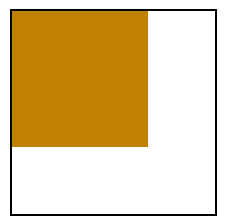
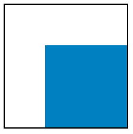
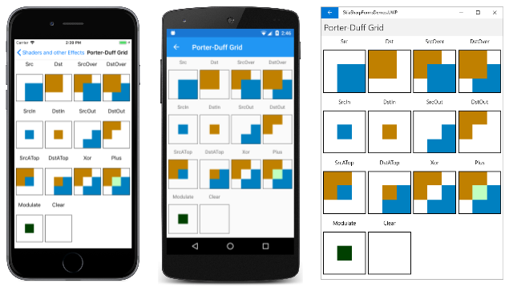
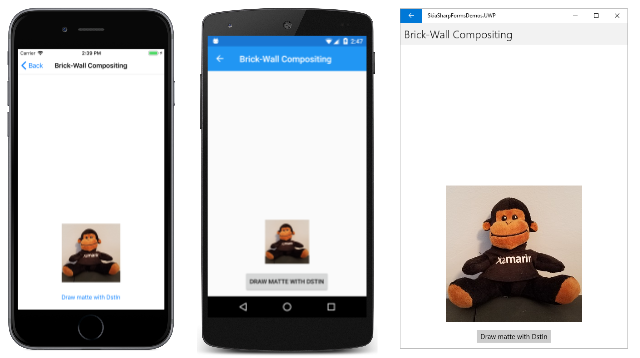
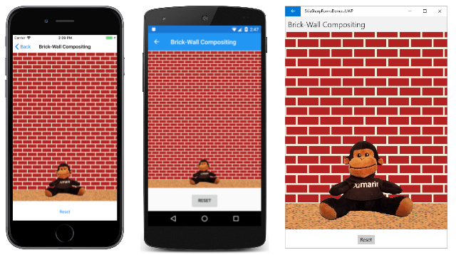
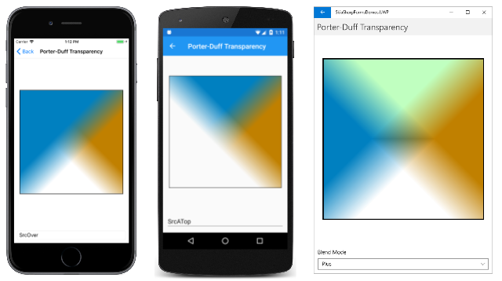

# Porter-Duff blend modes

The Porter-Duff blend modes are named after Thomas Porter and Tom Duff, who developed an algebra of compositing while working for Lucasfilm. Their paper [_Compositing Digital Images_](https://graphics.pixar.com/library/Compositing/paper.pdf) was published in the July 1984 issue of _Computer Graphics_, pages 253 to 259. These blend modes are essential for compositing, which is assembling various images into a composite scene:


## Porter-Duff concepts

Suppose a brownish rectangle occupies the left and top two-thirds of your display surface:



This area is called the _destination_ or sometimes the _background_ or _backdrop_.

You wish to draw the following rectangle, which is the same size of the destination. The rectangle is transparent except for a bluish area that occupies the right and bottom two-thirds:



This is called the _source_ or sometimes the _foreground_.

When you display the source on the destination, here's what you expect:


The transparent pixels of the source allow the background to show through, while the bluish source pixels obscure the background. That's the normal case, and it is referred to in SkiaSharp as `SKBlendMode.SrcOver`. That value is the default setting of the `BlendMode` property when an `SKPaint` object is first instantiated.

However, it's possible to specify a different blend mode for a different effect. If you specify `SKBlendMode.DstOver`, then in the area where the source and destination intersect, the destination appears instead of the source:


The `SKBlendMode.DstIn` blend mode displays only the area where the destination and source intersect using the destination color:


The blend mode of `SKBlendMode.Xor` (exclusive OR) causes nothing to appear where the two areas overlap:


The colored destination and source rectangles effectively divide the display surface into four unique areas that can be colored in various ways corresponding to the presence of the destination and source rectangles:


The upper-right and lower-left rectangles are always blank because both the destination and source are transparent in those areas. The destination color occupies the upper-left area, so that area can either be colored with the destination color or not at all. Similarly, the source color occupies the lower-right area, so that area can be colored with the source color or not at all. The intersection of the destination and source in the middle can be colored with the destination color, the source color, or not at all.

The total number of combinations is 2 (for the upper-left) times 2 (for the lower-right) times 3 (for the center), or 12. These are the 12 basic Porter-Duff compositing modes.

Towards the end of _Compositing Digital Images_ (page 256), Porter and Duff add a 13th mode called _plus_ (corresponding to the SkiaSharp `SKBlendMode.Plus` member and the W3C _Lighter_ mode (which is not to be confused with the W3C _Lighten_ mode.) This `Plus` mode adds the destination and source colors, a process that will be described in more detail shortly.

Skia adds a 14th mode called `Modulate` that is very similar to `Plus` except that the destination and source colors are multiplied. It can be treated as an additional Porter-Duff blend mode.

Here are the 14 Porter-Duff modes as defined in SkiaSharp. The table shows how they color each of the three non-blank areas in the diagram above:

| Mode       | Destination | Intersection | Source |
| ---------- |:-----------:|:------------:|:------:|
| `Clear`    |             |              |        |
| `Src`      |             | Source       | X      |
| `Dst`      | X           | Destination  |        |
| `SrcOver`  | X           | Source       | X      |
| `DstOver`  | X           | Destination  | X      |
| `SrcIn`    |             | Source       |        |
| `DstIn`    |             | Destination  |        |
| `SrcOut`   |             |              | X      |
| `DstOut`   | X           |              |        |
| `SrcATop`  | X           | Source       |        |
| `DstATop`  |             | Destination  | X      |
| `Xor`      | X           |              | X      |
| `Plus`     | X           | Sum          | X      |
| `Modulate` |             | Product      |        |

These blend modes are symmetrical. The source and destination can be exchanged and all the modes are still available.

The naming convention of the modes follows a few simple rules:

- **Src** or **Dst** by itself means that only the source or destination pixels are visible.
- The **Over** suffix indicates what is visible in the intersection. Either the source or destination is drawn "over" the other.
- The **In** suffix means that only the intersection is colored. The output is restricted to only the part of the source or destination that is "in" the other.
- The **Out** suffix means that the intersection is not colored. The output is only the part of the source or destination that is "out" of the intersection.
- The **ATop** suffix is the union of **In** and **Out**. It includes the area where the source or destination is "atop" of the other.

Notice the difference with the `Plus` and `Modulate` modes. These modes are performing a different type of calculation on the source and destination pixels. They are described in more detail shortly.

The **Porter-Duff Grid** page shows all 14 modes on one screen in the form of a grid. Each mode is a separate instance of `SKCanvasView`. For that reason, a class is derived from `SKCanvasView` named `PorterDuffCanvasView`. The static constructor creates two bitmaps of the same size, one with a brownish rectangle in its upper-left area and another with a bluish rectangle:

```csharp
class PorterDuffCanvasView : SKCanvasView
{
    static SKBitmap srcBitmap, dstBitmap;

    static PorterDuffCanvasView()
    {
        dstBitmap = new SKBitmap(300, 300);
        srcBitmap = new SKBitmap(300, 300);

        using (SKPaint paint = new SKPaint())
        {
            using (SKCanvas canvas = new SKCanvas(dstBitmap))
            {
                canvas.Clear();
                paint.Color = new SKColor(0xC0, 0x80, 0x00);
                canvas.DrawRect(new SKRect(0, 0, 200, 200), paint);
            }
            using (SKCanvas canvas = new SKCanvas(srcBitmap))
            {
                canvas.Clear();
                paint.Color = new SKColor(0x00, 0x80, 0xC0);
                canvas.DrawRect(new SKRect(100, 100, 300, 300), paint);
            }
        }
    }
    ···
}
```

The instance constructor has a parameter of type `SKBlendMode`. It saves this parameter in a field.

```csharp
class PorterDuffCanvasView : SKCanvasView
{
    ···
    SKBlendMode blendMode;

    public PorterDuffCanvasView(SKBlendMode blendMode)
    {
        this.blendMode = blendMode;
    }

    protected override void OnPaintSurface(SKPaintSurfaceEventArgs args)
    {
        SKImageInfo info = args.Info;
        SKSurface surface = args.Surface;
        SKCanvas canvas = surface.Canvas;

        canvas.Clear();

        // Find largest square that fits
        float rectSize = Math.Min(info.Width, info.Height);
        float x = (info.Width - rectSize) / 2;
        float y = (info.Height - rectSize) / 2;
        SKRect rect = new SKRect(x, y, x + rectSize, y + rectSize);

        // Draw destination bitmap
        canvas.DrawBitmap(dstBitmap, rect);

        // Draw source bitmap
        using (SKPaint paint = new SKPaint())
        {
            paint.BlendMode = blendMode;
            canvas.DrawBitmap(srcBitmap, rect, paint);
        }

        // Draw outline
        using (SKPaint paint = new SKPaint())
        {
            paint.Style = SKPaintStyle.Stroke;
            paint.Color = SKColors.Black;
            paint.StrokeWidth = 2;
            rect.Inflate(-1, -1);
            canvas.DrawRect(rect, paint);
        }
    }
}
```

The `OnPaintSurface` override draws the two bitmaps. The first is drawn normally:

```csharp
canvas.DrawBitmap(dstBitmap, rect);
```

The second is drawn with an `SKPaint` object where the `BlendMode` property has been set to the constructor argument:

```csharp
using (SKPaint paint = new SKPaint())
{
    paint.BlendMode = blendMode;
    canvas.DrawBitmap(srcBitmap, rect, paint);
}
```

The remainder of the `OnPaintSurface` override draws a rectangle around the bitmap to indicate their sizes.

The `PorterDuffGridPage` class creates fourteen instances of `PorterDurffCanvasView`, one for each member of the `blendModes` array. The order of the `SKBlendModes` members in the array is a little different than the table in order to position similar modes adjacent to each other. The 14 instances of `PorterDuffCanvasView` are organized along with labels in a `Grid`:

```csharp
public class PorterDuffGridPage : ContentPage
{
    public PorterDuffGridPage()
    {
        Title = "Porter-Duff Grid";

        SKBlendMode[] blendModes =
        {
            SKBlendMode.Src, SKBlendMode.Dst, SKBlendMode.SrcOver, SKBlendMode.DstOver,
            SKBlendMode.SrcIn, SKBlendMode.DstIn, SKBlendMode.SrcOut, SKBlendMode.DstOut,
            SKBlendMode.SrcATop, SKBlendMode.DstATop, SKBlendMode.Xor, SKBlendMode.Plus,
            SKBlendMode.Modulate, SKBlendMode.Clear
        };

        Grid grid = new Grid
        {
            Margin = new Thickness(5)
        };

        for (int row = 0; row < 4; row++)
        {
            grid.RowDefinitions.Add(new RowDefinition { Height = GridLength.Auto });
            grid.RowDefinitions.Add(new RowDefinition { Height = GridLength.Star });
        }

        for (int col = 0; col < 3; col++)
        {
            grid.ColumnDefinitions.Add(new ColumnDefinition { Width = GridLength.Star });
        }

        for (int i = 0; i < blendModes.Length; i++)
        {
            SKBlendMode blendMode = blendModes[i];
            int row = 2 * (i / 4);
            int col = i % 4;

            Label label = new Label
            {
                Text = blendMode.ToString(),
                HorizontalTextAlignment = TextAlignment.Center
            };
            Grid.SetRow(label, row);
            Grid.SetColumn(label, col);
            grid.Children.Add(label);

            PorterDuffCanvasView canvasView = new PorterDuffCanvasView(blendMode);

            Grid.SetRow(canvasView, row + 1);
            Grid.SetColumn(canvasView, col);
            grid.Children.Add(canvasView);
        }

        Content = grid;
    }
}
```

Here's the result:

[](porter-duff-images/PorterDuffGrid-Large.png#lightbox)

You'll want to convince yourself that transparency is crucial to the proper functioning of the Porter-Duff blend modes. The `PorterDuffCanvasView` class contains a total of three calls to the `Canvas.Clear` method. All of them use the parameterless method, which sets all the pixels to transparent:

```csharp
canvas.Clear();
```

Try changing any of those calls so that the pixels are set to opaque white:

```csharp
canvas.Clear(SKColors.White);
```

Following that change, some of the blend modes will seem to work, but others will not. If you set the background of the source bitmap to white, then the `SrcOver` mode doesn't work because there's no transparent pixels in the source bitmap to let the destination show through. If you set the background of the destination bitmap or the canvas to white, then `DstOver` doesn't work because the destination doesn't have any transparent pixels.

There might be a temptation to replace the bitmaps in the **Porter-Duff Grid** page with simpler `DrawRect` calls. That will work for the destination rectangle but not for the source rectangle. The source rectangle must encompass more than just the bluish-colored area. The source rectangle must include a transparent area that corresponds to the colored area of the destination. Only then will these blend modes work.

## Using mattes with Porter-Duff

The **Brick-Wall Compositing** page shows an example of a classic compositing task: A picture needs to be assembled from several pieces, including a bitmap with a background that needs to be eliminated. Here's the **SeatedMonkey.jpg** bitmap with the problematic background:


In preparation for compositing, a corresponding _matte_ was created, which is another bitmap that is black where you want the image to appear and transparent otherwise. This file is named **SeatedMonkeyMatte.png** and is among the resources in the **Media** folder in the sample:


This is _not_ an expertly created matte. Optimally, the matte should include partially transparent pixels around the edge of the black pixels, and this matte does not.

The XAML file for the **Brick-Wall Compositing** page instantiates an `SKCanvasView` and a `Button` that guides the user through the process of composing the final image:

```xaml
<ContentPage xmlns="http://schemas.microsoft.com/dotnet/2021/maui"
             xmlns:x="http://schemas.microsoft.com/winfx/2009/xaml"
             xmlns:skia="clr-namespace:SkiaSharp.Views.Maui.Controls;assembly=SkiaSharp.Views.Maui.Controls"
             x:Class="SkiaSharpFormsDemos.Effects.BrickWallCompositingPage"
             Title="Brick-Wall Compositing">

    <StackLayout>
        <skia:SKCanvasView x:Name="canvasView"
                           VerticalOptions="FillAndExpand"
                           PaintSurface="OnCanvasViewPaintSurface" />

        <Button Text="Show sitting monkey"
                HorizontalOptions="Center"
                Margin="0, 10"
                Clicked="OnButtonClicked" />

    </StackLayout>
</ContentPage>
```

The code-behind file loads the two bitmaps that it needs and handles the `Clicked` event of the `Button`. For every `Button` click, the `step` field is incremented and a new `Text` property is set for the `Button`. When `step` reaches 5, it is set back to 0:

```csharp
public partial class BrickWallCompositingPage : ContentPage
{
    SKBitmap monkeyBitmap = BitmapExtensions.LoadBitmap("SeatedMonkey.jpg");

    SKBitmap matteBitmap = BitmapExtensions.LoadBitmap("SeatedMonkeyMatte.png");

    int step = 0;

    public BrickWallCompositingPage ()
    {
        InitializeComponent ();
    }

    void OnButtonClicked(object? sender, EventArgs args)
    {
        if (sender is not Button btn)
            return;
            
        step = (step + 1) % 5;

        switch (step)
        {
            case 0: btn.Text = "Show sitting monkey"; break;
            case 1: btn.Text = "Draw matte with DstIn"; break;
            case 2: btn.Text = "Draw sidewalk with DstOver"; break;
            case 3: btn.Text = "Draw brick wall with DstOver"; break;
            case 4: btn.Text = "Reset"; break;
        }

        canvasView.InvalidateSurface();
    }

    void OnCanvasViewPaintSurface(object? sender, SKPaintSurfaceEventArgs args)
    {
        SKImageInfo info = args.Info;
        SKSurface surface = args.Surface;
        SKCanvas canvas = surface.Canvas;

        canvas.Clear();
        ···
    }
}
```

When the program first runs, nothing is visible except the `Button`:

[](porter-duff-images/BrickWallCompositing0-Large.png#lightbox)

Pressing the `Button` once causes `step` to increment to 1, and the `PaintSurface` handler now displays **SeatedMonkey.jpg**:

```csharp
public partial class BrickWallCompositingPage : ContentPage
{
    ···
    void OnCanvasViewPaintSurface(object? sender, SKPaintSurfaceEventArgs args)
    {
        ···
        float x = (info.Width - monkeyBitmap.Width) / 2;
        float y = info.Height - monkeyBitmap.Height;

        // Draw monkey bitmap
        if (step >= 1)
        {
            canvas.DrawBitmap(monkeyBitmap, x, y);
        }
        ···
    }
}
```

There's no `SKPaint` object and hence no blend mode. The bitmap appears at the bottom of the screen:

[](porter-duff-images/BrickWallCompositing1-Large.png#lightbox)

Press the `Button` again and `step` increments to 2. This is the crucial step of displaying the **SeatedMonkeyMatte.png** file:

```csharp
public partial class BrickWallCompositingPage : ContentPage
{
    ···
    void OnCanvasViewPaintSurface(object? sender, SKPaintSurfaceEventArgs args)
    {
        ···
        // Draw matte to exclude monkey's surroundings
        if (step >= 2)
        {
            using (SKPaint paint = new SKPaint())
            {
                paint.BlendMode = SKBlendMode.DstIn;
                canvas.DrawBitmap(matteBitmap, x, y, paint);
            }
        }
        ···
    }
}
```

The blend mode is `SKBlendMode.DstIn`, which means that the destination will be preserved in areas corresponding to non-transparent areas of the source. The remainder of the destination rectangle corresponding to the original bitmap becomes transparent:

[](porter-duff-images/BrickWallCompositing2-Large.png#lightbox)

The background has been removed.

The next step is to draw a rectangle that resembles a sidewalk that the monkey is sitting on. The appearance of this sidewalk is based on a composition of two shaders: a solid color shader and a Perlin noise shader:

```csharp
public partial class BrickWallCompositingPage : ContentPage
{
    ···
    void OnCanvasViewPaintSurface(object? sender, SKPaintSurfaceEventArgs args)
    {
        ···
        const float sidewalkHeight = 80;
        SKRect rect = new SKRect(info.Rect.Left, info.Rect.Bottom - sidewalkHeight,
                                 info.Rect.Right, info.Rect.Bottom);

        // Draw gravel sidewalk for monkey to sit on
        if (step >= 3)
        {
            using (SKPaint paint = new SKPaint())
            {
                paint.Shader = SKShader.CreateCompose(
                                    SKShader.CreateColor(SKColors.SandyBrown),
                                    SKShader.CreatePerlinNoiseTurbulence(0.1f, 0.3f, 1, 9));

                paint.BlendMode = SKBlendMode.DstOver;
                canvas.DrawRect(rect, paint);
            }
        }
        ···
    }
}
```

Because this sidewalk must go behind the monkey, the blend mode is `DstOver`. The destination appears only where the background is transparent:

[](porter-duff-images/BrickWallCompositing3-Large.png#lightbox)

The final step is adding a brick wall. The program uses the brick-wall bitmap tile available as the static property `BrickWallTile` in the `AlgorithmicBrickWallPage` class. A translation transform is added to the `SKShader.CreateBitmap` call to shift the tiles so that the bottom row is a full tile:

```csharp
public partial class BrickWallCompositingPage : ContentPage
{
    ···
    void OnCanvasViewPaintSurface(object? sender, SKPaintSurfaceEventArgs args)
    {
        ···
        // Draw bitmap tiled brick wall behind monkey
        if (step >= 4)
        {
            using (SKPaint paint = new SKPaint())
            {
                SKBitmap bitmap = AlgorithmicBrickWallPage.BrickWallTile;
                float yAdjust = (info.Height - sidewalkHeight) % bitmap.Height;

                paint.Shader = SKShader.CreateBitmap(bitmap,
                                                     SKShaderTileMode.Repeat,
                                                     SKShaderTileMode.Repeat,
                                                     SKMatrix.CreateTranslation(0, yAdjust));
                paint.BlendMode = SKBlendMode.DstOver;
                canvas.DrawRect(info.Rect, paint);
            }
        }
    }
}
```

For convenience, the `DrawRect` call displays this shader over the entire canvas, but the `DstOver` mode limits the output to only the area of the canvas that is still transparent:

[](porter-duff-images/BrickWallCompositing4-Large.png#lightbox)

Obviously there are other ways to compose this scene. It could be built up starting at the background and progressing to the foreground. But using the blend modes gives you more flexibility. In particular, the use of the matte allows the background of a bitmap to be excluded from the composed scene.

As you learned in the article [Clipping with Paths and Regions](../../curves/clipping.md), the `SKCanvas` class defines three types of clipping, corresponding to the [`ClipRect`](xref:SkiaSharp.SKCanvas.ClipRect*), [`ClipPath`](xref:SkiaSharp.SKCanvas.ClipPath*), and [`ClipRegion`](xref:SkiaSharp.SKCanvas.ClipRegion*) methods. The Porter-Duff blend modes add another type of clipping, which allows restricting an image to anything that you can draw, including bitmaps. The matte used in **Brick-Wall Compositing** essentially defines a clipping area.

## Gradient transparency and transitions

The examples of the Porter-Duff blend modes shown earlier in this article have all involved images that consisted of opaque pixels and transparent pixels, but not partially transparent pixels. The blend-mode functions are defined for those pixels as well. The following table is a more formal definition of the Porter-Duff blend modes that uses notation found in the Skia [**SkBlendMode Reference**](https://skia.googlesource.com/skia.git/+/dfec731dbfcf2565007ca94d85f7297f4f468aee/site/user/api/SkBlendMode_Reference.md). (Because **SkBlendMode Reference** is a Skia reference, C++ syntax is used.)

Conceptually, the red, green, blue, and alpha components of each pixel are converted from bytes to floating-point numbers in the range of 0 to 1. For the alpha channel, 0 is fully transparent and 1 is fully opaque

The notation in the table below uses the following abbreviations:

- **Da** is the destination alpha channel
- **Dc** is the destination RGB color
- **Sa** is the source alpha channel
- **Sc** is the source RGB color

The RGB colors are pre-multiplied by the alpha value. For example, if **Sc** represents pure red but **Sa** is 0x80, then the RGB color is **(0x80, 0, 0)**. If **Sa** is 0, then all the RGB components are also zero.

The result is shown in brackets with the alpha channel and the RGB color separated by a comma: **[alpha, color]**. For the color, the calculation is performed separately for the red, green, and blue components:

| Mode       | Operation |
| ---------- | --------- |
| `Clear`    | [0, 0]    |
| `Src`      | [Sa, Sc]  |
| `Dst`      | [Da, Dc]  |
| `SrcOver`  | [Sa + Da·(1 – Sa), Sc + Dc·(1 – Sa) |
| `DstOver`  | [Da + Sa·(1 – Da), Dc + Sc·(1 – Da) |
| `SrcIn`    | [Sa·Da, Sc·Da] |
| `DstIn`    | [Da·Sa, Dc·Sa] |
| `SrcOut`   | [Sa·(1 – Da), Sc·(1 – Da)] |
| `DstOut`   | [Da·(1 – Sa), Dc·(1 – Sa)] |
| `SrcATop`  | [Da, Sc·Da + Dc·(1 – Sa)] |
| `DstATop`  | [Sa, Dc·Sa + Sc·(1 – Da)] |
| `Xor`      | [Sa + Da – 2·Sa·Da, Sc·(1 – Da) + Dc·(1 – Sa)] |
| `Plus`     | [Sa + Da, Sc + Dc] |
| `Modulate` | [Sa·Da, Sc·Dc] |

These operations are easier to analyze when **Da** and **Sa** are either 0 or 1. For example, for the default `SrcOver` mode, if **Sa** is 0, then **Sc** is also 0, and the result is **[Da, Dc]**, the destination alpha and color. If **Sa** is 1, then the result is **[Sa, Sc]**, the source alpha and color, or **[1, Sc]**.

The `Plus` and `Modulate` modes are a little different from the others in that new colors can result from the combination of the source and the destination. The `Plus` mode can be interpreted either with byte components or floating-point components. In the **Porter-Duff Grid** page shown earlier, the destination color is **(0xC0, 0x80, 0x00)** and the source color is **(0x00, 0x80, 0xC0)**. Each pair of components is added but the sum is clamped at 0xFF. The result is the color **(0xC0, 0xFF, 0xC0)**. That's the color shown in the intersection.

For the `Modulate` mode, the RGB values must be converted to floating-point. The destination color is **(0.75, 0.5, 0)** and the source is **(0, 0.5, 0.75)**. The RGB components are each multiplied together, and the result is **(0, 0.25, 0)**. That's the color shown in the intersection in the **Porter-Duff Grid** page for this mode.

The **Porter-Duff Transparency** page allows you to examine how the Porter-Duff blend modes operate on graphical objects that are partially transparent. The XAML file includes a `Picker` with the Porter-Duff modes:

```xaml
<ContentPage xmlns="http://schemas.microsoft.com/dotnet/2021/maui"
             xmlns:x="http://schemas.microsoft.com/winfx/2009/xaml"
             xmlns:skia="clr-namespace:SkiaSharp;assembly=SkiaSharp"
             xmlns:skiaviews="clr-namespace:SkiaSharp.Views.Maui.Controls;assembly=SkiaSharp.Views.Maui.Controls"
             x:Class="SkiaSharpFormsDemos.Effects.PorterDuffTransparencyPage"
             Title="Porter-Duff Transparency">

    <StackLayout>
        <skiaviews:SKCanvasView x:Name="canvasView"
                                VerticalOptions="FillAndExpand"
                                PaintSurface="OnCanvasViewPaintSurface" />

        <Picker x:Name="blendModePicker"
                Title="Blend Mode"
                Margin="10"
                SelectedIndexChanged="OnPickerSelectedIndexChanged">
            <Picker.ItemsSource>
                <x:Array Type="{x:Type skia:SKBlendMode}">
                    <x:Static Member="skia:SKBlendMode.Clear" />
                    <x:Static Member="skia:SKBlendMode.Src" />
                    <x:Static Member="skia:SKBlendMode.Dst" />
                    <x:Static Member="skia:SKBlendMode.SrcOver" />
                    <x:Static Member="skia:SKBlendMode.DstOver" />
                    <x:Static Member="skia:SKBlendMode.SrcIn" />
                    <x:Static Member="skia:SKBlendMode.DstIn" />
                    <x:Static Member="skia:SKBlendMode.SrcOut" />
                    <x:Static Member="skia:SKBlendMode.DstOut" />
                    <x:Static Member="skia:SKBlendMode.SrcATop" />
                    <x:Static Member="skia:SKBlendMode.DstATop" />
                    <x:Static Member="skia:SKBlendMode.Xor" />
                    <x:Static Member="skia:SKBlendMode.Plus" />
                    <x:Static Member="skia:SKBlendMode.Modulate" />
                </x:Array>
            </Picker.ItemsSource>

            <Picker.SelectedIndex>
                3
            </Picker.SelectedIndex>
        </Picker>
    </StackLayout>
</ContentPage>
```

The code-behind file fills two rectangles of the same size using a linear gradient. The destination gradient is from the upper right to the lower left. It is brownish in the upper-right corner but then towards the center begins fading to transparent, and is transparent in the lower-left corner.

The source rectangle has a gradient from the upper left to the lower right. The upper-left corner is bluish but again fades to transparent, and is transparent in the lower-right corner.

```csharp
public partial class PorterDuffTransparencyPage : ContentPage
{
    public PorterDuffTransparencyPage()
    {
        InitializeComponent();
    }

    void OnPickerSelectedIndexChanged(object? sender, EventArgs args)
    {
        canvasView.InvalidateSurface();
    }

    void OnCanvasViewPaintSurface(object? sender, SKPaintSurfaceEventArgs args)
    {
        SKImageInfo info = args.Info;
        SKSurface surface = args.Surface;
        SKCanvas canvas = surface.Canvas;

        canvas.Clear();

        // Make square display rectangle smaller than canvas
        float size = 0.9f * Math.Min(info.Width, info.Height);
        float x = (info.Width - size) / 2;
        float y = (info.Height - size) / 2;
        SKRect rect = new SKRect(x, y, x + size, y + size);

        using (SKPaint paint = new SKPaint())
        {
            // Draw destination
            paint.Shader = SKShader.CreateLinearGradient(
                                new SKPoint(rect.Right, rect.Top),
                                new SKPoint(rect.Left, rect.Bottom),
                                new SKColor[] { new SKColor(0xC0, 0x80, 0x00),
                                                new SKColor(0xC0, 0x80, 0x00, 0) },
                                new float[] { 0.4f, 0.6f },
                                SKShaderTileMode.Clamp);

            canvas.DrawRect(rect, paint);

            // Draw source
            paint.Shader = SKShader.CreateLinearGradient(
                                new SKPoint(rect.Left, rect.Top),
                                new SKPoint(rect.Right, rect.Bottom),
                                new SKColor[] { new SKColor(0x00, 0x80, 0xC0),
                                                new SKColor(0x00, 0x80, 0xC0, 0) },
                                new float[] { 0.4f, 0.6f },
                                SKShaderTileMode.Clamp);

            // Get the blend mode from the picker
            paint.BlendMode = blendModePicker.SelectedIndex == -1 ? 0 :
                                    (SKBlendMode)blendModePicker.SelectedItem;

            canvas.DrawRect(rect, paint);

            // Stroke surrounding rectangle
            paint.Shader = null;
            paint.BlendMode = SKBlendMode.SrcOver;
            paint.Style = SKPaintStyle.Stroke;
            paint.Color = SKColors.Black;
            paint.StrokeWidth = 3;
            canvas.DrawRect(rect, paint);
        }
    }
}
```

This program demonstrates that the Porter-Duff blend modes can be used with graphic objects other than bitmaps. However, the source must include a transparent area. This is the case here because the gradient fills the rectangle, but part of the gradient is transparent.

Here are three examples:

[](porter-duff-images/PorterDuffTransparency-Large.png#lightbox)

The configuration of the destination and source is very similar to the diagrams shown in page 255 of the original Porter-Duff [_Compositing Digital Images_](https://graphics.pixar.com/library/Compositing/paper.pdf) paper, but this page demonstrates that the blend modes are well-behaved for areas of partial transparency.

You can use transparent gradients for some different effects. One possibility is masking, which is similar to the technique shown in the [**Radial gradients for masking**](../shaders/circular-gradients.md#radial-gradients-for-masking) section of the **SkiaSharp circular gradients page**. Much of the **Compositing Mask** page is similar to that earlier program. It loads a bitmap resource and determines a rectangle in which to display it. A radial gradient is created based on a pre-determined center and radius:

```csharp
public class CompositingMaskPage : ContentPage
{
    SKBitmap bitmap = BitmapExtensions.LoadBitmap("MountainClimbers.jpg");

    static readonly SKPoint CENTER = new SKPoint(180, 300);
    static readonly float RADIUS = 120;

    public CompositingMaskPage ()
    {
        Title = "Compositing Mask";

        SKCanvasView canvasView = new SKCanvasView();
        canvasView.PaintSurface += OnCanvasViewPaintSurface;
        Content = canvasView;
    }

    void OnCanvasViewPaintSurface(object? sender, SKPaintSurfaceEventArgs args)
    {
        SKImageInfo info = args.Info;
        SKSurface surface = args.Surface;
        SKCanvas canvas = surface.Canvas;

        canvas.Clear();

        // Find rectangle to display bitmap
        float scale = Math.Min((float)info.Width / bitmap.Width,
                               (float)info.Height / bitmap.Height);

        SKRect rect = SKRect.Create(scale * bitmap.Width, scale * bitmap.Height);

        float x = (info.Width - rect.Width) / 2;
        float y = (info.Height - rect.Height) / 2;
        rect.Offset(x, y);

        // Display bitmap in rectangle
        canvas.DrawBitmap(bitmap, rect);

        // Adjust center and radius for scaled and offset bitmap
        SKPoint center = new SKPoint(scale * CENTER.X + x,
                                        scale * CENTER.Y + y);
        float radius = scale * RADIUS;

        using (SKPaint paint = new SKPaint())
        {
            paint.Shader = SKShader.CreateRadialGradient(
                                center,
                                radius,
                                new SKColor[] { SKColors.Black,
                                                SKColors.Transparent },
                                new float[] { 0.6f, 1 },
                                SKShaderTileMode.Clamp);

            paint.BlendMode = SKBlendMode.DstIn;

            // Display rectangle using that gradient and blend mode
            canvas.DrawRect(rect, paint);
        }

        canvas.DrawColor(SKColors.Pink, SKBlendMode.DstOver);
    }
}
```

The difference with this program is that the gradient begins with black in the center and ends with transparency. It is displayed on the bitmap with a blend mode of `DstIn`, which shows the destination only in the areas of the source that are not transparent.

After the `DrawRect` call, the entire surface of the canvas is transparent except for the circle defined by the radial gradient. A final call is made:

```csharp
canvas.DrawColor(SKColors.Pink, SKBlendMode.DstOver);
```

All the transparent areas of the canvas are colored pink:

[](porter-duff-images/CompositingMask-Large.png#lightbox)

You can also use Porter-Duff modes and partially transparent gradients for transitions from one image to another. The **Gradient Transitions** page includes a `Slider` to indicate a progress level in the transition from 0 to 1, and a `Picker` to choose the type of transition you want:

```xaml
<ContentPage xmlns="http://schemas.microsoft.com/dotnet/2021/maui"
             xmlns:x="http://schemas.microsoft.com/winfx/2009/xaml"
             xmlns:skia="clr-namespace:SkiaSharp.Views.Maui.Controls;assembly=SkiaSharp.Views.Maui.Controls"
             x:Class="SkiaSharpFormsDemos.Effects.GradientTransitionsPage"
             Title="Gradient Transitions">

    <StackLayout>
        <skia:SKCanvasView x:Name="canvasView"
                           VerticalOptions="FillAndExpand"
                           PaintSurface="OnCanvasViewPaintSurface" />

        <Slider x:Name="progressSlider"
                Margin="10, 0"
                ValueChanged="OnSliderValueChanged" />

        <Label Text="{Binding Source={x:Reference progressSlider},
                              Path=Value,
                              StringFormat='Progress = {0:F2}'}"
               HorizontalTextAlignment="Center" />

        <Picker x:Name="transitionPicker"
                Title="Transition"
                Margin="10"
                SelectedIndexChanged="OnPickerSelectedIndexChanged" />

    </StackLayout>
</ContentPage>
```

The code-behind file loads two bitmap resources to demonstrate the transition. These are the same two images used in the **Bitmap Dissolve** page earlier in this article. The code also defines an enumeration with three members corresponding to three types of gradients &mdash; linear, radial, and sweep. These values are loaded into the `Picker`:

```csharp
public partial class GradientTransitionsPage : ContentPage
{
    SKBitmap bitmap1 = BitmapExtensions.LoadBitmap("SeatedMonkey.jpg");

    SKBitmap bitmap2 = BitmapExtensions.LoadBitmap("FacePalm.jpg");

    enum TransitionMode
    {
        Linear,
        Radial,
        Sweep
    };

    public GradientTransitionsPage ()
    {
        InitializeComponent ();

        foreach (TransitionMode mode in Enum.GetValues(typeof(TransitionMode)))
        {
            transitionPicker.Items.Add(mode.ToString());
        }

        transitionPicker.SelectedIndex = 0;
    }

    void OnSliderValueChanged(object? sender, ValueChangedEventArgs args)
    {
        canvasView.InvalidateSurface();
    }

    void OnPickerSelectedIndexChanged(object? sender, EventArgs args)
    {
        canvasView.InvalidateSurface();
    }
    ···
}
```

The code-behind file creates three `SKPaint` objects. The `paint0` object doesn't use a blend mode. This paint object is used to draw a rectangle with a gradient that goes from black to transparent as indicated in the `colors` array. The `positions` array is based on the position of the `Slider`, but adjusted somewhat. If the `Slider` is at its minimum or maximum, the `progress` values are 0 or 1, and one of the two bitmaps should be fully visible. The `positions` array must be set accordingly for those values.

If the `progress` value is 0, then the `positions` array contains the values -0.1 and 0. SkiaSharp will adjust that first value to be equal to 0, which means that the gradient is black only at 0 and transparent otherwise. When `progress` is 0.5, then the array contains the values 0.45 and 0.55. The gradient is black from 0 to 0.45, then transitions to transparent, and is fully transparent from 0.55 to 1. When `progress` is 1, the `positions` array is 1 and 1.1, which means the gradient is black from 0 to 1.

The `colors` and `position` arrays are both used in the three methods of `SKShader` that create a gradient. Only one of these shaders is created based on the `Picker` selection:

```csharp
public partial class GradientTransitionsPage : ContentPage
{
    ···
    void OnCanvasViewPaintSurface(object? sender, SKPaintSurfaceEventArgs args)
    {
        SKImageInfo info = args.Info;
        SKSurface surface = args.Surface;
        SKCanvas canvas = surface.Canvas;

        canvas.Clear();

        // Assume both bitmaps are square for display rectangle
        float size = Math.Min(info.Width, info.Height);
        SKRect rect = SKRect.Create(size, size);
        float x = (info.Width - size) / 2;
        float y = (info.Height - size) / 2;
        rect.Offset(x, y);

        using (SKPaint paint0 = new SKPaint())
        using (SKPaint paint1 = new SKPaint())
        using (SKPaint paint2 = new SKPaint())
        {
            SKColor[] colors = new SKColor[] { SKColors.Black,
                                               SKColors.Transparent };

            float progress = (float)progressSlider.Value;

            float[] positions = new float[]{ 1.1f * progress - 0.1f,
                                             1.1f * progress };

            switch ((TransitionMode)transitionPicker.SelectedIndex)
            {
                case TransitionMode.Linear:
                    paint0.Shader = SKShader.CreateLinearGradient(
                                        new SKPoint(rect.Left, 0),
                                        new SKPoint(rect.Right, 0),
                                        colors,
                                        positions,
                                        SKShaderTileMode.Clamp);
                    break;

                case TransitionMode.Radial:
                    paint0.Shader = SKShader.CreateRadialGradient(
                                        new SKPoint(rect.MidX, rect.MidY),
                                        (float)Math.Sqrt(Math.Pow(rect.Width / 2, 2) +
                                                         Math.Pow(rect.Height / 2, 2)),
                                        colors,
                                        positions,
                                        SKShaderTileMode.Clamp);
                    break;

                case TransitionMode.Sweep:
                    paint0.Shader = SKShader.CreateSweepGradient(
                                        new SKPoint(rect.MidX, rect.MidY),
                                        colors,
                                        positions);
                    break;
            }

            canvas.DrawRect(rect, paint0);

            paint1.BlendMode = SKBlendMode.SrcOut;
            canvas.DrawBitmap(bitmap1, rect, paint1);

            paint2.BlendMode = SKBlendMode.DstOver;
            canvas.DrawBitmap(bitmap2, rect, paint2);
        }
    }
}
```

That gradient is displayed in the rectangle without a blend mode. After that `DrawRect` call, the canvas simply contains a gradient from black to transparent. The amount of black increases with higher `Slider` values.

In the final four statements of the `PaintSurface` handler, the two bitmaps are displayed. The `SrcOut` blend mode means that the first bitmap is displayed only in the transparent areas of the background. The `DstOver` mode for the second bitmap means that the second bitmap is displayed only in those areas where the first bitmap is not displayed.

The following screenshots show the three different transitions types, each at the 50% mark:

[](porter-duff-images/GradientTransitions-Large.png#lightbox)

## Related links

- [SkiaSharp APIs](/dotnet/api/skiasharp)
