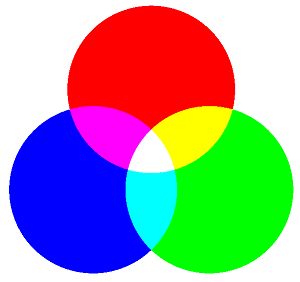
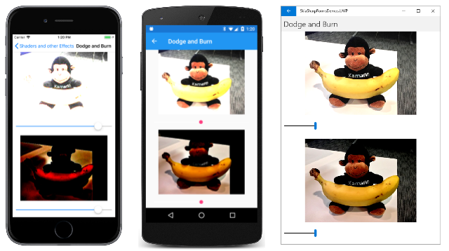
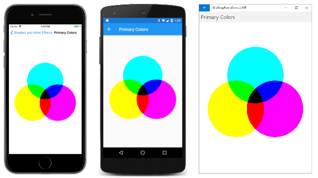

# The separable blend modes

As you saw in the article [**SkiaSharp Porter-Duff blend modes**](porter-duff.md), the Porter-Duff blend modes generally perform clipping operations. The separable blend modes are different. The separable modes alter the individual red, green, and blue color components of an image. Separable blend modes can mix color to demonstrate that the combination of red, green, and blue is indeed white:



## Lighten and darken two ways 

It is common to have a bitmap that is somewhat too dark or too light. You can use separable blend modes to lighten or darken the image.  Indeed, two of the separable blend modes in the [`SKBlendMode`](xref:SkiaSharp.SKBlendMode) enumeration are named `Lighten` and `Darken`. 

These two modes are demonstrated in the **Lighten and Darken** page. The XAML file instantiates two `SKCanvasView` objects and two `Slider` views:

```xaml
<ContentPage xmlns="http://xamarin.com/schemas/2014/forms"
             xmlns:x="http://schemas.microsoft.com/winfx/2009/xaml"
             xmlns:skia="clr-namespace:SkiaSharp.Views.Forms;assembly=SkiaSharp.Views.Forms"
             x:Class="SkiaSharpFormsDemos.Effects.LightenAndDarkenPage"
             Title="Lighten and Darken">
    <StackLayout>
        <skia:SKCanvasView x:Name="lightenCanvasView"
                           VerticalOptions="FillAndExpand"
                           PaintSurface="OnCanvasViewPaintSurface" />

        <Slider x:Name="lightenSlider"
                Margin="10"
                ValueChanged="OnSliderValueChanged" />

        <skia:SKCanvasView x:Name="darkenCanvasView"
                           VerticalOptions="FillAndExpand"
                           PaintSurface="OnCanvasViewPaintSurface" />

        <Slider x:Name="darkenSlider"
                Margin="10"
                ValueChanged="OnSliderValueChanged" />
    </StackLayout>
</ContentPage>
```

The first `SKCanvasView` and `Slider` demonstrate `SKBlendMode.Lighten` and the second pair demonstrates `SKBlendMode.Darken`. The two `Slider` views share the same `ValueChanged` handler, and the two `SKCanvasView` share the same `PaintSurface` handler. Both event handlers check which object is firing the event:

```csharp
public partial class LightenAndDarkenPage : ContentPage
{
    SKBitmap bitmap = BitmapExtensions.LoadBitmapResource(
                typeof(SeparableBlendModesPage),
                "SkiaSharpFormsDemos.Media.Banana.jpg");

    public LightenAndDarkenPage ()
    {
        InitializeComponent ();
    }

    void OnSliderValueChanged(object sender, ValueChangedEventArgs args)
    {
        if ((Slider)sender == lightenSlider)
        {
            lightenCanvasView.InvalidateSurface();
        }
        else
        {
            darkenCanvasView.InvalidateSurface();
        }
    }

    void OnCanvasViewPaintSurface(object sender, SKPaintSurfaceEventArgs args)
    {
        SKImageInfo info = args.Info;
        SKSurface surface = args.Surface;
        SKCanvas canvas = surface.Canvas;

        canvas.Clear();

        // Find largest size rectangle in canvas
        float scale = Math.Min((float)info.Width / bitmap.Width,
                               (float)info.Height / bitmap.Height);
        SKRect rect = SKRect.Create(scale * bitmap.Width, scale * bitmap.Height);
        float x = (info.Width - rect.Width) / 2;
        float y = (info.Height - rect.Height) / 2;
        rect.Offset(x, y);

        // Display bitmap
        canvas.DrawBitmap(bitmap, rect);

        // Display gray rectangle with blend mode
        using (SKPaint paint = new SKPaint())
        {
            if ((SKCanvasView)sender == lightenCanvasView)
            {
                byte value = (byte)(255 * lightenSlider.Value);
                paint.Color = new SKColor(value, value, value);
                paint.BlendMode = SKBlendMode.Lighten;
            }
            else
            {
                byte value = (byte)(255 * (1 - darkenSlider.Value));
                paint.Color = new SKColor(value, value, value);
                paint.BlendMode = SKBlendMode.Darken;
            }

            canvas.DrawRect(rect, paint);
        }
    }
}
```

The `PaintSurface` handler calculates a rectangle suitable for the bitmap. The handler displays that bitmap and then displays a rectangle over the bitmap using an `SKPaint` object with its `BlendMode` property set to `SKBlendMode.Lighten` or `SKBlendMode.Darken`. The `Color` property is a gray shade based on the `Slider`. For the `Lighten` mode, the color ranges from black to white, but for the `Darken` mode it ranges from white to black.

The screenshots from left to right show increasingly larger `Slider` values as the top image gets lighter and the bottom image gets darker:

[](separable-images/LightenAndDarken-Large.png#lightbox)

This program demonstrates the normal way in which the separable blend modes are used: The destination is an image of some sort, very often a bitmap. The source is a rectangle displayed using an `SKPaint` object with its `BlendMode` property set to a separable blend mode. The rectangle can be a solid color (as it is here) or a gradient. Transparency is _not_ generally used with the separable blend modes.

As you experiment with this program, you'll discover that these two blend modes do not lighten and darken the image uniformly. Instead, the `Slider` seems to set a threshold of some sort. For example, as you increase the `Slider` for the `Lighten` mode, the darker areas of the image get light first while the lighter areas remain the same.

For the `Lighten` mode, if the destination pixel is the RGB color value (Dr, Dg, Db), and the source pixel is the color (Sr, Sg, Sb), then the output is (Or, Og, Ob) calculated as follows:

 `Or = max(Dr, Sr)`
 `Og = max(Dg, Sg)`
 `Ob = max(Db, Sb)`

For red, green, and blue separately, the result is the greater of the destination and source. This produces the effect of lightening the dark areas of the destination first.

The `Darken` mode is similar except that the result is the lesser of the destination and source:

 `Or = min(Dr, Sr)`
 `Og = min(Dg, Sg)`
 `Ob = min(Db, Sb)`

The red, green, and blue components are each handled separately, which is why these blend modes are referred to as the _separable_ blend modes. For this reason, the abbreviations **Dc** and **Sc** can be used for the destination and source colors, and it's understood that calculations apply to each of the red, green, and blue components separately.

The following table shows all the separable blend modes with brief explanations of what they do. The second column shows the source color that produces no change:

| Blend Mode   | No change | Operation |
| ------------ | --------- | --------- |
| `Plus`       | Black     | Lightens by adding colors: Sc + Dc |
| `Modulate`   | White     | Darkens by multiplying colors: Sc·Dc | 
| `Screen`     | Black     | Complements product of complements: Sc + Dc &ndash; Sc·Dc |
| `Overlay`    | Gray      | Inverse of `HardLight` |
| `Darken`     | White     | Minimum of colors: min(Sc, Dc) |
| `Lighten`    | Black     | Maximum of colors: max(Sc, Dc) |
| `ColorDodge` | Black     | Brightens destination based on source |
| `ColorBurn`  | White     | Darkens destination based on source | 
| `HardLight`  | Gray      | Similar to effect of harsh spotlight |
| `SoftLight`  | Gray      | Similar to effect of soft spotlight | 
| `Difference` | Black     | Subtracts the darker from the lighter: Abs(Dc &ndash; Sc) | 
| `Exclusion`  | Black     | Similar to `Difference` but lower contrast |
| `Multiply`   | White     | Darkens by multiplying colors: Sc·Dc |

More detailed algorithms can be found in the W3C [**Compositing and Blending Level 1**](https://www.w3.org/TR/compositing-1/) specification and the Skia [**SkBlendMode Reference**](https://skia.googlesource.com/skia.git/+/dfec731dbfcf2565007ca94d85f7297f4f468aee/site/user/api/SkBlendMode_Reference.md), although the notation in these two sources is not the same. Keep in mind that `Plus` is commonly regarded as a Porter-Duff blend mode, and `Modulate` is not part of the W3C specification.

If the source is transparent, then for all the separable blend modes except `Modulate`, the blend mode has no effect. As you've seen earlier, the `Modulate` blend mode incorporates the alpha channel in the multiplication. Otherwise, `Modulate` has the same effect as `Multiply`. 

Notice the two modes named `ColorDodge` and `ColorBurn`. The words _dodge_ and _burn_ originated in photographic darkroom practices. An enlarger makes a photographic print by shining light through a negative. With no light, the print is white. The print gets darker as more light falls on the print for a longer period of time. Print-makers often used a hand or small object to block some of the light from falling on a certain part of the print, making that area lighter. This is known as _dodging_. Conversely, opaque material with a hole in it (or hands blocking most of the light) could be used to direct more light in a particular spot to darken it, called _burning_.

The **Dodge and Burn** program is very similar to **Lighten and Darken**. The XAML file is structured the same but with different element names, and the code-behind file is likewise quite similar, but the effect of these two blend modes is quite different:

[](separable-images/DodgeAndBurn-Large.png#lightbox)

For small `Slider` values, the `Lighten` mode lightens dark areas first, while `ColorDodge` lightens more uniformly.

Image-processing application programs often allow dodging and burning to be restricted to specific areas, just like in a darkroom. This can be accomplished by gradients, or by a bitmap with varying shades of gray.

## Exploring the separable blend modes

The **Separable Blend Modes** page allows you to examine all the separable blend modes. It displays a bitmap destination and a colored rectangle source using one of the blend modes. 

The XAML file defines a `Picker` (to select the blend mode) and four sliders. The first three sliders let you set the red, green, and blue components of the source. The fourth slider is intended to override those values by setting a gray shade. The individual sliders are not identified, but colors indicate their function:

```xaml
<?xml version="1.0" encoding="utf-8" ?>
<ContentPage xmlns="http://xamarin.com/schemas/2014/forms"
             xmlns:x="http://schemas.microsoft.com/winfx/2009/xaml"
             xmlns:skia="clr-namespace:SkiaSharp;assembly=SkiaSharp"
             xmlns:skiaviews="clr-namespace:SkiaSharp.Views.Forms;assembly=SkiaSharp.Views.Forms"
             x:Class="SkiaSharpFormsDemos.Effects.SeparableBlendModesPage"
             Title="Separable Blend Modes">

    <StackLayout>
        <skiaviews:SKCanvasView x:Name="canvasView"
                                VerticalOptions="FillAndExpand"
                                PaintSurface="OnCanvasViewPaintSurface" />

        <Picker x:Name="blendModePicker"
                Title="Blend Mode"
                Margin="10, 0"
                SelectedIndexChanged="OnPickerSelectedIndexChanged">
            <Picker.ItemsSource>
                <x:Array Type="{x:Type skia:SKBlendMode}">
                    <x:Static Member="skia:SKBlendMode.Plus" />
                    <x:Static Member="skia:SKBlendMode.Modulate" />
                    <x:Static Member="skia:SKBlendMode.Screen" />
                    <x:Static Member="skia:SKBlendMode.Overlay" />
                    <x:Static Member="skia:SKBlendMode.Darken" />
                    <x:Static Member="skia:SKBlendMode.Lighten" />
                    <x:Static Member="skia:SKBlendMode.ColorDodge" />
                    <x:Static Member="skia:SKBlendMode.ColorBurn" />
                    <x:Static Member="skia:SKBlendMode.HardLight" />
                    <x:Static Member="skia:SKBlendMode.SoftLight" />
                    <x:Static Member="skia:SKBlendMode.Difference" />
                    <x:Static Member="skia:SKBlendMode.Exclusion" />
                    <x:Static Member="skia:SKBlendMode.Multiply" />
                </x:Array>
            </Picker.ItemsSource>

            <Picker.SelectedIndex>
                0
            </Picker.SelectedIndex>
        </Picker>

        <Slider x:Name="redSlider"
                MinimumTrackColor="Red"
                MaximumTrackColor="Red"
                Margin="10, 0"
                ValueChanged="OnSliderValueChanged" />

        <Slider x:Name="greenSlider"
                MinimumTrackColor="Green"
                MaximumTrackColor="Green"
                Margin="10, 0"
                ValueChanged="OnSliderValueChanged" />

        <Slider x:Name="blueSlider"
                MinimumTrackColor="Blue"
                MaximumTrackColor="Blue"
                Margin="10, 0"
                ValueChanged="OnSliderValueChanged" />

        <Slider x:Name="graySlider"
                MinimumTrackColor="Gray"
                MaximumTrackColor="Gray"
                Margin="10, 0"
                ValueChanged="OnSliderValueChanged" />

        <Label x:Name="colorLabel"
               HorizontalTextAlignment="Center" />

    </StackLayout>
</ContentPage>
```

The code-behind file loads one of the bitmap resources and draws it twice, once in the top half of the canvas and again in the bottom half of the canvas:

```csharp
public partial class SeparableBlendModesPage : ContentPage
{
    SKBitmap bitmap = BitmapExtensions.LoadBitmapResource(
                        typeof(SeparableBlendModesPage),
                        "SkiaSharpFormsDemos.Media.Banana.jpg"); 

    public SeparableBlendModesPage()
    {
        InitializeComponent();
    }

    void OnPickerSelectedIndexChanged(object sender, EventArgs args)
    {
        canvasView.InvalidateSurface();
    }

    void OnSliderValueChanged(object sender, ValueChangedEventArgs e)
    {
        if (sender == graySlider)
        {
            redSlider.Value = greenSlider.Value = blueSlider.Value = graySlider.Value;
        }

        colorLabel.Text = String.Format("Color = {0:X2} {1:X2} {2:X2}",
                                        (byte)(255 * redSlider.Value),
                                        (byte)(255 * greenSlider.Value),
                                        (byte)(255 * blueSlider.Value));

        canvasView.InvalidateSurface();
    }

    void OnCanvasViewPaintSurface(object sender, SKPaintSurfaceEventArgs args)
    {
        SKImageInfo info = args.Info;
        SKSurface surface = args.Surface;
        SKCanvas canvas = surface.Canvas;

        canvas.Clear();

        // Draw bitmap in top half
        SKRect rect = new SKRect(0, 0, info.Width, info.Height / 2);
        canvas.DrawBitmap(bitmap, rect, BitmapStretch.Uniform);

        // Draw bitmap in bottom halr
        rect = new SKRect(0, info.Height / 2, info.Width, info.Height);
        canvas.DrawBitmap(bitmap, rect, BitmapStretch.Uniform);

        // Get values from XAML controls
        SKBlendMode blendMode =
            (SKBlendMode)(blendModePicker.SelectedIndex == -1 ?
                                        0 : blendModePicker.SelectedItem);

        SKColor color = new SKColor((byte)(255 * redSlider.Value),
                                    (byte)(255 * greenSlider.Value),
                                    (byte)(255 * blueSlider.Value));

        // Draw rectangle with blend mode in bottom half
        using (SKPaint paint = new SKPaint())
        {
            paint.Color = color;
            paint.BlendMode = blendMode;
            canvas.DrawRect(rect, paint);
        }
    }
}
```

Towards the bottom of the `PaintSurface` handler, a rectangle is drawn over the second bitmap with the selected blend mode and the selected color. You can compare the modified bitmap at the bottom with the original bitmap at the top:

[](separable-images/SeparableBlendModes-Large.png#lightbox)

## Additive and subtractive primary colors

The **Primary Colors** page draws three overlapping circles of red, green, and blue:

[](separable-images/PrimaryColors-Additive.png#lightbox)

These are the additive primary colors. Combinations of any two produce cyan, magenta, and yellow, and a combination of all three is white.

These three circles are drawn with the `SKBlendMode.Plus` mode, but you can also use `Screen`, `Lighten`, or `Difference` for the same effect. Here's the program:

```csharp
public class PrimaryColorsPage : ContentPage
{
    bool isSubtractive;

    public PrimaryColorsPage ()
    {
        Title = "Primary Colors";

        SKCanvasView canvasView = new SKCanvasView();
        canvasView.PaintSurface += OnCanvasViewPaintSurface;

        // Switch between additive and subtractive primaries at tap
        TapGestureRecognizer tap = new TapGestureRecognizer();
        tap.Tapped += (sender, args) =>
        {
            isSubtractive ^= true;
            canvasView.InvalidateSurface();
        };
        canvasView.GestureRecognizers.Add(tap);

        Content = canvasView;
    }

    void OnCanvasViewPaintSurface(object sender, SKPaintSurfaceEventArgs args)
    {
        SKImageInfo info = args.Info;
        SKSurface surface = args.Surface;
        SKCanvas canvas = surface.Canvas;

        canvas.Clear();

        SKPoint center = new SKPoint(info.Rect.MidX, info.Rect.MidY);
        float radius = Math.Min(info.Width, info.Height) / 4;
        float distance = 0.8f * radius;     // from canvas center to circle center
        SKPoint center1 = center + 
            new SKPoint(distance * (float)Math.Cos(9 * Math.PI / 6),
                        distance * (float)Math.Sin(9 * Math.PI / 6));
        SKPoint center2 = center +
            new SKPoint(distance * (float)Math.Cos(1 * Math.PI / 6),
                        distance * (float)Math.Sin(1 * Math.PI / 6));
        SKPoint center3 = center +
            new SKPoint(distance * (float)Math.Cos(5 * Math.PI / 6),
                        distance * (float)Math.Sin(5 * Math.PI / 6));

        using (SKPaint paint = new SKPaint())
        {
            if (!isSubtractive)
            {
                paint.BlendMode = SKBlendMode.Plus; 
                System.Diagnostics.Debug.WriteLine(paint.BlendMode);

                paint.Color = SKColors.Red;
                canvas.DrawCircle(center1, radius, paint);

                paint.Color = SKColors.Lime;    // == (00, FF, 00)
                canvas.DrawCircle(center2, radius, paint);

                paint.Color = SKColors.Blue;
                canvas.DrawCircle(center3, radius, paint);
            }
            else
            {
                paint.BlendMode = SKBlendMode.Multiply
                System.Diagnostics.Debug.WriteLine(paint.BlendMode);

                paint.Color = SKColors.Cyan;
                canvas.DrawCircle(center1, radius, paint);

                paint.Color = SKColors.Magenta;
                canvas.DrawCircle(center2, radius, paint);

                paint.Color = SKColors.Yellow;
                canvas.DrawCircle(center3, radius, paint);
            }
        }
    }
}
```

The program includes a `TabGestureRecognizer`. When you tap or click the screen, the program uses `SKBlendMode.Multiply` to display the three subtractive primaries:

[](separable-images/PrimaryColors-Subtractive-Large.png#lightbox)

The `Darken` mode also works for this same effect.

## Related links

- [SkiaSharp APIs](/dotnet/api/skiasharp)
