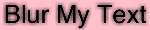
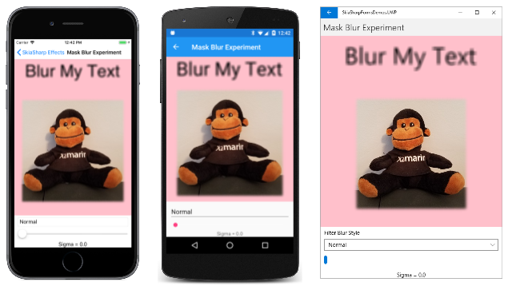
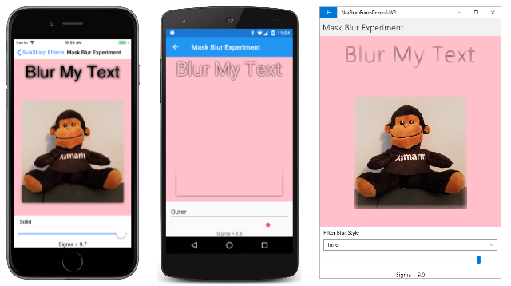
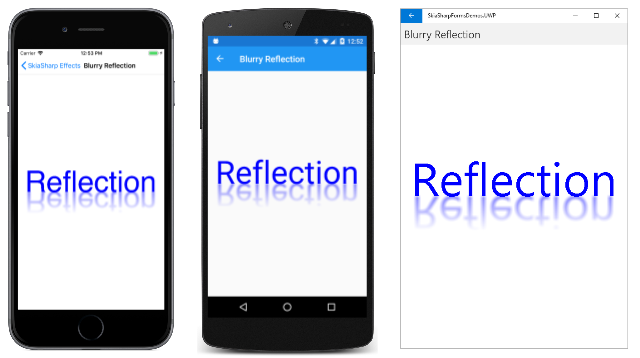

# SkiaSharp mask filters

Mask filters are effects that manipulate the geometry and alpha channel of graphical objects. To use a mask filter, set the [`MaskFilter`](xref:SkiaSharp.SKPaint.MaskFilter) property of `SKPaint` to an object of type [`SKMaskFilter`](xref:SkiaSharp.SKMaskFilter) that you've created by calling one of the `SKMaskFilter` static methods.

The best way to become familiar with mask filters is by experimenting with these static methods. The most useful mask filter creates a blur:



That's the only mask filter feature described in this article. The next article on [**SkiaSharp image filters**](image-filters.md) also describes a blur effect that you might prefer to this one.

The static [`SKMaskFilter.CreateBlur`](xref:SkiaSharp.SKMaskFilter.CreateBlur(SkiaSharp.SKBlurStyle,System.Single)) method has the following syntax:

```csharp
public static SKMaskFilter CreateBlur (SKBlurStyle blurStyle, float sigma);
```

Overloads allow specifying flags for the algorithm used to create the blur, and a rectangle to avoid blurring in areas that will be covered with other graphical objects.

[`SKBlurStyle`](xref:SkiaSharp.SKBlurStyle) is an enumeration with the following members:

- `Normal`
- `Solid`
- `Outer`
- `Inner`

The effects of these styles are shown in the examples below. The `sigma` parameter specifies the extent of the blur. In older versions of Skia, the extent of the blur was indicated with a radius value. If a radius value is preferable for your application, there is a static [`SKMaskFilter.ConvertRadiusToSigma`](xref:SkiaSharp.SKMaskFilter.ConvertRadiusToSigma*) method that can convert from one to the other. The method multiplies the radius by 0.57735 and adds 0.5.

The **Mask Blur Experiment** page in the sample allows you to experiment with the blur styles and sigma values. The XAML file instantiates a `Picker` with the four `SKBlurStyle` enumeration members and a `Slider` for specifying the sigma value:

```xaml
<ContentPage xmlns="http://xamarin.com/schemas/2014/forms"
             xmlns:x="http://schemas.microsoft.com/winfx/2009/xaml"
             xmlns:skia="clr-namespace:SkiaSharp;assembly=SkiaSharp"
             xmlns:skiaforms="clr-namespace:SkiaSharp.Views.Forms;assembly=SkiaSharp.Views.Forms"
             x:Class="SkiaSharpFormsDemos.Effects.MaskBlurExperimentPage"
             Title="Mask Blur Experiment">

    <StackLayout>
        <skiaforms:SKCanvasView x:Name="canvasView"
                                VerticalOptions="FillAndExpand"
                                PaintSurface="OnCanvasViewPaintSurface" />

        <Picker x:Name="blurStylePicker"
                Title="Filter Blur Style"
                Margin="10, 0"
                SelectedIndexChanged="OnPickerSelectedIndexChanged">
            <Picker.ItemsSource>
                <x:Array Type="{x:Type skia:SKBlurStyle}">
                    <x:Static Member="skia:SKBlurStyle.Normal" />
                    <x:Static Member="skia:SKBlurStyle.Solid" />
                    <x:Static Member="skia:SKBlurStyle.Outer" />
                    <x:Static Member="skia:SKBlurStyle.Inner" />
                </x:Array>
            </Picker.ItemsSource>

            <Picker.SelectedIndex>
                0
            </Picker.SelectedIndex>
        </Picker>

        <Slider x:Name="sigmaSlider"
                Maximum="10"
                Margin="10, 0"
                ValueChanged="OnSliderValueChanged" />

        <Label Text="{Binding Source={x:Reference sigmaSlider},
                              Path=Value,
                              StringFormat='Sigma = {0:F1}'}"
               HorizontalTextAlignment="Center" />
    </StackLayout>
</ContentPage>
```

The code-behind file uses those values to create an `SKMaskFilter` object and set it to the `MaskFilter` property of an `SKPaint` object. This `SKPaint` object is used to draw both a text string and a bitmap:

```csharp
public partial class MaskBlurExperimentPage : ContentPage
{
    const string TEXT = "Blur My Text";

    SKBitmap bitmap = BitmapExtensions.LoadBitmapResource(
                            typeof(MaskBlurExperimentPage),
                            "SkiaSharpFormsDemos.Media.SeatedMonkey.jpg");

    public MaskBlurExperimentPage ()
    {
        InitializeComponent ();
    }

    void OnPickerSelectedIndexChanged(object sender, EventArgs args)
    {
        canvasView.InvalidateSurface();
    }

    void OnSliderValueChanged(object sender, ValueChangedEventArgs args)
    {
        canvasView.InvalidateSurface();
    }

    void OnCanvasViewPaintSurface(object sender, SKPaintSurfaceEventArgs args)
    {
        SKImageInfo info = args.Info;
        SKSurface surface = args.Surface;
        SKCanvas canvas = surface.Canvas;

        canvas.Clear(SKColors.Pink);

        // Get values from XAML controls
        SKBlurStyle blurStyle =
            (SKBlurStyle)(blurStylePicker.SelectedIndex == -1 ?
                                        0 : blurStylePicker.SelectedItem);

        float sigma = (float)sigmaSlider.Value;

        using (SKPaint paint = new SKPaint())
        {
            // Set SKPaint properties
            paint.TextSize = (info.Width - 100) / (TEXT.Length / 2);
            paint.MaskFilter = SKMaskFilter.CreateBlur(blurStyle, sigma);

            // Get text bounds and calculate display rectangle
            SKRect textBounds = new SKRect();
            paint.MeasureText(TEXT, ref textBounds);
            SKRect textRect = new SKRect(0, 0, info.Width, textBounds.Height + 50);

            // Center the text in the display rectangle
            float xText = textRect.Width / 2 - textBounds.MidX;
            float yText = textRect.Height / 2 - textBounds.MidY;

            canvas.DrawText(TEXT, xText, yText, paint);

            // Calculate rectangle for bitmap
            SKRect bitmapRect = new SKRect(0, textRect.Bottom, info.Width, info.Height);
            bitmapRect.Inflate(-50, -50);

            canvas.DrawBitmap(bitmap, bitmapRect, BitmapStretch.Uniform, paint: paint);
        }
    }
}
```

Here's the program running on iOS, Android, and the Universal Windows Platform (UWP) with the `Normal` blur style and increasing `sigma` levels:

[](mask-filters-images/MaskBlurExperiment-Normal-Large.png#lightbox)

You'll notice that only the edges of the bitmap are affected by the blur. The `SKMaskFilter` class is not the correct effect to use if you want to blur an entire bitmap image. For that you'll want to use the [`SKImageFilter`](xref:SkiaSharp.SKImageFilter) class as described in the next article on [**SkiaSharp image filters**](image-filters.md).

The text is blurred more with increasing values of the `sigma` argument. In experimenting with this program, you'll notice that for a particular `sigma` value, the blur is more extreme on the Windows 10 desktop. This difference occurs because the pixel density is lower on a desktop monitor than on mobile devices, and hence the text height in pixels is lower. The `sigma` value is proportional to a blur extent in pixels, so for a given `sigma` value, the effect is more extreme on lower resolution displays. In a production application, you'll probably want to calculate a `sigma` value that is proportional to the size of the graphic.

Try several values before settling on a blur level that looks the best for your application. For example, in the **Mask Blur Experiment** page, try setting `sigma` like this:

```csharp
sigma = paint.TextSize / 18;
paint.MaskFilter = SKMaskFilter.CreateBlur(blurStyle, sigma);
```

Now the `Slider` has no effect, but the degree of blur is consistent among the platforms:

[](mask-filters-images/MaskBlurExperiment-Consistent-Large.png#lightbox)

All the screenshots so far have shown blur created with the `SKBlurStyle.Normal` enumeration member. The following screenshots show the effects of the `Solid`, `Outer`, and `Inner` blur styles:

[](mask-filters-images/MaskBlurExperiment-Large.png#lightbox)

The iOS screenshot shows the `Solid` style: The text characters are still present as solid black strokes, and the blur is added to the outside of these text characters.

The Android screenshot in the middle shows the `Outer` style: The character strokes themselves are eliminated (as is the bitmap) and the blur surrounds the empty space where the text characters once appeared.

The UWP screenshot on the right shows the `Inner` style. The blur is restricted to the area normally occupied by the text characters.

The [**SkiaSharp linear gradient**](shaders/linear-gradient.md#transparency-and-gradients) article described a **Reflection Gradient** program that used a linear gradient and a transform to mimic a reflection of a text string:

[](shaders/linear-gradient-images/ReflectionGradient-Large.png#lightbox)

The **Blurry Reflection** page adds a single statement to that code:

```csharp
public class BlurryReflectionPage : ContentPage
{
    const string TEXT = "Reflection";

    public BlurryReflectionPage()
    {
        Title = "Blurry Reflection";

        SKCanvasView canvasView = new SKCanvasView();
        canvasView.PaintSurface += OnCanvasViewPaintSurface;
        Content = canvasView;
    }

    void OnCanvasViewPaintSurface(object sender, SKPaintSurfaceEventArgs args)
    {
        SKImageInfo info = args.Info;
        SKSurface surface = args.Surface;
        SKCanvas canvas = surface.Canvas;

        canvas.Clear();

        using (SKPaint paint = new SKPaint())
        {
            // Set text color to blue
            paint.Color = SKColors.Blue;

            // Set text size to fill 90% of width
            paint.TextSize = 100;
            float width = paint.MeasureText(TEXT);
            float scale = 0.9f * info.Width / width;
            paint.TextSize *= scale;

            // Get text bounds
            SKRect textBounds = new SKRect();
            paint.MeasureText(TEXT, ref textBounds);

            // Calculate offsets to position text above center
            float xText = info.Width / 2 - textBounds.MidX;
            float yText = info.Height / 2;

            // Draw unreflected text
            canvas.DrawText(TEXT, xText, yText, paint);

            // Shift textBounds to match displayed text
            textBounds.Offset(xText, yText);

            // Use those offsets to create a gradient for the reflected text
            paint.Shader = SKShader.CreateLinearGradient(
                                new SKPoint(0, textBounds.Top),
                                new SKPoint(0, textBounds.Bottom),
                                new SKColor[] { paint.Color.WithAlpha(0),
                                                paint.Color.WithAlpha(0x80) },
                                null,
                                SKShaderTileMode.Clamp);

            // Create a blur mask filter
            paint.MaskFilter = SKMaskFilter.CreateBlur(SKBlurStyle.Normal, paint.TextSize / 36);

            // Scale the canvas to flip upside-down around the vertical center
            canvas.Scale(1, -1, 0, yText);

            // Draw reflected text
            canvas.DrawText(TEXT, xText, yText, paint);
        }
    }
}
```

The new statement adds a blur filter for the reflected text that is based on the text size:

```csharp
paint.MaskFilter = SKMaskFilter.CreateBlur(SKBlurStyle.Normal, paint.TextSize / 36);
```

This blur filter causes the reflection to seem much more realistic:

[](mask-filters-images/BlurryReflection-Large.png#lightbox)

## Related links

- [SkiaSharp APIs](/dotnet/api/skiasharp)
