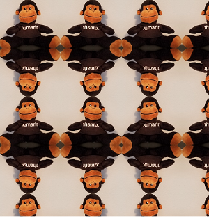
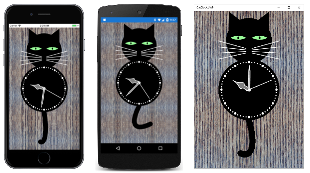
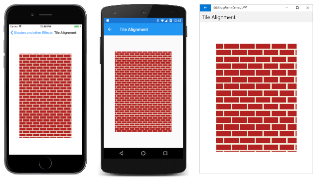
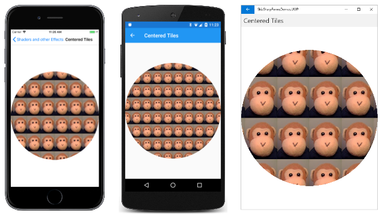

# SkiaSharp bitmap tiling

As you've seen in the two previous articles, the [`SKShader`](xref:SkiaSharp.SKShader) class can create linear or circular gradients. This article focuses on the `SKShader` object that uses a bitmap to tile an area. The bitmap can be repeated horizontally and vertically, either in its original orientation or alternately flipped horizontally and vertically. The flipping avoids discontinuities between the tiles:



The static [`SKShader.CreateBitmap`](xref:SkiaSharp.SKShader.CreateBitmap(SkiaSharp.SKBitmap,SkiaSharp.SKShaderTileMode,SkiaSharp.SKShaderTileMode)) method that creates this shader has an `SKBitmap` parameter and two members of the [`SKShaderTileMode`](xref:SkiaSharp.SKShaderTileMode) enumeration:

```csharp
public static SKShader CreateBitmap (SKBitmap src, SKShaderTileMode tmx, SKShaderTileMode tmy)
```

The two parameters indicate the modes used for horizontal tiling and vertical tiling. This is the same `SKShaderTileMode` enumeration that is also used with the gradient methods.

A [`CreateBitmap`](xref:SkiaSharp.SKShader.CreateBitmap(SkiaSharp.SKBitmap,SkiaSharp.SKShaderTileMode,SkiaSharp.SKShaderTileMode,SkiaSharp.SKMatrix)) overload includes an `SKMatrix` argument to perform a transform on the tiled bitmaps:

```csharp
public static SKShader CreateBitmap (SKBitmap src, SKShaderTileMode tmx, SKShaderTileMode tmy, SKMatrix localMatrix)
```

This article contains several examples of using this matrix transform with tiled bitmaps.

## Exploring the tile modes

The first program in the **Bitmap Tiling** section of the **Shaders and other Effects** page of the sample demonstrates the effects of the two `SKShaderTileMode` arguments. The **Bitmap Tile Flip Modes** XAML file instantiates an `SKCanvasView` and two `Picker` views that allow you to select an `SKShaderTilerMode` value for horizontal and vertical tiling. Notice that an array of the `SKShaderTileMode` members is defined in the `Resources` section:

```xaml
<?xml version="1.0" encoding="utf-8" ?>
<ContentPage xmlns="http://schemas.microsoft.com/dotnet/2021/maui"
             xmlns:x="http://schemas.microsoft.com/winfx/2009/xaml"
             xmlns:skia="clr-namespace:SkiaSharp;assembly=SkiaSharp"
             xmlns:skiaforms="clr-namespace:SkiaSharp.Views.Maui.Controls;assembly=SkiaSharp.Views.Maui.Controls"
             x:Class="SkiaSharpFormsDemos.Effects.BitmapTileFlipModesPage"
             Title="Bitmap Tile Flip Modes">

    <ContentPage.Resources>
        <x:Array x:Key="tileModes"
                 Type="{x:Type skia:SKShaderTileMode}">
            <x:Static Member="skia:SKShaderTileMode.Clamp" />
            <x:Static Member="skia:SKShaderTileMode.Repeat" />
            <x:Static Member="skia:SKShaderTileMode.Mirror" />
        </x:Array>
    </ContentPage.Resources>

    <StackLayout>
        <skiaforms:SKCanvasView x:Name="canvasView"
                                VerticalOptions="FillAndExpand"
                                PaintSurface="OnCanvasViewPaintSurface" />

        <Picker x:Name="xModePicker"
                Title="Tile X Mode"
                Margin="10, 0"
                ItemsSource="{StaticResource tileModes}"
                SelectedIndex="0"
                SelectedIndexChanged="OnPickerSelectedIndexChanged" />

        <Picker x:Name="yModePicker"
                Title="Tile Y Mode"
                Margin="10, 10"
                ItemsSource="{StaticResource tileModes}"
                SelectedIndex="0"
                SelectedIndexChanged="OnPickerSelectedIndexChanged" />

    </StackLayout>
</ContentPage>
```

The constructor of the code-behind file loads in the bitmap resource that shows a monkey sitting. It first crops the image using the [`ExtractSubset`](xref:SkiaSharp.SKBitmap.ExtractSubset(SkiaSharp.SKBitmap,SkiaSharp.SKRectI)) method of `SKBitmap` so that the head and feet are touching the edges of the bitmap. The constructor then uses the [`Resize`](xref:SkiaSharp.SKBitmap.Resize(SkiaSharp.SKImageInfo,SkiaSharp.SKBitmapResizeMethod)) method to create another bitmap of half the size. These changes make the bitmap a little more suitable for tiling:

```csharp
public partial class BitmapTileFlipModesPage : ContentPage
{
    SKBitmap bitmap;

    public BitmapTileFlipModesPage ()
    {
        InitializeComponent ();

        SKBitmap origBitmap = BitmapExtensions.LoadBitmap("SeatedMonkey.jpg");

        // Define cropping rect
        SKRectI cropRect = new SKRectI(5, 27, 296, 260);

        // Get the cropped bitmap
        SKBitmap croppedBitmap = new SKBitmap(cropRect.Width, cropRect.Height);
        origBitmap.ExtractSubset(croppedBitmap, cropRect);

        // Resize to half the width and height
        SKImageInfo info = new SKImageInfo(cropRect.Width / 2, cropRect.Height / 2);
        bitmap = croppedBitmap.Resize(info, SKBitmapResizeMethod.Box);
    }

    void OnPickerSelectedIndexChanged(object? sender, EventArgs args)
    {
        canvasView.InvalidateSurface();
    }

    void OnCanvasViewPaintSurface(object? sender, SKPaintSurfaceEventArgs args)
    {
        SKImageInfo info = args.Info;
        SKSurface surface = args.Surface;
        SKCanvas canvas = surface.Canvas;

        canvas.Clear();

        // Get tile modes from Pickers
        SKShaderTileMode xTileMode =
            (SKShaderTileMode)(xModePicker.SelectedIndex == -1 ?
                                        0 : xModePicker.SelectedItem);
        SKShaderTileMode yTileMode =
            (SKShaderTileMode)(yModePicker.SelectedIndex == -1 ?
                                        0 : yModePicker.SelectedItem);

        using (SKPaint paint = new SKPaint())
        {
            paint.Shader = SKShader.CreateBitmap(bitmap, xTileMode, yTileMode);
            canvas.DrawRect(info.Rect, paint);
        }
    }
}
```

The `PaintSurface` handler obtains the `SKShaderTileMode` settings from the two `Picker` views and creates an `SKShader` object based on the bitmap and those two values. This shader is used to fill the canvas:

[](bitmap-tiling-images/BitmapTileFlipModes-Large.png#lightbox)

The iOS screen at the left shows the effect of the default values of `SKShaderTileMode.Clamp`. The bitmap sits in the upper-left corner. Below the bitmap, the bottom row of pixels is repeated all the way down. To the right of the bitmap, the rightmost column of pixels is repeated all the way across. The remainder of the canvas is colored by the dark brown pixel in the bitmap's lower-right corner. It should be obvious that the `Clamp` option is almost never used with bitmap tiling!

The Android screen in the center shows the result of `SKShaderTileMode.Repeat` for both arguments. The tile is repeated horizontally and vertically. The Universal Windows Platform screen shows `SKShaderTileMode.Mirror`. The tiles are repeated but alternately flipped horizontally and vertically. The advantage of this option is that there are no discontinuities between the tiles.

Keep in mind that you can use different options for the horizontal and vertical repetition. You can specify `SKShaderTileMode.Mirror` as the second argument to `CreateBitmap` but `SKShaderTileMode.Repeat` as the third argument. On each row, the monkeys still alternate between the normal image and the mirror image, but none of the monkeys are upside-down.

## Patterned backgrounds

Bitmap tiling is commonly used to create a patterned background from a relatively small bitmap. The classic example is a brick wall.

The **Algorithmic Brick Wall** page creates a small bitmap that resembles a whole brick and two halves of a brick separated by mortar. Because this brick is used in the next sample as well, it's created by a static constructor and made public with a static property:

```csharp
public class AlgorithmicBrickWallPage : ContentPage
{
    static AlgorithmicBrickWallPage()
    {
        const int brickWidth = 64;
        const int brickHeight = 24;
        const int morterThickness = 6;
        const int bitmapWidth = brickWidth + morterThickness;
        const int bitmapHeight = 2 * (brickHeight + morterThickness);

        SKBitmap bitmap = new SKBitmap(bitmapWidth, bitmapHeight);

        using (SKCanvas canvas = new SKCanvas(bitmap))
        using (SKPaint brickPaint = new SKPaint())
        {
            brickPaint.Color = new SKColor(0xB2, 0x22, 0x22);

            canvas.Clear(new SKColor(0xF0, 0xEA, 0xD6));
            canvas.DrawRect(new SKRect(morterThickness / 2,
                                       morterThickness / 2,
                                       morterThickness / 2 + brickWidth,
                                       morterThickness / 2 + brickHeight),
                                       brickPaint);

            int ySecondBrick = 3 * morterThickness / 2 + brickHeight;

            canvas.DrawRect(new SKRect(0,
                                       ySecondBrick,
                                       bitmapWidth / 2 - morterThickness / 2,
                                       ySecondBrick + brickHeight),
                                       brickPaint);

            canvas.DrawRect(new SKRect(bitmapWidth / 2 + morterThickness / 2,
                                       ySecondBrick,
                                       bitmapWidth,
                                       ySecondBrick + brickHeight),
                                       brickPaint);
        }

        // Save as public property for other programs
        BrickWallTile = bitmap;
    }

    public static SKBitmap BrickWallTile { private set; get; }
    ···
}
```

The resultant bitmap is 70 pixels wide and 60 pixels high:


The rest of the **Algorithmic Brick Wall** page creates an `SKShader` object that repeats this image horizontally and vertically:

```csharp
public class AlgorithmicBrickWallPage : ContentPage
{
    ···
    public AlgorithmicBrickWallPage ()
    {
        Title = "Algorithmic Brick Wall";

        // Create SKCanvasView
        SKCanvasView canvasView = new SKCanvasView();
        canvasView.PaintSurface += OnCanvasViewPaintSurface;
        Content = canvasView;
    }

    void OnCanvasViewPaintSurface(object? sender, SKPaintSurfaceEventArgs args)
    {
        SKImageInfo info = args.Info;
        SKSurface surface = args.Surface;
        SKCanvas canvas = surface.Canvas;

        canvas.Clear();

        using (SKPaint paint = new SKPaint())
        {
            // Create bitmap tiling
            paint.Shader = SKShader.CreateBitmap(BrickWallTile,
                                                 SKShaderTileMode.Repeat,
                                                 SKShaderTileMode.Repeat);
            // Draw background
            canvas.DrawRect(info.Rect, paint);
        }
    }
}
```

Here's the result:

[](bitmap-tiling-images/AlgorithmicBrickWall-Large.png#lightbox)

You might prefer something a little more realistic. In that case, you can take a photograph of an actual brick wall and then crop it. This bitmap is 300 pixels wide and 150 pixels high:


This bitmap is used in the **Photographic Brick Wall** page:

```csharp
public class PhotographicBrickWallPage : ContentPage
{
    SKBitmap bitmap = BitmapExtensions.LoadBitmap("BrickWallTile.jpg");

    public PhotographicBrickWallPage()
    {
        Title = "Photographic Brick Wall";

        SKCanvasView canvasView = new SKCanvasView();
        canvasView.PaintSurface += OnCanvasViewPaintSurface;
        Content = canvasView;
    }

    void OnCanvasViewPaintSurface(object? sender, SKPaintSurfaceEventArgs args)
    {
        SKImageInfo info = args.Info;
        SKSurface surface = args.Surface;
        SKCanvas canvas = surface.Canvas;

        canvas.Clear();

        using (SKPaint paint = new SKPaint())
        {
            // Create bitmap tiling
            paint.Shader = SKShader.CreateBitmap(bitmap,
                                                 SKShaderTileMode.Mirror,
                                                 SKShaderTileMode.Mirror);
            // Draw background
            canvas.DrawRect(info.Rect, paint);
        }
    }
}
```

Notice that the `SKShaderTileMode` arguments to `CreateBitmap` are both `Mirror`. This option is usually necessary when you use tiles created from real-world images. Mirroring the tiles avoids discontinuities:

[](bitmap-tiling-images/PhotographicBrickWall-Large.png#lightbox)

Some work is required to get a suitable bitmap for the tile. This one doesn't work very well because the darker brick stands out too much. It appears regularly within the repeated images, revealing the fact that this brick wall was constructed from a smaller bitmap.

The **Media** folder of the sample also includes this image of a stone wall:


However, the original bitmap is a little too large for a tile. It could be resized, but the `SKShader.CreateBitmap` method can also resize the tile by applying a transform to it. This option is demonstrated in the **Stone Wall** page:

```csharp
public class StoneWallPage : ContentPage
{
    SKBitmap bitmap = BitmapExtensions.LoadBitmap("StoneWallTile.jpg");

    public StoneWallPage()
    {
        Title = "Stone Wall";

        SKCanvasView canvasView = new SKCanvasView();
        canvasView.PaintSurface += OnCanvasViewPaintSurface;
        Content = canvasView;
    }

    void OnCanvasViewPaintSurface(object? sender, SKPaintSurfaceEventArgs args)
    {
        SKImageInfo info = args.Info;
        SKSurface surface = args.Surface;
        SKCanvas canvas = surface.Canvas;

        canvas.Clear();

        using (SKPaint paint = new SKPaint())
        {
            // Create scale transform
            SKMatrix matrix = SKMatrix.MakeScale(0.5f, 0.5f);

            // Create bitmap tiling
            paint.Shader = SKShader.CreateBitmap(bitmap,
                                                 SKShaderTileMode.Mirror,
                                                 SKShaderTileMode.Mirror,
                                                 matrix);
            // Draw background
            canvas.DrawRect(info.Rect, paint);
        }
    }
}
```

An `SKMatrix` value is created to scale the image to half its original size:

[](bitmap-tiling-images/StoneWall-Large.png#lightbox)

Does the transform operate on the original bitmap used in the `CreateBitmap` method? Or does it transform the resultant array of tiles?

An easy way to answer this question is to include a rotation as part of the transform:

```csharp
SKMatrix matrix = SKMatrix.MakeScale(0.5f, 0.5f);
SKMatrix.PostConcat(ref matrix, SKMatrix.MakeRotationDegrees(15));
```

If the transform is applied to the individual tile, then each repeated image of the tile should be rotated, and the result would contain many discontinuities. But it's obvious from this screenshot that the composite array of tiles is transformed:

[](bitmap-tiling-images/StoneWallRotated-Large.png#lightbox)

In the section [**Tile alignment**](#tile-alignment), you'll see an example a translate transform applied to the shader.

The sample simulates a wood-grain background using bitmap tiling based on this 240-pixel square bitmap:


That is a photograph of a wood floor. The `SKShaderTileMode.Mirror` option allows it to appear as a much larger area of wood:

[](bitmap-tiling-images/CatClock-Large.png#lightbox)

## Tile alignment

All the examples shown so far have used the shader created by `SKShader.CreateBitmap` to cover the entire canvas. In most cases, you'll be using bitmap tiling for filing smaller areas or (more rarely) for filling the interiors of thick lines. Here's the photographic brick-wall tile used for a smaller rectangle:

[](bitmap-tiling-images/TileAlignment-Large.png#lightbox)

This might look fine to you, or maybe not. Perhaps you're disturbed that the tiling pattern doesn't begin with a full brick in the upper-left corner of the rectangle. That's because shaders are aligned with the canvas and not the graphical object that they adorn.

The fix is simple. Create an `SKMatrix` value based on a translation transform. The transform effectively shifts the tiled pattern to the point where you want the upper-left corner of the tile to be aligned. This approach is demonstrated in the **Tile Alignment** page, which created the image of the unaligned tiles shown above:

```csharp
public class TileAlignmentPage : ContentPage
{
    bool isAligned;

    public TileAlignmentPage()
    {
        Title = "Tile Alignment";

        SKCanvasView canvasView = new SKCanvasView();
        canvasView.PaintSurface += OnCanvasViewPaintSurface;

        // Add tap handler
        TapGestureRecognizer tap = new TapGestureRecognizer();
        tap.Tapped += (sender, args) =>
        {
            isAligned ^= true;
            canvasView.InvalidateSurface();
        };
        canvasView.GestureRecognizers.Add(tap);

        Content = canvasView;
    }

    void OnCanvasViewPaintSurface(object? sender, SKPaintSurfaceEventArgs args)
    {
        SKImageInfo info = args.Info;
        SKSurface surface = args.Surface;
        SKCanvas canvas = surface.Canvas;

        canvas.Clear();

        using (SKPaint paint = new SKPaint())
        {
            SKRect rect = new SKRect(info.Width / 7,
                                     info.Height / 7,
                                     6 * info.Width / 7,
                                     6 * info.Height / 7);

            // Get bitmap from other program
            SKBitmap bitmap = AlgorithmicBrickWallPage.BrickWallTile;

            // Create bitmap tiling
            if (!isAligned)
            {
                paint.Shader = SKShader.CreateBitmap(bitmap,
                                                     SKShaderTileMode.Repeat,
                                                     SKShaderTileMode.Repeat);
            }
            else
            {
                SKMatrix matrix = SKMatrix.MakeTranslation(rect.Left, rect.Top);

                paint.Shader = SKShader.CreateBitmap(bitmap,
                                                     SKShaderTileMode.Repeat,
                                                     SKShaderTileMode.Repeat,
                                                     matrix);
            }

            // Draw rectangle
            canvas.DrawRect(rect, paint);
        }
    }
}
```

The **Tile Alignment** page includes a `TapGestureRecognizer`. Tap or click the screen, and the program switches to the `SKShader.CreateBitmap` method with an `SKMatrix` argument. This transform shifts the pattern so that the upper-left corner contains a full brick:

[](bitmap-tiling-images/TileAlignmentTapped-Large.png#lightbox)

You can also use this technique to ensure that the tiled bitmap pattern is centered within the area that it paints. In the **Centered Tiles** page, the `PaintSurface` handler first calculates coordinates as if it's going to display the single bitmap in the center of the canvas. It then uses those coordinates to create a translate transform for `SKShader.CreateBitmap`. This transform shifts the entire pattern so that a tile is centered:

```csharp
public class CenteredTilesPage : ContentPage
{
    SKBitmap bitmap = BitmapExtensions.LoadBitmap("monkey.png");

    public CenteredTilesPage ()
    {
        Title = "Centered Tiles";

        SKCanvasView canvasView = new SKCanvasView();
        canvasView.PaintSurface += OnCanvasViewPaintSurface;
        Content = canvasView;
    }

    void OnCanvasViewPaintSurface(object? sender, SKPaintSurfaceEventArgs args)
    {
        SKImageInfo info = args.Info;
        SKSurface surface = args.Surface;
        SKCanvas canvas = surface.Canvas;

        canvas.Clear();

        // Find coordinates to center bitmap in canvas...
        float x = (info.Width - bitmap.Width) / 2f;
        float y = (info.Height - bitmap.Height) / 2f;

        using (SKPaint paint = new SKPaint())
        {
            // ... but use them to create a translate transform
            SKMatrix matrix = SKMatrix.MakeTranslation(x, y);
            paint.Shader = SKShader.CreateBitmap(bitmap,
                                                 SKShaderTileMode.Repeat,
                                                 SKShaderTileMode.Repeat,
                                                 matrix);

            // Use that tiled bitmap pattern to fill a circle
            canvas.DrawCircle(info.Rect.MidX, info.Rect.MidY,
                              Math.Min(info.Width, info.Height) / 2,
                              paint);
        }
    }
}
```

The `PaintSurface` handler concludes by drawing a circle in the center of the canvas. Sure enough, one of the tiles is exactly in the center of the circle, and the others are arranged in a symmetric pattern:

[](bitmap-tiling-images/CenteredTiles-Large.png#lightbox)

Another centering approach is actually a bit easier. Rather than construct a translate transform that puts a tile in the center, you can center a corner of the tiled pattern. In the `SKMatrix.MakeTranslation` call, use arguments for the center of the canvas:

```csharp
SKMatrix matrix = SKMatrix.MakeTranslation(info.Rect.MidX, info.Rect.MidY);
```

The pattern is still centered and symmetrical, but no tile is in the center:

[](bitmap-tiling-images/CenteredTilesAlternate-Large.png#lightbox)

## Simplification through rotation

Sometimes using a rotate transform in the `SKShader.CreateBitmap` method can simplify the bitmap tile. This becomes evident when attempting to define a tile for a chain-link fence. The **ChainLinkTile.cs** file creates the tile shown here (with a pink background for purposes of clarity):


The tile needs to include two links, so that the code divides the tile into four quadrants. The upper-left and lower-right quadrants are the same, but they are not complete. The wires have little notches that must be handled with some additional drawing in the upper-right and lower-left quadrants. The file that does all this work is 174 lines long.

It turns out to be much easier to create this tile:


If the bitmap-tile shader is rotated 90 degrees, the visuals are nearly the same.

The code to create the easier chain-link tile is part of the **Chain-Link Tile** page. The constructor determines a tile size based on the type of device that the program is running on, and then calls `CreateChainLinkTile`, which draws on the bitmap using lines, paths, and gradient shaders:

```csharp
public class ChainLinkFencePage : ContentPage
{
    ···
    SKBitmap tileBitmap;

    public ChainLinkFencePage ()
    {
        Title = "Chain-Link Fence";

        // Create bitmap for chain-link tiling
        int tileSize = Device.Idiom == TargetIdiom.Desktop ? 64 : 128;
        tileBitmap = CreateChainLinkTile(tileSize);

        SKCanvasView canvasView = new SKCanvasView();
        canvasView.PaintSurface += OnCanvasViewPaintSurface;
        Content = canvasView;
    }

    SKBitmap CreateChainLinkTile(int tileSize)
    {
        tileBitmap = new SKBitmap(tileSize, tileSize);
        float wireThickness = tileSize / 12f;

        using (SKCanvas canvas = new SKCanvas(tileBitmap))
        using (SKPaint paint = new SKPaint())
        {
            canvas.Clear();
            paint.Style = SKPaintStyle.Stroke;
            paint.StrokeWidth = wireThickness;
            paint.IsAntialias = true;

            // Draw straight wires first
            paint.Shader = SKShader.CreateLinearGradient(new SKPoint(0, 0),
                                                         new SKPoint(0, tileSize),
                                                         new SKColor[] { SKColors.Silver, SKColors.Black },
                                                         new float[] { 0.4f, 0.6f },
                                                         SKShaderTileMode.Clamp);

            canvas.DrawLine(0, tileSize / 2,
                            tileSize / 2, tileSize / 2 - wireThickness / 2, paint);

            canvas.DrawLine(tileSize, tileSize / 2,
                            tileSize / 2, tileSize / 2 + wireThickness / 2, paint);

            // Draw curved wires
            using (SKPath path = new SKPath())
            {
                path.MoveTo(tileSize / 2, 0);
                path.LineTo(tileSize / 2 - wireThickness / 2, tileSize / 2);
                path.ArcTo(wireThickness / 2, wireThickness / 2,
                           0,
                           SKPathArcSize.Small,
                           SKPathDirection.CounterClockwise,
                           tileSize / 2, tileSize / 2 + wireThickness / 2);

                paint.Shader = SKShader.CreateLinearGradient(new SKPoint(0, 0),
                                                             new SKPoint(0, tileSize),
                                                             new SKColor[] { SKColors.Silver, SKColors.Black },
                                                             null,
                                                             SKShaderTileMode.Clamp);
                canvas.DrawPath(path, paint);

                path.Reset();
                path.MoveTo(tileSize / 2, tileSize);
                path.LineTo(tileSize / 2 + wireThickness / 2, tileSize / 2);
                path.ArcTo(wireThickness / 2, wireThickness / 2,
                           0,
                           SKPathArcSize.Small,
                           SKPathDirection.CounterClockwise,
                           tileSize / 2, tileSize / 2 - wireThickness / 2);

                paint.Shader = SKShader.CreateLinearGradient(new SKPoint(0, 0),
                                                             new SKPoint(0, tileSize),
                                                             new SKColor[] { SKColors.White, SKColors.Silver },
                                                             null,
                                                             SKShaderTileMode.Clamp);
                canvas.DrawPath(path, paint);
            }
            return tileBitmap;
        }
    }
    ···
}
```

Except for the wires, the tile is transparent, which means that you can display it on top of something else. The program loads in one of the bitmap resources, displays it to fill the canvas, and then draws the shader on top:

```csharp
public class ChainLinkFencePage : ContentPage
{
    SKBitmap monkeyBitmap = BitmapExtensions.LoadBitmap("SeatedMonkey.jpg");
    ···

    void OnCanvasViewPaintSurface(object? sender, SKPaintSurfaceEventArgs args)
    {
        SKImageInfo info = args.Info;
        SKSurface surface = args.Surface;
        SKCanvas canvas = surface.Canvas;

        canvas.Clear();

        canvas.DrawBitmap(monkeyBitmap, info.Rect, BitmapStretch.UniformToFill,
                            BitmapAlignment.Center, BitmapAlignment.Start);

        using (SKPaint paint = new SKPaint())
        {
            paint.Shader = SKShader.CreateBitmap(tileBitmap,
                                                 SKShaderTileMode.Repeat,
                                                 SKShaderTileMode.Repeat,
                                                 SKMatrix.MakeRotationDegrees(45));
            canvas.DrawRect(info.Rect, paint);
        }
    }
}
```

Notice that the shader is rotated 45 degrees so it is oriented like a real chain-link fence:

[](bitmap-tiling-images/ChainLinkFence-Large.png#lightbox)

## Animating bitmap tiles

You can animate an entire bitmap-tile pattern by animating the matrix transform. Perhaps you want the pattern to move horizontally or vertically or both. You can do that by creating a translation transform based on the shifting coordinates.

It's also possible to draw on a small bitmap, or to manipulate the bitmap's pixel bits at the rate of 60 times a second. That bitmap can then be used for tiling, and the entire tiled pattern can seem to be animated.

The **Animated Bitmap Tile** page demonstrates this approach. A bitmap is instantiated as a field to be 64-pixels square. The constructor calls `DrawBitmap` to give it an initial appearance. If the `angle` field is zero (as it is when the method is first called), then the bitmap contains two lines crossed as an X. The lines are made long enough to always reach to the edge of the bitmap regardless of the `angle` value:

```csharp
public class AnimatedBitmapTilePage : ContentPage
{
    const int SIZE = 64;

    SKCanvasView canvasView;
    SKBitmap bitmap = new SKBitmap(SIZE, SIZE);
    float angle;
    ···

    public AnimatedBitmapTilePage ()
    {
        Title = "Animated Bitmap Tile";

        // Initialize bitmap prior to animation
        DrawBitmap();

        // Create SKCanvasView
        canvasView = new SKCanvasView();
        canvasView.PaintSurface += OnCanvasViewPaintSurface;
        Content = canvasView;
    }
    ···
    void DrawBitmap()
    {
        using (SKCanvas canvas = new SKCanvas(bitmap))
        using (SKPaint paint = new SKPaint())
        {
            paint.Style = SKPaintStyle.Stroke;
            paint.Color = SKColors.Blue;
            paint.StrokeWidth = SIZE / 8;

            canvas.Clear();
            canvas.Translate(SIZE / 2, SIZE / 2);
            canvas.RotateDegrees(angle);
            canvas.DrawLine(-SIZE, -SIZE, SIZE, SIZE, paint);
            canvas.DrawLine(-SIZE, SIZE, SIZE, -SIZE, paint);
        }
    }
    ···
}
```

The animation overhead occurs in the `OnAppearing` and `OnDisappearing` overrides. The `OnTimerTick` method animates the `angle` value from 0 degrees to 360 degrees every 10 seconds to rotate the X figure within the bitmap:

```csharp
public class AnimatedBitmapTilePage : ContentPage
{
    ···
    // For animation
    bool isAnimating;
    Stopwatch stopwatch = new Stopwatch();
    ···

    protected override void OnAppearing()
    {
        base.OnAppearing();

        isAnimating = true;
        stopwatch.Start();
        Dispatcher.StartTimer(TimeSpan.FromMilliseconds(16), OnTimerTick);
    }

    protected override void OnDisappearing()
    {
        base.OnDisappearing();

        stopwatch.Stop();
        isAnimating = false;
    }

    bool OnTimerTick()
    {
        const int duration = 10;     // seconds
        angle = (float)(360f * (stopwatch.Elapsed.TotalSeconds % duration) / duration);
        DrawBitmap();
        canvasView.InvalidateSurface();

        return isAnimating;
    }
    ···
}
```

Because of the symmetry of the X figure, this is the same as rotating the `angle` value from 0 degrees to 90 degrees every 2.5 seconds.

The `PaintSurface` handler creates a shader from the bitmap and uses the paint object to color the entire canvas:

```csharp
public class AnimatedBitmapTilePage : ContentPage
{
    ···
    void OnCanvasViewPaintSurface(object? sender, SKPaintSurfaceEventArgs args)
    {
        SKImageInfo info = args.Info;
        SKSurface surface = args.Surface;
        SKCanvas canvas = surface.Canvas;

        canvas.Clear();

        using (SKPaint paint = new SKPaint())
        {
            paint.Shader = SKShader.CreateBitmap(bitmap,
                                                 SKShaderTileMode.Mirror,
                                                 SKShaderTileMode.Mirror);
            canvas.DrawRect(info.Rect, paint);
        }
    }
}
```

The `SKShaderTileMode.Mirror` options ensure that the arms of the X in each bitmap join with the X in the adjacent bitmaps to create an overall animated pattern that seems much more complex than the simple animation would suggest:

[](bitmap-tiling-images/AnimatedBitmapTile-Large.png#lightbox)

## Related links

- [SkiaSharp APIs](/dotnet/api/skiasharp)
