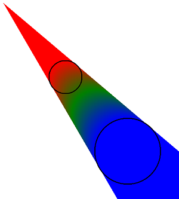
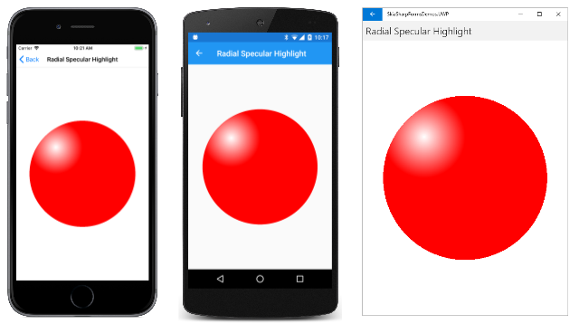
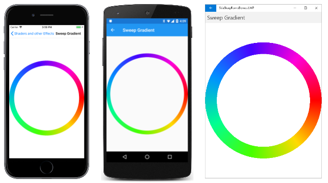
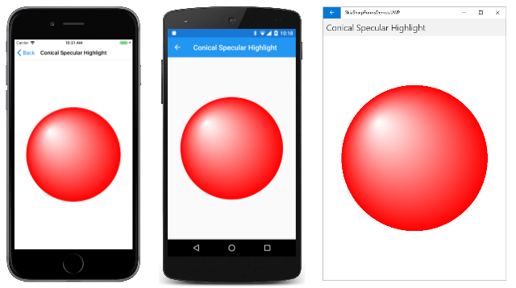

# The SkiaSharp circular gradients

The [`SKShader`](xref:SkiaSharp.SKShader) class defines static methods to create four different types of gradients. The [**SkiaSharp linear gradient**](linear-gradient.md) article discusses the [`CreateLinearGradient`](xref:SkiaSharp.SKShader.CreateLinearGradient*) method. This article covers the other three types of gradients, all of which are based on circles.

The [`CreateRadialGradient`](xref:SkiaSharp.SKShader.CreateRadialGradient*) method creates a gradient that emanates from the center of a circle:


The [`CreateSweepGradient`](xref:SkiaSharp.SKShader.CreateSweepGradient*) method creates a gradient that sweeps around the center of a circle:


The third type of gradient is quite unusual. It is called the two-point conical gradient and is defined by the [`CreateTwoPointConicalGradient`](xref:SkiaSharp.SKShader.CreateTwoPointConicalGradient*) method. The gradient extends from one circle to another:



If the two circles are different sizes, then the gradient takes the form of a cone.

This article explores these gradients in more detail.

## The radial gradient

The [`CreateRadialGradient`](xref:SkiaSharp.SKShader.CreateRadialGradient(SkiaSharp.SKPoint,System.Single,SkiaSharp.SKColor[],System.Single[],SkiaSharp.SKShaderTileMode)) method has the following syntax:

```csharp
public static SKShader CreateRadialGradient (SKPoint center,
                                             Single radius,
                                             SKColor[] colors,
                                             Single[] colorPos,
                                             SKShaderTileMode mode)
```

A [`CreateRadialGradient`](xref:SkiaSharp.SKShader.CreateRadialGradient(SkiaSharp.SKPoint,System.Single,SkiaSharp.SKColor[],System.Single[],SkiaSharp.SKShaderTileMode,SkiaSharp.SKMatrix)) overload also includes a transform matrix parameter.

The first two arguments specify the center of a circle and a radius. The gradient begins at that center and extends outward for `radius` pixels. What happens beyond `radius` depends on the [`SKShaderTileMode`](xref:SkiaSharp.SKShaderTileMode) argument. The `colors` parameter is an array of two or more colors (just as in the linear gradient methods), and `colorPos` is an array of integers in the range of 0 to 1. These integers indicate the relative positions of the colors along that `radius` line. You can set that argument to `null` to equally space the colors.

If you use `CreateRadialGradient` to fill a circle, you can set the center of the gradient to the center of the circle, and the radius of the gradient to the radius of the circle. In that case, the `SKShaderTileMode` argument has no effect on the rendering of the gradient. But if the area filled by the gradient is larger than the circle defined by the gradient, then the `SKShaderTileMode` argument has a profound effect on what happens outside the circle.

The effect of `SKShaderMode` is demonstrated in the **Radial Gradient** page in the sample. The XAML file for this page instantiates a `Picker` that allows you to select one of the three members of the `SKShaderTileMode` enumeration:

```xaml
<ContentPage xmlns="http://schemas.microsoft.com/dotnet/2021/maui"
             xmlns:x="http://schemas.microsoft.com/winfx/2009/xaml"
             xmlns:skia="clr-namespace:SkiaSharp;assembly=SkiaSharp"
             xmlns:skiaforms="clr-namespace:SkiaSharp.Views.Maui.Controls;assembly=SkiaSharp.Views.Maui.Controls"
             x:Class="SkiaSharpFormsDemos.Effects.RadialGradientPage"
             Title="Radial Gradient">
    <Grid>
        <Grid.RowDefinitions>
            <RowDefinition Height="*" />
            <RowDefinition Height="Auto" />
        </Grid.RowDefinitions>

        <skiaforms:SKCanvasView x:Name="canvasView"
                                Grid.Row="0"
                                PaintSurface="OnCanvasViewPaintSurface" />

        <Picker x:Name="tileModePicker"
                Grid.Row="1"
                Title="Shader Tile Mode"
                Margin="10"
                SelectedIndexChanged="OnPickerSelectedIndexChanged">
            <Picker.ItemsSource>
                <x:Array Type="{x:Type skia:SKShaderTileMode}">
                    <x:Static Member="skia:SKShaderTileMode.Clamp" />
                    <x:Static Member="skia:SKShaderTileMode.Repeat" />
                    <x:Static Member="skia:SKShaderTileMode.Mirror" />
                </x:Array>
            </Picker.ItemsSource>

            <Picker.SelectedIndex>
                0
            </Picker.SelectedIndex>
        </Picker>
    </Grid>
</ContentPage>
```

The code-behind file colors the entire canvas with a radial gradient. The center of the gradient is set to the center of the canvas, and the radius is set to 100 pixels. The gradient consists of just two colors, black and white:

```csharp
public partial class RadialGradientPage : ContentPage
{
    public RadialGradientPage ()
    {
        InitializeComponent ();
    }

    void OnPickerSelectedIndexChanged(object? sender, EventArgs args)
    {
        canvasView.InvalidateSurface();
    }

    void OnCanvasViewPaintSurface(object? sender, SKPaintSurfaceEventArgs args)
    {
        SKImageInfo info = args.Info;
        SKSurface surface = args.Surface;
        SKCanvas canvas = surface.Canvas;

        canvas.Clear();

        SKShaderTileMode tileMode =
            (SKShaderTileMode)(tileModePicker.SelectedIndex == -1 ?
                                        0 : tileModePicker.SelectedItem);

        using (SKPaint paint = new SKPaint())
        {
            paint.Shader = SKShader.CreateRadialGradient(
                                new SKPoint(info.Rect.MidX, info.Rect.MidY),
                                100,
                                new SKColor[] { SKColors.Black, SKColors.White },
                                null,
                                tileMode);

            canvas.DrawRect(info.Rect, paint);
        }
    }
}
```

This code creates a gradient with black at the center, gradually fading to white 100 pixels from the center. What happens beyond that radius depends on the `SKShaderTileMode` argument:

[](circular-gradients-images/RadialGradient-Large.png#lightbox)

In all three cases, the gradient fills the canvas. On the iOS screen at the left, the gradient beyond the radius continues with the last color, which is white. That's the result of `SKShaderTileMode.Clamp`. The Android screen shows the effect of `SKShaderTileMode.Repeat`: At 100 pixels from the center, the gradient begins again with the first color, which is black. The gradient repeats every 100 pixels of radius.

The Universal Windows Platform screen at the right shows how `SKShaderTileMode.Mirror` causes the gradients to alternate directions. The first gradient is from black at the center to white at a radius of 100 pixels. The next is white from the 100-pixel radius to black at a 200-pixel radius, and the next gradient is reversed again.

You can use more than two colors in a radial gradient. The **Rainbow Arc Gradient** sample creates an array of eight colors corresponding to the colors of the rainbow and ending with red, and also an array of eight position values:

```csharp
public class RainbowArcGradientPage : ContentPage
{
    public RainbowArcGradientPage ()
    {
        Title = "Rainbow Arc Gradient";

        SKCanvasView canvasView = new SKCanvasView();
        canvasView.PaintSurface += OnCanvasViewPaintSurface;
        Content = canvasView;
    }

    void OnCanvasViewPaintSurface(object? sender, SKPaintSurfaceEventArgs args)
    {
        SKImageInfo info = args.Info;
        SKSurface surface = args.Surface;
        SKCanvas canvas = surface.Canvas;

        canvas.Clear();

        using (SKPaint paint = new SKPaint())
        {
            float rainbowWidth = Math.Min(info.Width, info.Height) / 4f;

            // Center of arc and gradient is lower-right corner
            SKPoint center = new SKPoint(info.Width, info.Height);

            // Find outer, inner, and middle radius
            float outerRadius = Math.Min(info.Width, info.Height);
            float innerRadius = outerRadius - rainbowWidth;
            float radius = outerRadius - rainbowWidth / 2;

            // Calculate the colors and positions
            SKColor[] colors = new SKColor[8];
            float[] positions = new float[8];

            for (int i = 0; i < colors.Length; i++)
            {
                colors[i] = SKColor.FromHsl(i * 360f / 7, 100, 50);
                positions[i] = (i + (7f - i) * innerRadius / outerRadius) / 7f;
            }

            // Create sweep gradient based on center and outer radius
            paint.Shader = SKShader.CreateRadialGradient(center,
                                                         outerRadius,
                                                         colors,
                                                         positions,
                                                         SKShaderTileMode.Clamp);
            // Draw a circle with a wide line
            paint.Style = SKPaintStyle.Stroke;
            paint.StrokeWidth = rainbowWidth;

            canvas.DrawCircle(center, radius, paint);
        }
    }
}
```

Suppose the minimum of the width and height of the canvas is 1000, which means that the `rainbowWidth` value is 250. The `outerRadius` and `innerRadius` values are set to 1000 and 750, respectively. These values are used for calculating the `positions` array; the eight values range from 0.75f to 1. The `radius` value is used for stroking the circle. The value of 875 means that the 250-pixel stroke width extends between the radius of 750 pixels and the radius of 1000 pixels:

[](circular-gradients-images/RainbowArcGradient-Large.png#lightbox)

If you filled the whole canvas with this gradient, you'd see that it's red within the inner radius. This is because the `positions` array doesn't start with 0. The first color is used for offsets of 0 through the first array value. The gradient is also red beyond the outer radius. That's the result of the `Clamp` tile mode. Because the gradient is used for stroking a thick line, these red areas aren't visible.

## Radial gradients for masking

Like linear gradients, radial gradients can incorporate transparent or partially transparent colors. This feature is useful for a process called _masking_, which hides part of an image to accentuate another part of the image.

The **Radial Gradient Mask** page shows an example. The program loads one of the resource bitmaps. The `CENTER` and `RADIUS` fields were determined from an examination of the bitmap and reference an area that should be highlighted. The `PaintSurface` handler begins by calculating a rectangle to display the bitmap and then displays it in that rectangle:

```csharp
public class RadialGradientMaskPage : ContentPage
{
    SKBitmap bitmap = BitmapExtensions.LoadBitmap("MountainClimbers.jpg");

    static readonly SKPoint CENTER = new SKPoint(180, 300);
    static readonly float RADIUS = 120;

    public RadialGradientMaskPage ()
    {
        Title = "Radial Gradient Mask";

        SKCanvasView canvasView = new SKCanvasView();
        canvasView.PaintSurface += OnCanvasViewPaintSurface;
        Content = canvasView;
    }

    void OnCanvasViewPaintSurface(object? sender, SKPaintSurfaceEventArgs args)
    {
        SKImageInfo info = args.Info;
        SKSurface surface = args.Surface;
        SKCanvas canvas = surface.Canvas;

        canvas.Clear();

        // Find rectangle to display bitmap
        float scale = Math.Min((float)info.Width / bitmap.Width,
                                (float)info.Height / bitmap.Height);

        SKRect rect = SKRect.Create(scale * bitmap.Width, scale * bitmap.Height);

        float x = (info.Width - rect.Width) / 2;
        float y = (info.Height - rect.Height) / 2;
        rect.Offset(x, y);

        // Display bitmap in rectangle
        canvas.DrawBitmap(bitmap, rect);

        // Adjust center and radius for scaled and offset bitmap
        SKPoint center = new SKPoint(scale * CENTER.X + x,
                                     scale * CENTER.Y + y);
        float radius = scale * RADIUS;

        using (SKPaint paint = new SKPaint())
        {
            paint.Shader = SKShader.CreateRadialGradient(
                                center,
                                radius,
                                new SKColor[] { SKColors.Transparent,
                                                SKColors.White },
                                new float[] { 0.6f, 1 },
                                SKShaderTileMode.Clamp);

            // Display rectangle using that gradient
            canvas.DrawRect(rect, paint);
        }
    }
}
```

After drawing the bitmap, some simple code converts `CENTER` and `RADIUS` to `center` and `radius`, which refer to the highlighted area in the bitmap that has been scaled and shifted for display. These values are used to create a radial gradient with that center and radius. The two colors begin at transparent in the center and for the first 60% of the radius. The gradient then fades to white:

[](circular-gradients-images/RadialGradientMask-Large.png#lightbox)

This approach is not the best way to mask a bitmap. The problem is that the mask mostly has a color of white, which was chosen to match the background of the canvas. If the background is some other color &mdash; or perhaps a gradient itself &mdash; it won't match. A better approach to masking is shown in the article [SkiaSharp Porter-Duff blend modes](../blend-modes/porter-duff.md).

## Radial gradients for specular highlights

When a light strikes a rounded surface, it reflects light in many directions, but some of the light bounces directly into the viewer's eye. This often creates the appearance of a fuzzy white area on the surface called a _specular highlight_.

In three-dimensional graphics, specular highlights often result from the algorithms used to determine light paths and shading. In two-dimensional graphics, specular highlights are sometimes added to suggest the appearance of a 3D surface. A specular highlight can transform a flat red circle into a round red ball.

The **Radial Specular Highlight** page uses a radial gradient to do precisely that. The `PaintSurface` handler beings by calculating a radius for the circle, and two `SKPoint` values &mdash; a `center` and an `offCenter` that is halfway between the center and the upper-left edge of the circle:

```csharp
public class RadialSpecularHighlightPage : ContentPage
{
    public RadialSpecularHighlightPage()
    {
        Title = "Radial Specular Highlight";

        SKCanvasView canvasView = new SKCanvasView();
        canvasView.PaintSurface += OnCanvasViewPaintSurface;
        Content = canvasView;
    }

    void OnCanvasViewPaintSurface(object? sender, SKPaintSurfaceEventArgs args)
    {
        SKImageInfo info = args.Info;
        SKSurface surface = args.Surface;
        SKCanvas canvas = surface.Canvas;

        canvas.Clear();

        float radius = 0.4f * Math.Min(info.Width, info.Height);
        SKPoint center = new SKPoint(info.Rect.MidX, info.Rect.MidY);
        SKPoint offCenter = center - new SKPoint(radius / 2, radius / 2);

        using (SKPaint paint = new SKPaint())
        {
            paint.Shader = SKShader.CreateRadialGradient(
                                offCenter,
                                radius / 2,
                                new SKColor[] { SKColors.White, SKColors.Red },
                                null,
                                SKShaderTileMode.Clamp);

            canvas.DrawCircle(center, radius, paint);
        }
    }
}
```

The `CreateRadialGradient` call creates a gradient that begins at that `offCenter` point with white and ends with red at a distance of half the radius. Here's what it looks like:

[](circular-gradients-images/RadialSpecularHighlight-Large.png#lightbox)

If you look closely at this gradient, you might decide that it is flawed. The gradient is centered around a particular point, and you might wish it were a little less symmetrical to reflect the rounded surface. In that case, you might prefer the specular highlight shown below in the section [**Conical gradients for specular highlights**](#conical-gradients-for-specular-highlights).

## The sweep gradient

The [`CreateSweepGradient`](xref:SkiaSharp.SKShader.CreateSweepGradient(SkiaSharp.SKPoint,SkiaSharp.SKColor[],System.Single[])) method has the simplest syntax of all the gradient-creation methods:

```csharp
public static SKShader CreateSweepGradient (SKPoint center,
                                            SKColor[] colors,
                                            Single[] colorPos)
```

It's just a center, an array of colors, and the color positions. The gradient begins at the right of the center point and sweeps 360 degrees clockwise around the center. Notice that there's no `SKShaderTileMode` parameter.

A [`CreateSweepGradient`](xref:SkiaSharp.SKShader.CreateSweepGradient(SkiaSharp.SKPoint,SkiaSharp.SKColor[],System.Single[],SkiaSharp.SKMatrix)) overload with a matrix transform parameter is also available. You can apply a rotation transform to the gradient to change the starting point. You can also apply a scale transform to change the direction from clockwise to counter-clockwise.

The **Sweep Gradient** page uses a sweep gradient to color a circle with a stroke width of 50 pixels:

[](circular-gradients-images/SweepGradient-Large.png#lightbox)

The `SweepGradientPage` class defines an array of eight colors with different hue values. Notice that the array begins and ends with red (a hue value of 0 or 360), which appears at the far right in the screenshots:

```csharp
public class SweepGradientPage : ContentPage
{
    bool drawBackground;

    public SweepGradientPage ()
    {
        Title = "Sweep Gradient";

        SKCanvasView canvasView = new SKCanvasView();
        canvasView.PaintSurface += OnCanvasViewPaintSurface;
        Content = canvasView;

        TapGestureRecognizer tap = new TapGestureRecognizer();
        tap.Tapped += (sender, args) =>
        {
            drawBackground ^= true;
            canvasView.InvalidateSurface();
        };
        canvasView.GestureRecognizers.Add(tap);
    }

    void OnCanvasViewPaintSurface(object? sender, SKPaintSurfaceEventArgs args)
    {
        SKImageInfo info = args.Info;
        SKSurface surface = args.Surface;
        SKCanvas canvas = surface.Canvas;

        canvas.Clear();

        using (SKPaint paint = new SKPaint())
        {
            // Define an array of rainbow colors
            SKColor[] colors = new SKColor[8];

            for (int i = 0; i < colors.Length; i++)
            {
                colors[i] = SKColor.FromHsl(i * 360f / 7, 100, 50);
            }

            SKPoint center = new SKPoint(info.Rect.MidX, info.Rect.MidY);

            // Create sweep gradient based on center of canvas
            paint.Shader = SKShader.CreateSweepGradient(center, colors, null);

            // Draw a circle with a wide line
            const int strokeWidth = 50;
            paint.Style = SKPaintStyle.Stroke;
            paint.StrokeWidth = strokeWidth;

            float radius = (Math.Min(info.Width, info.Height) - strokeWidth) / 2;
            canvas.DrawCircle(center, radius, paint);

            if (drawBackground)
            {
                // Draw the gradient on the whole canvas
                paint.Style = SKPaintStyle.Fill;
                canvas.DrawRect(info.Rect, paint);
            }
        }
    }
}
```

The program also implements a `TapGestureRecognizer` that enables some code at the end of the `PaintSurface` handler. This code uses the same gradient to fill the canvas:

[](circular-gradients-images/SweepGradientFull-Large.png#lightbox)

These screenshots demonstrate that the gradient fills whatever area is colored by it. If the gradient does not begin and end with the same color, there will be a discontinuity to the right of the center point.

## The two-point conical gradient

The [`CreateTwoPointConicalGradient`](xref:SkiaSharp.SKShader.CreateTwoPointConicalGradient(SkiaSharp.SKPoint,System.Single,SkiaSharp.SKPoint,System.Single,SkiaSharp.SKColor[],System.Single[],SkiaSharp.SKShaderTileMode)) method has the following syntax:

```csharp
public static SKShader CreateTwoPointConicalGradient (SKPoint startCenter,
                                                      Single startRadius,
                                                      SKPoint endCenter,
                                                      Single endRadius,
                                                      SKColor[] colors,
                                                      Single[] colorPos,
                                                      SKShaderTileMode mode)
```

The parameters begin with center points and radii for two circles, referred to as the _start_ circle and _end_ circle. The remaining three parameters are the same as for `CreateLinearGradient` and `CreateRadialGradient`. A [`CreateTwoPointConicalGradient`](xref:SkiaSharp.SKShader.CreateTwoPointConicalGradient(SkiaSharp.SKPoint,System.Single,SkiaSharp.SKPoint,System.Single,SkiaSharp.SKColor[],System.Single[],SkiaSharp.SKShaderTileMode,SkiaSharp.SKMatrix)) overload includes a matrix transform.

The gradient begins at the start circle and ends at the end circle. The `SKShaderTileMode` parameter governs what happens beyond the two circles. The two-point conical gradient is the only gradient that doesn't entirely fill an area. If the two circles have the same radius, the gradient is restricted to a rectangle with a width that is the same as the diameter of the circles. If the two circles have different radii, the gradient forms a cone.

It's likely you'll want to experiment with the two-point conical gradient, so the **Conical Gradient** page derives from `InteractivePage` to allow two touch points to be moved around for the two circle radii:

```xaml
<local:InteractivePage xmlns="http://schemas.microsoft.com/dotnet/2021/maui"
                       xmlns:x="http://schemas.microsoft.com/winfx/2009/xaml"
                       xmlns:local="clr-namespace:SkiaSharpFormsDemos"
                       xmlns:skia="clr-namespace:SkiaSharp;assembly=SkiaSharp"
                       xmlns:skiaforms="clr-namespace:SkiaSharp.Views.Maui.Controls;assembly=SkiaSharp.Views.Maui.Controls"
                       x:Class="SkiaSharpFormsDemos.Effects.ConicalGradientPage"
                       Title="Conical Gradient">
    <Grid>
        <Grid.RowDefinitions>
            <RowDefinition Height="*" />
            <RowDefinition Height="Auto" />
        </Grid.RowDefinitions>

        <Grid BackgroundColor="White"
              Grid.Row="0">
            <skiaforms:SKCanvasView x:Name="canvasView"
                                    PaintSurface="OnCanvasViewPaintSurface"
                                    EnableTouchEvents="True"
                                    Touch="OnTouch" />
        </Grid>

        <Picker x:Name="tileModePicker"
                Grid.Row="1"
                Title="Shader Tile Mode"
                Margin="10"
                SelectedIndexChanged="OnPickerSelectedIndexChanged">
            <Picker.ItemsSource>
                <x:Array Type="{x:Type skia:SKShaderTileMode}">
                    <x:Static Member="skia:SKShaderTileMode.Clamp" />
                    <x:Static Member="skia:SKShaderTileMode.Repeat" />
                    <x:Static Member="skia:SKShaderTileMode.Mirror" />
                </x:Array>
            </Picker.ItemsSource>

            <Picker.SelectedIndex>
                0
            </Picker.SelectedIndex>
        </Picker>
    </Grid>
</local:InteractivePage>
```

The code-behind file defines the two `TouchPoint` objects with fixed radii of 50 and 100:

```csharp
public partial class ConicalGradientPage : InteractivePage
{
    const int RADIUS1 = 50;
    const int RADIUS2 = 100;

    public ConicalGradientPage ()
    {
        touchPoints = new TouchPoint[2];

        touchPoints[0] = new TouchPoint
        {
            Center = new SKPoint(100, 100),
            Radius = RADIUS1
        };

        touchPoints[1] = new TouchPoint
        {
            Center = new SKPoint(300, 300),
            Radius = RADIUS2
        };

        InitializeComponent();
        baseCanvasView = canvasView;
    }

    void OnPickerSelectedIndexChanged(object? sender, EventArgs args)
    {
        canvasView.InvalidateSurface();
    }

    void OnCanvasViewPaintSurface(object? sender, SKPaintSurfaceEventArgs args)
    {
        SKImageInfo info = args.Info;
        SKSurface surface = args.Surface;
        SKCanvas canvas = surface.Canvas;

        canvas.Clear();

        SKColor[] colors = { SKColors.Red, SKColors.Green, SKColors.Blue };
        SKShaderTileMode tileMode =
            (SKShaderTileMode)(tileModePicker.SelectedIndex == -1 ?
                                        0 : tileModePicker.SelectedItem);

        using (SKPaint paint = new SKPaint())
        {
            paint.Shader = SKShader.CreateTwoPointConicalGradient(touchPoints[0].Center,
                                                                  RADIUS1,
                                                                  touchPoints[1].Center,
                                                                  RADIUS2,
                                                                  colors,
                                                                  null,
                                                                  tileMode);
            canvas.DrawRect(info.Rect, paint);
        }

        // Display the touch points here rather than by TouchPoint
        using (SKPaint paint = new SKPaint())
        {
            paint.Style = SKPaintStyle.Stroke;
            paint.Color = SKColors.Black;
            paint.StrokeWidth = 3;

            foreach (TouchPoint touchPoint in touchPoints)
            {
                canvas.DrawCircle(touchPoint.Center, touchPoint.Radius, paint);
            }
        }
    }
}
```

The `colors` array is red, green, and blue. The code towards the bottom of the `PaintSurface` handler draws the two touch points as black circles so that they don't obstruct the gradient.

Notice that `DrawRect` call uses the gradient to color the entire canvas. In the general case, however, much of the canvas remains uncolored by the gradient. Here's the program showing three possible configurations:

[](circular-gradients-images/ConicalGradient-Large.png#lightbox)

The iOS screen at the left shows the effect of the `SKShaderTileMode` setting of `Clamp`. The gradient begins with red inside the edge of the smaller circle that is opposite the side closest to the second circle. The `Clamp` value also causes red to continue to the point of the cone. The gradient ends with blue at the outer edge of the larger circle that is closest to the first circle, but continues with blue within that circle and beyond.

The Android screen is similar but with an `SKShaderTileMode` of `Repeat`. Now it's clearer that the gradient begins inside the first circle and ends outside the second circle. The `Repeat` setting causes the gradient to repeat again with red inside the larger circle.

The UWP screen shows what happens when the smaller circle is moved entirely inside the larger circle. The gradient stops being a cone and instead fills the whole area. The effect is similar to the radial gradient, but it's asymmetrical if the smaller circle is not exactly centered within the larger circle.

You might doubt the practical usefulness of the gradient when one circle is nested in another, but it's ideal for a specular highlight.

## Conical gradients for specular highlights

Earlier in this article you saw how to use a radial gradient to create a specular highlight. You can also use the two-point conical gradient for this purpose, and you might prefer how it looks:

[](circular-gradients-images/ConicalSpecularHighlight-Large.png#lightbox)

The asymmetrical appearance better suggests the rounded surface of the object.

The drawing code in the **Conical Specular Highlight** page is the same as the **Radial Specular Highlight** page except for the shader:

```csharp
public class ConicalSpecularHighlightPage : ContentPage
{
    ···
    void OnCanvasViewPaintSurface(object? sender, SKPaintSurfaceEventArgs args)
    {
        ···
        using (SKPaint paint = new SKPaint())
        {
            paint.Shader = SKShader.CreateTwoPointConicalGradient(
                                offCenter,
                                1,
                                center,
                                radius,
                                new SKColor[] { SKColors.White, SKColors.Red },
                                null,
                                SKShaderTileMode.Clamp);

            canvas.DrawCircle(center, radius, paint);
        }
    }
}
```

The two circles have centers of `offCenter` and `center`. The circle centered at `center` is associated with a radius that encompasses the entire ball, but the circle centered at `offCenter` has a radius of just one pixel. The gradient effectively begins at that point and ends at the edge of the ball.

## Related links

- [SkiaSharp APIs](/dotnet/api/skiasharp)
