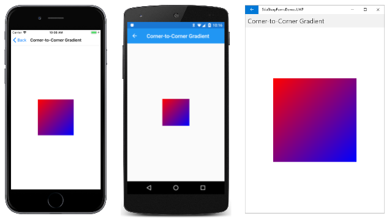
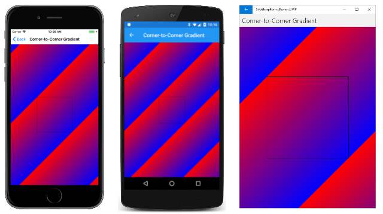
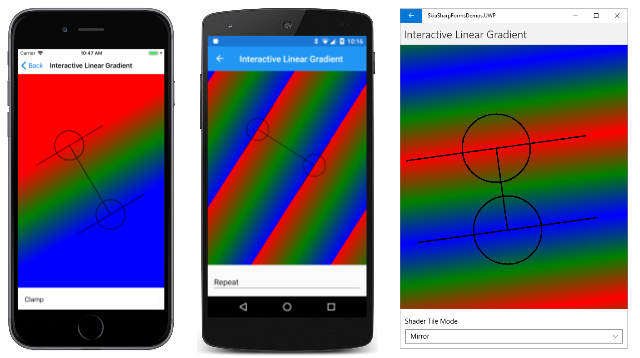
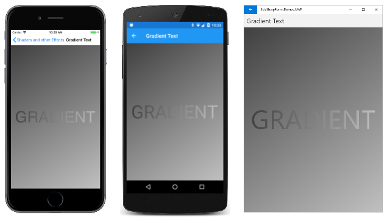
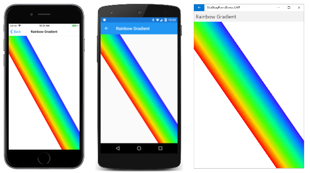
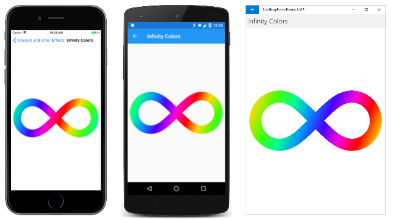

# The SkiaSharp linear gradient

The [`SKPaint`](xref:SkiaSharp.SKPaint) class defines a [`Color`](xref:SkiaSharp.SKPaint.Color) property that is used to stroke lines or fill areas with a solid color. You can alternatively stroke lines or fill areas with _gradients_, which are gradual blends of colors:


The most basic type of gradient is a _linear_ gradient. The blend of colors occurs on a line (called the _gradient line_) from one point to another. Lines that are perpendicular to the gradient line have the same color. You create a linear gradient using one of the two static [`SKShader.CreateLinearGradient`](xref:SkiaSharp.SKShader.CreateLinearGradient*) methods. The difference between the two overloads is that one includes a matrix transform and the other does not.

These methods return an object of type [`SKShader`](xref:SkiaSharp.SKShader) that you set to the [`Shader`](xref:SkiaSharp.SKPaint.Shader) property of `SKPaint`. If the `Shader` property is non-null, it overrides the `Color` property. Any line that is stroked or any area that is filled using this `SKPaint` object is based on the gradient rather than the solid color.

> [!NOTE]
> The `Shader` property is ignored when you include an `SKPaint` object in a `DrawBitmap` call. You can use the `Color` property of `SKPaint` to set a transparency level for displaying a bitmap (as described in the article [Displaying SkiaSharp bitmaps](../../bitmaps/displaying.md#displaying-in-pixel-dimensions)), but you can't use the `Shader` property for displaying a bitmap with a gradient transparency. Other techniques are available for displaying bitmaps with gradient transparencies: These are described in the articles [SkiaSharp circular gradients](circular-gradients.md#radial-gradients-for-masking) and [SkiaSharp compositing and blend modes](../blend-modes/porter-duff.md#gradient-transparency-and-transitions).

## Corner-to-corner gradients

Often a linear gradient extends from one corner of a rectangle to another. If the start point is the upper-left corner of the rectangle, the gradient can extend:

- vertically to the lower-left corner
- horizontally to the upper-right corner
- diagonally to the lower-right corner

The diagonal linear gradient is demonstrated in the first page in the **SkiaSharp Shaders and Other Effects** section of the sample. The **Corner-to-Corner Gradient** page creates an `SKCanvasView` in its constructor. The `PaintSurface` handler creates an `SKPaint` object in a `using` statement and then defines a 300-pixel square rectangle centered in the canvas:

```csharp
public class CornerToCornerGradientPage : ContentPage
{
    ···
    public CornerToCornerGradientPage ()
    {
        Title = "Corner-to-Corner Gradient";

        SKCanvasView canvasView = new SKCanvasView();
        canvasView.PaintSurface += OnCanvasViewPaintSurface;
        Content = canvasView;
        ···
    }

    void OnCanvasViewPaintSurface(object sender, SKPaintSurfaceEventArgs args)
    {
        SKImageInfo info = args.Info;
        SKSurface surface = args.Surface;
        SKCanvas canvas = surface.Canvas;

        canvas.Clear();

        using (SKPaint paint = new SKPaint())
        {
            // Create 300-pixel square centered rectangle
            float x = (info.Width - 300) / 2;
            float y = (info.Height - 300) / 2;
            SKRect rect = new SKRect(x, y, x + 300, y + 300);

            // Create linear gradient from upper-left to lower-right
            paint.Shader = SKShader.CreateLinearGradient(
                                new SKPoint(rect.Left, rect.Top),
                                new SKPoint(rect.Right, rect.Bottom),
                                new SKColor[] { SKColors.Red, SKColors.Blue },
                                new float[] { 0, 1 },
                                SKShaderTileMode.Repeat);

            // Draw the gradient on the rectangle
            canvas.DrawRect(rect, paint);
            ···
        }
    }
}
```

The `Shader` property of `SKPaint` is assigned the `SKShader` return value from the static `SKShader.CreateLinearGradient` method. The five arguments are as follows:

- The start point of the gradient, set here to the upper-left corner of the rectangle
- The end point of the gradient, set here to the lower-right corner of the rectangle
- An array of two or more colors that contribute to the gradient
- An array of `float` values indicating the relative position of the colors within the gradient line
- A member of the [`SKShaderTileMode`](xref:SkiaSharp.SKShaderTileMode) enumeration indicating how the gradient behaves beyond the ends of the gradient line

After the gradient object is created, the `DrawRect` method draws the 300-pixel square rectangle using the `SKPaint` object that includes the shader. Here it is running on iOS, Android, and the Universal Windows Platform (UWP):

[](linear-gradient-images/CornerToCornerGradient-Large.png#lightbox)

The gradient line is defined by the two points specified as the first two arguments. Notice that these points are relative to the _canvas_ and _not_ to the graphical object displayed with the gradient. Along the gradient line, the color gradually transitions from red at the upper left to blue at the lower right. Any line that is perpendicular to the gradient line has a constant color.

The array of `float` values specified as the fourth argument have a one-to-one correspondence with the array of colors. The values indicate the relative position along the gradient line where those colors occur. Here, the 0 means that `Red` occurs at the start of the gradient line, and 1 means that `Blue` occurs at the end of the line. The numbers must be ascending, and should be in the range of 0 to 1. If they aren't in that range, they will be adjusted to be in that range.

The two values in the array can be set to something other than 0 and 1. Try this:

```csharp
new float[] { 0.25f, 0.75f }
```

Now the whole first quarter of the gradient line is pure red, and the last quarter is pure blue. The mix of red and blue is restricted to the central half of the gradient line.

Generally, you'll want to space these position values equally from 0 to 1. If that is the case, you can simply supply `null` as the fourth argument to `CreateLinearGradient`.

Although this gradient is defined between two corners of the 300-pixel square rectangle, it isn't restricted to filling that rectangle. The **Corner-to-Corner Gradient** page includes some extra code that responds to taps or mouse clicks on the page. The `drawBackground` field is toggled between `true` and `false` with each tap. If the value is `true`, then the `PaintSurface` handler uses the same `SKPaint` object to fill the entire canvas, and then draws a black rectangle indicating the smaller rectangle:

```csharp
public class CornerToCornerGradientPage : ContentPage
{
    bool drawBackground;

    public CornerToCornerGradientPage ()
    {
        ···
        TapGestureRecognizer tap = new TapGestureRecognizer();
        tap.Tapped += (sender, args) =>
        {
            drawBackground ^= true;
            canvasView.InvalidateSurface();
        };
        canvasView.GestureRecognizers.Add(tap);
    }

    void OnCanvasViewPaintSurface(object sender, SKPaintSurfaceEventArgs args)
    {
        ···
        using (SKPaint paint = new SKPaint())
        {
            ···
            if (drawBackground)
            {
                // Draw the gradient on the whole canvas
                canvas.DrawRect(info.Rect, paint);

                // Outline the smaller rectangle
                paint.Shader = null;
                paint.Style = SKPaintStyle.Stroke;
                paint.Color = SKColors.Black;
                canvas.DrawRect(rect, paint);
            }
        }
    }
}
```

Here's what you'll see after tapping the screen:

[](linear-gradient-images/CornerToCornerGradientFull-Large.png#lightbox)

Notice that the gradient repeats itself in the same pattern beyond the points defining the gradient line. This repetition occurs because the last argument to `CreateLinearGradient` is `SKShaderTileMode.Repeat`. (You'll see the other options shortly.)

Also notice that the points that you use to specify the gradient line aren't unique. Lines that are perpendicular to the gradient line have the same color, so there are an infinite number of gradient lines that you can specify for the same effect. For example, when filling a rectangle with a horizontal gradient, you can specify the upper-left and upper-right corners, or the lower-left and lower-right corners, or any two points that are even with and parallel to those lines.

## Interactively experiment

You can interactively experiment with linear gradients with the **Interactive Linear Gradient** page. This page uses the `InteractivePage` class introduced in the article [**Three ways to draw an arc**](../../curves/arcs.md). `InteractivePage` handles [`TouchEffect`](~/xamarin-forms/app-fundamentals/effects/touch-tracking.md) events to maintain a collection of `TouchPoint` objects that you can move with your fingers or the mouse.

The XAML file attaches the `TouchEffect` to a parent of the `SKCanvasView` and also includes a `Picker` that allows you to select one of the three members of the [`SKShaderTileMode`](xref:SkiaSharp.SKShaderTileMode) enumeration:

```xaml
<local:InteractivePage xmlns="http://xamarin.com/schemas/2014/forms"
                       xmlns:x="http://schemas.microsoft.com/winfx/2009/xaml"
                       xmlns:local="clr-namespace:SkiaSharpFormsDemos"
                       xmlns:skia="clr-namespace:SkiaSharp;assembly=SkiaSharp"
                       xmlns:skiaforms="clr-namespace:SkiaSharp.Views.Maui.Controls;assembly=SkiaSharp.Views.Maui.Controls"
                       xmlns:tt="clr-namespace:TouchTracking"
                       x:Class="SkiaSharpFormsDemos.Effects.InteractiveLinearGradientPage"
                       Title="Interactive Linear Gradient">
    <Grid>
        <Grid.RowDefinitions>
            <RowDefinition Height="*" />
            <RowDefinition Height="Auto" />
        </Grid.RowDefinitions>

        <Grid BackgroundColor="White"
              Grid.Row="0">
            <skiaforms:SKCanvasView x:Name="canvasView"
                                    PaintSurface="OnCanvasViewPaintSurface" />
            <Grid.Effects>
                <tt:TouchEffect Capture="True"
                                TouchAction="OnTouchEffectAction" />
            </Grid.Effects>
        </Grid>

        <Picker x:Name="tileModePicker"
                Grid.Row="1"
                Title="Shader Tile Mode"
                Margin="10"
                SelectedIndexChanged="OnPickerSelectedIndexChanged">
            <Picker.ItemsSource>
                <x:Array Type="{x:Type skia:SKShaderTileMode}">
                    <x:Static Member="skia:SKShaderTileMode.Clamp" />
                    <x:Static Member="skia:SKShaderTileMode.Repeat" />
                    <x:Static Member="skia:SKShaderTileMode.Mirror" />
                </x:Array>
            </Picker.ItemsSource>

            <Picker.SelectedIndex>
                0
            </Picker.SelectedIndex>
        </Picker>
    </Grid>
</local:InteractivePage>
```

The constructor in the code-behind file creates two `TouchPoint` objects for the start and end points of the linear gradient. The `PaintSurface` handler defines an array of three colors (for a gradient from red to green to blue) and obtains the current `SKShaderTileMode` from the `Picker`:

```csharp
public partial class InteractiveLinearGradientPage : InteractivePage
{
    public InteractiveLinearGradientPage ()
    {
        InitializeComponent ();

        touchPoints = new TouchPoint[2];

        for (int i = 0; i < 2; i++)
        {
            touchPoints[i] = new TouchPoint
            {
                Center = new SKPoint(100 + i * 200, 100 + i * 200)
            };
        }

        InitializeComponent();
        baseCanvasView = canvasView;
    }

    void OnPickerSelectedIndexChanged(object sender, EventArgs args)
    {
        canvasView.InvalidateSurface();
    }

    void OnCanvasViewPaintSurface(object sender, SKPaintSurfaceEventArgs args)
    {
        SKImageInfo info = args.Info;
        SKSurface surface = args.Surface;
        SKCanvas canvas = surface.Canvas;

        canvas.Clear();

        SKColor[] colors = { SKColors.Red, SKColors.Green, SKColors.Blue };
        SKShaderTileMode tileMode =
            (SKShaderTileMode)(tileModePicker.SelectedIndex == -1 ?
                                        0 : tileModePicker.SelectedItem);

        using (SKPaint paint = new SKPaint())
        {
            paint.Shader = SKShader.CreateLinearGradient(touchPoints[0].Center,
                                                         touchPoints[1].Center,
                                                         colors,
                                                         null,
                                                         tileMode);
            canvas.DrawRect(info.Rect, paint);
        }
        ···
    }
}
```

The `PaintSurface` handler creates the `SKShader` object from all that information, and uses it to color the entire canvas. The array of `float` values is set to `null`. Otherwise, to equally space three colors, you'd set that parameter to an array with the values 0, 0.5, and 1.

The bulk of the `PaintSurface` handler is devoted to displaying several objects: the touch points as outline circles, the gradient line, and the lines perpendicular to the gradient lines at the touch points:

```csharp
public partial class InteractiveLinearGradientPage : InteractivePage
{
    ···
    void OnCanvasViewPaintSurface(object sender, SKPaintSurfaceEventArgs args)
    {
        ···
        // Display the touch points here rather than by TouchPoint
        using (SKPaint paint = new SKPaint())
        {
            paint.Style = SKPaintStyle.Stroke;
            paint.Color = SKColors.Black;
            paint.StrokeWidth = 3;

            foreach (TouchPoint touchPoint in touchPoints)
            {
                canvas.DrawCircle(touchPoint.Center, touchPoint.Radius, paint);
            }

            // Draw gradient line connecting touchpoints
            canvas.DrawLine(touchPoints[0].Center, touchPoints[1].Center, paint);

            // Draw lines perpendicular to the gradient line
            SKPoint vector = touchPoints[1].Center - touchPoints[0].Center;
            float length = (float)Math.Sqrt(Math.Pow(vector.X, 2) +
                                            Math.Pow(vector.Y, 2));
            vector.X /= length;
            vector.Y /= length;
            SKPoint rotate90 = new SKPoint(-vector.Y, vector.X);
            rotate90.X *= 200;
            rotate90.Y *= 200;

            canvas.DrawLine(touchPoints[0].Center,
                            touchPoints[0].Center + rotate90,
                            paint);

            canvas.DrawLine(touchPoints[0].Center,
                            touchPoints[0].Center - rotate90,
                            paint);

            canvas.DrawLine(touchPoints[1].Center,
                            touchPoints[1].Center + rotate90,
                            paint);

            canvas.DrawLine(touchPoints[1].Center,
                            touchPoints[1].Center - rotate90,
                            paint);
        }
    }
}
```

The gradient line connecting the two touchpoints is easy to draw, but the perpendicular lines require some more work. The gradient line is converted to a vector, normalized to have a length of one unit, and then rotated by 90 degrees. That vector is then given a length of 200 pixels. It's used to draw four lines that extend from the touch points to be perpendicular to the gradient line.

The perpendicular lines coincide with the beginning and end of the gradient. What happens beyond those lines depends on the setting of the `SKShaderTileMode` enumeration:

[](linear-gradient-images/InteractiveLinearGradient-Large.png#lightbox)

The three screenshots show the results of the three different values of [`SKShaderTileMode`](xref:SkiaSharp.SKShaderTileMode). The iOS screenshot shows `SKShaderTileMode.Clamp`, which just extends the colors on the border of the gradient. The `SKShaderTileMode.Repeat` option in the Android screenshot shows how the gradient pattern is repeated. The `SKShaderTileMode.Mirror` option in the UWP screenshot also repeats the pattern, but the pattern is reversed each time, resulting in no color discontinuities.

## Gradients on gradients

The `SKShader` class defines no public properties or methods except for `Dispose`. The `SKShader` objects that created by its static methods are therefore immutable. Even if you use the same gradient for two different objects, it's likely you'll want to vary the gradient slightly. To do that, you'll need to create a new `SKShader` object.

The **Gradient Text** page displays text and a brackground that are both colored with similar gradients:

[](linear-gradient-images/GradientText-Large.png#lightbox)

The only differences in the gradients are the start and end points. The gradient used for displaying text is based on two points on the corners of the bounding rectangle for the text. For the background, the two points are based on the entire canvas. Here's the code:

```csharp
public class GradientTextPage : ContentPage
{
    const string TEXT = "GRADIENT";

    public GradientTextPage ()
    {
        Title = "Gradient Text";

        SKCanvasView canvasView = new SKCanvasView();
        canvasView.PaintSurface += OnCanvasViewPaintSurface;
        Content = canvasView;
    }

    void OnCanvasViewPaintSurface(object sender, SKPaintSurfaceEventArgs args)
    {
        SKImageInfo info = args.Info;
        SKSurface surface = args.Surface;
        SKCanvas canvas = surface.Canvas;

        canvas.Clear();

        using (SKPaint paint = new SKPaint())
        {
            // Create gradient for background
            paint.Shader = SKShader.CreateLinearGradient(
                                new SKPoint(0, 0),
                                new SKPoint(info.Width, info.Height),
                                new SKColor[] { new SKColor(0x40, 0x40, 0x40),
                                                new SKColor(0xC0, 0xC0, 0xC0) },
                                null,
                                SKShaderTileMode.Clamp);

            // Draw background
            canvas.DrawRect(info.Rect, paint);

            // Set TextSize to fill 90% of width
            paint.TextSize = 100;
            float width = paint.MeasureText(TEXT);
            float scale = 0.9f * info.Width / width;
            paint.TextSize *= scale;

            // Get text bounds
            SKRect textBounds = new SKRect();
            paint.MeasureText(TEXT, ref textBounds);

            // Calculate offsets to center the text on the screen
            float xText = info.Width / 2 - textBounds.MidX;
            float yText = info.Height / 2 - textBounds.MidY;

            // Shift textBounds by that amount
            textBounds.Offset(xText, yText);

            // Create gradient for text
            paint.Shader = SKShader.CreateLinearGradient(
                                new SKPoint(textBounds.Left, textBounds.Top),
                                new SKPoint(textBounds.Right, textBounds.Bottom),
                                new SKColor[] { new SKColor(0x40, 0x40, 0x40),
                                                new SKColor(0xC0, 0xC0, 0xC0) },
                                null,
                                SKShaderTileMode.Clamp);

            // Draw text
            canvas.DrawText(TEXT, xText, yText, paint);
        }
    }
}
```

The `Shader` property of the `SKPaint` object is set first to display a gradient to cover the background. The gradient points are set to the upper-left and lower-right corners of the canvas.

The code sets the `TextSize` property of the `SKPaint` object so that the text is displayed at 90% of the width of the canvas. The text bounds are used to calculate `xText` and `yText` values to pass to the `DrawText` method to center the text.

However, the gradient points for the second `CreateLinearGradient` call must refer to the upper-left and lower-right corner of the text relative to the canvas when it's displayed. This is accomplished by shifting the `textBounds` rectangle by the same `xText` and `yText` values:

```csharp
textBounds.Offset(xText, yText);
```

Now the upper-left and lower-right corners of the rectangle can be used to set the start and end points of the gradient.

## Animating a gradient

There are several ways to animate a gradient. One approach is to animate the start and end points. The **Gradient Animation** page moves the two points around in a circle that is centered on the canvas. The radius of this circle is half the width or height of the canvas, whichever is smaller. The start and end points are opposite each other on this circle, and the gradient goes from white to black with a `Mirror` tile mode:

[](linear-gradient-images/GradientAnimation-Large.png#lightbox)

The constructor creates the `SKCanvasView`. The `OnAppearing` and `OnDisappearing` methods handle the animation logic:

```csharp
public class GradientAnimationPage : ContentPage
{
    SKCanvasView canvasView;
    bool isAnimating;
    double angle;
    Stopwatch stopwatch = new Stopwatch();

    public GradientAnimationPage()
    {
        Title = "Gradient Animation";

        canvasView = new SKCanvasView();
        canvasView.PaintSurface += OnCanvasViewPaintSurface;
        Content = canvasView;
    }

    protected override void OnAppearing()
    {
        base.OnAppearing();

        isAnimating = true;
        stopwatch.Start();
        Device.StartTimer(TimeSpan.FromMilliseconds(16), OnTimerTick);
    }

    protected override void OnDisappearing()
    {
        base.OnDisappearing();

        stopwatch.Stop();
        isAnimating = false;
    }

    bool OnTimerTick()
    {
        const int duration = 3000;
        angle = 2 * Math.PI * (stopwatch.ElapsedMilliseconds % duration) / duration;
        canvasView.InvalidateSurface();

        return isAnimating;
    }
    ···
}
```

The `OnTimerTick` method calculates an `angle` value that is animated from 0 to 2π every 3 seconds.

Here's one way to calculate the two gradient points. An `SKPoint` value named `vector` is calculated to extend from the center of the canvas to a point on the radius of the circle. The direction of this vector is based on the sine and cosine values of the angle. The two opposite gradient points are then calculated: One point is calculated by subtracting that vector from the center point, and other point is calculated by adding the vector to the center point:

```csharp
public class GradientAnimationPage : ContentPage
{
    ···
    void OnCanvasViewPaintSurface(object sender, SKPaintSurfaceEventArgs args)
    {
        SKImageInfo info = args.Info;
        SKSurface surface = args.Surface;
        SKCanvas canvas = surface.Canvas;

        canvas.Clear();

        using (SKPaint paint = new SKPaint())
        {
            SKPoint center = new SKPoint(info.Rect.MidX, info.Rect.MidY);
            int radius = Math.Min(info.Width, info.Height) / 2;
            SKPoint vector = new SKPoint((float)(radius * Math.Cos(angle)),
                                         (float)(radius * Math.Sin(angle)));

            paint.Shader = SKShader.CreateLinearGradient(
                                center - vector,
                                center + vector,
                                new SKColor[] { SKColors.White, SKColors.Black },
                                null,
                                SKShaderTileMode.Mirror);

            canvas.DrawRect(info.Rect, paint);
        }
    }
}
```

A somewhat different approach requires less code. This approach makes use of the [`SKShader.CreateLinearGradient`](xref:SkiaSharp.SKShader.CreateLinearGradient(SkiaSharp.SKPoint,SkiaSharp.SKPoint,SkiaSharp.SKColor[],System.Single[],SkiaSharp.SKShaderTileMode,SkiaSharp.SKMatrix)) overload method with a matrix transform as the last argument. This approach is the version in the sample:

```csharp
public class GradientAnimationPage : ContentPage
{
    ···
    void OnCanvasViewPaintSurface(object sender, SKPaintSurfaceEventArgs args)
    {
        SKImageInfo info = args.Info;
        SKSurface surface = args.Surface;
        SKCanvas canvas = surface.Canvas;

        canvas.Clear();

        using (SKPaint paint = new SKPaint())
        {
            paint.Shader = SKShader.CreateLinearGradient(
                                new SKPoint(0, 0),
                                info.Width < info.Height ? new SKPoint(info.Width, 0) :
                                                           new SKPoint(0, info.Height),
                                new SKColor[] { SKColors.White, SKColors.Black },
                                new float[] { 0, 1 },
                                SKShaderTileMode.Mirror,
                                SKMatrix.MakeRotation((float)angle, info.Rect.MidX, info.Rect.MidY));

            canvas.DrawRect(info.Rect, paint);
        }
    }
}
```

If the width of the canvas is less than the height, then the two gradient points are set to (0, 0) and (`info.Width`, 0). The rotation transform passed as the last argument to `CreateLinearGradient` effectively rotates those two points around the center of the screen.

Note that if the angle is 0, there's no rotation, and the two gradient points are the upper-left and upper-right corners of the canvas. Those points aren't the same gradient points calculated as shown in the previous `CreateLinearGradient` call. But these points are _parallel_ to the horizontal gradient line that bisects the center of the canvas, and they result in an identical gradient.

**Rainbow Gradient**

The **Rainbow Gradient** page draws a rainbow from the upper-left corner of the canvas to the lower-right corner. But this rainbow gradient isn't like a real rainbow. It's straight rather than curved, but it's based on eight HSL (hue-saturation-luminosity) colors that are determined by cycling through hue values from 0 to 360:

```csharp
SKColor[] colors = new SKColor[8];

for (int i = 0; i < colors.Length; i++)
{
    colors[i] = SKColor.FromHsl(i * 360f / (colors.Length - 1), 100, 50);
}
```

That code is part of the `PaintSurface` handler shown below. The handler begins by creating a path that defines a six-sided polygon that extends from the upper-left corner of the canvas to the lower-right corner:

```csharp
public class RainbowGradientPage : ContentPage
{
    public RainbowGradientPage ()
    {
        Title = "Rainbow Gradient";

        SKCanvasView canvasView = new SKCanvasView();
        canvasView.PaintSurface += OnCanvasViewPaintSurface;
        Content = canvasView;
    }

    void OnCanvasViewPaintSurface(object sender, SKPaintSurfaceEventArgs args)
    {
        SKImageInfo info = args.Info;
        SKSurface surface = args.Surface;
        SKCanvas canvas = surface.Canvas;

        canvas.Clear();

        using (SKPath path = new SKPath())
        {
            float rainbowWidth = Math.Min(info.Width, info.Height) / 2f;

            // Create path from upper-left to lower-right corner
            path.MoveTo(0, 0);
            path.LineTo(rainbowWidth / 2, 0);
            path.LineTo(info.Width, info.Height - rainbowWidth / 2);
            path.LineTo(info.Width, info.Height);
            path.LineTo(info.Width - rainbowWidth / 2, info.Height);
            path.LineTo(0, rainbowWidth / 2);
            path.Close();

            using (SKPaint paint = new SKPaint())
            {
                SKColor[] colors = new SKColor[8];

                for (int i = 0; i < colors.Length; i++)
                {
                    colors[i] = SKColor.FromHsl(i * 360f / (colors.Length - 1), 100, 50);
                }

                paint.Shader = SKShader.CreateLinearGradient(
                                    new SKPoint(0, rainbowWidth / 2),
                                    new SKPoint(rainbowWidth / 2, 0),
                                    colors,
                                    null,
                                    SKShaderTileMode.Repeat);

                canvas.DrawPath(path, paint);
            }
        }
    }
}
```

The two gradient points in the `CreateLinearGradient` method are based on two of the points that define this path: Both points are close to the upper-left corner. The first is on the upper edge of the canvas and the second is on the left edge of the canvas. Here's the result:

[](linear-gradient-images/RainbowGradientFaulty-Large.png#lightbox)

This is an interesting image, but it's not quite the intent. The problem is that when creating a linear gradient, the lines of constant color are perpendicular to the gradient line. The gradient line is based on the points where the figure touches the top and left sides, and that line is generally not perpendicular to the edges of the figure that extend to the bottom-right corner. This approach would work only if the canvas were square.

To create a proper rainbow gradient, the gradient line must be perpendicular to the edge of the rainbow. That's a more involved calculation. A vector must be defined that is parallel to the long side of the figure. The vector is rotated 90 degrees so that it's perpendicular to that side. It is then lengthened to be the width of the figure by multiplying by `rainbowWidth`. The two gradient points are calculated based on a point on the side of the figure, and that point plus the vector. Here is the code that appears in the **Rainbow Gradient** page in the sample:

```csharp
public class RainbowGradientPage : ContentPage
{
    ···
    void OnCanvasViewPaintSurface(object sender, SKPaintSurfaceEventArgs args)
    {
        ···
        using (SKPath path = new SKPath())
        {
            ···
            using (SKPaint paint = new SKPaint())
            {
                ···
                // Vector on lower-left edge, from top to bottom
                SKPoint edgeVector = new SKPoint(info.Width - rainbowWidth / 2, info.Height) -
                                     new SKPoint(0, rainbowWidth / 2);

                // Rotate 90 degrees counter-clockwise:
                SKPoint gradientVector = new SKPoint(edgeVector.Y, -edgeVector.X);

                // Normalize
                float length = (float)Math.Sqrt(Math.Pow(gradientVector.X, 2) +
                                                Math.Pow(gradientVector.Y, 2));
                gradientVector.X /= length;
                gradientVector.Y /= length;

                // Make it the width of the rainbow
                gradientVector.X *= rainbowWidth;
                gradientVector.Y *= rainbowWidth;

                // Calculate the two points
                SKPoint point1 = new SKPoint(0, rainbowWidth / 2);
                SKPoint point2 = point1 + gradientVector;

                paint.Shader = SKShader.CreateLinearGradient(point1,
                                                             point2,
                                                             colors,
                                                             null,
                                                             SKShaderTileMode.Repeat);

                canvas.DrawPath(path, paint);
            }
        }
    }
}
```

Now the rainbow colors are aligned with the figure:

[](linear-gradient-images/RainbowGradient-Large.png#lightbox)

**Infinity Colors**

A rainbow gradient is also used in the **Infinity Colors** page. This page draws an infinity sign using a path object described in the article [**Three Types of Bézier Curves**](../../curves/beziers.md#bezier-curve-approximation-to-circular-arcs). The image is then colored with an animated rainbow gradient that continuously sweeps across the image.

The constructor creates the `SKPath` object describing the infinity sign. After the path is created, the constructor can also obtain the rectangular bounds of the path. It then calculates a value called `gradientCycleLength`. If a gradient is based on the upper-left and lower-right corners of the `pathBounds` rectangle, this `gradientCycleLength` value is the total horizontal width of the gradient pattern:

```csharp
public class InfinityColorsPage : ContentPage
{
    ···
    SKCanvasView canvasView;

    // Path information
    SKPath infinityPath;
    SKRect pathBounds;
    float gradientCycleLength;

    // Gradient information
    SKColor[] colors = new SKColor[8];
    ···

    public InfinityColorsPage ()
    {
        Title = "Infinity Colors";

        // Create path for infinity sign
        infinityPath = new SKPath();
        infinityPath.MoveTo(0, 0);                                  // Center
        infinityPath.CubicTo(  50,  -50,   95, -100,  150, -100);   // To top of right loop
        infinityPath.CubicTo( 205, -100,  250,  -55,  250,    0);   // To far right of right loop
        infinityPath.CubicTo( 250,   55,  205,  100,  150,  100);   // To bottom of right loop
        infinityPath.CubicTo(  95,  100,   50,   50,    0,    0);   // Back to center  
        infinityPath.CubicTo( -50,  -50,  -95, -100, -150, -100);   // To top of left loop
        infinityPath.CubicTo(-205, -100, -250,  -55, -250,    0);   // To far left of left loop
        infinityPath.CubicTo(-250,   55, -205,  100, -150,  100);   // To bottom of left loop
        infinityPath.CubicTo( -95,  100, - 50,   50,    0,    0);   // Back to center
        infinityPath.Close();

        // Calculate path information
        pathBounds = infinityPath.Bounds;
        gradientCycleLength = pathBounds.Width +
            pathBounds.Height * pathBounds.Height / pathBounds.Width;

        // Create SKColor array for gradient
        for (int i = 0; i < colors.Length; i++)
        {
            colors[i] = SKColor.FromHsl(i * 360f / (colors.Length - 1), 100, 50);
        }

        canvasView = new SKCanvasView();
        canvasView.PaintSurface += OnCanvasViewPaintSurface;
        Content = canvasView;
    }
    ···
}
```

The constructor also creates the `colors` array for the rainbow, and the `SKCanvasView` object.

Overrides of the `OnAppearing` and `OnDisappearing` methods perform the overhead for the animation. The `OnTimerTick` method animates the `offset` field from 0 to `gradientCycleLength` every two seconds:

```csharp
public class InfinityColorsPage : ContentPage
{
    ···
    // For animation
    bool isAnimating;
    float offset;
    Stopwatch stopwatch = new Stopwatch();
    ···

    protected override void OnAppearing()
    {
        base.OnAppearing();

        isAnimating = true;
        stopwatch.Start();
        Device.StartTimer(TimeSpan.FromMilliseconds(16), OnTimerTick);
    }

    protected override void OnDisappearing()
    {
        base.OnDisappearing();

        stopwatch.Stop();
        isAnimating = false;
    }

    bool OnTimerTick()
    {
        const int duration = 2;     // seconds
        double progress = stopwatch.Elapsed.TotalSeconds % duration / duration;
        offset = (float)(gradientCycleLength * progress);
        canvasView.InvalidateSurface();

        return isAnimating;
    }
    ···
}
```

Finally, the `PaintSurface` handler renders the infinity sign. Because the path contains negative and positive coordinates surrounding a center point of (0, 0), a `Translate` transform on the canvas is used to shift it to the center. The translate transform is followed by a `Scale` transform that applies a scaling factor that makes the infinity sign as large as possible while still staying within 95% of the width and height of the canvas.

Notice that the `STROKE_WIDTH` constant is added to the width and height of the path bounding rectangle. The path will be stroked with a line of this width, so the size of the rendered infinity size is increased by half that width on all four sides:

```csharp
public class InfinityColorsPage : ContentPage
{
    const int STROKE_WIDTH = 50;
    ···
    void OnCanvasViewPaintSurface(object sender, SKPaintSurfaceEventArgs args)
    {
        SKImageInfo info = args.Info;
        SKSurface surface = args.Surface;
        SKCanvas canvas = surface.Canvas;

        canvas.Clear();

        // Set transforms to shift path to center and scale to canvas size
        canvas.Translate(info.Width / 2, info.Height / 2);
        canvas.Scale(0.95f *
            Math.Min(info.Width / (pathBounds.Width + STROKE_WIDTH),
                     info.Height / (pathBounds.Height + STROKE_WIDTH)));

        using (SKPaint paint = new SKPaint())
        {
            paint.Style = SKPaintStyle.Stroke;
            paint.StrokeWidth = STROKE_WIDTH;
            paint.Shader = SKShader.CreateLinearGradient(
                                new SKPoint(pathBounds.Left, pathBounds.Top),
                                new SKPoint(pathBounds.Right, pathBounds.Bottom),
                                colors,
                                null,
                                SKShaderTileMode.Repeat,
                                SKMatrix.MakeTranslation(offset, 0));

            canvas.DrawPath(infinityPath, paint);
        }
    }
}
```

Look at the points passed as the first two arguments of `SKShader.CreateLinearGradient`. Those points are based on the original path bounding rectangle. The first point is (&ndash;250, &ndash;100) and the second is (250, 100). Internal to SkiaSharp, those points are subjected to the current canvas transform so they align correctly with the displayed infinity sign.

Without the last argument to `CreateLinearGradient`, you'd see a rainbow gradient that extends from the upper left of the infinity sign to the lower right. (Actually, the gradient extends from the upper-left corner to the lower-right corner of the bounding rectangle. The rendered infinity sign is greater than the bounding rectangle by half the `STROKE_WIDTH` value on all sides. Because the gradient is red at both the beginning and end, and the gradient is created with `SKShaderTileMode.Repeat`, the difference isn't noticeable.)

With that last argument to `CreateLinearGradient`, the gradient pattern continuously sweeps across the image:

[](linear-gradient-images/InfinityColors-Large.png#lightbox)

## Transparency and gradients

The colors that contribute to a gradient can incorporate transparency. Instead of a gradient that fades from one color to another, the gradient can fade from a color to transparent.

You can use this technique for some interesting effects. One of the classic examples shows a graphical object with its reflection:

[](linear-gradient-images/ReflectionGradient-Large.png#lightbox)

The text that is upside-down is colored with a gradient that is 50% transparent at the top to fully transparent at the bottom. These levels of transparency are associated with alpha values of 0x80 and 0.

The `PaintSurface` handler in the **Reflection Gradient** page scales the size of the text to 90% of the width of the canvas. It then calculates `xText` and `yText` values to position the text to be horizontally centered but sitting on a baseline corresponding to the vertical center of the page:

```csharp
public class ReflectionGradientPage : ContentPage
{
    const string TEXT = "Reflection";

    public ReflectionGradientPage ()
    {
        Title = "Reflection Gradient";

        SKCanvasView canvasView = new SKCanvasView();
        canvasView.PaintSurface += OnCanvasViewPaintSurface;
        Content = canvasView;
    }

    void OnCanvasViewPaintSurface(object sender, SKPaintSurfaceEventArgs args)
    {
        SKImageInfo info = args.Info;
        SKSurface surface = args.Surface;
        SKCanvas canvas = surface.Canvas;

        canvas.Clear();

        using (SKPaint paint = new SKPaint())
        {
            // Set text color to blue
            paint.Color = SKColors.Blue;

            // Set text size to fill 90% of width
            paint.TextSize = 100;
            float width = paint.MeasureText(TEXT);
            float scale = 0.9f * info.Width / width;
            paint.TextSize *= scale;

            // Get text bounds
            SKRect textBounds = new SKRect();
            paint.MeasureText(TEXT, ref textBounds);

            // Calculate offsets to position text above center
            float xText = info.Width / 2 - textBounds.MidX;
            float yText = info.Height / 2;

            // Draw unreflected text
            canvas.DrawText(TEXT, xText, yText, paint);

            // Shift textBounds to match displayed text
            textBounds.Offset(xText, yText);

            // Use those offsets to create a gradient for the reflected text
            paint.Shader = SKShader.CreateLinearGradient(
                                new SKPoint(0, textBounds.Top),
                                new SKPoint(0, textBounds.Bottom),
                                new SKColor[] { paint.Color.WithAlpha(0),
                                                paint.Color.WithAlpha(0x80) },
                                null,
                                SKShaderTileMode.Clamp);

            // Scale the canvas to flip upside-down around the vertical center
            canvas.Scale(1, -1, 0, yText);

            // Draw reflected text
            canvas.DrawText(TEXT, xText, yText, paint);
        }
    }
}
```

Those `xText` and `yText` values are the same values used to display the reflected text in the `DrawText` call at the bottom of the `PaintSurface` handler. Just before that code, however, you'll see a call to the `Scale` method of `SKCanvas`. This `Scale` method scales horizontally by 1 (which does nothing) but vertically by &ndash;1, which effectively flips everything upside-down. The center of rotation is set to the point (0, `yText`), where `yText` is the vertical center of the canvas, originally calculated as `info.Height` divided by 2.

Keep in mind that Skia uses the gradient to color graphical objects prior to the canvas transforms. After the unreflected text is drawn, the `textBounds` rectangle is shifted so it corresponds to the displayed text:

```csharp
textBounds.Offset(xText, yText);
```

The `CreateLinearGradient` call defines a gradient from the top of that rectangle to the bottom. The gradient is from a completely transparent blue (`paint.Color.WithAlpha(0)`) to a 50% transparent blue (`paint.Color.WithAlpha(0x80)`). The canvas transform flips the text upside-down, so the 50% transparent blue starts at the baseline, and becomes transparent at the top of the text.

## Related links

- [SkiaSharp APIs](/dotnet/api/skiasharp)
