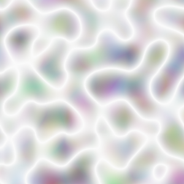

# SkiaSharp noise and composing

Simple vector graphics tend to look unnatural. The straight lines, smooth curves, and solid colors don't resemble the imperfections of real-world objects. While working on the computer-generated graphics for the 1982 movie _Tron_, computer scientist Ken Perlin began developing algorithms that used random processes to give these images more realistic textures. In 1997, Ken Perlin won an Academy Award for Technical Achievement. His work has come to be known as Perlin noise, and it is supported in SkiaSharp. Here's an example:



As you can see, each pixel is not a random color value. The continuity from pixel to pixel results in random shapes.

The support of Perlin noise in Skia is based on a W3C specification for CSS and SVG. Section 8.20 of [**Filter Effects Module Level 1**](https://www.w3.org/TR/filter-effects-1/#feTurbulenceElement) includes the underlying Perlin noise algorithms in C code.

## Exploring Perlin noise

The [`SKShader`](xref:SkiaSharp.SKShader) class defines two different static methods for generating Perlin noise:  [`CreatePerlinNoiseFractalNoise`](xref:SkiaSharp.SKShader.CreatePerlinNoiseFractalNoise*) and [`CreatePerlinNoiseTurbulence`](xref:SkiaSharp.SKShader.CreatePerlinNoiseTurbulence*). The parameters are identical:

```csharp
public static SkiaSharp CreatePerlinNoiseFractalNoise (float baseFrequencyX, float baseFrequencyY, int numOctaves, float seed);

public static SkiaSharp.SKShader CreatePerlinNoiseTurbulence (float baseFrequencyX, float baseFrequencyY, int numOctaves, float seed);
```

Both methods also exist in overloaded versions with an additional `SKPointI` parameter. The section [**Tiling Perlin noise**](#tiling-perlin-noise) discusses these overloads.

The two `baseFrequency` arguments are positive values defined in the SkiaSharp documentation as ranging from 0 to 1, but they can be set to higher values as well. The higher the value, the greater the change in the random image in the horizontal and vertical directions.

The `numOctaves` value is an integer of 1 or higher. It relates to an iteration factor in the algorithms. Each additional octave contributes an effect that is half of the previous octave, so the effect decreases with higher octave values.

The `seed` parameter is the starting point for the random-number generator. Although specified as a floating-point value, the fraction is truncated before it's used, and 0 is the same as 1.

The **Perlin Noise** page in the sample allows you experiment with various values of the `baseFrequency` and `numOctaves` arguments. Here's the XAML file:

```xaml
<?xml version="1.0" encoding="utf-8" ?>
<ContentPage xmlns="http://xamarin.com/schemas/2014/forms"
             xmlns:x="http://schemas.microsoft.com/winfx/2009/xaml"
             xmlns:skia="clr-namespace:SkiaSharp.Views.Maui.Controls;assembly=SkiaSharp.Views.Maui.Controls"
             x:Class="SkiaSharpFormsDemos.Effects.PerlinNoisePage"
             Title="Perlin Noise">

    <StackLayout>
        <skia:SKCanvasView x:Name="canvasView"
                           VerticalOptions="FillAndExpand"
                           PaintSurface="OnCanvasViewPaintSurface" />

        <Slider x:Name="baseFrequencyXSlider"
                Maximum="4"
                Margin="10, 0"
                ValueChanged="OnSliderValueChanged" />

        <Label x:Name="baseFrequencyXText"
               HorizontalTextAlignment="Center" />

        <Slider x:Name="baseFrequencyYSlider"
                Maximum="4"
                Margin="10, 0"
                ValueChanged="OnSliderValueChanged" />

        <Label x:Name="baseFrequencyYText"
               HorizontalTextAlignment="Center" />

        <StackLayout Orientation="Horizontal"
                     HorizontalOptions="Center"
                     Margin="10">

            <Label Text="{Binding Source={x:Reference octavesStepper},
                                  Path=Value,
                                  StringFormat='Number of Octaves: {0:F0}'}"
                   VerticalOptions="Center" />

            <Stepper x:Name="octavesStepper"
                     Minimum="1"
                     ValueChanged="OnStepperValueChanged" />
        </StackLayout>
    </StackLayout>
</ContentPage>
```

It uses two `Slider` views for the two `baseFrequency` arguments. To expand the range of the lower values, the sliders are logarithmic. The code-behind file calculates the arguments to the `SKShader`methods from powers of the `Slider` values. The `Label` views display the calculated values:

```csharp
float baseFreqX = (float)Math.Pow(10, baseFrequencyXSlider.Value - 4);
baseFrequencyXText.Text = String.Format("Base Frequency X = {0:F4}", baseFreqX);

float baseFreqY = (float)Math.Pow(10, baseFrequencyYSlider.Value - 4);
baseFrequencyYText.Text = String.Format("Base Frequency Y = {0:F4}", baseFreqY);
```

A `Slider` value of 1 corresponds to 0.001, a `Slider` value os 2 corresponds to 0.01, a `Slider` values of 3 corresponds to 0.1, and a `Slider` value of 4 corresponds to 1.

Here's the code-behind file that includes that code:

```csharp
public partial class PerlinNoisePage : ContentPage
{
    public PerlinNoisePage()
    {
        InitializeComponent();
    }

    void OnSliderValueChanged(object sender, ValueChangedEventArgs args)
    {
        canvasView.InvalidateSurface();
    }

    void OnStepperValueChanged(object sender, ValueChangedEventArgs args)
    {
        canvasView.InvalidateSurface();
    }

    void OnCanvasViewPaintSurface(object sender, SKPaintSurfaceEventArgs args)
    {
        SKImageInfo info = args.Info;
        SKSurface surface = args.Surface;
        SKCanvas canvas = surface.Canvas;

        canvas.Clear();

        // Get values from sliders and stepper
        float baseFreqX = (float)Math.Pow(10, baseFrequencyXSlider.Value - 4);
        baseFrequencyXText.Text = String.Format("Base Frequency X = {0:F4}", baseFreqX);

        float baseFreqY = (float)Math.Pow(10, baseFrequencyYSlider.Value - 4);
        baseFrequencyYText.Text = String.Format("Base Frequency Y = {0:F4}", baseFreqY);

        int numOctaves = (int)octavesStepper.Value;

        using (SKPaint paint = new SKPaint())
        {
            paint.Shader =
                SKShader.CreatePerlinNoiseFractalNoise(baseFreqX,
                                                       baseFreqY,
                                                       numOctaves,
                                                       0);

            SKRect rect = new SKRect(0, 0, info.Width, info.Height / 2);
            canvas.DrawRect(rect, paint);

            paint.Shader =
                SKShader.CreatePerlinNoiseTurbulence(baseFreqX,
                                                     baseFreqY,
                                                     numOctaves,
                                                     0);

            rect = new SKRect(0, info.Height / 2, info.Width, info.Height);
            canvas.DrawRect(rect, paint);
        }
    }
}
```

Here's the program running on iOS, Android, and Universal Windows Platform (UWP) devices. The fractal noise is shown in the upper half of the canvas. The turbulence noise is in the bottom half:

[](noise-images/PerlinNoise-Large.png#lightbox)

The same arguments always produce the same pattern that begins at the upper-left corner. This consistency is obvious when you adjust the width and height of the UWP window. As Windows 10 redraws the screen, the pattern in the upper half of the canvas remains the same.

The noise pattern incorporates various degrees of transparency. The transparency becomes obvious if you set a color in the `canvas.Clear()` call. That color becomes prominent in the pattern. You'll also see this effect in the section [**Combining multiple shaders**](#combining-multiple-shaders).

These Perlin noise patterns are rarely used by themselves. Often they are subjected to blend modes and color filters discussed in later articles.

## Tiling Perlin noise

The two static `SKShader` methods for creating Perlin noise also exist in overload versions. The [`CreatePerlinNoiseFractalNoise`](xref:SkiaSharp.SKShader.CreatePerlinNoiseFractalNoise(System.Single,System.Single,System.Int32,System.Single,SkiaSharp.SKPointI)) and [`CreatePerlinNoiseTurbulence`](xref:SkiaSharp.SKShader.CreatePerlinNoiseFractalNoise(System.Single,System.Single,System.Int32,System.Single,SkiaSharp.SKPointI)) overloads have an additional `SKPointI` parameter:

```csharp
public static SKShader CreatePerlinNoiseFractalNoise (float baseFrequencyX, float baseFrequencyY, int numOctaves, float seed, SKPointI tileSize);

public static SKShader CreatePerlinNoiseTurbulence (float baseFrequencyX, float baseFrequencyY, int numOctaves, float seed, SKPointI tileSize);
```

The [`SKPointI`](xref:SkiaSharp.SKPointI) structure is the integer version of the familiar [`SKPoint`](xref:SkiaSharp.SKPoint) structure. `SKPointI` defines `X` and `Y` properties of type `int` rather than `float`.

These methods create a repeating pattern of the specified size. In each tile, the right edge is the same as the left edge, and the top edge is the same as the bottom edge. This characteristic is demonstrated in the **Tiled Perlin Noise** page. The XAML file is similar to the previous sample, but it only has a `Stepper` view for changing the `seed` argument:

```xaml
<ContentPage xmlns="http://xamarin.com/schemas/2014/forms"
             xmlns:x="http://schemas.microsoft.com/winfx/2009/xaml"
             xmlns:skia="clr-namespace:SkiaSharp.Views.Maui.Controls;assembly=SkiaSharp.Views.Maui.Controls"
             x:Class="SkiaSharpFormsDemos.Effects.TiledPerlinNoisePage"
             Title="Tiled Perlin Noise">

    <StackLayout>
        <skia:SKCanvasView x:Name="canvasView"
                           VerticalOptions="FillAndExpand"
                           PaintSurface="OnCanvasViewPaintSurface" />

        <StackLayout Orientation="Horizontal"
                     HorizontalOptions="Center"
                     Margin="10">

            <Label Text="{Binding Source={x:Reference seedStepper},
                                  Path=Value,
                                  StringFormat='Seed: {0:F0}'}"
                   VerticalOptions="Center" />

            <Stepper x:Name="seedStepper"
                     Minimum="1"
                     ValueChanged="OnStepperValueChanged" />

        </StackLayout>
    </StackLayout>
</ContentPage>
```

The code-behind file defines a constant for the tile size. The `PaintSurface` handler creates a bitmap of that size and an `SKCanvas` for drawing into that bitmap. The `SKShader.CreatePerlinNoiseTurbulence` method creates a shader with that tile size. This shader is drawn on the bitmap:

```csharp
public partial class TiledPerlinNoisePage : ContentPage
{
    const int TILE_SIZE = 200;

    public TiledPerlinNoisePage()
    {
        InitializeComponent();
    }

    void OnStepperValueChanged(object sender, ValueChangedEventArgs args)
    {
        canvasView.InvalidateSurface();
    }

    void OnCanvasViewPaintSurface(object sender, SKPaintSurfaceEventArgs args)
    {
        SKImageInfo info = args.Info;
        SKSurface surface = args.Surface;
        SKCanvas canvas = surface.Canvas;

        canvas.Clear();

        // Get seed value from stepper
        float seed = (float)seedStepper.Value;

        SKRect tileRect = new SKRect(0, 0, TILE_SIZE, TILE_SIZE);

        using (SKBitmap bitmap = new SKBitmap(TILE_SIZE, TILE_SIZE))
        {
            using (SKCanvas bitmapCanvas = new SKCanvas(bitmap))
            {
                bitmapCanvas.Clear();

                // Draw tiled turbulence noise on bitmap
                using (SKPaint paint = new SKPaint())
                {
                    paint.Shader = SKShader.CreatePerlinNoiseTurbulence(
                                        0.02f, 0.02f, 1, seed,
                                        new SKPointI(TILE_SIZE, TILE_SIZE));

                    bitmapCanvas.DrawRect(tileRect, paint);
                }
            }

            // Draw tiled bitmap shader on canvas
            using (SKPaint paint = new SKPaint())
            {
                paint.Shader = SKShader.CreateBitmap(bitmap,
                                                     SKShaderTileMode.Repeat,
                                                     SKShaderTileMode.Repeat);
                canvas.DrawRect(info.Rect, paint);
            }

            // Draw rectangle showing tile
            using (SKPaint paint = new SKPaint())
            {
                paint.Style = SKPaintStyle.Stroke;
                paint.Color = SKColors.Black;
                paint.StrokeWidth = 2;

                canvas.DrawRect(tileRect, paint);
            }
        }
    }
}
```

After the bitmap has been created, another `SKPaint` object is used to create a tiled bitmap pattern by calling `SKShader.CreateBitmap`. Notice the two arguments of `SKShaderTileMode.Repeat`:

```csharp
paint.Shader = SKShader.CreateBitmap(bitmap,
                                     SKShaderTileMode.Repeat,
                                     SKShaderTileMode.Repeat);
```

This shader is used to cover the canvas. Finally, another `SKPaint` object is used to stroke a rectangle showing the size of the original bitmap.

Only the `seed` parameter is selectable from the user interface. If the same `seed` pattern is used on each platform, they would show the same pattern. Different `seed` values result in different patterns:

[](noise-images/TiledPerlinNoise-Large.png#lightbox)

The 200-pixel square pattern in the upper-left corner flows seamlessly into the other tiles.

## Combining multiple shaders

The `SKShader` class includes a [`CreateColor`](xref:SkiaSharp.SKShader.CreateColor*) method that creates a shader with a specified solid color. This shader is not very useful by itself because you can simply set that color to the `Color` property of the `SKPaint` object and set the `Shader` property to null.

This `CreateColor` method becomes useful in another method that `SKShader` defines. This method is [`CreateCompose`](xref:SkiaSharp.SKShader.CreateCompose(SkiaSharp.SKShader,SkiaSharp.SKShader)), which combines two shaders. Here's the syntax:

```csharp
public static SKShader CreateCompose (SKShader dstShader, SKShader srcShader);
```

The `srcShader` (source shader) is effectively drawn on top of the `dstShader` (destination shader). If the source shader is a solid color or a gradient without transparency, the destination shader will be completely obscured.

A Perlin noise shader contains transparency. If that shader is the source, the destination shader will show through the transparent areas.

The **Composed Perlin Noise** page has a XAML file that is virtually identical to the first **Perlin Noise** page. The code-behind file is also similar. But the original **Perlin Noise** page sets the `Shader` property of `SKPaint` to the shader returned from the static `CreatePerlinNoiseFractalNoise` and `CreatePerlinNoiseTurbulence` methods. This **Composed Perlin Noise** page calls `CreateCompose` for a combination shader. The destination is a solid blue shader created using `CreateColor`. The source is a Perlin noise shader:

```csharp
public partial class ComposedPerlinNoisePage : ContentPage
{
    public ComposedPerlinNoisePage()
    {
        InitializeComponent();
    }

    void OnSliderValueChanged(object sender, ValueChangedEventArgs args)
    {
        canvasView.InvalidateSurface();
    }

    void OnStepperValueChanged(object sender, ValueChangedEventArgs args)
    {
        canvasView.InvalidateSurface();
    }

    void OnCanvasViewPaintSurface(object sender, SKPaintSurfaceEventArgs args)
    {
        SKImageInfo info = args.Info;
        SKSurface surface = args.Surface;
        SKCanvas canvas = surface.Canvas;

        canvas.Clear();

        // Get values from sliders and stepper
        float baseFreqX = (float)Math.Pow(10, baseFrequencyXSlider.Value - 4);
        baseFrequencyXText.Text = String.Format("Base Frequency X = {0:F4}", baseFreqX);

        float baseFreqY = (float)Math.Pow(10, baseFrequencyYSlider.Value - 4);
        baseFrequencyYText.Text = String.Format("Base Frequency Y = {0:F4}", baseFreqY);

        int numOctaves = (int)octavesStepper.Value;

        using (SKPaint paint = new SKPaint())
        {
            paint.Shader = SKShader.CreateCompose(
                SKShader.CreateColor(SKColors.Blue),
                SKShader.CreatePerlinNoiseFractalNoise(baseFreqX,
                                                       baseFreqY,
                                                       numOctaves,
                                                       0));

            SKRect rect = new SKRect(0, 0, info.Width, info.Height / 2);
            canvas.DrawRect(rect, paint);

            paint.Shader = SKShader.CreateCompose(
                SKShader.CreateColor(SKColors.Blue),
                SKShader.CreatePerlinNoiseTurbulence(baseFreqX,
                                                     baseFreqY,
                                                     numOctaves,
                                                     0));

            rect = new SKRect(0, info.Height / 2, info.Width, info.Height);
            canvas.DrawRect(rect, paint);
        }
    }
}
```

The fractal noise shader is on the top; the turbulence shader is on the bottom:

[](noise-images/ComposedPerlinNoise-Large.png#lightbox)

Notice how much bluer these shaders are than the ones displayed by the **Perlin Noise** page. The difference illustrates the amount of transparency in the noise shaders.

There's also an overload of the [`CreateCompose`](xref:SkiaSharp.SKShader.CreateCompose(SkiaSharp.SKShader,SkiaSharp.SKShader,SkiaSharp.SKBlendMode)) method:

```csharp
public static SKShader CreateCompose (SKShader dstShader, SKShader srcShader, SKBlendMode blendMode);
```

The final parameter is a member of the `SKBlendMode` enumeration, an enumeration with 29 members that is discussed in the next series of articles on [**SkiaSharp compositing and blend modes**](../blend-modes/index.md).

## Related links

- [SkiaSharp APIs](/dotnet/api/skiasharp)
