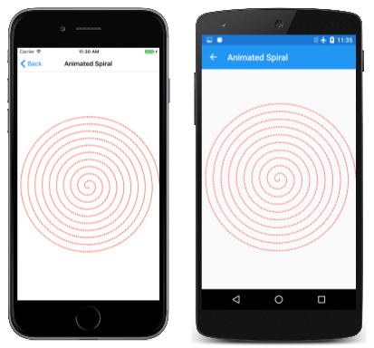

# Dots and Dashes in SkiaSharp

_Master the intricacies of drawing dotted and dashed lines in SkiaSharp_

SkiaSharp lets you draw lines that are not solid but instead are composed of dots and dashes:


You do this with a *path effect*, which is an instance of the [`SKPathEffect`](xref:SkiaSharp.SKPathEffect) class that you set to the [`PathEffect`](xref:SkiaSharp.SKPaint.PathEffect) property of `SKPaint`. You can create a path effect (or combine path effects) using one of the static creation methods defined by `SKPathEffect`. (`SKPathEffect` is one of six effects supported by SkiaSharp; the others are described in the section [**SkiaSharp Effect**](../effects/index.md).)

To draw dotted or dashed lines, you use the [`SKPathEffect.CreateDash`](xref:SkiaSharp.SKPathEffect.CreateDash(System.Single[],System.Single)) static method. There are two arguments: This first is an array of `float` values that indicate the lengths of the dots and dashes and the length of the spaces between them. This array must have an even number of elements, and there should be at least two elements. (There can be zero elements in the array but that results in a solid line.) If there are two elements, the first is the length of a dot or dash, and the second is the length of the gap before the next dot or dash. If there are more than two elements, then they are in this order: dash length, gap length, dash length, gap length, and so on.

Generally, you'll want to make the dash and gap lengths a multiple of the stroke width. If the stroke width is 10 pixels, for example, then the array { 10, 10 } will draw a dotted line where the dots and gaps are the same length as the stroke thickness.

However, the `StrokeCap` setting of the `SKPaint` object also affects these dots and dashes. As you'll see shortly, that has an impact on the elements of this array.

Dotted and dashed lines are demonstrated on the **Dots and Dashes** page. The [**DotsAndDashesPage.xaml**](https://github.com/xamarin/xamarin-forms-samples/blob/master/SkiaSharpForms/Demos/Demos/SkiaSharpFormsDemos/Paths/DotsAndDashesPage.xaml) file instantiates two `Picker` views, one for letting you select a stroke cap and the second to select a dash array:

```xaml
<ContentPage xmlns="http://xamarin.com/schemas/2014/forms"
             xmlns:x="http://schemas.microsoft.com/winfx/2009/xaml"
             xmlns:skia="clr-namespace:SkiaSharp;assembly=SkiaSharp"
             xmlns:skiaforms="clr-namespace:SkiaSharp.Views.Forms;assembly=SkiaSharp.Views.Forms"
             x:Class="SkiaSharpFormsDemos.Paths.DotsAndDashesPage"
             Title="Dots and Dashes">
    <Grid>
        <Grid.RowDefinitions>
            <RowDefinition Height="Auto" />
            <RowDefinition Height="*" />
        </Grid.RowDefinitions>

        <Grid.ColumnDefinitions>
            <ColumnDefinition Width="*" />
            <ColumnDefinition Width="*" />
        </Grid.ColumnDefinitions>

        <Picker x:Name="strokeCapPicker"
                Title="Stroke Cap"
                Grid.Row="0"
                Grid.Column="0"
                SelectedIndexChanged="OnPickerSelectedIndexChanged">
            <Picker.ItemsSource>
                <x:Array Type="{x:Type skia:SKStrokeCap}">
                    <x:Static Member="skia:SKStrokeCap.Butt" />
                    <x:Static Member="skia:SKStrokeCap.Round" />
                    <x:Static Member="skia:SKStrokeCap.Square" />
                </x:Array>
            </Picker.ItemsSource>
            <Picker.SelectedIndex>
                0
            </Picker.SelectedIndex>
        </Picker>

        <Picker x:Name="dashArrayPicker"
                Title="Dash Array"
                Grid.Row="0"
                Grid.Column="1"
                SelectedIndexChanged="OnPickerSelectedIndexChanged">
            <Picker.ItemsSource>
                <x:Array Type="{x:Type x:String}">
                    <x:String>10, 10</x:String>
                    <x:String>30, 10</x:String>
                    <x:String>10, 10, 30, 10</x:String>
                    <x:String>0, 20</x:String>
                    <x:String>20, 20</x:String>
                    <x:String>0, 20, 20, 20</x:String>
                </x:Array>
            </Picker.ItemsSource>
            <Picker.SelectedIndex>
                0
            </Picker.SelectedIndex>
        </Picker>

        <skiaforms:SKCanvasView x:Name="canvasView"
                                PaintSurface="OnCanvasViewPaintSurface"
                                Grid.Row="1"
                                Grid.Column="0"
                                Grid.ColumnSpan="2" />
    </Grid>
</ContentPage>
```

 The first three items in the `dashArrayPicker` assume that the stroke width is 10 pixels. The { 10, 10 } array is for a dotted line, { 30, 10 } is for a dashed line, and { 10, 10, 30, 10 } is for a dot-and-dash line. (The other three will be discussed shortly.)

The [`DotsAndDashesPage`](https://github.com/xamarin/xamarin-forms-samples/blob/master/SkiaSharpForms/Demos/Demos/SkiaSharpFormsDemos/Paths/DotsAndDashesPage.xaml.cs) code-behind file contains the `PaintSurface` event handler and a couple of helper routines for accessing the `Picker` views:

```csharp
void OnCanvasViewPaintSurface(object sender, SKPaintSurfaceEventArgs args)
{
    SKImageInfo info = args.Info;
    SKSurface surface = args.Surface;
    SKCanvas canvas = surface.Canvas;

    canvas.Clear();

    SKPaint paint = new SKPaint
    {
        Style = SKPaintStyle.Stroke,
        Color = SKColors.Blue,
        StrokeWidth = 10,
        StrokeCap = (SKStrokeCap)strokeCapPicker.SelectedItem,
        PathEffect = SKPathEffect.CreateDash(GetPickerArray(dashArrayPicker), 20)
    };

    SKPath path = new SKPath();
    path.MoveTo(0.2f * info.Width, 0.2f * info.Height);
    path.LineTo(0.8f * info.Width, 0.8f * info.Height);
    path.LineTo(0.2f * info.Width, 0.8f * info.Height);
    path.LineTo(0.8f * info.Width, 0.2f * info.Height);

    canvas.DrawPath(path, paint);
}

float[] GetPickerArray(Picker picker)
{
    if (picker.SelectedIndex == -1)
    {
        return new float[0];
    }

    string str = (string)picker.SelectedItem;
    string[] strs = str.Split(new char[] { ' ', ',' }, StringSplitOptions.RemoveEmptyEntries);
    float[] array = new float[strs.Length];

    for (int i = 0; i < strs.Length; i++)
    {
        array[i] = Convert.ToSingle(strs[i]);
    }
    return array;
}
```

In the following screenshots, the iOS screen on the far left shows a dotted line:

[](dots-images/dotsanddashes-large.png#lightbox "Triple screenshot of the Dots and Dashes page")

However, the Android screen is also supposed to show a dotted line using the array { 10, 10 } but instead the line is solid. What happened? The problem is that the Android screen also has a stroke caps setting of `Square`. This extends all the dashes by half the stroke width, causing them to fill up the gaps.

To get around this problem when using a stroke cap of `Square` or `Round`, you must decrease the dash lengths in the array by the stroke length (sometimes resulting in a dash length of 0), and increase the gap lengths by the stroke length. This is how the final three dash arrays in the `Picker` in the XAML file were calculated:

- { 10, 10 } becomes { 0, 20 } for a dotted line
- { 30, 10 } becomes { 20, 20 } for a dashed line
- { 10, 10, 30, 10 } becomes { 0, 20, 20, 20} for a dotted and dashed line

The UWP screen shows that dotted and dashed line for a stroke cap of `Round`. The `Round` stroke cap often gives the best appearance of dots and dashes in thick lines.

So far no mention has been made of the second parameter to the `SKPathEffect.CreateDash` method. This parameter is named `phase` and it refers to an offset within the dot-and-dash pattern for the beginning of the line. For example, if the dash array is { 10, 10 } and the `phase` is 10, then the line begins with a gap rather than a dot.

One interesting application of the `phase` parameter is in an animation. The **Animated Spiral** page is similar to the **Archimedean Spiral** page, except that the [`AnimatedSpiralPage`](https://github.com/xamarin/xamarin-forms-samples/blob/master/SkiaSharpForms/Demos/Demos/SkiaSharpFormsDemos/Paths/AnimatedSpiralPage.cs) class animates the `phase` parameter using the Xamarin.Forms `Device.Timer` method:

```csharp
public class AnimatedSpiralPage : ContentPage
{
    const double cycleTime = 250;       // in milliseconds

    SKCanvasView canvasView;
    Stopwatch stopwatch = new Stopwatch();
    bool pageIsActive;
    float dashPhase;

    public AnimatedSpiralPage()
    {
        Title = "Animated Spiral";

        canvasView = new SKCanvasView();
        canvasView.PaintSurface += OnCanvasViewPaintSurface;
        Content = canvasView;
    }

    protected override void OnAppearing()
    {
        base.OnAppearing();
        pageIsActive = true;
        stopwatch.Start();

        Device.StartTimer(TimeSpan.FromMilliseconds(33), () =>
        {
            double t = stopwatch.Elapsed.TotalMilliseconds % cycleTime / cycleTime;
            dashPhase = (float)(10 * t);
            canvasView.InvalidateSurface();

            if (!pageIsActive)
            {
                stopwatch.Stop();
            }

            return pageIsActive;
        });
    }
    ···  
}
```

Of course, you'll have to actually run the program to see the animation:

[](dots-images/animatedspiral-large.png#lightbox "Triple screenshot of the Animated Spiral page")

## Related Links

- [SkiaSharp APIs](/dotnet/api/skiasharp)
