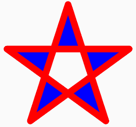

# The Path Fill Types

_Discover the different effects possible with SkiaSharp path fill types_

Two contours in a path can overlap, and the lines that make up a single contour can overlap. Any enclosed area can potentially be filled, but you might not want to fill all the enclosed areas. Here's an example:



You have a little control over this. The filling algorithm is governed by the [`SKFillType`](xref:SkiaSharp.SKPath.FillType) property of `SKPath`, which you set to a member of the [`SKPathFillType`](xref:SkiaSharp.SKPathFillType) enumeration:

- `Winding`, the default
- `EvenOdd`
- `InverseWinding`
- `InverseEvenOdd`

Both the winding and even-odd algorithms determine if any enclosed area is filled or not filled based on a hypothetical line drawn from that area to infinity. That line crosses one or more boundary lines that make up the path. With the winding mode, if the number of boundary lines drawn in one direction balance out the number of lines drawn in the other direction, then the area is not filled. Otherwise the area is filled. The even-odd algorithm fills an area if the number of boundary lines is odd.

With many routine paths, the winding algorithm often fills all the enclosed areas of a path. The even-odd algorithm generally produces more interesting results.

The classic example is a five-pointed star, as demonstrated in the **Five-Pointed Star** page. The [**FivePointedStarPage.xaml**](https://github.com/mono/SkiaSharp/blob/docs/samples/Demos/Demos/SkiaSharpFormsDemos/Paths/FivePointedStarPage.xaml) file instantiates two `Picker` views to select the path fill type and whether the path is stroked or filled or both, and in what order:

```xaml
<ContentPage xmlns="http://schemas.microsoft.com/dotnet/2021/maui"
             xmlns:x="http://schemas.microsoft.com/winfx/2009/xaml"
             xmlns:skia="clr-namespace:SkiaSharp;assembly=SkiaSharp"
             xmlns:skiaforms="clr-namespace:SkiaSharp.Views.Maui.Controls;assembly=SkiaSharp.Views.Maui.Controls"
             x:Class="SkiaSharpFormsDemos.Paths.FivePointedStarPage"
             Title="Five-Pointed Star">
    <Grid>
        <Grid.RowDefinitions>
            <RowDefinition Height="Auto" />
            <RowDefinition Height="*" />
        </Grid.RowDefinitions>

        <Grid.ColumnDefinitions>
            <ColumnDefinition Width="*" />
            <ColumnDefinition Width="*" />
        </Grid.ColumnDefinitions>

        <Picker x:Name="fillTypePicker"
                Title="Path Fill Type"
                Grid.Row="0"
                Grid.Column="0"
                Margin="10"
                SelectedIndexChanged="OnPickerSelectedIndexChanged">
            <Picker.ItemsSource>
                <x:Array Type="{x:Type skia:SKPathFillType}">
                    <x:Static Member="skia:SKPathFillType.Winding" />
                    <x:Static Member="skia:SKPathFillType.EvenOdd" />
                    <x:Static Member="skia:SKPathFillType.InverseWinding" />
                    <x:Static Member="skia:SKPathFillType.InverseEvenOdd" />
                </x:Array>
            </Picker.ItemsSource>
            <Picker.SelectedIndex>
                0
            </Picker.SelectedIndex>
        </Picker>

        <Picker x:Name="drawingModePicker"
                Title="Drawing Mode"
                Grid.Row="0"
                Grid.Column="1"
                Margin="10"
                SelectedIndexChanged="OnPickerSelectedIndexChanged">
            <Picker.ItemsSource>
                <x:Array Type="{x:Type x:String}">
                    <x:String>Fill only</x:String>
                    <x:String>Stroke only</x:String>
                    <x:String>Stroke then Fill</x:String>
                    <x:String>Fill then Stroke</x:String>
                </x:Array>
            </Picker.ItemsSource>
            <Picker.SelectedIndex>
                0
            </Picker.SelectedIndex>
        </Picker>

        <skiaforms:SKCanvasView x:Name="canvasView"
                                Grid.Row="1"
                                Grid.Column="0"
                                Grid.ColumnSpan="2"
                                PaintSurface="OnCanvasViewPaintSurface" />
    </Grid>
</ContentPage>
```

The code-behind file uses both `Picker` values to draw a five-pointed star:

```csharp
void OnCanvasViewPaintSurface(object sender, SKPaintSurfaceEventArgs args)
{
    SKImageInfo info = args.Info;
    SKSurface surface = args.Surface;
    SKCanvas canvas = surface.Canvas;

    canvas.Clear();

    SKPoint center = new SKPoint(info.Width / 2, info.Height / 2);
    float radius = 0.45f * Math.Min(info.Width, info.Height);

    SKPath path = new SKPath
    {
        FillType = (SKPathFillType)fillTypePicker.SelectedItem
    };
    path.MoveTo(info.Width / 2, info.Height / 2 - radius);

    for (int i = 1; i < 5; i++)
    {
        // angle from vertical
        double angle = i * 4 * Math.PI / 5;
        path.LineTo(center + new SKPoint(radius * (float)Math.Sin(angle),
                                        -radius * (float)Math.Cos(angle)));
    }
    path.Close();

    SKPaint strokePaint = new SKPaint
    {
        Style = SKPaintStyle.Stroke,
        Color = SKColors.Red,
        StrokeWidth = 50,
        StrokeJoin = SKStrokeJoin.Round
    };

    SKPaint fillPaint = new SKPaint
    {
        Style = SKPaintStyle.Fill,
        Color = SKColors.Blue
    };

    switch ((string)drawingModePicker.SelectedItem)
    {
        case "Fill only":
            canvas.DrawPath(path, fillPaint);
            break;

        case "Stroke only":
            canvas.DrawPath(path, strokePaint);
            break;

        case "Stroke then Fill":
            canvas.DrawPath(path, strokePaint);
            canvas.DrawPath(path, fillPaint);
            break;

        case "Fill then Stroke":
            canvas.DrawPath(path, fillPaint);
            canvas.DrawPath(path, strokePaint);
            break;
    }
}
```

Normally, the path fill type should affect only fills and not strokes, but the two `Inverse` modes affect both fills and strokes. For fills, the two `Inverse` types fill areas oppositely so that the area outside the star is filled. For strokes, the two `Inverse` types color everything except the stroke. Using these inverse fill types can produce some odd effects, as the iOS screenshot demonstrates:

[](fill-types-images/fivepointedstar-large.png#lightbox "Triple screenshot of the Five-Pointed Star page")

The Android screenshot show the typical even-odd and winding effects, but the order of the stroke and fill also affects the results.

The winding algorithm is dependent on the direction that lines are drawn. Usually when you're creating a path, you can control that direction as you specify that lines are drawn from one point to another. However, the `SKPath` class also defines methods like `AddRect` and `AddCircle` that draw entire contours. To control how these objects are drawn, the methods include a parameter of type [`SKPathDirection`](xref:SkiaSharp.SKPathDirection), which has two members:

- `Clockwise`
- `CounterClockwise`

The methods in `SKPath` that include an `SKPathDirection` parameter give it a default value of `Clockwise`.

The **Overlapping Circles** page creates a path with four overlapping circles with an even-odd path fill type:

```csharp
void OnCanvasViewPaintSurface(object sender, SKPaintSurfaceEventArgs args)
{
    SKImageInfo info = args.Info;
    SKSurface surface = args.Surface;
    SKCanvas canvas = surface.Canvas;

    canvas.Clear();

    SKPoint center = new SKPoint(info.Width / 2, info.Height / 2);
    float radius = Math.Min(info.Width, info.Height) / 4;

    SKPath path = new SKPath
    {
        FillType = SKPathFillType.EvenOdd
    };

    path.AddCircle(center.X - radius / 2, center.Y - radius / 2, radius);
    path.AddCircle(center.X - radius / 2, center.Y + radius / 2, radius);
    path.AddCircle(center.X + radius / 2, center.Y - radius / 2, radius);
    path.AddCircle(center.X + radius / 2, center.Y + radius / 2, radius);

    SKPaint paint = new SKPaint()
    {
        Style = SKPaintStyle.Fill,
        Color = SKColors.Cyan
    };

    canvas.DrawPath(path, paint);

    paint.Style = SKPaintStyle.Stroke;
    paint.StrokeWidth = 10;
    paint.Color = SKColors.Magenta;

    canvas.DrawPath(path, paint);
}
```

It's an interesting image created with a minimum of code:

[](fill-types-images/overlappingcircles-large.png#lightbox "Triple screenshot of the Overlapping Circles page")

## Related Links

- [SkiaSharp APIs](/dotnet/api/skiasharp)
