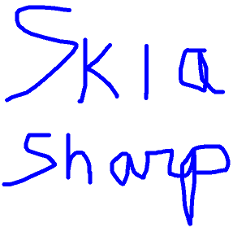
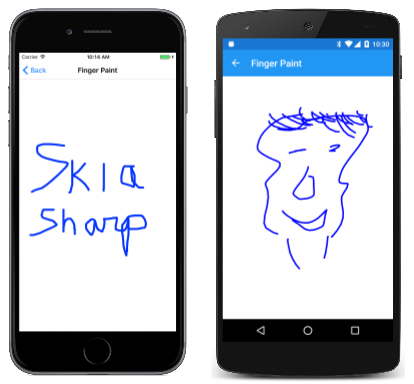

# Finger Painting in SkiaSharp

_Use your fingers to paint on the canvas._

An `SKPath` object can be continually updated and displayed. This feature allows a path to be used for interactive drawing, such as in a finger-painting program.



The `SKCanvasView` has built-in touch support that allows tracking individual fingers on the screen. By setting `EnableTouchEvents="True"` and handling the `Touch` event, you can easily implement multi-touch drawing scenarios.

The **Finger Paint** page in **SkiaSharpFormsDemos** is a simplified implementation of finger painting. It does not allow selecting color or stroke width, it has no way to clear the canvas, and of course you can't save your artwork.

The [**FingerPaintPage.xaml**](https://github.com/mono/SkiaSharp/blob/docs/samples/DocsSamplesApp/DocsSamplesApp/Paths/FingerPaintPage.xaml) file defines the `SKCanvasView` with touch events enabled:

```xaml
<ContentPage xmlns="http://schemas.microsoft.com/dotnet/2021/maui"
             xmlns:x="http://schemas.microsoft.com/winfx/2009/xaml"
             xmlns:skia="clr-namespace:SkiaSharp.Views.Maui.Controls;assembly=SkiaSharp.Views.Maui.Controls"
             x:Class="SkiaSharpFormsDemos.Paths.FingerPaintPage"
             Title="Finger Paint">

    <Grid BackgroundColor="White">
        <skia:SKCanvasView x:Name="canvasView"
                           EnableTouchEvents="True"
                           Touch="OnTouch"
                           PaintSurface="OnCanvasViewPaintSurface" />
    </Grid>
</ContentPage>
```

The `EnableTouchEvents` property enables touch tracking, and the `Touch` event is raised for each touch action.

The  [**FingerPaintPage.xaml.cs**](https://github.com/mono/SkiaSharp/blob/docs/samples/DocsSamplesApp/DocsSamplesApp/Paths/FingerPaintPage.xaml.cs) code-behind file defines two collections for storing the `SKPath` objects, as well as an `SKPaint` object for rendering these paths:

```csharp
public partial class FingerPaintPage : ContentPage
{
    Dictionary<long, SKPath> inProgressPaths = new Dictionary<long, SKPath>();
    List<SKPath> completedPaths = new List<SKPath>();

    SKPaint paint = new SKPaint
    {
        Style = SKPaintStyle.Stroke,
        Color = SKColors.Blue,
        StrokeWidth = 10,
        StrokeCap = SKStrokeCap.Round,
        StrokeJoin = SKStrokeJoin.Round
    };

    public FingerPaintPage()
    {
        InitializeComponent();
    }
    ...
}
```

As the name suggests, the `inProgressPaths` dictionary stores the paths that are currently being drawn by one or more fingers. The dictionary key is the touch ID that accompanies the touch events. The `completedPaths` field is a collection of paths that were finished when a finger that was drawing the path lifted from the screen.

The `Touch` handler manages these two collections. When a finger first touches the screen, a new `SKPath` is added to `inProgressPaths`. As that finger moves, additional points are added to the path. When the finger is released, the path is transferred to the `completedPaths` collection. You can paint with multiple fingers simultaneously. After each change to one of the paths or collections, the `SKCanvasView` is invalidated:

```csharp
public partial class FingerPaintPage : ContentPage
{
    ...
    void OnTouch(object? sender, SKTouchEventArgs e)
    {
        switch (e.ActionType)
        {
            case SKTouchAction.Pressed:
                if (!inProgressPaths.ContainsKey(e.Id))
                {
                    SKPath path = new SKPath();
                    path.MoveTo(e.Location);
                    inProgressPaths.Add(e.Id, path);
                    canvasView.InvalidateSurface();
                }
                break;

            case SKTouchAction.Moved:
                if (inProgressPaths.ContainsKey(e.Id))
                {
                    SKPath path = inProgressPaths[e.Id];
                    path.LineTo(e.Location);
                    canvasView.InvalidateSurface();
                }
                break;

            case SKTouchAction.Released:
                if (inProgressPaths.ContainsKey(e.Id))
                {
                    completedPaths.Add(inProgressPaths[e.Id]);
                    inProgressPaths.Remove(e.Id);
                    canvasView.InvalidateSurface();
                }
                break;

            case SKTouchAction.Cancelled:
                if (inProgressPaths.ContainsKey(e.Id))
                {
                    inProgressPaths.Remove(e.Id);
                    canvasView.InvalidateSurface();
                }
                break;
        }
        e.Handled = true;
    }
    ...
}
```

The `e.Location` property provides the touch location already in pixel coordinates, so no conversion is necessary. Setting `e.Handled = true` ensures that the view continues to receive touch events for the same finger.

The `PaintSurface` handler then simply renders both collections of paths. The earlier completed paths appear underneath the paths in progress:

```csharp
public partial class FingerPaintPage : ContentPage
{
    ...
    void OnCanvasViewPaintSurface(object? sender, SKPaintSurfaceEventArgs args)
    {
        SKCanvas canvas = args.Surface.Canvas;
        canvas.Clear();

        foreach (SKPath path in completedPaths)
        {
            canvas.DrawPath(path, paint);
        }

        foreach (SKPath path in inProgressPaths.Values)
        {
            canvas.DrawPath(path, paint);
        }
    }
    ...
}
```

Your finger paintings are only limited by your talent:

[](finger-paint-images/fingerpaint-large.png#lightbox "Triple screenshot of the Finger Paint page")

You've now seen how to draw lines and to define curves using parametric equations. A later section on [**SkiaSharp Curves and Paths**](../curves/index.md) covers the various types of curves that `SKPath` supports. But a useful prerequisite is an exploration of [**SkiaSharp Transforms**](../transforms/index.md).

## Related Links

- [SkiaSharp APIs](/dotnet/api/skiasharp)
