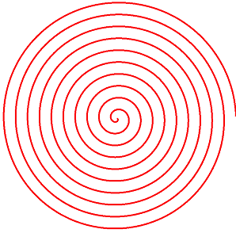
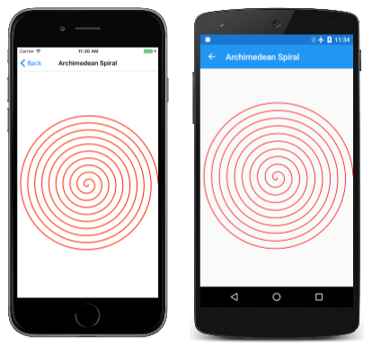

# Polylines and Parametric Equations

_Use SkiaSharp to render any line that you can define with parametric equations_

In the [**SkiaSharp Curves and Paths**](../curves/index.md) section of this guide, you'll see the various methods that [`SKPath`](xref:SkiaSharp.SKPath) defines to render certain types of curves. However, it's sometimes necessary to draw a type of curve that isn't directly supported by `SKPath`. In such a case, you can use a polyline (a collection of connected lines) to draw any curve that you can mathematically define. If you make the lines small enough and numerous enough, the result will look like a curve. This spiral is actually 3,600 little lines:



Generally it's best to define a curve in terms of a pair of parametric equations. These are equations for X and Y coordinates that depend on a third variable, sometimes called `t` for time. For example, the following parametric equations define a circle with a radius of 1 centered at the point (0, 0) for *t* from 0 to 1:

`x = cos(2πt)`

`y = sin(2πt)`

 If you want a radius larger than 1, you can simply multiply the sine and cosine values by that radius, and if you need to move the center to another location, add those values:

`x = xCenter + radius·cos(2πt)`

`y = yCenter + radius·sin(2πt)`

For an ellipse with the axes parallel to the horizontal and vertical, two radii are involved:

`x = xCenter + xRadius·cos(2πt)`

`y = yCenter + yRadius·sin(2πt)`

You can then put the equivalent SkiaSharp code in a loop that calculates the various points and adds those to a path. The following SkiaSharp code creates an `SKPath` object for an ellipse that fills the display surface. The loop cycles through the 360 degrees directly. The center is half the width and height of the display surface, and so are the two radii:

```csharp
SKPath path = new SKPath();

for (float angle = 0; angle < 360; angle += 1)
{
    double radians = Math.PI * angle / 180;
    float x = info.Width / 2 + (info.Width / 2) * (float)Math.Cos(radians);
    float y = info.Height / 2 + (info.Height / 2) * (float)Math.Sin(radians);

    if (angle == 0)
    {
        path.MoveTo(x, y);
    }
    else
    {
        path.LineTo(x, y);
    }
}
path.Close();
```

This results in an ellipse defined by 360 little lines. When it's rendered, it appears smooth.

Of course, you don't need to create an ellipse using a polyline because `SKPath` includes an `AddOval` method that does it for you. But you might want to draw a visual object that is not provided by `SKPath`.

The **Archimedean Spiral** page has code that similar to the ellipse code but with a crucial difference. It loops around the 360 degrees of the circle 10 times, continuously adjusting the radius:

```csharp
void OnCanvasViewPaintSurface(object? sender, SKPaintSurfaceEventArgs args)
{
    SKImageInfo info = args.Info;
    SKSurface surface = args.Surface;
    SKCanvas canvas = surface.Canvas;

    canvas.Clear();

    SKPoint center = new SKPoint(info.Width / 2, info.Height / 2);
    float radius = Math.Min(center.X, center.Y);

    using (SKPath path = new SKPath())
    {
        for (float angle = 0; angle < 3600; angle += 1)
        {
            float scaledRadius = radius * angle / 3600;
            double radians = Math.PI * angle / 180;
            float x = center.X + scaledRadius * (float)Math.Cos(radians);
            float y = center.Y + scaledRadius * (float)Math.Sin(radians);
            SKPoint point = new SKPoint(x, y);

            if (angle == 0)
            {
                path.MoveTo(point);
            }
            else
            {
                path.LineTo(point);
            }
        }

        SKPaint paint = new SKPaint
        {
            Style = SKPaintStyle.Stroke,
            Color = SKColors.Red,
            StrokeWidth = 5
        };

        canvas.DrawPath(path, paint);
    }
}
```

The result is also called an *arithmetic spiral* because the offset between each loop is constant:

[](polylines-images/archimedeanspiral-large.png#lightbox "Triple screenshot of the Archimedean Spiral page")

Notice that the `SKPath` is created in a `using` block. This `SKPath` consumes more memory than the `SKPath` objects in the previous programs, which suggests that a `using` block is more appropriate to dispose any unmanaged resources.

## Related Links

- [SkiaSharp APIs](/dotnet/api/skiasharp)
